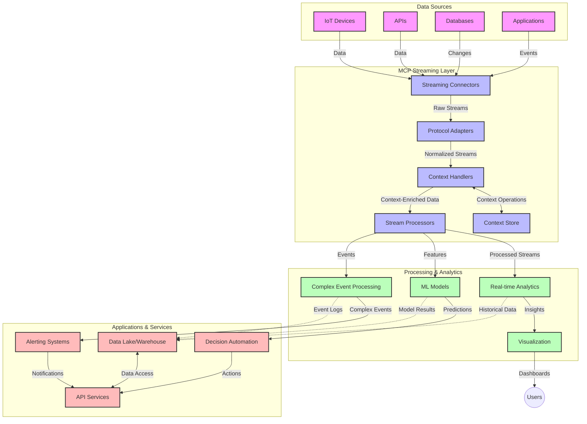

<!--
CO_OP_TRANSLATOR_METADATA:
{
  "original_hash": "b41174ac781ebf228b2043cbdfc09105",
  "translation_date": "2025-06-12T00:21:29+00:00",
  "source_file": "05-AdvancedTopics/mcp-realtimestreaming/README.md",
  "language_code": "ko"
}
-->
# Model Context Protocol for Real-Time Data Streaming

## 개요

실시간 데이터 스트리밍은 오늘날 데이터 중심 환경에서 즉각적인 정보 접근을 통해 신속한 의사결정을 가능하게 하는 필수 기술이 되었습니다. Model Context Protocol(MCP)은 이러한 실시간 스트리밍 과정을 최적화하여 데이터 처리 효율성을 높이고, 맥락의 연속성을 유지하며, 시스템 전반의 성능을 향상시키는 중요한 진보를 의미합니다.

이 모듈에서는 MCP가 AI 모델, 스트리밍 플랫폼, 애플리케이션 전반에 걸쳐 맥락 관리를 표준화함으로써 실시간 데이터 스트리밍을 어떻게 혁신하는지 살펴봅니다.

## 실시간 데이터 스트리밍 소개

실시간 데이터 스트리밍은 데이터가 생성됨과 동시에 연속적으로 전송, 처리, 분석할 수 있게 하는 기술 패러다임으로, 시스템이 새로운 정보에 즉각 대응할 수 있도록 합니다. 정적인 데이터셋을 일괄 처리하는 전통적 방식과 달리, 스트리밍은 움직이는 데이터를 실시간으로 처리하여 지연 시간을 최소화합니다.

### 실시간 데이터 스트리밍의 핵심 개념:

- **연속적인 데이터 흐름**: 이벤트나 레코드가 끊임없이 이어지는 스트림으로 처리됩니다.
- **저지연 처리**: 데이터 생성과 처리 사이의 시간을 최소화합니다.
- **확장성**: 다양한 데이터 양과 속도를 감당할 수 있어야 합니다.
- **장애 내성**: 데이터 흐름이 중단되지 않도록 시스템이 견고해야 합니다.
- **상태 기반 처리**: 이벤트 간 맥락을 유지하는 것이 의미 있는 분석에 필수적입니다.

### Model Context Protocol과 실시간 스트리밍

Model Context Protocol(MCP)은 실시간 스트리밍 환경에서 다음과 같은 주요 과제를 해결합니다:

1. **맥락의 연속성**: 분산된 스트리밍 구성 요소 간 맥락 유지 방식을 표준화하여 AI 모델과 처리 노드가 관련된 과거 및 환경 정보를 활용할 수 있도록 합니다.

2. **효율적인 상태 관리**: 구조화된 맥락 전송 메커니즘을 제공해 스트리밍 파이프라인 내 상태 관리 부담을 줄입니다.

3. **상호운용성**: 다양한 스트리밍 기술과 AI 모델 간 맥락 공유를 위한 공통 언어를 만들어 유연하고 확장 가능한 아키텍처를 지원합니다.

4. **스트리밍 최적화 맥락**: 실시간 의사결정에 가장 중요한 맥락 요소를 우선순위로 두어 성능과 정확성을 동시에 최적화합니다.

5. **적응형 처리**: MCP를 통한 맥락 관리로 데이터 내 변화하는 조건과 패턴에 따라 스트리밍 시스템이 동적으로 처리 방식을 조정할 수 있습니다.

IoT 센서 네트워크부터 금융 거래 플랫폼에 이르기까지 현대 애플리케이션에서 MCP와 스트리밍 기술의 통합은 복잡하고 변화하는 상황에 실시간으로 적절히 대응하는 지능적이고 맥락 인지형 처리를 가능하게 합니다.

## 학습 목표

이 수업을 마치면 다음을 할 수 있습니다:

- 실시간 데이터 스트리밍의 기본 원리와 도전 과제 이해
- Model Context Protocol(MCP)이 실시간 데이터 스트리밍을 어떻게 향상시키는지 설명
- Kafka, Pulsar 등 인기 프레임워크를 활용한 MCP 기반 스트리밍 솔루션 구현
- MCP를 활용한 장애 내성 및 고성능 스트리밍 아키텍처 설계 및 배포
- IoT, 금융 거래, AI 기반 분석 사례에 MCP 개념 적용
- MCP 기반 스트리밍 기술의 최신 동향과 미래 혁신 평가

### 정의와 중요성

실시간 데이터 스트리밍은 최소한의 지연으로 데이터가 연속적으로 생성, 처리, 전달되는 것을 의미합니다. 배치 처리처럼 데이터를 모아서 처리하는 대신, 데이터가 도착하는 즉시 점진적으로 처리하여 즉각적인 통찰과 행동을 가능하게 합니다.

실시간 데이터 스트리밍의 주요 특징:

- **저지연**: 데이터 처리와 분석이 밀리초에서 초 단위로 이루어짐
- **연속 흐름**: 다양한 출처로부터 끊김 없는 데이터 스트림
- **즉시 처리**: 배치가 아닌 도착 즉시 데이터 분석
- **이벤트 기반 아키텍처**: 발생하는 이벤트에 실시간 대응

### 전통적 데이터 스트리밍의 과제

기존 데이터 스트리밍 방식은 다음과 같은 한계가 있습니다:

1. **맥락 손실**: 분산 시스템 간 맥락 유지의 어려움
2. **확장성 문제**: 대량, 고속 데이터 처리 확장에 대한 도전
3. **통합 복잡성**: 서로 다른 시스템 간 상호운용성 문제
4. **지연 관리**: 처리 시간과 처리량 간 균형 조정
5. **데이터 일관성**: 스트림 전반에 걸쳐 정확성과 완전성 보장

## Model Context Protocol (MCP) 이해

### MCP란 무엇인가?

Model Context Protocol(MCP)은 AI 모델과 애플리케이션 간 효율적인 상호작용을 지원하는 표준화된 통신 프로토콜입니다. 실시간 데이터 스트리밍 환경에서 MCP는 다음을 제공합니다:

- 데이터 파이프라인 전반에 걸친 맥락 보존
- 데이터 교환 형식의 표준화
- 대용량 데이터 전송 최적화
- 모델 간 및 모델과 애플리케이션 간 통신 강화

### 핵심 구성 요소 및 아키텍처

실시간 스트리밍을 위한 MCP 아키텍처는 다음 주요 구성 요소로 이루어져 있습니다:

1. **Context Handlers**: 스트리밍 파이프라인 전반의 맥락 정보를 관리 및 유지
2. **Stream Processors**: 맥락 인지 기법을 활용해 들어오는 데이터 스트림 처리
3. **Protocol Adapters**: 다양한 스트리밍 프로토콜 간 변환 시 맥락 보존
4. **Context Store**: 맥락 정보를 효율적으로 저장하고 검색
5. **Streaming Connectors**: Kafka, Pulsar, Kinesis 등 다양한 스트리밍 플랫폼과 연결



### MCP가 실시간 데이터 처리에 기여하는 바

MCP는 전통적 스트리밍 문제를 다음과 같이 개선합니다:

- **맥락 무결성**: 데이터 포인트 간 관계를 파이프라인 전반에 걸쳐 유지
- **전송 최적화**: 지능적 맥락 관리로 데이터 중복 제거
- **표준화된 인터페이스**: 스트리밍 구성 요소에 일관된 API 제공
- **지연 감소**: 효율적 맥락 처리로 오버헤드 최소화
- **확장성 향상**: 맥락을 유지하며 수평 확장 지원

## 통합 및 구현

실시간 데이터 스트리밍 시스템은 성능과 맥락 무결성을 모두 유지하기 위해 신중한 아키텍처 설계와 구현이 필요합니다. Model Context Protocol은 AI 모델과 스트리밍 기술을 통합하는 표준화된 접근법을 제공하여 더 정교하고 맥락 인지형 처리 파이프라인을 가능하게 합니다.

### 스트리밍 아키텍처에서 MCP 통합 개요

실시간 스트리밍 환경에서 MCP 구현 시 고려할 주요 사항:

1. **맥락 직렬화 및 전송**: MCP는 스트리밍 데이터 패킷 내에 맥락 정보를 효율적으로 인코딩하는 메커니즘을 제공하여 필수 맥락이 처리 파이프라인 전반에 걸쳐 함께 전달되도록 합니다. 여기에는 스트리밍 전송에 최적화된 표준 직렬화 형식이 포함됩니다.

2. **상태 기반 스트림 처리**: MCP는 처리 노드 간 일관된 맥락 표현을 유지하여 더 지능적인 상태 기반 처리를 가능하게 합니다. 이는 전통적으로 상태 관리가 어려운 분산 스트리밍 아키텍처에서 특히 중요합니다.

3. **이벤트 시간과 처리 시간**: MCP 구현은 이벤트 발생 시점과 처리 시점을 구분하는 일반적 문제를 다룹니다. 프로토콜은 이벤트 시간 의미를 보존하는 시간적 맥락을 포함할 수 있습니다.

4. **역압력 관리**: 표준화된 맥락 처리를 통해 MCP는 스트리밍 시스템 내 역압력을 관리하며, 구성 요소들이 처리 능력을 소통하고 흐름을 조절할 수 있도록 합니다.

5. **맥락 윈도잉 및 집계**: MCP는 시간적 및 관계적 맥락의 구조화된 표현을 제공하여 이벤트 스트림 전반에 걸친 더 의미 있는 집계와 윈도우 연산을 지원합니다.

6. **정확히 한 번 처리**: 정확히 한 번 처리 의미론이 필요한 스트리밍 시스템에서 MCP는 처리 상태를 추적하고 검증하는 메타데이터를 포함할 수 있습니다.

다양한 스트리밍 기술 전반에 걸친 MCP 구현은 맥락 관리에 통합된 접근법을 제공하여 맞춤형 통합 코드 필요성을 줄이고 데이터가 파이프라인을 통과할 때 의미 있는 맥락을 유지하는 시스템 능력을 강화합니다.

### 다양한 데이터 스트리밍 프레임워크에서의 MCP

다음 예제들은 JSON-RPC 기반 프로토콜과 다양한 전송 메커니즘을 사용하는 현재 MCP 명세를 따릅니다. 코드에서는 Kafka와 Pulsar 같은 스트리밍 플랫폼과 완전한 MCP 호환성을 유지하며 통합하는 맞춤형 전송 구현 방법을 보여줍니다.

이 예제들은 MCP 핵심인 맥락 인지를 유지하면서 실시간 데이터 처리를 가능하게 하는 스트리밍 플랫폼 통합 방식을 설명하며, 2025년 6월 기준 MCP 명세 상태를 정확히 반영합니다.

MCP는 다음과 같은 인기 스트리밍 프레임워크와 통합할 수 있습니다:

#### Apache Kafka 통합

```python
import asyncio
import json
from typing import Dict, Any, Optional
from confluent_kafka import Consumer, Producer, KafkaError
from mcp.client import Client, ClientCapabilities
from mcp.core.message import JsonRpcMessage
from mcp.core.transports import Transport

# Custom transport class to bridge MCP with Kafka
class KafkaMCPTransport(Transport):
    def __init__(self, bootstrap_servers: str, input_topic: str, output_topic: str):
        self.bootstrap_servers = bootstrap_servers
        self.input_topic = input_topic
        self.output_topic = output_topic
        self.producer = Producer({'bootstrap.servers': bootstrap_servers})
        self.consumer = Consumer({
            'bootstrap.servers': bootstrap_servers,
            'group.id': 'mcp-client-group',
            'auto.offset.reset': 'earliest'
        })
        self.message_queue = asyncio.Queue()
        self.running = False
        self.consumer_task = None
        
    async def connect(self):
        """Connect to Kafka and start consuming messages"""
        self.consumer.subscribe([self.input_topic])
        self.running = True
        self.consumer_task = asyncio.create_task(self._consume_messages())
        return self
        
    async def _consume_messages(self):
        """Background task to consume messages from Kafka and queue them for processing"""
        while self.running:
            try:
                msg = self.consumer.poll(1.0)
                if msg is None:
                    await asyncio.sleep(0.1)
                    continue
                
                if msg.error():
                    if msg.error().code() == KafkaError._PARTITION_EOF:
                        continue
                    print(f"Consumer error: {msg.error()}")
                    continue
                
                # Parse the message value as JSON-RPC
                try:
                    message_str = msg.value().decode('utf-8')
                    message_data = json.loads(message_str)
                    mcp_message = JsonRpcMessage.from_dict(message_data)
                    await self.message_queue.put(mcp_message)
                except Exception as e:
                    print(f"Error parsing message: {e}")
            except Exception as e:
                print(f"Error in consumer loop: {e}")
                await asyncio.sleep(1)
    
    async def read(self) -> Optional[JsonRpcMessage]:
        """Read the next message from the queue"""
        try:
            message = await self.message_queue.get()
            return message
        except Exception as e:
            print(f"Error reading message: {e}")
            return None
    
    async def write(self, message: JsonRpcMessage) -> None:
        """Write a message to the Kafka output topic"""
        try:
            message_json = json.dumps(message.to_dict())
            self.producer.produce(
                self.output_topic,
                message_json.encode('utf-8'),
                callback=self._delivery_report
            )
            self.producer.poll(0)  # Trigger callbacks
        except Exception as e:
            print(f"Error writing message: {e}")
    
    def _delivery_report(self, err, msg):
        """Kafka producer delivery callback"""
        if err is not None:
            print(f'Message delivery failed: {err}')
        else:
            print(f'Message delivered to {msg.topic()} [{msg.partition()}]')
    
    async def close(self) -> None:
        """Close the transport"""
        self.running = False
        if self.consumer_task:
            self.consumer_task.cancel()
            try:
                await self.consumer_task
            except asyncio.CancelledError:
                pass
        self.consumer.close()
        self.producer.flush()

# Example usage of the Kafka MCP transport
async def kafka_mcp_example():
    # Create MCP client with Kafka transport
    client = Client(
        {"name": "kafka-mcp-client", "version": "1.0.0"},
        ClientCapabilities({})
    )
    
    # Create and connect the Kafka transport
    transport = KafkaMCPTransport(
        bootstrap_servers="localhost:9092",
        input_topic="mcp-responses",
        output_topic="mcp-requests"
    )
    
    await client.connect(transport)
    
    try:
        # Initialize the MCP session
        await client.initialize()
        
        # Example of executing a tool via MCP
        response = await client.execute_tool(
            "process_data",
            {
                "data": "sample data",
                "metadata": {
                    "source": "sensor-1",
                    "timestamp": "2025-06-12T10:30:00Z"
                }
            }
        )
        
        print(f"Tool execution response: {response}")
        
        # Clean shutdown
        await client.shutdown()
    finally:
        await transport.close()

# Run the example
if __name__ == "__main__":
    asyncio.run(kafka_mcp_example())
```

#### Apache Pulsar 구현

```python
import asyncio
import json
import pulsar
from typing import Dict, Any, Optional
from mcp.core.message import JsonRpcMessage
from mcp.core.transports import Transport
from mcp.server import Server, ServerOptions
from mcp.server.tools import Tool, ToolExecutionContext, ToolMetadata

# Create a custom MCP transport that uses Pulsar
class PulsarMCPTransport(Transport):
    def __init__(self, service_url: str, request_topic: str, response_topic: str):
        self.service_url = service_url
        self.request_topic = request_topic
        self.response_topic = response_topic
        self.client = pulsar.Client(service_url)
        self.producer = self.client.create_producer(response_topic)
        self.consumer = self.client.subscribe(
            request_topic,
            "mcp-server-subscription",
            consumer_type=pulsar.ConsumerType.Shared
        )
        self.message_queue = asyncio.Queue()
        self.running = False
        self.consumer_task = None
    
    async def connect(self):
        """Connect to Pulsar and start consuming messages"""
        self.running = True
        self.consumer_task = asyncio.create_task(self._consume_messages())
        return self
    
    async def _consume_messages(self):
        """Background task to consume messages from Pulsar and queue them for processing"""
        while self.running:
            try:
                # Non-blocking receive with timeout
                msg = self.consumer.receive(timeout_millis=500)
                
                # Process the message
                try:
                    message_str = msg.data().decode('utf-8')
                    message_data = json.loads(message_str)
                    mcp_message = JsonRpcMessage.from_dict(message_data)
                    await self.message_queue.put(mcp_message)
                    
                    # Acknowledge the message
                    self.consumer.acknowledge(msg)
                except Exception as e:
                    print(f"Error processing message: {e}")
                    # Negative acknowledge if there was an error
                    self.consumer.negative_acknowledge(msg)
            except Exception as e:
                # Handle timeout or other exceptions
                await asyncio.sleep(0.1)
    
    async def read(self) -> Optional[JsonRpcMessage]:
        """Read the next message from the queue"""
        try:
            message = await self.message_queue.get()
            return message
        except Exception as e:
            print(f"Error reading message: {e}")
            return None
    
    async def write(self, message: JsonRpcMessage) -> None:
        """Write a message to the Pulsar output topic"""
        try:
            message_json = json.dumps(message.to_dict())
            self.producer.send(message_json.encode('utf-8'))
        except Exception as e:
            print(f"Error writing message: {e}")
    
    async def close(self) -> None:
        """Close the transport"""
        self.running = False
        if self.consumer_task:
            self.consumer_task.cancel()
            try:
                await self.consumer_task
            except asyncio.CancelledError:
                pass
        self.consumer.close()
        self.producer.close()
        self.client.close()

# Define a sample MCP tool that processes streaming data
@Tool(
    name="process_streaming_data",
    description="Process streaming data with context preservation",
    metadata=ToolMetadata(
        required_capabilities=["streaming"]
    )
)
async def process_streaming_data(
    ctx: ToolExecutionContext,
    data: str,
    source: str,
    priority: str = "medium"
) -> Dict[str, Any]:
    """
    Process streaming data while preserving context
    
    Args:
        ctx: Tool execution context
        data: The data to process
        source: The source of the data
        priority: Priority level (low, medium, high)
        
    Returns:
        Dict containing processed results and context information
    """
    # Example processing that leverages MCP context
    print(f"Processing data from {source} with priority {priority}")
    
    # Access conversation context from MCP
    conversation_id = ctx.conversation_id if hasattr(ctx, 'conversation_id') else "unknown"
    
    # Return results with enhanced context
    return {
        "processed_data": f"Processed: {data}",
        "context": {
            "conversation_id": conversation_id,
            "source": source,
            "priority": priority,
            "processing_timestamp": ctx.get_current_time_iso()
        }
    }

# Example MCP server implementation using Pulsar transport
async def run_mcp_server_with_pulsar():
    # Create MCP server
    server = Server(
        {"name": "pulsar-mcp-server", "version": "1.0.0"},
        ServerOptions(
            capabilities={"streaming": True}
        )
    )
    
    # Register our tool
    server.register_tool(process_streaming_data)
    
    # Create and connect Pulsar transport
    transport = PulsarMCPTransport(
        service_url="pulsar://localhost:6650",
        request_topic="mcp-requests",
        response_topic="mcp-responses"
    )
    
    try:
        # Start the server with the Pulsar transport
        await server.run(transport)
    finally:
        await transport.close()

# Run the server
if __name__ == "__main__":
    asyncio.run(run_mcp_server_with_pulsar())
```

### 배포를 위한 모범 사례

MCP를 실시간 스트리밍에 구현할 때:

1. **장애 내성 설계**:
   - 적절한 오류 처리 구현
   - 실패 메시지를 위한 데드레터 큐 활용
   - 멱등성 프로세서 설계

2. **성능 최적화**:
   - 적절한 버퍼 크기 설정
   - 적절한 배치 처리 활용
   - 역압력 메커니즘 구현

3. **모니터링 및 관찰**:
   - 스트림 처리 지표 추적
   - 맥락 전파 모니터링
   - 이상 징후 알림 설정

4. **스트림 보안 강화**:
   - 민감 데이터 암호화 구현
   - 인증 및 권한 부여 적용
   - 적절한 접근 제어 적용

### IoT 및 엣지 컴퓨팅에서의 MCP

MCP는 IoT 스트리밍을 다음과 같이 향상시킵니다:

- 처리 파이프라인 전반에 걸친 디바이스 맥락 보존
- 엣지에서 클라우드로 효율적인 데이터 스트리밍 지원
- IoT 데이터 스트림에 대한 실시간 분석 지원
- 맥락 기반 디바이스 간 통신 촉진

예시: 스마트 시티 센서 네트워크  
```
Sensors → Edge Gateways → MCP Stream Processors → Real-time Analytics → Automated Responses
```

### 금융 거래 및 고빈도 거래에서의 역할

MCP는 금융 데이터 스트리밍에 다음과 같은 이점을 제공합니다:

- 거래 의사결정을 위한 초저지연 처리
- 처리 전반에 걸친 거래 맥락 유지
- 맥락 인지형 복잡 이벤트 처리 지원
- 분산 거래 시스템 간 데이터 일관성 보장

### AI 기반 데이터 분석 강화

MCP는 스트리밍 분석에 새로운 가능성을 열어줍니다:

- 실시간 모델 학습 및 추론
- 스트리밍 데이터로부터의 지속적 학습
- 맥락 인지형 특징 추출
- 맥락이 유지되는 다중 모델 추론 파이프라인

## 미래 동향과 혁신

### 실시간 환경에서의 MCP 진화

앞으로 MCP는 다음을 목표로 발전할 것으로 기대됩니다:

- **양자 컴퓨팅 통합**: 양자 기반 스트리밍 시스템 대비
- **엣지 네이티브 처리**: 엣지 디바이스에서 더 많은 맥락 인지 처리 이동
- **자율 스트림 관리**: 자체 최적화되는 스트리밍 파이프라인
- **연합 스트리밍**: 프라이버시를 유지하며 분산 처리

### 기술 발전 가능성

MCP 스트리밍의 미래를 이끌 신기술:

1. **AI 최적화 스트리밍 프로토콜**: AI 워크로드에 특화된 맞춤 프로토콜
2. **뉴로모픽 컴퓨팅 통합**: 뇌 신경망을 모방한 스트림 처리 기술
3. **서버리스 스트리밍**: 인프라 관리 없는 이벤트 기반 확장 스트리밍
4. **분산 맥락 저장소**: 전 세계 분산이면서도 높은 일관성을 갖춘 맥락 관리

## 실습 과제

### 과제 1: 기본 MCP 스트리밍 파이프라인 설정

이 과제에서는 다음을 배웁니다:  
- 기본 MCP 스트리밍 환경 구성  
- 스트림 처리용 맥락 핸들러 구현  
- 맥락 보존 테스트 및 검증  

### 과제 2: 실시간 분석 대시보드 구축

완성형 애플리케이션 제작:  
- MCP를 이용한 스트리밍 데이터 수집  
- 맥락을 유지하며 스트림 처리  
- 실시간 결과 시각화  

### 과제 3: MCP를 활용한 복잡 이벤트 처리 구현

고급 과제:  
- 스트림 내 패턴 탐지  
- 다중 스트림 간 맥락 상관관계  
- 보존된 맥락으로 복잡 이벤트 생성  

## 추가 자료

- [Model Context Protocol Specification](https://github.com/modelcontextprotocol) - 공식 MCP 명세 및 문서  
- [Apache Kafka Documentation](https://kafka.apache.org/documentation/) - Kafka 스트림 처리 학습  
- [Apache Pulsar](https://pulsar.apache.org/) - 통합 메시징 및 스트리밍 플랫폼  
- [Streaming Systems: The What, Where, When, and How of Large-Scale Data Processing](https://www.oreilly.com/library/view/streaming-systems/9781491983867/) - 스트리밍 아키텍처 종합서  
- [Microsoft Azure Event Hubs](https://learn.microsoft.com/azure/event-hubs/event-hubs-about) - 관리형 이벤트 스트리밍 서비스  
- [MLflow Documentation](https://mlflow.org/docs/latest/index.html) - ML 모델 추적 및 배포  
- [Real-Time Analytics with Apache Storm](https://storm.apache.org/releases/current/index.html) - 실시간 계산 처리 프레임워크  
- [Flink ML](https://nightlies.apache.org/flink/flink-ml-docs-master/) - Apache Flink용 머신러닝 라이브러리  
- [LangChain Documentation](https://python.langchain.com/docs/get_started/introduction) - LLM 기반 애플리케이션 구축  

## 학습 성과

이 모듈을 완료하면 다음을 할 수 있습니다:

- 실시간 데이터 스트리밍의 기본 원리와 과제 이해  
- Model Context Protocol(MCP)이 실시간 데이터 스트리밍을 어떻게 향상시키는지 설명  
- Kafka, Pulsar 같은 인기 프레임워크로 MCP 기반 스트리밍 솔루션 구현  
- MCP를 활용한 장애 내성 및 고성능 스트리밍 아키텍처 설계 및 배포  
- IoT, 금융 거래, AI 기반 분석 사례에 MCP 개념 적용  
- MCP 기반 스트리밍 기술의 최신 동향과 미래 혁신 평가  

## 다음 단계

- [6. Community Contributions](../../06-CommunityContributions/README.md)

**면책 조항**:  
이 문서는 AI 번역 서비스 [Co-op Translator](https://github.com/Azure/co-op-translator)를 사용하여 번역되었습니다. 정확성을 위해 노력하고 있으나, 자동 번역에는 오류나 부정확한 내용이 포함될 수 있음을 유의하시기 바랍니다. 원문 문서는 해당 언어의 원본이므로 권위 있는 자료로 간주되어야 합니다. 중요한 정보의 경우 전문적인 인간 번역을 권장합니다. 본 번역의 사용으로 인해 발생하는 오해나 잘못된 해석에 대해 당사는 책임을 지지 않습니다.