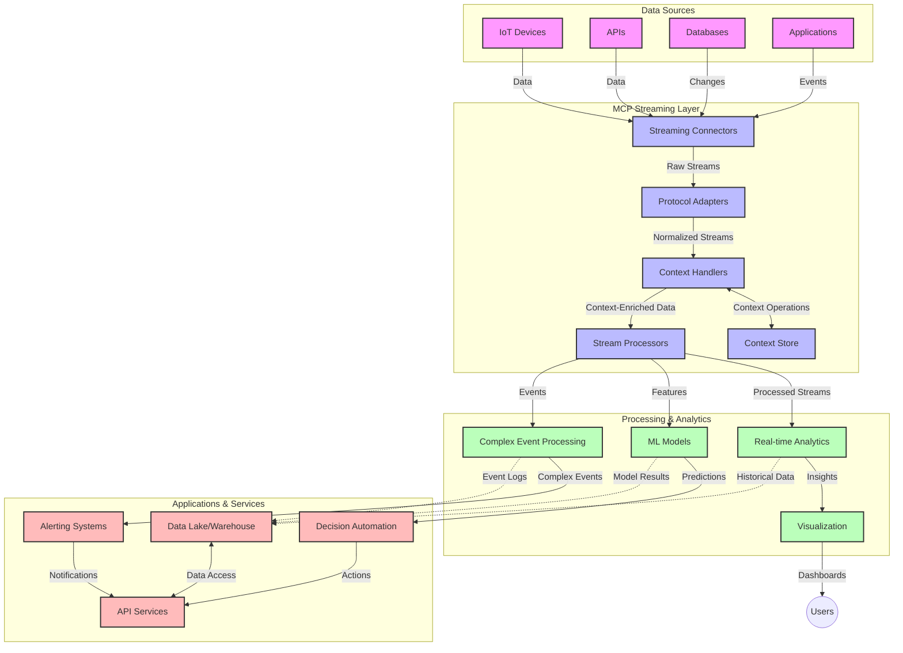

<!--
CO_OP_TRANSLATOR_METADATA:
{
  "original_hash": "68c518dbff8a3b127ed2aa934054c56c",
  "translation_date": "2025-06-11T17:04:00+00:00",
  "source_file": "05-AdvancedTopics/mcp-realtimestreaming/README.md",
  "language_code": "ko"
}
-->
# Model Context Protocol for Real-Time Data Streaming

## 개요

실시간 데이터 스트리밍은 오늘날 데이터 중심 세상에서 필수적이며, 비즈니스와 애플리케이션이 신속한 의사결정을 위해 즉각적인 정보 접근을 요구합니다. Model Context Protocol(MCP)은 이러한 실시간 스트리밍 프로세스를 최적화하는 데 중요한 진전을 이루어, 데이터 처리 효율성을 높이고 맥락의 일관성을 유지하며 전체 시스템 성능을 향상시킵니다.

이 모듈에서는 MCP가 AI 모델, 스트리밍 플랫폼, 애플리케이션 전반에 걸쳐 표준화된 맥락 관리 방식을 제공함으로써 실시간 데이터 스트리밍을 어떻게 혁신하는지 살펴봅니다.

## 실시간 데이터 스트리밍 소개

실시간 데이터 스트리밍은 데이터가 생성됨과 동시에 지속적으로 전송, 처리, 분석할 수 있게 하는 기술 패러다임으로, 시스템이 새로운 정보에 즉각적으로 반응할 수 있도록 합니다. 정적인 데이터셋을 대상으로 하는 전통적인 배치 처리와 달리, 스트리밍은 움직이는 데이터를 처리하여 최소한의 지연으로 인사이트와 행동을 제공합니다.

### 실시간 데이터 스트리밍의 핵심 개념:

- **연속 데이터 흐름**: 데이터가 끊임없이 이어지는 이벤트 또는 레코드의 흐름으로 처리됩니다.
- **저지연 처리**: 데이터 생성과 처리 사이의 시간을 최소화하도록 설계됩니다.
- **확장성**: 다양한 데이터 양과 속도를 처리할 수 있어야 합니다.
- **내결함성**: 장애 발생 시에도 데이터 흐름이 중단되지 않도록 견고해야 합니다.
- **상태 유지 처리**: 이벤트 간 맥락을 유지하는 것이 의미 있는 분석에 필수적입니다.

### Model Context Protocol과 실시간 스트리밍

Model Context Protocol(MCP)은 실시간 스트리밍 환경에서 다음과 같은 주요 문제를 해결합니다:

1. **맥락 연속성**: MCP는 분산된 스트리밍 구성 요소 전반에서 맥락을 표준화하여 AI 모델과 처리 노드가 관련된 과거 및 환경 맥락에 접근할 수 있도록 보장합니다.

2. **효율적인 상태 관리**: 구조화된 맥락 전송 메커니즘을 제공하여 스트리밍 파이프라인 내 상태 관리 오버헤드를 줄입니다.

3. **상호운용성**: 다양한 스트리밍 기술과 AI 모델 간 맥락 공유를 위한 공통 언어를 만들어 더 유연하고 확장 가능한 아키텍처를 가능하게 합니다.

4. **스트리밍 최적화 맥락**: MCP 구현은 실시간 의사결정에 가장 중요한 맥락 요소를 우선순위로 두어 성능과 정확성을 모두 최적화할 수 있습니다.

5. **적응형 처리**: MCP를 통한 적절한 맥락 관리를 통해 스트리밍 시스템은 데이터 내 변화하는 조건과 패턴에 따라 동적으로 처리 방식을 조정할 수 있습니다.

IoT 센서 네트워크부터 금융 거래 플랫폼에 이르기까지 현대 애플리케이션에서 MCP와 스트리밍 기술의 통합은 복잡하고 변화하는 상황에 실시간으로 적절히 대응하는 지능적이고 맥락 인식 처리 능력을 제공합니다.

## 학습 목표

이 수업을 마치면 다음을 할 수 있습니다:

- 실시간 데이터 스트리밍의 기본 개념과 도전 과제를 이해한다
- Model Context Protocol(MCP)이 실시간 데이터 스트리밍을 어떻게 향상시키는지 설명한다
- Kafka, Pulsar와 같은 인기 프레임워크를 사용하여 MCP 기반 스트리밍 솔루션을 구현한다
- MCP를 활용해 내결함성 있고 고성능 스트리밍 아키텍처를 설계하고 배포한다
- MCP 개념을 IoT, 금융 거래, AI 기반 분석 사례에 적용한다
- MCP 기반 스트리밍 기술의 최신 동향과 미래 혁신을 평가한다

### 정의와 중요성

실시간 데이터 스트리밍은 최소한의 지연으로 데이터를 지속적으로 생성, 처리, 전달하는 것을 의미합니다. 데이터가 모여 한꺼번에 처리되는 배치 처리와 달리, 스트리밍 데이터는 도착하는 즉시 점진적으로 처리되어 즉각적인 인사이트와 행동을 가능하게 합니다.

실시간 데이터 스트리밍의 주요 특징은 다음과 같습니다:

- **저지연**: 데이터를 밀리초에서 초 단위로 처리 및 분석
- **연속 흐름**: 다양한 출처에서 끊임없이 데이터가 흐름
- **즉시 처리**: 데이터를 배치가 아닌 도착 즉시 분석
- **이벤트 중심 아키텍처**: 이벤트 발생 시 즉각 반응

### 전통적 데이터 스트리밍의 문제점

전통적 데이터 스트리밍 방식은 여러 한계를 가집니다:

1. **맥락 손실**: 분산 시스템 전반에서 맥락 유지가 어려움
2. **확장성 문제**: 대량 고속 데이터 처리 확장에 어려움
3. **통합 복잡성**: 서로 다른 시스템 간 상호운용성 문제
4. **지연 관리**: 처리 시간과 처리량 간 균형 유지의 어려움
5. **데이터 일관성**: 스트림 전체에서 데이터 정확성과 완전성 보장 문제

## Model Context Protocol(MCP) 이해

### MCP란?

Model Context Protocol(MCP)은 AI 모델과 애플리케이션 간 효율적인 상호작용을 촉진하기 위해 설계된 표준화된 통신 프로토콜입니다. 실시간 데이터 스트리밍 맥락에서 MCP는 다음을 제공합니다:

- 데이터 파이프라인 전반에 걸친 맥락 보존
- 데이터 교환 형식 표준화
- 대용량 데이터 전송 최적화
- 모델 간 및 모델-애플리케이션 간 통신 강화

### 핵심 구성 요소 및 아키텍처

실시간 스트리밍용 MCP 아키텍처는 주요 구성 요소로 이루어져 있습니다:

1. **Context Handlers**: 스트리밍 파이프라인 전반에 걸쳐 맥락 정보를 관리하고 유지
2. **Stream Processors**: 맥락 인식 기법을 사용해 들어오는 데이터 스트림 처리
3. **Protocol Adapters**: 서로 다른 스트리밍 프로토콜 간 변환 시 맥락 보존
4. **Context Store**: 맥락 정보를 효율적으로 저장하고 검색
5. **Streaming Connectors**: Kafka, Pulsar, Kinesis 등 다양한 스트리밍 플랫폼과 연결



### MCP가 실시간 데이터 처리에 미치는 영향

MCP는 전통적인 스트리밍 문제를 다음과 같이 해결합니다:

- **맥락 무결성**: 파이프라인 전체에서 데이터 포인트 간 관계 유지
- **최적화된 전송**: 지능적인 맥락 관리로 데이터 교환 중 중복 감소
- **표준화된 인터페이스**: 스트리밍 구성 요소에 일관된 API 제공
- **지연 감소**: 효율적인 맥락 처리로 오버헤드 최소화
- **확장성 향상**: 맥락을 유지하면서 수평 확장 지원

## 통합 및 구현

실시간 데이터 스트리밍 시스템은 성능과 맥락 무결성을 모두 유지하기 위해 신중한 아키텍처 설계와 구현이 필요합니다. Model Context Protocol은 AI 모델과 스트리밍 기술 통합을 위한 표준화된 접근법을 제공하여 더 정교하고 맥락 인식적인 처리 파이프라인을 가능하게 합니다.

### 스트리밍 아키텍처에서 MCP 통합 개요

실시간 스트리밍 환경에서 MCP를 구현할 때 고려할 주요 사항은 다음과 같습니다:

1. **맥락 직렬화 및 전송**: MCP는 스트리밍 데이터 패킷 내에 맥락 정보를 효율적으로 인코딩하는 메커니즘을 제공하여 처리 파이프라인 전반에 필수 맥락이 따라가도록 합니다. 여기에는 스트리밍 전송에 최적화된 표준 직렬화 형식이 포함됩니다.

2. **상태 유지 스트림 처리**: MCP는 처리 노드 간 일관된 맥락 표현을 유지함으로써 보다 지능적인 상태 유지 처리를 가능하게 합니다. 이는 전통적으로 상태 관리가 어려운 분산 스트리밍 아키텍처에서 특히 중요합니다.

3. **이벤트 시간과 처리 시간 구분**: 스트리밍 시스템에서 이벤트 발생 시점과 처리 시점의 차이를 구분하는 일반적인 문제를 MCP가 해결할 수 있도록 시간적 맥락을 포함할 수 있습니다.

4. **백프레셔 관리**: MCP는 맥락 처리를 표준화하여 스트리밍 시스템 내 백프레셔를 관리하고, 구성 요소들이 처리 능력을 소통하며 흐름을 조절할 수 있도록 지원합니다.

5. **맥락 윈도잉 및 집계**: MCP는 시간적 및 관계적 맥락의 구조화된 표현을 제공해 보다 정교한 윈도잉 작업과 의미 있는 이벤트 스트림 집계를 가능하게 합니다.

6. **정확히 한 번 처리**: 정확히 한 번 처리 의미론이 필요한 스트리밍 시스템에서 MCP는 처리 상태를 추적하고 검증하는 메타데이터를 포함할 수 있습니다.

다양한 스트리밍 기술 전반에 MCP를 구현하면 맞춤형 통합 코드 필요성을 줄이고, 데이터가 파이프라인을 흐를 때 의미 있는 맥락을 유지하는 시스템 역량을 강화하는 통합된 맥락 관리 방식을 창출합니다.

### 다양한 데이터 스트리밍 프레임워크에서의 MCP

MCP는 다음과 같은 인기 스트리밍 프레임워크와 통합할 수 있습니다:

#### Apache Kafka 통합

```python
from mcp_streaming import MCPKafkaConnector

# Initialize MCP Kafka connector
connector = MCPKafkaConnector(
    bootstrap_servers='localhost:9092',
    context_preservation=True
)

# Create a context-aware consumer
consumer = connector.create_consumer('input-topic')

# Process streaming data with context
for message in consumer:
    context = message.get_context()
    data = message.get_value()
    
    # Process with context awareness
    result = process_with_context(data, context)
    
    # Produce output with preserved context
    connector.produce('output-topic', result, context=context)
```

#### Apache Pulsar 구현

```python
from mcp_streaming import MCPPulsarClient

# Initialize MCP Pulsar client
client = MCPPulsarClient('pulsar://localhost:6650')

# Subscribe with context awareness
consumer = client.subscribe('input-topic', 'subscription-name', 
                           context_enabled=True)

# Process messages with context preservation
while True:
    message = consumer.receive()
    context = message.get_context()
    
    # Process with context
    result = process_with_context(message.data(), context)
    
    # Acknowledge the message
    consumer.acknowledge(message)
    
    # Send result with preserved context
    producer = client.create_producer('output-topic')
    producer.send(result, context=context)
```

### 배포를 위한 모범 사례

실시간 스트리밍에 MCP를 구현할 때:

1. **내결함성 설계**:
   - 적절한 오류 처리 구현
   - 실패 메시지를 위한 데드레터 큐 사용
   - 멱등성 프로세서 설계

2. **성능 최적화**:
   - 적절한 버퍼 크기 구성
   - 필요 시 배칭 활용
   - 백프레셔 메커니즘 구현

3. **모니터링 및 관찰**:
   - 스트림 처리 지표 추적
   - 맥락 전파 모니터링
   - 이상 징후 알림 설정

4. **스트림 보안 강화**:
   - 민감 데이터 암호화 적용
   - 인증 및 권한 부여 사용
   - 적절한 접근 제어 적용

### IoT 및 엣지 컴퓨팅에서의 MCP

MCP는 IoT 스트리밍을 다음과 같이 향상시킵니다:

- 처리 파이프라인 전반에 걸친 디바이스 맥락 보존
- 효율적인 엣지-클라우드 데이터 스트리밍 지원
- IoT 데이터 스트림에 대한 실시간 분석 가능
- 맥락을 활용한 디바이스 간 통신 촉진

예시: 스마트 시티 센서 네트워크  
```
Sensors → Edge Gateways → MCP Stream Processors → Real-time Analytics → Automated Responses
```

### 금융 거래 및 고빈도 거래에서의 역할

MCP는 금융 데이터 스트리밍에 다음과 같은 중요한 이점을 제공합니다:

- 거래 결정에 필요한 초저지연 처리
- 처리 전반에 걸친 거래 맥락 유지
- 맥락 인식을 활용한 복잡한 이벤트 처리 지원
- 분산 거래 시스템 전반에서 데이터 일관성 보장

### AI 기반 데이터 분석 강화

MCP는 스트리밍 분석에 새로운 가능성을 창출합니다:

- 실시간 모델 학습 및 추론
- 스트리밍 데이터로부터의 지속적 학습
- 맥락 인식 특징 추출
- 맥락이 보존된 다중 모델 추론 파이프라인

## 미래 동향과 혁신

### 실시간 환경에서 MCP의 진화

앞으로 MCP는 다음과 같은 분야에서 진화할 것으로 기대됩니다:

- **양자 컴퓨팅 통합**: 양자 기반 스트리밍 시스템 대비
- **엣지 네이티브 처리**: 더 많은 맥락 인식 처리를 엣지 장치로 이동
- **자율 스트림 관리**: 자체 최적화되는 스트리밍 파이프라인
- **연합 스트리밍**: 개인정보를 보호하면서 분산 처리

### 기술 발전 가능성

MCP 스트리밍의 미래를 형성할 신기술:

1. **AI 최적화 스트리밍 프로토콜**: AI 워크로드에 특화된 맞춤형 프로토콜
2. **신경모방 컴퓨팅 통합**: 뇌를 모방한 컴퓨팅을 통한 스트림 처리
3. **서버리스 스트리밍**: 인프라 관리 없이 이벤트 중심 확장 스트리밍
4. **분산 맥락 저장소**: 전 세계적으로 분산되면서도 높은 일관성 유지

## 실습 과제

### 과제 1: 기본 MCP 스트리밍 파이프라인 설정

이 과제에서는 다음을 학습합니다:  
- 기본 MCP 스트리밍 환경 구성  
- 스트림 처리를 위한 맥락 핸들러 구현  
- 맥락 보존 테스트 및 검증

### 과제 2: 실시간 분석 대시보드 구축

완성할 애플리케이션은:  
- MCP를 사용해 스트리밍 데이터 수집  
- 맥락을 유지하며 스트림 처리  
- 실시간으로 결과 시각화

### 과제 3: MCP를 활용한 복잡한 이벤트 처리 구현

고급 과제 내용:  
- 스트림 내 패턴 탐지  
- 여러 스트림 간 맥락 상관관계 분석  
- 보존된 맥락으로 복잡한 이벤트 생성

## 추가 자료

- [Model Context Protocol Specification](https://github.com/microsoft/model-context-protocol) - 공식 MCP 명세 및 문서  
- [Apache Kafka Documentation](https://kafka.apache.org/documentation/) - Kafka 스트림 처리 학습 자료  
- [Apache Pulsar](https://pulsar.apache.org/) - 통합 메시징 및 스트리밍 플랫폼  
- [Streaming Systems: The What, Where, When, and How of Large-Scale Data Processing](https://www.oreilly.com/library/view/streaming-systems/9781491983867/) - 스트리밍 아키텍처 종합서  
- [Microsoft Azure Event Hubs](https://learn.microsoft.com/en-us/azure/event-hubs/event-hubs-about) - 관리형 이벤트 스트리밍 서비스  
- [MLflow Documentation](https://mlflow.org/docs/latest/index.html) - ML 모델 추적 및 배포  
- [Real-Time Analytics with Apache Storm](https://storm.apache.org/releases/current/index.html) - 실시간 계산 처리 프레임워크  
- [Flink ML](https://nightlies.apache.org/flink/flink-ml-docs-master/) - Apache Flink용 머신러닝 라이브러리  
- [LangChain Documentation](https://python.langchain.com/docs/get_started/introduction) - LLM 기반 애플리케이션 구축

## 학습 성과

이 모듈을 완료하면 다음을 할 수 있습니다:

- 실시간 데이터 스트리밍의 기본과 도전 과제 이해  
- Model Context Protocol(MCP)이 실시간 데이터 스트리밍을 어떻게 향상시키는지 설명  
- Kafka, Pulsar 같은 인기 프레임워크를 이용한 MCP 기반 스트리밍 솔루션 구현  
- MCP를 활용한 내결함성 및 고성능 스트리밍 아키텍처 설계 및 배포  
- MCP 개념을 IoT, 금융 거래, AI 분석 사례에 적용  
- MCP 기반 스트리밍 기술의 최신 동향과 미래 혁신 평가

## 다음 단계

- [6. Community Contributions](../../06-CommunityContributions/README.md)

**면책 조항**:  
이 문서는 AI 번역 서비스 [Co-op Translator](https://github.com/Azure/co-op-translator)를 사용하여 번역되었습니다. 정확성을 위해 노력하고 있으나, 자동 번역에는 오류나 부정확성이 포함될 수 있음을 유의해 주시기 바랍니다. 원본 문서는 해당 언어로 된 원문이 권위 있는 출처로 간주되어야 합니다. 중요한 정보의 경우, 전문적인 인간 번역을 권장합니다. 본 번역 사용으로 인해 발생하는 오해나 잘못된 해석에 대해 당사는 책임을 지지 않습니다.