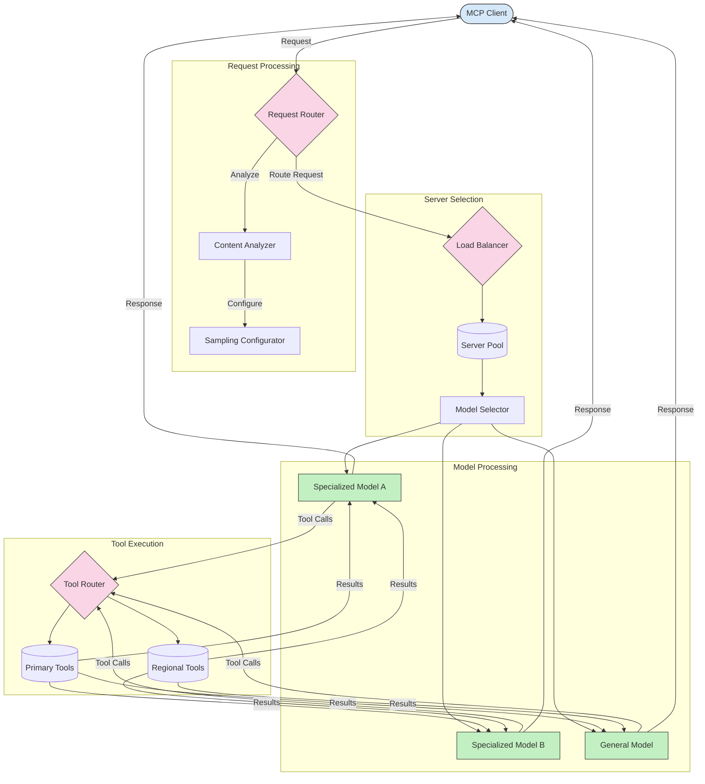

<!--
CO_OP_TRANSLATOR_METADATA:
{
  "original_hash": "2f1b473818b5a6cc9a9bbf777fffa6d4",
  "translation_date": "2025-07-14T21:45:45+00:00",
  "source_file": "05-AdvancedTopics/mcp-routing/README.md",
  "language_code": "ko"
}
-->
## MCP의 샘플링 및 라우팅 아키텍처

샘플링은 Model Context Protocol(MCP)의 핵심 요소로, 효율적인 요청 처리와 라우팅을 가능하게 합니다. 이는 들어오는 요청을 분석하여 콘텐츠 유형, 사용자 컨텍스트, 시스템 부하 등 다양한 기준에 따라 가장 적합한 모델이나 서비스로 처리하도록 결정하는 과정을 포함합니다.

샘플링과 라우팅을 결합하면 자원 활용을 최적화하고 높은 가용성을 보장하는 견고한 아키텍처를 만들 수 있습니다. 샘플링 과정은 요청을 분류하는 데 사용되며, 라우팅은 이를 적절한 모델이나 서비스로 전달합니다.

아래 다이어그램은 샘플링과 라우팅이 어떻게 함께 작동하는지 MCP의 종합적인 아키텍처를 보여줍니다:

## 다음 단계

- [5.6 샘플링](../mcp-sampling/README.md)

**면책 조항**:  
이 문서는 AI 번역 서비스 [Co-op Translator](https://github.com/Azure/co-op-translator)를 사용하여 번역되었습니다. 정확성을 위해 노력하고 있으나, 자동 번역에는 오류나 부정확한 부분이 있을 수 있음을 유의하시기 바랍니다. 원문은 해당 언어의 원본 문서가 권위 있는 출처로 간주되어야 합니다. 중요한 정보의 경우 전문적인 인간 번역을 권장합니다. 본 번역 사용으로 인해 발생하는 오해나 잘못된 해석에 대해 당사는 책임을 지지 않습니다.