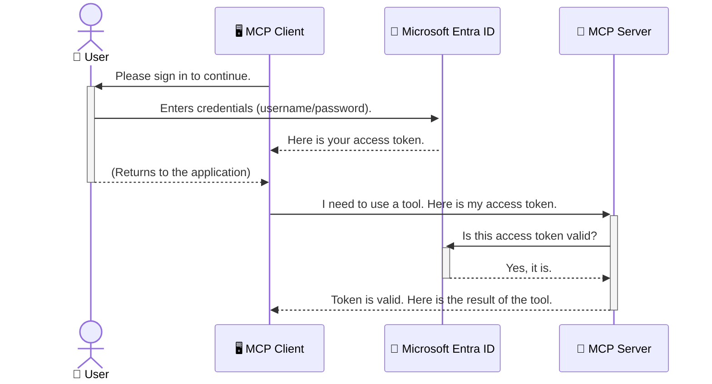

<!--
CO_OP_TRANSLATOR_METADATA:
{
  "original_hash": "6e562d7e5a77c8982da4aa8f762ad1d8",
  "translation_date": "2025-07-02T09:07:17+00:00",
  "source_file": "05-AdvancedTopics/mcp-security-entra/README.md",
  "language_code": "ko"
}
-->
# AI 워크플로우 보안: Model Context Protocol 서버를 위한 Entra ID 인증

## 소개  
Model Context Protocol(MCP) 서버를 보호하는 것은 집의 현관문에 자물쇠를 거는 것만큼 중요합니다. MCP 서버를 열어두면 도구와 데이터가 무단으로 접근당할 수 있어 보안 사고로 이어질 수 있습니다. Microsoft Entra ID는 강력한 클라우드 기반 ID 및 액세스 관리 솔루션을 제공하여 권한이 있는 사용자와 애플리케이션만 MCP 서버와 상호작용할 수 있도록 돕습니다. 이 섹션에서는 Entra ID 인증을 사용해 AI 워크플로우를 보호하는 방법을 배우게 됩니다.

## 학습 목표  
이 섹션을 마치면 다음을 할 수 있습니다:

- MCP 서버 보안의 중요성을 이해합니다.  
- Microsoft Entra ID와 OAuth 2.0 인증의 기본 개념을 설명합니다.  
- 공개 클라이언트와 기밀 클라이언트의 차이를 인지합니다.  
- 로컬(공개 클라이언트) 및 원격(기밀 클라이언트) MCP 서버 시나리오에서 Entra ID 인증을 구현합니다.  
- AI 워크플로우 개발 시 보안 모범 사례를 적용합니다.

## 보안과 MCP  

집의 현관문을 잠그지 않는 것처럼 MCP 서버를 아무나 접근할 수 있도록 열어두면 안 됩니다. AI 워크플로우를 안전하게 보호하는 것은 견고하고 신뢰할 수 있으며 안전한 애플리케이션을 만드는 데 필수적입니다. 이 장에서는 Microsoft Entra ID를 사용해 MCP 서버를 보호하는 방법을 소개하며, 권한이 있는 사용자와 애플리케이션만 도구와 데이터에 접근할 수 있도록 합니다.

## MCP 서버 보안이 중요한 이유  

MCP 서버에 이메일을 보내거나 고객 데이터베이스에 접근할 수 있는 도구가 있다고 상상해보세요. 보안이 취약한 서버라면 누구나 그 도구를 사용할 수 있어 무단 데이터 접근, 스팸 발송, 기타 악의적 행위로 이어질 수 있습니다.

인증을 구현하면 서버에 들어오는 모든 요청이 검증되어 요청을 하는 사용자나 애플리케이션의 신원을 확인할 수 있습니다. 이는 AI 워크플로우 보안에서 가장 첫 번째이자 중요한 단계입니다.

## Microsoft Entra ID 소개  

[**Microsoft Entra ID**](https://adoption.microsoft.com/microsoft-security/entra/)는 클라우드 기반 ID 및 액세스 관리 서비스입니다. 애플리케이션을 위한 만능 보안 경비원이라고 생각하세요. 사용자 신원 확인(인증)과 사용 권한 결정(인가)이라는 복잡한 과정을 처리합니다.

Entra ID를 사용하면:

- 사용자에게 안전한 로그인 환경을 제공합니다.  
- API와 서비스를 보호합니다.  
- 중앙에서 액세스 정책을 관리할 수 있습니다.

MCP 서버에 대해서는 Entra ID가 누가 서버 기능에 접근할 수 있는지 관리하는 강력하고 신뢰받는 솔루션을 제공합니다.

---

## 핵심 이해: Entra ID 인증 작동 원리  

Entra ID는 **OAuth 2.0** 같은 개방형 표준을 사용해 인증을 처리합니다. 세부 사항은 복잡할 수 있지만, 핵심 개념은 비유를 통해 쉽게 이해할 수 있습니다.

### OAuth 2.0 간단 소개: 발레 키 비유  

OAuth 2.0을 자동차 발레 서비스에 비유해보겠습니다. 식당에 도착하면 차 열쇠를 모두 주지 않고, 제한된 권한만 가진 **발레 키**를 줍니다. 이 키로는 차를 시동 걸고 문을 잠글 수 있지만 트렁크나 글러브박스는 열 수 없습니다.

이 비유에서:

- **당신**은 **사용자**입니다.  
- **당신의 차**는 귀중한 도구와 데이터를 가진 **MCP 서버**입니다.  
- **발레 서비스 직원**은 **Microsoft Entra ID**입니다.  
- **주차 담당자**는 **MCP 클라이언트**(서버에 접근하려는 애플리케이션)입니다.  
- **발레 키**는 **액세스 토큰**입니다.

액세스 토큰은 사용자가 로그인한 후 MCP 클라이언트가 Entra ID로부터 받는 보안 문자열입니다. 클라이언트는 이 토큰을 매 요청 시 MCP 서버에 제출하며, 서버는 토큰을 검증해 요청이 합법적이고 클라이언트가 필요한 권한을 갖고 있는지 확인합니다. 이 과정에서 실제 사용자 자격 증명(예: 비밀번호)을 다루지 않아도 됩니다.

### 인증 흐름  

실제 작동 방식은 다음과 같습니다:



### Microsoft Authentication Library(MSAL) 소개  

코드를 살펴보기 전에, 예제에서 볼 주요 구성 요소인 **Microsoft Authentication Library(MSAL)**를 소개합니다.

MSAL은 Microsoft에서 개발한 라이브러리로, 개발자가 인증을 훨씬 쉽게 처리할 수 있도록 도와줍니다. 보안 토큰 관리, 로그인 처리, 세션 갱신 등 복잡한 코드를 직접 작성할 필요 없이 MSAL이 이를 대신 처리합니다.

MSAL을 사용하는 이유는 다음과 같습니다:

- **안전함:** 업계 표준 프로토콜과 보안 모범 사례를 구현하여 코드 취약점 위험을 줄입니다.  
- **개발 간소화:** OAuth 2.0과 OpenID Connect의 복잡함을 추상화해 몇 줄의 코드로 강력한 인증 기능을 추가할 수 있습니다.  
- **지속적 유지보수:** Microsoft가 새로운 보안 위협과 플랫폼 변화에 맞춰 MSAL을 지속적으로 업데이트합니다.

MSAL은 .NET, JavaScript/TypeScript, Python, Java, Go, iOS, Android 등 다양한 언어와 프레임워크를 지원해 전체 기술 스택에서 일관된 인증 패턴을 사용할 수 있습니다.

MSAL에 대해 더 알고 싶다면 공식 [MSAL 개요 문서](https://learn.microsoft.com/entra/identity-platform/msal-overview)를 참고하세요.

---

## Entra ID로 MCP 서버 보호하기: 단계별 가이드  

이제 로컬 MCP 서버(예: `stdio`) using Entra ID. This example uses a **public client**, which is suitable for applications running on a user's machine, like a desktop app or a local development server.

### Scenario 1: Securing a Local MCP Server (with a Public Client)

In this scenario, we'll look at an MCP server that runs locally, communicates over `stdio`, and uses Entra ID to authenticate the user before allowing access to its tools. The server will have a single tool that fetches the user's profile information from the Microsoft Graph API.

#### 1. Setting Up the Application in Entra ID

Before writing any code, you need to register your application in Microsoft Entra ID. This tells Entra ID about your application and grants it permission to use the authentication service.

1. Navigate to the **[Microsoft Entra portal](https://entra.microsoft.com/)**.
2. Go to **App registrations** and click **New registration**.
3. Give your application a name (e.g., "My Local MCP Server").
4. For **Supported account types**, select **Accounts in this organizational directory only**.
5. You can leave the **Redirect URI** blank for this example.
6. Click **Register**.

Once registered, take note of the **Application (client) ID** and **Directory (tenant) ID**. You'll need these in your code.

#### 2. The Code: A Breakdown

Let's look at the key parts of the code that handle authentication. The full code for this example is available in the [Entra ID - Local - WAM](https://github.com/Azure-Samples/mcp-auth-servers/tree/main/src/entra-id-local-wam) folder of the [mcp-auth-servers GitHub repository](https://github.com/Azure-Samples/mcp-auth-servers).

**`AuthenticationService.cs`**

This class is responsible for handling the interaction with Entra ID.

- **`CreateAsync`**: This method initializes the `PublicClientApplication` from the MSAL (Microsoft Authentication Library). It's configured with your application's `clientId` and `tenantId`.
- **`WithBroker`**: This enables the use of a broker (like the Windows Web Account Manager), which provides a more secure and seamless single sign-on experience.
- **`AcquireTokenAsync`** 메서드 중심)를 보호하는 방법을 살펴봅니다. 이 메서드는 먼저 조용히(사용자가 이미 유효한 세션이 있으면 다시 로그인하지 않도록) 토큰을 얻으려고 시도합니다. 조용한 토큰 획득이 실패하면 사용자에게 인터랙티브 로그인 화면을 띄웁니다.

```csharp
// Simplified for clarity
public static async Task<AuthenticationService> CreateAsync(ILogger<AuthenticationService> logger)
{
    var msalClient = PublicClientApplicationBuilder
        .Create(_clientId) // Your Application (client) ID
        .WithAuthority(AadAuthorityAudience.AzureAdMyOrg)
        .WithTenantId(_tenantId) // Your Directory (tenant) ID
        .WithBroker(new BrokerOptions(BrokerOptions.OperatingSystems.Windows))
        .Build();

    // ... cache registration ...

    return new AuthenticationService(logger, msalClient);
}

public async Task<string> AcquireTokenAsync()
{
    try
    {
        // Try silent authentication first
        var accounts = await _msalClient.GetAccountsAsync();
        var account = accounts.FirstOrDefault();

        AuthenticationResult? result = null;

        if (account != null)
        {
            result = await _msalClient.AcquireTokenSilent(_scopes, account).ExecuteAsync();
        }
        else
        {
            // If no account, or silent fails, go interactive
            result = await _msalClient.AcquireTokenInteractive(_scopes).ExecuteAsync();
        }

        return result.AccessToken;
    }
    catch (Exception ex)
    {
        _logger.LogError(ex, "An error occurred while acquiring the token.");
        throw; // Optionally rethrow the exception for higher-level handling
    }
}
```

**`Program.cs`**

This is where the MCP server is set up and the authentication service is integrated.

- **`AddSingleton<AuthenticationService>`**: This registers the `AuthenticationService` with the dependency injection container, so it can be used by other parts of the application (like our tool).
- **`GetUserDetailsFromGraph` tool**: This tool requires an instance of `AuthenticationService`. Before it does anything, it calls `authService.AcquireTokenAsync()` 메서드를 사용해 유효한 액세스 토큰을 획득합니다. 인증에 성공하면 이 토큰으로 Microsoft Graph API를 호출해 사용자 정보를 가져옵니다.

```csharp
// Simplified for clarity
[McpServerTool(Name = "GetUserDetailsFromGraph")]
public static async Task<string> GetUserDetailsFromGraph(
    AuthenticationService authService)
{
    try
    {
        // This will trigger the authentication flow
        var accessToken = await authService.AcquireTokenAsync();

        // Use the token to create a GraphServiceClient
        var graphClient = new GraphServiceClient(
            new BaseBearerTokenAuthenticationProvider(new TokenProvider(authService)));

        var user = await graphClient.Me.GetAsync();

        return System.Text.Json.JsonSerializer.Serialize(user);
    }
    catch (Exception ex)
    {
        return $"Error: {ex.Message}";
    }
}
```

#### 3. 전체 동작 과정  

1. MCP 클라이언트가 `GetUserDetailsFromGraph` tool, the tool first calls `AcquireTokenAsync`.
2. `AcquireTokenAsync` triggers the MSAL library to check for a valid token.
3. If no token is found, MSAL, through the broker, will prompt the user to sign in with their Entra ID account.
4. Once the user signs in, Entra ID issues an access token.
5. The tool receives the token and uses it to make a secure call to the Microsoft Graph API.
6. The user's details are returned to the MCP client.

This process ensures that only authenticated users can use the tool, effectively securing your local MCP server.

### Scenario 2: Securing a Remote MCP Server (with a Confidential Client)

When your MCP server is running on a remote machine (like a cloud server) and communicates over a protocol like HTTP Streaming, the security requirements are different. In this case, you should use a **confidential client** and the **Authorization Code Flow**. This is a more secure method because the application's secrets are never exposed to the browser.

This example uses a TypeScript-based MCP server that uses Express.js to handle HTTP requests.

#### 1. Setting Up the Application in Entra ID

The setup in Entra ID is similar to the public client, but with one key difference: you need to create a **client secret**.

1. Navigate to the **[Microsoft Entra portal](https://entra.microsoft.com/)**.
2. In your app registration, go to the **Certificates & secrets** tab.
3. Click **New client secret**, give it a description, and click **Add**.
4. **Important:** Copy the secret value immediately. You will not be able to see it again.
5. You also need to configure a **Redirect URI**. Go to the **Authentication** tab, click **Add a platform**, select **Web**, and enter the redirect URI for your application (e.g., `http://localhost:3001/auth/callback`).

> **⚠️ Important Security Note:** For production applications, Microsoft strongly recommends using **secretless authentication** methods such as **Managed Identity** or **Workload Identity Federation** instead of client secrets. Client secrets pose security risks as they can be exposed or compromised. Managed identities provide a more secure approach by eliminating the need to store credentials in your code or configuration.
>
> For more information about managed identities and how to implement them, see the [Managed identities for Azure resources overview](https://learn.microsoft.com/entra/identity/managed-identities-azure-resources/overview).

#### 2. The Code: A Breakdown

This example uses a session-based approach. When the user authenticates, the server stores the access token and refresh token in a session and gives the user a session token. This session token is then used for subsequent requests. The full code for this example is available in the [Entra ID - Confidential client](https://github.com/Azure-Samples/mcp-auth-servers/tree/main/src/entra-id-cca-session) folder of the [mcp-auth-servers GitHub repository](https://github.com/Azure-Samples/mcp-auth-servers).

**`Server.ts`**

This file sets up the Express server and the MCP transport layer.

- **`requireBearerAuth`**: This is middleware that protects the `/sse` and `/message` endpoints. It checks for a valid bearer token in the `Authorization` header of the request.
- **`EntraIdServerAuthProvider`**: This is a custom class that implements the `McpServerAuthorizationProvider` interface. It's responsible for handling the OAuth 2.0 flow.
- **`/auth/callback`** 엔드포인트에 접근 시도합니다. 이 엔드포인트는 사용자가 인증을 마친 후 Entra ID에서 리디렉션되는 곳으로, 인가 코드를 액세스 토큰과 리프레시 토큰으로 교환합니다.

```typescript
// Simplified for clarity
const app = express();
const { server } = createServer();
const provider = new EntraIdServerAuthProvider();

// Protect the SSE endpoint
app.get("/sse", requireBearerAuth({
  provider,
  requiredScopes: ["User.Read"]
}), async (req, res) => {
  // ... connect to the transport ...
});

// Protect the message endpoint
app.post("/message", requireBearerAuth({
  provider,
  requiredScopes: ["User.Read"]
}), async (req, res) => {
  // ... handle the message ...
});

// Handle the OAuth 2.0 callback
app.get("/auth/callback", (req, res) => {
  provider.handleCallback(req.query.code, req.query.state)
    .then(result => {
      // ... handle success or failure ...
    });
});
```

**`Tools.ts`**

This file defines the tools that the MCP server provides. The `getUserDetails` 도구는 이전 예제와 비슷하지만, 세션에서 액세스 토큰을 가져옵니다.

```typescript
// Simplified for clarity
server.setRequestHandler(CallToolRequestSchema, async (request) => {
  const { name } = request.params;
  const context = request.params?.context as { token?: string } | undefined;
  const sessionToken = context?.token;

  if (name === ToolName.GET_USER_DETAILS) {
    if (!sessionToken) {
      throw new AuthenticationError("Authentication token is missing or invalid. Ensure the token is provided in the request context.");
    }

    // Get the Entra ID token from the session store
    const tokenData = tokenStore.getToken(sessionToken);
    const entraIdToken = tokenData.accessToken;

    const graphClient = Client.init({
      authProvider: (done) => {
        done(null, entraIdToken);
      }
    });

    const user = await graphClient.api('/me').get();

    // ... return user details ...
  }
});
```

**`auth/EntraIdServerAuthProvider.ts`**

This class handles the logic for:

- Redirecting the user to the Entra ID sign-in page.
- Exchanging the authorization code for an access token.
- Storing the tokens in the `tokenStore`.
- Refreshing the access token when it expires.

#### 3. How It All Works Together

1. When a user first tries to connect to the MCP server, the `requireBearerAuth` middleware will see that they don't have a valid session and will redirect them to the Entra ID sign-in page.
2. The user signs in with their Entra ID account.
3. Entra ID redirects the user back to the `/auth/callback` endpoint with an authorization code.
4. The server exchanges the code for an access token and a refresh token, stores them, and creates a session token which is sent to the client.
5. The client can now use this session token in the `Authorization` header for all future requests to the MCP server.
6. When the `getUserDetails` 도구가 호출되면, 세션 토큰을 사용해 Entra ID 액세스 토큰을 조회하고, 이를 통해 Microsoft Graph API를 호출합니다.

이 흐름은 공개 클라이언트 방식보다 복잡하지만, 인터넷에 노출된 원격 MCP 서버에서는 필수입니다. 원격 MCP 서버는 공용 인터넷에서 접근 가능하기 때문에 무단 접근과 공격으로부터 보호하기 위해 더 강력한 보안 조치가 필요합니다.

## 보안 모범 사례  

- **항상 HTTPS 사용:** 클라이언트와 서버 간 통신을 암호화해 토큰 탈취를 방지합니다.  
- **역할 기반 액세스 제어(RBAC) 구현:** 단순히 사용자가 인증되었는지 여부뿐 아니라, 어떤 권한이 있는지도 확인하세요. Entra ID에서 역할을 정의하고 MCP 서버에서 이를 검사할 수 있습니다.  
- **모니터링 및 감사:** 모든 인증 이벤트를 기록해 의심스러운 활동을 감지하고 대응할 수 있도록 합니다.  
- **요청 제한 및 스로틀링 처리:** Microsoft Graph 등 API는 남용 방지를 위해 요청 제한을 둡니다. MCP 서버에 지수 백오프 및 재시도 로직을 구현해 HTTP 429(요청 과다) 응답을 우아하게 처리하세요. 자주 사용하는 데이터는 캐싱해 API 호출을 줄이는 것도 고려하세요.  
- **토큰 안전 저장:** 액세스 토큰과 리프레시 토큰을 안전하게 저장하세요. 로컬 애플리케이션은 시스템의 안전한 저장소를, 서버 애플리케이션은 암호화 저장소나 Azure Key Vault 같은 보안 키 관리 서비스를 사용하는 것이 좋습니다.  
- **토큰 만료 처리:** 액세스 토큰은 유효 기간이 제한되어 있습니다. 리프레시 토큰을 사용해 자동으로 토큰을 갱신해 재인증 없이 원활한 사용자 경험을 유지하세요.  
- **Azure API Management 사용 고려:** MCP 서버에 직접 보안을 구현하는 것도 좋지만, API Gateway인 Azure API Management를 사용하면 인증, 인가, 요청 제한, 모니터링 등 보안 문제를 자동으로 처리할 수 있습니다. 클라이언트와 MCP 서버 사이에 중앙 집중식 보안 계층을 제공하므로 MCP와 함께 API Gateway를 사용하는 방법은 [Azure API Management Your Auth Gateway For MCP Servers](https://techcommunity.microsoft.com/blog/integrationsonazureblog/azure-api-management-your-auth-gateway-for-mcp-servers/4402690)에서 자세히 확인할 수 있습니다.

## 주요 요점  

- MCP 서버 보안은 데이터와 도구를 보호하는 데 필수적입니다.  
- Microsoft Entra ID는 인증과 인가를 위한 강력하고 확장 가능한 솔루션을 제공합니다.  
- 로컬 애플리케이션에는 **공개 클라이언트**, 원격 서버에는 **기밀 클라이언트**를 사용하세요.  
- 웹 애플리케이션에는 **Authorization Code Flow**가 가장 안전한 옵션입니다.

## 연습 문제  

1. 직접 구축할 MCP 서버는 로컬 서버일까요, 원격 서버일까요?  
2. 이에 따라 공개 클라이언트와 기밀 클라이언트 중 어느 것을 사용할 건가요?  
3. Microsoft Graph에 대해 MCP 서버가 요청할 권한은 무엇인가요?

## 실습  

### 실습 1: Entra ID에 애플리케이션 등록하기  
Microsoft Entra 포털에 접속하세요.  
MCP 서버용 새 애플리케이션을 등록하세요.  
애플리케이션(클라이언트) ID와 디렉터리(테넌트) ID를 기록하세요.

### 실습 2: 로컬 MCP 서버 보호하기 (공개 클라이언트)  
- MSAL(Microsoft Authentication Library)을 통합해 사용자 인증을 구현하세요.  
- Microsoft Graph에서 사용자 정보를 가져오는 MCP 도구를 호출해 인증 흐름을 테스트하세요.

### 실습 3: 원격 MCP 서버 보호하기 (기밀 클라이언트)  
- Entra ID에 기밀 클라이언트를 등록하고 클라이언트 시크릿을 생성하세요.  
- Express.js MCP 서버를 Authorization Code Flow를 사용하도록 구성하세요.  
- 보호된 엔드포인트를 테스트하고 토큰 기반 접근이 정상 동작하는지 확인하세요.

### 실습 4: 보안 모범 사례 적용하기  
- 로컬 또는 원격 서버에 HTTPS를 활성화하세요.  
- 서버 로직에 역할 기반 액세스 제어(RBAC)를 구현하세요.  
- 토큰 만료 처리와 안전한 토큰 저장을 추가하세요.

## 참고 자료  

1. **MSAL 개요 문서**  
   Microsoft Authentication Library(MSAL)를 통해 다양한 플랫폼에서 안전하게 토큰을 획득하는 방법을 배우세요:  
   [Microsoft Learn의 MSAL 개요](https://learn.microsoft.com/en-gb/entra/msal/overview)  

2. **Azure-Samples/mcp-auth-servers GitHub 저장소**  
   인증 흐름을 보여주는 MCP 서버 참고 구현 예제:  
   [Azure-Samples/mcp-auth-servers on GitHub](https://github.com/Azure-Samples/mcp-auth-servers)  

3. **Azure 리소스를 위한 관리형 ID 개요**  
   시스템 또는 사용자 할당 관리형 ID를 사용해 비밀 정보를 없애는 방법:  
   [Microsoft Learn의 관리형 ID 개요](https://learn.microsoft.com/en-us/entra/identity/managed-identities-azure-resources/)  

4. **Azure API Management: MCP 서버용 인증 게이트웨이**  
   APIM을 MCP 서버용 안전한 OAuth2 게이트웨이로 활용하는 심층 안내:  
   [Azure API Management Your Auth Gateway For MCP Servers](https://techcommunity.microsoft.com/blog/integrationsonazureblog/azure-api-management-your-auth-gateway-for-mcp-servers/4402690)  

5. **Microsoft Graph 권한 참조**  
   Microsoft Graph의 위임 및 애플리케이션 권한 전체 목록:  
   [Microsoft Graph 권한 참조](https://learn.microsoft.com/zh-tw/graph/permissions-reference)  

## 학습 성과  
이 섹션을 완료하면 다음을 할 수 있습니다:

- MCP 서버와 AI 워크플로우에서 인증이 왜 중요한지 설명할 수 있습니다.  
- 로컬 및 원격 MCP 서버 시나리오에 대해 Entra ID 인증을 설정하고 구성할 수 있습니다.  
- 서버 배포에 맞는 적절한 클라이언트 유형(공개 또는 기밀)을 선택할 수 있습니다.  
- 토큰 저장과 역할 기반 인가를 포함한 안전한 코딩 관행을 구현할 수 있습니다.  
- MCP 서버와 도구를 무단 접근으로부터 자신 있게 보호할 수 있습니다.

## 다음 단계  

- [5.13 Model Context Protocol (MCP)와 Azure AI Foundry 통합](../mcp-foundry-agent-integration/README.md)

**면책 조항**:  
이 문서는 AI 번역 서비스 [Co-op Translator](https://github.com/Azure/co-op-translator)를 사용하여 번역되었습니다. 정확성을 위해 노력하고 있으나, 자동 번역에는 오류나 부정확성이 포함될 수 있음을 유의하시기 바랍니다. 원본 문서의 원어 버전이 권위 있는 출처로 간주되어야 합니다. 중요한 정보의 경우 전문 인간 번역을 권장합니다. 본 번역의 사용으로 인해 발생하는 오해나 잘못된 해석에 대해서는 책임을 지지 않습니다.