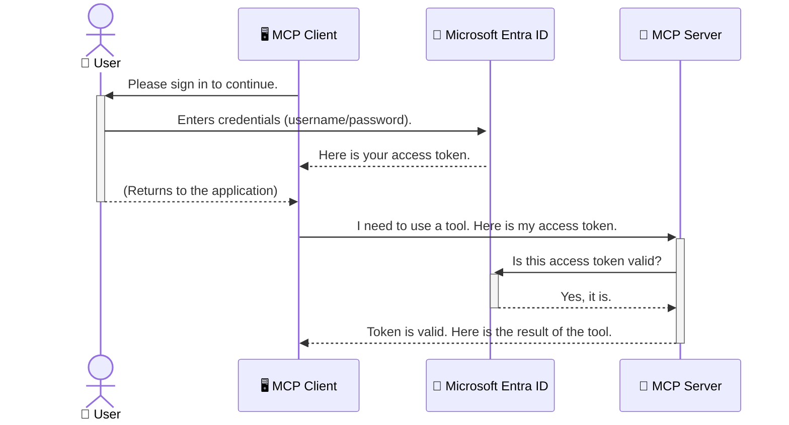

<!--
CO_OP_TRANSLATOR_METADATA:
{
  "original_hash": "6e562d7e5a77c8982da4aa8f762ad1d8",
  "translation_date": "2025-07-14T02:54:20+00:00",
  "source_file": "05-AdvancedTopics/mcp-security-entra/README.md",
  "language_code": "ko"
}
-->
# AI 워크플로우 보안: 모델 컨텍스트 프로토콜 서버용 Entra ID 인증

## 소개
모델 컨텍스트 프로토콜(MCP) 서버를 보호하는 것은 집의 현관문을 잠그는 것만큼 중요합니다. MCP 서버를 열어두면 도구와 데이터가 무단 접근에 노출되어 보안 사고로 이어질 수 있습니다. Microsoft Entra ID는 강력한 클라우드 기반 아이덴티티 및 접근 관리 솔루션을 제공하여, 권한이 있는 사용자와 애플리케이션만 MCP 서버와 상호작용할 수 있도록 도와줍니다. 이 섹션에서는 Entra ID 인증을 사용해 AI 워크플로우를 보호하는 방법을 배웁니다.

## 학습 목표
이 섹션을 마치면 다음을 할 수 있습니다:

- MCP 서버 보안의 중요성을 이해한다.
- Microsoft Entra ID와 OAuth 2.0 인증의 기본 개념을 설명한다.
- 공개 클라이언트와 기밀 클라이언트의 차이를 인식한다.
- 로컬(공개 클라이언트) 및 원격(기밀 클라이언트) MCP 서버 시나리오에서 Entra ID 인증을 구현한다.
- AI 워크플로우 개발 시 보안 모범 사례를 적용한다.

## 보안과 MCP

집의 현관문을 잠그지 않고 두지 않는 것처럼, MCP 서버도 누구나 접근할 수 있도록 열어두면 안 됩니다. AI 워크플로우를 안전하게 보호하는 것은 견고하고 신뢰할 수 있으며 안전한 애플리케이션을 만드는 데 필수적입니다. 이 장에서는 Microsoft Entra ID를 사용해 MCP 서버를 보호하는 방법을 소개하며, 권한이 있는 사용자와 애플리케이션만 도구와 데이터에 접근할 수 있도록 합니다.

## MCP 서버 보안이 중요한 이유

MCP 서버에 이메일을 보내거나 고객 데이터베이스에 접근할 수 있는 도구가 있다고 가정해 보세요. 보안이 취약한 서버라면 누구나 그 도구를 사용할 수 있어 무단 데이터 접근, 스팸 발송, 기타 악의적 행위가 발생할 수 있습니다.

인증을 구현하면 서버에 대한 모든 요청이 검증되어 요청을 하는 사용자나 애플리케이션의 신원을 확인할 수 있습니다. 이는 AI 워크플로우 보안의 첫 번째이자 가장 중요한 단계입니다.

## Microsoft Entra ID 소개

[**Microsoft Entra ID**](https://adoption.microsoft.com/microsoft-security/entra/)는 클라우드 기반 아이덴티티 및 접근 관리 서비스입니다. 애플리케이션을 위한 만능 보안 경비원이라고 생각할 수 있습니다. 사용자 신원 확인(인증)과 사용 권한 결정(인가)이라는 복잡한 과정을 처리합니다.

Entra ID를 사용하면 다음이 가능합니다:

- 사용자에 대한 안전한 로그인 지원
- API 및 서비스 보호
- 중앙에서 접근 정책 관리

MCP 서버의 경우, Entra ID는 서버 기능에 접근할 수 있는 사용자를 관리하는 강력하고 신뢰받는 솔루션을 제공합니다.

---

## 핵심 이해하기: Entra ID 인증 작동 원리

Entra ID는 **OAuth 2.0** 같은 오픈 표준을 사용해 인증을 처리합니다. 세부 사항은 복잡할 수 있지만, 핵심 개념은 비유를 통해 쉽게 이해할 수 있습니다.

### OAuth 2.0 간단 소개: 발렛 키

OAuth 2.0을 자동차 발렛 서비스에 비유해 보세요. 식당에 도착했을 때, 마스터 키를 발렛에게 주지 않고 제한된 권한만 가진 **발렛 키**를 줍니다. 이 키는 차를 시동 걸고 문을 잠글 수 있지만, 트렁크나 글러브 박스는 열 수 없습니다.

이 비유에서:

- **당신**은 **사용자**입니다.
- **당신의 차**는 도구와 데이터가 있는 **MCP 서버**입니다.
- **발렛**은 **Microsoft Entra ID**입니다.
- **주차 담당자**는 서버에 접근하려는 **MCP 클라이언트**(애플리케이션)입니다.
- **발렛 키**는 **액세스 토큰**입니다.

액세스 토큰은 사용자가 로그인한 후 MCP 클라이언트가 Entra ID로부터 받는 안전한 문자열입니다. 클라이언트는 이 토큰을 매 요청 시 MCP 서버에 제시하며, 서버는 토큰을 검증해 요청이 합법적이고 필요한 권한이 있는지 확인합니다. 이 과정에서 실제 사용자 자격 증명(예: 비밀번호)을 다룰 필요가 없습니다.

### 인증 흐름

실제 과정은 다음과 같습니다:



### Microsoft 인증 라이브러리(MSAL) 소개

코드 예제를 살펴보기 전에 중요한 구성 요소인 **Microsoft 인증 라이브러리(MSAL)**를 소개합니다.

MSAL은 개발자가 인증을 쉽게 처리할 수 있도록 Microsoft에서 만든 라이브러리입니다. 복잡한 보안 토큰 관리, 로그인 처리, 세션 갱신 코드를 직접 작성할 필요 없이 MSAL이 이를 대신 처리합니다.

MSAL 사용을 권장하는 이유는:

- **안전성:** 업계 표준 프로토콜과 보안 모범 사례를 구현해 코드 취약점 위험을 줄입니다.
- **개발 간소화:** OAuth 2.0과 OpenID Connect의 복잡함을 추상화해 몇 줄의 코드로 강력한 인증 기능을 추가할 수 있습니다.
- **지속적 유지보수:** Microsoft가 적극적으로 관리하며 새로운 보안 위협과 플랫폼 변화에 대응합니다.

MSAL은 .NET, JavaScript/TypeScript, Python, Java, Go, iOS, Android 등 다양한 언어와 프레임워크를 지원해 전체 기술 스택에서 일관된 인증 패턴을 사용할 수 있습니다.

MSAL에 대해 더 알고 싶다면 공식 [MSAL 개요 문서](https://learn.microsoft.com/entra/identity-platform/msal-overview)를 참고하세요.

---

## Entra ID로 MCP 서버 보호하기: 단계별 가이드

이제 Entra ID를 사용해 로컬 MCP 서버(`stdio` 통신)를 보호하는 방법을 살펴보겠습니다. 이 예제는 사용자의 컴퓨터에서 실행되는 데스크톱 앱이나 로컬 개발 서버에 적합한 **공개 클라이언트**를 사용합니다.

### 시나리오 1: 로컬 MCP 서버 보호 (공개 클라이언트)

이 시나리오에서는 로컬에서 실행되고 `stdio`로 통신하는 MCP 서버가 Entra ID로 사용자를 인증한 후 도구 접근을 허용하는 과정을 다룹니다. 서버에는 Microsoft Graph API에서 사용자 프로필 정보를 가져오는 단일 도구가 있습니다.

#### 1. Entra ID에서 애플리케이션 설정하기

코드를 작성하기 전에 Microsoft Entra ID에 애플리케이션을 등록해야 합니다. 이는 Entra ID에 애플리케이션 정보를 알려 인증 서비스를 사용할 권한을 부여하는 과정입니다.

1. **[Microsoft Entra 포털](https://entra.microsoft.com/)**에 접속합니다.
2. **앱 등록(App registrations)**으로 이동해 **새 등록(New registration)**을 클릭합니다.
3. 애플리케이션 이름(예: "My Local MCP Server")을 입력합니다.
4. **지원되는 계정 유형(Supported account types)**에서 **이 조직 디렉터리의 계정만(Accounts in this organizational directory only)**을 선택합니다.
5. 이 예제에서는 **리디렉션 URI(Redirect URI)**를 비워둡니다.
6. **등록(Register)**을 클릭합니다.

등록 후 **애플리케이션(클라이언트) ID**와 **디렉터리(테넌트) ID**를 기록해 두세요. 코드에서 필요합니다.

#### 2. 코드 주요 부분 설명

인증을 처리하는 핵심 코드를 살펴보겠습니다. 전체 코드는 [mcp-auth-servers GitHub 저장소](https://github.com/Azure-Samples/mcp-auth-servers)의 [Entra ID - Local - WAM](https://github.com/Azure-Samples/mcp-auth-servers/tree/main/src/entra-id-local-wam) 폴더에서 확인할 수 있습니다.

**`AuthenticationService.cs`**

이 클래스는 Entra ID와의 상호작용을 담당합니다.

- **`CreateAsync`**: MSAL의 `PublicClientApplication`을 초기화합니다. 애플리케이션의 `clientId`와 `tenantId`로 구성됩니다.
- **`WithBroker`**: Windows Web Account Manager 같은 브로커 사용을 활성화해 더 안전하고 원활한 싱글 사인온 경험을 제공합니다.
- **`AcquireTokenAsync`**: 핵심 메서드로, 먼저 조용히 토큰을 얻으려 시도합니다(이미 유효한 세션이 있으면 로그인 과정 없이 토큰 획득). 실패하면 사용자에게 로그인 창을 띄워 인증을 진행합니다.

```csharp
// Simplified for clarity
public static async Task<AuthenticationService> CreateAsync(ILogger<AuthenticationService> logger)
{
    var msalClient = PublicClientApplicationBuilder
        .Create(_clientId) // Your Application (client) ID
        .WithAuthority(AadAuthorityAudience.AzureAdMyOrg)
        .WithTenantId(_tenantId) // Your Directory (tenant) ID
        .WithBroker(new BrokerOptions(BrokerOptions.OperatingSystems.Windows))
        .Build();

    // ... cache registration ...

    return new AuthenticationService(logger, msalClient);
}

public async Task<string> AcquireTokenAsync()
{
    try
    {
        // Try silent authentication first
        var accounts = await _msalClient.GetAccountsAsync();
        var account = accounts.FirstOrDefault();

        AuthenticationResult? result = null;

        if (account != null)
        {
            result = await _msalClient.AcquireTokenSilent(_scopes, account).ExecuteAsync();
        }
        else
        {
            // If no account, or silent fails, go interactive
            result = await _msalClient.AcquireTokenInteractive(_scopes).ExecuteAsync();
        }

        return result.AccessToken;
    }
    catch (Exception ex)
    {
        _logger.LogError(ex, "An error occurred while acquiring the token.");
        throw; // Optionally rethrow the exception for higher-level handling
    }
}
```

**`Program.cs`**

MCP 서버를 설정하고 인증 서비스를 통합하는 부분입니다.

- **`AddSingleton<AuthenticationService>`**: `AuthenticationService`를 의존성 주입 컨테이너에 등록해 다른 부분(예: 도구)에서 사용할 수 있게 합니다.
- **`GetUserDetailsFromGraph` 도구**: 이 도구는 `AuthenticationService` 인스턴스를 필요로 합니다. 실행 전에 `authService.AcquireTokenAsync()`를 호출해 유효한 액세스 토큰을 얻습니다. 인증에 성공하면 토큰을 사용해 Microsoft Graph API를 호출해 사용자 정보를 가져옵니다.

```csharp
// Simplified for clarity
[McpServerTool(Name = "GetUserDetailsFromGraph")]
public static async Task<string> GetUserDetailsFromGraph(
    AuthenticationService authService)
{
    try
    {
        // This will trigger the authentication flow
        var accessToken = await authService.AcquireTokenAsync();

        // Use the token to create a GraphServiceClient
        var graphClient = new GraphServiceClient(
            new BaseBearerTokenAuthenticationProvider(new TokenProvider(authService)));

        var user = await graphClient.Me.GetAsync();

        return System.Text.Json.JsonSerializer.Serialize(user);
    }
    catch (Exception ex)
    {
        return $"Error: {ex.Message}";
    }
}
```

#### 3. 전체 동작 과정

1. MCP 클라이언트가 `GetUserDetailsFromGraph` 도구를 사용하려 할 때, 도구는 먼저 `AcquireTokenAsync`를 호출합니다.
2. `AcquireTokenAsync`는 MSAL 라이브러리를 통해 유효한 토큰이 있는지 확인합니다.
3. 토큰이 없으면 MSAL이 브로커를 통해 사용자에게 Entra ID 계정으로 로그인하라는 창을 띄웁니다.
4. 사용자가 로그인하면 Entra ID가 액세스 토큰을 발급합니다.
5. 도구는 토큰을 받아 Microsoft Graph API에 안전하게 요청을 보냅니다.
6. 사용자 정보가 MCP 클라이언트에 반환됩니다.

이 과정으로 인증된 사용자만 도구를 사용할 수 있어 로컬 MCP 서버가 안전하게 보호됩니다.

### 시나리오 2: 원격 MCP 서버 보호 (기밀 클라이언트)

MCP 서버가 원격 머신(예: 클라우드 서버)에서 실행되고 HTTP 스트리밍 같은 프로토콜로 통신할 때는 보안 요구사항이 다릅니다. 이 경우 **기밀 클라이언트**와 **Authorization Code Flow**를 사용해야 합니다. 이 방법은 애플리케이션 비밀이 브라우저에 노출되지 않아 더 안전합니다.

이 예제는 Express.js를 사용해 HTTP 요청을 처리하는 TypeScript 기반 MCP 서버를 다룹니다.

#### 1. Entra ID에서 애플리케이션 설정하기

설정은 공개 클라이언트와 비슷하지만, **클라이언트 비밀(client secret)**을 생성해야 한다는 점이 다릅니다.

1. **[Microsoft Entra 포털](https://entra.microsoft.com/)**에 접속합니다.
2. 앱 등록에서 **인증서 및 비밀(Certificates & secrets)** 탭으로 이동합니다.
3. **새 클라이언트 비밀(New client secret)**을 클릭하고 설명을 입력한 후 **추가(Add)**를 클릭합니다.
4. **중요:** 생성된 비밀 값을 즉시 복사하세요. 다시 볼 수 없습니다.
5. **리디렉션 URI**도 설정해야 합니다. **인증(Authentication)** 탭에서 **플랫폼 추가(Add a platform)**를 클릭하고 **웹(Web)**을 선택한 뒤 애플리케이션의 리디렉션 URI(예: `http://localhost:3001/auth/callback`)를 입력합니다.

> **⚠️ 중요한 보안 참고:** 운영 환경에서는 클라이언트 비밀 대신 **Managed Identity**나 **Workload Identity Federation** 같은 비밀 없는 인증 방식을 사용하는 것을 Microsoft가 강력히 권장합니다. 클라이언트 비밀은 노출되거나 탈취될 위험이 있습니다. 관리형 아이덴티티는 코드나 설정에 자격 증명을 저장할 필요가 없어 더 안전합니다.
>
> 관리형 아이덴티티에 대한 자세한 내용과 구현 방법은 [Azure 리소스용 관리형 아이덴티티 개요](https://learn.microsoft.com/entra/identity/managed-identities-azure-resources/overview)를 참고하세요.

#### 2. 코드 주요 부분 설명

이 예제는 세션 기반 방식을 사용합니다. 사용자가 인증하면 서버가 액세스 토큰과 갱신 토큰을 세션에 저장하고, 사용자에게 세션 토큰을 제공합니다. 이후 요청에 이 세션 토큰을 사용합니다. 전체 코드는 [mcp-auth-servers GitHub 저장소](https://github.com/Azure-Samples/mcp-auth-servers)의 [Entra ID - Confidential client](https://github.com/Azure-Samples/mcp-auth-servers/tree/main/src/entra-id-cca-session) 폴더에서 확인할 수 있습니다.

**`Server.ts`**

Express 서버와 MCP 전송 계층을 설정합니다.

- **`requireBearerAuth`**: `/sse`와 `/message` 엔드포인트를 보호하는 미들웨어입니다. 요청의 `Authorization` 헤더에 유효한 베어러 토큰이 있는지 확인합니다.
- **`EntraIdServerAuthProvider`**: `McpServerAuthorizationProvider` 인터페이스를 구현한 커스텀 클래스입니다. OAuth 2.0 흐름을 처리합니다.
- **`/auth/callback`**: 사용자가 인증 후 Entra ID에서 리디렉션될 때 호출되는 엔드포인트입니다. 권한 코드를 액세스 토큰과 갱신 토큰으로 교환합니다.

```typescript
// Simplified for clarity
const app = express();
const { server } = createServer();
const provider = new EntraIdServerAuthProvider();

// Protect the SSE endpoint
app.get("/sse", requireBearerAuth({
  provider,
  requiredScopes: ["User.Read"]
}), async (req, res) => {
  // ... connect to the transport ...
});

// Protect the message endpoint
app.post("/message", requireBearerAuth({
  provider,
  requiredScopes: ["User.Read"]
}), async (req, res) => {
  // ... handle the message ...
});

// Handle the OAuth 2.0 callback
app.get("/auth/callback", (req, res) => {
  provider.handleCallback(req.query.code, req.query.state)
    .then(result => {
      // ... handle success or failure ...
    });
});
```

**`Tools.ts`**

MCP 서버가 제공하는 도구들을 정의합니다. `getUserDetails` 도구는 이전 예제와 비슷하지만, 액세스 토큰을 세션에서 가져옵니다.

```typescript
// Simplified for clarity
server.setRequestHandler(CallToolRequestSchema, async (request) => {
  const { name } = request.params;
  const context = request.params?.context as { token?: string } | undefined;
  const sessionToken = context?.token;

  if (name === ToolName.GET_USER_DETAILS) {
    if (!sessionToken) {
      throw new AuthenticationError("Authentication token is missing or invalid. Ensure the token is provided in the request context.");
    }

    // Get the Entra ID token from the session store
    const tokenData = tokenStore.getToken(sessionToken);
    const entraIdToken = tokenData.accessToken;

    const graphClient = Client.init({
      authProvider: (done) => {
        done(null, entraIdToken);
      }
    });

    const user = await graphClient.api('/me').get();

    // ... return user details ...
  }
});
```

**`auth/EntraIdServerAuthProvider.ts`**

이 클래스는 다음 로직을 처리합니다:

- 사용자를 Entra ID 로그인 페이지로 리디렉션
- 권한 코드를 액세스 토큰으로 교환
- 토큰을 `tokenStore`에 저장
- 액세스 토큰 만료 시 갱신

#### 3. 전체 동작 과정

1. 사용자가 처음 MCP 서버에 연결하려 하면, `requireBearerAuth` 미들웨어가 유효한 세션이 없음을 감지하고 Entra ID 로그인 페이지로 리디렉션합니다.
2. 사용자가 Entra ID 계정으로 로그인합니다.
3. Entra ID가 권한 코드를 포함해 사용자를 `/auth/callback` 엔드포인트로 리디렉션합니다.
4. 서버는 코드를 액세스 토큰과 리프레시 토큰으로 교환하여 저장하고, 세션 토큰을 생성하여 클라이언트에 전송합니다.  
5. 클라이언트는 이제 이 세션 토큰을 `Authorization` 헤더에 포함시켜 MCP 서버에 대한 모든 향후 요청에 사용할 수 있습니다.  
6. `getUserDetails` 도구가 호출되면 세션 토큰을 사용해 Entra ID 액세스 토큰을 조회하고, 이를 이용해 Microsoft Graph API를 호출합니다.  

이 흐름은 공개 클라이언트 흐름보다 복잡하지만, 인터넷에 노출된 엔드포인트에는 필수적입니다. 원격 MCP 서버는 공용 인터넷을 통해 접근 가능하므로, 무단 접근과 잠재적 공격으로부터 보호하기 위해 더 강력한 보안 조치가 필요합니다.  


## 보안 모범 사례

- **항상 HTTPS 사용**: 클라이언트와 서버 간 통신을 암호화하여 토큰이 가로채이지 않도록 보호하세요.  
- **역할 기반 접근 제어(RBAC) 구현**: 사용자가 인증되었는지 여부뿐만 아니라, 어떤 권한이 있는지도 확인하세요. Entra ID에서 역할을 정의하고 MCP 서버에서 이를 검증할 수 있습니다.  
- **모니터링 및 감사**: 모든 인증 이벤트를 기록하여 의심스러운 활동을 탐지하고 대응할 수 있도록 하세요.  
- **요청 제한 및 스로틀링 처리**: Microsoft Graph 및 기타 API는 남용을 방지하기 위해 요청 제한을 적용합니다. MCP 서버에서 지수 백오프 및 재시도 로직을 구현하여 HTTP 429(요청 과다) 응답을 우아하게 처리하세요. 자주 조회하는 데이터를 캐싱하여 API 호출을 줄이는 것도 고려하세요.  
- **토큰 안전 저장**: 액세스 토큰과 리프레시 토큰을 안전하게 저장하세요. 로컬 애플리케이션의 경우 시스템의 보안 저장소를 사용하고, 서버 애플리케이션은 암호화 저장소나 Azure Key Vault 같은 보안 키 관리 서비스를 활용하세요.  
- **토큰 만료 처리**: 액세스 토큰은 유효 기간이 제한되어 있습니다. 리프레시 토큰을 사용해 자동으로 토큰을 갱신하여 재인증 없이 원활한 사용자 경험을 유지하세요.  
- **Azure API Management 사용 고려**: MCP 서버에 직접 보안을 구현하면 세밀한 제어가 가능하지만, Azure API Management 같은 API 게이트웨이는 인증, 권한 부여, 요청 제한, 모니터링 등 많은 보안 문제를 자동으로 처리해 줍니다. 클라이언트와 MCP 서버 사이에 중앙 집중식 보안 계층을 제공합니다. MCP와 API 게이트웨이 사용에 대한 자세한 내용은 [Azure API Management Your Auth Gateway For MCP Servers](https://techcommunity.microsoft.com/blog/integrationsonazureblog/azure-api-management-your-auth-gateway-for-mcp-servers/4402690)를 참고하세요.  


## 주요 내용 정리

- MCP 서버 보안은 데이터와 도구를 보호하는 데 매우 중요합니다.  
- Microsoft Entra ID는 강력하고 확장 가능한 인증 및 권한 부여 솔루션을 제공합니다.  
- 로컬 애플리케이션에는 **공개 클라이언트**, 원격 서버에는 **비밀 클라이언트**를 사용하세요.  
- 웹 애플리케이션에는 **Authorization Code Flow**가 가장 안전한 옵션입니다.  


## 연습 문제

1. 여러분이 구축할 MCP 서버는 로컬 서버인가요, 원격 서버인가요?  
2. 답변에 따라 공개 클라이언트 또는 비밀 클라이언트를 사용하시겠습니까?  
3. Microsoft Graph에 대해 작업을 수행하기 위해 MCP 서버가 요청할 권한은 무엇인가요?  


## 실습 과제

### 연습 1: Entra ID에 애플리케이션 등록하기  
Microsoft Entra 포털로 이동하세요.  
MCP 서버용 새 애플리케이션을 등록하세요.  
애플리케이션(클라이언트) ID와 디렉터리(테넌트) ID를 기록하세요.  

### 연습 2: 로컬 MCP 서버 보안 설정 (공개 클라이언트)  
- MSAL(Microsoft Authentication Library)을 통합하여 사용자 인증을 구현하는 코드 예제를 따라하세요.  
- Microsoft Graph에서 사용자 세부 정보를 가져오는 MCP 도구를 호출하여 인증 흐름을 테스트하세요.  

### 연습 3: 원격 MCP 서버 보안 설정 (비밀 클라이언트)  
- Entra ID에 비밀 클라이언트를 등록하고 클라이언트 시크릿을 생성하세요.  
- Express.js MCP 서버를 Authorization Code Flow를 사용하도록 구성하세요.  
- 보호된 엔드포인트를 테스트하고 토큰 기반 접근을 확인하세요.  

### 연습 4: 보안 모범 사례 적용하기  
- 로컬 또는 원격 서버에 HTTPS를 활성화하세요.  
- 서버 로직에 역할 기반 접근 제어(RBAC)를 구현하세요.  
- 토큰 만료 처리 및 안전한 토큰 저장을 추가하세요.  


## 참고 자료

1. **MSAL 개요 문서**  
   Microsoft Authentication Library(MSAL)가 플랫폼 전반에서 안전한 토큰 획득을 어떻게 지원하는지 알아보세요:  
   [MSAL Overview on Microsoft Learn](https://learn.microsoft.com/en-gb/entra/msal/overview)  

2. **Azure-Samples/mcp-auth-servers GitHub 저장소**  
   인증 흐름을 보여주는 MCP 서버 참조 구현 예제:  
   [Azure-Samples/mcp-auth-servers on GitHub](https://github.com/Azure-Samples/mcp-auth-servers)  

3. **Azure 리소스용 관리 ID 개요**  
   시스템 또는 사용자 할당 관리 ID를 사용해 비밀 정보를 제거하는 방법을 이해하세요:  
   [Managed Identities Overview on Microsoft Learn](https://learn.microsoft.com/en-us/entra/identity/managed-identities-azure-resources/)  

4. **Azure API Management: MCP 서버용 인증 게이트웨이**  
   MCP 서버를 위한 안전한 OAuth2 게이트웨이로 APIM을 사용하는 방법 심층 분석:  
   [Azure API Management Your Auth Gateway For MCP Servers](https://techcommunity.microsoft.com/blog/integrationsonazureblog/azure-api-management-your-auth-gateway-for-mcp-servers/4402690)  

5. **Microsoft Graph 권한 참조**  
   Microsoft Graph에 대한 위임 및 애플리케이션 권한의 포괄적 목록:  
   [Microsoft Graph Permissions Reference](https://learn.microsoft.com/zh-tw/graph/permissions-reference)  


## 학습 목표  
이 섹션을 완료하면 다음을 할 수 있습니다:

- MCP 서버와 AI 워크플로우에서 인증이 왜 중요한지 설명할 수 있습니다.  
- 로컬 및 원격 MCP 서버 시나리오에 맞게 Entra ID 인증을 설정하고 구성할 수 있습니다.  
- 서버 배포 유형에 따라 적절한 클라이언트 유형(공개 또는 비밀)을 선택할 수 있습니다.  
- 토큰 저장 및 역할 기반 권한 부여를 포함한 안전한 코딩 관행을 구현할 수 있습니다.  
- MCP 서버와 도구를 무단 접근으로부터 자신 있게 보호할 수 있습니다.  


## 다음 단계  

- [5.13 Model Context Protocol (MCP) Integration with Azure AI Foundry](../mcp-foundry-agent-integration/README.md)

**면책 조항**:  
이 문서는 AI 번역 서비스 [Co-op Translator](https://github.com/Azure/co-op-translator)를 사용하여 번역되었습니다. 정확성을 위해 최선을 다하고 있으나, 자동 번역에는 오류나 부정확한 부분이 있을 수 있음을 유의하시기 바랍니다. 원문은 해당 언어의 원본 문서가 권위 있는 출처로 간주되어야 합니다. 중요한 정보의 경우 전문적인 인간 번역을 권장합니다. 본 번역 사용으로 인해 발생하는 오해나 잘못된 해석에 대해 당사는 책임을 지지 않습니다.