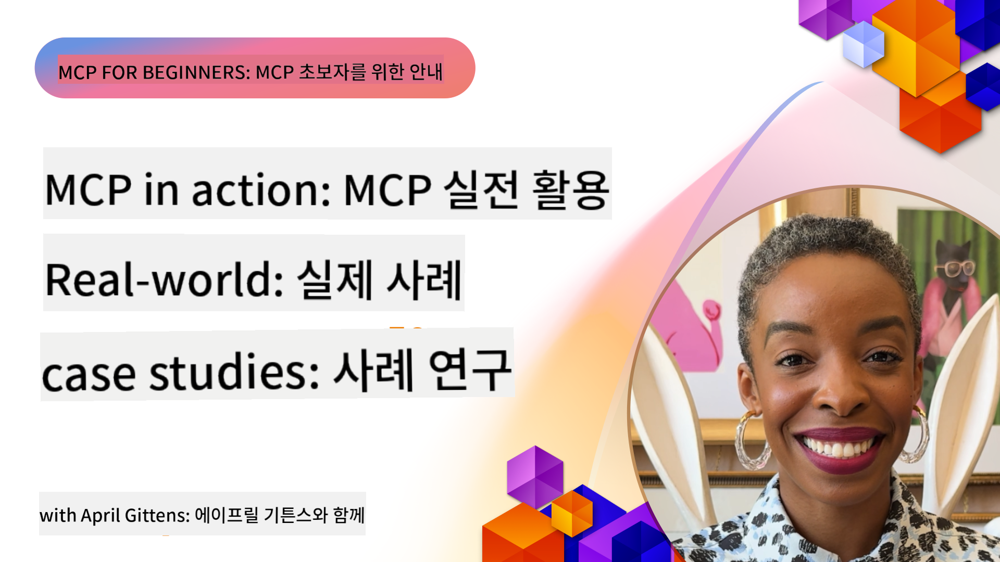

<!--
CO_OP_TRANSLATOR_METADATA:
{
  "original_hash": "1611dc5f6a2a35a789fc4c95fc5bfbe8",
  "translation_date": "2025-09-26T17:58:21+00:00",
  "source_file": "09-CaseStudy/README.md",
  "language_code": "ko"
}
-->
# MCP 실전 사례: 실제 사례 연구

_(위 이미지를 클릭하면 이 강의의 동영상을 볼 수 있습니다)_

Model Context Protocol(MCP)은 AI 애플리케이션이 데이터, 도구, 서비스와 상호작용하는 방식을 혁신하고 있습니다. 이 섹션에서는 다양한 기업 환경에서 MCP의 실질적인 활용 사례를 보여주는 실제 사례 연구를 소개합니다.

## 개요

이 섹션에서는 MCP 구현의 구체적인 사례를 통해 조직이 이 프로토콜을 활용하여 복잡한 비즈니스 문제를 해결하는 방법을 강조합니다. 이러한 사례 연구를 통해 MCP가 실제 환경에서 제공하는 다양성, 확장성, 실질적인 이점을 이해할 수 있습니다.

## 주요 학습 목표

이 사례 연구를 통해 다음을 배울 수 있습니다:

- MCP를 활용하여 특정 비즈니스 문제를 해결하는 방법 이해
- 다양한 통합 패턴 및 아키텍처 접근 방식 학습
- 기업 환경에서 MCP를 구현하기 위한 모범 사례 인식
- 실제 구현에서 직면한 문제와 해결책에 대한 통찰력 얻기
- 자신의 프로젝트에 유사한 패턴을 적용할 수 있는 기회 식별

## 주요 사례 연구

### 1. [Azure AI 여행 에이전트 – 참조 구현](./travelagentsample.md)

이 사례 연구는 MCP, Azure OpenAI, Azure AI Search를 사용하여 다중 에이전트 기반 AI 여행 계획 애플리케이션을 구축하는 방법을 보여주는 Microsoft의 포괄적인 참조 솔루션을 다룹니다. 프로젝트는 다음을 보여줍니다:

- MCP를 통한 다중 에이전트 오케스트레이션
- Azure AI Search를 활용한 기업 데이터 통합
- Azure 서비스를 사용한 안전하고 확장 가능한 아키텍처
- 재사용 가능한 MCP 구성 요소를 활용한 확장 가능한 도구
- Azure OpenAI로 구동되는 대화형 사용자 경험

아키텍처와 구현 세부 사항은 MCP를 조정 계층으로 사용하여 복잡한 다중 에이전트 시스템을 구축하는 데 유용한 통찰력을 제공합니다.

### 2. [YouTube 데이터로 Azure DevOps 항목 업데이트](./UpdateADOItemsFromYT.md)

이 사례 연구는 MCP를 활용하여 워크플로 프로세스를 자동화하는 실질적인 응용 프로그램을 보여줍니다. MCP 도구를 사용하여 다음을 수행하는 방법을 보여줍니다:

- 온라인 플랫폼(YouTube)에서 데이터 추출
- Azure DevOps 시스템의 작업 항목 업데이트
- 반복 가능한 자동화 워크플로 생성
- 서로 다른 시스템 간 데이터 통합

이 예는 비교적 간단한 MCP 구현이 일상적인 작업을 자동화하고 시스템 간 데이터 일관성을 개선하여 상당한 효율성을 제공할 수 있음을 보여줍니다.

### 3. [MCP를 활용한 실시간 문서 검색](./docs-mcp/README.md)

이 사례 연구는 Python 콘솔 클라이언트를 MCP 서버에 연결하여 실시간으로 Microsoft 문서를 검색하고 기록하는 방법을 안내합니다. 다음을 배울 수 있습니다:

- 공식 MCP SDK를 사용하여 Python 클라이언트를 MCP 서버에 연결
- 효율적인 실시간 데이터 검색을 위한 스트리밍 HTTP 클라이언트 사용
- 서버에서 문서 도구를 호출하고 응답을 콘솔에 직접 기록
- 터미널을 벗어나지 않고 최신 Microsoft 문서를 워크플로에 통합

이 장에는 실습 과제, 최소 작동 코드 샘플, 심화 학습을 위한 추가 리소스 링크가 포함되어 있습니다. MCP가 문서 접근성과 개발자 생산성을 콘솔 기반 환경에서 어떻게 혁신할 수 있는지 이해하려면 링크된 장의 전체 워크스루와 코드를 참조하세요.

### 4. [MCP를 활용한 대화형 학습 계획 생성 웹 앱](./docs-mcp/README.md)

이 사례 연구는 Chainlit과 Model Context Protocol(MCP)을 사용하여 주제별 맞춤 학습 계획을 생성하는 대화형 웹 애플리케이션을 구축하는 방법을 보여줍니다. 사용자는 주제(예: "AI-900 인증")와 학습 기간(예: 8주)을 지정할 수 있으며, 앱은 주별 추천 콘텐츠를 제공합니다. Chainlit은 대화형 채팅 인터페이스를 제공하여 경험을 더욱 몰입감 있고 적응적으로 만듭니다.

- Chainlit으로 구동되는 대화형 웹 앱
- 주제와 기간에 대한 사용자 지정 프롬프트
- MCP를 활용한 주별 콘텐츠 추천
- 채팅 인터페이스에서 실시간 적응형 응답

이 프로젝트는 대화형 AI와 MCP를 결합하여 현대 웹 환경에서 동적이고 사용자 중심의 교육 도구를 만드는 방법을 보여줍니다.

### 5. [VS Code에서 MCP 서버를 활용한 문서 검색](./docs-mcp/README.md)

이 사례 연구는 Microsoft Learn Docs를 VS Code 환경으로 직접 가져오는 방법을 보여줍니다. 브라우저 탭을 전환할 필요가 없습니다! 다음을 배울 수 있습니다:

- MCP 패널 또는 명령 팔레트를 사용하여 VS Code 내에서 문서를 즉시 검색하고 읽기
- README 또는 코스 마크다운 파일에 링크를 직접 삽입하여 문서 참조
- GitHub Copilot과 MCP를 함께 사용하여 AI 기반 문서 및 코드 워크플로를 원활하게 수행
- 실시간 피드백과 Microsoft에서 제공하는 정확성을 통해 문서를 검증하고 개선
- GitHub 워크플로와 MCP를 통합하여 지속적인 문서 검증 수행

구현에는 다음이 포함됩니다:

- 간편한 설정을 위한 `.vscode/mcp.json` 구성 예제
- 에디터 경험의 스크린샷 기반 워크스루
- Copilot과 MCP를 결합하여 생산성을 극대화하는 팁

이 시나리오는 코스 저자, 문서 작성자, 개발자가 에디터에서 집중력을 유지하면서 문서, Copilot, 검증 도구를 활용하고자 할 때 이상적입니다.

### 6. [APIM MCP 서버 생성](./apimsample.md)

이 사례 연구는 Azure API Management(APIM)를 사용하여 MCP 서버를 생성하는 단계별 가이드를 제공합니다. 다음을 다룹니다:

- Azure API Management에서 MCP 서버 설정
- MCP 도구로 API 작업 노출
- 속도 제한 및 보안을 위한 정책 구성
- Visual Studio Code와 GitHub Copilot을 사용하여 MCP 서버 테스트

이 예는 Azure의 기능을 활용하여 다양한 애플리케이션에서 사용할 수 있는 강력한 MCP 서버를 생성하고 AI 시스템과 기업 API의 통합을 강화하는 방법을 보여줍니다.

### 7. [GitHub MCP 레지스트리 — 에이전트 통합 가속화](https://github.com/mcp)

이 사례 연구는 2025년 9월에 출시된 GitHub의 MCP 레지스트리가 AI 생태계에서 중요한 과제인 MCP 서버의 분산된 발견 및 배포 문제를 어떻게 해결했는지 살펴봅니다.

#### 개요
**MCP 레지스트리**는 이전에 통합이 느리고 오류가 많았던 다양한 저장소와 레지스트리에 분산된 MCP 서버 문제를 해결합니다. 이러한 서버는 AI 에이전트가 API, 데이터베이스, 문서 소스와 같은 외부 시스템과 상호작용할 수 있도록 합니다.

#### 문제 진술
에이전트 워크플로를 구축하는 개발자는 다음과 같은 문제에 직면했습니다:
- **MCP 서버의 낮은 발견 가능성**: 다양한 플랫폼에서 서버를 찾기 어려움
- **중복된 설정 질문**: 포럼과 문서에 흩어져 있는 정보
- **보안 위험**: 검증되지 않은 신뢰할 수 없는 소스
- **표준화 부족**: 서버 품질과 호환성의 일관성 부족

#### 솔루션 아키텍처
GitHub의 MCP 레지스트리는 신뢰할 수 있는 MCP 서버를 중앙화하여 다음과 같은 주요 기능을 제공합니다:
- **원클릭 설치**: VS Code를 통한 간편한 설정
- **신호 대 잡음 정렬**: 별점, 활동, 커뮤니티 검증을 기준으로 정렬
- **직접 통합**: GitHub Copilot 및 기타 MCP 호환 도구와의 통합
- **오픈 기여 모델**: 커뮤니티와 기업 파트너 모두 기여 가능

#### 비즈니스 영향
레지스트리는 다음과 같은 측면에서 측정 가능한 개선을 제공했습니다:
- **빠른 온보딩**: Microsoft Learn MCP 서버와 같은 도구를 사용하는 개발자에게 빠른 시작 제공
- **생산성 향상**: 자연어 GitHub 자동화(PR 생성, CI 재실행, 코드 스캔)를 지원하는 `github-mcp-server`와 같은 전문 서버 활용
- **강화된 생태계 신뢰**: 큐레이션된 목록과 투명한 구성 표준 제공

#### 전략적 가치
에이전트 라이프사이클 관리 및 재현 가능한 워크플로에 특화된 실무자에게 MCP 레지스트리는 다음을 제공합니다:
- **모듈형 에이전트 배포**: 표준화된 구성 요소를 활용한 배포
- **레지스트리 지원 평가 파이프라인**: 일관된 테스트 및 검증
- **크로스 도구 상호운용성**: 다양한 AI 플랫폼 간 원활한 통합

이 사례 연구는 MCP 레지스트리가 단순한 디렉토리가 아니라 확장 가능한 실제 모델 통합 및 에이전트 시스템 배포를 위한 기반 플랫폼임을 보여줍니다.

## 결론

이 7개의 포괄적인 사례 연구는 다양한 실제 시나리오에서 Model Context Protocol의 놀라운 다양성과 실질적인 응용 가능성을 보여줍니다. 복잡한 다중 에이전트 여행 계획 시스템과 기업 API 관리에서부터 간소화된 문서 워크플로 및 혁신적인 GitHub MCP 레지스트리까지, 이러한 예는 MCP가 AI 시스템을 필요한 도구, 데이터, 서비스와 연결하여 뛰어난 가치를 제공하는 표준화되고 확장 가능한 방법을 제공함을 보여줍니다.

사례 연구는 MCP 구현의 여러 측면을 다룹니다:
- **기업 통합**: Azure API Management 및 Azure DevOps 자동화
- **다중 에이전트 오케스트레이션**: 협력 AI 에이전트를 활용한 여행 계획
- **개발자 생산성**: VS Code 통합 및 실시간 문서 접근
- **생태계 개발**: GitHub의 MCP 레지스트리와 같은 기반 플랫폼
- **교육적 응용**: 대화형 학습 계획 생성기 및 대화형 인터페이스

이 구현을 연구함으로써 다음에 대한 중요한 통찰력을 얻을 수 있습니다:
- **아키텍처 패턴**: 다양한 규모와 사용 사례에 적합한 설계
- **구현 전략**: 기능과 유지보수성을 균형 있게 고려한 접근법
- **보안 및 확장성**: 프로덕션 배포를 위한 고려 사항
- **모범 사례**: MCP 서버 개발 및 클라이언트 통합
- **생태계 사고**: 상호 연결된 AI 기반 솔루션 구축

이러한 예는 MCP가 단순한 이론적 프레임워크가 아니라 복잡한 비즈니스 문제에 대한 실질적인 솔루션을 제공하는 성숙하고 프로덕션 준비된 프로토콜임을 보여줍니다. 간단한 자동화 도구에서 복잡한 다중 에이전트 시스템에 이르기까지, 여기서 설명된 패턴과 접근 방식은 자신의 MCP 프로젝트를 위한 탄탄한 기반을 제공합니다.

## 추가 리소스

- [Azure AI 여행 에이전트 GitHub 저장소](https://github.com/Azure-Samples/azure-ai-travel-agents)
- [Azure DevOps MCP 도구](https://github.com/microsoft/azure-devops-mcp)
- [Playwright MCP 도구](https://github.com/microsoft/playwright-mcp)
- [Microsoft Docs MCP 서버](https://github.com/MicrosoftDocs/mcp)
- [GitHub MCP 레지스트리 — 에이전트 통합 가속화](https://github.com/mcp)
- [MCP 커뮤니티 예제](https://github.com/microsoft/mcp)

다음: 실습 랩 [AI 워크플로 간소화: AI 툴킷으로 MCP 서버 구축](../10-StreamliningAIWorkflowsBuildingAnMCPServerWithAIToolkit/README.md)

---

