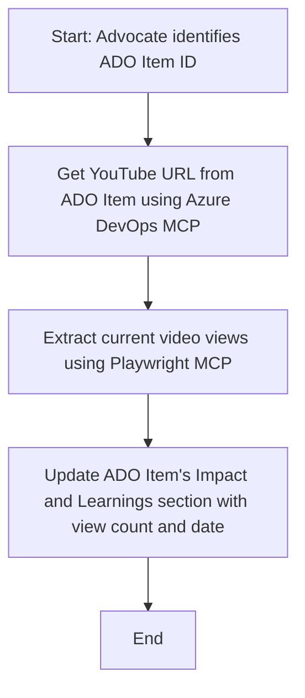

<!--
CO_OP_TRANSLATOR_METADATA:
{
  "original_hash": "14a2dfbea55ef735660a06bd6bdfe5f3",
  "translation_date": "2025-07-14T06:10:18+00:00",
  "source_file": "09-CaseStudy/UpdateADOItemsFromYT.md",
  "language_code": "ko"
}
-->
# 사례 연구: MCP를 활용한 YouTube 데이터 기반 Azure DevOps 항목 업데이트

> **Disclaimer:** YouTube와 같은 플랫폼에서 가져온 데이터를 사용해 Azure DevOps 항목을 자동으로 업데이트하는 온라인 도구와 보고서가 이미 존재합니다. 아래 시나리오는 MCP 도구를 활용한 자동화 및 통합 작업의 예시로서 참고용으로 제공됩니다.

## 개요

이 사례 연구는 Model Context Protocol(MCP)과 관련 도구들이 YouTube와 같은 온라인 플랫폼에서 가져온 정보를 활용해 Azure DevOps(ADO) 작업 항목을 자동으로 업데이트하는 방법 중 하나를 보여줍니다. 설명된 시나리오는 이러한 도구들의 광범위한 기능 중 하나의 예시이며, 유사한 자동화 요구에 맞게 다양하게 적용할 수 있습니다.

예를 들어, Advocate는 ADO 항목을 통해 온라인 세션을 추적하며, 각 항목에는 YouTube 동영상 URL이 포함되어 있습니다. MCP 도구를 활용하면 Advocate는 동영상 조회수와 같은 최신 지표를 반복적이고 자동화된 방식으로 ADO 항목에 반영할 수 있습니다. 이 방법은 온라인 소스의 정보를 ADO나 다른 시스템에 통합해야 하는 다른 사례에도 일반화할 수 있습니다.

## 시나리오

Advocate는 온라인 세션과 커뮤니티 참여의 영향을 추적하는 역할을 맡고 있습니다. 각 세션은 'DevRel' 프로젝트 내 ADO 작업 항목으로 기록되며, 작업 항목에는 YouTube 동영상 URL 필드가 포함되어 있습니다. 세션의 도달 범위를 정확히 보고하기 위해 Advocate는 현재 동영상 조회수와 해당 정보를 조회한 날짜를 ADO 항목에 업데이트해야 합니다.

## 사용 도구

- [Azure DevOps MCP](https://github.com/microsoft/azure-devops-mcp): MCP를 통해 ADO 작업 항목에 프로그래밍 방식으로 접근하고 업데이트할 수 있게 해줍니다.
- [Playwright MCP](https://github.com/microsoft/playwright-mcp): 브라우저 동작을 자동화하여 YouTube 동영상 통계와 같은 실시간 데이터를 추출합니다.

## 단계별 작업 흐름

1. **ADO 항목 식별**: 'DevRel' 프로젝트 내 ADO 작업 항목 ID(예: 1234)를 시작점으로 합니다.
2. **YouTube URL 조회**: Azure DevOps MCP 도구를 사용해 작업 항목에서 YouTube URL을 가져옵니다.
3. **동영상 조회수 추출**: Playwright MCP 도구를 사용해 YouTube URL에 접속하여 현재 조회수를 추출합니다.
4. **ADO 항목 업데이트**: Azure DevOps MCP 도구를 통해 최신 조회수와 조회 날짜를 ADO 작업 항목의 'Impact and Learnings' 섹션에 기록합니다.

## 예시 프롬프트

```bash
- Work with the ADO Item ID: 1234
- The project is '2025-Awesome'
- Get the YouTube URL for the ADO item
- Use Playwright to get the current views from the YouTube video
- Update the ADO item with the current video views and the updated date of the information
```

## Mermaid 플로우차트



## 기술 구현

- **MCP 오케스트레이션**: MCP 서버가 Azure DevOps MCP와 Playwright MCP 도구의 사용을 조율하며 작업 흐름을 관리합니다.
- **자동화**: 수동으로 실행하거나 정기적으로 실행되도록 예약하여 ADO 항목을 최신 상태로 유지할 수 있습니다.
- **확장성**: 같은 패턴을 활용해 좋아요, 댓글 등 다른 온라인 지표나 다른 플랫폼의 데이터로 ADO 항목을 업데이트하는 데도 적용할 수 있습니다.

## 결과 및 영향

- **효율성**: Advocate의 수작업 부담을 줄이고 동영상 지표 조회 및 업데이트를 자동화합니다.
- **정확성**: ADO 항목이 온라인 소스에서 제공하는 최신 데이터를 반영하도록 보장합니다.
- **재사용성**: 다른 데이터 소스나 지표를 다루는 유사한 시나리오에 재사용 가능한 작업 흐름을 제공합니다.

## 참고 자료

- [Azure DevOps MCP](https://github.com/microsoft/azure-devops-mcp)
- [Playwright MCP](https://github.com/microsoft/playwright-mcp)
- [Model Context Protocol (MCP)](https://modelcontextprotocol.io/)

**면책 조항**:  
이 문서는 AI 번역 서비스 [Co-op Translator](https://github.com/Azure/co-op-translator)를 사용하여 번역되었습니다. 정확성을 위해 최선을 다하고 있으나, 자동 번역에는 오류나 부정확한 부분이 있을 수 있음을 유의하시기 바랍니다. 원문은 해당 언어의 원본 문서가 권위 있는 출처로 간주되어야 합니다. 중요한 정보의 경우 전문적인 인간 번역을 권장합니다. 본 번역 사용으로 인해 발생하는 오해나 잘못된 해석에 대해 당사는 책임을 지지 않습니다.