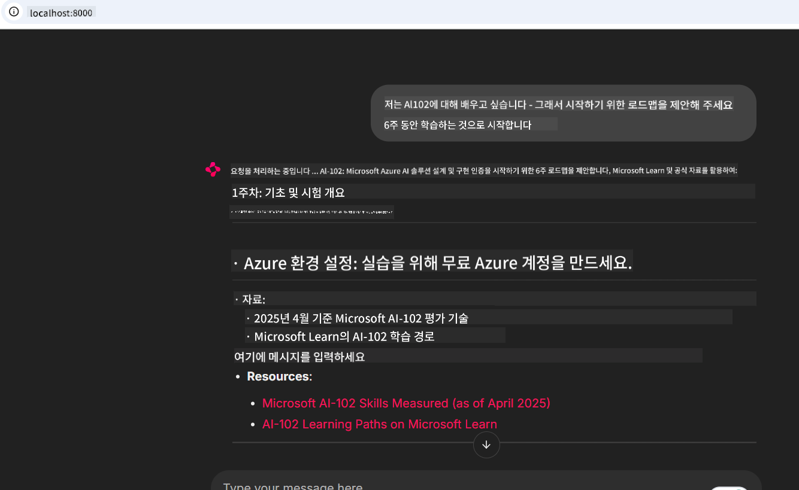

<!--
CO_OP_TRANSLATOR_METADATA:
{
  "original_hash": "4319d291c9d124ecafea52b3d04bfa0e",
  "translation_date": "2025-07-14T06:20:25+00:00",
  "source_file": "09-CaseStudy/docs-mcp/README.md",
  "language_code": "ko"
}
-->
# 사례 연구: 클라이언트에서 Microsoft Learn Docs MCP 서버에 연결하기

코드를 해결하려고 하면서 문서 사이트, Stack Overflow, 그리고 끝없는 검색 엔진 탭 사이를 오가 본 적이 있나요? 아마도 문서 전용으로 두 번째 모니터를 사용하거나 IDE와 브라우저 사이를 계속해서 alt-tab 하고 있을지도 모릅니다. 문서를 여러분의 워크플로우 안으로, 앱이나 IDE, 혹은 자신만의 맞춤 도구에 통합할 수 있다면 훨씬 더 좋지 않을까요? 이 사례 연구에서는 클라이언트 애플리케이션에서 직접 Microsoft Learn Docs MCP 서버에 연결하는 방법을 살펴보겠습니다.

## 개요

현대 개발은 단순히 코드를 작성하는 것을 넘어, 적시에 적절한 정보를 찾는 것입니다. 문서는 어디에나 있지만, 가장 필요한 곳인 도구와 워크플로우 안에는 거의 없습니다. 문서 검색을 애플리케이션에 직접 통합하면 시간을 절약하고, 컨텍스트 전환을 줄이며, 생산성을 높일 수 있습니다. 이 섹션에서는 클라이언트를 Microsoft Learn Docs MCP 서버에 연결하여 앱을 떠나지 않고도 실시간, 상황에 맞는 문서에 접근하는 방법을 보여드립니다.

연결 설정, 요청 전송, 스트리밍 응답을 효율적으로 처리하는 과정을 단계별로 안내합니다. 이 방법은 워크플로우를 간소화할 뿐만 아니라 더 똑똑하고 유용한 개발자 도구를 만드는 길을 열어줍니다.

## 학습 목표

왜 이 작업을 할까요? 최고의 개발자 경험은 마찰을 없애는 경험이기 때문입니다. 코드 편집기, 챗봇, 웹 앱이 Microsoft Learn의 최신 콘텐츠를 사용해 문서 질문에 즉시 답할 수 있는 세상을 상상해 보세요. 이 장을 마치면 다음을 할 수 있게 됩니다:

- 문서용 MCP 서버-클라이언트 통신의 기본 이해
- Microsoft Learn Docs MCP 서버에 연결하는 콘솔 또는 웹 애플리케이션 구현
- 실시간 문서 검색을 위한 스트리밍 HTTP 클라이언트 사용법
- 애플리케이션 내 문서 응답 로깅 및 해석

이 기술들을 통해 반응형을 넘어 진정으로 상호작용하고 상황을 인지하는 도구를 만드는 방법을 알게 될 것입니다.

## 시나리오 1 - MCP를 이용한 실시간 문서 검색

이 시나리오에서는 클라이언트를 Microsoft Learn Docs MCP 서버에 연결하여 앱을 떠나지 않고도 실시간, 상황에 맞는 문서에 접근하는 방법을 보여드립니다.

실습해 봅시다. 여러분의 과제는 Microsoft Learn Docs MCP 서버에 연결하고, `microsoft_docs_search` 도구를 호출하며, 스트리밍 응답을 콘솔에 기록하는 앱을 작성하는 것입니다.

### 왜 이 방법인가요?
더 발전된 통합을 구축하는 기초가 되기 때문입니다—챗봇, IDE 확장, 웹 대시보드 등 어떤 것을 만들든 말이죠.

이 시나리오의 코드와 지침은 이 사례 연구 내 [`solution`](./solution/README.md) 폴더에 있습니다. 다음 단계를 따라 연결을 설정할 수 있습니다:
- 공식 MCP SDK와 스트리밍 HTTP 클라이언트를 사용해 연결
- 쿼리 매개변수와 함께 `microsoft_docs_search` 도구 호출하여 문서 검색
- 적절한 로깅과 오류 처리 구현
- 사용자가 여러 검색 쿼리를 입력할 수 있는 인터랙티브 콘솔 인터페이스 생성

이 시나리오는 다음을 보여줍니다:
- Docs MCP 서버에 연결하기
- 쿼리 전송하기
- 결과 파싱 및 출력하기

솔루션 실행 예시는 다음과 같습니다:

```
Prompt> What is Azure Key Vault?
Answer> Azure Key Vault is a cloud service for securely storing and accessing secrets. ...
```

아래는 최소한의 샘플 솔루션입니다. 전체 코드와 자세한 내용은 solution 폴더에서 확인할 수 있습니다.

<details>
<summary>Python</summary>

```python
import asyncio
from mcp.client.streamable_http import streamablehttp_client
from mcp import ClientSession

async def main():
    async with streamablehttp_client("https://learn.microsoft.com/api/mcp") as (read_stream, write_stream, _):
        async with ClientSession(read_stream, write_stream) as session:
            await session.initialize()
            result = await session.call_tool("microsoft_docs_search", {"query": "Azure Functions best practices"})
            print(result.content)

if __name__ == "__main__":
    asyncio.run(main())
```

- 전체 구현과 로깅은 [`scenario1.py`](../../../../09-CaseStudy/docs-mcp/solution/python/scenario1.py)를 참고하세요.
- 설치 및 사용법은 같은 폴더의 [`README.md`](./solution/python/README.md)를 확인하세요.
</details>

## 시나리오 2 - MCP를 활용한 인터랙티브 학습 계획 생성 웹 앱

이 시나리오에서는 Docs MCP를 웹 개발 프로젝트에 통합하는 방법을 배웁니다. 목표는 사용자가 웹 인터페이스에서 직접 Microsoft Learn 문서를 검색할 수 있게 하여, 앱이나 사이트 내에서 문서에 즉시 접근할 수 있도록 하는 것입니다.

다음 내용을 배우게 됩니다:
- 웹 앱 설정하기
- Docs MCP 서버에 연결하기
- 사용자 입력 처리 및 결과 표시하기

솔루션 실행 예시는 다음과 같습니다:

```
User> I want to learn about AI102 - so suggest the roadmap to get it started from learn for 6 weeks

Assistant> Here’s a detailed 6-week roadmap to start your preparation for the AI-102: Designing and Implementing a Microsoft Azure AI Solution certification, using official Microsoft resources and focusing on exam skills areas:

---
## Week 1: Introduction & Fundamentals
- **Understand the Exam**: Review the [AI-102 exam skills outline](https://learn.microsoft.com/en-us/credentials/certifications/exams/ai-102/).
- **Set up Azure**: Sign up for a free Azure account if you don't have one.
- **Learning Path**: [Introduction to Azure AI services](https://learn.microsoft.com/en-us/training/modules/intro-to-azure-ai/)
- **Focus**: Get familiar with Azure portal, AI capabilities, and necessary tools.

....more weeks of the roadmap...

Let me know if you want module-specific recommendations or need more customized weekly tasks!
```

아래는 최소한의 샘플 솔루션입니다. 전체 코드와 자세한 내용은 solution 폴더에서 확인할 수 있습니다.



<details>
<summary>Python (Chainlit)</summary>

Chainlit은 대화형 AI 웹 앱을 만드는 프레임워크입니다. MCP 도구를 호출하고 실시간으로 결과를 표시하는 인터랙티브 챗봇과 어시스턴트를 쉽게 만들 수 있습니다. 빠른 프로토타이핑과 사용자 친화적인 인터페이스에 적합합니다.

```python
import chainlit as cl
import requests

MCP_URL = "https://learn.microsoft.com/api/mcp"

@cl.on_message
def handle_message(message):
    query = {"question": message}
    response = requests.post(MCP_URL, json=query)
    if response.ok:
        result = response.json()
        cl.Message(content=result.get("answer", "No answer found.")).send()
    else:
        cl.Message(content="Error: " + response.text).send()
```

- 전체 구현은 [`scenario2.py`](../../../../09-CaseStudy/docs-mcp/solution/python/scenario2.py)를 참고하세요.
- 설정 및 실행 방법은 [`README.md`](./solution/python/README.md)를 확인하세요.
</details>

## 시나리오 3: VS Code 내 MCP 서버를 이용한 인에디터 문서

브라우저 탭을 전환하지 않고 VS Code 내에서 Microsoft Learn Docs를 직접 보고 싶다면, MCP 서버를 에디터에 사용할 수 있습니다. 이를 통해 다음이 가능합니다:
- 코딩 환경을 떠나지 않고 VS Code 내에서 문서 검색 및 열람
- 문서를 참조하고 README나 강의 파일에 링크 직접 삽입
- GitHub Copilot과 MCP를 함께 활용해 AI 기반 문서 워크플로우 구현

**다음 방법을 배우게 됩니다:**
- 작업 공간 루트에 유효한 `.vscode/mcp.json` 파일 추가 (아래 예시 참고)
- VS Code에서 MCP 패널을 열거나 명령 팔레트를 사용해 문서 검색 및 삽입
- 작업 중 마크다운 파일에 문서 직접 참조
- GitHub Copilot과 이 워크플로우를 결합해 생산성 극대화

VS Code에서 MCP 서버 설정 예시는 다음과 같습니다:

```json
{
  "servers": {
    "LearnDocsMCP": {
      "url": "https://learn.microsoft.com/api/mcp"
    }
  }
}
```

</details>

> 스크린샷과 단계별 가이드가 포함된 자세한 설명은 [`README.md`](./solution/scenario3/README.md)를 참고하세요.


이 방법은 기술 강의를 만들거나 문서를 작성하거나 자주 참조가 필요한 코드를 개발하는 모든 분에게 이상적입니다.

## 주요 내용 정리

문서를 도구에 직접 통합하는 것은 단순한 편의가 아니라 생산성을 혁신하는 방법입니다. 클라이언트에서 Microsoft Learn Docs MCP 서버에 연결하면:

- 코드와 문서 사이의 컨텍스트 전환을 없앨 수 있습니다
- 최신의 상황에 맞는 문서를 실시간으로 받아올 수 있습니다
- 더 똑똑하고 상호작용하는 개발자 도구를 만들 수 있습니다

이 기술들은 효율적일 뿐만 아니라 사용하기 즐거운 솔루션을 만드는 데 도움이 될 것입니다.

## 추가 자료

이해를 더 깊게 하기 위해 다음 공식 자료를 참고하세요:

- [Microsoft Learn Docs MCP Server (GitHub)](https://github.com/MicrosoftDocs/mcp)
- [Get started with Azure MCP Server (mcp-python)](https://learn.microsoft.com/en-us/azure/developer/azure-mcp-server/get-started#create-the-python-app)
- [What is the Azure MCP Server?](https://learn.microsoft.com/en-us/azure/developer/azure-mcp-server/)
- [Model Context Protocol (MCP) Introduction](https://modelcontextprotocol.io/introduction)
- [Add plugins from a MCP Server (Python)](https://learn.microsoft.com/en-us/semantic-kernel/concepts/plugins/adding-mcp-plugins)

**면책 조항**:  
이 문서는 AI 번역 서비스 [Co-op Translator](https://github.com/Azure/co-op-translator)를 사용하여 번역되었습니다. 정확성을 위해 최선을 다하고 있으나, 자동 번역에는 오류나 부정확한 부분이 있을 수 있음을 유의해 주시기 바랍니다. 원문은 해당 언어의 원본 문서가 권위 있는 출처로 간주되어야 합니다. 중요한 정보의 경우 전문적인 인간 번역을 권장합니다. 본 번역 사용으로 인해 발생하는 오해나 잘못된 해석에 대해 당사는 책임을 지지 않습니다.