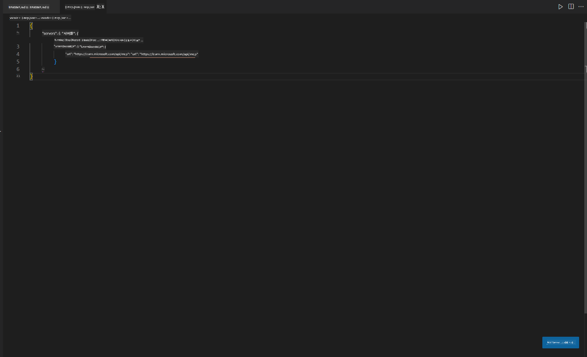
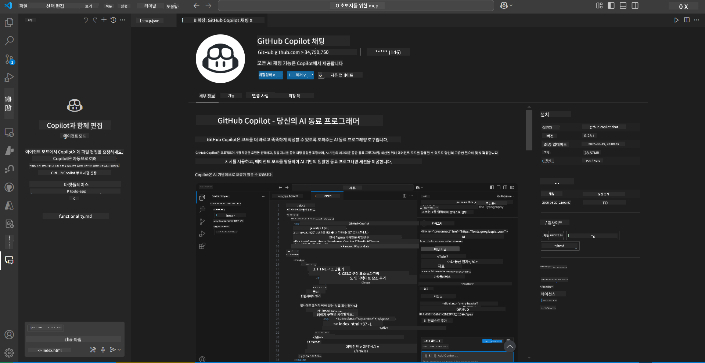
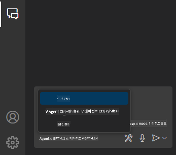
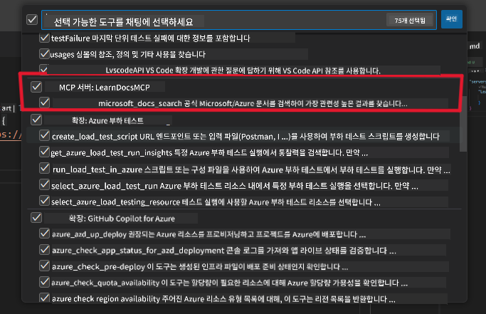
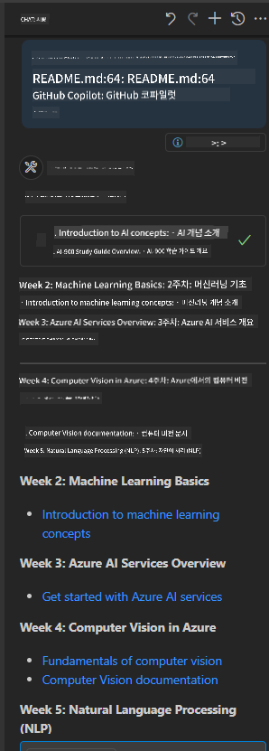
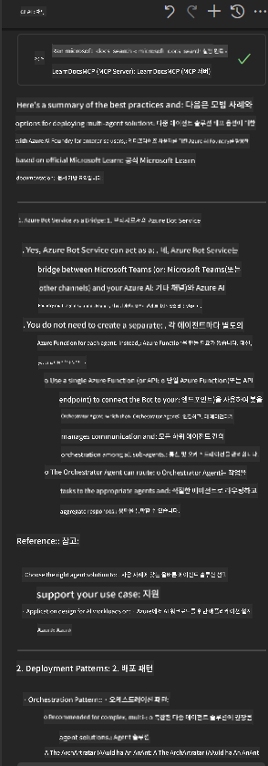

<!--
CO_OP_TRANSLATOR_METADATA:
{
  "original_hash": "db532b1ec386c9ce38c791653dc3c881",
  "translation_date": "2025-07-14T06:48:40+00:00",
  "source_file": "09-CaseStudy/docs-mcp/solution/scenario3/README.md",
  "language_code": "ko"
}
-->
# 시나리오 3: VS Code에서 MCP 서버와 함께하는 인-에디터 문서

## 개요

이 시나리오에서는 MCP 서버를 사용해 Microsoft Learn Docs를 Visual Studio Code 환경 안으로 직접 가져오는 방법을 배웁니다. 문서를 찾기 위해 브라우저 탭을 계속 전환하는 대신, 에디터 내에서 공식 문서를 검색하고 참고할 수 있습니다. 이 방법은 작업 흐름을 간소화하고 집중력을 유지하며 GitHub Copilot과 같은 도구와 원활하게 통합할 수 있게 해줍니다.

- VS Code 내에서 코딩 환경을 벗어나지 않고 문서를 검색하고 읽기
- README나 강의 파일에 문서 참조 및 링크 직접 삽입
- GitHub Copilot과 MCP를 함께 사용해 AI 기반 문서 작업 흐름 구현

## 학습 목표

이 장을 마치면 VS Code 내에서 MCP 서버를 설정하고 활용해 문서 및 개발 작업 흐름을 향상시키는 방법을 이해하게 됩니다. 다음을 할 수 있습니다:

- 문서 조회를 위해 MCP 서버를 사용하는 작업 공간 구성
- VS Code 내에서 문서를 검색하고 바로 삽입
- GitHub Copilot과 MCP의 기능을 결합해 더 생산적인 AI 지원 작업 흐름 구축

이 기술들은 개발자나 기술 작가로서 집중력을 유지하고 문서 품질을 높이며 생산성을 향상하는 데 도움이 됩니다.

## 솔루션

인-에디터 문서 접근을 위해 MCP 서버를 VS Code와 GitHub Copilot과 통합하는 일련의 단계를 따릅니다. 이 솔루션은 강의 저자, 문서 작성자, 개발자가 문서와 Copilot 작업 중에도 에디터에 집중하고자 할 때 이상적입니다.

- 강의나 프로젝트 문서를 작성하면서 README에 참조 링크를 빠르게 추가
- Copilot으로 코드를 생성하고 MCP로 관련 문서를 즉시 찾아 인용
- 에디터 내 집중력을 유지하며 생산성 향상

### 단계별 가이드

시작하려면 다음 단계를 따르세요. 각 단계마다 assets 폴더의 스크린샷을 추가해 과정을 시각적으로 설명할 수 있습니다.

1. **MCP 구성 추가:**
   프로젝트 루트에 `.vscode/mcp.json` 파일을 만들고 다음 구성을 추가하세요:
   ```json
   {
     "servers": {
       "LearnDocsMCP": {
         "url": "https://learn.microsoft.com/api/mcp"
       }
     }
   }
   ```  
   이 구성은 VS Code가 [`Microsoft Learn Docs MCP 서버`](https://github.com/MicrosoftDocs/mcp)에 연결하는 방법을 알려줍니다.
   
   
    
2. **GitHub Copilot Chat 패널 열기:**
   GitHub Copilot 확장 프로그램이 설치되어 있지 않다면 VS Code의 확장 뷰에서 설치하세요. [Visual Studio Code Marketplace](https://marketplace.visualstudio.com/items?itemName=GitHub.copilot-chat)에서 직접 다운로드할 수 있습니다. 그런 다음 사이드바에서 Copilot Chat 패널을 엽니다.

   

3. **에이전트 모드 활성화 및 도구 확인:**
   Copilot Chat 패널에서 에이전트 모드를 활성화하세요.

   

   에이전트 모드를 켠 후 MCP 서버가 사용 가능한 도구 목록에 있는지 확인합니다. 이렇게 하면 Copilot 에이전트가 문서 서버에 접근해 관련 정보를 가져올 수 있습니다.
   
   

4. **새 채팅 시작 및 에이전트에 질문하기:**
   Copilot Chat 패널에서 새 채팅을 열고 문서 관련 질문을 에이전트에 입력하세요. 에이전트는 MCP 서버를 통해 관련 Microsoft Learn 문서를 에디터 내에서 바로 가져와 보여줍니다.

   - *"주제 X에 대한 학습 계획을 작성하려고 합니다. 8주 동안 공부할 예정인데, 각 주차별로 어떤 내용을 공부해야 할지 제안해 주세요."*

   

5. **실시간 질의:**

   > Azure AI Foundry Discord의 [#get-help](https://discord.gg/D6cRhjHWSC) 섹션에서 실시간 질의를 가져왔습니다 ([원본 메시지 보기](https://discord.com/channels/1113626258182504448/1385498306720829572)):
   
   *"Azure AI Foundry에서 개발한 AI 에이전트로 다중 에이전트 솔루션을 배포하는 방법에 대해 답을 찾고 있습니다. Copilot Studio 채널 같은 직접적인 배포 방법이 없는 것 같은데, 기업 사용자가 상호작용하며 작업을 수행할 수 있도록 배포하는 다양한 방법은 무엇인가요?  
   MS Teams와 Azure AI Foundry 에이전트 간의 다리 역할을 할 수 있는 Azure Bot 서비스를 사용할 수 있다는 여러 기사/블로그를 봤는데, Azure Function을 통해 Orchestrator Agent에 연결하는 Azure Bot을 설정하면 작동할까요? 아니면 다중 에이전트 솔루션의 각 AI 에이전트 부분마다 Azure Function을 만들어 Bot Framework에서 오케스트레이션을 해야 하나요? 다른 제안도 환영합니다."*

   

   에이전트는 관련 문서 링크와 요약을 제공하며, 이를 마크다운 파일에 바로 삽입하거나 코드 참조로 활용할 수 있습니다.
   
### 샘플 질의

다음은 시도해볼 수 있는 예시 질의입니다. 이 질의들은 MCP 서버와 Copilot이 어떻게 협력해 VS Code를 벗어나지 않고도 즉각적이고 상황에 맞는 문서와 참조를 제공하는지 보여줍니다:

- "Azure Functions 트리거 사용법을 보여줘."
- "Azure Key Vault 공식 문서 링크를 삽입해 줘."
- "Azure 리소스 보안 모범 사례는 무엇인가?"
- "Azure AI 서비스 빠른 시작 가이드를 찾아줘."

이 질의들은 MCP 서버와 Copilot이 함께 작동해 VS Code 내에서 즉시 문서와 참조를 제공하는 방식을 시연합니다.

---

**면책 조항**:  
이 문서는 AI 번역 서비스 [Co-op Translator](https://github.com/Azure/co-op-translator)를 사용하여 번역되었습니다. 정확성을 위해 최선을 다하고 있으나, 자동 번역에는 오류나 부정확한 부분이 있을 수 있음을 유의하시기 바랍니다. 원문은 해당 언어의 원본 문서가 권위 있는 출처로 간주되어야 합니다. 중요한 정보의 경우 전문적인 인간 번역을 권장합니다. 본 번역 사용으로 인해 발생하는 오해나 잘못된 해석에 대해 당사는 책임을 지지 않습니다.