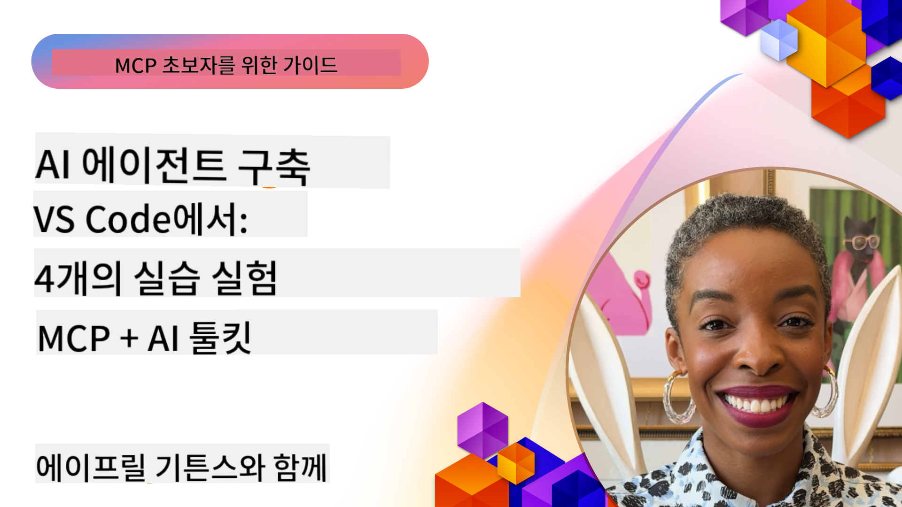

<!--
CO_OP_TRANSLATOR_METADATA:
{
  "original_hash": "1b000fd6e1b04c047578bfc5d07d54eb",
  "translation_date": "2025-07-29T00:33:16+00:00",
  "source_file": "10-StreamliningAIWorkflowsBuildingAnMCPServerWithAIToolkit/README.md",
  "language_code": "ko"
}
-->
# AI 워크플로우 간소화: AI Toolkit을 활용한 MCP 서버 구축

## 🎯 개요

_(위 이미지를 클릭하면 이 강의의 동영상을 볼 수 있습니다)_

**Model Context Protocol (MCP) 워크숍**에 오신 것을 환영합니다! 이 포괄적인 실습 워크숍은 AI 애플리케이션 개발을 혁신하는 두 가지 최첨단 기술을 결합합니다:

- **🔗 Model Context Protocol (MCP)**: AI 도구 통합을 위한 개방형 표준
- **🛠️ Visual Studio Code용 AI Toolkit (AITK)**: Microsoft의 강력한 AI 개발 확장 프로그램

### 🎓 학습 목표

이 워크숍을 통해 AI 모델을 실제 도구 및 서비스와 연결하는 지능형 애플리케이션 구축 기술을 익히게 됩니다. 자동화된 테스트부터 맞춤형 API 통합까지, 복잡한 비즈니스 문제를 해결할 수 있는 실질적인 기술을 습득할 수 있습니다.

## 🏗️ 기술 스택

### 🔌 Model Context Protocol (MCP)

MCP는 **"AI를 위한 USB-C"**로, AI 모델을 외부 도구 및 데이터 소스와 연결하는 범용 표준입니다.

**✨ 주요 기능:**

- 🔄 **표준화된 통합**: AI 도구 연결을 위한 범용 인터페이스
- 🏛️ **유연한 아키텍처**: stdio/SSE 전송을 통한 로컬 및 원격 서버 지원
- 🧰 **풍부한 생태계**: 하나의 프로토콜에서 도구, 프롬프트 및 리소스 제공
- 🔒 **엔터프라이즈 준비**: 내장된 보안 및 안정성

**🎯 MCP의 중요성:**
USB-C가 케이블 혼란을 없앴듯이, MCP는 AI 통합의 복잡성을 제거합니다. 하나의 프로토콜로 무한한 가능성을 제공합니다.

### 🤖 Visual Studio Code용 AI Toolkit (AITK)

Microsoft의 대표적인 AI 개발 확장 프로그램으로, VS Code를 AI 개발의 중심지로 변환합니다.

**🚀 핵심 기능:**

- 📦 **모델 카탈로그**: Azure AI, GitHub, Hugging Face, Ollama의 모델에 액세스
- ⚡ **로컬 추론**: ONNX 최적화 CPU/GPU/NPU 실행
- 🏗️ **에이전트 빌더**: MCP 통합을 통한 시각적 AI 에이전트 개발
- 🎭 **멀티모달 지원**: 텍스트, 비전 및 구조화된 출력 지원

**💡 개발 혜택:**

- 설정 없이 모델 배포
- 시각적 프롬프트 엔지니어링
- 실시간 테스트 환경
- MCP 서버와의 원활한 통합

## 📚 학습 여정

### [🚀 모듈 1: AI Toolkit 기본](./lab1/README.md)

**소요 시간**: 15분

- 🛠️ AI Toolkit을 설치하고 VS Code에서 구성하기
- 🗂️ 모델 카탈로그 탐색 (GitHub, ONNX, OpenAI, Anthropic, Google의 100개 이상의 모델)
- 🎮 실시간 모델 테스트를 위한 인터랙티브 플레이그라운드 익히기
- 🤖 에이전트 빌더로 첫 번째 AI 에이전트 구축
- 📊 내장된 메트릭(F1, 관련성, 유사성, 일관성)을 사용하여 모델 성능 평가
- ⚡ 배치 처리 및 멀티모달 지원 기능 학습

**🎯 학습 결과**: AITK 기능에 대한 포괄적인 이해를 바탕으로 기능적인 AI 에이전트 생성

### [🌐 모듈 2: MCP와 AI Toolkit 기본](./lab2/README.md)

**소요 시간**: 20분

- 🧠 Model Context Protocol (MCP) 아키텍처 및 개념 숙달
- 🌐 Microsoft의 MCP 서버 생태계 탐색
- 🤖 Playwright MCP 서버를 사용하여 브라우저 자동화 에이전트 구축
- 🔧 MCP 서버를 AI Toolkit 에이전트 빌더와 통합
- 📊 에이전트 내 MCP 도구 구성 및 테스트
- 🚀 MCP 기반 에이전트를 내보내고 배포

**🎯 학습 결과**: 외부 도구로 강화된 AI 에이전트 배포

### [🔧 모듈 3: AI Toolkit을 활용한 고급 MCP 개발](./lab3/README.md)

**소요 시간**: 20분

- 💻 AI Toolkit을 사용하여 맞춤형 MCP 서버 생성
- 🐍 최신 MCP Python SDK(v1.9.3) 구성 및 사용
- 🔍 디버깅을 위한 MCP Inspector 설정 및 활용
- 🛠️ 전문 디버깅 워크플로우를 사용하여 Weather MCP 서버 구축
- 🧪 에이전트 빌더 및 Inspector 환경에서 MCP 서버 디버깅

**🎯 학습 결과**: 현대적인 도구를 사용하여 맞춤형 MCP 서버 개발 및 디버깅

### [🐙 모듈 4: 실용적인 MCP 개발 - 맞춤형 GitHub 클론 서버](./lab4/README.md)

**소요 시간**: 30분

- 🏗️ 개발 워크플로우를 위한 실제 GitHub 클론 MCP 서버 구축
- 🔄 유효성 검사 및 오류 처리를 포함한 스마트 리포지토리 클로닝 구현
- 📁 지능형 디렉토리 관리 및 VS Code 통합 생성
- 🤖 맞춤형 MCP 도구를 사용한 GitHub Copilot 에이전트 모드 활용
- 🛡️ 생산 준비된 안정성과 크로스 플랫폼 호환성 적용

**🎯 학습 결과**: 실제 개발 워크플로우를 간소화하는 생산 준비된 MCP 서버 배포

## 💡 실제 응용 및 영향

### 🏢 엔터프라이즈 활용 사례

#### 🔄 DevOps 자동화

지능형 자동화를 통해 개발 워크플로우를 혁신:

- **스마트 리포지토리 관리**: AI 기반 코드 리뷰 및 병합 결정
- **지능형 CI/CD**: 코드 변경에 따른 자동화된 파이프라인 최적화
- **이슈 분류**: 자동 버그 분류 및 할당

#### 🧪 품질 보증 혁신

AI 기반 자동화를 통해 테스트를 향상:

- **지능형 테스트 생성**: 포괄적인 테스트 스위트를 자동으로 생성
- **시각적 회귀 테스트**: AI 기반 UI 변경 감지
- **성능 모니터링**: 사전 문제 식별 및 해결

#### 📊 데이터 파이프라인 인텔리전스

더 스마트한 데이터 처리 워크플로우 구축:

- **적응형 ETL 프로세스**: 자체 최적화 데이터 변환
- **이상 탐지**: 실시간 데이터 품질 모니터링
- **지능형 라우팅**: 스마트 데이터 흐름 관리

#### 🎧 고객 경험 향상

탁월한 고객 상호작용 생성:

- **컨텍스트 인식 지원**: 고객 기록에 액세스하는 AI 에이전트
- **예측적 문제 해결**: 예측적 고객 서비스
- **멀티 채널 통합**: 플랫폼 전반에 걸친 통합 AI 경험

## 🛠️ 사전 준비 및 설정

### 💻 시스템 요구 사항

| 구성 요소 | 요구 사항 | 비고 |
|-----------|-------------|-------|
| **운영 체제** | Windows 10+, macOS 10.15+, Linux | 최신 OS |
| **Visual Studio Code** | 최신 안정 버전 | AITK에 필요 |
| **Node.js** | v18.0+ 및 npm | MCP 서버 개발용 |
| **Python** | 3.10+ | Python MCP 서버에 선택적 |
| **메모리** | 최소 8GB RAM | 로컬 모델용 16GB 권장 |

### 🔧 개발 환경

#### 추천 VS Code 확장 프로그램

- **AI Toolkit** (ms-windows-ai-studio.windows-ai-studio)
- **Python** (ms-python.python)
- **Python Debugger** (ms-python.debugpy)
- **GitHub Copilot** (GitHub.copilot) - 선택 사항이지만 유용함

#### 선택적 도구

- **uv**: 최신 Python 패키지 관리자
- **MCP Inspector**: MCP 서버를 위한 시각적 디버깅 도구
- **Playwright**: 웹 자동화 예제용

## 🎖️ 학습 결과 및 인증 경로

### 🏆 기술 숙련 체크리스트

이 워크숍을 완료하면 다음을 숙달하게 됩니다:

#### 🎯 핵심 역량

- [ ] **MCP 프로토콜 숙련**: 아키텍처 및 구현 패턴에 대한 깊은 이해
- [ ] **AITK 숙련도**: 빠른 개발을 위한 AI Toolkit의 전문적 사용
- [ ] **맞춤형 서버 개발**: 생산 MCP 서버 구축, 배포 및 유지 관리
- [ ] **도구 통합 우수성**: AI를 기존 개발 워크플로우와 원활하게 연결
- [ ] **문제 해결 응용**: 학습한 기술을 실제 비즈니스 문제에 적용

#### 🔧 기술적 기술

- [ ] VS Code에서 AI Toolkit 설정 및 구성
- [ ] 맞춤형 MCP 서버 설계 및 구현
- [ ] MCP 아키텍처와 GitHub 모델 통합
- [ ] Playwright를 사용한 자동화 테스트 워크플로우 구축
- [ ] 생산용 AI 에이전트 배포
- [ ] MCP 서버 성능 디버깅 및 최적화

#### 🚀 고급 기능

- [ ] 엔터프라이즈 규모의 AI 통합 설계
- [ ] AI 애플리케이션을 위한 보안 모범 사례 구현
- [ ] 확장 가능한 MCP 서버 아키텍처 설계
- [ ] 특정 도메인을 위한 맞춤형 도구 체인 생성
- [ ] AI 네이티브 개발에서 다른 사람을 멘토링

## 📖 추가 자료

- [MCP 사양](https://modelcontextprotocol.io/docs)
- [AI Toolkit GitHub 저장소](https://github.com/microsoft/vscode-ai-toolkit)
- [샘플 MCP 서버 컬렉션](https://github.com/modelcontextprotocol/servers)
- [모범 사례 가이드](https://modelcontextprotocol.io/docs/best-practices)

---

**🚀 AI 개발 워크플로우를 혁신할 준비가 되셨나요?**

MCP와 AI Toolkit으로 지능형 애플리케이션의 미래를 함께 만들어 봅시다!

**면책 조항**:  
이 문서는 AI 번역 서비스 [Co-op Translator](https://github.com/Azure/co-op-translator)를 사용하여 번역되었습니다. 정확성을 위해 최선을 다하고 있지만, 자동 번역에는 오류나 부정확성이 포함될 수 있습니다. 원본 문서의 원어 버전을 권위 있는 출처로 간주해야 합니다. 중요한 정보의 경우, 전문적인 인간 번역을 권장합니다. 이 번역 사용으로 인해 발생하는 오해나 잘못된 해석에 대해 책임을 지지 않습니다.