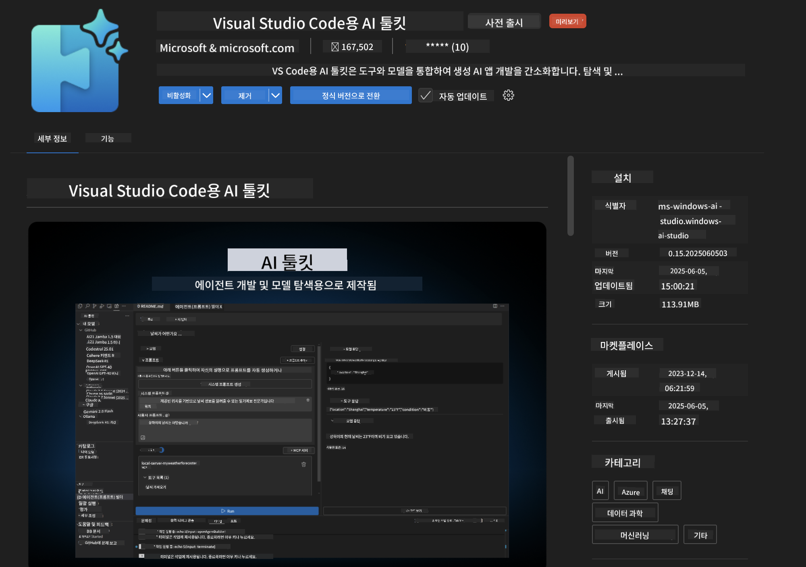
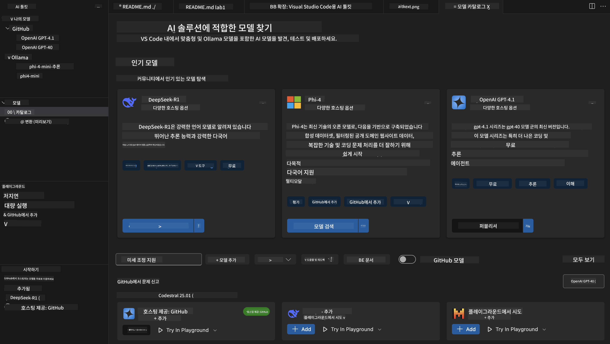
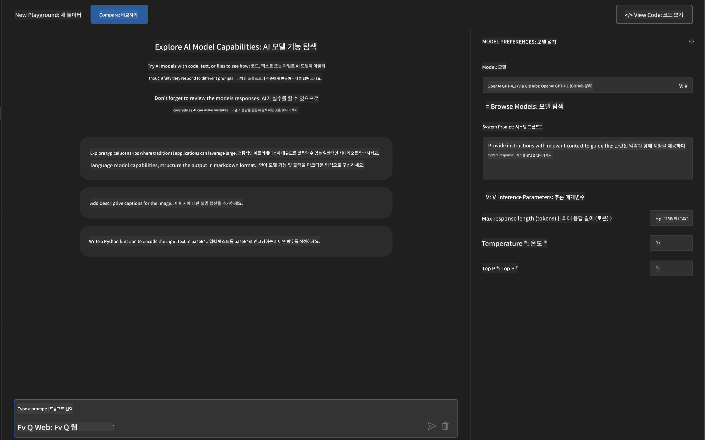
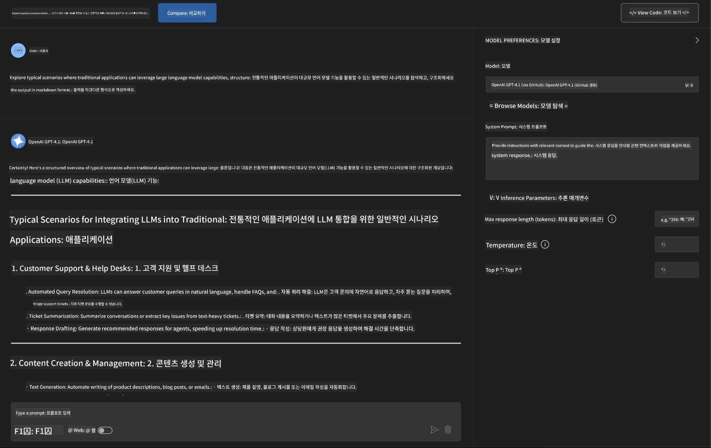
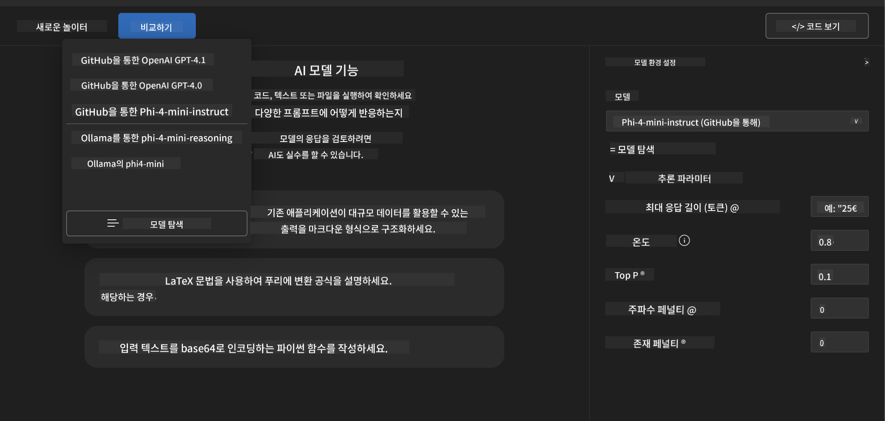
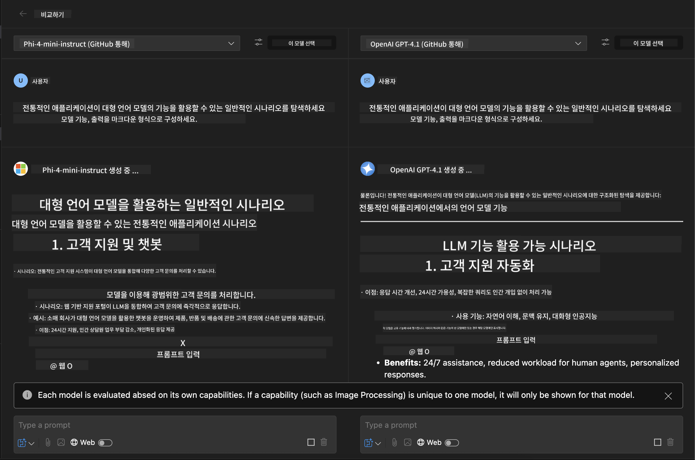
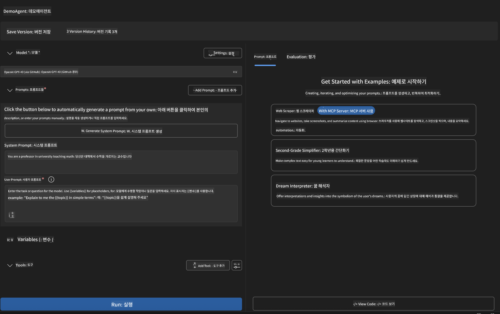
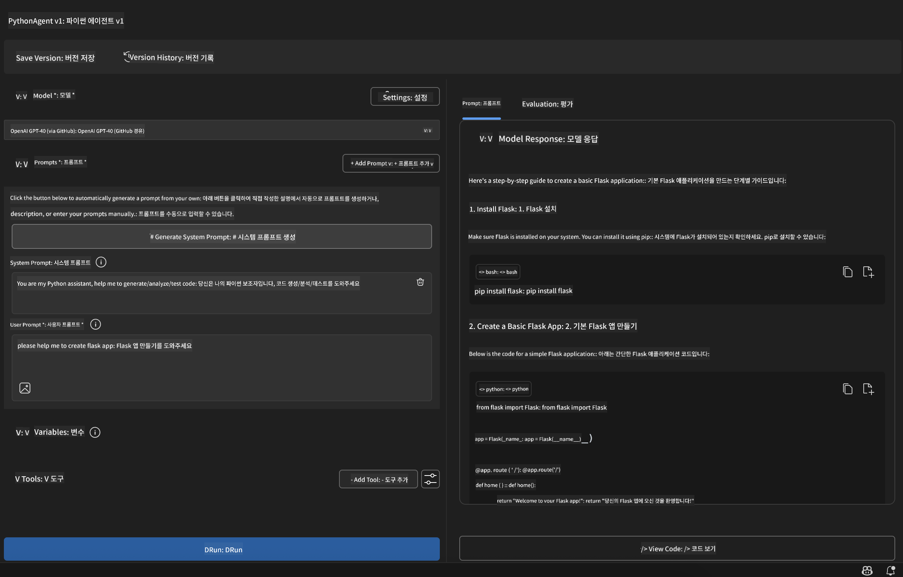

<!--
CO_OP_TRANSLATOR_METADATA:
{
  "original_hash": "2aa9dbc165e104764fa57e8a0d3f1c73",
  "translation_date": "2025-06-10T05:14:39+00:00",
  "source_file": "10-StreamliningAIWorkflowsBuildingAnMCPServerWithAIToolkit/lab1/README.md",
  "language_code": "ko"
}
-->
# 🚀 Module 1: AI Toolkit 기초

[]()
[]()
[]()

## 📋 학습 목표

이 모듈을 마치면 다음을 할 수 있습니다:
- ✅ Visual Studio Code용 AI Toolkit 설치 및 설정
- ✅ Model Catalog 탐색 및 다양한 모델 소스 이해
- ✅ Playground를 활용한 모델 테스트 및 실험
- ✅ Agent Builder를 이용한 맞춤형 AI 에이전트 생성
- ✅ 다양한 제공자의 모델 성능 비교
- ✅ 프롬프트 엔지니어링 최선의 방법 적용

## 🧠 AI Toolkit (AITK) 소개

**Visual Studio Code용 AI Toolkit**은 VS Code를 종합적인 AI 개발 환경으로 바꾸는 마이크로소프트의 대표 확장 기능입니다. AI 연구와 실제 애플리케이션 개발 사이의 간극을 메우며, 모든 수준의 개발자가 생성형 AI를 쉽게 활용할 수 있도록 합니다.

### 🌟 주요 기능

| 기능 | 설명 | 활용 사례 |
|---------|-------------|----------|
| **🗂️ Model Catalog** | GitHub, ONNX, OpenAI, Anthropic, Google에서 100개 이상의 모델 접근 | 모델 탐색 및 선택 |
| **🔌 BYOM 지원** | 자체 모델(로컬/원격) 통합 | 맞춤형 모델 배포 |
| **🎮 인터랙티브 Playground** | 채팅 인터페이스로 실시간 모델 테스트 | 빠른 프로토타입 제작 및 테스트 |
| **📎 멀티모달 지원** | 텍스트, 이미지, 첨부파일 처리 | 복합 AI 애플리케이션 |
| **⚡ 배치 처리** | 여러 프롬프트를 동시에 실행 | 효율적인 테스트 워크플로우 |
| **📊 모델 평가** | 내장 지표(F1, 관련성, 유사도, 일관성) | 성능 평가 |

### 🎯 AI Toolkit이 중요한 이유

- **🚀 개발 가속화**: 아이디어에서 프로토타입까지 몇 분 만에
- **🔄 통합 워크플로우**: 여러 AI 제공자를 하나의 인터페이스에서
- **🧪 간편한 실험**: 복잡한 설정 없이 모델 비교 가능
- **📈 프로덕션 준비 완료**: 프로토타입에서 배포까지 원활한 전환

## 🛠️ 사전 준비 및 설정

### 📦 AI Toolkit 확장 기능 설치

**1단계: 확장 기능 마켓플레이스 접속**
1. Visual Studio Code 실행
2. 확장 기능 뷰로 이동(`Ctrl+Shift+X` 또는 `Cmd+Shift+X`)
3. "AI Toolkit" 검색

**2단계: 버전 선택**
- **🟢 정식 버전**: 프로덕션 환경 권장
- **🔶 사전 출시 버전**: 최신 기능 미리 사용 가능

**3단계: 설치 및 활성화**



### ✅ 확인 사항
- [ ] VS Code 사이드바에 AI Toolkit 아이콘 표시
- [ ] 확장 기능이 활성화 및 실행 중
- [ ] 출력 패널에 설치 오류 없음

## 🧪 실습 1: GitHub 모델 탐색

**🎯 목표**: Model Catalog를 익히고 첫 AI 모델 테스트하기

### 📊 1단계: Model Catalog 탐색

Model Catalog는 AI 생태계로 가는 관문입니다. 여러 제공자의 모델을 모아 쉽게 발견하고 비교할 수 있습니다.

**🔍 탐색 가이드:**

AI Toolkit 사이드바에서 **MODELS - Catalog** 클릭



**💡 팁**: 코드 생성, 창의적 글쓰기, 분석 등 원하는 기능에 맞는 모델을 찾아보세요.

**⚠️ 참고**: GitHub 호스팅 모델은 무료지만 요청 및 토큰 사용에 제한이 있습니다. Azure AI나 기타 외부 모델에 접근하려면 적절한 API 키나 인증이 필요합니다.

### 🚀 2단계: 첫 모델 추가 및 설정

**모델 선택 전략:**
- **GPT-4.1**: 복잡한 추론과 분석에 적합
- **Phi-4-mini**: 가벼우며 단순 작업에 빠른 응답

**🔧 설정 과정:**
1. 카탈로그에서 **OpenAI GPT-4.1** 선택
2. **Add to My Models** 클릭하여 모델 등록
3. **Try in Playground** 클릭해 테스트 환경 실행
4. 모델 초기화 대기 (첫 설정 시 시간이 걸릴 수 있음)



**⚙️ 모델 파라미터 이해하기:**
- **Temperature**: 창의성 조절 (0 = 결정적, 1 = 창의적)
- **Max Tokens**: 최대 응답 길이
- **Top-p**: 응답 다양성을 위한 핵심 샘플링

### 🎯 3단계: Playground 인터페이스 마스터하기

Playground는 AI 실험실입니다. 최대한 활용하는 방법은 다음과 같습니다:

**🎨 프롬프트 엔지니어링 최선의 방법:**
1. **구체적으로 작성**: 명확하고 상세한 지시가 더 좋은 결과를 만듭니다
2. **맥락 제공**: 관련 배경 정보를 포함하세요
3. **예시 사용**: 원하는 결과를 예시로 보여주세요
4. **반복 개선**: 초기 결과를 바탕으로 프롬프트를 다듬으세요

**🧪 테스트 시나리오:**
```markdown
# Example 1: Code Generation
"Write a Python function that calculates the factorial of a number using recursion. Include error handling and docstrings."

# Example 2: Creative Writing
"Write a professional email to a client explaining a project delay, maintaining a positive tone while being transparent about challenges."

# Example 3: Data Analysis
"Analyze this sales data and provide insights: [paste your data]. Focus on trends, anomalies, and actionable recommendations."
```



### 🏆 도전 과제: 모델 성능 비교

**🎯 목표**: 동일한 프롬프트로 여러 모델을 비교해 강점을 파악

**📋 지침:**
1. **Phi-4-mini**를 작업 공간에 추가
2. GPT-4.1과 Phi-4-mini에 동일한 프롬프트 사용



3. 응답 품질, 속도, 정확도 비교
4. 결과 섹션에 분석 내용 기록



**💡 주목할 점:**
- LLM과 SLM 사용 시기
- 비용과 성능의 균형
- 모델별 특화 기능

## 🤖 실습 2: Agent Builder로 맞춤형 에이전트 만들기

**🎯 목표**: 특정 작업과 워크플로우에 맞춘 전문 AI 에이전트 생성

### 🏗️ 1단계: Agent Builder 이해하기

Agent Builder는 AI Toolkit의 핵심 기능입니다. 대형 언어 모델과 맞춤 지시, 파라미터, 전문 지식을 결합한 목적별 AI 어시스턴트를 만들 수 있습니다.

**🧠 에이전트 아키텍처 구성 요소:**
- **Core Model**: 기본 LLM (GPT-4, Groks, Phi 등)
- **System Prompt**: 에이전트 성격과 행동 정의
- **Parameters**: 최적 성능을 위한 세부 설정
- **Tools Integration**: 외부 API 및 MCP 서비스 연결
- **Memory**: 대화 맥락 및 세션 유지



### ⚙️ 2단계: 에이전트 설정 심화

**🎨 효과적인 시스템 프롬프트 작성:**
```markdown
# Template Structure:
## Role Definition
You are a [specific role] with expertise in [domain].

## Capabilities
- List specific abilities
- Define scope of knowledge
- Clarify limitations

## Behavior Guidelines
- Response style (formal, casual, technical)
- Output format preferences
- Error handling approach

## Examples
Provide 2-3 examples of ideal interactions
```

*물론 Generate System Prompt 기능을 사용해 AI가 프롬프트 생성과 최적화를 도와줄 수도 있습니다*

**🔧 파라미터 최적화:**
| 파라미터 | 권장 범위 | 활용 사례 |
|-----------|------------------|----------|
| **Temperature** | 0.1-0.3 | 기술적/사실적 응답 |
| **Temperature** | 0.7-0.9 | 창의적/브레인스토밍 작업 |
| **Max Tokens** | 500-1000 | 간결한 응답 |
| **Max Tokens** | 2000-4000 | 상세한 설명 |

### 🐍 3단계: 실습 - Python 프로그래밍 에이전트

**🎯 미션**: 전문 Python 코딩 어시스턴트 만들기

**📋 설정 단계:**

1. **모델 선택**: **Claude 3.5 Sonnet** 선택 (코딩에 최적)

2. **시스템 프롬프트 디자인**:
```markdown
# Python Programming Expert Agent

## Role
You are a senior Python developer with 10+ years of experience. You excel at writing clean, efficient, and well-documented Python code.

## Capabilities
- Write production-ready Python code
- Debug complex issues
- Explain code concepts clearly
- Suggest best practices and optimizations
- Provide complete working examples

## Response Format
- Always include docstrings
- Add inline comments for complex logic
- Suggest testing approaches
- Mention relevant libraries when applicable

## Code Quality Standards
- Follow PEP 8 style guidelines
- Use type hints where appropriate
- Handle exceptions gracefully
- Write readable, maintainable code
```

3. **파라미터 설정**:
   - Temperature: 0.2 (일관되고 신뢰할 수 있는 코드)
   - Max Tokens: 2000 (상세 설명)
   - Top-p: 0.9 (균형 잡힌 창의성)



### 🧪 4단계: Python 에이전트 테스트

**테스트 시나리오:**
1. **기본 기능**: "소수 찾기 함수 작성"
2. **복잡한 알고리즘**: "삽입, 삭제, 탐색 기능이 있는 이진 탐색 트리 구현"
3. **실제 문제**: "속도 제한과 재시도를 처리하는 웹 스크래퍼 구축"
4. **디버깅**: "이 코드 수정해 주세요 [버그 있는 코드 붙여넣기]"

**🏆 성공 기준:**
- ✅ 오류 없이 코드 실행
- ✅ 적절한 문서화 포함
- ✅ Python 모범 사례 준수
- ✅ 명확한 설명 제공
- ✅ 개선 사항 제안

## 🎓 Module 1 정리 및 다음 단계

### 📊 지식 점검

이해도를 확인하세요:
- [ ] 카탈로그 내 모델 간 차이를 설명할 수 있나요?
- [ ] 맞춤형 에이전트를 성공적으로 생성하고 테스트했나요?
- [ ] 다양한 사용 사례에 맞게 파라미터를 최적화할 수 있나요?
- [ ] 효과적인 시스템 프롬프트를 설계할 수 있나요?

### 📚 추가 자료

- **AI Toolkit 문서**: [공식 Microsoft Docs](https://github.com/microsoft/vscode-ai-toolkit)
- **프롬프트 엔지니어링 가이드**: [최선의 방법](https://platform.openai.com/docs/guides/prompt-engineering)
- **AI Toolkit 내 모델**: [개발 중인 모델](https://github.com/microsoft/vscode-ai-toolkit/blob/main/doc/models.md)

**🎉 축하합니다!** AI Toolkit의 기초를 완벽히 익히셨으며, 더 발전된 AI 애플리케이션 개발 준비가 되셨습니다!

### 🔜 다음 모듈로 계속 진행

더 고급 기능을 배우고 싶다면 **[Module 2: MCP with AI Toolkit Fundamentals](../lab2/README.md)** 로 이동하세요. 여기서 다음 내용을 배우게 됩니다:
- Model Context Protocol (MCP)을 이용해 에이전트를 외부 도구와 연결하는 방법
- Playwright를 활용한 브라우저 자동화 에이전트 구축
- AI Toolkit 에이전트와 MCP 서버 통합
- 외부 데이터와 기능으로 에이전트 성능 강화

**면책 조항**:  
이 문서는 AI 번역 서비스 [Co-op Translator](https://github.com/Azure/co-op-translator)를 사용하여 번역되었습니다. 정확성을 위해 노력하고 있으나, 자동 번역에는 오류나 부정확성이 포함될 수 있음을 양지해 주시기 바랍니다. 원본 문서의 원어가 권위 있는 출처로 간주되어야 합니다. 중요한 정보의 경우, 전문적인 인간 번역을 권장합니다. 본 번역 사용으로 인해 발생하는 오해나 잘못된 해석에 대해 당사는 책임을 지지 않습니다.