<!--
CO_OP_TRANSLATOR_METADATA:
{
  "original_hash": "a22b7dd11cd7690f99f9195877cafdc3",
  "translation_date": "2025-06-10T05:41:30+00:00",
  "source_file": "10-StreamliningAIWorkflowsBuildingAnMCPServerWithAIToolkit/lab2/README.md",
  "language_code": "ko"
}
-->
# 🌐 모듈 2: AI Toolkit과 함께하는 MCP 기본 개념

[]()
[]()
[]()

## 📋 학습 목표

이 모듈을 마치면 다음을 할 수 있습니다:
- ✅ Model Context Protocol(MCP)의 구조와 장점 이해하기
- ✅ Microsoft의 MCP 서버 생태계 탐색하기
- ✅ MCP 서버를 AI Toolkit Agent Builder와 통합하기
- ✅ Playwright MCP를 활용한 기능성 브라우저 자동화 에이전트 구축하기
- ✅ 에이전트 내에서 MCP 도구 구성 및 테스트하기
- ✅ MCP 기반 에이전트를 내보내고 실제 환경에 배포하기

## 🎯 모듈 1 기반 다지기

모듈 1에서는 AI Toolkit 기본기를 익히고 첫 Python 에이전트를 만들었습니다. 이제 혁신적인 **Model Context Protocol(MCP)**을 통해 외부 도구와 서비스에 연결해 에이전트를 **한층 더 강력하게** 만들어 보겠습니다.

기본 계산기에서 완전한 컴퓨터로 업그레이드하는 것처럼, 여러분의 AI 에이전트는 다음과 같은 능력을 갖추게 됩니다:
- 🌐 웹사이트 탐색 및 상호작용
- 📁 파일 접근 및 조작
- 🔧 기업 시스템 통합
- 📊 API를 통한 실시간 데이터 처리

## 🧠 Model Context Protocol(MCP) 이해하기

### 🔍 MCP란?

Model Context Protocol(MCP)은 AI 애플리케이션을 위한 **"USB-C"** 같은 혁신적인 오픈 표준입니다. 대형 언어 모델(LLM)을 외부 도구, 데이터 소스, 서비스와 연결해 줍니다. USB-C가 복잡한 케이블 문제를 하나의 표준 커넥터로 해결했듯, MCP도 AI 통합의 복잡함을 하나의 표준 프로토콜로 해소합니다.

### 🎯 MCP가 해결하는 문제

**MCP 이전:**
- 🔧 도구별 맞춤형 통합 필요
- 🔄 독점 솔루션에 의한 공급자 종속
- 🔒 임시 연결로 인한 보안 취약점
- ⏱️ 기본 통합에도 수개월 개발 소요

**MCP 도입 후:**
- ⚡ 플러그 앤 플레이 방식의 도구 통합
- 🔄 공급자 독립적인 아키텍처
- 🛡️ 내장된 보안 모범 사례 적용
- 🚀 몇 분 만에 새로운 기능 추가 가능

### 🏗️ MCP 아키텍처 상세 분석

MCP는 **클라이언트-서버 아키텍처**를 기반으로 안전하고 확장 가능한 생태계를 만듭니다:

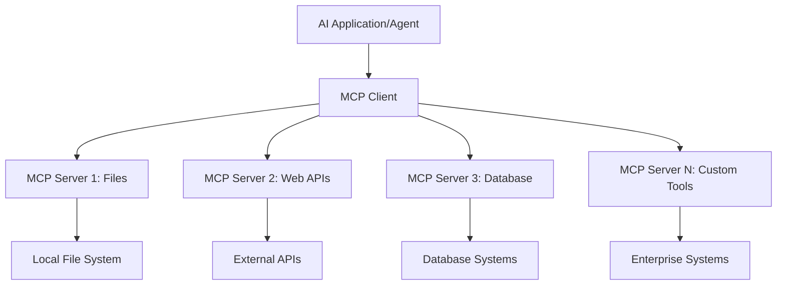

**🔧 핵심 구성 요소:**

| 구성 요소 | 역할 | 예시 |
|-----------|------|----------|
| **MCP Hosts** | MCP 서비스를 사용하는 애플리케이션 | Claude Desktop, VS Code, AI Toolkit |
| **MCP Clients** | 프로토콜 핸들러 (서버와 1:1 매칭) | 호스트 애플리케이션 내장 |
| **MCP Servers** | 표준 프로토콜로 기능 제공 | Playwright, Files, Azure, GitHub |
| **Transport Layer** | 통신 방식 | stdio, HTTP, WebSockets |

## 🏢 Microsoft의 MCP 서버 생태계

Microsoft는 실무 비즈니스 요구에 맞춘 엔터프라이즈급 MCP 서버를 다양하게 제공하며 MCP 생태계를 선도하고 있습니다.

### 🌟 주요 Microsoft MCP 서버

#### 1. ☁️ Azure MCP Server
**🔗 저장소**: [azure/azure-mcp](https://github.com/azure/azure-mcp)  
**🎯 목적**: AI 통합이 포함된 종합 Azure 리소스 관리

**✨ 주요 기능:**
- 선언적 인프라 프로비저닝
- 실시간 리소스 모니터링
- 비용 최적화 추천
- 보안 규정 준수 점검

**🚀 활용 사례:**
- AI 지원 인프라 코드 관리
- 자동 리소스 스케일링
- 클라우드 비용 최적화
- DevOps 워크플로우 자동화

#### 2. 📊 Microsoft Dataverse MCP
**📚 문서**: [Microsoft Dataverse Integration](https://go.microsoft.com/fwlink/?linkid=2320176)  
**🎯 목적**: 비즈니스 데이터를 위한 자연어 인터페이스

**✨ 주요 기능:**
- 자연어 데이터베이스 쿼리
- 비즈니스 컨텍스트 이해
- 맞춤형 프롬프트 템플릿
- 엔터프라이즈 데이터 거버넌스

**🚀 활용 사례:**
- 비즈니스 인텔리전스 보고
- 고객 데이터 분석
- 영업 파이프라인 인사이트
- 규정 준수 데이터 조회

#### 3. 🌐 Playwright MCP Server
**🔗 저장소**: [microsoft/playwright-mcp](https://github.com/microsoft/playwright-mcp)  
**🎯 목적**: 브라우저 자동화 및 웹 상호작용 기능 제공

**✨ 주요 기능:**
- 크로스 브라우저 자동화 (Chrome, Firefox, Safari)
- 지능형 요소 감지
- 스크린샷 및 PDF 생성
- 네트워크 트래픽 모니터링

**🚀 활용 사례:**
- 자동화 테스트 워크플로우
- 웹 스크래핑 및 데이터 추출
- UI/UX 모니터링
- 경쟁사 분석 자동화

#### 4. 📁 Files MCP Server
**🔗 저장소**: [microsoft/files-mcp-server](https://github.com/microsoft/files-mcp-server)  
**🎯 목적**: 지능형 파일 시스템 작업

**✨ 주요 기능:**
- 선언적 파일 관리
- 콘텐츠 동기화
- 버전 관리 통합
- 메타데이터 추출

**🚀 활용 사례:**
- 문서 관리
- 코드 저장소 정리
- 콘텐츠 퍼블리싱 워크플로우
- 데이터 파이프라인 파일 처리

#### 5. 📝 MarkItDown MCP Server
**🔗 저장소**: [microsoft/markitdown](https://github.com/microsoft/markitdown)  
**🎯 목적**: 고급 Markdown 처리 및 조작

**✨ 주요 기능:**
- 풍부한 Markdown 파싱
- 형식 변환 (MD ↔ HTML ↔ PDF)
- 콘텐츠 구조 분석
- 템플릿 처리

**🚀 활용 사례:**
- 기술 문서 워크플로우
- 콘텐츠 관리 시스템
- 보고서 생성
- 지식 베이스 자동화

#### 6. 📈 Clarity MCP Server
**📦 패키지**: [@microsoft/clarity-mcp-server](https://www.npmjs.com/package/@microsoft/clarity-mcp-server)  
**🎯 목적**: 웹 분석 및 사용자 행동 인사이트 제공

**✨ 주요 기능:**
- 히트맵 데이터 분석
- 사용자 세션 녹화
- 성능 지표
- 전환 퍼널 분석

**🚀 활용 사례:**
- 웹사이트 최적화
- 사용자 경험 연구
- A/B 테스트 분석
- 비즈니스 인텔리전스 대시보드

### 🌍 커뮤니티 생태계

Microsoft 서버 외에도 MCP 생태계에는 다음이 포함됩니다:
- **🐙 GitHub MCP**: 저장소 관리 및 코드 분석
- **🗄️ 데이터베이스 MCP**: PostgreSQL, MySQL, MongoDB 통합
- **☁️ 클라우드 제공자 MCP**: AWS, GCP, Digital Ocean 도구
- **📧 커뮤니케이션 MCP**: Slack, Teams, 이메일 통합

## 🛠️ 실습: 브라우저 자동화 에이전트 구축하기

**🎯 프로젝트 목표**: Playwright MCP 서버를 사용해 웹사이트 탐색, 정보 추출, 복잡한 웹 상호작용이 가능한 지능형 브라우저 자동화 에이전트를 만듭니다.

### 🚀 1단계: 에이전트 기본 설정

#### 1단계: 에이전트 초기화
1. **AI Toolkit Agent Builder 실행**
2. **새 에이전트 생성** 후 다음 설정 적용:
   - **이름**: `BrowserAgent`
   - **Model**: Choose GPT-4o 

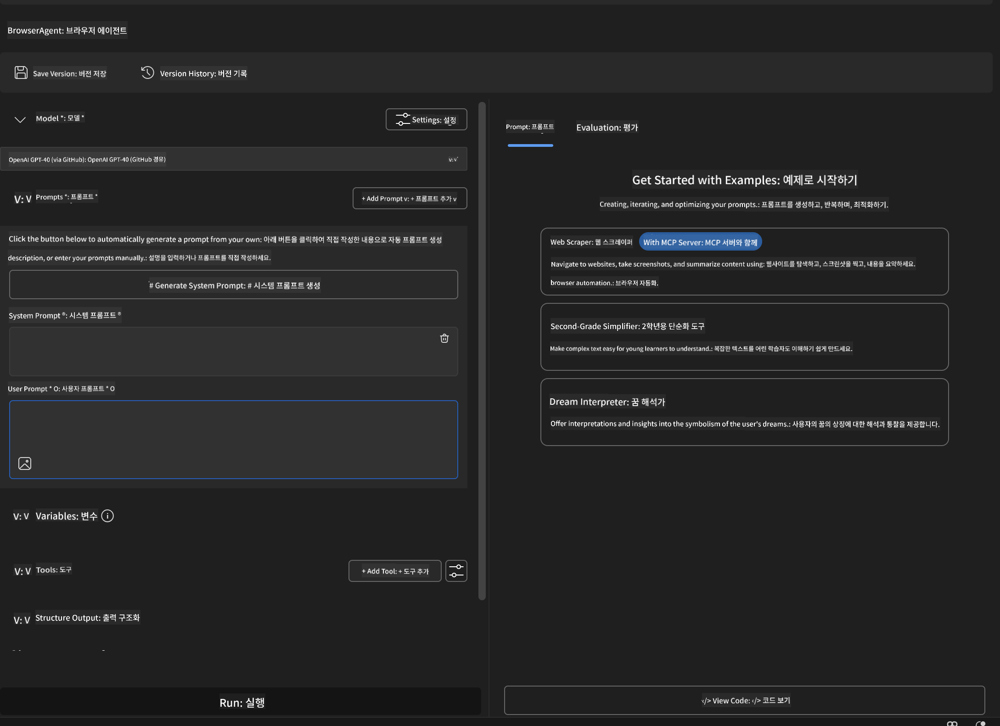


### 🔧 Phase 2: MCP Integration Workflow

#### Step 3: Add MCP Server Integration
1. **Navigate to Tools Section** in Agent Builder
2. **Click "Add Tool"** to open the integration menu
3. **Select "MCP Server"** from available options

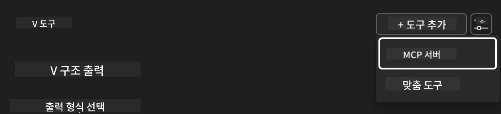

**🔍 Understanding Tool Types:**
- **Built-in Tools**: Pre-configured AI Toolkit functions
- **MCP Servers**: External service integrations
- **Custom APIs**: Your own service endpoints
- **Function Calling**: Direct model function access

#### Step 4: MCP Server Selection
1. **Choose "MCP Server"** option to proceed
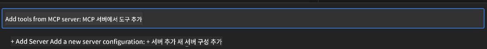

2. **Browse MCP Catalog** to explore available integrations
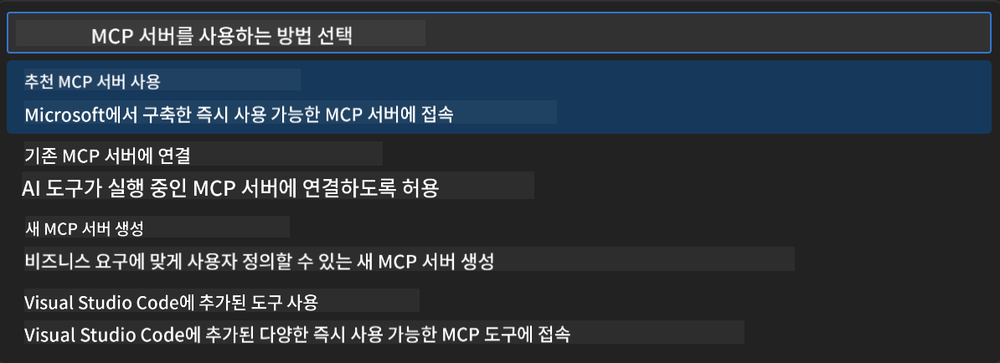


### 🎮 Phase 3: Playwright MCP Configuration

#### Step 5: Select and Configure Playwright
1. **Click "Use Featured MCP Servers"** to access Microsoft's verified servers
2. **Select "Playwright"** from the featured list
3. **Accept Default MCP ID** or customize for your environment

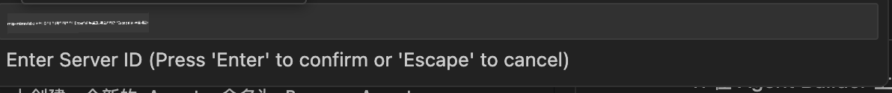

#### Step 6: Enable Playwright Capabilities
**🔑 Critical Step**: Select **ALL** available Playwright methods for maximum functionality

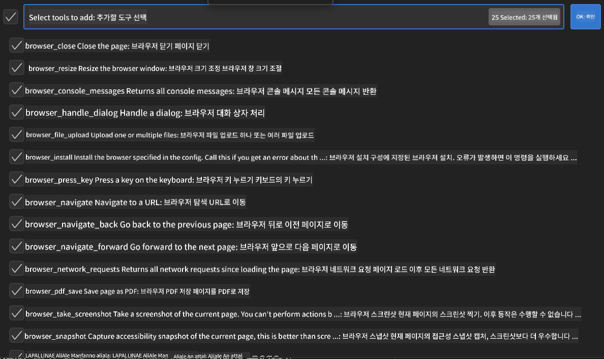

**🛠️ Essential Playwright Tools:**
- **Navigation**: `goto`, `goBack`, `goForward`, `reload`
- **Interaction**: `click`, `fill`, `press`, `hover`, `drag`
- **Extraction**: `textContent`, `innerHTML`, `getAttribute`
- **Validation**: `isVisible`, `isEnabled`, `waitForSelector`
- **Capture**: `screenshot`, `pdf`, `video`
- **Network**: `setExtraHTTPHeaders`, `route`, `waitForResponse`

#### 7단계: 통합 성공 확인
**✅ 성공 확인 방법:**
- 모든 도구가 Agent Builder 인터페이스에 표시됨
- 통합 패널에 오류 메시지 없음
- Playwright 서버 상태가 "Connected"로 표시됨

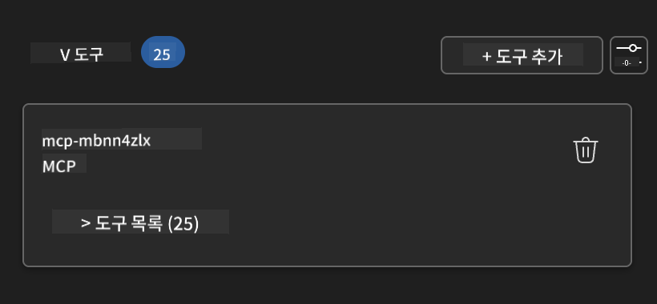

**🔧 자주 발생하는 문제 해결법:**
- **연결 실패**: 인터넷 연결 및 방화벽 설정 확인
- **도구 누락**: 설정 시 모든 기능이 선택되었는지 확인
- **권한 오류**: VS Code에 필요한 시스템 권한이 있는지 점검

### 🎯 4단계: 고급 프롬프트 설계

#### 8단계: 지능형 시스템 프롬프트 디자인
Playwright의 모든 기능을 활용하는 정교한 프롬프트를 만듭니다:

```markdown
# Web Automation Expert System Prompt

## Core Identity
You are an advanced web automation specialist with deep expertise in browser automation, web scraping, and user experience analysis. You have access to Playwright tools for comprehensive browser control.

## Capabilities & Approach
### Navigation Strategy
- Always start with screenshots to understand page layout
- Use semantic selectors (text content, labels) when possible
- Implement wait strategies for dynamic content
- Handle single-page applications (SPAs) effectively

### Error Handling
- Retry failed operations with exponential backoff
- Provide clear error descriptions and solutions
- Suggest alternative approaches when primary methods fail
- Always capture diagnostic screenshots on errors

### Data Extraction
- Extract structured data in JSON format when possible
- Provide confidence scores for extracted information
- Validate data completeness and accuracy
- Handle pagination and infinite scroll scenarios

### Reporting
- Include step-by-step execution logs
- Provide before/after screenshots for verification
- Suggest optimizations and alternative approaches
- Document any limitations or edge cases encountered

## Ethical Guidelines
- Respect robots.txt and rate limiting
- Avoid overloading target servers
- Only extract publicly available information
- Follow website terms of service
```

#### 9단계: 동적 사용자 프롬프트 작성
다양한 기능을 보여주는 프롬프트를 설계합니다:

**🌐 웹 분석 예시:**
```markdown
Navigate to github.com/kinfey and provide a comprehensive analysis including:
1. Repository structure and organization
2. Recent activity and contribution patterns  
3. Documentation quality assessment
4. Technology stack identification
5. Community engagement metrics
6. Notable projects and their purposes

Include screenshots at key steps and provide actionable insights.
```

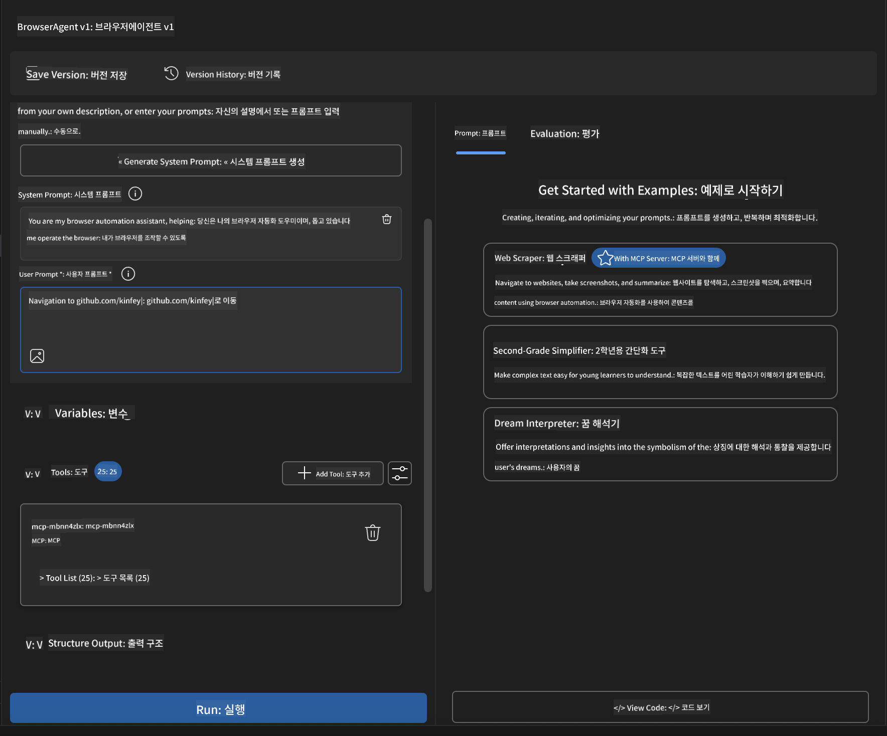

### 🚀 5단계: 실행 및 테스트

#### 10단계: 첫 자동화 실행
1. **"Run" 클릭**하여 자동화 시퀀스 시작
2. **실시간 실행 모니터링**:
   - Chrome 브라우저 자동 실행
   - 에이전트가 목표 웹사이트 탐색
   - 주요 단계마다 스크린샷 캡처
   - 분석 결과 실시간 스트리밍

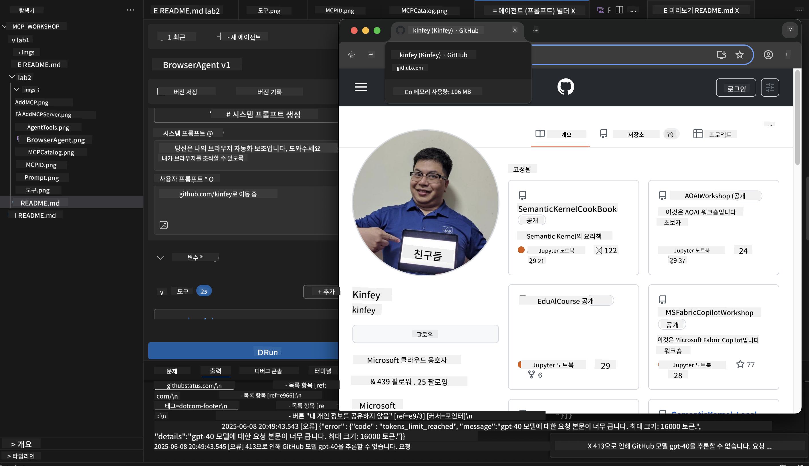

#### 11단계: 결과 및 인사이트 분석
Agent Builder 인터페이스에서 종합 분석 결과 확인:

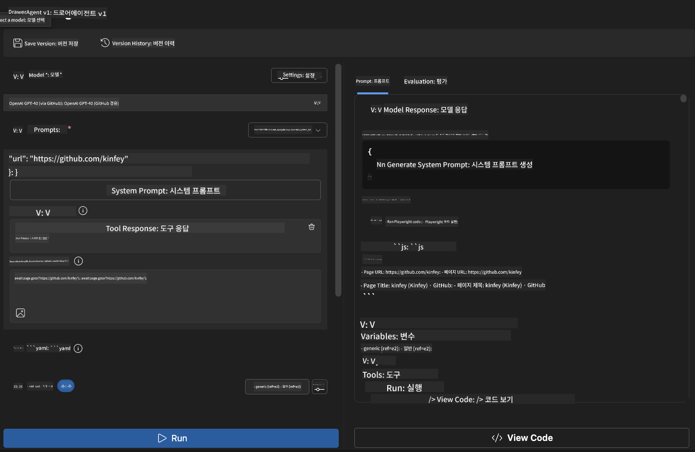

### 🌟 6단계: 고급 기능 및 배포

#### 12단계: 내보내기 및 프로덕션 배포
Agent Builder는 다양한 배포 옵션을 지원합니다:

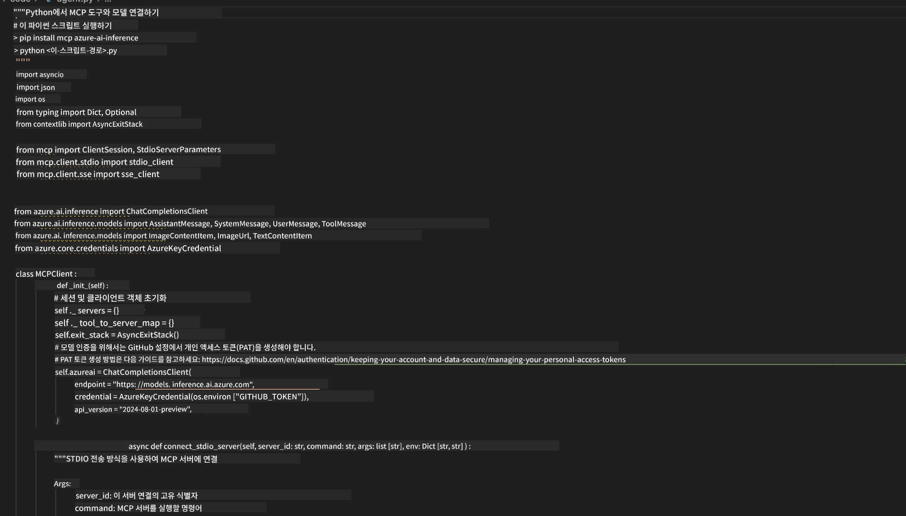

## 🎓 모듈 2 요약 및 다음 단계

### 🏆 달성한 성과: MCP 통합 마스터

**✅ 숙달한 기술:**
- [ ] MCP 아키텍처와 장점 이해
- [ ] Microsoft MCP 서버 생태계 탐색
- [ ] Playwright MCP와 AI Toolkit 통합
- [ ] 정교한 브라우저 자동화 에이전트 구축
- [ ] 웹 자동화를 위한 고급 프롬프트 엔지니어링

### 📚 추가 자료

- **🔗 MCP 명세**: [공식 프로토콜 문서](https://modelcontextprotocol.io/)
- **🛠️ Playwright API**: [전체 메서드 참조](https://playwright.dev/docs/api/class-playwright)
- **🏢 Microsoft MCP 서버**: [엔터프라이즈 통합 가이드](https://github.com/microsoft/mcp-servers)
- **🌍 커뮤니티 예제**: [MCP 서버 갤러리](https://github.com/modelcontextprotocol/servers)

**🎉 축하합니다!** 이제 MCP 통합을 완벽히 익혀 외부 도구 기능이 탑재된 프로덕션급 AI 에이전트를 구축할 수 있습니다!

### 🔜 다음 모듈로 진행하기

MCP 기술을 한 단계 더 높이고 싶다면, **[모듈 3: AI Toolkit과 함께하는 고급 MCP 개발](../lab3/README.md)** 으로 넘어가 다음 내용을 배우세요:
- 맞춤형 MCP 서버 직접 만들기
- 최신 MCP Python SDK 구성 및 활용
- MCP Inspector로 디버깅 설정하기
- 고급 MCP 서버 개발 워크플로우 마스터하기
- Weather MCP Server를 처음부터 구축하기

**면책 조항**:  
이 문서는 AI 번역 서비스 [Co-op Translator](https://github.com/Azure/co-op-translator)를 사용하여 번역되었습니다. 정확성을 위해 노력하고 있으나, 자동 번역에는 오류나 부정확한 내용이 포함될 수 있음을 유의해 주시기 바랍니다. 원문 문서는 해당 언어의 원본이 권위 있는 자료로 간주되어야 합니다. 중요한 정보의 경우, 전문적인 인간 번역을 권장합니다. 본 번역 사용으로 인해 발생하는 오해나 잘못된 해석에 대해서는 당사가 책임지지 않습니다.