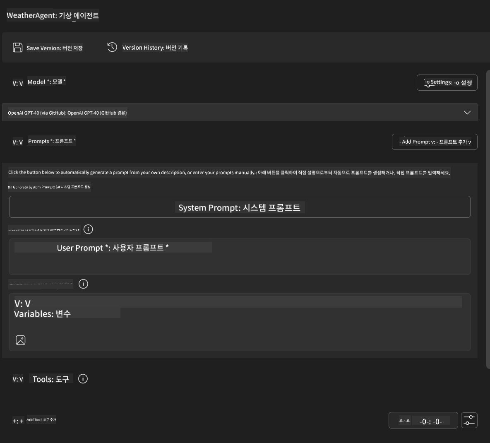
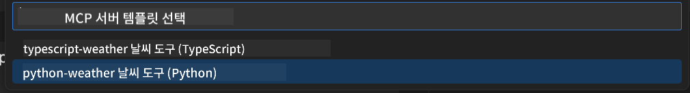
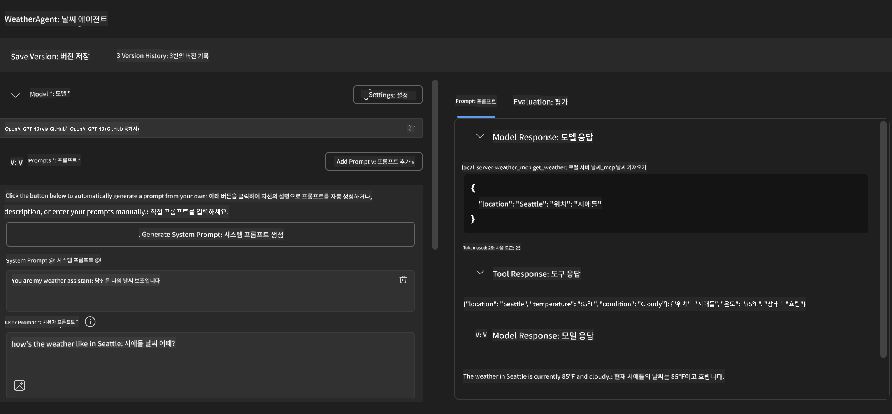
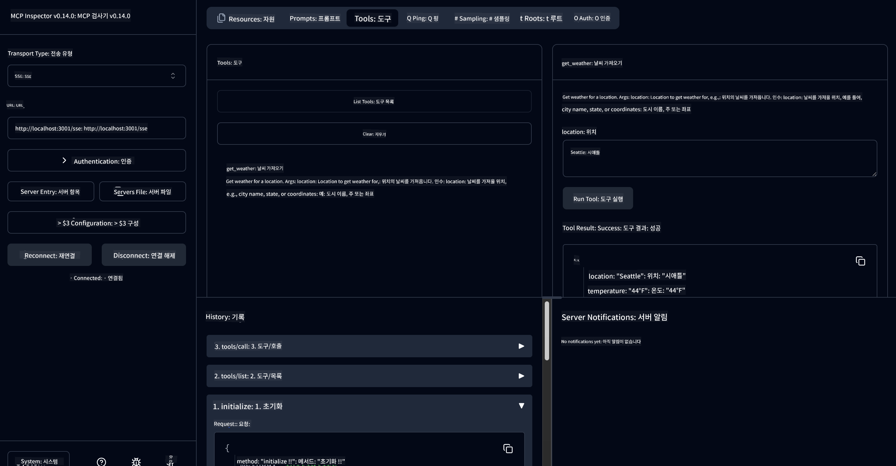

<!--
CO_OP_TRANSLATOR_METADATA:
{
  "original_hash": "dd8da3f75addcef453fe11f02a270217",
  "translation_date": "2025-06-10T06:06:38+00:00",
  "source_file": "10-StreamliningAIWorkflowsBuildingAnMCPServerWithAIToolkit/lab3/README.md",
  "language_code": "ko"
}
-->
# 🔧 Module 3: AI Toolkit를 활용한 고급 MCP 개발


## 🎯 학습 목표

이 실습을 마치면 다음을 할 수 있습니다:

- ✅ AI Toolkit을 사용해 맞춤형 MCP 서버 생성
- ✅ 최신 MCP Python SDK(v1.9.3) 구성 및 활용
- ✅ MCP Inspector 설정 및 디버깅에 활용
- ✅ Agent Builder와 Inspector 환경에서 MCP 서버 디버깅
- ✅ 고급 MCP 서버 개발 워크플로우 이해

## 📋 사전 준비 사항

- Lab 2 (MCP 기초) 완료
- AI Toolkit 확장 프로그램이 설치된 VS Code
- Python 3.10 이상 환경
- Inspector 설정을 위한 Node.js 및 npm

## 🏗️ 이번 실습에서 만들 것

이번 실습에서는 **Weather MCP Server**를 만들어 다음을 다룹니다:
- 맞춤형 MCP 서버 구현
- AI Toolkit Agent Builder와의 통합
- 전문적인 디버깅 워크플로우
- 최신 MCP SDK 사용 방식

---

## 🔧 핵심 구성 요소 개요

### 🐍 MCP Python SDK
Model Context Protocol Python SDK는 맞춤형 MCP 서버 개발의 기반을 제공합니다. 버전 1.9.3을 사용하며 향상된 디버깅 기능을 포함합니다.

### 🔍 MCP Inspector
강력한 디버깅 도구로서 다음 기능을 제공합니다:
- 실시간 서버 모니터링
- 도구 실행 시각화
- 네트워크 요청/응답 검사
- 상호작용 테스트 환경

---

## 📖 단계별 구현

### 1단계: Agent Builder에서 WeatherAgent 생성

1. VS Code에서 AI Toolkit 확장 프로그램을 통해 **Agent Builder 실행**
2. 다음 설정으로 **새 에이전트 생성**:
   - 에이전트 이름: `WeatherAgent`



### 2단계: MCP 서버 프로젝트 초기화

1. Agent Builder에서 **Tools → Add Tool**로 이동
2. **"MCP Server"** 선택
3. **"Create A new MCP Server"** 선택
4. `python-weather` 템플릿 선택
5. 서버 이름 지정: `weather_mcp`



### 3단계: 프로젝트 열고 살펴보기

1. VS Code에서 생성된 프로젝트 열기
2. 프로젝트 구조 검토:
   ```
   weather_mcp/
   ├── src/
   │   ├── __init__.py
   │   └── server.py
   ├── inspector/
   │   ├── package.json
   │   └── package-lock.json
   ├── .vscode/
   │   ├── launch.json
   │   └── tasks.json
   ├── pyproject.toml
   └── README.md
   ```

### 4단계: 최신 MCP SDK로 업그레이드

> **🔍 왜 업그레이드해야 하나요?** 최신 MCP SDK(v1.9.3)와 Inspector 서비스(0.14.0)를 사용해 더 나은 기능과 디버깅 환경을 얻기 위함입니다.

#### 4a. Python 의존성 업데이트

**`pyproject.toml`:** update [./code/weather_mcp/pyproject.toml](../../../../10-StreamliningAIWorkflowsBuildingAnMCPServerWithAIToolkit/lab3/code/weather_mcp/pyproject.toml)


#### 4b. Update Inspector Configuration

**Edit `inspector/package.json`:** update [./code/weather_mcp/inspector/package.json](../../../../10-StreamliningAIWorkflowsBuildingAnMCPServerWithAIToolkit/lab3/code/weather_mcp/inspector/package.json)

#### 4c. Update Inspector Dependencies

**Edit `inspector/package-lock.json`:** update [./code/weather_mcp/inspector/package-lock.json](../../../../10-StreamliningAIWorkflowsBuildingAnMCPServerWithAIToolkit/lab3/code/weather_mcp/inspector/package-lock.json)

> **📝 Note:** This file contains extensive dependency definitions. Below is the essential structure - the full content ensures proper dependency resolution.


> **⚡ Full Package Lock:** The complete package-lock.json contains ~3000 lines of dependency definitions. The above shows the key structure - use the provided file for complete dependency resolution.

### Step 5: Configure VS Code Debugging

*Note: Please copy the file in the specified path to replace the corresponding local file*

#### 5a. Update Launch Configuration

**Edit `.vscode/launch.json` 수정:**

```json
{
  "version": "0.2.0",
  "configurations": [
    {
      "name": "Attach to Local MCP",
      "type": "debugpy",
      "request": "attach",
      "connect": {
        "host": "localhost",
        "port": 5678
      },
      "presentation": {
        "hidden": true
      },
      "internalConsoleOptions": "neverOpen",
      "postDebugTask": "Terminate All Tasks"
    },
    {
      "name": "Launch Inspector (Edge)",
      "type": "msedge",
      "request": "launch",
      "url": "http://localhost:6274?timeout=60000&serverUrl=http://localhost:3001/sse#tools",
      "cascadeTerminateToConfigurations": [
        "Attach to Local MCP"
      ],
      "presentation": {
        "hidden": true
      },
      "internalConsoleOptions": "neverOpen"
    },
    {
      "name": "Launch Inspector (Chrome)",
      "type": "chrome",
      "request": "launch",
      "url": "http://localhost:6274?timeout=60000&serverUrl=http://localhost:3001/sse#tools",
      "cascadeTerminateToConfigurations": [
        "Attach to Local MCP"
      ],
      "presentation": {
        "hidden": true
      },
      "internalConsoleOptions": "neverOpen"
    }
  ],
  "compounds": [
    {
      "name": "Debug in Agent Builder",
      "configurations": [
        "Attach to Local MCP"
      ],
      "preLaunchTask": "Open Agent Builder",
    },
    {
      "name": "Debug in Inspector (Edge)",
      "configurations": [
        "Launch Inspector (Edge)",
        "Attach to Local MCP"
      ],
      "preLaunchTask": "Start MCP Inspector",
      "stopAll": true
    },
    {
      "name": "Debug in Inspector (Chrome)",
      "configurations": [
        "Launch Inspector (Chrome)",
        "Attach to Local MCP"
      ],
      "preLaunchTask": "Start MCP Inspector",
      "stopAll": true
    }
  ]
}
```

**`.vscode/tasks.json` 수정:**

```
{
  "version": "2.0.0",
  "tasks": [
    {
      "label": "Start MCP Server",
      "type": "shell",
      "command": "python -m debugpy --listen 127.0.0.1:5678 src/__init__.py sse",
      "isBackground": true,
      "options": {
        "cwd": "${workspaceFolder}",
        "env": {
          "PORT": "3001"
        }
      },
      "problemMatcher": {
        "pattern": [
          {
            "regexp": "^.*$",
            "file": 0,
            "location": 1,
            "message": 2
          }
        ],
        "background": {
          "activeOnStart": true,
          "beginsPattern": ".*",
          "endsPattern": "Application startup complete|running"
        }
      }
    },
    {
      "label": "Start MCP Inspector",
      "type": "shell",
      "command": "npm run dev:inspector",
      "isBackground": true,
      "options": {
        "cwd": "${workspaceFolder}/inspector",
        "env": {
          "CLIENT_PORT": "6274",
          "SERVER_PORT": "6277",
        }
      },
      "problemMatcher": {
        "pattern": [
          {
            "regexp": "^.*$",
            "file": 0,
            "location": 1,
            "message": 2
          }
        ],
        "background": {
          "activeOnStart": true,
          "beginsPattern": "Starting MCP inspector",
          "endsPattern": "Proxy server listening on port"
        }
      },
      "dependsOn": [
        "Start MCP Server"
      ]
    },
    {
      "label": "Open Agent Builder",
      "type": "shell",
      "command": "echo ${input:openAgentBuilder}",
      "presentation": {
        "reveal": "never"
      },
      "dependsOn": [
        "Start MCP Server"
      ],
    },
    {
      "label": "Terminate All Tasks",
      "command": "echo ${input:terminate}",
      "type": "shell",
      "problemMatcher": []
    }
  ],
  "inputs": [
    {
      "id": "openAgentBuilder",
      "type": "command",
      "command": "ai-mlstudio.agentBuilder",
      "args": {
        "initialMCPs": [ "local-server-weather_mcp" ],
        "triggeredFrom": "vsc-tasks"
      }
    },
    {
      "id": "terminate",
      "type": "command",
      "command": "workbench.action.tasks.terminate",
      "args": "terminateAll"
    }
  ]
}
```


---

## 🚀 MCP 서버 실행 및 테스트

### 6단계: 의존성 설치

설정 변경 후 다음 명령어 실행:

**Python 의존성 설치:**
```bash
uv sync
```

**Inspector 의존성 설치:**
```bash
cd inspector
npm install
```

### 7단계: Agent Builder에서 디버깅

1. **F5 키 누르거나 "Debug in Agent Builder" 구성 실행**
2. 디버그 패널에서 **compound 구성 선택**
3. 서버가 시작되고 Agent Builder가 열릴 때까지 대기
4. 자연어 쿼리로 날씨 MCP 서버 테스트

다음과 같은 입력 프롬프트 사용

SYSTEM_PROMPT

```
You are my weather assistant
```

USER_PROMPT

```
How's the weather like in Seattle
```



### 8단계: MCP Inspector에서 디버깅

1. **"Debug in Inspector"** 구성 사용 (Edge 또는 Chrome)
2. `http://localhost:6274`에서 Inspector 인터페이스 열기
3. 상호작용 테스트 환경 탐색:
   - 사용 가능한 도구 확인
   - 도구 실행 테스트
   - 네트워크 요청 모니터링
   - 서버 응답 디버깅



---

## 🎯 주요 학습 성과

이 실습을 완료하여 다음을 달성했습니다:

- [x] AI Toolkit 템플릿을 활용한 맞춤형 MCP 서버 생성
- [x] 최신 MCP SDK(v1.9.3)로 업그레이드하여 기능 향상
- [x] Agent Builder와 Inspector 모두에서 전문적인 디버깅 워크플로우 구성
- [x] MCP Inspector를 설정하여 상호작용 서버 테스트 가능
- [x] MCP 개발을 위한 VS Code 디버깅 구성 마스터

## 🔧 탐색한 고급 기능

| 기능 | 설명 | 활용 사례 |
|---------|-------------|----------|
| **MCP Python SDK v1.9.3** | 최신 프로토콜 구현 | 현대적인 서버 개발 |
| **MCP Inspector 0.14.0** | 상호작용 디버깅 도구 | 실시간 서버 테스트 |
| **VS Code 디버깅** | 통합 개발 환경 | 전문적인 디버깅 워크플로우 |
| **Agent Builder 통합** | AI Toolkit과 직접 연결 | 엔드투엔드 에이전트 테스트 |

## 📚 추가 자료

- [MCP Python SDK Documentation](https://modelcontextprotocol.io/docs/sdk/python)
- [AI Toolkit Extension Guide](https://code.visualstudio.com/docs/ai/ai-toolkit)
- [VS Code Debugging Documentation](https://code.visualstudio.com/docs/editor/debugging)
- [Model Context Protocol Specification](https://modelcontextprotocol.io/docs/concepts/architecture)

---

**🎉 축하합니다!** Lab 3를 성공적으로 완료하여 전문적인 개발 워크플로우로 맞춤형 MCP 서버를 생성, 디버깅, 배포할 수 있게 되었습니다.

### 🔜 다음 모듈로 이어가기

실제 개발 워크플로우에 MCP 기술을 적용할 준비가 되셨나요? **[Module 4: Practical MCP Development - Custom GitHub Clone Server](../lab4/README.md)** 에서:
- GitHub 저장소 작업을 자동화하는 프로덕션급 MCP 서버 구축
- MCP를 통한 GitHub 저장소 복제 기능 구현
- VS Code 및 GitHub Copilot Agent Mode와 맞춤형 MCP 서버 통합
- 프로덕션 환경에서 맞춤형 MCP 서버 테스트 및 배포
- 개발자를 위한 실용적인 워크플로우 자동화 학습

**면책 조항**:  
이 문서는 AI 번역 서비스 [Co-op Translator](https://github.com/Azure/co-op-translator)를 사용하여 번역되었습니다. 정확성을 위해 노력하고 있으나, 자동 번역에는 오류나 부정확한 내용이 포함될 수 있음을 유의해 주시기 바랍니다. 원본 문서의 원어가 권위 있는 출처로 간주되어야 합니다. 중요한 정보의 경우 전문적인 인간 번역을 권장합니다. 본 번역 사용으로 인한 오해나 잘못된 해석에 대해 당사는 책임을 지지 않습니다.