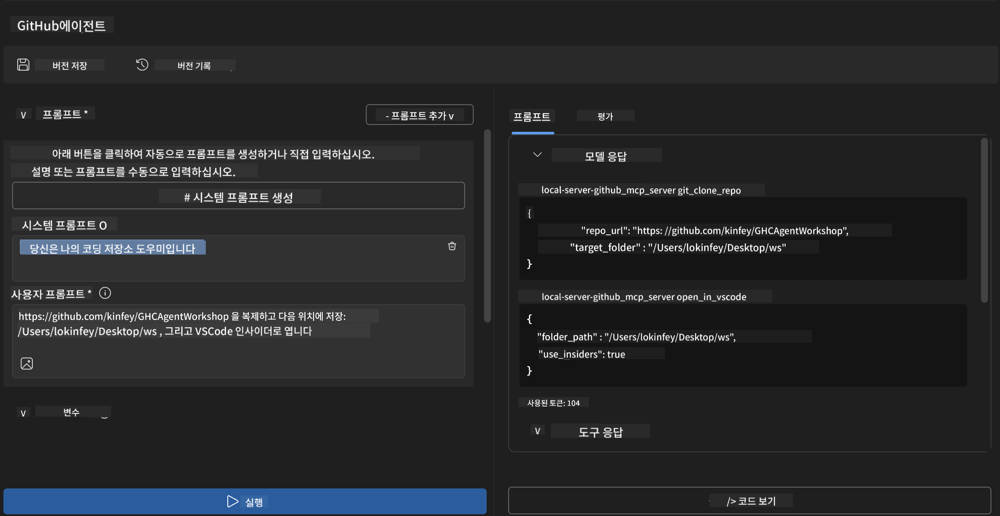
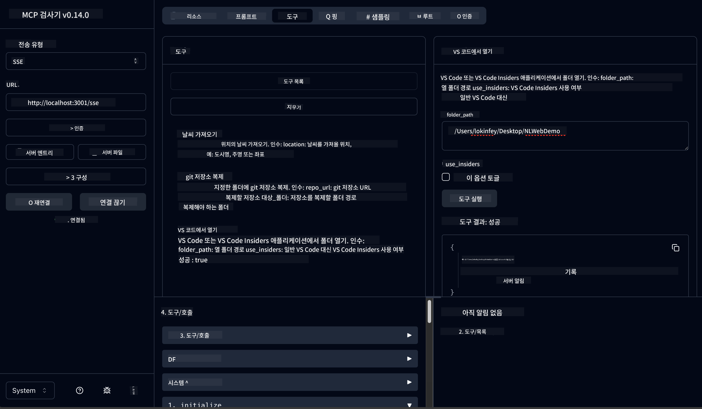

<!--
CO_OP_TRANSLATOR_METADATA:
{
  "original_hash": "f83bc722dc758efffd68667d6a1db470",
  "translation_date": "2025-07-14T08:38:36+00:00",
  "source_file": "10-StreamliningAIWorkflowsBuildingAnMCPServerWithAIToolkit/lab4/README.md",
  "language_code": "ko"
}
-->
# 🐙 모듈 4: 실전 MCP 개발 - 맞춤형 GitHub 클론 서버


> **⚡ 빠른 시작:** 단 30분 만에 GitHub 저장소 클론과 VS Code 통합을 자동화하는 실전용 MCP 서버를 구축해보세요!

## 🎯 학습 목표

이 실습을 마치면 다음을 할 수 있습니다:

- ✅ 실제 개발 워크플로우에 맞는 맞춤형 MCP 서버 생성
- ✅ MCP를 통해 GitHub 저장소 클론 기능 구현
- ✅ 맞춤형 MCP 서버를 VS Code 및 Agent Builder와 통합
- ✅ GitHub Copilot Agent Mode를 맞춤형 MCP 도구와 함께 사용
- ✅ 맞춤형 MCP 서버를 테스트하고 프로덕션 환경에 배포

## 📋 사전 준비 사항

- 실습 1~3 완료 (MCP 기본 및 고급 개발)
- GitHub Copilot 구독 ([무료 가입 가능](https://github.com/github-copilot/signup))
- AI Toolkit 및 GitHub Copilot 확장 기능이 설치된 VS Code
- Git CLI 설치 및 설정 완료

## 🏗️ 프로젝트 개요

### **실제 개발 과제**
개발자들은 GitHub에서 저장소를 클론하고 VS Code 또는 VS Code Insiders에서 여는 작업을 자주 합니다. 이 수동 작업은 다음과 같습니다:
1. 터미널/명령 프롬프트 열기
2. 원하는 디렉터리로 이동
3. `git clone` 명령 실행
4. 클론한 디렉터리에서 VS Code 열기

**우리의 MCP 솔루션은 이 과정을 하나의 스마트 명령으로 간소화합니다!**

### **만들게 될 것**
**GitHub Clone MCP 서버**(`git_mcp_server`)는 다음 기능을 제공합니다:

| 기능 | 설명 | 장점 |
|---------|-------------|---------|
| 🔄 **스마트 저장소 클론** | GitHub 저장소를 검증하며 클론 | 자동 오류 검사 |
| 📁 **지능형 디렉터리 관리** | 디렉터리 존재 여부 확인 및 안전한 생성 | 덮어쓰기 방지 |
| 🚀 **크로스 플랫폼 VS Code 통합** | VS Code/Insiders에서 프로젝트 열기 | 원활한 워크플로우 전환 |
| 🛡️ **견고한 오류 처리** | 네트워크, 권한, 경로 문제 처리 | 프로덕션 수준 안정성 |

---

## 📖 단계별 구현

### 1단계: Agent Builder에서 GitHub 에이전트 생성

1. AI Toolkit 확장 기능을 통해 **Agent Builder 실행**
2. 다음 설정으로 **새 에이전트 생성:**
   ```
   Agent Name: GitHubAgent
   ```

3. **맞춤형 MCP 서버 초기화:**
   - **도구** → **도구 추가** → **MCP 서버**로 이동
   - **"새 MCP 서버 생성"** 선택
   - 최대 유연성을 위해 **Python 템플릿** 선택
   - **서버 이름:** `git_mcp_server`

### 2단계: GitHub Copilot Agent Mode 구성

1. VS Code에서 **GitHub Copilot 열기** (Ctrl/Cmd + Shift + P → "GitHub Copilot: Open")
2. Copilot 인터페이스에서 **Agent 모델 선택**
3. 향상된 추론 능력을 위해 **Claude 3.7 모델 선택**
4. 도구 접근을 위해 **MCP 통합 활성화**

> **💡 전문가 팁:** Claude 3.7은 개발 워크플로우와 오류 처리 패턴을 더 잘 이해합니다.

### 3단계: 핵심 MCP 서버 기능 구현

**GitHub Copilot Agent Mode에서 다음 상세 프롬프트 사용:**

```
Create two MCP tools with the following comprehensive requirements:

🔧 TOOL A: clone_repository
Requirements:
- Clone any GitHub repository to a specified local folder
- Return the absolute path of the successfully cloned project
- Implement comprehensive validation:
  ✓ Check if target directory already exists (return error if exists)
  ✓ Validate GitHub URL format (https://github.com/user/repo)
  ✓ Verify git command availability (prompt installation if missing)
  ✓ Handle network connectivity issues
  ✓ Provide clear error messages for all failure scenarios

🚀 TOOL B: open_in_vscode
Requirements:
- Open specified folder in VS Code or VS Code Insiders
- Cross-platform compatibility (Windows/Linux/macOS)
- Use direct application launch (not terminal commands)
- Auto-detect available VS Code installations
- Handle cases where VS Code is not installed
- Provide user-friendly error messages

Additional Requirements:
- Follow MCP 1.9.3 best practices
- Include proper type hints and documentation
- Implement logging for debugging purposes
- Add input validation for all parameters
- Include comprehensive error handling
```

### 4단계: MCP 서버 테스트

#### 4a. Agent Builder에서 테스트

1. Agent Builder의 디버그 구성 실행
2. 다음 시스템 프롬프트로 에이전트 구성:

```
SYSTEM_PROMPT:
You are my intelligent coding repository assistant. You help developers efficiently clone GitHub repositories and set up their development environment. Always provide clear feedback about operations and handle errors gracefully.
```

3. 실제 사용자 시나리오로 테스트:

```
USER_PROMPT EXAMPLES:

Scenario : Basic Clone and Open
"Clone {Your GitHub Repo link such as https://github.com/kinfey/GHCAgentWorkshop
 } and save to {The global path you specify}, then open it with VS Code Insiders"
```



**예상 결과:**
- ✅ 경로 확인과 함께 성공적인 클론
- ✅ 자동으로 VS Code 실행
- ✅ 잘못된 상황에 대한 명확한 오류 메시지
- ✅ 엣지 케이스 적절 처리

#### 4b. MCP Inspector에서 테스트



---

**🎉 축하합니다!** 실제 개발 워크플로우 문제를 해결하는 실전용 프로덕션 MCP 서버를 성공적으로 만들었습니다. 맞춤형 GitHub 클론 서버는 개발자 생산성 향상과 자동화에 MCP가 얼마나 강력한지 보여줍니다.

### 🏆 달성한 성과:
- ✅ **MCP 개발자** - 맞춤형 MCP 서버 생성
- ✅ **워크플로우 자동화 전문가** - 개발 프로세스 간소화  
- ✅ **통합 전문가** - 다양한 개발 도구 연결
- ✅ **프로덕션 준비 완료** - 배포 가능한 솔루션 구축

---

## 🎓 워크숍 완료: Model Context Protocol과 함께한 여정

**워크숍 참가자 여러분,**

Model Context Protocol 워크숍 4개 모듈을 모두 완료하신 것을 축하드립니다! AI Toolkit 기본 개념부터 실제 개발 문제를 해결하는 프로덕션 MCP 서버 구축까지 긴 여정을 함께 하셨습니다.

### 🚀 학습 경로 요약:

**[모듈 1](../lab1/README.md)**: AI Toolkit 기본, 모델 테스트, 첫 AI 에이전트 생성

**[모듈 2](../lab2/README.md)**: MCP 아키텍처 이해, Playwright MCP 통합, 첫 브라우저 자동화 에이전트 구축

**[모듈 3](../lab3/README.md)**: Weather MCP 서버로 맞춤형 MCP 서버 개발 및 디버깅 도구 마스터

**[모듈 4](../lab4/README.md)**: 실전 GitHub 저장소 워크플로우 자동화 도구 완성

### 🌟 여러분이 마스터한 내용:

- ✅ **AI Toolkit 생태계**: 모델, 에이전트, 통합 패턴
- ✅ **MCP 아키텍처**: 클라이언트-서버 설계, 전송 프로토콜, 보안
- ✅ **개발자 도구**: Playground, Inspector, 프로덕션 배포
- ✅ **맞춤형 개발**: MCP 서버 구축, 테스트, 배포
- ✅ **실전 적용**: AI로 실제 워크플로우 문제 해결

### 🔮 앞으로의 단계:

1. **자신만의 MCP 서버 구축**: 고유한 워크플로우 자동화에 도전하세요
2. **MCP 커뮤니티 참여**: 작품을 공유하고 다른 사람들과 배우세요
3. **고급 통합 탐색**: MCP 서버를 기업 시스템과 연결하세요
4. **오픈 소스 기여**: MCP 도구와 문서 개선에 참여하세요

이 워크숍은 시작에 불과합니다. Model Context Protocol 생태계는 빠르게 발전하고 있으며, 여러분은 AI 기반 개발 도구의 최전선에 설 준비가 되어 있습니다.

**참여해 주시고 학습에 열정을 보여주셔서 감사합니다!**

이 워크숍이 여러분의 개발 여정에서 AI 도구를 활용하는 방식을 혁신하는 아이디어를 불러일으키길 바랍니다.

**즐거운 코딩 되세요!**

---

**면책 조항**:  
이 문서는 AI 번역 서비스 [Co-op Translator](https://github.com/Azure/co-op-translator)를 사용하여 번역되었습니다. 정확성을 위해 최선을 다하고 있으나, 자동 번역에는 오류나 부정확한 부분이 있을 수 있음을 유의해 주시기 바랍니다. 원문은 해당 언어의 원본 문서가 권위 있는 출처로 간주되어야 합니다. 중요한 정보의 경우 전문적인 인간 번역을 권장합니다. 본 번역 사용으로 인해 발생하는 오해나 잘못된 해석에 대해 당사는 책임을 지지 않습니다.