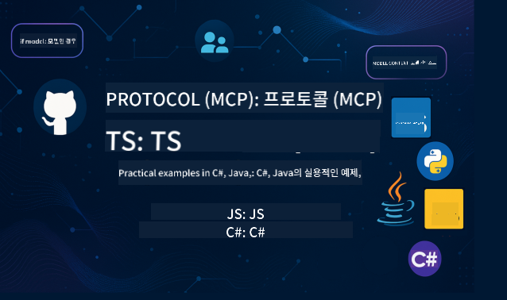

<!--
CO_OP_TRANSLATOR_METADATA:
{
  "original_hash": "5dc09d7099d2f09f3e472bc8f073622d",
  "translation_date": "2025-06-23T14:22:06+00:00",
  "source_file": "README.md",
  "language_code": "ko"
}
-->
 

이 리소스를 사용하기 위해 다음 단계를 따라주세요:
1. **저장소 포크하기**: 클릭 
2. **저장소 클론하기**:   `git clone https://github.com/microsoft/mcp-for-beginners.git`
3. [**Azure AI Foundry Discord에 참여하여 전문가 및 다른 개발자들과 만나기**](https://discord.com/invite/ByRwuEEgH4)

### 🌐 다국어 지원

#### GitHub Action을 통해 지원 (자동화 및 항상 최신 상태 유지)

# 🚀 초보자를 위한 Model Context Protocol (MCP) 커리큘럼

## **C#, Java, JavaScript, Python, TypeScript로 배우는 MCP 실습 코드 예제**

## 🧠 Model Context Protocol 커리큘럼 개요

**Model Context Protocol (MCP)**는 AI 모델과 클라이언트 애플리케이션 간 상호작용을 표준화하기 위해 설계된 최신 프레임워크입니다. 이 오픈 소스 커리큘럼은 C#, Java, JavaScript, TypeScript, Python 등 인기 있는 프로그래밍 언어를 활용한 실습 코드 예제와 실제 사례를 포함한 체계적인 학습 경로를 제공합니다.

AI 개발자, 시스템 아키텍트, 소프트웨어 엔지니어 누구든지 MCP의 기본 개념과 구현 전략을 완벽히 익힐 수 있는 종합 가이드입니다.

## 🔗 공식 MCP 자료

- 📘 [MCP Documentation](https://modelcontextprotocol.io/) – 자세한 튜토리얼과 사용자 가이드  
- 📜 [MCP Specification](https://spec.modelcontextprotocol.io/) – 프로토콜 구조 및 기술 참조  
- 🧑‍💻 [MCP GitHub Repository](https://github.com/modelcontextprotocol) – 오픈 소스 SDK, 도구, 코드 샘플  

## 🧭 MCP 커리큘럼 개요

  
<strong>00-03: 기초</strong>

- **00. MCP 소개**  
  Model Context Protocol과 AI 파이프라인에서의 중요성 개요. [자세히 보기](./00-Introduction/README.md)
- **01. 핵심 개념 설명**  
  MCP 핵심 개념 심층 탐구. [자세히 보기](./01-CoreConcepts/README.md)
- **02. MCP 보안**  
  보안 위협과 모범 사례. [자세히 보기](./02-Security/README.md)
- **03. MCP 시작하기**  
  환경 설정, 기본 서버/클라이언트, 통합. [자세히 보기](./03-GettingStarted/README.md)

  
<strong>03.x: 실습 랩</strong>

- **3.1. 첫 번째 서버** – [가이드](./03-GettingStarted/01-first-server/README.md)
- **3.2. 첫 번째 클라이언트** – [가이드](./03-GettingStarted/02-client/README.md)
- **3.3. LLM을 활용한 클라이언트** – [가이드](./03-GettingStarted/03-llm-client/README.md)
- **3.4. Visual Studio Code로 서버 사용하기** – [가이드](./03-GettingStarted/04-vscode/README.md)
- **3.5. SSE를 이용한 서버 생성** – [가이드](./03-GettingStarted/05-sse-server/README.md)
- **3.6. HTTP 스트리밍** – [가이드](./03-GettingStarted/06-http-streaming/README.md)
- **3.7. AI 툴킷 사용하기** – [가이드](./03-GettingStarted/07-aitk/README.md)
- **3.8. 서버 테스트하기** – [가이드](./03-GettingStarted/08-testing/README.md)
- **3.9. 서버 배포하기** – [가이드](./03-GettingStarted/09-deployment/README.md)

  
<strong>04-05: 실무 및 고급</strong>

- **04. 실무 구현**  
  SDK, 디버깅, 테스트, 재사용 가능한 프롬프트 템플릿. [자세히 보기](./04-PracticalImplementation/README.md)
- **05. MCP 고급 주제**  
  멀티모달 AI, 확장, 엔터프라이즈 활용. [자세히 보기](./05-AdvancedTopics/README.md)
- **5.1. Azure와 MCP 통합** – [가이드](./05-AdvancedTopics/mcp-integration/README.md)
- **5.2. 멀티모달리티** – [가이드](./05-AdvancedTopics/mcp-multi-modality/README.md)
- **5.3. MCP OAuth2 데모** – [가이드](./05-AdvancedTopics/mcp-oauth2-demo/README.md)
- **5.4. 루트 컨텍스트** – [가이드](./05-AdvancedTopics/mcp-root-contexts/README.md)
- **5.5. 라우팅** – [가이드](./05-AdvancedTopics/mcp-routing/README.md)
- **5.6. 샘플링** – [가이드](./05-AdvancedTopics/mcp-sampling/README.md)
- **5.7. 확장** – [가이드](./05-AdvancedTopics/mcp-scaling/README.md)
- **5.8. 보안** – [가이드](./05-AdvancedTopics/mcp-security/README.md)
- **5.9. Web Search MCP** – [가이드](./05-AdvancedTopics/web-search-mcp/README.md)
- **5.10. 실시간 스트리밍** – [가이드](./05-AdvancedTopics/mcp-realtimestreaming/README.md)
- **5.11. 실시간 웹 검색** – [가이드](./05-AdvancedTopics/mcp-realtimesearch/README.md)

  
<strong>06-10: 커뮤니티, 모범 사례 및 랩</strong>

- **06. 커뮤니티 기여** – [가이드](./06-CommunityContributions/README.md)
- **07. Insights from Early Adoption** – [Guide](./07-LessonsFromEarlyAdoption/README.md)
- **08. Best Practices for MCP** – [Guide](./08-BestPractices/README.md)
- **09. MCP Case Studies** – [Guide](./09-CaseStudy/README.md)
- **10. Streamlining AI Workflows: Building an MCP Server with AI Toolkit** – [Hands On Lab](./10-StreamliningAIWorkflowsBuildingAnMCPServerWithAIToolkit/README.md)

## 샘플 프로젝트

### 🧮 MCP 계산기 샘플 프로젝트:

  
<strong>언어별 코드 구현 살펴보기</strong>

  - [C# MCP 서버 예제](./03-GettingStarted/samples/csharp/README.md)
  - [Java MCP 계산기](./03-GettingStarted/samples/java/calculator/README.md)
  - [JavaScript MCP 데모](./03-GettingStarted/samples/javascript/README.md)
  - [Python MCP 서버](../../03-GettingStarted/samples/python/mcp_calculator_server.py)
  - [TypeScript MCP 예제](./03-GettingStarted/samples/typescript/README.md)

### 💡 MCP 고급 계산기 프로젝트:

  
<strong>고급 샘플 살펴보기</strong>

  - [고급 C# 샘플](./04-PracticalImplementation/samples/csharp/README.md)
  - [Java 컨테이너 앱 예제](./04-PracticalImplementation/samples/java/containerapp/README.md)
  - [JavaScript 고급 샘플](./04-PracticalImplementation/samples/javascript/README.md)
  - [Python 복잡한 구현](../../04-PracticalImplementation/samples/python/mcp_sample.py)
  - [TypeScript 컨테이너 샘플](./04-PracticalImplementation/samples/typescript/README.md)

## 🎯 MCP 학습을 위한 필수 조건

이 커리큘럼을 최대한 활용하려면 다음이 필요합니다:

- C#, Java 또는 Python에 대한 기본 지식
- 클라이언트-서버 모델과 API에 대한 이해
- (선택 사항) 머신러닝 개념에 대한 친숙함

## 📚 학습 가이드

이 저장소를 효과적으로 활용할 수 있도록 포괄적인 [학습 가이드](./study_guide.md)가 제공됩니다. 가이드에는 다음이 포함되어 있습니다:

- 다루는 모든 주제를 시각적으로 보여주는 커리큘럼 맵
- 각 저장소 섹션에 대한 상세한 설명
- 샘플 프로젝트 활용 방법 안내
- 다양한 수준별 추천 학습 경로
- 학습을 보완할 추가 자료

## 🛠️ 이 커리큘럼을 효과적으로 활용하는 방법

각 수업에는 다음이 포함되어 있습니다:

1. MCP 개념에 대한 명확한 설명  
2. 여러 언어로 된 실시간 코드 예제  
3. 실제 MCP 애플리케이션 구축을 위한 연습문제  
4. 고급 학습자를 위한 추가 자료  

## 📜 라이선스 정보

이 콘텐츠는 **MIT License** 하에 제공됩니다. 이용 약관은 [LICENSE](../../LICENSE)에서 확인하세요.

## 🤝 기여 가이드라인

이 프로젝트는 기여와 제안을 환영합니다. 대부분의 기여는 Contributor License Agreement(CLA)에 동의해야 하며, 이는 귀하가 기여물 사용 권한을 실제로 보유하고 있음을 선언하는 문서입니다. 자세한 내용은 <https://cla.opensource.microsoft.com>를 참조하세요.

풀 리퀘스트를 제출하면 CLA 봇이 자동으로 CLA 제출 필요 여부를 판단하고 PR에 상태 검사나 코멘트 등으로 표시합니다. 봇이 안내하는 절차를 따라주시면 됩니다. CLA는 모든 저장소에서 한 번만 제출하면 됩니다.

이 프로젝트는 [Microsoft Open Source Code of Conduct](https://opensource.microsoft.com/codeofconduct/)를 채택했습니다. 자세한 내용은 [Code of Conduct FAQ](https://opensource.microsoft.com/codeofconduct/faq/)를 참고하거나, 추가 질문이나 의견이 있을 경우 [opencode@microsoft.com](mailto:opencode@microsoft.com)으로 문의하세요.

## 🎒 기타 과정
저희 팀에서는 다른 과정들도 제공합니다! 다음을 확인해보세요:

- [AI Agents For Beginners](https://github.com/microsoft/ai-agents-for-beginners?WT.mc_id=academic-105485-koreyst)
- [.NET을 활용한 초보자용 생성 AI](https://github.com/microsoft/Generative-AI-for-beginners-dotnet?WT.mc_id=academic-105485-koreyst)
- [JavaScript를 활용한 초보자용 생성 AI](https://github.com/microsoft/generative-ai-with-javascript?WT.mc_id=academic-105485-koreyst)
- [초보자용 생성 AI](https://github.com/microsoft/generative-ai-for-beginners?WT.mc_id=academic-105485-koreyst)
- [초보자를 위한 머신러닝](https://aka.ms/ml-beginners?WT.mc_id=academic-105485-koreyst)
- [초보자를 위한 데이터 과학](https://aka.ms/datascience-beginners?WT.mc_id=academic-105485-koreyst)
- [초보자를 위한 AI](https://aka.ms/ai-beginners?WT.mc_id=academic-105485-koreyst)
- [초보자를 위한 사이버보안](https://github.com/microsoft/Security-101??WT.mc_id=academic-96948-sayoung)
- [초보자를 위한 웹 개발](https://aka.ms/webdev-beginners?WT.mc_id=academic-105485-koreyst)
- [초보자를 위한 IoT](https://aka.ms/iot-beginners?WT.mc_id=academic-105485-koreyst)
- [초보자를 위한 XR 개발](https://github.com/microsoft/xr-development-for-beginners?WT.mc_id=academic-105485-koreyst)
- [AI 페어 프로그래밍을 위한 GitHub Copilot 완전 정복](https://aka.ms/GitHubCopilotAI?WT.mc_id=academic-105485-koreyst)
- [C#/.NET 개발자를 위한 GitHub Copilot 완전 정복](https://github.com/microsoft/mastering-github-copilot-for-dotnet-csharp-developers?WT.mc_id=academic-105485-koreyst)
- [나만의 Copilot 모험 선택하기](https://github.com/microsoft/CopilotAdventures?WT.mc_id=academic-105485-koreyst)

## ™️ 상표 고지

이 프로젝트에는 프로젝트, 제품 또는 서비스에 대한 상표나 로고가 포함될 수 있습니다. Microsoft 상표나 로고의 허가된 사용은 [Microsoft의 상표 및 브랜드 가이드라인](https://www.microsoft.com/legal/intellectualproperty/trademarks/usage/general)을 준수해야 합니다.  
이 프로젝트의 수정된 버전에서 Microsoft 상표나 로고를 사용하는 경우 혼동을 일으키거나 Microsoft의 후원을 암시해서는 안 됩니다.  
제3자 상표나 로고의 사용은 해당 제3자의 정책을 따라야 합니다.

**면책 조항**:  
이 문서는 AI 번역 서비스 [Co-op Translator](https://github.com/Azure/co-op-translator)를 사용하여 번역되었습니다. 정확성을 위해 최선을 다하고 있으나, 자동 번역은 오류나 부정확한 부분이 있을 수 있음을 유의해 주시기 바랍니다. 원문 문서는 해당 언어의 공식 출처로 간주되어야 합니다. 중요한 정보의 경우, 전문적인 인간 번역을 권장합니다. 본 번역 사용으로 인한 오해나 잘못된 해석에 대해 당사는 책임을 지지 않습니다.