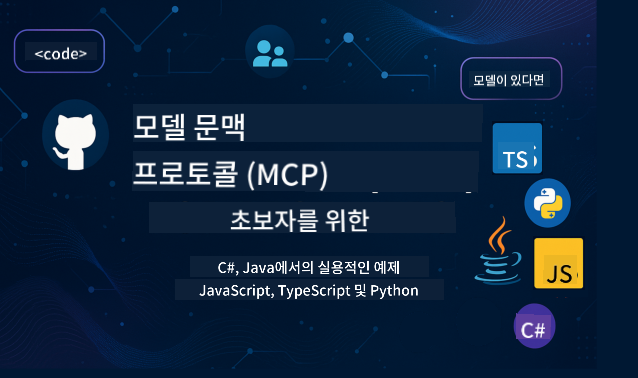

<!--
CO_OP_TRANSLATOR_METADATA:
{
  "original_hash": "2a21391378c12ecfef50f866329dfde0",
  "translation_date": "2025-05-17T05:07:55+00:00",
  "source_file": "README.md",
  "language_code": "ko"
}
-->

   

  

이 리소스를 사용하기 시작하려면 다음 단계를 따르세요:
1. **저장소 포크하기**:  클릭
2. **저장소 클론하기**: `git clone https://github.com/microsoft/mcp-for-beginners.git`
3. [**Microsoft Azure AI Foundry Discord에 가입하여 전문가와 개발자들과 만나보세요**](https://discord.com/invite/ByRwuEEgH4)

### 🌐 다국어 지원

#### GitHub Action을 통해 지원됨 (자동화 및 항상 최신 상태 유지)
[프랑스어](../fr/README.md) | [스페인어](../es/README.md) | [독일어](../de/README.md) | [러시아어](../ru/README.md) | [아랍어](../ar/README.md) | [페르시아어 (파르시어)](../fa/README.md) | [우르두어](../ur/README.md) | [중국어 (간체)](../zh/README.md) | [중국어 (전통체, 마카오)](../mo/README.md) | [중국어 (전통체, 홍콩)](../hk/README.md) | [중국어 (전통체, 대만)](../tw/README.md) | [일본어](../ja/README.md) | [한국어](./README.md) | [힌디어](../hi/README.md) | [벵골어](../bn/README.md) | [마라티어](../mr/README.md) | [네팔어](../ne/README.md) | [펀자브어 (구르무키)](../pa/README.md) | [포르투갈어 (포르투갈)](../pt/README.md) | [포르투갈어 (브라질)](../br/README.md) | [이탈리아어](../it/README.md) | [폴란드어](../pl/README.md) | [터키어](../tr/README.md) | [그리스어](../el/README.md) | [태국어](../th/README.md) | [스웨덴어](../sv/README.md) | [덴마크어](../da/README.md) | [노르웨이어](../no/README.md) | [핀란드어](../fi/README.md) | [네덜란드어](../nl/README.md) | [히브리어](../he/README.md) | [베트남어](../vi/README.md) | [인도네시아어](../id/README.md) | [말레이어](../ms/README.md) | [타갈로그어 (필리핀어)](../tl/README.md) | [스와힐리어](../sw/README.md) | [헝가리어](../hu/README.md) | [체코어](../cs/README.md) | [슬로바키아어](../sk/README.md) | [루마니아어](../ro/README.md) | [불가리아어](../bg/README.md) | [세르비아어 (키릴문자)](../sr/README.md) | [크로아티아어](../hr/README.md) | [슬로베니아어](../sl/README.md)
# 🚀 초보자를 위한 모델 컨텍스트 프로토콜 (MCP) 커리큘럼 궁극의 가이드

## **C#, Java, JavaScript, Python, TypeScript로 MCP를 실습 코드 예제로 배우기**

## 🧠 모델 컨텍스트 프로토콜 커리큘럼 개요

**모델 컨텍스트 프로토콜 (MCP)**은 AI 모델과 클라이언트 애플리케이션 간의 상호작용을 표준화하기 위해 설계된 최첨단 프레임워크입니다. 이 오픈 소스 커리큘럼은 C#, Java, JavaScript, TypeScript, Python 등 인기 있는 프로그래밍 언어를 통해 실용적인 코딩 예제와 실제 사용 사례를 포함한 구조화된 학습 경로를 제공합니다.

AI 개발자, 시스템 아키텍트 또는 소프트웨어 엔지니어라면, 이 가이드는 MCP 기본 사항과 구현 전략을 마스터하기 위한 종합적인 리소스입니다.

## 🔗 공식 MCP 리소스

- 📘 [MCP 문서](https://modelcontextprotocol.io/) – 자세한 튜토리얼과 사용자 가이드  
- 📜 [MCP 명세서](https://spec.modelcontextprotocol.io/) – 프로토콜 아키텍처 및 기술 참조  
- 🧑‍💻 [MCP GitHub 저장소](https://github.com/modelcontextprotocol) – 오픈 소스 SDK, 도구 및 코드 샘플  

## 🧭 MCP 커리큘럼 전체 구조

### 📌 [MCP 소개](./00-Introduction/README.md)

- 모델 컨텍스트 프로토콜이란 무엇인가?
- AI 파이프라인에서 표준화의 중요성
- MCP의 실용적인 사용 사례와 이점

### 🧩 [핵심 개념 설명](./01-CoreConcepts/README.md)

- MCP에서 클라이언트-서버 아키텍처 이해하기
- 주요 프로토콜 구성 요소: 요청, 응답 및 스키마
- MCP 메시징 및 데이터 교환 패턴

### 🔐 [MCP의 보안](./02-Security/readme.md)

- MCP 기반 시스템 내의 보안 위협 식별
- 구현을 안전하게 하는 기술 및 모범 사례

### 🚀 [MCP 시작하기](./03-GettingStarted/README.md)

- 환경 설정 및 구성
- 기본 MCP 서버 및 클라이언트 생성
- 기존 애플리케이션과 MCP 통합

#### 🧮 MCP 계산기 샘플 프로젝트:

  
<strong>언어별 코드 구현 탐색</strong>

  - [C# MCP 서버 예제](./03-GettingStarted/samples/csharp/README.md)
  - [Java MCP 계산기](./03-GettingStarted/samples/java/calculator/README.md)
  - [JavaScript MCP 데모](./03-GettingStarted/samples/javascript/README.md)
  - [Python MCP 서버](../../03-GettingStarted/samples/python/mcp_calculator_server.py)
  - [TypeScript MCP 예제](./03-GettingStarted/samples/typescript/README.md)

### 🛠️ [실용적인 구현](./04-PracticalImplementation/README.md)

- 다양한 언어에서 SDK 사용하기
- 디버깅, 테스트 및 검증
- 재사용 가능한 프롬프트 템플릿 및 워크플로우 제작

#### 💡 MCP 고급 계산기 프로젝트:

  
<strong>고급 샘플 탐색</strong>

  - [고급 C# 샘플](./04-PracticalImplementation/samples/csharp/README.md)
  - [Java 컨테이너 앱 예제](./04-PracticalImplementation/samples/java/containerapp/README.md)
  - [JavaScript 고급 샘플](./04-PracticalImplementation/samples/javascript/README.md)
  - [Python 복잡한 구현](../../04-PracticalImplementation/samples/python/mcp_sample.py)
  - [TypeScript 컨테이너 샘플](./04-PracticalImplementation/samples/typescript/README.md)

### 🎓 [MCP의 고급 주제](./05-AdvancedTopics/README.md)

- 멀티모달 AI 워크플로우 및 확장성
- 안전한 확장 전략
- 기업 생태계에서의 MCP

### 🌍 [커뮤니티 기여](./06-CommunityContributions/README.md)

- 코드 및 문서 기여 방법
- GitHub을 통한 협업
- 커뮤니티 주도의 개선 및 피드백

### 📈 [초기 채택에서 얻은 통찰력](./07-CaseStudies/README.md)

- 실제 구현 사례와 성공 요인
- MCP 기반 솔루션 구축 및 배포
- 트렌드 및 미래 로드맵

### 📏 [MCP 모범 사례](./08-BestPractices/README.md)

- 성능 튜닝 및 최적화
- 내결함성 MCP 시스템 설계
- 테스트 및 복원력 전략

### 📊 [MCP 사례 연구](./09-CaseStudy/Readme.md)

- MCP 솔루션 아키텍처에 대한 심층 분석
- 배포 청사진 및 통합 팁
- 주석이 달린 다이어그램 및 프로젝트 안내

## 🎯 MCP 학습을 위한 전제 조건

이 커리큘럼을 최대한 활용하려면 다음이 필요합니다:

- C#, Java 또는 Python에 대한 기본 지식
- 클라이언트-서버 모델 및 API에 대한 이해
- (선택 사항) 머신 러닝 개념에 대한 친숙함

## 🛠️ 이 커리큘럼을 효과적으로 사용하는 방법

이 가이드의 각 레슨에는 다음이 포함됩니다:

1. MCP 개념에 대한 명확한 설명  
2. 여러 언어로 된 실시간 코드 예제  
3. 실제 MCP 애플리케이션을 구축하기 위한 연습  
4. 고급 학습자를 위한 추가 리소스  

## 📜 라이센스 정보

이 콘텐츠는 **MIT 라이센스**하에 제공됩니다. 약관 및 조건은 [LICENSE](../../LICENSE)를 참조하십시오.

## 🤝 기여 지침

이 프로젝트는 기여와 제안을 환영합니다. 대부분의 기여는 귀하가 기여할 권리가 있으며 실제로 기여할 권리를 부여한다는 것을 선언하는 기여자 라이센스 계약 (CLA)에 동의해야 합니다. 자세한 내용은 <https://cla.opensource.microsoft.com>를 방문하십시오.

풀 리퀘스트를 제출하면 CLA 봇이 자동으로 CLA를 제공해야 하는지 여부를 결정하고 PR에 적절히 장식합니다 (예: 상태 확인, 댓글). 봇이 제공하는 지침을 따라야 합니다. CLA가 필요한 모든 저장소에서 한 번만 수행하면 됩니다.

이 프로젝트는 [Microsoft 오픈 소스 행동 강령](https://opensource.microsoft.com/codeofconduct/)을 채택했습니다.
자세한 내용은 [행동 강령 FAQ](https://opensource.microsoft.com/codeofconduct/faq/)를 참조하거나 추가 질문 또는 의견이 있는 경우 [opencode@microsoft.com](mailto:opencode@microsoft.com)으로 문의하십시오.

## ™️ 상표 고지

이 프로젝트는 프로젝트, 제품 또는 서비스에 대한 상표 또는 로고를 포함할 수 있습니다. Microsoft 상표 또는 로고의 승인된 사용은 [Microsoft의 상표 및 브랜드 지침](https://www.microsoft.com/legal/intellectualproperty/trademarks/usage/general)을 따라야 합니다.
이 프로젝트의 수정된 버전에서 Microsoft 상표 또는 로고를 사용하는 경우 혼란을 야기하거나 Microsoft 후원을 암시해서는 안 됩니다.
타사 상표 또는 로고의 사용은 해당 타사의 정책을 따릅니다.

**면책 조항**:  
이 문서는 AI 번역 서비스 [Co-op Translator](https://github.com/Azure/co-op-translator)를 사용하여 번역되었습니다. 정확성을 위해 노력하고 있지만, 자동 번역에는 오류나 부정확성이 있을 수 있음을 유의하시기 바랍니다. 원어로 된 원본 문서를 권위 있는 자료로 간주해야 합니다. 중요한 정보의 경우, 전문적인 인간 번역을 권장합니다. 이 번역의 사용으로 인해 발생하는 오해나 잘못된 해석에 대해 당사는 책임을 지지 않습니다.