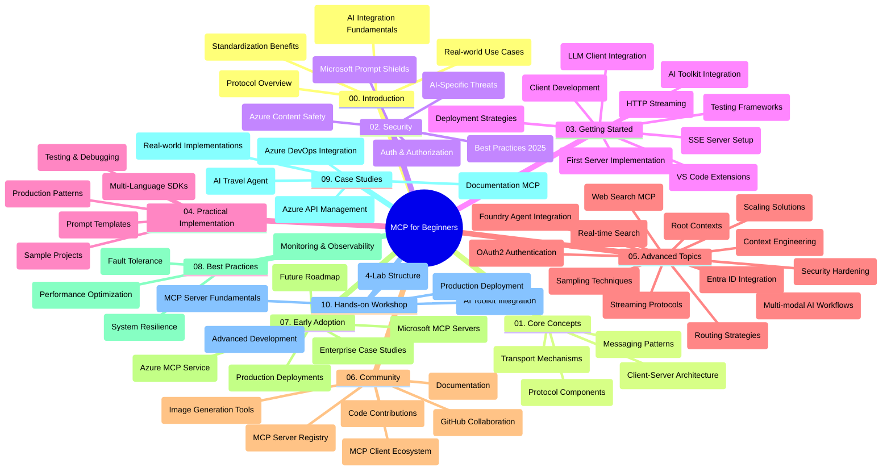

<!--
CO_OP_TRANSLATOR_METADATA:
{
  "original_hash": "e2c6ed897fa98fa08e0146101776c7ff",
  "translation_date": "2025-07-18T09:27:01+00:00",
  "source_file": "study_guide.md",
  "language_code": "ko"
}
-->
# 초보자를 위한 모델 컨텍스트 프로토콜(MCP) - 학습 가이드

이 학습 가이드는 "초보자를 위한 모델 컨텍스트 프로토콜(MCP)" 커리큘럼의 저장소 구조와 내용을 개괄적으로 설명합니다. 이 가이드를 활용해 저장소를 효율적으로 탐색하고 제공되는 리소스를 최대한 활용하세요.

## 저장소 개요

모델 컨텍스트 프로토콜(MCP)은 AI 모델과 클라이언트 애플리케이션 간 상호작용을 위한 표준화된 프레임워크입니다. 원래 Anthropic에서 개발되었으며, 현재는 공식 GitHub 조직을 통해 MCP 커뮤니티가 유지 관리하고 있습니다. 이 저장소는 AI 개발자, 시스템 아키텍트, 소프트웨어 엔지니어를 위해 C#, Java, JavaScript, Python, TypeScript로 작성된 실습 코드 예제와 함께 포괄적인 커리큘럼을 제공합니다.

## 시각적 커리큘럼 맵

## 저장소 구조

저장소는 MCP의 다양한 측면을 다루는 10개의 주요 섹션으로 구성되어 있습니다:

1. **소개 (00-Introduction/)**
   - 모델 컨텍스트 프로토콜 개요
   - AI 파이프라인에서 표준화가 중요한 이유
   - 실용적인 사용 사례와 이점

2. **핵심 개념 (01-CoreConcepts/)**
   - 클라이언트-서버 아키텍처
   - 주요 프로토콜 구성 요소
   - MCP의 메시징 패턴

3. **보안 (02-Security/)**
   - MCP 기반 시스템의 보안 위협
   - 구현 보안을 위한 모범 사례
   - 인증 및 권한 부여 전략
   - **포괄적인 보안 문서**:
     - MCP 보안 모범 사례 2025
     - Azure 콘텐츠 안전 구현 가이드
     - MCP 보안 제어 및 기법
     - MCP 모범 사례 빠른 참조
   - **주요 보안 주제**:
     - 프롬프트 인젝션 및 도구 오염 공격
     - 세션 하이재킹 및 혼란 대리 문제
     - 토큰 전달 취약점
     - 과도한 권한 및 접근 제어
     - AI 구성 요소 공급망 보안
     - Microsoft 프롬프트 실드 통합

4. **시작하기 (03-GettingStarted/)**
   - 환경 설정 및 구성
   - 기본 MCP 서버 및 클라이언트 생성
   - 기존 애플리케이션과의 통합
   - 다음 섹션 포함:
     - 첫 서버 구현
     - 클라이언트 개발
     - LLM 클라이언트 통합
     - VS Code 통합
     - 서버 전송 이벤트(SSE) 서버
     - HTTP 스트리밍
     - AI 툴킷 통합
     - 테스트 전략
     - 배포 가이드라인

5. **실습 구현 (04-PracticalImplementation/)**
   - 다양한 프로그래밍 언어별 SDK 사용법
   - 디버깅, 테스트, 검증 기법
   - 재사용 가능한 프롬프트 템플릿 및 워크플로우 작성
   - 구현 예제가 포함된 샘플 프로젝트

6. **고급 주제 (05-AdvancedTopics/)**
   - 컨텍스트 엔지니어링 기법
   - Foundry 에이전트 통합
   - 멀티모달 AI 워크플로우
   - OAuth2 인증 데모
   - 실시간 검색 기능
   - 실시간 스트리밍
   - 루트 컨텍스트 구현
   - 라우팅 전략
   - 샘플링 기법
   - 확장 방법론
   - 보안 고려사항
   - Entra ID 보안 통합
   - 웹 검색 통합

7. **커뮤니티 기여 (06-CommunityContributions/)**
   - 코드 및 문서 기여 방법
   - GitHub를 통한 협업
   - 커뮤니티 주도 개선 및 피드백
   - 다양한 MCP 클라이언트 사용법 (Claude Desktop, Cline, VSCode)
   - 이미지 생성 등 인기 MCP 서버 활용법

8. **초기 도입 사례 (07-LessonsfromEarlyAdoption/)**
   - 실제 구현 사례 및 성공 스토리
   - MCP 기반 솔루션 구축 및 배포
   - 트렌드 및 향후 로드맵
   - **Microsoft MCP 서버 가이드**: 10개의 프로덕션 준비된 Microsoft MCP 서버 종합 안내서 포함:
     - Microsoft Learn Docs MCP 서버
     - Azure MCP 서버 (15개 이상의 특화 커넥터)
     - GitHub MCP 서버
     - Azure DevOps MCP 서버
     - MarkItDown MCP 서버
     - SQL Server MCP 서버
     - Playwright MCP 서버
     - Dev Box MCP 서버
     - Azure AI Foundry MCP 서버
     - Microsoft 365 Agents Toolkit MCP 서버

9. **모범 사례 (08-BestPractices/)**
   - 성능 튜닝 및 최적화
   - 내결함성 MCP 시스템 설계
   - 테스트 및 복원력 전략

10. **사례 연구 (09-CaseStudy/)**
    - Azure API Management 통합 샘플
    - 여행사 구현 샘플
    - Azure DevOps와 YouTube 업데이트 통합
    - 문서 MCP 구현 예제
    - 상세 문서가 포함된 구현 사례

11. **실습 워크숍 (10-StreamliningAIWorkflowsBuildingAnMCPServerWithAIToolkit/)**
    - MCP와 AI 툴킷을 결합한 종합 실습 워크숍
    - AI 모델과 실제 도구를 연결하는 지능형 애플리케이션 구축
    - 기본 개념, 맞춤형 서버 개발, 프로덕션 배포 전략을 다루는 실습 모듈
    - **랩 구성**:
      - 랩 1: MCP 서버 기본
      - 랩 2: 고급 MCP 서버 개발
      - 랩 3: AI 툴킷 통합
      - 랩 4: 프로덕션 배포 및 확장
    - 단계별 지침이 포함된 랩 기반 학습 방식

## 추가 자료

저장소에는 다음과 같은 지원 자료가 포함되어 있습니다:

- **Images 폴더**: 커리큘럼 전반에 사용된 다이어그램 및 일러스트
- **번역본**: 문서의 다국어 자동 번역 지원
- **공식 MCP 자료**:
  - [MCP Documentation](https://modelcontextprotocol.io/)
  - [MCP Specification](https://spec.modelcontextprotocol.io/)
  - [MCP GitHub Repository](https://github.com/modelcontextprotocol)

## 저장소 활용 방법

1. **순차 학습**: 00부터 10까지 차례대로 따라가며 체계적으로 학습하세요.
2. **언어별 집중**: 특정 프로그래밍 언어에 관심이 있다면 해당 언어별 샘플 디렉터리를 탐색하세요.
3. **실습 구현**: "시작하기" 섹션에서 환경을 설정하고 첫 MCP 서버와 클라이언트를 만들어 보세요.
4. **고급 탐구**: 기본을 익힌 후 고급 주제로 넘어가 지식을 확장하세요.
5. **커뮤니티 참여**: GitHub 토론과 Discord 채널을 통해 MCP 커뮤니티에 참여하고 전문가 및 동료 개발자와 교류하세요.

## MCP 클라이언트 및 도구

커리큘럼에서는 다양한 MCP 클라이언트와 도구를 다룹니다:

1. **공식 클라이언트**:
   - Visual Studio Code
   - Visual Studio Code 내 MCP
   - Claude Desktop
   - VSCode 내 Claude
   - Claude API

2. **커뮤니티 클라이언트**:
   - Cline (터미널 기반)
   - Cursor (코드 에디터)
   - ChatMCP
   - Windsurf

3. **MCP 관리 도구**:
   - MCP CLI
   - MCP Manager
   - MCP Linker
   - MCP Router

## 인기 MCP 서버

저장소에서는 다양한 MCP 서버를 소개합니다:

1. **공식 Microsoft MCP 서버**:
   - Microsoft Learn Docs MCP 서버
   - Azure MCP 서버 (15개 이상의 특화 커넥터)
   - GitHub MCP 서버
   - Azure DevOps MCP 서버
   - MarkItDown MCP 서버
   - SQL Server MCP 서버
   - Playwright MCP 서버
   - Dev Box MCP 서버
   - Azure AI Foundry MCP 서버
   - Microsoft 365 Agents Toolkit MCP 서버

2. **공식 참조 서버**:
   - Filesystem
   - Fetch
   - Memory
   - Sequential Thinking

3. **이미지 생성**:
   - Azure OpenAI DALL-E 3
   - Stable Diffusion WebUI
   - Replicate

4. **개발 도구**:
   - Git MCP
   - Terminal Control
   - Code Assistant

5. **특화 서버**:
   - Salesforce
   - Microsoft Teams
   - Jira & Confluence

## 기여하기

이 저장소는 커뮤니티의 기여를 환영합니다. MCP 생태계에 효과적으로 기여하는 방법은 커뮤니티 기여 섹션을 참고하세요.

## 변경 내역

| 날짜 | 변경 사항 |
|------|---------|
| 2025년 7월 18일 | - Microsoft MCP 서버 가이드 포함하도록 저장소 구조 업데이트 - 10개의 프로덕션 준비된 Microsoft MCP 서버 목록 추가 - 인기 MCP 서버 섹션에 공식 Microsoft MCP 서버 추가 - 사례 연구 섹션에 실제 파일 예제 반영 - 실습 워크숍 랩 구성 세부사항 추가 |
| 2025년 7월 16일 | - 현재 콘텐츠 반영하여 저장소 구조 업데이트 - MCP 클라이언트 및 도구 섹션 추가 - 인기 MCP 서버 섹션 추가 - 시각적 커리큘럼 맵에 모든 현재 주제 반영 - 고급 주제 섹션에 모든 특화 영역 추가 - 사례 연구에 실제 예제 반영 - MCP가 Anthropic에서 시작되었음을 명확히 함 |
| 2025년 6월 11일 | - 학습 가이드 최초 작성 - 시각적 커리큘럼 맵 추가 - 저장소 구조 개요 작성 - 샘플 프로젝트 및 추가 자료 포함 |

---

*이 학습 가이드는 2025년 7월 18일에 업데이트되었으며, 해당 날짜 기준 저장소 개요를 제공합니다. 이후 저장소 내용은 변경될 수 있습니다.*

**면책 조항**:  
이 문서는 AI 번역 서비스 [Co-op Translator](https://github.com/Azure/co-op-translator)를 사용하여 번역되었습니다. 정확성을 위해 최선을 다하고 있으나, 자동 번역에는 오류나 부정확한 부분이 있을 수 있음을 유의해 주시기 바랍니다. 원문은 해당 언어의 원본 문서가 권위 있는 출처로 간주되어야 합니다. 중요한 정보의 경우 전문적인 인간 번역을 권장합니다. 본 번역 사용으로 인해 발생하는 오해나 잘못된 해석에 대해 당사는 책임을 지지 않습니다.