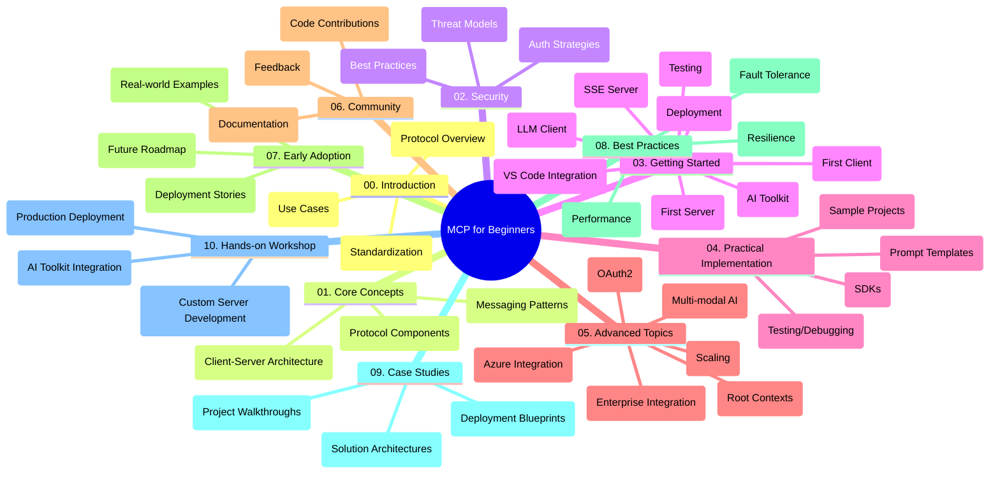

<!--
CO_OP_TRANSLATOR_METADATA:
{
  "original_hash": "a607d4febc94caee9a12b77795f7fc9a",
  "translation_date": "2025-06-11T16:39:46+00:00",
  "source_file": "study_guide.md",
  "language_code": "ko"
}
-->
# Model Context Protocol (MCP) for Beginners - 학습 가이드

이 학습 가이드는 "Model Context Protocol (MCP) for Beginners" 커리큘럼의 저장소 구조와 내용을 개괄적으로 설명합니다. 이 가이드를 활용해 저장소를 효율적으로 탐색하고 제공되는 자료를 최대한 활용하세요.

## 저장소 개요

Model Context Protocol(MCP)은 AI 모델과 클라이언트 애플리케이션 간 상호작용을 위한 표준화된 프레임워크입니다. 이 저장소는 AI 개발자, 시스템 아키텍트, 소프트웨어 엔지니어를 위해 C#, Java, JavaScript, Python, TypeScript로 작성된 실습 코드 예제를 포함한 종합 커리큘럼을 제공합니다.

## 시각적 커리큘럼 맵

## 저장소 구조

저장소는 MCP의 다양한 측면을 다루는 10개의 주요 섹션으로 구성되어 있습니다:

1. **Introduction (00-Introduction/)**
   - Model Context Protocol 개요
   - AI 파이프라인에서 표준화가 중요한 이유
   - 실용적인 사용 사례와 이점

2. **Core Concepts (01-CoreConcepts/)**
   - 클라이언트-서버 아키텍처
   - 핵심 프로토콜 구성 요소
   - MCP의 메시징 패턴

3. **Security (02-Security/)**
   - MCP 기반 시스템의 보안 위협
   - 보안 구현을 위한 모범 사례
   - 인증 및 권한 부여 전략

4. **Getting Started (03-GettingStarted/)**
   - 환경 설정 및 구성
   - 기본 MCP 서버와 클라이언트 생성
   - 기존 애플리케이션과의 통합
   - 첫 서버, 첫 클라이언트, LLM 클라이언트, VS Code 통합, SSE 서버, AI Toolkit, 테스트, 배포 관련 하위 섹션

5. **Practical Implementation (04-PracticalImplementation/)**
   - 다양한 프로그래밍 언어별 SDK 사용법
   - 디버깅, 테스트, 검증 기법
   - 재사용 가능한 프롬프트 템플릿과 워크플로우 제작
   - 구현 예제를 포함한 샘플 프로젝트

6. **Advanced Topics (05-AdvancedTopics/)**
   - 멀티모달 AI 워크플로우 및 확장성
   - 안전한 확장 전략
   - 기업 생태계 내 MCP
   - Azure 통합, 멀티모달리티, OAuth2, 루트 컨텍스트, 라우팅, 샘플링, 스케일링, 보안, 웹 검색 통합, 스트리밍 등 전문 주제

7. **Community Contributions (06-CommunityContributions/)**
   - 코드 및 문서 기여 방법
   - GitHub를 통한 협업
   - 커뮤니티 주도 개선 및 피드백

8. **Lessons from Early Adoption (07-LessonsfromEarlyAdoption/)**
   - 실제 구현 사례 및 성공 스토리
   - MCP 기반 솔루션 구축 및 배포
   - 동향 및 향후 로드맵

9. **Best Practices (08-BestPractices/)**
   - 성능 튜닝 및 최적화
   - 내결함성 MCP 시스템 설계
   - 테스트 및 복원력 전략

10. **Case Studies (09-CaseStudy/)**
    - MCP 솔루션 아키텍처 심층 분석
    - 배포 청사진 및 통합 팁
    - 주석이 포함된 다이어그램과 프로젝트 워크스루

11. **Hands-on Workshop (10-StreamliningAIWorkflowsBuildingAnMCPServerWithAIToolkit/)**
    - MCP와 Microsoft AI Toolkit for VS Code를 결합한 종합 실습 워크숍
    - AI 모델과 실제 도구를 연결하는 지능형 애플리케이션 구축
    - 기본 개념, 맞춤 서버 개발, 프로덕션 배포 전략을 다루는 실습 모듈

## 샘플 프로젝트

저장소에는 다양한 프로그래밍 언어로 MCP 구현을 보여주는 여러 샘플 프로젝트가 포함되어 있습니다:

### 기본 MCP 계산기 샘플
- C# MCP 서버 예제
- Java MCP 계산기
- JavaScript MCP 데모
- Python MCP 서버
- TypeScript MCP 예제

### 고급 MCP 계산기 프로젝트
- 고급 C# 샘플
- Java 컨테이너 앱 예제
- JavaScript 고급 샘플
- Python 복잡한 구현
- TypeScript 컨테이너 샘플

## 추가 자료

저장소에는 다음과 같은 지원 자료가 포함되어 있습니다:

- **Images 폴더**: 커리큘럼 전반에 사용된 다이어그램과 일러스트
- **Translations**: 문서의 다국어 자동 번역 지원
- **공식 MCP 자료**:
  - [MCP Documentation](https://modelcontextprotocol.io/)
  - [MCP Specification](https://spec.modelcontextprotocol.io/)
  - [MCP GitHub Repository](https://github.com/modelcontextprotocol)

## 저장소 활용 방법

1. **순차 학습**: 00부터 10까지 챕터를 순서대로 따라가며 체계적으로 학습하세요.
2. **언어별 집중**: 특정 프로그래밍 언어에 관심이 있다면 샘플 디렉토리에서 해당 언어의 구현을 탐색하세요.
3. **실습 구현**: "Getting Started" 섹션부터 시작해 환경을 설정하고 첫 MCP 서버와 클라이언트를 만들어 보세요.
4. **심화 탐구**: 기본을 익힌 후 고급 주제로 넘어가 지식을 확장하세요.
5. **커뮤니티 참여**: [Azure AI Foundry Discord](https://discord.com/invite/ByRwuEEgH4)에 참여해 전문가 및 개발자들과 교류하세요.

## 기여하기

이 저장소는 커뮤니티의 기여를 환영합니다. 기여 방법은 Community Contributions 섹션을 참고하세요.

---

*이 학습 가이드는 2025년 6월 11일에 작성되었으며, 해당 시점의 저장소 개요를 제공합니다. 이후 저장소 내용은 업데이트되었을 수 있습니다.*

**면책 조항**:  
이 문서는 AI 번역 서비스 [Co-op Translator](https://github.com/Azure/co-op-translator)를 사용하여 번역되었습니다. 정확성을 위해 노력하고 있으나, 자동 번역에는 오류나 부정확성이 포함될 수 있음을 유의하시기 바랍니다. 원문은 해당 언어의 원본 문서를 권위 있는 자료로 간주해야 합니다. 중요한 정보의 경우 전문적인 인간 번역을 권장합니다. 본 번역 사용으로 인한 오해나 잘못된 해석에 대해 당사는 책임을 지지 않습니다.