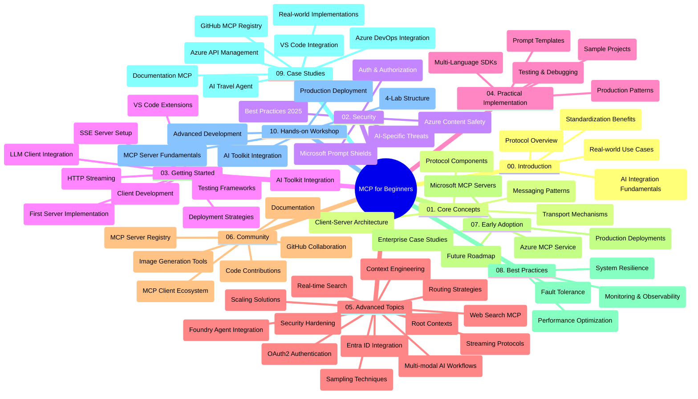

<!--
CO_OP_TRANSLATOR_METADATA:
{
  "original_hash": "719117a0a5f34ade7b5dfb61ee06fb13",
  "translation_date": "2025-09-26T17:57:54+00:00",
  "source_file": "study_guide.md",
  "language_code": "ko"
}
-->
# 초보자를 위한 모델 컨텍스트 프로토콜 (MCP) - 학습 가이드

이 학습 가이드는 "초보자를 위한 모델 컨텍스트 프로토콜 (MCP)" 커리큘럼의 저장소 구조와 내용을 개괄적으로 설명합니다. 이 가이드를 활용하여 저장소를 효율적으로 탐색하고 제공된 리소스를 최대한 활용하세요.

## 저장소 개요

모델 컨텍스트 프로토콜(MCP)은 AI 모델과 클라이언트 애플리케이션 간의 상호작용을 표준화하는 프레임워크입니다. Anthropic에서 처음 개발된 MCP는 현재 공식 GitHub 조직을 통해 MCP 커뮤니티에 의해 유지 관리되고 있습니다. 이 저장소는 C#, Java, JavaScript, Python, TypeScript로 작성된 실습 코드 예제를 포함한 포괄적인 커리큘럼을 제공하며, AI 개발자, 시스템 설계자, 소프트웨어 엔지니어를 대상으로 합니다.

## 시각적 커리큘럼 맵

## 저장소 구조

저장소는 MCP의 다양한 측면을 다루는 10개의 주요 섹션으로 구성되어 있습니다:

1. **소개 (00-Introduction/)**
   - 모델 컨텍스트 프로토콜 개요
   - AI 파이프라인에서 표준화의 중요성
   - 실용적인 사용 사례와 이점

2. **핵심 개념 (01-CoreConcepts/)**
   - 클라이언트-서버 아키텍처
   - 주요 프로토콜 구성 요소
   - MCP의 메시징 패턴

3. **보안 (02-Security/)**
   - MCP 기반 시스템의 보안 위협
   - 구현 보안을 위한 모범 사례
   - 인증 및 권한 부여 전략
   - **포괄적인 보안 문서**:
     - MCP 보안 모범 사례 2025
     - Azure 콘텐츠 안전 구현 가이드
     - MCP 보안 통제 및 기술
     - MCP 모범 사례 간단 참조
   - **주요 보안 주제**:
     - 프롬프트 주입 및 도구 오염 공격
     - 세션 하이재킹 및 혼란스러운 대리 문제
     - 토큰 패스스루 취약점
     - 과도한 권한 및 접근 제어
     - AI 구성 요소의 공급망 보안
     - Microsoft Prompt Shields 통합

4. **시작하기 (03-GettingStarted/)**
   - 환경 설정 및 구성
   - 기본 MCP 서버 및 클라이언트 생성
   - 기존 애플리케이션과의 통합
   - 포함된 섹션:
     - 첫 번째 서버 구현
     - 클라이언트 개발
     - LLM 클라이언트 통합
     - VS Code 통합
     - 서버-발송 이벤트(SSE) 서버
     - HTTP 스트리밍
     - AI 툴킷 통합
     - 테스트 전략
     - 배포 지침

5. **실용적 구현 (04-PracticalImplementation/)**
   - 다양한 프로그래밍 언어에서 SDK 사용
   - 디버깅, 테스트 및 검증 기술
   - 재사용 가능한 프롬프트 템플릿 및 워크플로우 제작
   - 구현 예제를 포함한 샘플 프로젝트

6. **고급 주제 (05-AdvancedTopics/)**
   - 컨텍스트 엔지니어링 기술
   - Foundry 에이전트 통합
   - 멀티모달 AI 워크플로우
   - OAuth2 인증 데모
   - 실시간 검색 기능
   - 실시간 스트리밍
   - 루트 컨텍스트 구현
   - 라우팅 전략
   - 샘플링 기술
   - 확장 접근법
   - 보안 고려사항
   - Entra ID 보안 통합
   - 웹 검색 통합

7. **커뮤니티 기여 (06-CommunityContributions/)**
   - 코드 및 문서 기여 방법
   - GitHub을 통한 협업
   - 커뮤니티 주도 개선 및 피드백
   - 다양한 MCP 클라이언트 사용 (Claude Desktop, Cline, VSCode)
   - 이미지 생성 포함 인기 있는 MCP 서버 작업

8. **초기 채택에서 얻은 교훈 (07-LessonsfromEarlyAdoption/)**
   - 실제 구현 및 성공 사례
   - MCP 기반 솔루션 구축 및 배포
   - 트렌드 및 미래 로드맵
   - **Microsoft MCP 서버 가이드**: 10개의 프로덕션 준비 완료 Microsoft MCP 서버에 대한 포괄적인 가이드:
     - Microsoft Learn Docs MCP 서버
     - Azure MCP 서버 (15개 이상의 전문 커넥터)
     - GitHub MCP 서버
     - Azure DevOps MCP 서버
     - MarkItDown MCP 서버
     - SQL Server MCP 서버
     - Playwright MCP 서버
     - Dev Box MCP 서버
     - Azure AI Foundry MCP 서버
     - Microsoft 365 Agents Toolkit MCP 서버

9. **모범 사례 (08-BestPractices/)**
   - 성능 튜닝 및 최적화
   - 내결함성 MCP 시스템 설계
   - 테스트 및 복원력 전략

10. **사례 연구 (09-CaseStudy/)**
    - **다양한 시나리오에서 MCP의 다재다능성을 보여주는 7개의 포괄적인 사례 연구**:
    - **Azure AI 여행 에이전트**: Azure OpenAI 및 AI 검색을 활용한 멀티 에이전트 오케스트레이션
    - **Azure DevOps 통합**: YouTube 데이터 업데이트를 통한 워크플로우 프로세스 자동화
    - **실시간 문서 검색**: HTTP 스트리밍을 사용하는 Python 콘솔 클라이언트
    - **대화형 학습 계획 생성기**: Chainlit 웹 앱과 대화형 AI
    - **에디터 내 문서화**: GitHub Copilot 워크플로우와 VS Code 통합
    - **Azure API 관리**: MCP 서버 생성과 엔터프라이즈 API 통합
    - **GitHub MCP 레지스트리**: 생태계 개발 및 에이전트 통합 플랫폼
    - 엔터프라이즈 통합, 개발자 생산성, 생태계 개발을 아우르는 구현 예제

11. **실습 워크숍 (10-StreamliningAIWorkflowsBuildingAnMCPServerWithAIToolkit/)**
    - MCP와 AI 툴킷을 결합한 포괄적인 실습 워크숍
    - AI 모델과 실제 도구를 연결하는 지능형 애플리케이션 구축
    - 기본 사항, 맞춤형 서버 개발, 프로덕션 배포 전략을 다루는 실용적인 모듈
    - **랩 구조**:
      - 랩 1: MCP 서버 기본 사항
      - 랩 2: 고급 MCP 서버 개발
      - 랩 3: AI 툴킷 통합
      - 랩 4: 프로덕션 배포 및 확장
    - 단계별 지침을 제공하는 랩 기반 학습 접근법

## 추가 리소스

저장소에는 다음과 같은 지원 리소스가 포함되어 있습니다:

- **이미지 폴더**: 커리큘럼 전반에 사용된 다이어그램 및 삽화 포함
- **번역**: 문서의 자동 번역을 통한 다국어 지원
- **공식 MCP 리소스**:
  - [MCP 문서](https://modelcontextprotocol.io/)
  - [MCP 사양](https://spec.modelcontextprotocol.io/)
  - [MCP GitHub 저장소](https://github.com/modelcontextprotocol)

## 저장소 사용 방법

1. **순차 학습**: 구조화된 학습 경험을 위해 챕터를 순서대로 따라가세요 (00부터 10까지).
2. **언어별 집중 학습**: 특정 프로그래밍 언어에 관심이 있다면 선호하는 언어의 구현 예제가 포함된 샘플 디렉토리를 탐색하세요.
3. **실용적 구현**: "시작하기" 섹션에서 환경을 설정하고 첫 MCP 서버와 클라이언트를 생성하세요.
4. **고급 탐구**: 기본 사항에 익숙해지면 고급 주제를 탐구하여 지식을 확장하세요.
5. **커뮤니티 참여**: GitHub 토론 및 Discord 채널을 통해 MCP 커뮤니티에 참여하여 전문가 및 다른 개발자와 연결하세요.

## MCP 클라이언트 및 도구

커리큘럼은 다양한 MCP 클라이언트와 도구를 다룹니다:

1. **공식 클라이언트**:
   - Visual Studio Code 
   - Visual Studio Code에서 MCP
   - Claude Desktop
   - VSCode에서 Claude
   - Claude API

2. **커뮤니티 클라이언트**:
   - Cline (터미널 기반)
   - Cursor (코드 편집기)
   - ChatMCP
   - Windsurf

3. **MCP 관리 도구**:
   - MCP CLI
   - MCP Manager
   - MCP Linker
   - MCP Router

## 인기 있는 MCP 서버

저장소는 다양한 MCP 서버를 소개합니다:

1. **공식 Microsoft MCP 서버**:
   - Microsoft Learn Docs MCP 서버
   - Azure MCP 서버 (15개 이상의 전문 커넥터)
   - GitHub MCP 서버
   - Azure DevOps MCP 서버
   - MarkItDown MCP 서버
   - SQL Server MCP 서버
   - Playwright MCP 서버
   - Dev Box MCP 서버
   - Azure AI Foundry MCP 서버
   - Microsoft 365 Agents Toolkit MCP 서버

2. **공식 참조 서버**:
   - 파일 시스템
   - Fetch
   - 메모리
   - 순차적 사고

3. **이미지 생성**:
   - Azure OpenAI DALL-E 3
   - Stable Diffusion WebUI
   - Replicate

4. **개발 도구**:
   - Git MCP
   - 터미널 제어
   - 코드 어시스턴트

5. **전문 서버**:
   - Salesforce
   - Microsoft Teams
   - Jira & Confluence

## 기여하기

이 저장소는 커뮤니티의 기여를 환영합니다. MCP 생태계에 효과적으로 기여하는 방법은 커뮤니티 기여 섹션을 참조하세요.

## 변경 로그

| 날짜 | 변경 사항 |
|------|---------|
| 2025년 9월 26일 | - GitHub MCP 레지스트리 사례 연구를 09-CaseStudy 섹션에 추가 - 사례 연구를 7개의 포괄적인 사례 연구로 업데이트 - 사례 연구 설명을 구체적인 구현 세부 사항으로 강화 - GitHub MCP 레지스트리를 포함하도록 시각적 커리큘럼 맵 업데이트 - 생태계 개발 초점을 반영하도록 학습 가이드 구조 수정 |
| 2025년 7월 18일 | - Microsoft MCP 서버 가이드를 포함하도록 저장소 구조 업데이트 - 10개의 프로덕션 준비 완료 Microsoft MCP 서버의 포괄적인 목록 추가 - 공식 Microsoft MCP 서버를 포함하여 인기 있는 MCP 서버 섹션 강화 - 실제 파일 예제를 포함하여 사례 연구 섹션 업데이트 - 실습 워크숍의 랩 구조 세부 사항 추가 |
| 2025년 7월 16일 | - 현재 콘텐츠를 반영하도록 저장소 구조 업데이트 - MCP 클라이언트 및 도구 섹션 추가 - 인기 있는 MCP 서버 섹션 추가 - 현재 주제를 모두 포함하도록 시각적 커리큘럼 맵 업데이트 - 모든 전문 영역을 포함하도록 고급 주제 섹션 강화 - 실제 예제를 반영하도록 사례 연구 업데이트 - MCP의 기원을 Anthropic에서 개발된 것으로 명확히 함 |
| 2025년 6월 11일 | - 학습 가이드 최초 생성 - 시각적 커리큘럼 맵 추가 - 저장소 구조 개요 작성 - 샘플 프로젝트 및 추가 리소스 포함 |

---

*이 학습 가이드는 2025년 9월 26일에 업데이트되었으며, 해당 날짜 기준으로 저장소 개요를 제공합니다. 이후 저장소 콘텐츠는 업데이트될 수 있습니다.*

---

