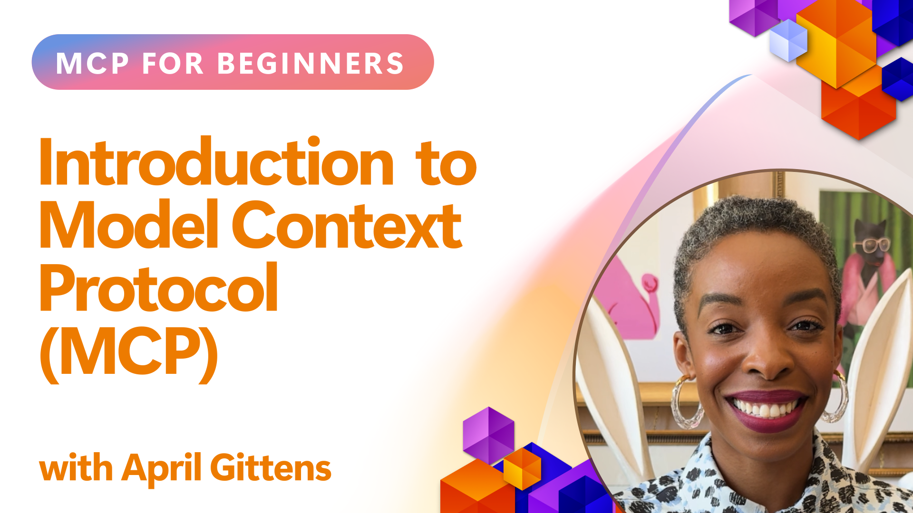
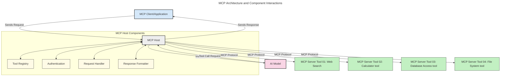
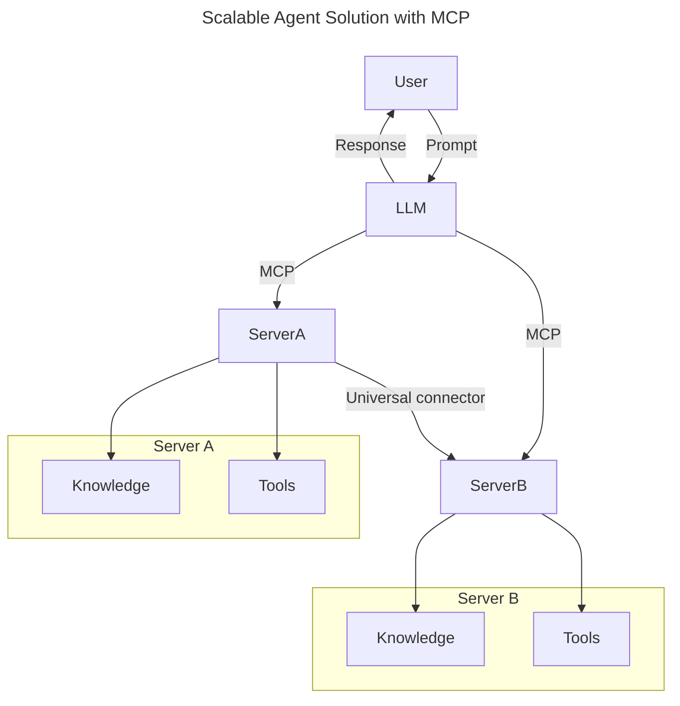
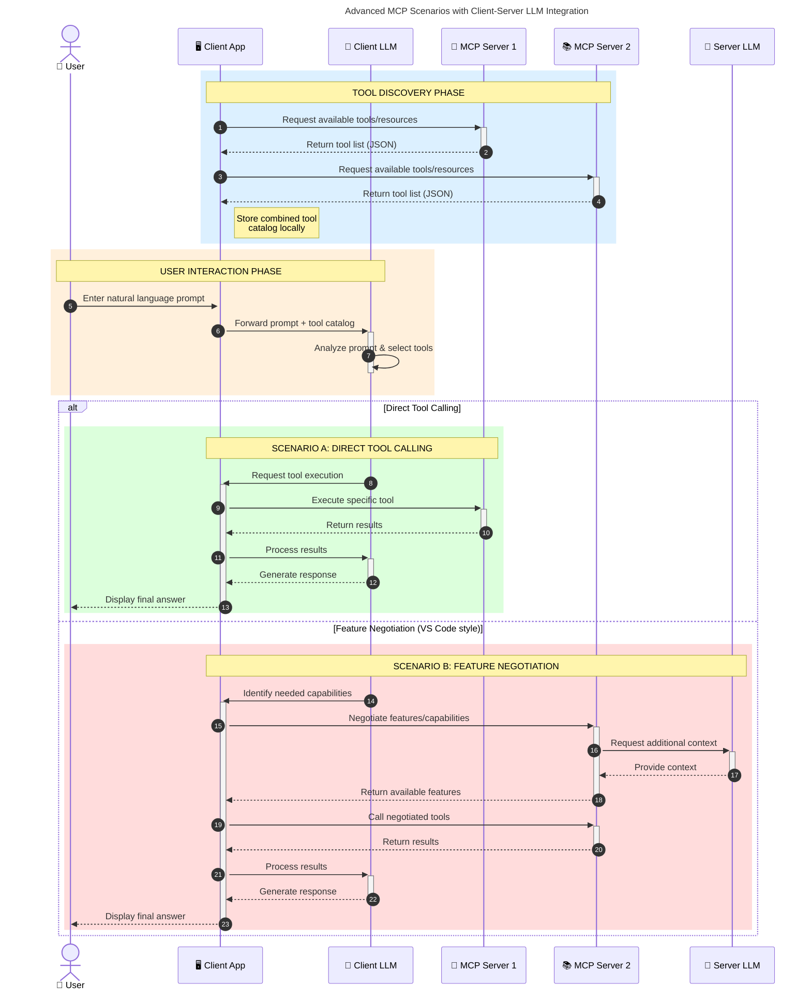

<!--
CO_OP_TRANSLATOR_METADATA:
{
  "original_hash": "0df1ee78a6dd8300f3a040ca5b411c2e",
  "translation_date": "2025-08-26T20:46:36+00:00",
  "source_file": "00-Introduction/README.md",
  "language_code": "lt"
}
-->
# Įvadas į Modelio Konteksto Protokolą (MCP): Kodėl tai svarbu kuriant mastelio AI programas

_(Spustelėkite aukščiau esančią nuotrauką, kad peržiūrėtumėte šios pamokos vaizdo įrašą)_

Generatyviosios AI programos yra didelis žingsnis į priekį, nes jos dažnai leidžia vartotojui bendrauti su programa naudojant natūralios kalbos užklausas. Tačiau, kai į tokias programas investuojama daugiau laiko ir išteklių, norisi užtikrinti, kad funkcionalumai ir ištekliai būtų lengvai integruojami, kad programą būtų lengva plėsti, kad ji galėtų veikti su daugiau nei vienu modeliu ir tvarkytų įvairias modelių subtilybes. Trumpai tariant, generatyviosios AI programos kūrimas yra lengvas pradžioje, tačiau, kai jos auga ir tampa sudėtingesnės, reikia pradėti apibrėžti architektūrą ir greičiausiai remtis standartu, kad programos būtų kuriamos nuosekliai. Čia į pagalbą ateina MCP, kuris padeda organizuoti procesus ir suteikia standartą.

---

## **🔍 Kas yra Modelio Konteksto Protokolas (MCP)?**

**Modelio Konteksto Protokolas (MCP)** yra **atviras, standartizuotas sąsajos protokolas**, leidžiantis dideliems kalbos modeliams (LLM) sklandžiai sąveikauti su išoriniais įrankiais, API ir duomenų šaltiniais. Jis suteikia nuoseklią architektūrą, kuri pagerina AI modelių funkcionalumą už jų mokymo duomenų ribų, leidžiant kurti išmanesnes, mastelio ir jautresnes AI sistemas.

---

## **🎯 Kodėl AI standartizacija yra svarbi**

Kai generatyviosios AI programos tampa sudėtingesnės, būtina priimti standartus, kurie užtikrintų **mastelį, plėtrumą, palaikomumą** ir **išvengtų priklausomybės nuo vieno tiekėjo**. MCP sprendžia šiuos poreikius:

- Suvienodindamas modelių ir įrankių integracijas
- Sumažindamas trapias, vienkartines pritaikytas sprendimų sistemas
- Leidžiant vienoje ekosistemoje veikti keliems modeliams iš skirtingų tiekėjų

**Pastaba:** Nors MCP save pristato kaip atvirą standartą, nėra planų MCP standartizuoti per esamas standartų organizacijas, tokias kaip IEEE, IETF, W3C, ISO ar kitas.

---

## **📚 Mokymosi tikslai**

Šio straipsnio pabaigoje galėsite:

- Apibrėžti **Modelio Konteksto Protokolą (MCP)** ir jo naudojimo atvejus
- Suprasti, kaip MCP standartizuoja modelio ir įrankių komunikaciją
- Atpažinti pagrindinius MCP architektūros komponentus
- Išnagrinėti realaus pasaulio MCP taikymo pavyzdžius įmonių ir kūrimo kontekstuose

---

## **💡 Kodėl Modelio Konteksto Protokolas (MCP) yra proveržis**

### **🔗 MCP sprendžia AI sąveikų fragmentaciją**

Prieš MCP, modelių integravimas su įrankiais reikalavo:

- Individualaus kodo kiekvienai įrankio ir modelio porai
- Nestandartinių API kiekvienam tiekėjui
- Dažnų gedimų dėl atnaujinimų
- Prasto mastelio didėjant įrankių skaičiui

### **✅ MCP standartizacijos privalumai**

| **Privalumas**            | **Aprašymas**                                                                  |
|---------------------------|-------------------------------------------------------------------------------|
| Sąveikumas               | LLM sklandžiai veikia su įrankiais iš skirtingų tiekėjų                        |
| Nuoseklumas              | Vienodas elgesys visose platformose ir įrankiuose                              |
| Pakartotinis naudojimas  | Kartą sukurti įrankiai gali būti naudojami įvairiuose projektuose ir sistemose |
| Spartesnis kūrimas       | Sutrumpina kūrimo laiką naudojant standartizuotas, lengvai pritaikomas sąsajas |

---

## **🧱 Aukšto lygio MCP architektūros apžvalga**

MCP naudoja **kliento-serverio modelį**, kuriame:

- **MCP šeimininkai** valdo AI modelius
- **MCP klientai** inicijuoja užklausas
- **MCP serveriai** teikia kontekstą, įrankius ir galimybes

### **Pagrindiniai komponentai:**

- **Ištekliai** – Statiniai arba dinaminiai duomenys modeliams  
- **Užklausos** – Iš anksto apibrėžti darbo srautai generavimui nukreipti  
- **Įrankiai** – Vykdomos funkcijos, tokios kaip paieška, skaičiavimai  
- **Mėginių ėmimas** – Agentinis elgesys per rekursines sąveikas  

---

## Kaip veikia MCP serveriai

MCP serveriai veikia taip:

- **Užklausos eiga**:
    1. Užklausą inicijuoja galutinis vartotojas arba programinė įranga, veikianti jo vardu.
    2. **MCP klientas** siunčia užklausą **MCP šeimininkui**, kuris valdo AI modelio vykdymo aplinką.
    3. **AI modelis** gauna vartotojo užklausą ir gali prašyti prieigos prie išorinių įrankių ar duomenų per vieną ar kelis įrankių iškvietimus.
    4. **MCP šeimininkas**, o ne pats modelis, bendrauja su atitinkamais **MCP serveriais** naudodamas standartizuotą protokolą.
- **MCP šeimininko funkcionalumas**:
    - **Įrankių registras**: Tvarko galimų įrankių ir jų galimybių katalogą.
    - **Autentifikacija**: Tikrina leidimus naudotis įrankiais.
    - **Užklausų tvarkytojas**: Apdoroja gaunamas įrankių užklausas iš modelio.
    - **Atsakymų formuotojas**: Struktūrizuoja įrankių išvestį formatu, kurį modelis gali suprasti.
- **MCP serverio vykdymas**:
    - **MCP šeimininkas** nukreipia įrankių užklausas į vieną ar kelis **MCP serverius**, kurie teikia specializuotas funkcijas (pvz., paiešką, skaičiavimus, duomenų bazės užklausas).
    - **MCP serveriai** atlieka savo operacijas ir grąžina rezultatus **MCP šeimininkui** nuosekliu formatu.
    - **MCP šeimininkas** formatuoja ir perduoda šiuos rezultatus **AI modeliui**.
- **Atsakymo užbaigimas**:
    - **AI modelis** įtraukia įrankių išvestį į galutinį atsakymą.
    - **MCP šeimininkas** siunčia šį atsakymą atgal **MCP klientui**, kuris jį pateikia galutiniam vartotojui arba kviečiančiai programinei įrangai.

## 👨‍💻 Kaip sukurti MCP serverį (su pavyzdžiais)

MCP serveriai leidžia išplėsti LLM galimybes, teikiant duomenis ir funkcionalumą.

Pasiruošę išbandyti? Štai kalbų ir/arba platformų specifiniai SDK su pavyzdžiais, kaip kurti paprastus MCP serverius skirtingomis kalbomis/platformomis:

- **Python SDK**: https://github.com/modelcontextprotocol/python-sdk

- **TypeScript SDK**: https://github.com/modelcontextprotocol/typescript-sdk

- **Java SDK**: https://github.com/modelcontextprotocol/java-sdk

- **C#/.NET SDK**: https://github.com/modelcontextprotocol/csharp-sdk

---

## 🌍 Realūs MCP naudojimo atvejai

MCP leidžia platų programų spektrą, išplečiant AI galimybes:

| **Programa**                  | **Aprašymas**                                                                |
|-------------------------------|-------------------------------------------------------------------------------|
| Įmonių duomenų integracija    | Sujungia LLM su duomenų bazėmis, CRM ar vidiniais įrankiais                   |
| Agentinės AI sistemos         | Leidžia autonominiams agentams naudotis įrankiais ir sprendimų priėmimo srautais |
| Daugiarūšės programos         | Sujungia tekstą, vaizdus ir garsą vienoje AI programoje                       |
| Realaus laiko duomenų integracija | Įtraukia tiesioginius duomenis į AI sąveikas, kad būtų pateikti tikslesni, aktualūs rezultatai |

### 🧠 MCP = Universalus AI sąveikų standartas

Modelio Konteksto Protokolas (MCP) veikia kaip universalus AI sąveikų standartas, panašiai kaip USB-C standartizavo fizinius įrenginių jungimus. AI pasaulyje MCP suteikia nuoseklią sąsają, leidžiančią modeliams (klientams) sklandžiai integruotis su išoriniais įrankiais ir duomenų teikėjais (serveriais). Tai pašalina poreikį kurti įvairius, pritaikytus protokolus kiekvienai API ar duomenų šaltiniui.

Pagal MCP, MCP suderinamas įrankis (vadinamas MCP serveriu) laikosi vieningo standarto. Šie serveriai gali pateikti sąrašą įrankių ar veiksmų, kuriuos jie siūlo, ir vykdyti tuos veiksmus, kai jų prašo AI agentas. AI agentų platformos, palaikančios MCP, gali aptikti galimus įrankius iš serverių ir juos iškviesti per šį standartizuotą protokolą.

### 💡 Palengvina prieigą prie žinių

Be įrankių teikimo, MCP taip pat palengvina prieigą prie žinių. Tai leidžia programoms suteikti kontekstą dideliems kalbos modeliams (LLM), susiejant juos su įvairiais duomenų šaltiniais. Pavyzdžiui, MCP serveris gali atstovauti įmonės dokumentų saugyklą, leidžiant agentams pagal poreikį gauti aktualią informaciją. Kitas serveris galėtų atlikti specifinius veiksmus, pvz., siųsti el. laiškus ar atnaujinti įrašus. Agentui šie veiksmai tiesiog yra įrankiai, kuriuos jis gali naudoti – kai kurie įrankiai grąžina duomenis (žinių kontekstą), o kiti atlieka veiksmus. MCP efektyviai valdo abu.

Agentas, prisijungęs prie MCP serverio, automatiškai sužino apie serverio galimybes ir prieinamus duomenis per standartinį formatą. Ši standartizacija leidžia dinamiškai naudoti įrankius. Pavyzdžiui, pridėjus naują MCP serverį į agento sistemą, jo funkcijos tampa iškart prieinamos be papildomo agento instrukcijų pritaikymo.

Ši supaprastinta integracija atitinka srautą, pavaizduotą toliau pateiktoje diagramoje, kur serveriai teikia tiek įrankius, tiek žinias, užtikrindami sklandų bendradarbiavimą tarp sistemų.

### 👉 Pavyzdys: Mastelio agento sprendimas

### 🔄 Pažangūs MCP scenarijai su kliento pusės LLM integracija

Be pagrindinės MCP architektūros, yra pažangių scenarijų, kai tiek klientas, tiek serveris turi LLM, leidžiant sudėtingesnes sąveikas. Toliau pateiktoje diagramoje **kliento programa** galėtų būti IDE su daugybe MCP įrankių, prieinamų LLM naudoti:

---

## 🔐 Praktiniai MCP privalumai

Štai praktiniai MCP naudojimo privalumai:

- **Aktualumas**: Modeliai gali pasiekti naujausią informaciją už jų mokymo duomenų ribų
- **Galimybių išplėtimas**: Modeliai gali naudotis specializuotais įrankiais užduotims, kurioms jie nebuvo apmokyti
- **Sumažintos haliucinacijos**: Išoriniai duomenų šaltiniai suteikia faktinį pagrindą
- **Privatumas**: Jautrūs duomenys gali likti saugioje aplinkoje, o ne būti įtraukti į užklausas

---

## 📌 Pagrindinės išvados

Štai pagrindinės MCP naudojimo išvados:

- **MCP** standartizuoja, kaip AI modeliai sąveikauja su įrankiais ir duomenimis
- Skatina **plėtrumą, nuoseklumą ir sąveikumą**
- MCP padeda **sutrumpinti kūrimo laiką, pagerinti patikimumą ir išplėsti modelio galimybes**
- Kliento-serverio architektūra **leidžia kurti lanksčias, plėtrias AI programas**

---

## 🧠 Užduotis

Pagalvokite apie AI programą, kurią norėtumėte sukurti.

- Kokie **išoriniai įrankiai ar duomenys** galėtų pagerinti jos galimybes?
- Kaip MCP galėtų padaryti integraciją **paprastesnę ir patikimesnę**?

---

## Papildomi ištekliai

- [MCP GitHub saugykla](https://github.com/modelcontextprotocol)

---

## Kas toliau

Toliau: [1 skyrius: Pagrindinės sąvokos](../01-CoreConcepts/README.md)

---

**Atsakomybės apribojimas**:  
Šis dokumentas buvo išverstas naudojant AI vertimo paslaugą [Co-op Translator](https://github.com/Azure/co-op-translator). Nors siekiame tikslumo, prašome atkreipti dėmesį, kad automatiniai vertimai gali turėti klaidų ar netikslumų. Originalus dokumentas jo gimtąja kalba turėtų būti laikomas autoritetingu šaltiniu. Dėl svarbios informacijos rekomenduojama profesionali žmogaus vertimo paslauga. Mes neprisiimame atsakomybės už nesusipratimus ar klaidingus interpretavimus, atsiradusius naudojant šį vertimą.