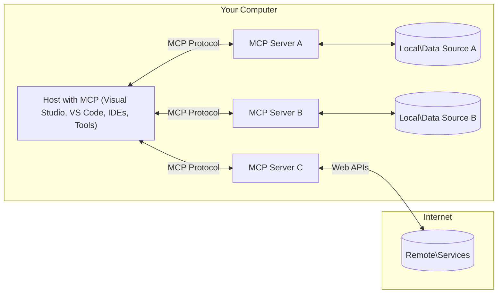

<!--
CO_OP_TRANSLATOR_METADATA:
{
  "original_hash": "904b59de1de9264801242d90a42cdd9d",
  "translation_date": "2025-09-05T11:51:55+00:00",
  "source_file": "01-CoreConcepts/README.md",
  "language_code": "lt"
}
-->
# MCP Pagrindinės Sąvokos: Model Context Protocol įvaldymas AI integracijai

[](https://youtu.be/earDzWGtE84)

_(Spustelėkite paveikslėlį aukščiau, kad peržiūrėtumėte šios pamokos vaizdo įrašą)_

[Model Context Protocol (MCP)](https://github.com/modelcontextprotocol) yra galingas, standartizuotas pagrindas, optimizuojantis komunikaciją tarp didelių kalbos modelių (LLM) ir išorinių įrankių, programų bei duomenų šaltinių. Šis vadovas padės jums suprasti pagrindines MCP sąvokas. Sužinosite apie jo klientų-serverių architektūrą, esminius komponentus, komunikacijos mechaniką ir geriausią praktinį įgyvendinimą.

- **Aiškus vartotojo sutikimas**: Visi duomenų prieigos ir operacijų veiksmai reikalauja aiškaus vartotojo patvirtinimo prieš vykdymą. Vartotojai turi aiškiai suprasti, kokie duomenys bus pasiekiami ir kokie veiksmai bus atliekami, turėdami detalų leidimų ir autorizacijų valdymą.

- **Duomenų privatumo apsauga**: Vartotojo duomenys atskleidžiami tik su aiškiu sutikimu ir turi būti apsaugoti stipriomis prieigos kontrolėmis viso sąveikos ciklo metu. Įgyvendinimas turi užkirsti kelią neleistinam duomenų perdavimui ir išlaikyti griežtas privatumo ribas.

- **Įrankių vykdymo saugumas**: Kiekvienas įrankio iškvietimas reikalauja aiškaus vartotojo sutikimo, aiškiai suprantant įrankio funkcionalumą, parametrus ir galimą poveikį. Stiprios saugumo ribos turi užkirsti kelią netyčiniam, nesaugiems ar kenksmingiems įrankių vykdymams.

- **Transporto sluoksnio saugumas**: Visos komunikacijos kanalai turėtų naudoti tinkamus šifravimo ir autentifikavimo mechanizmus. Nuotolinės jungtys turėtų įgyvendinti saugius transporto protokolus ir tinkamą kredencialų valdymą.

#### Įgyvendinimo gairės:

- **Leidimų valdymas**: Įgyvendinkite detalius leidimų sistemas, leidžiančias vartotojams kontroliuoti, kurie serveriai, įrankiai ir ištekliai yra pasiekiami  
- **Autentifikacija ir autorizacija**: Naudokite saugius autentifikacijos metodus (OAuth, API raktus) su tinkamu žetonų valdymu ir galiojimo pabaiga  
- **Įvesties validacija**: Validuokite visus parametrus ir duomenų įvestis pagal apibrėžtas schemas, kad išvengtumėte injekcijos atakų  
- **Audito žurnalai**: Palaikykite išsamius visų operacijų žurnalus saugumo stebėjimui ir atitikties užtikrinimui  

## Apžvalga

Šioje pamokoje nagrinėjama pagrindinė architektūra ir komponentai, sudarantys Model Context Protocol (MCP) ekosistemą. Sužinosite apie klientų-serverių architektūrą, pagrindinius komponentus ir komunikacijos mechanizmus, kurie palaiko MCP sąveikas.

## Pagrindiniai mokymosi tikslai

Pamokos pabaigoje jūs:

- Suprasite MCP klientų-serverių architektūrą.
- Identifikuosite Hostų, Klientų ir Serverių vaidmenis bei atsakomybes.
- Analizuosite pagrindines MCP savybes, kurios daro jį lankstų integracijos sluoksnį.
- Sužinosite, kaip informacija teka MCP ekosistemoje.
- Įgysite praktinių įžvalgų per kodų pavyzdžius .NET, Java, Python ir JavaScript.

## MCP Architektūra: Išsamus žvilgsnis

MCP ekosistema yra sukurta remiantis klientų-serverių modeliu. Ši modulinė struktūra leidžia AI programoms efektyviai sąveikauti su įrankiais, duomenų bazėmis, API ir kontekstiniais ištekliais. Panagrinėkime šią architektūrą jos pagrindiniuose komponentuose.

MCP pagrindas yra klientų-serverių architektūra, kurioje hosto programa gali prisijungti prie kelių serverių:



- **MCP Hostai**: Programos, tokios kaip VSCode, Claude Desktop, IDE ar AI įrankiai, norintys pasiekti duomenis per MCP  
- **MCP Klientai**: Protokolo klientai, palaikantys 1:1 ryšius su serveriais  
- **MCP Serveriai**: Lengvos programos, kurios kiekviena atskleidžia specifines galimybes per standartizuotą Model Context Protocol  
- **Vietiniai duomenų šaltiniai**: Jūsų kompiuterio failai, duomenų bazės ir paslaugos, kurias MCP serveriai gali saugiai pasiekti  
- **Nuotolinės paslaugos**: Išorinės sistemos, pasiekiamos internetu, prie kurių MCP serveriai gali prisijungti per API.

MCP Protokolas yra besivystantis standartas, naudojantis datų pagrindu versijavimą (YYYY-MM-DD formatas). Dabartinė protokolo versija yra **2025-06-18**. Naujausius protokolo specifikacijos atnaujinimus galite rasti [čia](https://modelcontextprotocol.io/specification/2025-06-18/).

### 1. Hostai

Model Context Protocol (MCP) **Hostai** yra AI programos, kurios veikia kaip pagrindinė sąsaja, per kurią vartotojai sąveikauja su protokolu. Hostai koordinuoja ir valdo ryšius su keliais MCP serveriais, sukurdami dedikuotus MCP klientus kiekvienam serverio ryšiui. Hostų pavyzdžiai:

- **AI Programos**: Claude Desktop, Visual Studio Code, Claude Code  
- **Kūrimo aplinkos**: IDE ir kodų redaktoriai su MCP integracija  
- **Individualios programos**: Specialiai sukurtos AI agentai ir įrankiai  

**Hostai** yra programos, koordinuojančios AI modelių sąveikas. Jie:

- **Orkestruoja AI modelius**: Vykdo arba sąveikauja su LLM, kad generuotų atsakymus ir koordinuotų AI darbo eigas  
- **Valdo klientų ryšius**: Sukuria ir palaiko vieną MCP klientą kiekvienam MCP serverio ryšiui  
- **Kontroliuoja vartotojo sąsają**: Tvarko pokalbių eigą, vartotojo sąveikas ir atsakymų pateikimą  
- **Užtikrina saugumą**: Valdo leidimus, saugumo apribojimus ir autentifikaciją  
- **Tvarko vartotojo sutikimą**: Valdo vartotojo patvirtinimą dėl duomenų dalijimosi ir įrankių vykdymo  

### 2. Klientai

**Klientai** yra esminiai komponentai, palaikantys dedikuotus vienas su vienu ryšius tarp Hostų ir MCP serverių. Kiekvienas MCP klientas yra sukuriamas Hosto, kad prisijungtų prie specifinio MCP serverio, užtikrinant organizuotus ir saugius komunikacijos kanalus. Daug klientų leidžia Hostams vienu metu prisijungti prie kelių serverių.

**Klientai** yra jungiamieji komponentai Hosto programoje. Jie:

- **Protokolo komunikacija**: Siunčia JSON-RPC 2.0 užklausas serveriams su raginimais ir instrukcijomis  
- **Galimybių derinimas**: Derina palaikomas funkcijas ir protokolo versijas su serveriais inicializacijos metu  
- **Įrankių vykdymas**: Tvarko įrankių vykdymo užklausas iš modelių ir apdoroja atsakymus  
- **Realaus laiko atnaujinimai**: Tvarko pranešimus ir realaus laiko atnaujinimus iš serverių  
- **Atsakymų apdorojimas**: Apdoroja ir formatuoja serverių atsakymus, kad jie būtų pateikti vartotojams  

### 3. Serveriai

**Serveriai** yra programos, teikiančios kontekstą, įrankius ir galimybes MCP klientams. Jie gali veikti lokaliai (toje pačioje mašinoje kaip Hostas) arba nuotoliniu būdu (išorinėse platformose) ir yra atsakingi už klientų užklausų tvarkymą bei struktūruotų atsakymų pateikimą. Serveriai atskleidžia specifinę funkcionalumą per standartizuotą Model Context Protocol.

**Serveriai** yra paslaugos, teikiančios kontekstą ir galimybes. Jie:

- **Funkcijų registracija**: Registruoja ir atskleidžia galimus primityvus (išteklius, raginimus, įrankius) klientams  
- **Užklausų apdorojimas**: Priima ir vykdo įrankių iškvietimus, išteklių užklausas ir raginimų užklausas iš klientų  
- **Konteksto teikimas**: Pateikia kontekstinę informaciją ir duomenis, kad pagerintų modelio atsakymus  
- **Būsenos valdymas**: Palaiko sesijos būseną ir tvarko būsenines sąveikas, kai to reikia  
- **Realaus laiko pranešimai**: Siunčia pranešimus apie galimybių pokyčius ir atnaujinimus prijungtiems klientams  

Serverius gali kurti bet kas, norėdamas išplėsti modelio galimybes specializuota funkcionalumu, ir jie palaiko tiek lokalius, tiek nuotolinius diegimo scenarijus.

### 4. Serverio primityvai

Model Context Protocol (MCP) serveriai teikia tris pagrindinius **primityvus**, kurie apibrėžia pagrindinius sąveikos elementus tarp klientų, hostų ir kalbos modelių. Šie primityvai nurodo kontekstinės informacijos ir veiksmų tipus, pasiekiamus per protokolą.

MCP serveriai gali atskleisti bet kokį šių trijų pagrindinių primityvų derinį:

#### Ištekliai

**Ištekliai** yra duomenų šaltiniai, teikiantys kontekstinę informaciją AI programoms. Jie atspindi statinį arba dinaminį turinį, kuris gali pagerinti modelio supratimą ir sprendimų priėmimą:

- **Kontekstiniai duomenys**: Struktūruota informacija ir kontekstas AI modelio suvartojimui  
- **Žinių bazės**: Dokumentų saugyklos, straipsniai, vadovai ir moksliniai darbai  
- **Vietiniai duomenų šaltiniai**: Failai, duomenų bazės ir vietinė sistemos informacija  
- **Išoriniai duomenys**: API atsakymai, interneto paslaugos ir nuotolinės sistemos duomenys  
- **Dinaminis turinys**: Realaus laiko duomenys, kurie atnaujinami pagal išorines sąlygas  

Ištekliai identifikuojami pagal URI ir palaiko atradimą per `resources/list` bei gavimą per `resources/read` metodus:

```text
file://documents/project-spec.md
database://production/users/schema
api://weather/current
```

#### Raginimai

**Raginimai** yra daugkartinio naudojimo šablonai, padedantys struktūruoti sąveikas su kalbos modeliais. Jie teikia standartizuotus sąveikos modelius ir šabloninius darbo eigas:

- **Šabloninės sąveikos**: Iš anksto struktūruotos žinutės ir pokalbių pradžios  
- **Darbo eigos šablonai**: Standartizuotos sekos įprastoms užduotims ir sąveikoms  
- **Few-shot pavyzdžiai**: Pavyzdžiais pagrįsti šablonai modelio instrukcijoms  
- **Sisteminiai raginimai**: Pagrindiniai raginimai, apibrėžiantys modelio elgesį ir kontekstą  
- **Dinaminiai šablonai**: Parametrizuoti raginimai, prisitaikantys prie specifinių kontekstų  

Raginimai palaiko kintamųjų pakeitimą ir gali būti atrasti per `prompts/list` bei gauti per `prompts/get`:

```markdown
Generate a {{task_type}} for {{product}} targeting {{audience}} with the following requirements: {{requirements}}
```

#### Įrankiai

**Įrankiai** yra vykdomos funkcijos, kurias AI modeliai gali iškviesti, kad atliktų specifinius veiksmus. Jie atspindi MCP ekosistemos „veiksmažodžius“, leidžiančius modeliams sąveikauti su išorinėmis sistemomis:

- **Vykdomos funkcijos**: Atskirti veiksmai, kuriuos modeliai gali iškviesti su specifiniais parametrais  
- **Išorinės sistemos integracija**: API iškvietimai, duomenų bazės užklausos, failų operacijos, skaičiavimai  
- **Unikali tapatybė**: Kiekvienas įrankis turi unikalų pavadinimą, aprašymą ir parametrų schemą  
- **Struktūruotas I/O**: Įrankiai priima validuotus parametrus ir grąžina struktūruotus, tipizuotus atsakymus  
- **Veiksmų galimybės**: Leidžia modeliams atlikti realius veiksmus ir gauti gyvus duomenis  

Įrankiai apibrėžiami JSON Schema parametrų validacijai ir atrandami per `tools/list`, vykdomi per `tools/call`:

```typescript
server.tool(
  "search_products", 
  {
    query: z.string().describe("Search query for products"),
    category: z.string().optional().describe("Product category filter"),
    max_results: z.number().default(10).describe("Maximum results to return")
  }, 
  async (params) => {
    // Execute search and return structured results
    return await productService.search(params);
  }
);
```

## Klientų primityvai

Model Context Protocol (MCP) **klientai** gali atskleisti primityvus, leidžiančius serveriams prašyti papildomų galimybių iš hosto programos. Šie klientų pusės primityvai leidžia turtingesnius, interaktyvesnius serverių įgyvendinimus, kurie gali pasiekti AI modelio galimybes ir vartotojo sąveikas.

### Pavyzdžių generavimas

**Pavyzdžių generavimas** leidžia serveriams prašyti kalbos modelio užbaigimų iš kliento AI programos. Šis primityvas leidžia serveriams pasiekti LLM galimybes be savo modelio priklausomybių:

- **Modelio nepriklausoma prieiga**: Serveriai gali prašyti užbaigimų be LLM SDK ar modelio prieigos valdymo  
- **Serverio inicijuotas AI**: Leidžia serveriams autonomiškai generuoti turinį naudojant kliento AI modelį  
- **Recursyvios LLM sąveikos**: Palaiko sudėtingus scenarijus, kur serveriams reikia AI pagalbos apdorojimui  
- **Dinaminis turinio generavimas**: Leidžia serveriams kurti kontekstinius atsakymus naudojant hosto modelį  

Pavyzdžių generavimas inicijuojamas per `sampling/complete` metodą, kur serveriai siunčia užbaigimo užklausas klientams.

### Informacijos rinkimas  

**Informacijos rinkimas** leidžia serveriams prašyti papildomos informacijos arba patvirtinimo iš vartotojų per kliento sąsają:

- **Vartotojo įvesties užklausos**: Serveriai gali prašyti papildomos informacijos, kai to reikia įrankio vykdymui  
- **Patvirtinimo dialogai**: Prašo vartotojo patvirtinimo jautriems ar reikšmingiems veiksmams  
- **Interaktyvios darbo eigos**: Leidžia serveriams kurti žingsnis po žingsnio vartotojo sąveikas  
- **Dinaminis parametrų rinkimas**: Surenka trūkstamus arba pasirenkamus parametrus įrankio vykdymo metu  

Informacijos rinkimo užklausos atliekamos naudojant `elicitation/request` metodą, kad surinktų vartotojo įvestį per kliento sąsają.

### Žurnalavimas

**Žurnalavimas** leidžia serveriams siųsti struktūruotus žurnalų pranešimus klientams, skirtus derinimui, stebėjimui ir operaciniam matomumui:

- **Derinimo palaikymas**: Leidžia serveriams pateikti detalius vykdymo žurnalus problemų sprendimui  
- **Operacinis stebėjimas**: Siunčia būsenos atnaujinimus ir našumo metrikas klientams  
- **Klaidų ataskaitos**: Pateikia detalią klaidų kontekstą ir diagnostinę informaciją  
- **Audito pėdsakai**: Kuria išsamius serverio operacijų ir sprendimų žurnalus  

Žurnalų pranešimai siunčiami klientams, kad būtų
- **JSON-RPC 2.0 Protokolas**: Visa komunikacija vyksta naudojant standartizuotą JSON-RPC 2.0 žinučių formatą metodų iškvietimams, atsakymams ir pranešimams
- **Gyvavimo ciklo valdymas**: Tvarko ryšio inicializavimą, galimybių derinimą ir sesijos nutraukimą tarp klientų ir serverių
- **Serverio primityvai**: Leidžia serveriams teikti pagrindines funkcijas per įrankius, išteklius ir šablonus
- **Kliento primityvai**: Leidžia serveriams prašyti LLM pavyzdžių, gauti vartotojo įvestį ir siųsti žurnalo pranešimus
- **Pranešimai realiuoju laiku**: Palaiko asinchroninius pranešimus dinamiškiems atnaujinimams be apklausos

#### Pagrindinės funkcijos:

- **Protokolo versijos derinimas**: Naudoja datomis pagrįstą versijavimą (YYYY-MM-DD), kad užtikrintų suderinamumą
- **Galimybių atradimas**: Klientai ir serveriai keičiasi palaikomų funkcijų informacija inicializacijos metu
- **Būsenos sesijos**: Išlaiko ryšio būseną per kelias sąveikas, kad būtų užtikrintas konteksto tęstinumas

### Transporto sluoksnis

**Transporto sluoksnis** valdo komunikacijos kanalus, žinučių rėminimą ir autentifikaciją tarp MCP dalyvių:

#### Palaikomi transporto mechanizmai:

1. **STDIO transportas**:
   - Naudoja standartinius įvesties/išvesties srautus tiesioginei procesų komunikacijai
   - Optimalus vietiniams procesams toje pačioje mašinoje be tinklo apkrovos
   - Dažnai naudojamas vietinėse MCP serverio implementacijose

2. **Srautinio HTTP transportas**:
   - Naudoja HTTP POST klientų ir serverių žinutėms  
   - Pasirenkami serverio siunčiami įvykiai (SSE) serverio ir kliento srautui
   - Leidžia nuotolinę serverio komunikaciją per tinklus
   - Palaiko standartinę HTTP autentifikaciją (autentifikacijos žetonai, API raktai, pritaikyti antraštės)
   - MCP rekomenduoja OAuth saugiam autentifikavimui žetonais

#### Transporto abstrakcija:

Transporto sluoksnis abstrahuoja komunikacijos detales nuo duomenų sluoksnio, leidžiant naudoti tą patį JSON-RPC 2.0 žinučių formatą per visus transporto mechanizmus. Ši abstrakcija leidžia programoms sklandžiai pereiti tarp vietinių ir nuotolinių serverių.

### Saugumo aspektai

MCP implementacijos turi laikytis kelių svarbių saugumo principų, kad užtikrintų saugias, patikimas ir saugias sąveikas per visas protokolo operacijas:

- **Vartotojo sutikimas ir kontrolė**: Vartotojai turi aiškiai sutikti prieš prieinant prie duomenų ar atliekant operacijas. Jie turi turėti aiškią kontrolę, kokie duomenys yra dalijami ir kokie veiksmai yra autorizuoti, palaikomi intuityvių vartotojo sąsajų peržiūrai ir veiklų patvirtinimui.

- **Duomenų privatumas**: Vartotojo duomenys turėtų būti atskleidžiami tik su aiškiu sutikimu ir turi būti apsaugoti tinkamomis prieigos kontrolėmis. MCP implementacijos turi apsaugoti nuo neautorizuoto duomenų perdavimo ir užtikrinti, kad privatumas būtų išlaikytas per visas sąveikas.

- **Įrankių saugumas**: Prieš naudojant bet kokį įrankį, reikalingas aiškus vartotojo sutikimas. Vartotojai turėtų aiškiai suprasti kiekvieno įrankio funkcionalumą, o tvirtos saugumo ribos turi būti užtikrintos, kad būtų išvengta netyčinio ar nesaugaus įrankio vykdymo.

Laikydamasis šių saugumo principų, MCP užtikrina vartotojų pasitikėjimą, privatumą ir saugumą per visas protokolo sąveikas, tuo pačiu leidžiant galingas AI integracijas.

## Kodo pavyzdžiai: pagrindiniai komponentai

Žemiau pateikiami kodo pavyzdžiai keliomis populiariomis programavimo kalbomis, iliustruojantys, kaip įgyvendinti pagrindinius MCP serverio komponentus ir įrankius.

### .NET pavyzdys: paprasto MCP serverio kūrimas su įrankiais

Praktinis .NET kodo pavyzdys, demonstruojantis, kaip įgyvendinti paprastą MCP serverį su pritaikytais įrankiais. Šis pavyzdys parodo, kaip apibrėžti ir registruoti įrankius, tvarkyti užklausas ir prijungti serverį naudojant Model Context Protocol.

```csharp
using System;
using System.Threading.Tasks;
using ModelContextProtocol.Server;
using ModelContextProtocol.Server.Transport;
using ModelContextProtocol.Server.Tools;

public class WeatherServer
{
    public static async Task Main(string[] args)
    {
        // Create an MCP server
        var server = new McpServer(
            name: "Weather MCP Server",
            version: "1.0.0"
        );
        
        // Register our custom weather tool
        server.AddTool<string, WeatherData>("weatherTool", 
            description: "Gets current weather for a location",
            execute: async (location) => {
                // Call weather API (simplified)
                var weatherData = await GetWeatherDataAsync(location);
                return weatherData;
            });
        
        // Connect the server using stdio transport
        var transport = new StdioServerTransport();
        await server.ConnectAsync(transport);
        
        Console.WriteLine("Weather MCP Server started");
        
        // Keep the server running until process is terminated
        await Task.Delay(-1);
    }
    
    private static async Task<WeatherData> GetWeatherDataAsync(string location)
    {
        // This would normally call a weather API
        // Simplified for demonstration
        await Task.Delay(100); // Simulate API call
        return new WeatherData { 
            Temperature = 72.5,
            Conditions = "Sunny",
            Location = location
        };
    }
}

public class WeatherData
{
    public double Temperature { get; set; }
    public string Conditions { get; set; }
    public string Location { get; set; }
}
```

### Java pavyzdys: MCP serverio komponentai

Šis pavyzdys demonstruoja tą patį MCP serverį ir įrankių registraciją kaip aukščiau pateiktame .NET pavyzdyje, tačiau įgyvendintą Java kalba.

```java
import io.modelcontextprotocol.server.McpServer;
import io.modelcontextprotocol.server.McpToolDefinition;
import io.modelcontextprotocol.server.transport.StdioServerTransport;
import io.modelcontextprotocol.server.tool.ToolExecutionContext;
import io.modelcontextprotocol.server.tool.ToolResponse;

public class WeatherMcpServer {
    public static void main(String[] args) throws Exception {
        // Create an MCP server
        McpServer server = McpServer.builder()
            .name("Weather MCP Server")
            .version("1.0.0")
            .build();
            
        // Register a weather tool
        server.registerTool(McpToolDefinition.builder("weatherTool")
            .description("Gets current weather for a location")
            .parameter("location", String.class)
            .execute((ToolExecutionContext ctx) -> {
                String location = ctx.getParameter("location", String.class);
                
                // Get weather data (simplified)
                WeatherData data = getWeatherData(location);
                
                // Return formatted response
                return ToolResponse.content(
                    String.format("Temperature: %.1f°F, Conditions: %s, Location: %s", 
                    data.getTemperature(), 
                    data.getConditions(), 
                    data.getLocation())
                );
            })
            .build());
        
        // Connect the server using stdio transport
        try (StdioServerTransport transport = new StdioServerTransport()) {
            server.connect(transport);
            System.out.println("Weather MCP Server started");
            // Keep server running until process is terminated
            Thread.currentThread().join();
        }
    }
    
    private static WeatherData getWeatherData(String location) {
        // Implementation would call a weather API
        // Simplified for example purposes
        return new WeatherData(72.5, "Sunny", location);
    }
}

class WeatherData {
    private double temperature;
    private String conditions;
    private String location;
    
    public WeatherData(double temperature, String conditions, String location) {
        this.temperature = temperature;
        this.conditions = conditions;
        this.location = location;
    }
    
    public double getTemperature() {
        return temperature;
    }
    
    public String getConditions() {
        return conditions;
    }
    
    public String getLocation() {
        return location;
    }
}
```

### Python pavyzdys: MCP serverio kūrimas

Šis pavyzdys naudoja fastmcp, todėl įsitikinkite, kad pirmiausia jį įdiegėte:

```python
pip install fastmcp
```  
Kodo pavyzdys:

```python
#!/usr/bin/env python3
import asyncio
from fastmcp import FastMCP
from fastmcp.transports.stdio import serve_stdio

# Create a FastMCP server
mcp = FastMCP(
    name="Weather MCP Server",
    version="1.0.0"
)

@mcp.tool()
def get_weather(location: str) -> dict:
    """Gets current weather for a location."""
    return {
        "temperature": 72.5,
        "conditions": "Sunny",
        "location": location
    }

# Alternative approach using a class
class WeatherTools:
    @mcp.tool()
    def forecast(self, location: str, days: int = 1) -> dict:
        """Gets weather forecast for a location for the specified number of days."""
        return {
            "location": location,
            "forecast": [
                {"day": i+1, "temperature": 70 + i, "conditions": "Partly Cloudy"}
                for i in range(days)
            ]
        }

# Register class tools
weather_tools = WeatherTools()

# Start the server
if __name__ == "__main__":
    asyncio.run(serve_stdio(mcp))
```

### JavaScript pavyzdys: MCP serverio kūrimas

Šis pavyzdys parodo MCP serverio kūrimą JavaScript kalba ir kaip registruoti du su oru susijusius įrankius.

```javascript
// Using the official Model Context Protocol SDK
import { McpServer } from "@modelcontextprotocol/sdk/server/mcp.js";
import { StdioServerTransport } from "@modelcontextprotocol/sdk/server/stdio.js";
import { z } from "zod"; // For parameter validation

// Create an MCP server
const server = new McpServer({
  name: "Weather MCP Server",
  version: "1.0.0"
});

// Define a weather tool
server.tool(
  "weatherTool",
  {
    location: z.string().describe("The location to get weather for")
  },
  async ({ location }) => {
    // This would normally call a weather API
    // Simplified for demonstration
    const weatherData = await getWeatherData(location);
    
    return {
      content: [
        { 
          type: "text", 
          text: `Temperature: ${weatherData.temperature}°F, Conditions: ${weatherData.conditions}, Location: ${weatherData.location}` 
        }
      ]
    };
  }
);

// Define a forecast tool
server.tool(
  "forecastTool",
  {
    location: z.string(),
    days: z.number().default(3).describe("Number of days for forecast")
  },
  async ({ location, days }) => {
    // This would normally call a weather API
    // Simplified for demonstration
    const forecast = await getForecastData(location, days);
    
    return {
      content: [
        { 
          type: "text", 
          text: `${days}-day forecast for ${location}: ${JSON.stringify(forecast)}` 
        }
      ]
    };
  }
);

// Helper functions
async function getWeatherData(location) {
  // Simulate API call
  return {
    temperature: 72.5,
    conditions: "Sunny",
    location: location
  };
}

async function getForecastData(location, days) {
  // Simulate API call
  return Array.from({ length: days }, (_, i) => ({
    day: i + 1,
    temperature: 70 + Math.floor(Math.random() * 10),
    conditions: i % 2 === 0 ? "Sunny" : "Partly Cloudy"
  }));
}

// Connect the server using stdio transport
const transport = new StdioServerTransport();
server.connect(transport).catch(console.error);

console.log("Weather MCP Server started");
```

Šis JavaScript pavyzdys demonstruoja, kaip sukurti MCP klientą, kuris prisijungia prie serverio, siunčia užklausą ir apdoroja atsakymą, įskaitant bet kokius įrankių iškvietimus.

## Saugumas ir autorizacija

MCP apima kelis įmontuotus konceptus ir mechanizmus saugumo ir autorizacijos valdymui per visą protokolą:

1. **Įrankių leidimų kontrolė**:  
   Klientai gali nurodyti, kokius įrankius modelis gali naudoti sesijos metu. Tai užtikrina, kad prieinami tik aiškiai autorizuoti įrankiai, sumažinant netyčinių ar nesaugių operacijų riziką. Leidimai gali būti dinamiškai konfigūruojami pagal vartotojo pageidavimus, organizacines politiką ar sąveikos kontekstą.

2. **Autentifikacija**:  
   Serveriai gali reikalauti autentifikacijos prieš suteikiant prieigą prie įrankių, išteklių ar jautrių operacijų. Tai gali apimti API raktus, OAuth žetonus ar kitas autentifikacijos schemas. Tinkama autentifikacija užtikrina, kad tik patikimi klientai ir vartotojai gali naudoti serverio galimybes.

3. **Validacija**:  
   Parametrų validacija yra privaloma visiems įrankių iškvietimams. Kiekvienas įrankis apibrėžia laukiamus tipus, formatus ir apribojimus savo parametrams, o serveris validuoja gaunamas užklausas atitinkamai. Tai apsaugo nuo neteisingo ar kenksmingo įvesties patekimo į įrankių implementacijas ir padeda išlaikyti operacijų vientisumą.

4. **Naudojimo apribojimai**:  
   Siekiant užkirsti kelią piktnaudžiavimui ir užtikrinti sąžiningą serverio išteklių naudojimą, MCP serveriai gali įgyvendinti naudojimo apribojimus įrankių iškvietimams ir išteklių prieigai. Apribojimai gali būti taikomi vartotojui, sesijai ar globaliai ir padeda apsaugoti nuo paslaugų atsisakymo atakų ar per didelio išteklių naudojimo.

Sujungus šiuos mechanizmus, MCP suteikia saugų pagrindą kalbos modelių integracijai su išoriniais įrankiais ir duomenų šaltiniais, tuo pačiu suteikiant vartotojams ir kūrėjams detalią prieigos ir naudojimo kontrolę.

## Protokolo žinutės ir komunikacijos eiga

MCP komunikacija naudoja struktūrizuotas **JSON-RPC 2.0** žinutes, kad palengvintų aiškias ir patikimas sąveikas tarp hostų, klientų ir serverių. Protokolas apibrėžia specifinius žinučių modelius skirtingoms operacijų rūšims:

### Pagrindiniai žinučių tipai:

#### **Inicializacijos žinutės**
- **`initialize` Užklausa**: Užmezga ryšį ir derina protokolo versiją bei galimybes
- **`initialize` Atsakymas**: Patvirtina palaikomas funkcijas ir serverio informaciją  
- **`notifications/initialized`**: Signalizuoja, kad inicializacija baigta ir sesija paruošta

#### **Atradimo žinutės**
- **`tools/list` Užklausa**: Atranda serverio turimus įrankius
- **`resources/list` Užklausa**: Išvardija turimus išteklius (duomenų šaltinius)
- **`prompts/list` Užklausa**: Gauti turimus šablonus

#### **Vykdymo žinutės**  
- **`tools/call` Užklausa**: Vykdo konkretų įrankį su pateiktais parametrais
- **`resources/read` Užklausa**: Gauti turinį iš konkretaus ištekliaus
- **`prompts/get` Užklausa**: Gauti šabloną su pasirenkamais parametrais

#### **Kliento pusės žinutės**
- **`sampling/complete` Užklausa**: Serveris prašo LLM užbaigimo iš kliento
- **`elicitation/request`**: Serveris prašo vartotojo įvesties per kliento sąsają
- **Žurnalo žinutės**: Serveris siunčia struktūrizuotas žurnalo žinutes klientui

#### **Pranešimų žinutės**
- **`notifications/tools/list_changed`**: Serveris praneša klientui apie įrankių pokyčius
- **`notifications/resources/list_changed`**: Serveris praneša klientui apie išteklių pokyčius  
- **`notifications/prompts/list_changed`**: Serveris praneša klientui apie šablonų pokyčius

### Žinučių struktūra:

Visos MCP žinutės atitinka JSON-RPC 2.0 formatą su:
- **Užklausų žinutėmis**: Įtraukia `id`, `method` ir pasirenkamus `params`
- **Atsakymų žinutėmis**: Įtraukia `id` ir arba `result`, arba `error`  
- **Pranešimų žinutėmis**: Įtraukia `method` ir pasirenkamus `params` (be `id` ar atsakymo)

Ši struktūrizuota komunikacija užtikrina patikimas, atsekamas ir išplečiamas sąveikas, palaikančias pažangius scenarijus, tokius kaip atnaujinimai realiuoju laiku, įrankių grandinės ir tvirtas klaidų tvarkymas.

## Pagrindiniai akcentai

- **Architektūra**: MCP naudoja klientų-serverių architektūrą, kur hostai valdo kelis klientų ryšius su serveriais
- **Dalyviai**: Ekosistemą sudaro hostai (AI programos), klientai (protokolo jungtys) ir serveriai (galimybių teikėjai)
- **Transporto mechanizmai**: Komunikacija palaiko STDIO (vietinį) ir srautinį HTTP su pasirenkamu SSE (nuotolinį)
- **Pagrindiniai primityvai**: Serveriai teikia įrankius (vykdomas funkcijas), išteklius (duomenų šaltinius) ir šablonus (šablonus)
- **Kliento primityvai**: Serveriai gali prašyti pavyzdžių (LLM užbaigimų), įvesties (vartotojo įvesties) ir žurnalų iš klientų
- **Protokolo pagrindas**: Sukurtas ant JSON-RPC 2.0 su datomis pagrįstu versijavimu (dabartinis: 2025-06-18)
- **Realaus laiko galimybės**: Palaiko pranešimus dinamiškiems atnaujinimams ir sinchronizacijai realiuoju laiku
- **Saugumas pirmiausia**: Aiškus vartotojo sutikimas, duomenų privatumo apsauga ir saugus transportas yra pagrindiniai reikalavimai

## Užduotis

Sukurkite paprastą MCP įrankį, kuris būtų naudingas jūsų srityje. Apibrėžkite:
1. Įrankio pavadinimą
2. Kokius parametrus jis priims
3. Kokį rezultatą jis grąžins
4. Kaip modelis galėtų naudoti šį įrankį vartotojo problemoms spręsti


---

## Kas toliau

Toliau: [2 skyrius: Saugumas](../02-Security/README.md)

---

**Atsakomybės apribojimas**:  
Šis dokumentas buvo išverstas naudojant dirbtinio intelekto vertimo paslaugą [Co-op Translator](https://github.com/Azure/co-op-translator). Nors siekiame tikslumo, atkreipiame dėmesį, kad automatiniai vertimai gali turėti klaidų ar netikslumų. Originalus dokumentas jo gimtąja kalba turėtų būti laikomas autoritetingu šaltiniu. Kritinei informacijai rekomenduojama naudotis profesionalių vertėjų paslaugomis. Mes neprisiimame atsakomybės už nesusipratimus ar klaidingus aiškinimus, kylančius dėl šio vertimo naudojimo.