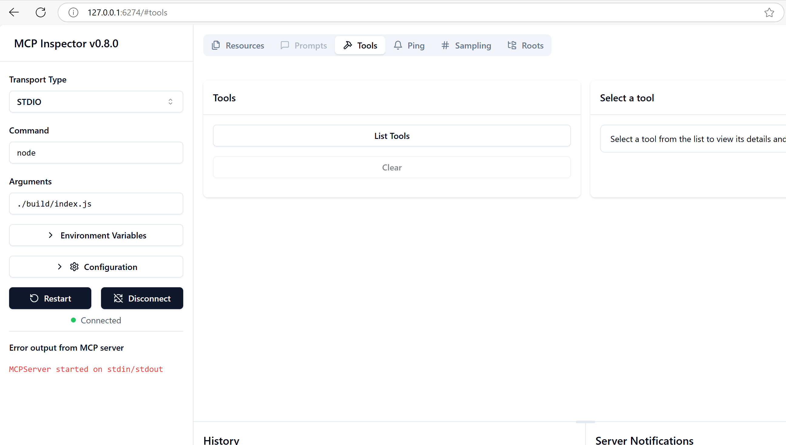
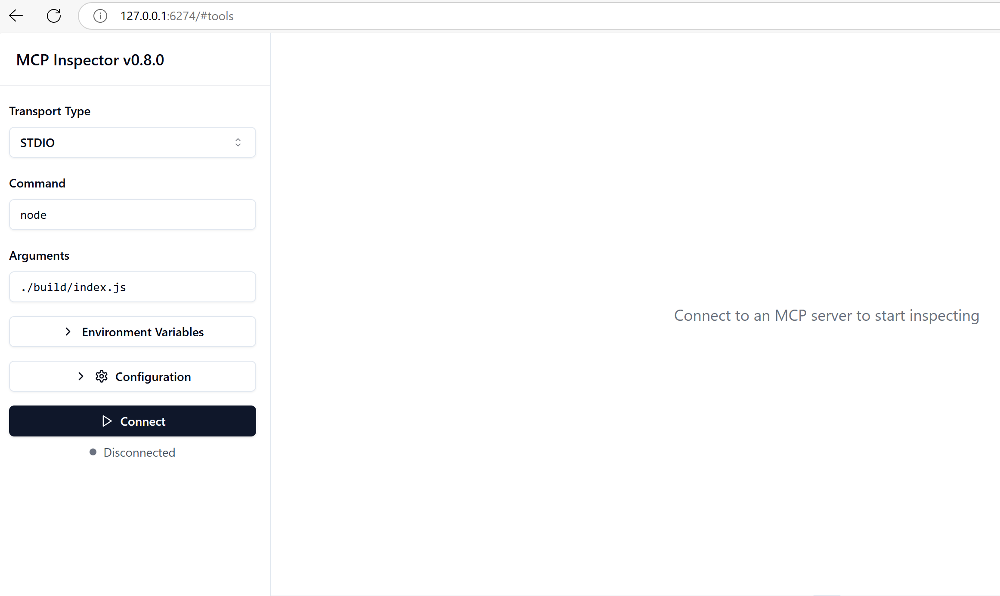
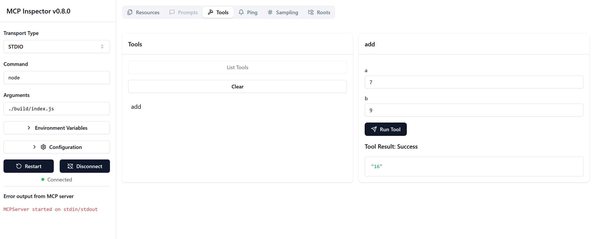

<!--
CO_OP_TRANSLATOR_METADATA:
{
  "original_hash": "ec11ee93f31fdadd94facd3e3d22f9e6",
  "translation_date": "2025-09-09T22:24:23+00:00",
  "source_file": "03-GettingStarted/01-first-server/README.md",
  "language_code": "lt"
}
-->
# Darbo pradžia su MCP

Sveiki atvykę į pirmuosius žingsnius su Model Context Protocol (MCP)! Nesvarbu, ar esate naujokas MCP, ar norite pagilinti savo žinias, šiame vadove rasite esminius nustatymo ir kūrimo proceso žingsnius. Sužinosite, kaip MCP leidžia sklandžiai integruoti AI modelius su programomis, ir išmoksite greitai paruošti aplinką MCP sprendimų kūrimui ir testavimui.

> TLDR; Jei kuriate AI programas, žinote, kad galite pridėti įrankius ir kitus išteklius prie savo LLM (didelių kalbos modelių), kad jie taptų išmanesni. Tačiau, jei tuos įrankius ir išteklius patalpinsite serveryje, programos ir serverio galimybėmis galės naudotis bet kuris klientas su LLM arba be jo.

## Apžvalga

Ši pamoka pateikia praktinius patarimus, kaip nustatyti MCP aplinkas ir sukurti pirmąsias MCP programas. Sužinosite, kaip paruošti reikalingus įrankius ir sistemas, sukurti pagrindinius MCP serverius, kurti host programas ir testuoti savo įgyvendinimus.

Model Context Protocol (MCP) yra atviras protokolas, standartizuojantis, kaip programos teikia kontekstą LLM. Galvokite apie MCP kaip USB-C jungtį AI programoms – jis suteikia standartizuotą būdą prijungti AI modelius prie įvairių duomenų šaltinių ir įrankių.

## Mokymosi tikslai

Šios pamokos pabaigoje galėsite:

- Nustatyti MCP kūrimo aplinkas C#, Java, Python, TypeScript ir Rust kalbomis
- Kurti ir diegti pagrindinius MCP serverius su individualiomis funkcijomis (ištekliais, šablonais ir įrankiais)
- Kurti host programas, kurios jungiasi prie MCP serverių
- Testuoti ir derinti MCP įgyvendinimus

## MCP aplinkos nustatymas

Prieš pradėdami dirbti su MCP, svarbu paruošti savo kūrimo aplinką ir suprasti pagrindinį darbo procesą. Šiame skyriuje rasite pradinius nustatymo žingsnius, kad galėtumėte sklandžiai pradėti dirbti su MCP.

### Reikalavimai

Prieš pradedant MCP kūrimą, įsitikinkite, kad turite:

- **Kūrimo aplinką**: Pasirinkta kalba (C#, Java, Python, TypeScript arba Rust)
- **IDE/Redaktorių**: Visual Studio, Visual Studio Code, IntelliJ, Eclipse, PyCharm arba bet kurį modernų kodų redaktorių
- **Paketų valdytojus**: NuGet, Maven/Gradle, pip, npm/yarn arba Cargo
- **API raktus**: Bet kokioms AI paslaugoms, kurias planuojate naudoti savo host programose

## Pagrindinė MCP serverio struktūra

Tipinis MCP serveris apima:

- **Serverio konfigūraciją**: Prievado, autentifikacijos ir kitų nustatymų konfigūracija
- **Išteklius**: Duomenys ir kontekstas, pateikiami LLM
- **Įrankius**: Funkcionalumas, kurį modeliai gali iškviesti
- **Šablonus**: Teksto generavimo ar struktūrizavimo šablonai

Štai supaprastintas pavyzdys TypeScript kalba:

```typescript
import { McpServer, ResourceTemplate } from "@modelcontextprotocol/sdk/server/mcp.js";
import { StdioServerTransport } from "@modelcontextprotocol/sdk/server/stdio.js";
import { z } from "zod";

// Create an MCP server
const server = new McpServer({
  name: "Demo",
  version: "1.0.0"
});

// Add an addition tool
server.tool("add",
  { a: z.number(), b: z.number() },
  async ({ a, b }) => ({
    content: [{ type: "text", text: String(a + b) }]
  })
);

// Add a dynamic greeting resource
server.resource(
  "file",
  // The 'list' parameter controls how the resource lists available files. Setting it to undefined disables listing for this resource.
  new ResourceTemplate("file://{path}", { list: undefined }),
  async (uri, { path }) => ({
    contents: [{
      uri: uri.href,
      text: `File, ${path}!`
    }]
  })
);

// Add a file resource that reads the file contents
server.resource(
  "file",
  new ResourceTemplate("file://{path}", { list: undefined }),
  async (uri, { path }) => {
    let text;
    try {
      text = await fs.readFile(path, "utf8");
    } catch (err) {
      text = `Error reading file: ${err.message}`;
    }
    return {
      contents: [{
        uri: uri.href,
        text
      }]
    };
  }
);

server.prompt(
  "review-code",
  { code: z.string() },
  ({ code }) => ({
    messages: [{
      role: "user",
      content: {
        type: "text",
        text: `Please review this code:\n\n${code}`
      }
    }]
  })
);

// Start receiving messages on stdin and sending messages on stdout
const transport = new StdioServerTransport();
await server.connect(transport);
```

Šiame kode mes:

- Importuojame reikalingas klases iš MCP TypeScript SDK.
- Sukuriame ir konfigūruojame naują MCP serverio instanciją.
- Registruojame individualų įrankį (`calculator`) su apdorojimo funkcija.
- Paleidžiame serverį, kad jis priimtų MCP užklausas.

## Testavimas ir derinimas

Prieš pradėdami testuoti savo MCP serverį, svarbu suprasti galimus įrankius ir geriausias praktikas derinimui. Efektyvus testavimas užtikrina, kad jūsų serveris veikia kaip tikėtasi, ir padeda greitai identifikuoti bei išspręsti problemas. Šiame skyriuje pateikiami rekomenduojami MCP įgyvendinimo validavimo metodai.

MCP siūlo įrankius, kurie padeda testuoti ir derinti serverius:

- **Inspector įrankis**: Grafinė sąsaja, leidžianti prisijungti prie serverio ir testuoti įrankius, šablonus bei išteklius.
- **curl**: Taip pat galite prisijungti prie serverio naudodami komandinės eilutės įrankį, pvz., curl, arba kitus klientus, kurie gali kurti ir vykdyti HTTP komandas.

### MCP Inspector naudojimas

[MCP Inspector](https://github.com/modelcontextprotocol/inspector) yra vizualinis testavimo įrankis, kuris padeda:

1. **Atrasti serverio galimybes**: Automatiškai aptikti galimus išteklius, įrankius ir šablonus
2. **Testuoti įrankių vykdymą**: Išbandyti skirtingus parametrus ir realiu laiku matyti atsakymus
3. **Peržiūrėti serverio metaduomenis**: Išnagrinėti serverio informaciją, schemas ir konfigūracijas

```bash
# ex TypeScript, installing and running MCP Inspector
npx @modelcontextprotocol/inspector node build/index.js
```

Paleidus aukščiau pateiktas komandas, MCP Inspector atidarys vietinę interneto sąsają jūsų naršyklėje. Galite tikėtis pamatyti prietaisų skydelį, kuriame rodomi registruoti MCP serveriai, jų galimi įrankiai, ištekliai ir šablonai. Sąsaja leidžia interaktyviai testuoti įrankių vykdymą, peržiūrėti serverio metaduomenis ir matyti realaus laiko atsakymus, todėl lengviau validuoti ir derinti MCP serverio įgyvendinimus.

Štai kaip tai gali atrodyti:



## Dažnos nustatymo problemos ir sprendimai

| Problema | Galimas sprendimas |
|----------|--------------------|
| Ryšys atmestas | Patikrinkite, ar serveris veikia ir prievadas yra teisingas |
| Įrankio vykdymo klaidos | Peržiūrėkite parametrų validaciją ir klaidų apdorojimą |
| Autentifikacijos klaidos | Patikrinkite API raktus ir leidimus |
| Schemos validacijos klaidos | Įsitikinkite, kad parametrai atitinka apibrėžtą schemą |
| Serveris neprasideda | Patikrinkite prievadų konfliktus ar trūkstamas priklausomybes |
| CORS klaidos | Konfigūruokite tinkamus CORS antraštes kryžminiams užklausoms |
| Autentifikacijos problemos | Patikrinkite žetono galiojimą ir leidimus |

## Vietinis kūrimas

Vietiniam kūrimui ir testavimui galite paleisti MCP serverius tiesiogiai savo kompiuteryje:

1. **Paleiskite serverio procesą**: Paleiskite savo MCP serverio programą
2. **Konfigūruokite tinklą**: Įsitikinkite, kad serveris pasiekiamas numatytu prievadu
3. **Prisijunkite klientus**: Naudokite vietinius prisijungimo URL, pvz., `http://localhost:3000`

```bash
# Example: Running a TypeScript MCP server locally
npm run start
# Server running at http://localhost:3000
```

## Pirmojo MCP serverio kūrimas

Mes jau aptarėme [Pagrindines sąvokas](/01-CoreConcepts/README.md) ankstesnėje pamokoje, dabar metas pritaikyti šias žinias praktikoje.

### Ką gali serveris

Prieš pradėdami rašyti kodą, prisiminkime, ką gali serveris:

MCP serveris, pavyzdžiui, gali:

- Pasiekti vietinius failus ir duomenų bazes
- Prisijungti prie nuotolinių API
- Atlikti skaičiavimus
- Integruotis su kitais įrankiais ir paslaugomis
- Suteikti vartotojo sąsają sąveikai

Puiku, dabar, kai žinome, ką galime sukurti, pradėkime rašyti kodą.

## Užduotis: Serverio kūrimas

Norėdami sukurti serverį, turite atlikti šiuos veiksmus:

- Įdiegti MCP SDK.
- Sukurti projektą ir nustatyti projekto struktūrą.
- Parašyti serverio kodą.
- Testuoti serverį.

### -1- Projekto kūrimas

#### TypeScript

```sh
# Create project directory and initialize npm project
mkdir calculator-server
cd calculator-server
npm init -y
```

#### Python

```sh
# Create project dir
mkdir calculator-server
cd calculator-server
# Open the folder in Visual Studio Code - Skip this if you are using a different IDE
code .
```

#### .NET

```sh
dotnet new console -n McpCalculatorServer
cd McpCalculatorServer
```

#### Java

Java kalbai sukurkite Spring Boot projektą:

```bash
curl https://start.spring.io/starter.zip \
  -d dependencies=web \
  -d javaVersion=21 \
  -d type=maven-project \
  -d groupId=com.example \
  -d artifactId=calculator-server \
  -d name=McpServer \
  -d packageName=com.microsoft.mcp.sample.server \
  -o calculator-server.zip
```

Išskleiskite zip failą:

```bash
unzip calculator-server.zip -d calculator-server
cd calculator-server
# optional remove the unused test
rm -rf src/test/java
```

Pridėkite šią pilną konfigūraciją į *pom.xml* failą:

```xml
<?xml version="1.0" encoding="UTF-8"?>
<project xmlns="http://maven.apache.org/POM/4.0.0"
    xmlns:xsi="http://www.w3.org/2001/XMLSchema-instance"
    xsi:schemaLocation="http://maven.apache.org/POM/4.0.0 http://maven.apache.org/xsd/maven-4.0.0.xsd">
    <modelVersion>4.0.0</modelVersion>
    
    <!-- Spring Boot parent for dependency management -->
    <parent>
        <groupId>org.springframework.boot</groupId>
        <artifactId>spring-boot-starter-parent</artifactId>
        <version>3.5.0</version>
        <relativePath />
    </parent>

    <!-- Project coordinates -->
    <groupId>com.example</groupId>
    <artifactId>calculator-server</artifactId>
    <version>0.0.1-SNAPSHOT</version>
    <name>Calculator Server</name>
    <description>Basic calculator MCP service for beginners</description>

    <!-- Properties -->
    <properties>
        <java.version>21</java.version>
        <maven.compiler.source>21</maven.compiler.source>
        <maven.compiler.target>21</maven.compiler.target>
    </properties>

    <!-- Spring AI BOM for version management -->
    <dependencyManagement>
        <dependencies>
            <dependency>
                <groupId>org.springframework.ai</groupId>
                <artifactId>spring-ai-bom</artifactId>
                <version>1.0.0-SNAPSHOT</version>
                <type>pom</type>
                <scope>import</scope>
            </dependency>
        </dependencies>
    </dependencyManagement>

    <!-- Dependencies -->
    <dependencies>
        <dependency>
            <groupId>org.springframework.ai</groupId>
            <artifactId>spring-ai-starter-mcp-server-webflux</artifactId>
        </dependency>
        <dependency>
            <groupId>org.springframework.boot</groupId>
            <artifactId>spring-boot-starter-actuator</artifactId>
        </dependency>
        <dependency>
         <groupId>org.springframework.boot</groupId>
         <artifactId>spring-boot-starter-test</artifactId>
         <scope>test</scope>
      </dependency>
    </dependencies>

    <!-- Build configuration -->
    <build>
        <plugins>
            <plugin>
                <groupId>org.springframework.boot</groupId>
                <artifactId>spring-boot-maven-plugin</artifactId>
            </plugin>
            <plugin>
                <groupId>org.apache.maven.plugins</groupId>
                <artifactId>maven-compiler-plugin</artifactId>
                <configuration>
                    <release>21</release>
                </configuration>
            </plugin>
        </plugins>
    </build>

    <!-- Repositories for Spring AI snapshots -->
    <repositories>
        <repository>
            <id>spring-milestones</id>
            <name>Spring Milestones</name>
            <url>https://repo.spring.io/milestone</url>
            <snapshots>
                <enabled>false</enabled>
            </snapshots>
        </repository>
        <repository>
            <id>spring-snapshots</id>
            <name>Spring Snapshots</name>
            <url>https://repo.spring.io/snapshot</url>
            <releases>
                <enabled>false</enabled>
            </releases>
        </repository>
    </repositories>
</project>
```

#### Rust

```sh
mkdir calculator-server
cd calculator-server
cargo init
```

### -2- Priklausomybių pridėjimas

Dabar, kai sukūrėte projektą, pridėkime priklausomybes:

#### TypeScript

```sh
# If not already installed, install TypeScript globally
npm install typescript -g

# Install the MCP SDK and Zod for schema validation
npm install @modelcontextprotocol/sdk zod
npm install -D @types/node typescript
```

#### Python

```sh
# Create a virtual env and install dependencies
python -m venv venv
venv\Scripts\activate
pip install "mcp[cli]"
```

#### Java

```bash
cd calculator-server
./mvnw clean install -DskipTests
```

#### Rust

```sh
cargo add rmcp --features server,transport-io
cargo add serde
cargo add tokio --features rt-multi-thread
```

### -3- Projekto failų kūrimas

#### TypeScript

Atidarykite *package.json* failą ir pakeiskite turinį šiuo, kad užtikrintumėte, jog galite sukurti ir paleisti serverį:

```json
{
  "name": "calculator-server",
  "version": "1.0.0",
  "main": "index.js",
  "type": "module",
  "scripts": {
    "start": "tsc && node ./build/index.js",
    "build": "tsc && node ./build/index.js"
  },
  "keywords": [],
  "author": "",
  "license": "ISC",
  "description": "A simple calculator server using Model Context Protocol",
  "dependencies": {
    "@modelcontextprotocol/sdk": "^1.16.0",
    "zod": "^3.25.76"
  },
  "devDependencies": {
    "@types/node": "^24.0.14",
    "typescript": "^5.8.3"
  }
}
```

Sukurkite *tsconfig.json* su šiuo turiniu:

```json
{
  "compilerOptions": {
    "target": "ES2022",
    "module": "Node16",
    "moduleResolution": "Node16",
    "outDir": "./build",
    "rootDir": "./src",
    "strict": true,
    "esModuleInterop": true,
    "skipLibCheck": true,
    "forceConsistentCasingInFileNames": true
  },
  "include": ["src/**/*"],
  "exclude": ["node_modules"]
}
```

Sukurkite katalogą savo šaltinio kodui:

```sh
mkdir src
touch src/index.ts
```

#### Python

Sukurkite failą *server.py*

```sh
touch server.py
```

#### .NET

Įdiekite reikalingus NuGet paketus:

```sh
dotnet add package ModelContextProtocol --prerelease
dotnet add package Microsoft.Extensions.Hosting
```

#### Java

Java Spring Boot projektams projekto struktūra sukuriama automatiškai.

#### Rust

Rust kalbai *src/main.rs* failas sukuriamas automatiškai, kai paleidžiate `cargo init`. Atidarykite failą ir ištrinkite numatytąjį kodą.

### -4- Serverio kodo kūrimas

#### TypeScript

Sukurkite failą *index.ts* ir pridėkite šį kodą:

```typescript
import { McpServer, ResourceTemplate } from "@modelcontextprotocol/sdk/server/mcp.js";
import { StdioServerTransport } from "@modelcontextprotocol/sdk/server/stdio.js";
import { z } from "zod";
 
// Create an MCP server
const server = new McpServer({
  name: "Calculator MCP Server",
  version: "1.0.0"
});
```

Dabar turite serverį, bet jis dar nedaug ką daro. Pataisykime tai.

#### Python

```python
# server.py
from mcp.server.fastmcp import FastMCP

# Create an MCP server
mcp = FastMCP("Demo")
```

#### .NET

```csharp
using Microsoft.Extensions.DependencyInjection;
using Microsoft.Extensions.Hosting;
using Microsoft.Extensions.Logging;
using ModelContextProtocol.Server;
using System.ComponentModel;

var builder = Host.CreateApplicationBuilder(args);
builder.Logging.AddConsole(consoleLogOptions =>
{
    // Configure all logs to go to stderr
    consoleLogOptions.LogToStandardErrorThreshold = LogLevel.Trace;
});

builder.Services
    .AddMcpServer()
    .WithStdioServerTransport()
    .WithToolsFromAssembly();
await builder.Build().RunAsync();

// add features
```

#### Java

Java kalbai sukurkite pagrindinius serverio komponentus. Pirmiausia, pakeiskite pagrindinę programos klasę:

*src/main/java/com/microsoft/mcp/sample/server/McpServerApplication.java*:

```java
package com.microsoft.mcp.sample.server;

import org.springframework.ai.tool.ToolCallbackProvider;
import org.springframework.ai.tool.method.MethodToolCallbackProvider;
import org.springframework.boot.SpringApplication;
import org.springframework.boot.autoconfigure.SpringBootApplication;
import org.springframework.context.annotation.Bean;
import com.microsoft.mcp.sample.server.service.CalculatorService;

@SpringBootApplication
public class McpServerApplication {

    public static void main(String[] args) {
        SpringApplication.run(McpServerApplication.class, args);
    }
    
    @Bean
    public ToolCallbackProvider calculatorTools(CalculatorService calculator) {
        return MethodToolCallbackProvider.builder().toolObjects(calculator).build();
    }
}
```

Sukurkite skaičiuoklės paslaugą *src/main/java/com/microsoft/mcp/sample/server/service/CalculatorService.java*:

```java
package com.microsoft.mcp.sample.server.service;

import org.springframework.ai.tool.annotation.Tool;
import org.springframework.stereotype.Service;

/**
 * Service for basic calculator operations.
 * This service provides simple calculator functionality through MCP.
 */
@Service
public class CalculatorService {

    /**
     * Add two numbers
     * @param a The first number
     * @param b The second number
     * @return The sum of the two numbers
     */
    @Tool(description = "Add two numbers together")
    public String add(double a, double b) {
        double result = a + b;
        return formatResult(a, "+", b, result);
    }

    /**
     * Subtract one number from another
     * @param a The number to subtract from
     * @param b The number to subtract
     * @return The result of the subtraction
     */
    @Tool(description = "Subtract the second number from the first number")
    public String subtract(double a, double b) {
        double result = a - b;
        return formatResult(a, "-", b, result);
    }

    /**
     * Multiply two numbers
     * @param a The first number
     * @param b The second number
     * @return The product of the two numbers
     */
    @Tool(description = "Multiply two numbers together")
    public String multiply(double a, double b) {
        double result = a * b;
        return formatResult(a, "*", b, result);
    }

    /**
     * Divide one number by another
     * @param a The numerator
     * @param b The denominator
     * @return The result of the division
     */
    @Tool(description = "Divide the first number by the second number")
    public String divide(double a, double b) {
        if (b == 0) {
            return "Error: Cannot divide by zero";
        }
        double result = a / b;
        return formatResult(a, "/", b, result);
    }

    /**
     * Calculate the power of a number
     * @param base The base number
     * @param exponent The exponent
     * @return The result of raising the base to the exponent
     */
    @Tool(description = "Calculate the power of a number (base raised to an exponent)")
    public String power(double base, double exponent) {
        double result = Math.pow(base, exponent);
        return formatResult(base, "^", exponent, result);
    }

    /**
     * Calculate the square root of a number
     * @param number The number to find the square root of
     * @return The square root of the number
     */
    @Tool(description = "Calculate the square root of a number")
    public String squareRoot(double number) {
        if (number < 0) {
            return "Error: Cannot calculate square root of a negative number";
        }
        double result = Math.sqrt(number);
        return String.format("√%.2f = %.2f", number, result);
    }

    /**
     * Calculate the modulus (remainder) of division
     * @param a The dividend
     * @param b The divisor
     * @return The remainder of the division
     */
    @Tool(description = "Calculate the remainder when one number is divided by another")
    public String modulus(double a, double b) {
        if (b == 0) {
            return "Error: Cannot divide by zero";
        }
        double result = a % b;
        return formatResult(a, "%", b, result);
    }

    /**
     * Calculate the absolute value of a number
     * @param number The number to find the absolute value of
     * @return The absolute value of the number
     */
    @Tool(description = "Calculate the absolute value of a number")
    public String absolute(double number) {
        double result = Math.abs(number);
        return String.format("|%.2f| = %.2f", number, result);
    }

    /**
     * Get help about available calculator operations
     * @return Information about available operations
     */
    @Tool(description = "Get help about available calculator operations")
    public String help() {
        return "Basic Calculator MCP Service\n\n" +
               "Available operations:\n" +
               "1. add(a, b) - Adds two numbers\n" +
               "2. subtract(a, b) - Subtracts the second number from the first\n" +
               "3. multiply(a, b) - Multiplies two numbers\n" +
               "4. divide(a, b) - Divides the first number by the second\n" +
               "5. power(base, exponent) - Raises a number to a power\n" +
               "6. squareRoot(number) - Calculates the square root\n" + 
               "7. modulus(a, b) - Calculates the remainder of division\n" +
               "8. absolute(number) - Calculates the absolute value\n\n" +
               "Example usage: add(5, 3) will return 5 + 3 = 8";
    }

    /**
     * Format the result of a calculation
     */
    private String formatResult(double a, String operator, double b, double result) {
        return String.format("%.2f %s %.2f = %.2f", a, operator, b, result);
    }
}
```

**Pasirinktiniai komponentai gamybai paruoštai paslaugai:**

Sukurkite paleidimo konfigūraciją *src/main/java/com/microsoft/mcp/sample/server/config/StartupConfig.java*:

```java
package com.microsoft.mcp.sample.server.config;

import org.springframework.boot.CommandLineRunner;
import org.springframework.context.annotation.Bean;
import org.springframework.context.annotation.Configuration;

@Configuration
public class StartupConfig {
    
    @Bean
    public CommandLineRunner startupInfo() {
        return args -> {
            System.out.println("\n" + "=".repeat(60));
            System.out.println("Calculator MCP Server is starting...");
            System.out.println("SSE endpoint: http://localhost:8080/sse");
            System.out.println("Health check: http://localhost:8080/actuator/health");
            System.out.println("=".repeat(60) + "\n");
        };
    }
}
```

Sukurkite sveikatos kontrolerį *src/main/java/com/microsoft/mcp/sample/server/controller/HealthController.java*:

```java
package com.microsoft.mcp.sample.server.controller;

import org.springframework.http.ResponseEntity;
import org.springframework.web.bind.annotation.GetMapping;
import org.springframework.web.bind.annotation.RestController;
import java.time.LocalDateTime;
import java.util.HashMap;
import java.util.Map;

@RestController
public class HealthController {
    
    @GetMapping("/health")
    public ResponseEntity<Map<String, Object>> healthCheck() {
        Map<String, Object> response = new HashMap<>();
        response.put("status", "UP");
        response.put("timestamp", LocalDateTime.now().toString());
        response.put("service", "Calculator MCP Server");
        return ResponseEntity.ok(response);
    }
}
```

Sukurkite klaidų apdorojimo mechanizmą *src/main/java/com/microsoft/mcp/sample/server/exception/GlobalExceptionHandler.java*:

```java
package com.microsoft.mcp.sample.server.exception;

import org.springframework.http.HttpStatus;
import org.springframework.http.ResponseEntity;
import org.springframework.web.bind.annotation.ExceptionHandler;
import org.springframework.web.bind.annotation.RestControllerAdvice;

@RestControllerAdvice
public class GlobalExceptionHandler {

    @ExceptionHandler(IllegalArgumentException.class)
    public ResponseEntity<ErrorResponse> handleIllegalArgumentException(IllegalArgumentException ex) {
        ErrorResponse error = new ErrorResponse(
            "Invalid_Input", 
            "Invalid input parameter: " + ex.getMessage());
        return new ResponseEntity<>(error, HttpStatus.BAD_REQUEST);
    }

    public static class ErrorResponse {
        private String code;
        private String message;

        public ErrorResponse(String code, String message) {
            this.code = code;
            this.message = message;
        }

        // Getters
        public String getCode() { return code; }
        public String getMessage() { return message; }
    }
}
```

Sukurkite individualų banerį *src/main/resources/banner.txt*:

```text
_____      _            _       _             
 / ____|    | |          | |     | |            
| |     __ _| | ___ _   _| | __ _| |_ ___  _ __ 
| |    / _` | |/ __| | | | |/ _` | __/ _ \| '__|
| |___| (_| | | (__| |_| | | (_| | || (_) | |   
 \_____\__,_|_|\___|\__,_|_|\__,_|\__\___/|_|   
                                                
Calculator MCP Server v1.0
Spring Boot MCP Application
```

#### Rust

Pridėkite šį kodą į *src/main.rs* failo viršų. Tai importuoja reikalingas bibliotekas ir modulius jūsų MCP serveriui.

```rust
use rmcp::{
    handler::server::{router::tool::ToolRouter, tool::Parameters},
    model::{ServerCapabilities, ServerInfo},
    schemars, tool, tool_handler, tool_router,
    transport::stdio,
    ServerHandler, ServiceExt,
};
use std::error::Error;
```

Skaičiuoklės serveris bus paprastas, galintis sudėti du skaičius. Sukurkime struktūrą, reprezentuojančią skaičiuoklės užklausą.

```rust
#[derive(Debug, serde::Deserialize, schemars::JsonSchema)]
pub struct CalculatorRequest {
    pub a: f64,
    pub b: f64,
}
```

Toliau sukurkite struktūrą, reprezentuojančią skaičiuoklės serverį. Ši struktūra laikys įrankių maršrutizatorių, kuris naudojamas įrankiams registruoti.

```rust
#[derive(Debug, Clone)]
pub struct Calculator {
    tool_router: ToolRouter<Self>,
}
```

Dabar galime įgyvendinti `Calculator` struktūrą, kad sukurtume naują serverio instanciją ir įgyvendintume serverio apdorojimą, kad pateiktume serverio informaciją.

```rust
#[tool_router]
impl Calculator {
    pub fn new() -> Self {
        Self {
            tool_router: Self::tool_router(),
        }
    }
}

#[tool_handler]
impl ServerHandler for Calculator {
    fn get_info(&self) -> ServerInfo {
        ServerInfo {
            instructions: Some("A simple calculator tool".into()),
            capabilities: ServerCapabilities::builder().enable_tools().build(),
            ..Default::default()
        }
    }
}
```

Galiausiai, reikia įgyvendinti pagrindinę funkciją, kad paleistume serverį. Ši funkcija sukurs `Calculator` struktūros instanciją ir aptarnaus ją per standartinį įvestį/išvestį.

```rust
#[tokio::main]
async fn main() -> Result<(), Box<dyn Error>> {
    let service = Calculator::new().serve(stdio()).await?;
    service.waiting().await?;
    Ok(())
}
```

Serveris dabar paruoštas pateikti pagrindinę informaciją apie save. Toliau pridėsime įrankį, kuris atliks sudėjimą.

### -5- Įrankio ir ištekliaus pridėjimas

Pridėkite įrankį ir išteklį, pridėdami šį kodą:

#### TypeScript

```typescript
server.tool(
  "add",
  { a: z.number(), b: z.number() },
  async ({ a, b }) => ({
    content: [{ type: "text", text: String(a + b) }]
  })
);

server.resource(
  "greeting",
  new ResourceTemplate("greeting://{name}", { list: undefined }),
  async (uri, { name }) => ({
    contents: [{
      uri: uri.href,
      text: `Hello, ${name}!`
    }]
  })
);
```

Jūsų įrankis priima parametrus `a` ir `b` ir vykdo funkciją, kuri pateikia atsakymą tokia forma:

```typescript
{
  contents: [{
    type: "text", content: "some content"
  }]
}
```

Jūsų išteklius pasiekiamas per eilutę "greeting" ir priima parametrą `name`, pateikdamas panašų atsakymą kaip įrankis:

```typescript
{
  uri: "<href>",
  text: "a text"
}
```

#### Python

```python
# Add an addition tool
@mcp.tool()
def add(a: int, b: int) -> int:
    """Add two numbers"""
    return a + b


# Add a dynamic greeting resource
@mcp.resource("greeting://{name}")
def get_greeting(name: str) -> str:
    """Get a personalized greeting"""
    return f"Hello, {name}!"
```

Šiame kode mes:

- Apibrėžėme įrankį `add`, kuris priima parametrus `a` ir `p`, abu sveikuosius skaičius.
- Sukūrėme išteklių, pavadintą `greeting`, kuris priima parametrą `name`.

#### .NET

Pridėkite tai į savo Program.cs failą:

```csharp
[McpServerToolType]
public static class CalculatorTool
{
    [McpServerTool, Description("Adds two numbers")]
    public static string Add(int a, int b) => $"Sum {a + b}";
}
```

#### Java

Įrankiai jau buvo sukurti ankstesniame žingsnyje.

#### Rust

Pridėkite naują įrankį `impl Calculator` bloke:

```rust
#[tool(description = "Adds a and b")]
async fn add(
    &self,
    Parameters(CalculatorRequest { a, b }): Parameters<CalculatorRequest>,
) -> String {
    (a + b).to_string()
}
```

### -6- Galutinis kodas

Pridėkime paskutinį kodą, kad serveris galėtų pradėti veikti:

#### TypeScript

```typescript
// Start receiving messages on stdin and sending messages on stdout
const transport = new StdioServerTransport();
await server.connect(transport);
```

Štai visas kodas:

```typescript
// index.ts
import { McpServer, ResourceTemplate } from "@modelcontextprotocol/sdk/server/mcp.js";
import { StdioServerTransport } from "@modelcontextprotocol/sdk/server/stdio.js";
import { z } from "zod";

// Create an MCP server
const server = new McpServer({
  name: "Calculator MCP Server",
  version: "1.0.0"
});

// Add an addition tool
server.tool(
  "add",
  { a: z.number(), b: z.number() },
  async ({ a, b }) => ({
    content: [{ type: "text", text: String(a + b) }]
  })
);

// Add a dynamic greeting resource
server.resource(
  "greeting",
  new ResourceTemplate("greeting://{name}", { list: undefined }),
  async (uri, { name }) => ({
    contents: [{
      uri: uri.href,
      text: `Hello, ${name}!`
    }]
  })
);

// Start receiving messages on stdin and sending messages on stdout
const transport = new StdioServerTransport();
server.connect(transport);
```

#### Python

```python
# server.py
from mcp.server.fastmcp import FastMCP

# Create an MCP server
mcp = FastMCP("Demo")


# Add an addition tool
@mcp.tool()
def add(a: int, b: int) -> int:
    """Add two numbers"""
    return a + b


# Add a dynamic greeting resource
@mcp.resource("greeting://{name}")
def get_greeting(name: str) -> str:
    """Get a personalized greeting"""
    return f"Hello, {name}!"

# Main execution block - this is required to run the server
if __name__ == "__main__":
    mcp.run()
```

#### .NET

Sukurkite Program.cs failą su šiuo turiniu:

```csharp
using Microsoft.Extensions.DependencyInjection;
using Microsoft.Extensions.Hosting;
using Microsoft.Extensions.Logging;
using ModelContextProtocol.Server;
using System.ComponentModel;

var builder = Host.CreateApplicationBuilder(args);
builder.Logging.AddConsole(consoleLogOptions =>
{
    // Configure all logs to go to stderr
    consoleLogOptions.LogToStandardErrorThreshold = LogLevel.Trace;
});

builder.Services
    .AddMcpServer()
    .WithStdioServerTransport()
    .WithToolsFromAssembly();
await builder.Build().RunAsync();

[McpServerToolType]
public static class CalculatorTool
{
    [McpServerTool, Description("Adds two numbers")]
    public static string Add(int a, int b) => $"Sum {a + b}";
}
```

#### Java

Jūsų pilna pagrindinė programos klasė turėtų atrodyti taip:

```java
// McpServerApplication.java
package com.microsoft.mcp.sample.server;

import org.springframework.ai.tool.ToolCallbackProvider;
import org.springframework.ai.tool.method.MethodToolCallbackProvider;
import org.springframework.boot.SpringApplication;
import org.springframework.boot.autoconfigure.SpringBootApplication;
import org.springframework.context.annotation.Bean;
import com.microsoft.mcp.sample.server.service.CalculatorService;

@SpringBootApplication
public class McpServerApplication {

    public static void main(String[] args) {
        SpringApplication.run(McpServerApplication.class, args);
    }
    
    @Bean
    public ToolCallbackProvider calculatorTools(CalculatorService calculator) {
        return MethodToolCallbackProvider.builder().toolObjects(calculator).build();
    }
}
```

#### Rust

Galutinis Rust serverio kodas turėtų atrodyti taip:

```rust
use rmcp::{
    ServerHandler, ServiceExt,
    handler::server::{router::tool::ToolRouter, tool::Parameters},
    model::{ServerCapabilities, ServerInfo},
    schemars, tool, tool_handler, tool_router,
    transport::stdio,
};
use std::error::Error;

#[derive(Debug, serde::Deserialize, schemars::JsonSchema)]
pub struct CalculatorRequest {
    pub a: f64,
    pub b: f64,
}

#[derive(Debug, Clone)]
pub struct Calculator {
    tool_router: ToolRouter<Self>,
}

#[tool_router]
impl Calculator {
    pub fn new() -> Self {
        Self {
            tool_router: Self::tool_router(),
        }
    }
    
    #[tool(description = "Adds a and b")]
    async fn add(
        &self,
        Parameters(CalculatorRequest { a, b }): Parameters<CalculatorRequest>,
    ) -> String {
        (a + b).to_string()
    }
}

#[tool_handler]
impl ServerHandler for Calculator {
    fn get_info(&self) -> ServerInfo {
        ServerInfo {
            instructions: Some("A simple calculator tool".into()),
            capabilities: ServerCapabilities::builder().enable_tools().build(),
            ..Default::default()
        }
    }
}

#[tokio::main]
async fn main() -> Result<(), Box<dyn Error>> {
    let service = Calculator::new().serve(stdio()).await?;
    service.waiting().await?;
    Ok(())
}
```

### -7- Serverio testavimas

Paleiskite serverį naudodami šią komandą:

#### TypeScript

```sh
npm run build
```

#### Python

```sh
mcp run server.py
```

> Naudojant MCP Inspector, naudokite `mcp dev server.py`, kuris automatiškai paleidžia Inspector ir pateikia reikiamą proxy sesijos žetoną. Jei naudojate `mcp run server.py`, turėsite rankiniu būdu paleisti Inspector ir konfigūruoti prisijungimą.

#### .NET

Įsitikinkite, kad esate savo projekto kataloge:

```sh
cd McpCalculatorServer
dotnet run
```

#### Java

```bash
./mvnw clean install -DskipTests
java -jar target/calculator-server-0.0.1-SNAPSHOT.jar
```

#### Rust

Paleiskite šias komandas, kad suformatuotumėte ir paleistumėte serverį:

```sh
cargo fmt
cargo run
```

### -8- Paleidimas naudojant Inspector

Inspector yra puikus įrankis, kuris gali paleisti jūsų serverį ir leidžia sąveikauti su juo, kad galėtumėte patikrinti, ar jis veikia. Paleiskime jį:

> [!NOTE]
> Komandos lauke gali atrodyti kitaip, nes jame yra komanda serverio paleidimui su jūsų konkrečiu vykdymo laiku.

#### TypeScript

```sh
npx @modelcontextprotocol/inspector node build/index.js
```

arba pridėkite tai į savo *package.json* kaip: `"inspector": "npx @modelcontextprotocol/inspector node build/index.js"` ir tada paleiskite `npm run inspector`

Python apgaubia Node.js įrankį, vadinamą inspector. Galima iškviesti šį įrankį taip:

```sh
mcp dev server.py
```

Tačiau jis neįgyvendina visų galimų metodų, todėl rekomenduojama paleisti Node.js įrankį tiesiogiai, kaip nurodyta žemiau:

```sh
npx @modelcontextprotocol/inspector mcp run server.py
```

Jei naudojate įrankį ar IDE, kuris leidžia konfigūruoti komandas ir argumentus skriptų paleidimui, 
įsitikinkite, kad nustatėte `python` kaip `Command` lauką ir `server.py` kaip `Arguments`. Tai užtikrina, kad skriptas veiks teisingai.

#### .NET

Įsitikinkite, kad esate savo projekto kataloge:

```sh
cd McpCalculatorServer
npx @modelcontextprotocol/inspector dotnet run
```

#### Java

Įsitikinkite,


**Dabar esate prisijungę prie serverio**  
**Java serverio testavimo skyrius baigtas**

Kitas skyrius skirtas sąveikai su serveriu.

Turėtumėte matyti šią vartotojo sąsają:



1. Prisijunkite prie serverio pasirinkdami mygtuką „Prisijungti“.  
   Kai prisijungsite prie serverio, turėtumėte matyti šį vaizdą:

   

2. Pasirinkite „Įrankiai“ ir „listTools“, turėtumėte matyti „Pridėti“. Pasirinkite „Pridėti“ ir užpildykite parametrų reikšmes.

   Turėtumėte matyti šį atsakymą, t. y. rezultatą iš „add“ įrankio:

   

Sveikiname, jums pavyko sukurti ir paleisti pirmąjį serverį!

#### Rust

Norėdami paleisti Rust serverį su MCP Inspector CLI, naudokite šią komandą:

```sh
npx @modelcontextprotocol/inspector cargo run --cli --method tools/call --tool-name add --tool-arg a=1 b=2
```

### Oficialūs SDK

MCP siūlo oficialius SDK kelioms programavimo kalboms:

- [C# SDK](https://github.com/modelcontextprotocol/csharp-sdk) - Palaikomas bendradarbiaujant su Microsoft
- [Java SDK](https://github.com/modelcontextprotocol/java-sdk) - Palaikomas bendradarbiaujant su Spring AI
- [TypeScript SDK](https://github.com/modelcontextprotocol/typescript-sdk) - Oficialus TypeScript įgyvendinimas
- [Python SDK](https://github.com/modelcontextprotocol/python-sdk) - Oficialus Python įgyvendinimas
- [Kotlin SDK](https://github.com/modelcontextprotocol/kotlin-sdk) - Oficialus Kotlin įgyvendinimas
- [Swift SDK](https://github.com/modelcontextprotocol/swift-sdk) - Palaikomas bendradarbiaujant su Loopwork AI
- [Rust SDK](https://github.com/modelcontextprotocol/rust-sdk) - Oficialus Rust įgyvendinimas

## Pagrindinės mintys

- MCP kūrimo aplinką galima lengvai nustatyti naudojant kalbai specifinius SDK.
- MCP serverių kūrimas apima įrankių kūrimą ir registravimą su aiškiais schemomis.
- Testavimas ir derinimas yra būtini patikimam MCP įgyvendinimui.

## Pavyzdžiai

- [Java Skaičiuotuvas](../samples/java/calculator/README.md)  
- [.Net Skaičiuotuvas](../../../../03-GettingStarted/samples/csharp)  
- [JavaScript Skaičiuotuvas](../samples/javascript/README.md)  
- [TypeScript Skaičiuotuvas](../samples/typescript/README.md)  
- [Python Skaičiuotuvas](../../../../03-GettingStarted/samples/python)  
- [Rust Skaičiuotuvas](../../../../03-GettingStarted/samples/rust)

## Užduotis

Sukurkite paprastą MCP serverį su pasirinktu įrankiu:

1. Įgyvendinkite įrankį savo pasirinkta kalba (.NET, Java, Python, TypeScript arba Rust).  
2. Apibrėžkite įvesties parametrus ir grąžinimo reikšmes.  
3. Paleiskite inspektoriaus įrankį, kad įsitikintumėte, jog serveris veikia tinkamai.  
4. Išbandykite įgyvendinimą su įvairiais įvesties duomenimis.

## Sprendimas

[Sprendimas](./solution/README.md)

## Papildomi ištekliai

- [Agentų kūrimas naudojant Model Context Protocol Azure platformoje](https://learn.microsoft.com/azure/developer/ai/intro-agents-mcp)  
- [Nuotolinis MCP su Azure Container Apps (Node.js/TypeScript/JavaScript)](https://learn.microsoft.com/samples/azure-samples/mcp-container-ts/mcp-container-ts/)  
- [.NET OpenAI MCP Agentas](https://learn.microsoft.com/samples/azure-samples/openai-mcp-agent-dotnet/openai-mcp-agent-dotnet/)

## Kas toliau

Toliau: [Darbas su MCP klientais](../02-client/README.md)

---

**Atsakomybės apribojimas**:  
Šis dokumentas buvo išverstas naudojant AI vertimo paslaugą [Co-op Translator](https://github.com/Azure/co-op-translator). Nors siekiame tikslumo, prašome atkreipti dėmesį, kad automatiniai vertimai gali turėti klaidų ar netikslumų. Originalus dokumentas jo gimtąja kalba turėtų būti laikomas autoritetingu šaltiniu. Dėl svarbios informacijos rekomenduojama profesionali žmogaus vertimo paslauga. Mes neprisiimame atsakomybės už nesusipratimus ar klaidingus interpretavimus, atsiradusius naudojant šį vertimą.