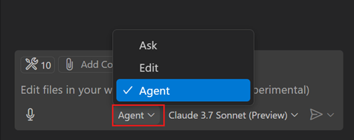
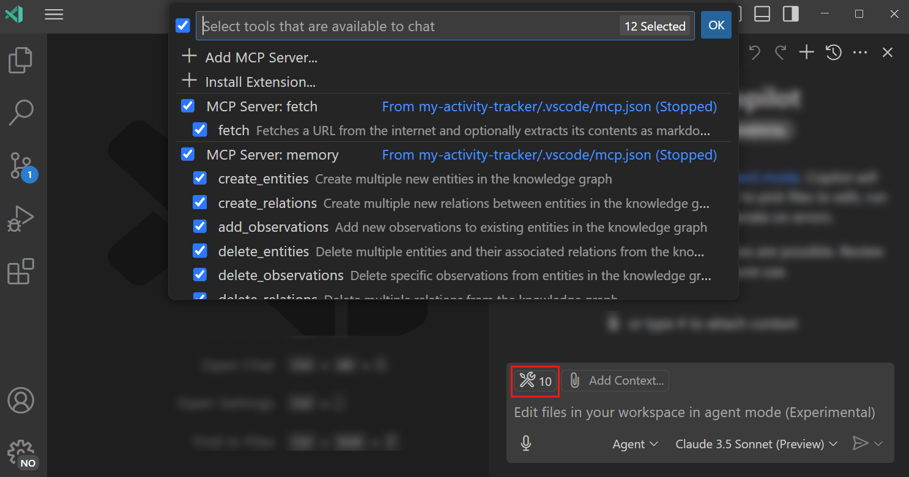
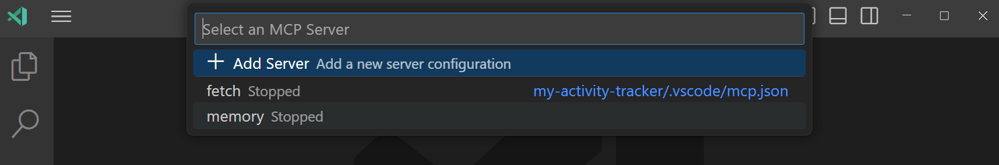
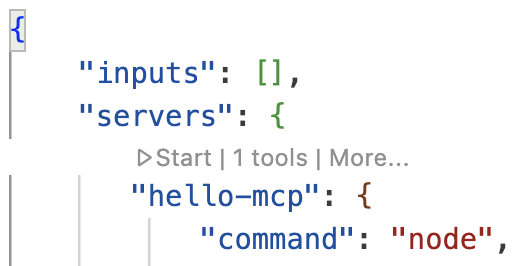
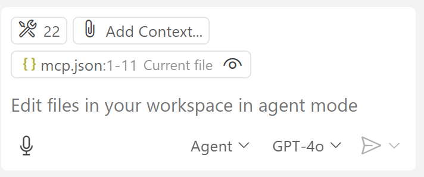

<!--
CO_OP_TRANSLATOR_METADATA:
{
  "original_hash": "d940b5e0af75e3a3a4d1c3179120d1d9",
  "translation_date": "2025-08-26T20:38:46+00:00",
  "source_file": "03-GettingStarted/04-vscode/README.md",
  "language_code": "lt"
}
-->
# Naudojimasis serveriu iš GitHub Copilot Agent režimo

Visual Studio Code ir GitHub Copilot gali veikti kaip klientas ir naudoti MCP serverį. Kodėl tai gali būti naudinga? Na, tai reiškia, kad visos MCP serverio funkcijos dabar gali būti pasiekiamos tiesiai iš jūsų IDE. Įsivaizduokite, kad pridėjote, pavyzdžiui, GitHub MCP serverį – tai leistų valdyti GitHub naudojant užklausas, o ne rašant konkrečias komandas terminale. Arba įsivaizduokite bet kokį kitą įrankį, kuris galėtų pagerinti jūsų kūrėjo patirtį, valdomą natūralia kalba. Dabar jau pradedate matyti privalumus, tiesa?

## Apžvalga

Ši pamoka apima, kaip naudoti Visual Studio Code ir GitHub Copilot Agent režimą kaip klientą jūsų MCP serveriui.

## Mokymosi tikslai

Šios pamokos pabaigoje jūs galėsite:

- Naudoti MCP serverį per Visual Studio Code.
- Paleisti funkcijas, tokias kaip įrankiai, per GitHub Copilot.
- Suprasti, kaip sukonfigūruoti Visual Studio Code, kad rastumėte ir valdytumėte savo MCP serverį.

## Naudojimas

Savo MCP serverį galite valdyti dviem būdais:

- Naudojant vartotojo sąsają – kaip tai padaryti, pamatysite vėliau šiame skyriuje.
- Terminale – galima valdyti dalykus iš terminalo naudojant `code` vykdomąjį failą:

  Norėdami pridėti MCP serverį prie savo vartotojo profilio, naudokite komandų eilutės parinktį --add-mcp ir pateikite JSON serverio konfigūraciją formatu {\"name\":\"server-name\",\"command\":...}.

  ```
  code --add-mcp "{\"name\":\"my-server\",\"command\": \"uvx\",\"args\": [\"mcp-server-fetch\"]}"
  ```

### Ekrano nuotraukos





Apie tai, kaip naudoti vizualinę sąsają, kalbėsime kitose dalyse.

## Požiūris

Štai kaip turime prieiti prie šio proceso aukštu lygiu:

- Sukonfigūruoti failą, kad rastume savo MCP serverį.
- Paleisti/prisijungti prie serverio, kad jis išvardintų savo galimybes.
- Naudoti šias galimybes per GitHub Copilot pokalbių sąsają.

Puiku, dabar, kai suprantame procesą, pabandykime naudoti MCP serverį per Visual Studio Code atlikdami pratimą.

## Pratimas: Naudojimasis serveriu

Šiame pratime sukonfigūruosime Visual Studio Code, kad rastume jūsų MCP serverį ir galėtume jį naudoti per GitHub Copilot pokalbių sąsają.

### -0- Paruošiamasis žingsnis: įgalinkite MCP serverio aptikimą

Gali reikėti įjungti MCP serverių aptikimą.

1. Eikite į `File -> Preferences -> Settings` Visual Studio Code.

1. Ieškokite „MCP“ ir įjunkite `chat.mcp.discovery.enabled` nustatymuose.json faile.

### -1- Sukurkite konfigūracijos failą

Pradėkite kurdami konfigūracijos failą savo projekto šaknyje. Jums reikės failo pavadinimu MCP.json, kurį turėsite įdėti į aplanką .vscode. Jis turėtų atrodyti taip:

```text
.vscode
|-- mcp.json
```

Toliau pažiūrėkime, kaip pridėti serverio įrašą.

### -2- Sujunkite serverį

Pridėkite šį turinį į *mcp.json*:

```json
{
    "inputs": [],
    "servers": {
       "hello-mcp": {
           "command": "node",
           "args": [
               "build/index.js"
           ]
       }
    }
}
```

Aukščiau pateiktas paprastas pavyzdys, kaip paleisti serverį, parašytą Node.js. Kitoms aplinkoms nurodykite tinkamą komandą serveriui paleisti naudojant `command` ir `args`.

### -3- Paleiskite serverį

Dabar, kai pridėjote įrašą, paleiskime serverį:

1. Suraskite savo įrašą *mcp.json* faile ir įsitikinkite, kad matote „play“ piktogramą:

    

1. Spustelėkite „play“ piktogramą. Turėtumėte matyti, kad GitHub Copilot pokalbių įrankių piktograma padidino galimų įrankių skaičių. Jei spustelėsite šią įrankių piktogramą, pamatysite registruotų įrankių sąrašą. Galite pažymėti/nuimti kiekvieną įrankį, priklausomai nuo to, ar norite, kad GitHub Copilot juos naudotų kaip kontekstą:

  

1. Norėdami paleisti įrankį, įveskite užklausą, kuri atitinka vieno iš jūsų įrankių aprašymą, pavyzdžiui, užklausą „pridėk 22 prie 1“:

  

  Turėtumėte matyti atsakymą „23“.

## Užduotis

Pabandykite pridėti serverio įrašą į savo *mcp.json* failą ir įsitikinkite, kad galite paleisti/sustabdyti serverį. Taip pat įsitikinkite, kad galite bendrauti su serverio įrankiais per GitHub Copilot pokalbių sąsają.

## Sprendimas

[Sprendimas](./solution/README.md)

## Pagrindinės išvados

Šio skyriaus pagrindinės išvados:

- Visual Studio Code yra puikus klientas, leidžiantis naudoti kelis MCP serverius ir jų įrankius.
- GitHub Copilot pokalbių sąsaja yra būdas bendrauti su serveriais.
- Galite paprašyti vartotojo įvesties, pvz., API raktų, kuriuos galima perduoti MCP serveriui konfigūruojant serverio įrašą *mcp.json* faile.

## Pavyzdžiai

- [Java skaičiuotuvas](../samples/java/calculator/README.md)
- [.Net skaičiuotuvas](../../../../03-GettingStarted/samples/csharp)
- [JavaScript skaičiuotuvas](../samples/javascript/README.md)
- [TypeScript skaičiuotuvas](../samples/typescript/README.md)
- [Python skaičiuotuvas](../../../../03-GettingStarted/samples/python)

## Papildomi ištekliai

- [Visual Studio dokumentacija](https://code.visualstudio.com/docs/copilot/chat/mcp-servers)

## Kas toliau

- Toliau: [Stdio serverio kūrimas](../05-stdio-server/README.md)

---

**Atsakomybės apribojimas**:  
Šis dokumentas buvo išverstas naudojant AI vertimo paslaugą [Co-op Translator](https://github.com/Azure/co-op-translator). Nors siekiame tikslumo, prašome atkreipti dėmesį, kad automatiniai vertimai gali turėti klaidų ar netikslumų. Originalus dokumentas jo gimtąja kalba turėtų būti laikomas autoritetingu šaltiniu. Kritinei informacijai rekomenduojama profesionali žmogaus vertimo paslauga. Mes neprisiimame atsakomybės už nesusipratimus ar klaidingus interpretavimus, atsiradusius naudojant šį vertimą.