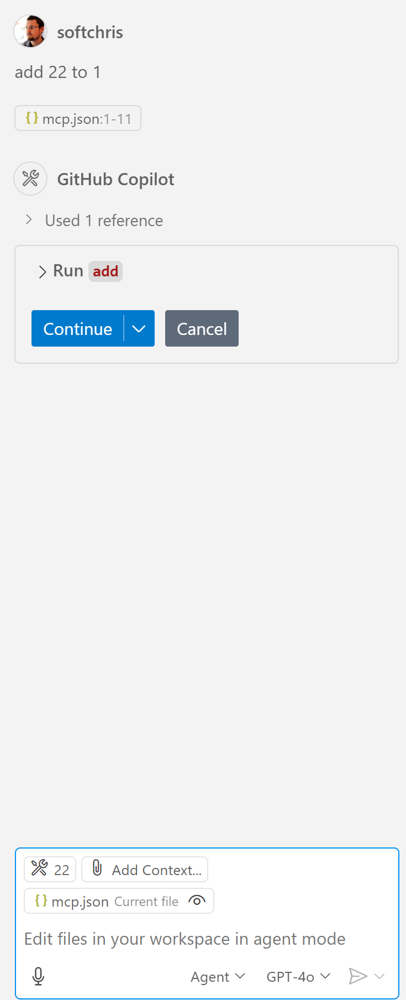

<!--
CO_OP_TRANSLATOR_METADATA:
{
  "original_hash": "5ef8f5821c1a04f7b1fc4f15098ecab8",
  "translation_date": "2025-08-26T20:39:17+00:00",
  "source_file": "03-GettingStarted/04-vscode/solution/README.md",
  "language_code": "lt"
}
-->
# Paleisti pavyzdį

Čia darome prielaidą, kad jau turite veikiančią serverio kodo versiją. Suraskite serverį iš vieno ankstesnių skyrių.

## Nustatyti mcp.json

Štai failas, kurį galite naudoti kaip pavyzdį, [mcp.json](../../../../../03-GettingStarted/04-vscode/solution/mcp.json).

Pakeiskite serverio įrašą taip, kad jis nurodytų absoliutų kelią į jūsų serverį, įskaitant visą reikalingą komandą, kad jį paleistumėte.

Pavyzdiniame faile, nurodytame aukščiau, serverio įrašas atrodo taip:

Šis atitinka komandos paleidimą, pavyzdžiui: `node build/index.js`.

- Pakeiskite šį serverio įrašą pagal tai, kur yra jūsų serverio failas, arba pagal tai, kas reikalinga jūsų serveriui paleisti, priklausomai nuo pasirinktos aplinkos ir serverio vietos.

## Naudoti funkcijas serveryje

- Spustelėkite `play` piktogramą, kai pridėsite *mcp.json* į *./vscode* aplanką.

    Stebėkite, kaip įrankių piktograma pasikeičia, padidindama galimų įrankių skaičių. Įrankių piktograma yra tiesiai virš pokalbio lauko GitHub Copilot.

## Paleisti įrankį

- Įveskite užklausą savo pokalbio lange, kuri atitinka jūsų įrankio aprašymą. Pavyzdžiui, norėdami paleisti įrankį `add`, įveskite kažką panašaus į "pridėti 3 prie 20".

    Turėtumėte matyti įrankį, pateiktą virš pokalbio teksto laukelio, kuris leidžia jums pasirinkti paleisti įrankį, kaip parodyta šiame paveikslėlyje:

    

    Pasirinkus įrankį, turėtų būti pateiktas skaitinis rezultatas, sakantis "23", jei jūsų užklausa buvo tokia, kaip minėjome anksčiau.

---

**Atsakomybės apribojimas**:  
Šis dokumentas buvo išverstas naudojant AI vertimo paslaugą [Co-op Translator](https://github.com/Azure/co-op-translator). Nors siekiame tikslumo, prašome atkreipti dėmesį, kad automatiniai vertimai gali turėti klaidų ar netikslumų. Originalus dokumentas jo gimtąja kalba turėtų būti laikomas autoritetingu šaltiniu. Dėl svarbios informacijos rekomenduojama profesionali žmogaus vertimo paslauga. Mes neprisiimame atsakomybės už nesusipratimus ar klaidingus interpretavimus, atsiradusius naudojant šį vertimą.