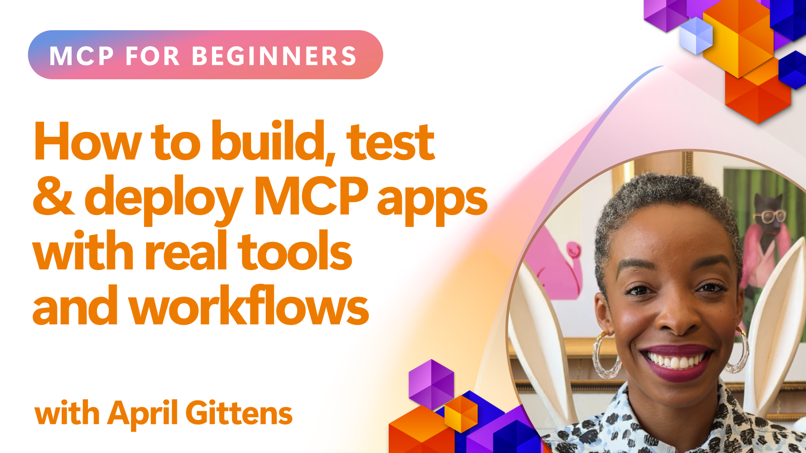

<!--
CO_OP_TRANSLATOR_METADATA:
{
  "original_hash": "83efa75a69bc831277263a6f1ae53669",
  "translation_date": "2025-08-26T18:46:01+00:00",
  "source_file": "04-PracticalImplementation/README.md",
  "language_code": "lt"
}
-->
# Praktinis įgyvendinimas

_(Spustelėkite aukščiau esančią nuotrauką, kad peržiūrėtumėte šios pamokos vaizdo įrašą)_

Praktinis įgyvendinimas yra ta vieta, kur Model Context Protocol (MCP) galia tampa apčiuopiama. Nors svarbu suprasti MCP teoriją ir architektūrą, tikroji vertė atsiskleidžia, kai šias koncepcijas pritaikote kurdami, testuodami ir diegdami sprendimus, kurie sprendžia realias problemas. Šis skyrius sujungia teorines žinias su praktiniu kūrimu, padėdamas jums įgyvendinti MCP pagrindu sukurtas programas.

Nesvarbu, ar kuriate išmaniuosius asistentus, integruojate dirbtinį intelektą į verslo procesus, ar kuriate individualius duomenų apdorojimo įrankius, MCP suteikia lankstų pagrindą. Jo nepriklausoma nuo kalbos struktūra ir oficialūs SDK populiarioms programavimo kalboms leidžia jį naudoti plačiam kūrėjų ratui. Naudodamiesi šiais SDK, galite greitai kurti prototipus, iteruoti ir plėsti savo sprendimus įvairiose platformose ir aplinkose.

Toliau pateiktuose skyriuose rasite praktinių pavyzdžių, kodo pavyzdžių ir diegimo strategijų, kurios parodys, kaip įgyvendinti MCP naudojant C#, Java su Spring, TypeScript, JavaScript ir Python. Taip pat sužinosite, kaip derinti ir testuoti MCP serverius, valdyti API ir diegti sprendimus debesyje naudojant Azure. Šie praktiniai ištekliai skirti paspartinti jūsų mokymąsi ir padėti užtikrintai kurti patikimas, gamybai paruoštas MCP programas.

## Apžvalga

Ši pamoka orientuota į praktinius MCP įgyvendinimo aspektus įvairiose programavimo kalbose. Mes nagrinėsime, kaip naudoti MCP SDK C#, Java su Spring, TypeScript, JavaScript ir Python, kad sukurtume patikimas programas, derintume ir testuotume MCP serverius bei kurtume pakartotinai naudojamus išteklius, šablonus ir įrankius.

## Mokymosi tikslai

Šios pamokos pabaigoje jūs galėsite:

- Įgyvendinti MCP sprendimus naudojant oficialius SDK įvairiomis programavimo kalbomis
- Sistemingai derinti ir testuoti MCP serverius
- Kurti ir naudoti serverio funkcijas (Ištekliai, Šablonai ir Įrankiai)
- Kurti efektyvias MCP darbo eigas sudėtingoms užduotims
- Optimizuoti MCP įgyvendinimus našumui ir patikimumui

## Oficialūs SDK ištekliai

Model Context Protocol siūlo oficialius SDK kelioms kalboms:

- [C# SDK](https://github.com/modelcontextprotocol/csharp-sdk)
- [Java su Spring SDK](https://github.com/modelcontextprotocol/java-sdk) **Pastaba:** reikalauja priklausomybės nuo [Project Reactor](https://projectreactor.io). (Žr. [diskusijos klausimą 246](https://github.com/orgs/modelcontextprotocol/discussions/246).)
- [TypeScript SDK](https://github.com/modelcontextprotocol/typescript-sdk)
- [Python SDK](https://github.com/modelcontextprotocol/python-sdk)
- [Kotlin SDK](https://github.com/modelcontextprotocol/kotlin-sdk)

## Darbas su MCP SDK

Šiame skyriuje pateikiami praktiniai MCP įgyvendinimo pavyzdžiai įvairiomis programavimo kalbomis. Kodo pavyzdžius galite rasti `samples` kataloge, suskirstytus pagal kalbas.

### Galimi pavyzdžiai

Saugykloje yra [įgyvendinimo pavyzdžiai](../../../04-PracticalImplementation/samples) šiomis kalbomis:

- [C#](./samples/csharp/README.md)
- [Java su Spring](./samples/java/containerapp/README.md)
- [TypeScript](./samples/typescript/README.md)
- [JavaScript](./samples/javascript/README.md)
- [Python](./samples/python/README.md)

Kiekvienas pavyzdys demonstruoja pagrindines MCP koncepcijas ir įgyvendinimo modelius konkrečiai kalbai ir ekosistemai.

## Pagrindinės serverio funkcijos

MCP serveriai gali įgyvendinti bet kokį šių funkcijų derinį:

### Ištekliai

Ištekliai suteikia kontekstą ir duomenis, kuriuos gali naudoti vartotojas ar AI modelis:

- Dokumentų saugyklos
- Žinių bazės
- Struktūrizuoti duomenų šaltiniai
- Failų sistemos

### Šablonai

Šablonai yra paruoštos žinutės ir darbo eigos vartotojams:

- Iš anksto apibrėžti pokalbių šablonai
- Valdomų sąveikų modeliai
- Specializuotos dialogo struktūros

### Įrankiai

Įrankiai yra funkcijos, kurias vykdo AI modelis:

- Duomenų apdorojimo įrankiai
- Išorinių API integracijos
- Skaičiavimo galimybės
- Paieškos funkcionalumas

## Pavyzdinis įgyvendinimas: C# įgyvendinimas

Oficiali C# SDK saugykla turi kelis pavyzdinius įgyvendinimus, demonstruojančius skirtingus MCP aspektus:

- **Paprastas MCP klientas**: Paprastas pavyzdys, kaip sukurti MCP klientą ir iškviesti įrankius
- **Paprastas MCP serveris**: Minimalus serverio įgyvendinimas su pagrindine įrankių registracija
- **Išplėstinis MCP serveris**: Pilnai funkcionalus serveris su įrankių registracija, autentifikacija ir klaidų valdymu
- **ASP.NET integracija**: Pavyzdžiai, demonstruojantys integraciją su ASP.NET Core
- **Įrankių įgyvendinimo modeliai**: Įvairūs modeliai, kaip įgyvendinti įrankius su skirtingu sudėtingumo lygiu

C# MCP SDK yra peržiūros stadijoje, todėl API gali keistis. Mes nuolat atnaujinsime šį tinklaraštį, kai SDK evoliucionuos.

### Pagrindinės funkcijos

- [C# MCP Nuget ModelContextProtocol](https://www.nuget.org/packages/ModelContextProtocol)
- Sukurkite savo [pirmąjį MCP serverį](https://devblogs.microsoft.com/dotnet/build-a-model-context-protocol-mcp-server-in-csharp/).

Visus C# įgyvendinimo pavyzdžius rasite [oficialioje C# SDK pavyzdžių saugykloje](https://github.com/modelcontextprotocol/csharp-sdk).

## Pavyzdinis įgyvendinimas: Java su Spring įgyvendinimas

Java su Spring SDK siūlo tvirtas MCP įgyvendinimo galimybes su įmonės lygio funkcijomis.

### Pagrindinės funkcijos

- Spring Framework integracija
- Stipri tipų sauga
- Reaktyvaus programavimo palaikymas
- Išsamus klaidų valdymas

Visą Java su Spring įgyvendinimo pavyzdį rasite [Java su Spring pavyzdyje](samples/java/containerapp/README.md) pavyzdžių kataloge.

## Pavyzdinis įgyvendinimas: JavaScript įgyvendinimas

JavaScript SDK suteikia lengvą ir lankstų požiūrį į MCP įgyvendinimą.

### Pagrindinės funkcijos

- Node.js ir naršyklės palaikymas
- API, pagrįsta pažadais
- Lengva integracija su Express ir kitais karkasais
- WebSocket palaikymas srautiniam perdavimui

Visą JavaScript įgyvendinimo pavyzdį rasite [JavaScript pavyzdyje](samples/javascript/README.md) pavyzdžių kataloge.

## Pavyzdinis įgyvendinimas: Python įgyvendinimas

Python SDK siūlo Python būdingą požiūrį į MCP įgyvendinimą su puikia ML karkasų integracija.

### Pagrindinės funkcijos

- Async/await palaikymas su asyncio
- FastAPI integracija
- Paprasta įrankių registracija
- Natūrali integracija su populiariais ML bibliotekais

Visą Python įgyvendinimo pavyzdį rasite [Python pavyzdyje](samples/python/README.md) pavyzdžių kataloge.

## API valdymas

Azure API Management yra puikus sprendimas, kaip apsaugoti MCP serverius. Idėja yra pastatyti Azure API Management instanciją prieš jūsų MCP serverį ir leisti jai valdyti funkcijas, kurių greičiausiai norėsite, tokias kaip:

- užklausų ribojimas
- žetonų valdymas
- stebėjimas
- apkrovos balansavimas
- saugumas

### Azure pavyzdys

Štai Azure pavyzdys, kaip sukurti MCP serverį ir apsaugoti jį naudojant Azure API Management: [Azure API Management pavyzdys](https://github.com/Azure-Samples/remote-mcp-apim-functions-python).

...

---

**Atsakomybės apribojimas**:  
Šis dokumentas buvo išverstas naudojant AI vertimo paslaugą [Co-op Translator](https://github.com/Azure/co-op-translator). Nors siekiame tikslumo, prašome atkreipti dėmesį, kad automatiniai vertimai gali turėti klaidų ar netikslumų. Originalus dokumentas jo gimtąja kalba turėtų būti laikomas autoritetingu šaltiniu. Kritinei informacijai rekomenduojama naudoti profesionalų žmogaus vertimą. Mes neprisiimame atsakomybės už nesusipratimus ar klaidingus interpretavimus, atsiradusius dėl šio vertimo naudojimo.