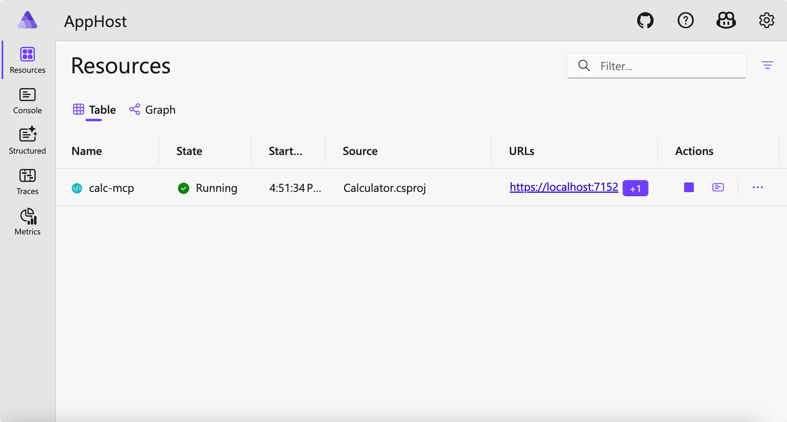
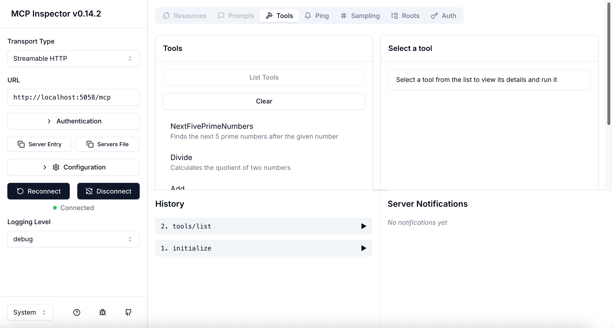
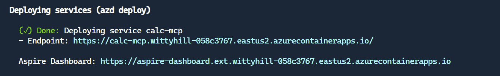

<!--
CO_OP_TRANSLATOR_METADATA:
{
  "original_hash": "0bc7bd48f55f1565f1d95ccb2c16f728",
  "translation_date": "2025-08-26T18:47:11+00:00",
  "source_file": "04-PracticalImplementation/samples/csharp/README.md",
  "language_code": "lt"
}
-->
Ankstesniame pavyzdyje parodyta, kaip naudoti vietinį .NET projektą su `stdio` tipu ir kaip paleisti serverį vietoje konteineryje. Tai yra geras sprendimas daugelyje situacijų. Tačiau gali būti naudinga, kad serveris veiktų nuotoliniu būdu, pavyzdžiui, debesų aplinkoje. Čia praverčia `http` tipas.

Žvelgiant į sprendimą aplanke `04-PracticalImplementation`, jis gali atrodyti daug sudėtingesnis nei ankstesnis. Tačiau iš tikrųjų taip nėra. Jei atidžiau pažvelgsite į projektą `src/Calculator`, pamatysite, kad tai iš esmės tas pats kodas kaip ankstesniame pavyzdyje. Vienintelis skirtumas yra tas, kad naudojame kitą biblioteką `ModelContextProtocol.AspNetCore`, kad apdorotume HTTP užklausas. Be to, pakeitėme metodą `IsPrime`, kad jis būtų privatus, tiesiog norėdami parodyti, jog galite turėti privačius metodus savo kode. Likęs kodas yra toks pat kaip ir anksčiau.

Kiti projektai yra iš [.NET Aspire](https://learn.microsoft.com/dotnet/aspire/get-started/aspire-overview). Turint .NET Aspire sprendime, pagerės kūrėjo patirtis kuriant ir testuojant, taip pat padės stebėti procesus. Nors tai nėra būtina serverio veikimui, gera praktika turėti jį savo sprendime.

## Paleiskite serverį vietoje

1. Naudodami VS Code (su C# DevKit plėtiniu), pereikite į katalogą `04-PracticalImplementation/samples/csharp`.
1. Vykdykite šią komandą, kad paleistumėte serverį:

   ```bash
    dotnet watch run --project ./src/AppHost
   ```

1. Kai interneto naršyklėje atsidarys .NET Aspire prietaisų skydelis, atkreipkite dėmesį į `http` URL. Jis turėtų būti panašus į `http://localhost:5058/`.

   

## Testuokite Streamable HTTP su MCP Inspector

Jei turite Node.js 22.7.5 ar naujesnę versiją, galite naudoti MCP Inspector, kad testuotumėte savo serverį.

Paleiskite serverį ir terminale vykdykite šią komandą:

```bash
npx @modelcontextprotocol/inspector http://localhost:5058
```



- Pasirinkite `Streamable HTTP` kaip transporto tipą.
- Laukelyje Url įveskite anksčiau užfiksuotą serverio URL ir pridėkite `/mcp`. Jis turėtų būti `http` (ne `https`), kažkas panašaus į `http://localhost:5058/mcp`.
- Paspauskite mygtuką Connect.

Vienas iš MCP Inspector privalumų yra tai, kad jis suteikia gerą matomumą, kas vyksta.

- Pabandykite išvardyti galimus įrankius.
- Išbandykite keletą jų – jie turėtų veikti taip pat kaip anksčiau.

## Testuokite MCP serverį su GitHub Copilot Chat VS Code aplinkoje

Norėdami naudoti Streamable HTTP transportą su GitHub Copilot Chat, pakeiskite anksčiau sukurtą `calc-mcp` serverio konfigūraciją, kad ji atrodytų taip:

```jsonc
// .vscode/mcp.json
{
  "servers": {
    "calc-mcp": {
      "type": "http",
      "url": "http://localhost:5058/mcp"
    }
  }
}
```

Atlikite keletą testų:

- Paklauskite „3 pirminių skaičių po 6780“. Atkreipkite dėmesį, kaip Copilot naudos naują įrankį `NextFivePrimeNumbers` ir grąžins tik pirmus 3 pirminius skaičius.
- Paklauskite „7 pirminių skaičių po 111“, kad pamatytumėte, kas nutiks.
- Paklauskite „Jonas turi 24 saldainius ir nori juos padalyti savo 3 vaikams. Kiek saldainių gaus kiekvienas vaikas?“, kad pamatytumėte, kas nutiks.

## Serverio diegimas į Azure

Paleiskime serverį Azure, kad daugiau žmonių galėtų juo naudotis.

Iš terminalo pereikite į aplanką `04-PracticalImplementation/samples/csharp` ir vykdykite šią komandą:

```bash
azd up
```

Kai diegimas bus baigtas, turėtumėte pamatyti tokį pranešimą:



Paimkite URL ir naudokite jį MCP Inspector bei GitHub Copilot Chat.

```jsonc
// .vscode/mcp.json
{
  "servers": {
    "calc-mcp": {
      "type": "http",
      "url": "https://calc-mcp.gentleriver-3977fbcf.australiaeast.azurecontainerapps.io/mcp"
    }
  }
}
```

## Kas toliau?

Išbandėme skirtingus transporto tipus ir testavimo įrankius. Taip pat įdiegėme jūsų MCP serverį į Azure. Bet ką daryti, jei mūsų serveriui reikia prieigos prie privačių išteklių? Pavyzdžiui, duomenų bazės ar privačios API? Kitame skyriuje aptarsime, kaip galime pagerinti serverio saugumą.

---

**Atsakomybės apribojimas**:  
Šis dokumentas buvo išverstas naudojant AI vertimo paslaugą [Co-op Translator](https://github.com/Azure/co-op-translator). Nors siekiame tikslumo, prašome atkreipti dėmesį, kad automatiniai vertimai gali turėti klaidų ar netikslumų. Originalus dokumentas jo gimtąja kalba turėtų būti laikomas autoritetingu šaltiniu. Kritinei informacijai rekomenduojama naudoti profesionalų žmogaus vertimą. Mes neprisiimame atsakomybės už nesusipratimus ar klaidingus aiškinimus, atsiradusius dėl šio vertimo naudojimo.