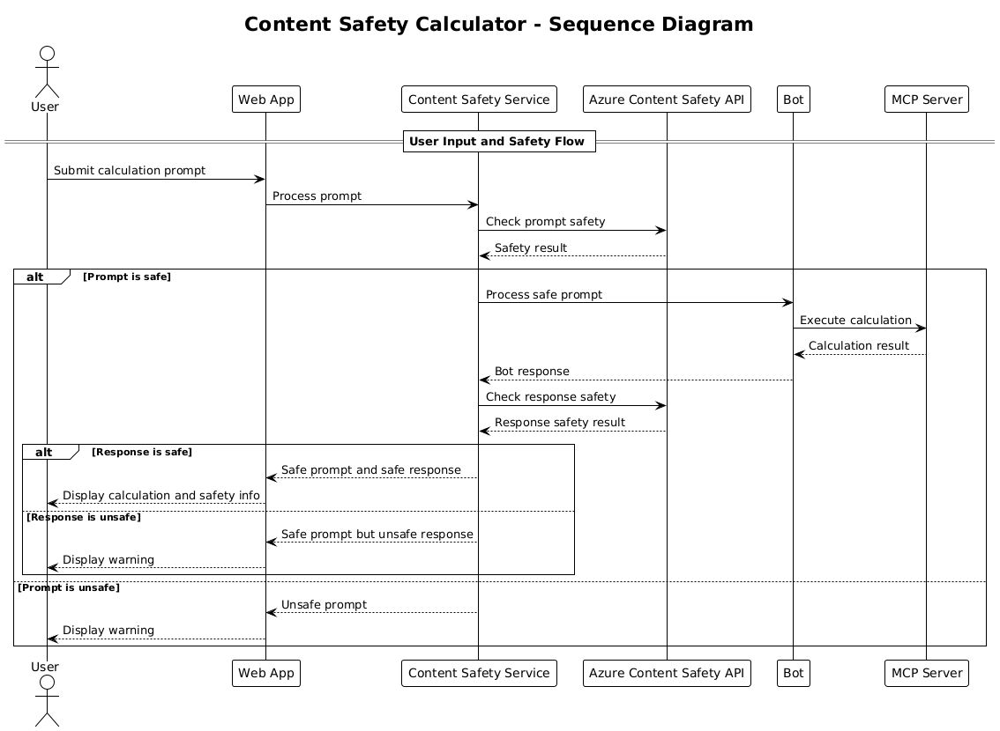

<!--
CO_OP_TRANSLATOR_METADATA:
{
  "original_hash": "e5ea5e7582f70008ea9bec3b3820f20a",
  "translation_date": "2025-08-26T18:46:42+00:00",
  "source_file": "04-PracticalImplementation/samples/java/containerapp/README.md",
  "language_code": "lt"
}
-->
## Sistemos architektūra

Šis projektas demonstruoja internetinę programą, kuri tikrina turinio saugumą prieš perduodant vartotojo užklausas skaičiuoklės paslaugai per Model Context Protocol (MCP).



### Kaip tai veikia

1. **Vartotojo įvestis**: Vartotojas įveda skaičiavimo užklausą internetinėje sąsajoje
2. **Turinio saugumo patikra (įvestis)**: Užklausa analizuojama naudojant Azure Content Safety API
3. **Saugumo sprendimas (įvestis)**:
   - Jei turinys yra saugus (sunkumo lygis < 2 visose kategorijose), jis perduodamas skaičiuoklei
   - Jei turinys pažymėtas kaip potencialiai kenksmingas, procesas sustabdomas ir grąžinamas įspėjimas
4. **Skaičiuoklės integracija**: Saugus turinys apdorojamas LangChain4j, kuris bendrauja su MCP skaičiuoklės serveriu
5. **Turinio saugumo patikra (išvestis)**: Roboto atsakymas analizuojamas naudojant Azure Content Safety API
6. **Saugumo sprendimas (išvestis)**:
   - Jei roboto atsakymas yra saugus, jis rodomas vartotojui
   - Jei roboto atsakymas pažymėtas kaip potencialiai kenksmingas, jis pakeičiamas įspėjimu
7. **Atsakymas**: Rezultatai (jei saugūs) rodomi vartotojui kartu su abiem saugumo analizėmis

## Model Context Protocol (MCP) naudojimas su skaičiuoklės paslaugomis

Šis projektas demonstruoja, kaip naudoti Model Context Protocol (MCP) skaičiuoklės MCP paslaugoms iškviesti per LangChain4j. Įgyvendinimas naudoja vietinį MCP serverį, veikiantį 8080 prievade, skaičiavimo operacijoms atlikti.

### Azure turinio saugumo paslaugos nustatymas

Prieš naudojant turinio saugumo funkcijas, reikia sukurti Azure turinio saugumo paslaugos resursą:

1. Prisijunkite prie [Azure portalo](https://portal.azure.com)
2. Spustelėkite „Create a resource“ ir ieškokite „Content Safety“
3. Pasirinkite „Content Safety“ ir spustelėkite „Create“
4. Įveskite unikalų resurso pavadinimą
5. Pasirinkite savo prenumeratą ir resursų grupę (arba sukurkite naują)
6. Pasirinkite palaikomą regioną (daugiau informacijos rasite [Region availability](https://azure.microsoft.com/en-us/global-infrastructure/services/?products=cognitive-services))
7. Pasirinkite tinkamą kainų planą
8. Spustelėkite „Create“, kad įdiegtumėte resursą
9. Kai diegimas bus baigtas, spustelėkite „Go to resource“
10. Kairėje pusėje, skiltyje „Resource Management“, pasirinkite „Keys and Endpoint“
11. Nukopijuokite vieną iš raktų ir URL adresą, kad galėtumėte naudoti kitame žingsnyje

### Aplinkos kintamųjų konfigūravimas

Nustatykite `GITHUB_TOKEN` aplinkos kintamąjį GitHub modelių autentifikacijai:
```sh
export GITHUB_TOKEN=<your_github_token>
```

Turinio saugumo funkcijoms nustatykite:
```sh
export CONTENT_SAFETY_ENDPOINT=<your_content_safety_endpoint>
export CONTENT_SAFETY_KEY=<your_content_safety_key>
```

Šie aplinkos kintamieji naudojami programai autentifikuoti su Azure turinio saugumo paslauga. Jei šie kintamieji nenustatyti, programa naudos demonstracines vertes, tačiau turinio saugumo funkcijos neveiks tinkamai.

### Skaičiuoklės MCP serverio paleidimas

Prieš paleidžiant klientą, reikia paleisti skaičiuoklės MCP serverį SSE režimu localhost:8080.

## Projekto aprašymas

Šis projektas demonstruoja Model Context Protocol (MCP) integraciją su LangChain4j skaičiuoklės paslaugoms iškviesti. Pagrindinės funkcijos:

- MCP naudojimas skaičiuoklės paslaugai prijungti prie pagrindinių matematikos operacijų
- Dvigubo sluoksnio turinio saugumo patikra tiek vartotojo užklausoms, tiek roboto atsakymams
- Integracija su GitHub gpt-4.1-nano modeliu per LangChain4j
- Server-Sent Events (SSE) naudojimas MCP transportui

## Turinio saugumo integracija

Projektas apima išsamias turinio saugumo funkcijas, užtikrinančias, kad tiek vartotojo įvestys, tiek sistemos atsakymai būtų be kenksmingo turinio:

1. **Įvesties patikra**: Visos vartotojo užklausos analizuojamos dėl kenksmingo turinio kategorijų, tokių kaip neapykantos kalba, smurtas, savęs žalojimas ir seksualinis turinys, prieš apdorojimą.

2. **Išvesties patikra**: Net naudojant potencialiai necenzūruotus modelius, sistema tikrina visus sugeneruotus atsakymus per tuos pačius turinio saugumo filtrus prieš juos rodant vartotojui.

Šis dvigubo sluoksnio metodas užtikrina, kad sistema išliktų saugi, nepriklausomai nuo to, kuris AI modelis naudojamas, apsaugant vartotojus nuo kenksmingų įvesčių ir potencialiai probleminių AI sugeneruotų atsakymų.

## Internetinis klientas

Programa apima patogią internetinę sąsają, leidžiančią vartotojams sąveikauti su turinio saugumo skaičiuoklės sistema:

### Internetinės sąsajos funkcijos

- Paprasta, intuityvi forma skaičiavimo užklausoms įvesti
- Dvigubo sluoksnio turinio saugumo patikra (įvestis ir išvestis)
- Realaus laiko grįžtamasis ryšys apie užklausos ir atsakymo saugumą
- Spalvomis pažymėti saugumo indikatoriai lengvam interpretavimui
- Švari, prisitaikanti dizaino sąsaja, tinkanti įvairiems įrenginiams
- Pavyzdinės saugios užklausos, padedančios vartotojams

### Internetinio kliento naudojimas

1. Paleiskite programą:
   ```sh
   mvn spring-boot:run
   ```

2. Atidarykite naršyklę ir eikite į `http://localhost:8087`

3. Įveskite skaičiavimo užklausą pateiktoje teksto srityje (pvz., „Apskaičiuokite 24.5 ir 17.3 sumą“)

4. Spustelėkite „Submit“, kad apdorotumėte užklausą

5. Peržiūrėkite rezultatus, kurie apims:
   - Jūsų užklausos turinio saugumo analizę
   - Apskaičiuotą rezultatą (jei užklausa buvo saugi)
   - Roboto atsakymo turinio saugumo analizę
   - Bet kokius saugumo įspėjimus, jei įvestis ar išvestis buvo pažymėta

Internetinis klientas automatiškai apdoroja abu turinio saugumo patikros procesus, užtikrindamas, kad visos sąveikos būtų saugios ir tinkamos, nepriklausomai nuo to, kuris AI modelis naudojamas.

---

**Atsakomybės apribojimas**:  
Šis dokumentas buvo išverstas naudojant AI vertimo paslaugą [Co-op Translator](https://github.com/Azure/co-op-translator). Nors siekiame tikslumo, prašome atkreipti dėmesį, kad automatiniai vertimai gali turėti klaidų ar netikslumų. Originalus dokumentas jo gimtąja kalba turėtų būti laikomas autoritetingu šaltiniu. Kritinei informacijai rekomenduojama naudoti profesionalų žmogaus vertimą. Mes neprisiimame atsakomybės už nesusipratimus ar klaidingus interpretavimus, atsiradusius dėl šio vertimo naudojimo.