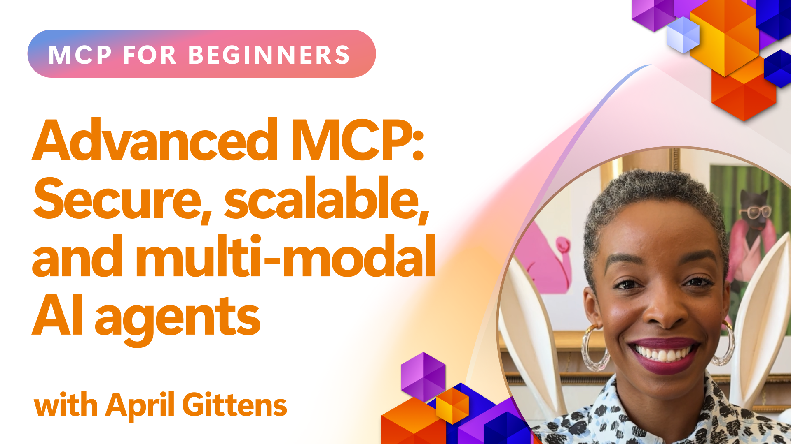

<!--
CO_OP_TRANSLATOR_METADATA:
{
  "original_hash": "d204bc94ea6027d06a703b21b711ca57",
  "translation_date": "2025-08-26T18:50:06+00:00",
  "source_file": "05-AdvancedTopics/README.md",
  "language_code": "lt"
}
-->
# Pažangios MCP temos

_(Spustelėkite aukščiau esančią nuotrauką, kad peržiūrėtumėte šios pamokos vaizdo įrašą)_

Šiame skyriuje aptariamos pažangios Model Context Protocol (MCP) įgyvendinimo temos, įskaitant daugiarūšę integraciją, mastelio keitimą, saugumo geriausias praktikas ir integraciją su įmonių sistemomis. Šios temos yra itin svarbios kuriant patikimas ir gamybai paruoštas MCP programas, kurios atitinka šiuolaikinių AI sistemų poreikius.

## Apžvalga

Šioje pamokoje nagrinėjamos pažangios Model Context Protocol įgyvendinimo sąvokos, daugiausia dėmesio skiriant daugiarūšiai integracijai, mastelio keitimui, saugumo geriausioms praktikoms ir integracijai su įmonių sistemomis. Šios temos yra būtinos kuriant gamybai pritaikytas MCP programas, kurios gali patenkinti sudėtingus reikalavimus įmonių aplinkose.

## Mokymosi tikslai

Šios pamokos pabaigoje galėsite:

- Įgyvendinti daugiarūšes galimybes MCP sistemose
- Kurti mastelį keičiančias MCP architektūras didelės apkrovos scenarijams
- Taikyti saugumo geriausias praktikas, atitinkančias MCP saugumo principus
- Integruoti MCP su įmonių AI sistemomis ir platformomis
- Optimizuoti našumą ir patikimumą gamybinėje aplinkoje

## Pamokos ir pavyzdiniai projektai

| Nuoroda | Pavadinimas | Aprašymas |
|---------|-------------|-----------|
| [5.1 Integracija su Azure](./mcp-integration/README.md) | Integracija su Azure | Sužinokite, kaip integruoti savo MCP serverį su Azure |
| [5.2 Daugiarūšiai pavyzdžiai](./mcp-multi-modality/README.md) | MCP daugiarūšiai pavyzdžiai | Pavyzdžiai, kaip dirbti su garsu, vaizdais ir daugiarūšiais atsakymais |
| [5.3 MCP OAuth2 pavyzdys](../../../05-AdvancedTopics/mcp-oauth2-demo) | MCP OAuth2 demonstracija | Minimalus Spring Boot programos pavyzdys, rodantis OAuth2 su MCP kaip autorizacijos ir resursų serveriu. Demonstracija apima saugių žetonų išdavimą, apsaugotus galinius taškus, Azure Container Apps diegimą ir API valdymo integraciją. |
| [5.4 Pagrindiniai kontekstai](./mcp-root-contexts/README.md) | Pagrindiniai kontekstai | Sužinokite daugiau apie pagrindinius kontekstus ir jų įgyvendinimą |
| [5.5 Maršrutizavimas](./mcp-routing/README.md) | Maršrutizavimas | Sužinokite apie skirtingus maršrutizavimo tipus |
| [5.6 Imčių ėmimas](./mcp-sampling/README.md) | Imčių ėmimas | Sužinokite, kaip dirbti su imčių ėmimu |
| [5.7 Mastelio keitimas](./mcp-scaling/README.md) | Mastelio keitimas | Sužinokite apie mastelio keitimą |
| [5.8 Saugumas](./mcp-security/README.md) | Saugumas | Užtikrinkite savo MCP serverio saugumą |
| [5.9 Tinklo paieškos pavyzdys](./web-search-mcp/README.md) | Tinklo paieška MCP | Python MCP serveris ir klientas, integruojantis su SerpAPI realaus laiko tinklo, naujienų, produktų paieškai ir klausimų-atsakymų funkcijoms. Demonstracija apima daugiapriemonių orkestraciją, išorinės API integraciją ir patikimą klaidų valdymą. |
| [5.10 Realaus laiko srautai](./mcp-realtimestreaming/README.md) | Srautai | Realaus laiko duomenų srautai yra būtini šiuolaikiniame duomenimis grįstame pasaulyje, kur verslai ir programos reikalauja greitos prieigos prie informacijos, kad galėtų priimti laiku pagrįstus sprendimus. |
| [5.11 Realaus laiko tinklo paieška](./mcp-realtimesearch/README.md) | Tinklo paieška | Kaip MCP transformuoja realaus laiko tinklo paiešką, suteikdamas standartizuotą požiūrį į konteksto valdymą tarp AI modelių, paieškos variklių ir programų. |
| [5.12 Entra ID autentifikacija MCP serveriams](./mcp-security-entra/README.md) | Entra ID autentifikacija | Microsoft Entra ID suteikia patikimą debesų pagrindu veikiančią tapatybės ir prieigos valdymo sprendimą, padedantį užtikrinti, kad tik įgalioti vartotojai ir programos galėtų sąveikauti su jūsų MCP serveriu. |
| [5.13 Azure AI Foundry agentų integracija](./mcp-foundry-agent-integration/README.md) | Azure AI Foundry integracija | Sužinokite, kaip integruoti Model Context Protocol serverius su Azure AI Foundry agentais, leidžiant galingą priemonių orkestraciją ir įmonių AI galimybes su standartizuotais išorinių duomenų šaltinių ryšiais. |
| [5.14 Konteksto inžinerija](./mcp-contextengineering/README.md) | Konteksto inžinerija | Ateities galimybės konteksto inžinerijos technikoms MCP serveriuose, įskaitant konteksto optimizavimą, dinaminį konteksto valdymą ir efektyvaus užklausų inžinerijos strategijas MCP sistemose. |

## Papildomi šaltiniai

Naujausią informaciją apie pažangias MCP temas rasite:
- [MCP dokumentacija](https://modelcontextprotocol.io/)
- [MCP specifikacija](https://spec.modelcontextprotocol.io/)
- [GitHub saugykla](https://github.com/modelcontextprotocol)

## Pagrindinės išvados

- Daugiarūšės MCP įgyvendinimo galimybės išplečia AI funkcionalumą už teksto apdorojimo ribų
- Mastelio keitimas yra būtinas įmonių diegimams ir gali būti pasiektas horizontaliu bei vertikaliu mastelio keitimu
- Išsamios saugumo priemonės apsaugo duomenis ir užtikrina tinkamą prieigos kontrolę
- Integracija su tokiomis platformomis kaip Azure OpenAI ir Microsoft AI Foundry sustiprina MCP galimybes
- Pažangūs MCP įgyvendinimai naudingi dėl optimizuotų architektūrų ir kruopštaus išteklių valdymo

## Užduotis

Sukurkite įmonės lygio MCP įgyvendinimą konkrečiam naudojimo atvejui:

1. Nustatykite daugiarūšius reikalavimus savo naudojimo atvejui
2. Apibrėžkite saugumo kontrolės priemones jautrių duomenų apsaugai
3. Sukurkite mastelį keičiančią architektūrą, galinčią susidoroti su kintama apkrova
4. Suplanuokite integracijos taškus su įmonių AI sistemomis
5. Dokumentuokite galimus našumo trūkumus ir jų šalinimo strategijas

## Papildomi šaltiniai

- [Azure OpenAI dokumentacija](https://learn.microsoft.com/en-us/azure/ai-services/openai/)
- [Microsoft AI Foundry dokumentacija](https://learn.microsoft.com/en-us/ai-services/)

---

## Kas toliau

- [5.1 MCP integracija](./mcp-integration/README.md)

---

**Atsakomybės apribojimas**:  
Šis dokumentas buvo išverstas naudojant AI vertimo paslaugą [Co-op Translator](https://github.com/Azure/co-op-translator). Nors siekiame tikslumo, prašome atkreipti dėmesį, kad automatiniai vertimai gali turėti klaidų ar netikslumų. Originalus dokumentas jo gimtąja kalba turėtų būti laikomas autoritetingu šaltiniu. Dėl svarbios informacijos rekomenduojama profesionali žmogaus vertimo paslauga. Mes neprisiimame atsakomybės už nesusipratimus ar klaidingus interpretavimus, atsiradusius naudojant šį vertimą.