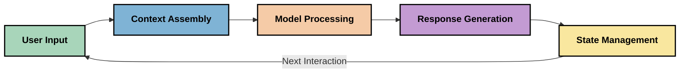
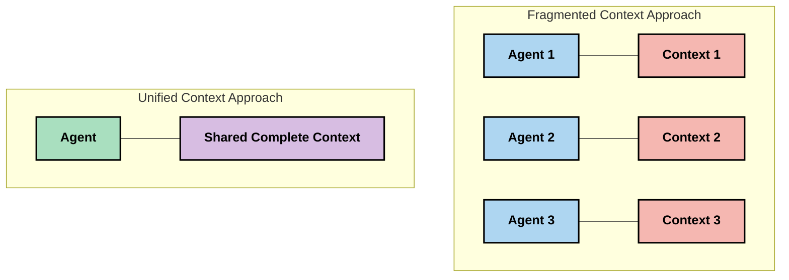
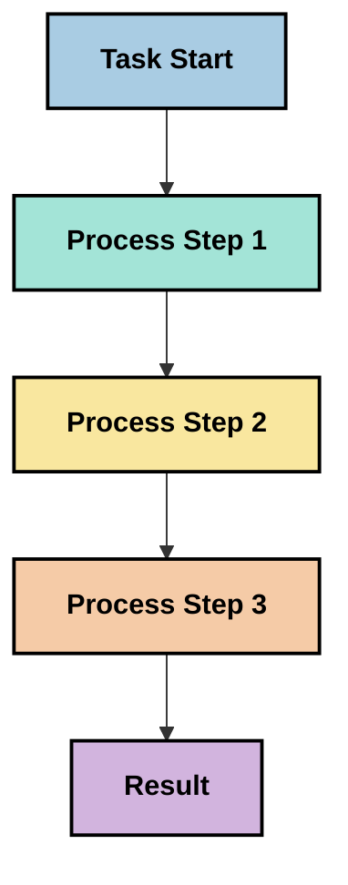
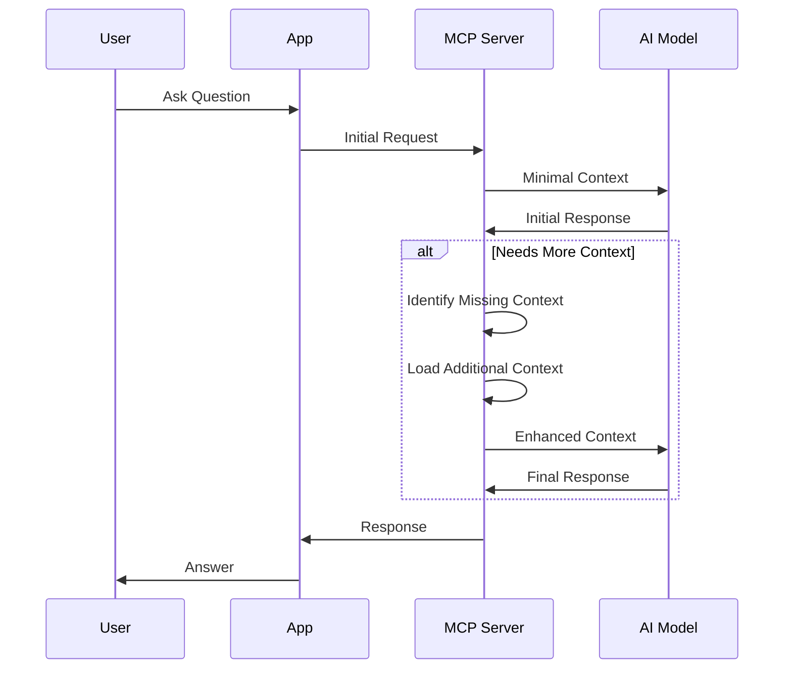
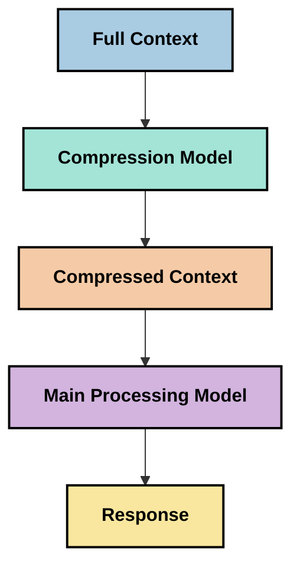

<!--
CO_OP_TRANSLATOR_METADATA:
{
  "original_hash": "fd169ca3071b81b5ee282e194bc823df",
  "translation_date": "2025-09-15T21:25:33+00:00",
  "source_file": "05-AdvancedTopics/mcp-contextengineering/README.md",
  "language_code": "lt"
}
-->
# Konteksto inžinerija: Nauja koncepcija MCP ekosistemoje

## Apžvalga

Konteksto inžinerija yra nauja koncepcija dirbtinio intelekto srityje, kuri tiria, kaip informacija yra struktūrizuojama, perduodama ir palaikoma sąveikos tarp klientų ir dirbtinio intelekto paslaugų metu. Kadangi Modelio Konteksto Protokolo (MCP) ekosistema vystosi, vis svarbiau tampa suprasti, kaip efektyviai valdyti kontekstą. Šiame modulyje pristatoma konteksto inžinerijos koncepcija ir nagrinėjamos jos galimos taikymo sritys MCP įgyvendinimuose.

## Mokymosi tikslai

Baigę šį modulį, galėsite:

- Suprasti naują konteksto inžinerijos koncepciją ir jos galimą vaidmenį MCP taikymuose
- Identifikuoti pagrindinius konteksto valdymo iššūkius, kuriuos MCP protokolo dizainas sprendžia
- Išnagrinėti technikas, kaip pagerinti modelio veikimą geriau valdant kontekstą
- Apsvarstyti būdus, kaip matuoti ir vertinti konteksto efektyvumą
- Taikyti šias naujas koncepcijas, kad pagerintumėte dirbtinio intelekto patirtis per MCP sistemą

## Įvadas į konteksto inžineriją

Konteksto inžinerija yra nauja koncepcija, orientuota į sąmoningą informacijos srauto tarp vartotojų, programų ir dirbtinio intelekto modelių projektavimą ir valdymą. Skirtingai nuo jau įsitvirtinusių sričių, tokių kaip užklausų inžinerija, konteksto inžinerija vis dar yra apibrėžiama praktikų, kurie sprendžia unikalius iššūkius, susijusius su tinkamos informacijos pateikimu dirbtinio intelekto modeliams tinkamu metu.

Kadangi dideli kalbos modeliai (LLM) vystosi, konteksto svarba tampa vis akivaizdesnė. Konteksto kokybė, aktualumas ir struktūra tiesiogiai veikia modelio rezultatus. Konteksto inžinerija tiria šį ryšį ir siekia sukurti principus efektyviam konteksto valdymui.

> „2025 metais esantys modeliai yra nepaprastai protingi. Tačiau net ir protingiausias žmogus negalės efektyviai atlikti savo darbo be konteksto apie tai, ką jam reikia padaryti... 'Konteksto inžinerija' yra kitas užklausų inžinerijos lygis. Tai apie tai, kaip tai padaryti automatiškai dinaminėje sistemoje.“ — Walden Yan, Cognition AI

Konteksto inžinerija gali apimti:

1. **Konteksto pasirinkimą**: Nustatyti, kokia informacija yra aktuali konkrečiai užduočiai
2. **Konteksto struktūrizavimą**: Organizuoti informaciją, kad modelis ją geriau suprastų
3. **Konteksto pateikimą**: Optimizuoti, kaip ir kada informacija perduodama modeliams
4. **Konteksto palaikymą**: Valdyti konteksto būseną ir evoliuciją laikui bėgant
5. **Konteksto vertinimą**: Matavimą ir konteksto efektyvumo gerinimą

Šios sritys yra ypač svarbios MCP ekosistemai, kuri suteikia standartizuotą būdą programoms pateikti kontekstą LLM modeliams.

## Konteksto kelionės perspektyva

Vienas iš būdų vizualizuoti konteksto inžineriją yra atsekti informacijos kelionę per MCP sistemą:



### Pagrindiniai konteksto kelionės etapai:

1. **Vartotojo įvestis**: Pirminė informacija iš vartotojo (tekstai, vaizdai, dokumentai)
2. **Konteksto surinkimas**: Vartotojo įvesties derinimas su sistemos kontekstu, pokalbio istorija ir kita gauta informacija
3. **Modelio apdorojimas**: Dirbtinio intelekto modelis apdoroja surinktą kontekstą
4. **Atsakymo generavimas**: Modelis generuoja rezultatus remdamasis pateiktu kontekstu
5. **Būsenos valdymas**: Sistema atnaujina savo vidinę būseną pagal sąveiką

Ši perspektyva pabrėžia dinamišką konteksto pobūdį dirbtinio intelekto sistemose ir kelia svarbius klausimus apie tai, kaip geriausiai valdyti informaciją kiekviename etape.

## Nauji konteksto inžinerijos principai

Kadangi konteksto inžinerijos sritis formuojasi, kai kurie ankstyvi principai pradeda ryškėti iš praktikų. Šie principai gali padėti informuoti MCP įgyvendinimo pasirinkimus:

### Principas 1: Dalinkitės kontekstu pilnai

Kontekstas turėtų būti pilnai dalinamas tarp visų sistemos komponentų, o ne fragmentuojamas per kelis agentus ar procesus. Kai kontekstas yra išskaidytas, sprendimai, priimti vienoje sistemos dalyje, gali prieštarauti sprendimams, priimtiems kitur.



MCP taikymuose tai reiškia, kad reikia kurti sistemas, kuriose kontekstas sklandžiai teka per visą procesą, o ne yra suskaidytas.

### Principas 2: Pripažinkite, kad veiksmai turi implicitinius sprendimus

Kiekvienas modelio veiksmas apima implicitinius sprendimus apie tai, kaip interpretuoti kontekstą. Kai keli komponentai veikia skirtinguose kontekstuose, šie implicitiniai sprendimai gali prieštarauti, sukeldami nenuoseklius rezultatus.

Šis principas turi svarbių pasekmių MCP taikymams:
- Pirmenybę teikite linijiniam sudėtingų užduočių apdorojimui, o ne paraleliniam vykdymui su fragmentuotu kontekstu
- Užtikrinkite, kad visi sprendimo taškai turėtų prieigą prie to paties konteksto
- Kurkite sistemas, kuriose vėlesni žingsniai gali matyti pilną ankstesnių sprendimų kontekstą

### Principas 3: Subalansuokite konteksto gylį su lango apribojimais

Kai pokalbiai ir procesai tampa ilgesni, konteksto langai galiausiai perpildomi. Efektyvi konteksto inžinerija tiria būdus, kaip valdyti šią įtampą tarp išsamaus konteksto ir techninių apribojimų.

Galimi tyrinėjami būdai:
- Konteksto suspaudimas, kuris išlaiko esminę informaciją, tuo pačiu sumažinant žetonų naudojimą
- Progresyvus konteksto įkėlimas pagal aktualumą dabartiniams poreikiams
- Ankstesnių sąveikų santrauka, išlaikant pagrindinius sprendimus ir faktus

## Konteksto iššūkiai ir MCP protokolo dizainas

Modelio Konteksto Protokolas (MCP) buvo sukurtas atsižvelgiant į unikalius konteksto valdymo iššūkius. Suprasti šiuos iššūkius padeda paaiškinti pagrindinius MCP protokolo dizaino aspektus:

### Iššūkis 1: Konteksto lango apribojimai
Dauguma dirbtinio intelekto modelių turi fiksuotus konteksto lango dydžius, ribojančius, kiek informacijos jie gali apdoroti vienu metu.

**MCP dizaino atsakas:** 
- Protokolas palaiko struktūrizuotą, išteklių pagrindu sukurtą kontekstą, kurį galima efektyviai nurodyti
- Ištekliai gali būti suskaidyti ir įkeliami palaipsniui

### Iššūkis 2: Aktualumo nustatymas
Nustatyti, kuri informacija yra svarbiausia įtraukti į kontekstą, yra sudėtinga.

**MCP dizaino atsakas:**
- Lankstūs įrankiai leidžia dinamiškai gauti informaciją pagal poreikį
- Struktūrizuotos užklausos užtikrina nuoseklų konteksto organizavimą

### Iššūkis 3: Konteksto išlaikymas
Būsenos valdymas per sąveikas reikalauja kruopštaus konteksto stebėjimo.

**MCP dizaino atsakas:**
- Standartizuotas sesijų valdymas
- Aiškiai apibrėžti sąveikos modeliai konteksto evoliucijai

### Iššūkis 4: Daugiarūšis kontekstas
Skirtingi duomenų tipai (tekstai, vaizdai, struktūrizuoti duomenys) reikalauja skirtingo apdorojimo.

**MCP dizaino atsakas:**
- Protokolo dizainas pritaikytas įvairiems turinio tipams
- Standartizuota daugiarūšės informacijos reprezentacija

### Iššūkis 5: Saugumas ir privatumas
Kontekstas dažnai apima jautrią informaciją, kurią reikia apsaugoti.

**MCP dizaino atsakas:**
- Aiškios ribos tarp kliento ir serverio atsakomybės
- Vietinio apdorojimo galimybės, siekiant sumažinti duomenų atskleidimą

Suprasti šiuos iššūkius ir kaip MCP juos sprendžia suteikia pagrindą tyrinėti pažangesnes konteksto inžinerijos technikas.

## Naujos konteksto inžinerijos metodikos

Kadangi konteksto inžinerijos sritis vystosi, atsiranda keletas perspektyvių metodikų. Jos atspindi dabartinį mąstymą, o ne nusistovėjusią geriausią praktiką, ir greičiausiai evoliucionuos, kai įgysime daugiau patirties su MCP įgyvendinimais.

### 1. Vienos gijos linijinis apdorojimas

Priešingai nei daugiagentės architektūros, kurios išskaido kontekstą, kai kurie praktikai pastebi, kad vienos gijos linijinis apdorojimas duoda nuoseklesnius rezultatus. Tai atitinka principą išlaikyti vieningą kontekstą.



Nors šis metodas gali atrodyti mažiau efektyvus nei paralelinis apdorojimas, jis dažnai duoda nuoseklesnius ir patikimesnius rezultatus, nes kiekvienas žingsnis remiasi pilnu ankstesnių sprendimų supratimu.

### 2. Konteksto skaidymas ir prioritizavimas

Didelių kontekstų suskaidymas į valdomas dalis ir svarbiausių dalių prioritizavimas.

```python
# Conceptual Example: Context Chunking and Prioritization
def process_with_chunked_context(documents, query):
    # 1. Break documents into smaller chunks
    chunks = chunk_documents(documents)
    
    # 2. Calculate relevance scores for each chunk
    scored_chunks = [(chunk, calculate_relevance(chunk, query)) for chunk in chunks]
    
    # 3. Sort chunks by relevance score
    sorted_chunks = sorted(scored_chunks, key=lambda x: x[1], reverse=True)
    
    # 4. Use the most relevant chunks as context
    context = create_context_from_chunks([chunk for chunk, score in sorted_chunks[:5]])
    
    # 5. Process with the prioritized context
    return generate_response(context, query)
```

Aukščiau pateikta koncepcija iliustruoja, kaip galime suskaidyti didelius dokumentus į valdomas dalis ir pasirinkti tik svarbiausias dalis kontekstui. Šis metodas gali padėti dirbti su konteksto lango apribojimais, tuo pačiu pasinaudojant didelėmis žinių bazėmis.

### 3. Progresyvus konteksto įkėlimas

Konteksto įkėlimas palaipsniui, kai to reikia, o ne viską iš karto.



Progresyvus konteksto įkėlimas prasideda nuo minimalaus konteksto ir plečiasi tik tada, kai to reikia. Tai gali žymiai sumažinti žetonų naudojimą paprastiems užklausoms, tuo pačiu išlaikant galimybę spręsti sudėtingus klausimus.

### 4. Konteksto suspaudimas ir santrauka

Konteksto dydžio mažinimas, išlaikant esminę informaciją.



Konteksto suspaudimas orientuojasi į:
- Pasikartojančios informacijos pašalinimą
- Ilgo turinio santrauką
- Pagrindinių faktų ir detalių išgavimą
- Kritinių konteksto elementų išsaugojimą
- Žetonų efektyvumo optimizavimą

Šis metodas gali būti ypač vertingas palaikant ilgus pokalbius konteksto languose arba efektyviai apdorojant didelius dokumentus. Kai kurie praktikai naudoja specializuotus modelius, skirtus konteksto suspaudimui ir pokalbio istorijos santraukai.

## Tyrinėjamos konteksto inžinerijos svarstyklės

Tyrinėjant naują konteksto inžinerijos sritį, verta atsižvelgti į keletą svarstyklių, dirbant su MCP įgyvendinimais. Tai nėra privalomos geriausios praktikos, o veikiau tyrinėjimo sritys, kurios gali duoti patobulinimų jūsų konkrečiu atveju.

### Apsvarstykite savo konteksto tikslus

Prieš įgyvendinant sudėtingus konteksto valdymo sprendimus, aiškiai apibrėžkite, ką norite pasiekti:
- Kokios konkrečios informacijos modelis turi, kad būtų sėkmingas?
- Kuri informacija yra būtina, o kuri papildoma?
- Kokie jūsų veikimo apribojimai (vėlavimas, žetonų limitai, kaštai)?

### Tyrinėkite sluoksniuoto konteksto metodus

Kai kurie praktikai pastebi sėkmę su kontekstu, suskirstytu į konceptualius sluoksnius:
- **Pagrindinis sluoksnis**: Esminė informacija, kurios modelis visada reikia
- **Situacinis sluoksnis**: Kontekstas, susijęs su dabartine sąveika
- **Palaikomasis sluoksnis**: Papildoma informacija, kuri gali būti naudinga
- **Atsarginis sluoksnis**: Informacija, pasiekiama tik tada, kai to reikia

### Tyrinėkite informacijos gavimo strategijas

Konteksto efektyvumas dažnai priklauso nuo to, kaip gaunate informaciją:
- Semantinė paieška ir įterpimai, skirti konceptualiai aktualiai informacijai rasti
- Raktinių žodžių paieška, skirta specifinėms faktinėms detalėms
- Hibridiniai metodai, derinantys kelis gavimo būdus
- Metaduomenų filtravimas, siekiant susiaurinti apimtį pagal kategorijas, datas ar šaltinius

### Eksperimentuokite su konteksto nuoseklumu

Jūsų konteksto struktūra ir srautas gali paveikti modelio supratimą:
- Susijusios informacijos grupavimas kartu
- Nuoseklaus formatavimo ir organizavimo naudojimas
- Logiško ar chronologinio išdėstymo palaikymas, kai tai tinkama
- Prieštaringos informacijos vengimas

### Įvertinkite daugiagentės architektūros kompromisus

Nors daugiagentės architektūros yra populiarios daugelyje dirbtinio intelekto sistemų, jos turi reikšmingų iššūkių konteksto valdymui:
- Konteksto fragmentacija gali sukelti nenuoseklius sprendimus tarp agentų
- Paralelinis apdorojimas gali įvesti konfliktus, kuriuos sunku suderinti
- Komunikacijos našta tarp agentų gali panaikinti našumo pranašumus
- Sudėtingas būsenos valdymas reikalingas nuoseklumui palaikyti

Daugeliu atvejų vieno agento metodas su išsamiu konteksto valdymu gali duoti patikimesnius rezultatus nei keli specializuoti agentai su fragmentuotu kontekstu.

### Sukurkite vertinimo metodus

Norėdami laikui bėgant pagerinti konteksto inžineriją, apsvarstykite, kaip matuosite sėkmę:
- A/B testavimas skirtingų konteksto struktūrų
- Žetonų naudojimo ir atsako laikų stebėjimas
- Vartotojų pasitenkinimo ir užduočių atlikimo rodiklių stebėjimas
- Analizė, kada ir kodėl konteksto strategijos nepavyksta

Šios svarstyklės atspindi aktyvias tyrinėjimo sritis konteksto inžinerijos srityje. Kai sritis subręs, greičiausiai atsiras aiškesni modeliai ir praktikos.

## Konteksto efektyvumo matavimas: besivystanti sistema

Kadangi konteksto inžinerija tampa koncepcija, praktikai pradeda tyrinėti, kaip galėtume matuoti jos efektyvumą. Dar nėra nusistovėjusios sistemos, tačiau svarstomi įvairūs matmenys, kurie galėtų padėti vadovauti
- [Model Context Protocol Svetainė](https://modelcontextprotocol.io/)
- [Model Context Protocol Specifikacija](https://github.com/modelcontextprotocol/modelcontextprotocol)
- [MCP Dokumentacija](https://modelcontextprotocol.io/docs)
- [MCP C# SDK](https://github.com/modelcontextprotocol/csharp-sdk)
- [MCP Python SDK](https://github.com/modelcontextprotocol/python-sdk)
- [MCP TypeScript SDK](https://github.com/modelcontextprotocol/typescript-sdk)
- [MCP Inspector](https://github.com/modelcontextprotocol/inspector) - Vizualinis testavimo įrankis MCP serveriams

### Konteksto inžinerijos straipsniai
- [Nekurkite daugiaveiksnių agentų: Konteksto inžinerijos principai](https://cognition.ai/blog/dont-build-multi-agents) - Walden Yan įžvalgos apie konteksto inžinerijos principus
- [Praktinis vadovas agentų kūrimui](https://cdn.openai.com/business-guides-and-resources/a-practical-guide-to-building-agents.pdf) - OpenAI vadovas efektyviam agentų dizainui
- [Efektyvių agentų kūrimas](https://www.anthropic.com/engineering/building-effective-agents) - Anthropic požiūris į agentų kūrimą

### Susiję tyrimai
- [Dinaminis informacijos paieškos papildymas dideliems kalbos modeliams](https://arxiv.org/abs/2310.01487) - Tyrimas apie dinaminio paieškos metodus
- [Pasiklydę viduryje: Kaip kalbos modeliai naudoja ilgus kontekstus](https://arxiv.org/abs/2307.03172) - Svarbus tyrimas apie konteksto apdorojimo modelius
- [Hierarchinis tekstu sąlygotas vaizdų generavimas su CLIP latentais](https://arxiv.org/abs/2204.06125) - DALL-E 2 straipsnis su įžvalgomis apie konteksto struktūrizavimą
- [Konteksto vaidmens tyrimas didelių kalbos modelių architektūrose](https://aclanthology.org/2023.findings-emnlp.124/) - Naujausias tyrimas apie konteksto valdymą
- [Daugiaveiksnių agentų bendradarbiavimas: Apžvalga](https://arxiv.org/abs/2304.03442) - Tyrimas apie daugiaveiksnių sistemų iššūkius

### Papildomi ištekliai
- [Konteksto lango optimizavimo technikos](https://learn.microsoft.com/en-us/azure/ai-services/openai/concepts/context-window)
- [Pažangios RAG technikos](https://www.microsoft.com/en-us/research/blog/retrieval-augmented-generation-rag-and-frontier-models/)
- [Semantic Kernel Dokumentacija](https://github.com/microsoft/semantic-kernel)
- [AI Įrankių rinkinys konteksto valdymui](https://github.com/microsoft/aitoolkit)

## Kas toliau

- [5.15 MCP Individualus transportas](../mcp-transport/README.md)

---

**Atsakomybės apribojimas**:  
Šis dokumentas buvo išverstas naudojant AI vertimo paslaugą [Co-op Translator](https://github.com/Azure/co-op-translator). Nors siekiame tikslumo, prašome atkreipti dėmesį, kad automatiniai vertimai gali turėti klaidų ar netikslumų. Originalus dokumentas jo gimtąja kalba turėtų būti laikomas autoritetingu šaltiniu. Kritinei informacijai rekomenduojama naudoti profesionalų žmogaus vertimą. Mes neprisiimame atsakomybės už nesusipratimus ar klaidingus interpretavimus, atsiradusius dėl šio vertimo naudojimo.