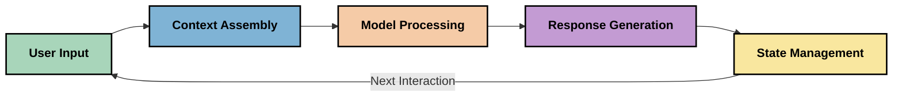
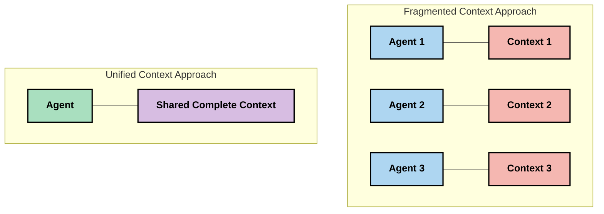

<!--
CO_OP_TRANSLATOR_METADATA:
{
  "original_hash": "5762e8e74dd99d8b7dbb31e69a82561e",
  "translation_date": "2025-08-26T18:51:11+00:00",
  "source_file": "05-AdvancedTopics/mcp-contextengineering/README.md",
  "language_code": "lt"
}
-->
# Konteksto inžinerija: Nauja koncepcija MCP ekosistemoje

## Apžvalga

Konteksto inžinerija yra nauja koncepcija dirbtinio intelekto srityje, kuri nagrinėja, kaip informacija yra struktūrizuojama, perduodama ir palaikoma sąveikaujant klientams ir dirbtinio intelekto paslaugoms. Tobulėjant Model Context Protocol (MCP) ekosistemai, tampa vis svarbiau suprasti, kaip efektyviai valdyti kontekstą. Šiame modulyje pristatoma konteksto inžinerijos sąvoka ir nagrinėjamos jos galimos taikymo sritys MCP įgyvendinimuose.

## Mokymosi tikslai

Baigę šį modulį, galėsite:

- Suprasti naują konteksto inžinerijos koncepciją ir jos galimą vaidmenį MCP taikymuose
- Atpažinti pagrindinius konteksto valdymo iššūkius, kuriuos sprendžia MCP protokolo dizainas
- Išnagrinėti technikas, kaip pagerinti modelio veikimą geriau valdant kontekstą
- Apsvarstyti būdus, kaip matuoti ir vertinti konteksto efektyvumą
- Taikyti šias naujas koncepcijas, siekiant pagerinti dirbtinio intelekto patirtis per MCP sistemą

## Įvadas į konteksto inžineriją

Konteksto inžinerija yra nauja sritis, orientuota į tikslingą informacijos srauto tarp vartotojų, programų ir dirbtinio intelekto modelių projektavimą ir valdymą. Skirtingai nuo jau nusistovėjusių sričių, tokių kaip užklausų (prompt) inžinerija, konteksto inžinerija vis dar yra apibrėžiama praktikų, kurie sprendžia unikalius iššūkius, susijusius su tinkamos informacijos pateikimu dirbtinio intelekto modeliams tinkamu metu.

Didėjant didelių kalbos modelių (LLM) galimybėms, konteksto svarba tampa vis akivaizdesnė. Konteksto kokybė, aktualumas ir struktūra tiesiogiai veikia modelio rezultatus. Konteksto inžinerija nagrinėja šį ryšį ir siekia sukurti veiksmingo konteksto valdymo principus.

> „2025 metais modeliai bus nepaprastai protingi. Tačiau net ir pats protingiausias žmogus negalės efektyviai atlikti savo darbo be konteksto apie tai, ką jis turi daryti... 'Konteksto inžinerija' yra kitas užklausų inžinerijos lygis. Tai yra apie tai, kaip tai padaryti automatiškai dinaminėje sistemoje.“ — Walden Yan, Cognition AI

Konteksto inžinerija gali apimti:

1. **Konteksto atranką**: Nustatyti, kokia informacija yra svarbi konkrečiai užduočiai
2. **Konteksto struktūrizavimą**: Organizuoti informaciją taip, kad modelis ją geriau suprastų
3. **Konteksto pateikimą**: Optimizuoti, kaip ir kada informacija perduodama modeliams
4. **Konteksto palaikymą**: Valdyti konteksto būseną ir evoliuciją laikui bėgant
5. **Konteksto vertinimą**: Matavimą ir tobulinimą konteksto efektyvumo

Šios sritys ypač svarbios MCP ekosistemai, kuri suteikia standartizuotą būdą programoms pateikti kontekstą LLM modeliams.

## Konteksto kelionės perspektyva

Vienas iš būdų vizualizuoti konteksto inžineriją yra atsekti informacijos kelionę per MCP sistemą:

### Pagrindiniai konteksto kelionės etapai:

1. **Vartotojo įvestis**: Pirminė informacija iš vartotojo (tekstai, vaizdai, dokumentai)
2. **Konteksto surinkimas**: Vartotojo įvesties derinimas su sistemos kontekstu, pokalbio istorija ir kita gauta informacija
3. **Modelio apdorojimas**: AI modelis apdoroja surinktą kontekstą
4. **Atsakymo generavimas**: Modelis pateikia atsakymus pagal pateiktą kontekstą
5. **Būsenos valdymas**: Sistema atnaujina savo vidinę būseną pagal sąveiką

Ši perspektyva pabrėžia dinamišką konteksto pobūdį AI sistemose ir kelia svarbius klausimus apie tai, kaip geriausiai valdyti informaciją kiekviename etape.

## Nauji konteksto inžinerijos principai

Konteksto inžinerijos srityje pradeda formuotis pirmieji principai, kurie gali padėti priimant MCP įgyvendinimo sprendimus:

### Principas 1: Dalinkitės kontekstu visiškai

Kontekstas turėtų būti visiškai dalijamasi tarp visų sistemos komponentų, o ne fragmentuojamas tarp kelių agentų ar procesų. Kai kontekstas yra išskaidytas, sprendimai, priimti vienoje sistemos dalyje, gali prieštarauti sprendimams, priimtiems kitur.

MCP taikymuose tai reiškia, kad reikia kurti sistemas, kuriose kontekstas sklandžiai teka per visą procesą, o ne yra suskaidytas.

### Principas 2: Supraskite, kad veiksmai atspindi implicitinius sprendimus

Kiekvienas modelio veiksmas apima implicitinius sprendimus apie tai, kaip interpretuoti kontekstą. Kai keli komponentai veikia skirtinguose kontekstuose, šie implicitiniai sprendimai gali prieštarauti vieni kitiems, sukeldami nenuoseklius rezultatus.

Šis principas turi svarbių pasekmių MCP taikymams:
- Pirmenybę teikite linijiniam sudėtingų užduočių apdorojimui, o ne lygiagrečiam vykdymui su fragmentuotu kontekstu
- Užtikrinkite, kad visi sprendimo taškai turėtų prieigą prie to paties konteksto
- Kurkite sistemas, kuriose vėlesni žingsniai gali matyti visą ankstesnių sprendimų kontekstą

### Principas 3: Subalansuokite konteksto gylį su lango apribojimais

Ilgėjant pokalbiams ir procesams, konteksto langai galiausiai perpildomi. Efektyvi konteksto inžinerija nagrinėja būdus, kaip valdyti šią įtampą tarp išsamaus konteksto ir techninių apribojimų.

Galimi sprendimai:
- Konteksto suspaudimas, išlaikant esminę informaciją ir mažinant žetonų naudojimą
- Progresyvus konteksto įkėlimas pagal aktualumą dabartiniams poreikiams
- Ankstesnių sąveikų santraukų kūrimas, išsaugant pagrindinius sprendimus ir faktus

## Konteksto iššūkiai ir MCP protokolo dizainas

Model Context Protocol (MCP) buvo sukurtas atsižvelgiant į unikalius konteksto valdymo iššūkius. Suprasdami šiuos iššūkius, galime geriau paaiškinti pagrindinius MCP protokolo dizaino aspektus:

### Iššūkis 1: Konteksto lango apribojimai
Dauguma AI modelių turi fiksuotus konteksto langų dydžius, ribojančius, kiek informacijos jie gali apdoroti vienu metu.

**MCP dizaino atsakas:** 
- Protokolas palaiko struktūrizuotą, išteklių pagrindu sukurtą kontekstą, kurį galima efektyviai naudoti
- Ištekliai gali būti suskirstyti į dalis ir įkeliami palaipsniui

### Iššūkis 2: Aktualumo nustatymas
Sunku nustatyti, kuri informacija yra svarbiausia įtraukti į kontekstą.

**MCP dizaino atsakas:**
- Lankstūs įrankiai leidžia dinamiškai gauti informaciją pagal poreikį
- Struktūrizuotos užklausos užtikrina nuoseklų konteksto organizavimą

### Iššūkis 3: Konteksto tęstinumas
Būsenos valdymas tarp sąveikų reikalauja kruopštaus konteksto sekimo.

**MCP dizaino atsakas:**
- Standartizuotas sesijų valdymas
- Aiškiai apibrėžti sąveikos modeliai konteksto evoliucijai

### Iššūkis 4: Daugiarūšis kontekstas
Skirtingų tipų duomenys (tekstai, vaizdai, struktūrizuoti duomenys) reikalauja skirtingo apdorojimo.

**MCP dizaino atsakas:**
- Protokolo dizainas pritaikytas įvairiems turinio tipams
- Standartizuotas daugiarūšės informacijos pateikimas

### Iššūkis 5: Saugumas ir privatumas
Kontekstas dažnai apima jautrią informaciją, kurią būtina apsaugoti.

**MCP dizaino atsakas:**
- Aiškios ribos tarp kliento ir serverio atsakomybių
- Vietinio apdorojimo galimybės, siekiant sumažinti duomenų atskleidimą

Suprasdami šiuos iššūkius ir kaip MCP juos sprendžia, galime sukurti pagrindą pažangesnių konteksto inžinerijos technikų tyrinėjimui.
- [Model Context Protocol Svetainė](https://modelcontextprotocol.io/)
- [Model Context Protocol Specifikacija](https://github.com/modelcontextprotocol/modelcontextprotocol)
- [MCP Dokumentacija](https://modelcontextprotocol.io/docs)
- [MCP C# SDK](https://github.com/modelcontextprotocol/csharp-sdk)
- [MCP Python SDK](https://github.com/modelcontextprotocol/python-sdk)
- [MCP TypeScript SDK](https://github.com/modelcontextprotocol/typescript-sdk)
- [MCP Inspector](https://github.com/modelcontextprotocol/inspector) - Vizualinis testavimo įrankis MCP serveriams

### Konteksto Inžinerijos Straipsniai
- [Nekurkite Multi-Agentų: Konteksto Inžinerijos Principai](https://cognition.ai/blog/dont-build-multi-agents) - Walden Yan įžvalgos apie konteksto inžinerijos principus
- [Praktinis Vadovas Agentų Kūrimo](https://cdn.openai.com/business-guides-and-resources/a-practical-guide-to-building-agents.pdf) - OpenAI vadovas efektyviam agentų dizainui
- [Efektyvių Agentų Kūrimas](https://www.anthropic.com/engineering/building-effective-agents) - Anthropic požiūris į agentų kūrimą

### Susiję Tyrimai
- [Dinaminis Informacijos Paieškos Papildymas Dideliems Kalbos Modeliams](https://arxiv.org/abs/2310.01487) - Tyrimas apie dinaminės paieškos metodus
- [Pasiklydę Viduryje: Kaip Kalbos Modeliai Naudoja Ilgus Kontekstus](https://arxiv.org/abs/2307.03172) - Svarbus tyrimas apie konteksto apdorojimo modelius
- [Hierarchinis Teksto Sąlygotas Vaizdų Generavimas su CLIP Latentais](https://arxiv.org/abs/2204.06125) - DALL-E 2 straipsnis su įžvalgomis apie konteksto struktūrizavimą
- [Konteksto Vaidmens Tyrimas Didelių Kalbos Modelių Architektūrose](https://aclanthology.org/2023.findings-emnlp.124/) - Naujausi tyrimai apie konteksto valdymą
- [Multi-Agentų Bendradarbiavimas: Apžvalga](https://arxiv.org/abs/2304.03442) - Tyrimas apie multi-agentų sistemas ir jų iššūkius

### Papildomi Ištekliai
- [Konteksto Langų Optimizavimo Technikos](https://learn.microsoft.com/en-us/azure/ai-services/openai/concepts/context-window)
- [Pažangios RAG Technikos](https://www.microsoft.com/en-us/research/blog/retrieval-augmented-generation-rag-and-frontier-models/)
- [Semantic Kernel Dokumentacija](https://github.com/microsoft/semantic-kernel)
- [AI Įrankių Rinkinys Konteksto Valdymui](https://github.com/microsoft/aitoolkit)

## Kas Toliau
- [6. Bendruomenės Indėlis](../../06-CommunityContributions/README.md)

---

**Atsakomybės apribojimas**:  
Šis dokumentas buvo išverstas naudojant AI vertimo paslaugą [Co-op Translator](https://github.com/Azure/co-op-translator). Nors siekiame tikslumo, prašome atkreipti dėmesį, kad automatiniai vertimai gali turėti klaidų ar netikslumų. Originalus dokumentas jo gimtąja kalba turėtų būti laikomas autoritetingu šaltiniu. Kritinei informacijai rekomenduojama naudoti profesionalų žmogaus vertimą. Mes neprisiimame atsakomybės už nesusipratimus ar klaidingus interpretavimus, atsiradusius dėl šio vertimo naudojimo.