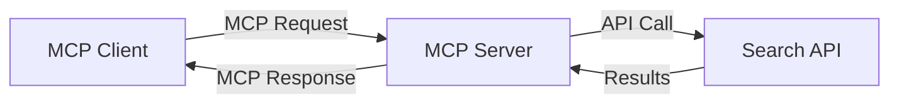
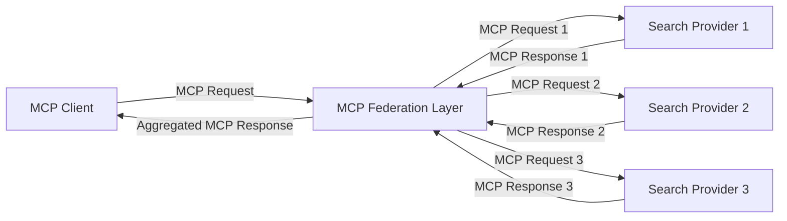
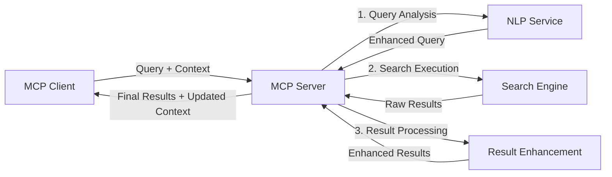

<!--
CO_OP_TRANSLATOR_METADATA:
{
  "original_hash": "333a03e51f90bdf3e6f1ba1694c73f36",
  "translation_date": "2025-08-26T18:59:15+00:00",
  "source_file": "05-AdvancedTopics/mcp-realtimesearch/README.md",
  "language_code": "lt"
}
-->
## Atsakomybės apribojimas dėl kodo pavyzdžių

> **Svarbi pastaba**: Žemiau pateikti kodo pavyzdžiai demonstruoja Model Context Protocol (MCP) integraciją su interneto paieškos funkcionalumu. Nors jie atitinka oficialių MCP SDK struktūras ir modelius, jie yra supaprastinti mokymo tikslais.
> 
> Šie pavyzdžiai parodo:
> 
> 1. **Python įgyvendinimas**: FastMCP serverio įgyvendinimas, kuris teikia interneto paieškos įrankį ir jungiasi prie išorinio paieškos API. Šis pavyzdys demonstruoja tinkamą gyvavimo ciklo valdymą, konteksto tvarkymą ir įrankio įgyvendinimą pagal [oficialaus MCP Python SDK](https://github.com/modelcontextprotocol/python-sdk) modelius. Serveris naudoja rekomenduojamą Streamable HTTP transportą, kuris pakeitė senesnį SSE transportą gamybos diegimuose.
> 
> 2. **JavaScript įgyvendinimas**: TypeScript/JavaScript įgyvendinimas naudojant FastMCP modelį iš [oficialaus MCP TypeScript SDK](https://github.com/modelcontextprotocol/typescript-sdk), kad būtų sukurtas paieškos serveris su tinkamais įrankių apibrėžimais ir klientų jungtimis. Jis laikosi naujausių rekomenduojamų modelių sesijos valdymui ir konteksto išsaugojimui.
> 
> Šiems pavyzdžiams reikėtų papildomo klaidų tvarkymo, autentifikacijos ir specifinio API integracijos kodo, kad būtų galima naudoti gamybos aplinkoje. Pateikti paieškos API galiniai taškai (`https://api.search-service.example/search`) yra tik pavyzdžiai ir turėtų būti pakeisti tikrais paieškos paslaugų galiniais taškais.
> 
> Norėdami gauti išsamią įgyvendinimo informaciją ir naujausius metodus, apsilankykite [oficialioje MCP specifikacijoje](https://spec.modelcontextprotocol.io/) ir SDK dokumentacijoje.

## Pagrindinės sąvokos

### Model Context Protocol (MCP) sistema

MCP pagrindas yra standartizuotas būdas AI modeliams, programoms ir paslaugoms keistis kontekstu. Realaus laiko interneto paieškoje ši sistema yra būtina, kad būtų sukurtos nuoseklios, daugiapakopės paieškos patirtys. Pagrindiniai komponentai apima:

1. **Kliento-serverio architektūra**: MCP aiškiai atskiria paieškos klientus (užklausų teikėjus) ir paieškos serverius (paslaugų teikėjus), leidžiant lanksčius diegimo modelius.

2. **JSON-RPC komunikacija**: Protokolas naudoja JSON-RPC žinučių mainams, todėl jis suderinamas su interneto technologijomis ir lengvai įgyvendinamas įvairiose platformose.

3. **Konteksto valdymas**: MCP apibrėžia struktūrizuotus metodus, kaip išlaikyti, atnaujinti ir naudoti paieškos kontekstą per kelias sąveikas.

4. **Įrankių apibrėžimai**: Paieškos galimybės pateikiamos kaip standartizuoti įrankiai su aiškiai apibrėžtais parametrais ir grąžinimo reikšmėmis.

5. **Srautinio perdavimo palaikymas**: Protokolas palaiko rezultatų srautinį perdavimą, kuris yra būtinas realaus laiko paieškai, kur rezultatai gali būti pateikiami palaipsniui.

### Interneto paieškos integracijos modeliai

Integruojant MCP su interneto paieška, išryškėja keli modeliai:

#### 1. Tiesioginė paieškos teikėjo integracija

Šiame modelyje MCP serveris tiesiogiai sąveikauja su viena ar keliomis paieškos API, MCP užklausas paversdamas API specifiniais skambučiais ir formatuodamas rezultatus kaip MCP atsakymus.

#### 2. Federuota paieška su konteksto išsaugojimu

Šis modelis paskirsto paieškos užklausas keliems MCP suderinamiems paieškos teikėjams, kurie gali specializuotis skirtinguose turinio ar paieškos galimybių tipuose, tuo pačiu išlaikant vieningą kontekstą.

#### 3. Kontekstu praturtinta paieškos grandinė

Šiame modelyje paieškos procesas padalijamas į kelis etapus, kur kontekstas praturtinamas kiekviename žingsnyje, todėl rezultatai tampa vis labiau aktualūs.

### Paieškos konteksto komponentai

MCP pagrįstoje interneto paieškoje kontekstas paprastai apima:

- **Užklausų istoriją**: Ankstesnės paieškos užklausos sesijoje
- **Vartotojo nuostatas**: Kalba, regionas, saugios paieškos nustatymai
- **Sąveikos istoriją**: Kurie rezultatai buvo paspausti, laikas praleistas prie rezultatų
- **Paieškos parametrus**: Filtrai, rūšiavimo tvarka ir kiti paieškos modifikatoriai
- **Domeno žinias**: Kontekstas, susijęs su paieškos tema
- **Laiko kontekstą**: Su laiku susijusius aktualumo veiksnius
- **Šaltinių nuostatas**: Patikimi ar pageidaujami informacijos šaltiniai

## Naudojimo atvejai ir taikymas

### Tyrimai ir informacijos rinkimas

MCP pagerina tyrimų darbo eigą:

- Išlaikant tyrimų kontekstą per paieškos sesijas
- Leidžiant sudėtingesnes ir kontekstiškai aktualias užklausas
- Palaikant daugiakrypčią paieškos federaciją
- Palengvinant žinių išgavimą iš paieškos rezultatų

### Realaus laiko naujienų ir tendencijų stebėjimas

MCP pagrįsta paieška siūlo privalumus naujienų stebėjimui:

- Beveik realaus laiko naujienų istorijų atradimas
- Kontekstiškai filtruojama aktuali informacija
- Temų ir subjektų stebėjimas per kelis šaltinius
- Personalizuoti naujienų pranešimai pagal vartotojo kontekstą

### AI papildytas naršymas ir tyrimai

MCP sukuria naujas galimybes AI papildytam naršymui:

- Kontekstiškai pritaikytos paieškos rekomendacijos pagal dabartinę naršymo veiklą
- Sklandi interneto paieškos integracija su LLM pagrįstais asistentais
- Daugiapakopė paieškos tobulinimas su išlaikytu kontekstu
- Patobulintas faktų tikrinimas ir informacijos patvirtinimas

## Ateities tendencijos ir inovacijos

### MCP evoliucija interneto paieškoje

Žvelgiant į ateitį, tikimasi, kad MCP evoliucionuos spręsti:

- **Multimodalinę paiešką**: Teksto, vaizdų, garso ir vaizdo paieškos integraciją su išlaikytu kontekstu
- **Decentralizuotą paiešką**: Palaikant paskirstytas ir federuotas paieškos ekosistemas
- **Paieškos privatumas**: Kontekstui jautrūs privatumo išsaugojimo mechanizmai paieškoje  
- **Užklausų supratimas**: Gili semantinė natūralios kalbos paieškos užklausų analizė  

### Galimi technologijų pažangumai  

Naujos technologijos, kurios formuos MCP paieškos ateitį:  

1. **Neuroninės paieškos architektūros**: MCP optimizuotos paieškos sistemos, pagrįstos įterpimais  
2. **Personalizuotas paieškos kontekstas**: Individualių vartotojų paieškos modelių mokymasis laikui bėgant  
3. **Žinių grafų integracija**: Kontekstinė paieška, praturtinta specifinių sričių žinių grafais  
4. **Kryžminis modalinis kontekstas**: Konteksto išlaikymas skirtinguose paieškos modalumuose  

## Praktinės užduotys  

### Užduotis 1: Pagrindinio MCP paieškos proceso nustatymas  

Šioje užduotyje išmoksite:  
- Konfigūruoti pagrindinę MCP paieškos aplinką  
- Įgyvendinti konteksto valdiklius interneto paieškai  
- Testuoti ir patvirtinti konteksto išsaugojimą per paieškos iteracijas  

### Užduotis 2: Mokslinių tyrimų asistento kūrimas naudojant MCP paiešką  

Sukurkite pilną programą, kuri:  
- Apdoroja natūralios kalbos mokslinių tyrimų klausimus  
- Atlieka kontekstui jautrias interneto paieškas  
- Sintezuoja informaciją iš kelių šaltinių  
- Pateikia organizuotus tyrimų rezultatus  

### Užduotis 3: MCP pagrįstos daugiakryptės paieškos federacijos įgyvendinimas  

Pažangi užduotis, apimanti:  
- Kontekstui jautrų užklausų paskirstymą keliems paieškos varikliams  
- Rezultatų reitingavimą ir agregavimą  
- Kontekstinį paieškos rezultatų dubliavimo šalinimą  
- Šaltiniui specifinių metaduomenų valdymą  

## Papildomi ištekliai  

- [Model Context Protocol Specification](https://spec.modelcontextprotocol.io/) - Oficialus MCP specifikacijos ir detalus protokolo dokumentas  
- [Model Context Protocol Documentation](https://modelcontextprotocol.io/) - Išsamūs mokymai ir įgyvendinimo vadovai  
- [MCP Python SDK](https://github.com/modelcontextprotocol/python-sdk) - Oficialus MCP protokolo Python įgyvendinimas  
- [MCP TypeScript SDK](https://github.com/modelcontextprotocol/typescript-sdk) - Oficialus MCP protokolo TypeScript įgyvendinimas  
- [MCP Reference Servers](https://github.com/modelcontextprotocol/servers) - MCP serverių pavyzdiniai įgyvendinimai  
- [Bing Web Search API Documentation](https://learn.microsoft.com/en-us/bing/search-apis/bing-web-search/overview) - Microsoft interneto paieškos API  
- [Google Custom Search JSON API](https://developers.google.com/custom-search/v1/overview) - Google programuojamas paieškos variklis  
- [SerpAPI Documentation](https://serpapi.com/search-api) - Paieškos variklio rezultatų puslapio API  
- [Meilisearch Documentation](https://www.meilisearch.com/docs) - Atvirojo kodo paieškos variklis  
- [Elasticsearch Documentation](https://www.elastic.co/guide/index.html) - Paskirstytas paieškos ir analizės variklis  
- [LangChain Documentation](https://python.langchain.com/docs/get_started/introduction) - Programų kūrimas su LLM  

## Mokymosi rezultatai  

Baigę šį modulį, galėsite:  

- Suprasti realaus laiko interneto paieškos pagrindus ir jos iššūkius  
- Paaiškinti, kaip Model Context Protocol (MCP) pagerina realaus laiko interneto paieškos galimybes  
- Įgyvendinti MCP pagrįstas paieškos sprendimus naudojant populiarias sistemas ir API  
- Kurti ir diegti mastelio keičiamas, aukštos kokybės paieškos architektūras su MCP  
- Taikyti MCP koncepcijas įvairiems naudojimo atvejams, įskaitant semantinę paiešką, mokslinių tyrimų asistavimą ir AI praturtintą naršymą  
- Įvertinti naujas tendencijas ir ateities inovacijas MCP pagrįstose paieškos technologijose  

### Pasitikėjimo ir saugumo aspektai  

Įgyvendinant MCP pagrįstas interneto paieškos sprendimus, prisiminkite šiuos svarbius MCP specifikacijos principus:  

1. **Vartotojo sutikimas ir kontrolė**: Vartotojai turi aiškiai sutikti ir suprasti visus duomenų prieigos ir operacijų aspektus. Tai ypač svarbu interneto paieškos įgyvendinimams, kurie gali pasiekti išorinius duomenų šaltinius.  

2. **Duomenų privatumas**: Užtikrinkite tinkamą paieškos užklausų ir rezultatų tvarkymą, ypač kai jie gali turėti jautrios informacijos. Įgyvendinkite tinkamas prieigos kontrolės priemones vartotojų duomenų apsaugai.  

3. **Įrankių saugumas**: Įgyvendinkite tinkamą autorizaciją ir validaciją paieškos įrankiams, nes jie gali kelti saugumo riziką per savavališką kodo vykdymą. Įrankių elgsenos aprašymai turėtų būti laikomi nepatikimais, nebent jie gauti iš patikimo serverio.  

4. **Aiški dokumentacija**: Pateikite aiškią dokumentaciją apie MCP pagrįsto paieškos įgyvendinimo galimybes, apribojimus ir saugumo aspektus, laikantis MCP specifikacijos įgyvendinimo gairių.  

5. **Patikimi sutikimo procesai**: Sukurkite patikimus sutikimo ir autorizacijos procesus, kurie aiškiai paaiškina, ką kiekvienas įrankis daro prieš jį autorizuojant, ypač įrankiams, kurie sąveikauja su išoriniais interneto ištekliais.  

Išsamią informaciją apie MCP saugumo ir pasitikėjimo aspektus rasite [oficialioje dokumentacijoje](https://modelcontextprotocol.io/specification/2025-03-26#security-and-trust-%26-safety).  

## Kas toliau  

- [5.12 Entra ID Authentication for Model Context Protocol Servers](../mcp-security-entra/README.md)  

---

**Atsakomybės apribojimas**:  
Šis dokumentas buvo išverstas naudojant AI vertimo paslaugą [Co-op Translator](https://github.com/Azure/co-op-translator). Nors siekiame tikslumo, atkreipkite dėmesį, kad automatiniai vertimai gali turėti klaidų ar netikslumų. Originalus dokumentas jo gimtąja kalba turėtų būti laikomas autoritetingu šaltiniu. Kritinei informacijai rekomenduojama profesionali žmogaus vertimo paslauga. Mes neprisiimame atsakomybės už nesusipratimus ar klaidingus aiškinimus, atsiradusius dėl šio vertimo naudojimo.