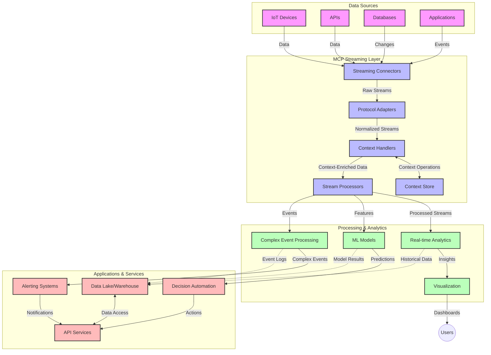

<!--
CO_OP_TRANSLATOR_METADATA:
{
  "original_hash": "195f7287638b77a549acadd96c8f981c",
  "translation_date": "2025-08-26T18:56:55+00:00",
  "source_file": "05-AdvancedTopics/mcp-realtimestreaming/README.md",
  "language_code": "lt"
}
-->
# Modelio konteksto protokolas realaus laiko duomenų srautams

## Apžvalga

Realaus laiko duomenų srautai tapo būtini šiuolaikiniame duomenimis grįstame pasaulyje, kur verslai ir programos reikalauja nedelsiant gauti informaciją, kad galėtų priimti laiku sprendimus. Modelio konteksto protokolas (MCP) yra reikšmingas žingsnis optimizuojant šiuos realaus laiko srautų procesus, didinant duomenų apdorojimo efektyvumą, išlaikant kontekstinį vientisumą ir gerinant bendrą sistemos našumą.

Šiame modulyje nagrinėjama, kaip MCP transformuoja realaus laiko duomenų srautus, suteikdamas standartizuotą požiūrį į konteksto valdymą tarp AI modelių, srautų platformų ir programų.

## Įvadas į realaus laiko duomenų srautus

Realaus laiko duomenų srautai yra technologinis principas, leidžiantis nuolat perduoti, apdoroti ir analizuoti duomenis jų generavimo metu, suteikiant sistemoms galimybę nedelsiant reaguoti į naują informaciją. Skirtingai nuo tradicinio paketinio apdorojimo, kuris veikia su statiniais duomenų rinkiniais, srautinis apdorojimas vyksta judant duomenims, pateikiant įžvalgas ir veiksmus su minimaliu vėlavimu.

### Pagrindinės realaus laiko duomenų srautų sąvokos:

- **Nuolatinis duomenų srautas**: Duomenys apdorojami kaip nenutrūkstamas, nesibaigiantis įvykių ar įrašų srautas.
- **Mažas vėlavimas**: Sistemos sukurtos taip, kad sumažintų laiką tarp duomenų generavimo ir apdorojimo.
- **Mastelio keitimas**: Srautų architektūros turi valdyti kintamus duomenų kiekius ir greitį.
- **Atsparumas gedimams**: Sistemos turi būti atsparios gedimams, kad užtikrintų nenutrūkstamą duomenų srautą.
- **Būsenos apdorojimas**: Konteksto išlaikymas tarp įvykių yra būtinas prasmingai analizei.

### Modelio konteksto protokolas ir realaus laiko srautai

Modelio konteksto protokolas (MCP) sprendžia kelias svarbias problemas realaus laiko srautų aplinkose:

1. **Kontekstinis tęstinumas**: MCP standartizuoja, kaip kontekstas išlaikomas tarp paskirstytų srautų komponentų, užtikrinant, kad AI modeliai ir apdorojimo mazgai turėtų prieigą prie svarbaus istorinio ir aplinkos konteksto.

2. **Efektyvus būsenos valdymas**: MCP suteikia struktūrizuotus mechanizmus konteksto perdavimui, sumažindamas būsenos valdymo apkrovą srautų vamzdynuose.

3. **Sąveikumas**: MCP sukuria bendrą kalbą konteksto dalijimuisi tarp įvairių srautų technologijų ir AI modelių, leidžiant lankstesnes ir išplečiamas architektūras.

4. **Srautams optimizuotas kontekstas**: MCP įgyvendinimai gali prioritizuoti, kurie konteksto elementai yra svarbiausi realaus laiko sprendimų priėmimui, optimizuojant tiek našumą, tiek tikslumą.

5. **Prisitaikantis apdorojimas**: Tinkamai valdant kontekstą per MCP, srautų sistemos gali dinamiškai prisitaikyti prie besikeičiančių sąlygų ir duomenų modelių.

Šiuolaikinėse programose, pradedant IoT jutiklių tinklais ir baigiant finansų prekybos platformomis, MCP integracija su srautų technologijomis leidžia protingesnį, kontekstu pagrįstą apdorojimą, kuris gali tinkamai reaguoti į sudėtingas, besikeičiančias situacijas realiu laiku.

## Mokymosi tikslai

Baigę šią pamoką, galėsite:

- Suprasti realaus laiko duomenų srautų pagrindus ir jų iššūkius
- Paaiškinti, kaip Modelio konteksto protokolas (MCP) pagerina realaus laiko duomenų srautus
- Įgyvendinti MCP pagrįstus srautų sprendimus naudojant populiarias platformas, tokias kaip Kafka ir Pulsar
- Projektuoti ir diegti atsparias gedimams, aukšto našumo srautų architektūras su MCP
- Taikyti MCP koncepcijas IoT, finansų prekybos ir AI pagrįstų analitikos atvejų naudojimui
- Įvertinti naujas tendencijas ir ateities inovacijas MCP pagrįstose srautų technologijose

### Apibrėžimas ir reikšmė

Realaus laiko duomenų srautai apima nuolatinį duomenų generavimą, apdorojimą ir pristatymą su minimaliu vėlavimu. Skirtingai nuo paketinio apdorojimo, kur duomenys renkami ir apdorojami grupėmis, srautų duomenys apdorojami palaipsniui jų atvykimo metu, leidžiant nedelsiant gauti įžvalgas ir veiksmus.

Pagrindinės realaus laiko duomenų srautų savybės:

- **Mažas vėlavimas**: Duomenų apdorojimas ir analizė per milisekundes ar sekundes
- **Nuolatinis srautas**: Nenutrūkstami duomenų srautai iš įvairių šaltinių
- **Nedelsiant apdorojimas**: Duomenų analizė jų atvykimo metu, o ne grupėmis
- **Įvykių pagrįsta architektūra**: Reagavimas į įvykius jų atsiradimo metu

### Tradicinių duomenų srautų iššūkiai

Tradiciniai duomenų srautų metodai susiduria su keliais apribojimais:

1. **Konteksto praradimas**: Sunku išlaikyti kontekstą paskirstytose sistemose
2. **Mastelio keitimo problemos**: Iššūkiai valdant didelės apimties ir didelio greičio duomenis
3. **Integracijos sudėtingumas**: Sąveikos problemos tarp skirtingų sistemų
4. **Vėlavimo valdymas**: Pusiausvyros tarp pralaidumo ir apdorojimo laiko užtikrinimas
5. **Duomenų nuoseklumas**: Duomenų tikslumo ir išsamumo užtikrinimas visame sraute

## Modelio konteksto protokolo (MCP) supratimas

### Kas yra MCP?

Modelio konteksto protokolas (MCP) yra standartizuotas komunikacijos protokolas, skirtas efektyviai sąveikai tarp AI modelių ir programų. Realaus laiko duomenų srautų kontekste MCP suteikia sistemą:

- Konteksto išsaugojimui visame duomenų vamzdyne
- Duomenų mainų formatų standartizavimui
- Didelių duomenų rinkinių perdavimo optimizavimui
- Modelio ir programos komunikacijos gerinimui

### Pagrindiniai komponentai ir architektūra

MCP architektūra realaus laiko srautams apima kelis pagrindinius komponentus:

1. **Konteksto valdytojai**: Valdo ir palaiko kontekstinę informaciją visame srautų vamzdyne
2. **Srautų procesoriai**: Apdoroja gaunamus duomenų srautus, naudodami kontekstu pagrįstus metodus
3. **Protokolo adapteriai**: Konvertuoja tarp skirtingų srautų protokolų, išlaikant kontekstą
4. **Konteksto saugykla**: Efektyviai saugo ir atkuria kontekstinę informaciją
5. **Srautų jungtys**: Jungiasi prie įvairių srautų platformų (Kafka, Pulsar, Kinesis ir kt.)



### Kaip MCP pagerina realaus laiko duomenų apdorojimą

MCP sprendžia tradicinius srautų iššūkius per:

- **Kontekstinį vientisumą**: Išlaikant ryšius tarp duomenų taškų visame vamzdyne
- **Optimizuotą perdavimą**: Sumažinant duomenų mainų perteklumą per protingą konteksto valdymą
- **Standartizuotas sąsajas**: Suteikiant nuoseklius API srautų komponentams
- **Sumažintą vėlavimą**: Mažinant apdorojimo apkrovą per efektyvų konteksto valdymą
- **Padidintą mastelio keitimą**: Palaikant horizontalų mastelio keitimą, išlaikant kontekstą

## Integracija ir įgyvendinimas

Realaus laiko duomenų srautų sistemos reikalauja kruopštaus architektūrinio projektavimo ir įgyvendinimo, kad būtų išlaikytas tiek našumas, tiek kontekstinis vientisumas. Modelio konteksto protokolas siūlo standartizuotą požiūrį į AI modelių ir srautų technologijų integraciją, leidžiant sudėtingesnius, kontekstu pagrįstus apdorojimo vamzdynus.

### MCP integracijos apžvalga srautų architektūrose

MCP įgyvendinimas realaus laiko srautų aplinkose apima kelis svarbius aspektus:

1. **Konteksto serializacija ir transportavimas**: MCP suteikia efektyvius mechanizmus kontekstinės informacijos kodavimui srautų duomenų paketų viduje, užtikrinant, kad esminis kontekstas seka duomenis visame apdorojimo vamzdyne. Tai apima standartizuotus serializacijos formatus, optimizuotus srautų transportui.

2. **Būsenos apdorojimas**: MCP leidžia protingesnį būsenos apdorojimą, išlaikant nuoseklų konteksto atvaizdavimą apdorojimo mazguose. Tai ypač vertinga paskirstytose srautų architektūrose, kur būsenos valdymas tradiciškai yra sudėtingas.

3. **Įvykių laikas vs apdorojimo laikas**: MCP įgyvendinimai srautų sistemose turi spręsti bendrą iššūkį atskirti, kada įvykiai įvyko ir kada jie apdorojami. Protokolas gali įtraukti laikinį kontekstą, kuris išsaugo įvykių laiko semantiką.

4. **Atgalinio spaudimo valdymas**: Standartizuojant konteksto valdymą, MCP padeda valdyti atgalinį spaudimą srautų sistemose, leidžiant komponentams komunikuoti savo apdorojimo galimybes ir atitinkamai reguliuoti srautą.

5. **Konteksto langų ir agregavimo valdymas**: MCP palengvina sudėtingesnes langų operacijas, suteikdamas struktūrizuotus laikinio ir santykinio konteksto atvaizdavimus, leidžiant prasmingesnius agregavimus per įvykių srautus.

6. **Tiksliai vieną kartą apdorojimas**: Srautų sistemose, reikalaujančiose tiksliai vieną kartą semantikos, MCP gali įtraukti apdorojimo metaduomenis, padedančius sekti ir patikrinti apdorojimo būseną paskirstytuose komponentuose.

MCP įgyvendinimas įvairiose srautų technologijose sukuria vieningą požiūrį į konteksto valdymą, sumažinant poreikį pritaikyti integracijos kodą ir pagerinant sistemos gebėjimą išlaikyti prasmingą kontekstą, kai duomenys teka per vamzdyną.

### MCP įvairiuose duomenų srautų pagrinduose

Šie pavyzdžiai atitinka dabartinę MCP specifikaciją, kuri orientuota į JSON-RPC pagrįstą protokolą su atskirais transportavimo mechanizmais. Kodas demonstruoja, kaip galite įgyvendinti pritaikytus transportus, kurie integruoja srautų platformas, tokias kaip Kafka ir Pulsar, išlaikant pilną suderinamumą su MCP protokolu.

Pavyzdžiai skirti parodyti, kaip srautų platformos gali būti integruotos su MCP, kad būtų užtikrintas realaus laiko duomenų apdorojimas, išlaikant kontekstinį sąmoningumą, kuris yra MCP pagrindas. Šis požiūris užtikrina, kad kodo pavyzdžiai tiksliai atspindi dabartinę MCP specifikacijos būklę 2025 m. birželio mėn.

MCP galima integruoti su populiariais srautų pagrindais, įskaitant:

#### Apache Kafka integracija

```python
import asyncio
import json
from typing import Dict, Any, Optional
from confluent_kafka import Consumer, Producer, KafkaError
from mcp.client import Client, ClientCapabilities
from mcp.core.message import JsonRpcMessage
from mcp.core.transports import Transport

# Custom transport class to bridge MCP with Kafka
class KafkaMCPTransport(Transport):
    def __init__(self, bootstrap_servers: str, input_topic: str, output_topic: str):
        self.bootstrap_servers = bootstrap_servers
        self.input_topic = input_topic
        self.output_topic = output_topic
        self.producer = Producer({'bootstrap.servers': bootstrap_servers})
        self.consumer = Consumer({
            'bootstrap.servers': bootstrap_servers,
            'group.id': 'mcp-client-group',
            'auto.offset.reset': 'earliest'
        })
        self.message_queue = asyncio.Queue()
        self.running = False
        self.consumer_task = None
        
    async def connect(self):
        """Connect to Kafka and start consuming messages"""
        self.consumer.subscribe([self.input_topic])
        self.running = True
        self.consumer_task = asyncio.create_task(self._consume_messages())
        return self
        
    async def _consume_messages(self):
        """Background task to consume messages from Kafka and queue them for processing"""
        while self.running:
            try:
                msg = self.consumer.poll(1.0)
                if msg is None:
                    await asyncio.sleep(0.1)
                    continue
                
                if msg.error():
                    if msg.error().code() == KafkaError._PARTITION_EOF:
                        continue
                    print(f"Consumer error: {msg.error()}")
                    continue
                
                # Parse the message value as JSON-RPC
                try:
                    message_str = msg.value().decode('utf-8')
                    message_data = json.loads(message_str)
                    mcp_message = JsonRpcMessage.from_dict(message_data)
                    await self.message_queue.put(mcp_message)
                except Exception as e:
                    print(f"Error parsing message: {e}")
            except Exception as e:
                print(f"Error in consumer loop: {e}")
                await asyncio.sleep(1)
    
    async def read(self) -> Optional[JsonRpcMessage]:
        """Read the next message from the queue"""
        try:
            message = await self.message_queue.get()
            return message
        except Exception as e:
            print(f"Error reading message: {e}")
            return None
    
    async def write(self, message: JsonRpcMessage) -> None:
        """Write a message to the Kafka output topic"""
        try:
            message_json = json.dumps(message.to_dict())
            self.producer.produce(
                self.output_topic,
                message_json.encode('utf-8'),
                callback=self._delivery_report
            )
            self.producer.poll(0)  # Trigger callbacks
        except Exception as e:
            print(f"Error writing message: {e}")
    
    def _delivery_report(self, err, msg):
        """Kafka producer delivery callback"""
        if err is not None:
            print(f'Message delivery failed: {err}')
        else:
            print(f'Message delivered to {msg.topic()} [{msg.partition()}]')
    
    async def close(self) -> None:
        """Close the transport"""
        self.running = False
        if self.consumer_task:
            self.consumer_task.cancel()
            try:
                await self.consumer_task
            except asyncio.CancelledError:
                pass
        self.consumer.close()
        self.producer.flush()

# Example usage of the Kafka MCP transport
async def kafka_mcp_example():
    # Create MCP client with Kafka transport
    client = Client(
        {"name": "kafka-mcp-client", "version": "1.0.0"},
        ClientCapabilities({})
    )
    
    # Create and connect the Kafka transport
    transport = KafkaMCPTransport(
        bootstrap_servers="localhost:9092",
        input_topic="mcp-responses",
        output_topic="mcp-requests"
    )
    
    await client.connect(transport)
    
    try:
        # Initialize the MCP session
        await client.initialize()
        
        # Example of executing a tool via MCP
        response = await client.execute_tool(
            "process_data",
            {
                "data": "sample data",
                "metadata": {
                    "source": "sensor-1",
                    "timestamp": "2025-06-12T10:30:00Z"
                }
            }
        )
        
        print(f"Tool execution response: {response}")
        
        # Clean shutdown
        await client.shutdown()
    finally:
        await transport.close()

# Run the example
if __name__ == "__main__":
    asyncio.run(kafka_mcp_example())
```

#### Apache Pulsar įgyvendinimas

```python
import asyncio
import json
import pulsar
from typing import Dict, Any, Optional
from mcp.core.message import JsonRpcMessage
from mcp.core.transports import Transport
from mcp.server import Server, ServerOptions
from mcp.server.tools import Tool, ToolExecutionContext, ToolMetadata

# Create a custom MCP transport that uses Pulsar
class PulsarMCPTransport(Transport):
    def __init__(self, service_url: str, request_topic: str, response_topic: str):
        self.service_url = service_url
        self.request_topic = request_topic
        self.response_topic = response_topic
        self.client = pulsar.Client(service_url)
        self.producer = self.client.create_producer(response_topic)
        self.consumer = self.client.subscribe(
            request_topic,
            "mcp-server-subscription",
            consumer_type=pulsar.ConsumerType.Shared
        )
        self.message_queue = asyncio.Queue()
        self.running = False
        self.consumer_task = None
    
    async def connect(self):
        """Connect to Pulsar and start consuming messages"""
        self.running = True
        self.consumer_task = asyncio.create_task(self._consume_messages())
        return self
    
    async def _consume_messages(self):
        """Background task to consume messages from Pulsar and queue them for processing"""
        while self.running:
            try:
                # Non-blocking receive with timeout
                msg = self.consumer.receive(timeout_millis=500)
                
                # Process the message
                try:
                    message_str = msg.data().decode('utf-8')
                    message_data = json.loads(message_str)
                    mcp_message = JsonRpcMessage.from_dict(message_data)
                    await self.message_queue.put(mcp_message)
                    
                    # Acknowledge the message
                    self.consumer.acknowledge(msg)
                except Exception as e:
                    print(f"Error processing message: {e}")
                    # Negative acknowledge if there was an error
                    self.consumer.negative_acknowledge(msg)
            except Exception as e:
                # Handle timeout or other exceptions
                await asyncio.sleep(0.1)
    
    async def read(self) -> Optional[JsonRpcMessage]:
        """Read the next message from the queue"""
        try:
            message = await self.message_queue.get()
            return message
        except Exception as e:
            print(f"Error reading message: {e}")
            return None
    
    async def write(self, message: JsonRpcMessage) -> None:
        """Write a message to the Pulsar output topic"""
        try:
            message_json = json.dumps(message.to_dict())
            self.producer.send(message_json.encode('utf-8'))
        except Exception as e:
            print(f"Error writing message: {e}")
    
    async def close(self) -> None:
        """Close the transport"""
        self.running = False
        if self.consumer_task:
            self.consumer_task.cancel()
            try:
                await self.consumer_task
            except asyncio.CancelledError:
                pass
        self.consumer.close()
        self.producer.close()
        self.client.close()

# Define a sample MCP tool that processes streaming data
@Tool(
    name="process_streaming_data",
    description="Process streaming data with context preservation",
    metadata=ToolMetadata(
        required_capabilities=["streaming"]
    )
)
async def process_streaming_data(
    ctx: ToolExecutionContext,
    data: str,
    source: str,
    priority: str = "medium"
) -> Dict[str, Any]:
    """
    Process streaming data while preserving context
    
    Args:
        ctx: Tool execution context
        data: The data to process
        source: The source of the data
        priority: Priority level (low, medium, high)
        
    Returns:
        Dict containing processed results and context information
    """
    # Example processing that leverages MCP context
    print(f"Processing data from {source} with priority {priority}")
    
    # Access conversation context from MCP
    conversation_id = ctx.conversation_id if hasattr(ctx, 'conversation_id') else "unknown"
    
    # Return results with enhanced context
    return {
        "processed_data": f"Processed: {data}",
        "context": {
            "conversation_id": conversation_id,
            "source": source,
            "priority": priority,
            "processing_timestamp": ctx.get_current_time_iso()
        }
    }

# Example MCP server implementation using Pulsar transport
async def run_mcp_server_with_pulsar():
    # Create MCP server
    server = Server(
        {"name": "pulsar-mcp-server", "version": "1.0.0"},
        ServerOptions(
            capabilities={"streaming": True}
        )
    )
    
    # Register our tool
    server.register_tool(process_streaming_data)
    
    # Create and connect Pulsar transport
    transport = PulsarMCPTransport(
        service_url="pulsar://localhost:6650",
        request_topic="mcp-requests",
        response_topic="mcp-responses"
    )
    
    try:
        # Start the server with the Pulsar transport
        await server.run(transport)
    finally:
        await transport.close()

# Run the server
if __name__ == "__main__":
    asyncio.run(run_mcp_server_with_pulsar())
```

### Geriausios praktikos diegimui

Įgyvendinant MCP realaus laiko srautams:

1. **Projektuokite atsparumą gedimams**:
   - Įgyvendinkite tinkamą klaidų valdymą
   - Naudokite „dead-letter“ eilutes nepavykusiems pranešimams
   - Projektuokite idempotentinius procesorius

2. **Optimizuokite našumą**:
   - Konfigūruokite tinkamus buferių dydžius
   - Naudokite paketavimą, kur tai tinkama
   - Įgyvendinkite atgalinio spaudimo mechanizmus

3. **Stebėkite ir stebėkite**:
   - Sekite srautų apdorojimo metrikas
   - Stebėkite konteksto perdavimą
   - Nustatykite įspėjimus dėl anomalijų

4. **Užtikrinkite srautų saugumą**:
   - Įgyvendinkite šifravimą jautriems duomenims
   - Naudokite autentifikaciją ir autorizaciją
   - Taikykite tinkamas prieigos kontrolės priemones

### MCP IoT ir Edge Computing srityje

MCP pagerina IoT srautus per:

- Konteksto išsaugojimą visame apdorojimo vamzdyne
- Efektyvų duomenų srautą nuo krašto iki debesies
- Realiojo laiko analitiką IoT duomenų srautuose
- Įrenginio komunikaciją su kontekstu

Pavyzdys: Išmaniųjų miestų jutiklių tinklai  
```
Sensors → Edge Gateways → MCP Stream Processors → Real-time Analytics → Automated Responses
```

### Vaidmuo finansiniuose sandoriuose ir aukšto dažnio prekyboje

MCP suteikia reikšmingų privalumų finansinių duomenų srautams:

- Itin mažo vėlavimo apdorojimas prekybos sprendimams
- Sandorio konteksto išlaikymas viso apdorojimo metu
- Sudėtingų įvykių apdorojimas su kontekstiniu sąmoningumu
- Duomenų nuoseklumo užtikrinimas paskirstytose prekybos sistemose

### AI pagrįstos duomenų analitikos gerinimas

MCP sukuria naujas galimybes srautų analitikoms:

- Realiojo laiko modelio mokymas ir prognozavimas
- Nuolatinis mokymasis iš srautų duomenų
- Kontekstu pagrįsta funkcijų ištraukimas
- Daugelio modelių prognozavimo vamzdynai su išsaugotu kontekstu

## Ateities tendencijos ir inovacijos

### MCP evoliucija realaus laiko aplinkose

Žvelgiant į ateitį, tikimasi, kad MCP evoliucionuos spręsti:

- **Kvantinio kompiuterio integraciją**: Pasiruošimas kvantiniams srautų sistemoms
- **Krašto-natūralų apdorojimą**: Daugiau kontekstu pagrįsto apdorojimo krašto įrenginiuose
- **Autonominį srautų valdymą**: Savarankiškai optimizuojančius srautų vamzdynus
- **Federuotus srautus**: Paskirstytą apdorojimą, išlaikant privatumą

### Galimi technologijų pažangumai

Atsirandančios technologijos, kurios formuos MCP srautų ateitį:

1. **AI optimizuoti srautų protokolai**: Specialiai AI darbo krūviams sukurti protokolai
2. **Neuromorfinio kompiuterio integracija**: Smegenų įkvėpt

---

**Atsakomybės apribojimas**:  
Šis dokumentas buvo išverstas naudojant AI vertimo paslaugą [Co-op Translator](https://github.com/Azure/co-op-translator). Nors siekiame tikslumo, prašome atkreipti dėmesį, kad automatiniai vertimai gali turėti klaidų ar netikslumų. Originalus dokumentas jo gimtąja kalba turėtų būti laikomas autoritetingu šaltiniu. Kritinei informacijai rekomenduojama naudoti profesionalų žmogaus vertimą. Mes neprisiimame atsakomybės už nesusipratimus ar klaidingus interpretavimus, atsiradusius dėl šio vertimo naudojimo.