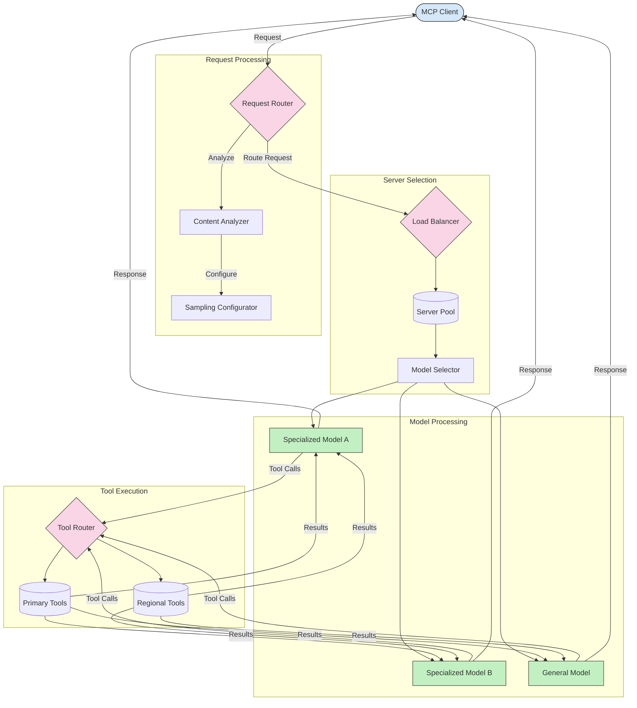

<!--
CO_OP_TRANSLATOR_METADATA:
{
  "original_hash": "2f1b473818b5a6cc9a9bbf777fffa6d4",
  "translation_date": "2025-08-26T19:00:38+00:00",
  "source_file": "05-AdvancedTopics/mcp-routing/README.md",
  "language_code": "lt"
}
-->
# Maršrutizavimas Modelio Konteksto Protokole

Maršrutizavimas yra būtinas norint nukreipti užklausas į tinkamus modelius, įrankius ar paslaugas MCP ekosistemoje.

## Įvadas

Maršrutizavimas Modelio Konteksto Protokole (MCP) apima užklausų nukreipimą į tinkamiausius modelius ar paslaugas, atsižvelgiant į įvairius kriterijus, tokius kaip turinio tipas, vartotojo kontekstas ir sistemos apkrova. Tai užtikrina efektyvų apdorojimą ir optimalų išteklių panaudojimą.

## Mokymosi tikslai

Šios pamokos pabaigoje galėsite:

- Suprasti MCP maršrutizavimo principus.
- Įgyvendinti maršrutizavimą pagal turinį, nukreipiant užklausas į specializuotas paslaugas.
- Taikyti išmanias apkrovos balansavimo strategijas, siekiant optimizuoti išteklių panaudojimą.
- Įgyvendinti dinaminį įrankių maršrutizavimą pagal užklausos kontekstą.

## Maršrutizavimas pagal turinį

Maršrutizavimas pagal turinį nukreipia užklausas į specializuotas paslaugas, remiantis užklausos turiniu. Pavyzdžiui, užklausos, susijusios su kodo generavimu, gali būti nukreiptos į specializuotą kodo modelį, o kūrybinio rašymo užklausos – į kūrybinio rašymo modelį.

Pažvelkime į pavyzdinį įgyvendinimą skirtingomis programavimo kalbomis.

## Išmanus apkrovos balansavimas

Apkrovos balansavimas optimizuoja išteklių panaudojimą ir užtikrina MCP paslaugų aukštą prieinamumą. Yra įvairių būdų įgyvendinti apkrovos balansavimą, tokių kaip „round-robin“, svorinis atsako laikas arba strategijos, atsižvelgiančios į turinį.

Pažvelkime į žemiau pateiktą pavyzdinį įgyvendinimą, kuris naudoja šias strategijas:

- **Round Robin**: Užklausos tolygiai paskirstomos tarp turimų serverių.
- **Svorinis atsako laikas**: Užklausos nukreipiamos į serverius, remiantis jų vidutiniu atsako laiku.
- **Turinio atpažinimas**: Užklausos nukreipiamos į specializuotus serverius, remiantis užklausos turiniu.

## Dinaminis įrankių maršrutizavimas

Įrankių maršrutizavimas užtikrina, kad įrankių užklausos būtų nukreiptos į tinkamiausią paslaugą, atsižvelgiant į kontekstą. Pavyzdžiui, orų įrankio užklausa gali būti nukreipta į regioninį galinį tašką, remiantis vartotojo vieta, arba skaičiuotuvo įrankis gali naudoti konkrečią API versiją.

Pažvelkime į pavyzdinį įgyvendinimą, kuris demonstruoja dinaminį įrankių maršrutizavimą, remiantis užklausos analize, regioniniais galiniais taškais ir versijų palaikymu.

## Imties ėmimo ir maršrutizavimo architektūra MCP

Imties ėmimas yra svarbi Modelio Konteksto Protokolo (MCP) dalis, leidžianti efektyviai apdoroti ir maršrutizuoti užklausas. Tai apima gaunamų užklausų analizę, siekiant nustatyti tinkamiausią modelį ar paslaugą, kuri jas apdoros, remiantis įvairiais kriterijais, tokiais kaip turinio tipas, vartotojo kontekstas ir sistemos apkrova.

Imties ėmimas ir maršrutizavimas gali būti sujungti, kad sukurtų tvirtą architektūrą, optimizuojančią išteklių panaudojimą ir užtikrinančią aukštą prieinamumą. Imties ėmimo procesas gali būti naudojamas užklausoms klasifikuoti, o maršrutizavimas – nukreipti jas į tinkamus modelius ar paslaugas.

Žemiau pateiktas diagramas iliustruoja, kaip imties ėmimas ir maršrutizavimas veikia kartu išsamioje MCP architektūroje:

## Kas toliau

- [5.6 Imties ėmimas](../mcp-sampling/README.md)

---

**Atsakomybės apribojimas**:  
Šis dokumentas buvo išverstas naudojant AI vertimo paslaugą [Co-op Translator](https://github.com/Azure/co-op-translator). Nors siekiame tikslumo, prašome atkreipti dėmesį, kad automatiniai vertimai gali turėti klaidų ar netikslumų. Originalus dokumentas jo gimtąja kalba turėtų būti laikomas autoritetingu šaltiniu. Kritinei informacijai rekomenduojama profesionali žmogaus vertimo paslauga. Mes neprisiimame atsakomybės už nesusipratimus ar klaidingus interpretavimus, atsiradusius naudojant šį vertimą.