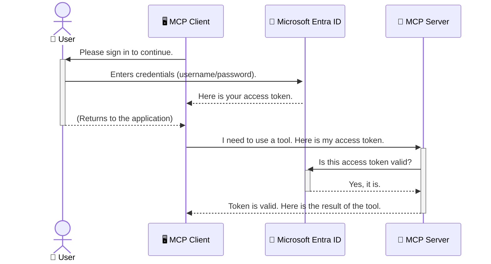

<!--
CO_OP_TRANSLATOR_METADATA:
{
  "original_hash": "6e562d7e5a77c8982da4aa8f762ad1d8",
  "translation_date": "2025-08-26T18:53:15+00:00",
  "source_file": "05-AdvancedTopics/mcp-security-entra/README.md",
  "language_code": "lt"
}
-->
# AI darbo eigų apsauga: Entra ID autentifikacija Model Context Protocol serveriams

## Įvadas
Apsaugoti savo Model Context Protocol (MCP) serverį yra taip pat svarbu, kaip užrakinti savo namų duris. Palikdami MCP serverį atvirą, jūs rizikuojate, kad jūsų įrankiai ir duomenys bus pasiekiami neautorizuotiems asmenims, o tai gali sukelti saugumo pažeidimus. Microsoft Entra ID siūlo patikimą debesų pagrindu veikiančią tapatybės ir prieigos valdymo sprendimą, kuris užtikrina, kad tik autorizuoti vartotojai ir programos galėtų sąveikauti su jūsų MCP serveriu. Šiame skyriuje sužinosite, kaip apsaugoti savo AI darbo eigas naudojant Entra ID autentifikaciją.

## Mokymosi tikslai
Šio skyriaus pabaigoje jūs galėsite:

- Suprasti MCP serverių apsaugos svarbą.
- Paaiškinti Microsoft Entra ID ir OAuth 2.0 autentifikacijos pagrindus.
- Atpažinti skirtumus tarp viešųjų ir konfidencialių klientų.
- Įgyvendinti Entra ID autentifikaciją tiek vietiniuose (viešasis klientas), tiek nuotoliniuose (konfidencialus klientas) MCP serverio scenarijuose.
- Taikyti saugumo geriausias praktikas kuriant AI darbo eigas.

## Saugumas ir MCP

Kaip nepaliktumėte savo namų durų neužrakintų, taip neturėtumėte palikti MCP serverio atviro visiems. AI darbo eigų apsauga yra būtina, norint kurti patikimas, saugias ir patvarias programas. Šiame skyriuje sužinosite, kaip naudoti Microsoft Entra ID, kad apsaugotumėte savo MCP serverius ir užtikrintumėte, jog tik autorizuoti vartotojai ir programos galėtų sąveikauti su jūsų įrankiais ir duomenimis.

## Kodėl MCP serverių saugumas yra svarbus

Įsivaizduokite, kad jūsų MCP serveris turi įrankį, kuris gali siųsti el. laiškus arba pasiekti klientų duomenų bazę. Neapsaugotas serveris reikštų, kad bet kas galėtų naudotis tuo įrankiu, o tai galėtų sukelti neautorizuotą duomenų prieigą, šlamštą ar kitas kenkėjiškas veiklas.

Įgyvendindami autentifikaciją, jūs užtikrinate, kad kiekvienas serverio užklausimas būtų patikrintas, patvirtinant vartotojo ar programos, kuri pateikė užklausą, tapatybę. Tai yra pirmas ir svarbiausias žingsnis apsaugant jūsų AI darbo eigas.

## Įvadas į Microsoft Entra ID

[**Microsoft Entra ID**](https://adoption.microsoft.com/microsoft-security/entra/) yra debesų pagrindu veikianti tapatybės ir prieigos valdymo paslauga. Galvokite apie ją kaip apie universalų apsaugos darbuotoją jūsų programoms. Ji tvarko sudėtingą vartotojų tapatybių patvirtinimo (autentifikacijos) ir jų leidimų nustatymo (autorizacijos) procesą.

Naudodami Entra ID galite:

- Užtikrinti saugų vartotojų prisijungimą.
- Apsaugoti API ir paslaugas.
- Valdyti prieigos politiką iš vienos vietos.

MCP serveriams Entra ID suteikia patikimą ir plačiai pripažintą sprendimą, leidžiantį valdyti, kas gali pasiekti jūsų serverio galimybes.

---

## Magijos supratimas: kaip veikia Entra ID autentifikacija

Entra ID naudoja atvirus standartus, tokius kaip **OAuth 2.0**, autentifikacijai tvarkyti. Nors detalės gali būti sudėtingos, pagrindinė koncepcija yra paprasta ir gali būti suprantama per analogiją.

### Paprastas OAuth 2.0 paaiškinimas: Valet raktas

Pagalvokite apie OAuth 2.0 kaip apie valet paslaugą jūsų automobiliui. Kai atvykstate į restoraną, jūs neduodate valet darbuotojui pagrindinio rakto. Vietoj to, jūs pateikiate **valet raktą**, kuris turi ribotas teises – jis gali užvesti automobilį ir užrakinti duris, bet negali atidaryti bagažinės ar daiktadėžės.

Šioje analogijoje:

- **Jūs** esate **Vartotojas**.
- **Jūsų automobilis** yra **MCP serveris** su savo vertingais įrankiais ir duomenimis.
- **Valet darbuotojas** yra **Microsoft Entra ID**.
- **Automobilių stovėjimo aikštelės prižiūrėtojas** yra **MCP klientas** (programa, bandanti pasiekti serverį).
- **Valet raktas** yra **Prieigos žetonas**.

Prieigos žetonas yra saugus teksto eilutė, kurią MCP klientas gauna iš Entra ID po to, kai jūs prisijungiate. Klientas tada pateikia šį žetoną MCP serveriui su kiekviena užklausa. Serveris gali patikrinti žetoną, kad įsitikintų, jog užklausa yra teisėta ir kad klientas turi reikiamus leidimus, visai netvarkydamas jūsų tikrųjų prisijungimo duomenų (pvz., slaptažodžio).

### Autentifikacijos eiga

Štai kaip procesas veikia praktiškai:



### Microsoft Authentication Library (MSAL) pristatymas

Prieš pereinant prie kodo, svarbu pristatyti pagrindinį komponentą, kurį matysite pavyzdžiuose: **Microsoft Authentication Library (MSAL)**.

MSAL yra Microsoft sukurta biblioteka, kuri labai palengvina kūrėjams autentifikacijos procesą. Vietoj to, kad rašytumėte visą sudėtingą kodą, skirtą saugumo žetonams tvarkyti, prisijungimams valdyti ir sesijoms atnaujinti, MSAL atlieka visą sunkų darbą.

Naudoti tokią biblioteką kaip MSAL yra labai rekomenduojama, nes:

- **Tai saugu:** Ji įgyvendina pramonės standartus ir saugumo geriausias praktikas, sumažindama pažeidžiamumų riziką jūsų kode.
- **Tai supaprastina kūrimą:** Ji abstrahuoja OAuth 2.0 ir OpenID Connect protokolų sudėtingumą, leidžiant jums pridėti patikimą autentifikaciją prie savo programos vos keliomis kodo eilutėmis.
- **Ji yra palaikoma:** Microsoft aktyviai palaiko ir atnaujina MSAL, kad būtų sprendžiamos naujos saugumo grėsmės ir platformos pokyčiai.

MSAL palaiko įvairias programavimo kalbas ir programų karkasus, įskaitant .NET, JavaScript/TypeScript, Python, Java, Go ir mobiliąsias platformas, tokias kaip iOS ir Android. Tai reiškia, kad galite naudoti tuos pačius autentifikacijos modelius visoje savo technologijų infrastruktūroje.

Norėdami sužinoti daugiau apie MSAL, galite peržiūrėti oficialią [MSAL apžvalgos dokumentaciją](https://learn.microsoft.com/entra/identity-platform/msal-overview).

---

## MCP serverio apsauga su Entra ID: žingsnis po žingsnio vadovas

Dabar pereikime prie to, kaip apsaugoti vietinį MCP serverį (tą, kuris bendrauja per `stdio`) naudojant Entra ID. Šiame pavyzdyje naudojamas **viešasis klientas**, kuris tinka programoms, veikiančioms vartotojo kompiuteryje, pvz., darbalaukio programoms ar vietiniams kūrimo serveriams.

### Scenarijus 1: Vietinio MCP serverio apsauga (su viešuoju klientu)

Šiame scenarijuje nagrinėsime vietinį MCP serverį, kuris veikia lokaliai, bendrauja per `stdio` ir naudoja Entra ID vartotojo autentifikacijai prieš suteikdamas prieigą prie savo įrankių. Serveris turės vieną įrankį, kuris gauna vartotojo profilio informaciją iš Microsoft Graph API.

#### 1. Programos nustatymas Entra ID

Prieš rašydami bet kokį kodą, turite užregistruoti savo programą Microsoft Entra ID. Tai informuoja Entra ID apie jūsų programą ir suteikia jai leidimą naudoti autentifikacijos paslaugą.

1. Eikite į **[Microsoft Entra portalą](https://entra.microsoft.com/)**.
2. Pasirinkite **App registrations** ir spustelėkite **New registration**.
3. Suteikite savo programai pavadinimą (pvz., „Mano vietinis MCP serveris“).
4. Skiltyje **Supported account types** pasirinkite **Accounts in this organizational directory only**.
5. Šiam pavyzdžiui galite palikti **Redirect URI** tuščią.
6. Spustelėkite **Register**.

Užregistravę, užsirašykite **Application (client) ID** ir **Directory (tenant) ID**. Jums jų prireiks kode.

#### 2. Kodo analizė

Pažvelkime į pagrindines kodo dalis, kurios tvarko autentifikaciją. Pilnas šio pavyzdžio kodas yra prieinamas [Entra ID - Local - WAM](https://github.com/Azure-Samples/mcp-auth-servers/tree/main/src/entra-id-local-wam) aplanke [mcp-auth-servers GitHub saugykloje](https://github.com/Azure-Samples/mcp-auth-servers).

**`AuthenticationService.cs`**

Ši klasė atsakinga už sąveiką su Entra ID.

- **`CreateAsync`**: Šis metodas inicijuoja `PublicClientApplication` iš MSAL (Microsoft Authentication Library). Jis sukonfigūruotas su jūsų programos `clientId` ir `tenantId`.
- **`WithBroker`**: Tai leidžia naudoti brokerį (pvz., Windows Web Account Manager), kuris suteikia saugesnę ir sklandesnę vieno prisijungimo patirtį.
- **`AcquireTokenAsync`**: Tai pagrindinis metodas. Jis pirmiausia bando gauti žetoną tyliai (tai reiškia, kad vartotojui nereikės vėl prisijungti, jei jis jau turi galiojančią sesiją). Jei tylus žetonas negali būti gautas, jis paragins vartotoją prisijungti interaktyviai.

```csharp
// Simplified for clarity
public static async Task<AuthenticationService> CreateAsync(ILogger<AuthenticationService> logger)
{
    var msalClient = PublicClientApplicationBuilder
        .Create(_clientId) // Your Application (client) ID
        .WithAuthority(AadAuthorityAudience.AzureAdMyOrg)
        .WithTenantId(_tenantId) // Your Directory (tenant) ID
        .WithBroker(new BrokerOptions(BrokerOptions.OperatingSystems.Windows))
        .Build();

    // ... cache registration ...

    return new AuthenticationService(logger, msalClient);
}

public async Task<string> AcquireTokenAsync()
{
    try
    {
        // Try silent authentication first
        var accounts = await _msalClient.GetAccountsAsync();
        var account = accounts.FirstOrDefault();

        AuthenticationResult? result = null;

        if (account != null)
        {
            result = await _msalClient.AcquireTokenSilent(_scopes, account).ExecuteAsync();
        }
        else
        {
            // If no account, or silent fails, go interactive
            result = await _msalClient.AcquireTokenInteractive(_scopes).ExecuteAsync();
        }

        return result.AccessToken;
    }
    catch (Exception ex)
    {
        _logger.LogError(ex, "An error occurred while acquiring the token.");
        throw; // Optionally rethrow the exception for higher-level handling
    }
}
```

**`Program.cs`**

Čia nustatomas MCP serveris ir integruojama autentifikacijos paslauga.

- **`AddSingleton<AuthenticationService>`**: Tai registruoja `AuthenticationService` priklausomybių injekcijos konteineryje, kad jis galėtų būti naudojamas kitose programos dalyse (pvz., mūsų įrankyje).
- **`GetUserDetailsFromGraph` įrankis**: Šis įrankis reikalauja `AuthenticationService` egzemplioriaus. Prieš ką nors darydamas, jis kviečia `authService.AcquireTokenAsync()`, kad gautų galiojantį prieigos žetoną. Jei autentifikacija sėkminga, jis naudoja žetoną, kad saugiai iškviestų Microsoft Graph API ir gautų vartotojo informaciją.

```csharp
// Simplified for clarity
[McpServerTool(Name = "GetUserDetailsFromGraph")]
public static async Task<string> GetUserDetailsFromGraph(
    AuthenticationService authService)
{
    try
    {
        // This will trigger the authentication flow
        var accessToken = await authService.AcquireTokenAsync();

        // Use the token to create a GraphServiceClient
        var graphClient = new GraphServiceClient(
            new BaseBearerTokenAuthenticationProvider(new TokenProvider(authService)));

        var user = await graphClient.Me.GetAsync();

        return System.Text.Json.JsonSerializer.Serialize(user);
    }
    catch (Exception ex)
    {
        return $"Error: {ex.Message}";
    }
}
```

#### 3. Kaip viskas veikia kartu

1. Kai MCP klientas bando naudoti `GetUserDetailsFromGraph` įrankį, įrankis pirmiausia kviečia `AcquireTokenAsync`.
2. `AcquireTokenAsync` paleidžia MSAL biblioteką, kad patikrintų, ar yra galiojantis žetonas.
3. Jei žetonas nerandamas, MSAL per brokerį paragins vartotoją prisijungti su savo Entra ID paskyra.
4. Kai vartotojas prisijungia, Entra ID išduoda prieigos žetoną.
5. Įrankis gauna žetoną ir naudoja jį, kad saugiai iškviestų Microsoft Graph API.
6. Vartotojo informacija grąžinama MCP klientui.

Šis procesas užtikrina, kad tik autentifikuoti vartotojai galėtų naudotis įrankiu, efektyviai apsaugodami jūsų vietinį MCP serverį.

### Scenarijus 2: Nuotolinio MCP serverio apsauga (su konfidencialiu klientu)

Kai jūsų MCP serveris veikia nuotoliniame kompiuteryje (pvz., debesų serveryje) ir bendrauja per protokolą, pvz., HTTP Streaming, saugumo reikalavimai yra kitokie. Šiuo atveju turėtumėte naudoti **konfidencialų klientą** ir **Autorizacijos kodo srautą**. Tai yra saugesnis metodas, nes programos slaptažodžiai niekada nėra atskleidžiami naršyklei.

Šis pavyzdys naudoja TypeScript pagrindu sukurtą MCP serverį, kuris naudoja Express.js HTTP užklausoms tvarkyti.

#### 1. Programos nustatymas Entra ID

Nustatymas Entra ID yra panašus į viešąjį klientą, tačiau su viena svarbia išimtimi: jums reikia sukurti **kliento slaptažodį**.

1. Eikite į **[Microsoft Entra portalą](https://entra.microsoft.com/)**.
2. Savo programos registracijoje eikite į **Certificates & secrets** skirtuką.
3. Spustelėkite **New client secret**, suteikite jam aprašymą ir spustelėkite **Add**.
4. **Svarbu:** Nedelsdami nukopijuokite slaptažodžio reikšmę. Jūs negalėsite jos matyti vėliau.
5. Taip pat turite sukonfigūruoti **Redirect URI**. Eikite į **Authentication** skirtuką, spustelėkite **Add a platform**, pasirinkite **Web** ir įveskite savo programos peradresavimo URI (pvz., `http://localhost:3001/auth/callback`).

> **⚠️ Svarbi saugumo pastaba:** Produkcijos programoms Microsoft primygtinai rekomenduoja naudoti **autentifikaciją be slaptažodžių**, pvz., **Managed Identity** arba **Workload Identity Federation**, vietoj kliento slaptažodžių. Kliento slaptažodžiai kelia saugumo riziką, nes jie gali būti atskleisti arba pažeisti. Valdomos tapatybės suteikia saugesnį būdą, nes nereikia saugoti kredencialų jūsų kode ar konfigūracijoje.
>
> Daugiau informacijos apie valdomas tapatybes ir kaip jas įgyvendinti rasite [Valdomų tapatybių Azure ištekliams apžvalgoje](https://learn.microsoft.com/entra/identity/managed-identities-azure-resources/overview).

#### 2. Kodo analizė

Šis pavyzdys naudoja sesijomis pagrįstą metodą. Kai vartotojas autentifikuojasi, serveris saugo prieigos žetoną ir atnaujinimo žetoną sesijoje ir suteikia vartotojui sesijos žetoną. Šis sesijos žetonas naudojamas vėlesnėms užklausoms. Pilnas šio pavyzdžio kodas yra prieinamas [Entra ID - Confidential client](https://github.com/Azure-Samples/mcp-auth-servers/tree/main/src/entra-id-cca-session) aplanke [mcp-auth-servers GitHub saugykloje](https://github.com/Azure-Samples/mcp-auth-servers).

**`Server.ts`**

Šis failas nustato Express serverį ir MCP transporto sluoksnį.

- **`requireBearerAuth`**: Tai yra tarpinė programinė įranga, kuri apsaugo `/sse` ir `/message` galinius taškus. Ji tikrina, ar `Authorization` antraštėje yra galiojantis žetonas.
- **`EntraIdServerAuthProvider`**: Tai yra pasirinktinė klasė, kuri įgyvendina `McpServerAuthorizationProvider` sąsają. Ji atsakinga už OAuth 2.0 srauto tvarkymą.
- **`/auth/callback`**: Šis galinis taškas tvarko peradresavimą iš Entra ID po to, kai vartotojas autentifikuojasi. Jis keičia autorizacijos kodą į prieigos žetoną ir atnaujinimo žetoną.

```typescript
// Simplified for clarity
const app = express();
const { server } = createServer();
const provider = new EntraIdServerAuthProvider();

// Protect the SSE endpoint
app.get("/sse", requireBearerAuth({
  provider,
  requiredScopes: ["User.Read"]
}), async (req, res) => {
  // ... connect to the transport ...
});

// Protect the message endpoint
app.post("/message", requireBearerAuth({
  provider,
  requiredScopes: ["User.Read"]
}), async (req, res) => {
  // ... handle the message ...
});

// Handle the OAuth 2.0 callback
app.get("/auth/callback", (req, res) => {
  provider.handleCallback(req.query.code, req.query.state)
    .then(result => {
      // ... handle success or failure ...
    });
});
```

**`Tools.ts`**

Šis failas apibrėžia įrankius, kuriuos teikia MCP serveris. `getUserDetails` įrankis yra panašus į ankstesnį pavyzdį, tačiau jis gauna prieigos žetoną iš sesijos.

```typescript
// Simplified for clarity
server.setRequestHandler(CallToolRequestSchema, async (request) => {
  const { name } = request.params;
  const context = request.params?.context as { token?: string } | undefined;
  const sessionToken = context?.token;

  if (name === ToolName.GET_USER_DETAILS) {
    if (!sessionToken) {
      throw new AuthenticationError("Authentication token is missing or invalid. Ensure the token is provided in the request context.");
    }

    // Get the Entra ID token from the session store
    const tokenData = tokenStore.getToken(sessionToken);
    const entraIdToken = tokenData.accessToken;

    const graphClient = Client.init({
      authProvider: (done) => {
        done(null, entraIdToken);
      }
    });

    const user = await graphClient.api('/me').get();

    // ... return user details ...
  }
});
```

**`auth/EntraIdServerAuthProvider.ts`**

Ši klasė tvarko logiką:

- Peradresuoja vartotoją į Entra ID prisijungimo puslapį.
- Keičia autorizacijos kodą į prieigos žetoną.
- Saugo žetonus `tokenStore`.
- Atnaujina prieigos žetoną, kai jis baigiasi.

#### 3.
4. Serveris pakeičia kodą į prieigos ir atnaujinimo žetonus, juos saugo ir sukuria sesijos žetoną, kuris siunčiamas klientui.  
5. Klientas dabar gali naudoti šį sesijos žetoną `Authorization` antraštėje visiems būsimiems užklausoms MCP serveriui.  
6. Kai iškviečiamas `getUserDetails` įrankis, jis naudoja sesijos žetoną, kad surastų Entra ID prieigos žetoną, ir tada naudoja jį Microsoft Graph API užklausoms.  

Šis procesas yra sudėtingesnis nei viešojo kliento procesas, tačiau būtinas internetui prieinamoms galutiniams taškams. Kadangi nuotoliniai MCP serveriai yra pasiekiami per viešąjį internetą, jiems reikalingos stipresnės saugumo priemonės, kad būtų apsaugota nuo neteisėtos prieigos ir galimų atakų.  

## Saugumo geriausios praktikos  

- **Visada naudokite HTTPS**: Užšifruokite komunikaciją tarp kliento ir serverio, kad apsaugotumėte žetonus nuo perėmimo.  
- **Įgyvendinkite vaidmenimis pagrįstą prieigos kontrolę (RBAC)**: Ne tik tikrinkite, *ar* vartotojas yra autentifikuotas, bet ir *ką* jis yra įgaliotas daryti. Galite apibrėžti vaidmenis Entra ID ir tikrinti juos MCP serveryje.  
- **Stebėkite ir audituokite**: Registruokite visus autentifikacijos įvykius, kad galėtumėte aptikti ir reaguoti į įtartiną veiklą.  
- **Valdykite užklausų ribojimą ir srauto kontrolę**: Microsoft Graph ir kitos API įgyvendina užklausų ribojimą, kad būtų išvengta piktnaudžiavimo. Įgyvendinkite eksponentinį atsitraukimą ir pakartotinio bandymo logiką savo MCP serveryje, kad sklandžiai tvarkytumėte HTTP 429 (Per daug užklausų) atsakymus. Apsvarstykite galimybę talpinti dažnai pasiekiamus duomenis, kad sumažintumėte API užklausų skaičių.  
- **Saugus žetonų saugojimas**: Saugokite prieigos ir atnaujinimo žetonus saugiai. Vietinėms programoms naudokite sistemos saugaus saugojimo mechanizmus. Serverio programoms apsvarstykite galimybę naudoti užšifruotą saugojimą arba saugių raktų valdymo paslaugas, tokias kaip Azure Key Vault.  
- **Žetonų galiojimo laiko valdymas**: Prieigos žetonai turi ribotą galiojimo laiką. Įgyvendinkite automatinį žetonų atnaujinimą naudojant atnaujinimo žetonus, kad užtikrintumėte sklandžią vartotojo patirtį be pakartotinio autentifikavimo.  
- **Apsvarstykite Azure API Management naudojimą**: Nors saugumo įgyvendinimas tiesiogiai MCP serveryje suteikia smulkią kontrolę, API vartai, tokie kaip Azure API Management, gali automatiškai tvarkyti daugelį šių saugumo klausimų, įskaitant autentifikaciją, autorizaciją, užklausų ribojimą ir stebėjimą. Jie suteikia centralizuotą saugumo sluoksnį, kuris yra tarp jūsų klientų ir MCP serverių. Daugiau informacijos apie API vartų naudojimą su MCP rasite mūsų [Azure API Management Your Auth Gateway For MCP Servers](https://techcommunity.microsoft.com/blog/integrationsonazureblog/azure-api-management-your-auth-gateway-for-mcp-servers/4402690).  

## Pagrindinės išvados  

- MCP serverio saugumas yra būtinas norint apsaugoti jūsų duomenis ir įrankius.  
- Microsoft Entra ID suteikia patikimą ir mastelį palaikančią autentifikacijos ir autorizacijos sprendimą.  
- Naudokite **viešąjį klientą** vietinėms programoms ir **konfidencialų klientą** nuotoliniams serveriams.  
- **Autorizacijos kodo procesas** yra saugiausias pasirinkimas internetinėms programoms.  

## Pratimai  

1. Pagalvokite apie MCP serverį, kurį galėtumėte sukurti. Ar tai būtų vietinis serveris ar nuotolinis serveris?  
2. Atsižvelgiant į jūsų atsakymą, ar naudotumėte viešąjį ar konfidencialų klientą?  
3. Kokius leidimus jūsų MCP serveris prašytų, kad galėtų atlikti veiksmus prieš Microsoft Graph?  

## Praktiniai pratimai  

### Pratimas 1: Programos registravimas Entra ID  
Eikite į Microsoft Entra portalą.  
Registruokite naują programą savo MCP serveriui.  
Užsirašykite Programos (kliento) ID ir Katalogo (nuomininko) ID.  

### Pratimas 2: Vietinio MCP serverio saugumo užtikrinimas (Viešasis klientas)  
- Sekite kodo pavyzdį, kad integruotumėte MSAL (Microsoft Authentication Library) vartotojo autentifikacijai.  
- Išbandykite autentifikacijos procesą, iškviesdami MCP įrankį, kuris gauna vartotojo informaciją iš Microsoft Graph.  

### Pratimas 3: Nuotolinio MCP serverio saugumo užtikrinimas (Konfidencialus klientas)  
- Registruokite konfidencialų klientą Entra ID ir sukurkite kliento slaptąjį raktą.  
- Konfigūruokite savo Express.js MCP serverį naudoti Autorizacijos kodo procesą.  
- Išbandykite apsaugotus galutinius taškus ir patvirtinkite prieigos žetonų pagrįstą prieigą.  

### Pratimas 4: Saugumo geriausių praktikų taikymas  
- Įgalinkite HTTPS savo vietiniam ar nuotoliniam serveriui.  
- Įgyvendinkite vaidmenimis pagrįstą prieigos kontrolę (RBAC) savo serverio logikoje.  
- Pridėkite žetonų galiojimo laiko valdymą ir saugų žetonų saugojimą.  

## Ištekliai  

1. **MSAL apžvalgos dokumentacija**  
   Sužinokite, kaip Microsoft Authentication Library (MSAL) leidžia saugiai gauti žetonus įvairiose platformose:  
   [MSAL Overview on Microsoft Learn](https://learn.microsoft.com/en-gb/entra/msal/overview)  

2. **Azure-Samples/mcp-auth-servers GitHub saugykla**  
   MCP serverių pavyzdinės įgyvendinimo demonstracijos autentifikacijos procesams:  
   [Azure-Samples/mcp-auth-servers on GitHub](https://github.com/Azure-Samples/mcp-auth-servers)  

3. **Valdomų identitetų Azure ištekliams apžvalga**  
   Supraskite, kaip pašalinti slaptažodžius naudojant sistemos arba vartotojo priskirtus valdomus identitetus:  
   [Managed Identities Overview on Microsoft Learn](https://learn.microsoft.com/en-us/entra/identity/managed-identities-azure-resources/)  

4. **Azure API Management: Jūsų autentifikacijos vartai MCP serveriams**  
   Išsamus vadovas apie APIM naudojimą kaip saugų OAuth2 vartus MCP serveriams:  
   [Azure API Management Your Auth Gateway For MCP Servers](https://techcommunity.microsoft.com/blog/integrationsonazureblog/azure-api-management-your-auth-gateway-for-mcp-servers/4402690)  

5. **Microsoft Graph leidimų nuoroda**  
   Išsamus deleguotų ir programos leidimų sąrašas Microsoft Graph:  
   [Microsoft Graph Permissions Reference](https://learn.microsoft.com/zh-tw/graph/permissions-reference)  

## Mokymosi rezultatai  
Baigę šį skyrių, galėsite:  

- Paaiškinti, kodėl autentifikacija yra svarbi MCP serveriams ir AI darbo eigoms.  
- Nustatyti ir konfigūruoti Entra ID autentifikaciją tiek vietinio, tiek nuotolinio MCP serverio scenarijams.  
- Pasirinkti tinkamą kliento tipą (viešąjį ar konfidencialų) pagal jūsų serverio diegimą.  
- Įgyvendinti saugaus kodo praktikas, įskaitant žetonų saugojimą ir vaidmenimis pagrįstą autorizaciją.  
- Pasitikėti MCP serverio ir jo įrankių apsauga nuo neteisėtos prieigos.  

## Kas toliau  

- [5.13 Model Context Protocol (MCP) Integration with Azure AI Foundry](../mcp-foundry-agent-integration/README.md)  

---

**Atsakomybės apribojimas**:  
Šis dokumentas buvo išverstas naudojant AI vertimo paslaugą [Co-op Translator](https://github.com/Azure/co-op-translator). Nors siekiame tikslumo, prašome atkreipti dėmesį, kad automatiniai vertimai gali turėti klaidų ar netikslumų. Originalus dokumentas jo gimtąja kalba turėtų būti laikomas autoritetingu šaltiniu. Kritinei informacijai rekomenduojama naudoti profesionalų žmogaus vertimą. Mes neprisiimame atsakomybės už nesusipratimus ar klaidingus interpretavimus, atsiradusius dėl šio vertimo naudojimo.