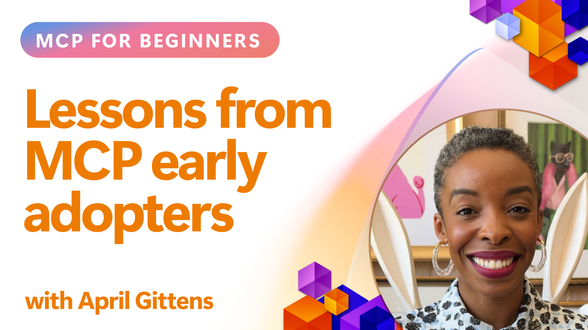

<!--
CO_OP_TRANSLATOR_METADATA:
{
  "original_hash": "41f16dac486d2086a53bc644a01cbe42",
  "translation_date": "2025-08-26T18:41:03+00:00",
  "source_file": "07-LessonsfromEarlyAdoption/README.md",
  "language_code": "lt"
}
-->
# 🌟 Pamokos iš ankstyvųjų naudotojų

[](https://youtu.be/jds7dSmNptE)

_(Spustelėkite paveikslėlį aukščiau, kad peržiūrėtumėte šios pamokos vaizdo įrašą)_

## 🎯 Ką apima šis modulis

Šiame modulyje nagrinėjama, kaip realios organizacijos ir kūrėjai naudoja Model Context Protocol (MCP), kad spręstų praktinius iššūkius ir skatintų inovacijas. Per išsamias atvejų analizes ir praktinius projektus sužinosite, kaip MCP leidžia saugiai ir masteliškai integruoti AI, sujungiant kalbos modelius, įrankius ir įmonės duomenis.

### 📚 MCP veiksme

Norite pamatyti, kaip šie principai taikomi gamybai paruoštuose įrankiuose? Peržiūrėkite mūsų [**10 Microsoft MCP serverių, kurie keičia kūrėjų produktyvumą**](microsoft-mcp-servers.md), kur pateikiami realūs Microsoft MCP serveriai, kuriuos galite naudoti jau šiandien.

## Apžvalga

Šioje pamokoje nagrinėjama, kaip ankstyvieji naudotojai pasinaudojo Model Context Protocol (MCP), kad spręstų realius iššūkius ir skatintų inovacijas įvairiose pramonės šakose. Per išsamias atvejų analizes ir praktinius projektus sužinosite, kaip MCP leidžia standartizuoti, saugiai ir masteliškai integruoti AI, sujungiant didelius kalbos modelius, įrankius ir įmonės duomenis vieningoje sistemoje. Įgysite praktinės patirties kuriant MCP pagrįstus sprendimus, mokysitės iš patikrintų įgyvendinimo modelių ir atrasite geriausią praktiką MCP diegimui gamybos aplinkoje. Pamokoje taip pat aptariamos naujos tendencijos, ateities kryptys ir atvirojo kodo ištekliai, padedantys išlikti MCP technologijos ir jos besivystančios ekosistemos priešakyje.

## Mokymosi tikslai

- Analizuoti realius MCP įgyvendinimus įvairiose pramonės šakose
- Kurti ir įgyvendinti pilnas MCP pagrįstas programas
- Tyrinėti naujas tendencijas ir ateities kryptis MCP technologijoje
- Taikyti geriausią praktiką realiose kūrimo situacijose

## Realūs MCP įgyvendinimai

### Atvejo analizė 1: Įmonės klientų aptarnavimo automatizavimas

Tarptautinė korporacija įgyvendino MCP pagrįstą sprendimą, kad standartizuotų AI sąveikas visoje klientų aptarnavimo sistemoje. Tai leido:

- Sukurti vieningą sąsają keliems LLM tiekėjams
- Užtikrinti nuoseklų užklausų valdymą tarp departamentų
- Įgyvendinti patikimą saugumą ir atitikties kontrolę
- Lengvai keisti AI modelius pagal specifinius poreikius

**Techninis įgyvendinimas:**

```python
# Python MCP server implementation for customer support
import logging
import asyncio
from modelcontextprotocol import create_server, ServerConfig
from modelcontextprotocol.server import MCPServer
from modelcontextprotocol.transports import create_http_transport
from modelcontextprotocol.resources import ResourceDefinition
from modelcontextprotocol.prompts import PromptDefinition
from modelcontextprotocol.tool import ToolDefinition

# Configure logging
logging.basicConfig(level=logging.INFO)

async def main():
    # Create server configuration
    config = ServerConfig(
        name="Enterprise Customer Support Server",
        version="1.0.0",
        description="MCP server for handling customer support inquiries"
    )
    
    # Initialize MCP server
    server = create_server(config)
    
    # Register knowledge base resources
    server.resources.register(
        ResourceDefinition(
            name="customer_kb",
            description="Customer knowledge base documentation"
        ),
        lambda params: get_customer_documentation(params)
    )
    
    # Register prompt templates
    server.prompts.register(
        PromptDefinition(
            name="support_template",
            description="Templates for customer support responses"
        ),
        lambda params: get_support_templates(params)
    )
    
    # Register support tools
    server.tools.register(
        ToolDefinition(
            name="ticketing",
            description="Create and update support tickets"
        ),
        handle_ticketing_operations
    )
    
    # Start server with HTTP transport
    transport = create_http_transport(port=8080)
    await server.run(transport)

if __name__ == "__main__":
    asyncio.run(main())
```

**Rezultatai:** 30% sumažintos modelio išlaidos, 45% pagerintas atsakymų nuoseklumas ir sustiprinta atitiktis visoje pasaulinėje veikloje.

### Atvejo analizė 2: Sveikatos priežiūros diagnostikos asistentas

Sveikatos priežiūros paslaugų teikėjas sukūrė MCP infrastruktūrą, kad integruotų kelis specializuotus medicininius AI modelius, užtikrindamas jautrių pacientų duomenų apsaugą:

- Sklandus perjungimas tarp bendrųjų ir specializuotų medicininių modelių
- Griežta privatumo kontrolė ir audito pėdsakai
- Integracija su esamomis Elektroninėmis sveikatos įrašų (EHR) sistemomis
- Nuoseklus užklausų valdymas medicinos terminologijai

**Techninis įgyvendinimas:**

```csharp
// C# MCP host application implementation in healthcare application
using Microsoft.Extensions.DependencyInjection;
using ModelContextProtocol.SDK.Client;
using ModelContextProtocol.SDK.Security;
using ModelContextProtocol.SDK.Resources;

public class DiagnosticAssistant
{
    private readonly MCPHostClient _mcpClient;
    private readonly PatientContext _patientContext;
    
    public DiagnosticAssistant(PatientContext patientContext)
    {
        _patientContext = patientContext;
        
        // Configure MCP client with healthcare-specific settings
        var clientOptions = new ClientOptions
        {
            Name = "Healthcare Diagnostic Assistant",
            Version = "1.0.0",
            Security = new SecurityOptions
            {
                Encryption = EncryptionLevel.Medical,
                AuditEnabled = true
            }
        };
        
        _mcpClient = new MCPHostClientBuilder()
            .WithOptions(clientOptions)
            .WithTransport(new HttpTransport("https://healthcare-mcp.example.org"))
            .WithAuthentication(new HIPAACompliantAuthProvider())
            .Build();
    }
    
    public async Task<DiagnosticSuggestion> GetDiagnosticAssistance(
        string symptoms, string patientHistory)
    {
        // Create request with appropriate resources and tool access
        var resourceRequest = new ResourceRequest
        {
            Name = "patient_records",
            Parameters = new Dictionary<string, object>
            {
                ["patientId"] = _patientContext.PatientId,
                ["requestingProvider"] = _patientContext.ProviderId
            }
        };
        
        // Request diagnostic assistance using appropriate prompt
        var response = await _mcpClient.SendPromptRequestAsync(
            promptName: "diagnostic_assistance",
            parameters: new Dictionary<string, object>
            {
                ["symptoms"] = symptoms,
                patientHistory = patientHistory,
                relevantGuidelines = _patientContext.GetRelevantGuidelines()
            });
            
        return DiagnosticSuggestion.FromMCPResponse(response);
    }
}
```

**Rezultatai:** Pagerintos diagnostikos rekomendacijos gydytojams, išlaikant visišką HIPAA atitiktį ir reikšmingai sumažinant sistemos perjungimo laiką.

### Atvejo analizė 3: Finansinių paslaugų rizikos analizė

Finansų institucija įgyvendino MCP, kad standartizuotų rizikos analizės procesus skirtinguose departamentuose:

- Sukurta vieninga sąsaja kredito rizikos, sukčiavimo aptikimo ir investicijų rizikos modeliams
- Įgyvendinta griežta prieigos kontrolė ir modelio versijų valdymas
- Užtikrinta visų AI rekomendacijų audituojamumas
- Išlaikytas nuoseklus duomenų formatavimas įvairiose sistemose

**Techninis įgyvendinimas:**

```java
// Java MCP server for financial risk assessment
import org.mcp.server.*;
import org.mcp.security.*;

public class FinancialRiskMCPServer {
    public static void main(String[] args) {
        // Create MCP server with financial compliance features
        MCPServer server = new MCPServerBuilder()
            .withModelProviders(
                new ModelProvider("risk-assessment-primary", new AzureOpenAIProvider()),
                new ModelProvider("risk-assessment-audit", new LocalLlamaProvider())
            )
            .withPromptTemplateDirectory("./compliance/templates")
            .withAccessControls(new SOCCompliantAccessControl())
            .withDataEncryption(EncryptionStandard.FINANCIAL_GRADE)
            .withVersionControl(true)
            .withAuditLogging(new DatabaseAuditLogger())
            .build();
            
        server.addRequestValidator(new FinancialDataValidator());
        server.addResponseFilter(new PII_RedactionFilter());
        
        server.start(9000);
        
        System.out.println("Financial Risk MCP Server running on port 9000");
    }
}
```

**Rezultatai:** Sustiprinta reguliavimo atitiktis, 40% greitesni modelio diegimo ciklai ir pagerintas rizikos vertinimo nuoseklumas tarp departamentų.

### Atvejo analizė 4: Microsoft Playwright MCP serveris naršyklės automatizavimui

Microsoft sukūrė [Playwright MCP serverį](https://github.com/microsoft/playwright-mcp), kad užtikrintų saugų, standartizuotą naršyklės automatizavimą per Model Context Protocol. Šis gamybai paruoštas serveris leidžia AI agentams ir LLM sąveikauti su interneto naršyklėmis kontroliuojamu, audituojamu ir išplečiamu būdu—leidžiant tokius naudojimo atvejus kaip automatizuotas interneto testavimas, duomenų išgavimas ir pilni darbo procesai.

> **🎯 Gamybai paruoštas įrankis**
> 
> Ši atvejo analizė pristato realų MCP serverį, kurį galite naudoti jau šiandien! Sužinokite daugiau apie Playwright MCP serverį ir 9 kitus gamybai paruoštus Microsoft MCP serverius mūsų [**Microsoft MCP serverių vadove**](microsoft-mcp-servers.md#8--playwright-mcp-server).

**Pagrindinės funkcijos:**
- Naršyklės automatizavimo galimybių (navigacija, formų pildymas, ekrano nuotraukų darymas ir kt.) pateikimas kaip MCP įrankiai
- Griežta prieigos kontrolė ir smėlio dėžės principų taikymas, siekiant užkirsti kelią neleistiniems veiksmams
- Išsamūs audito žurnalai visoms naršyklės sąveikoms
- Integracija su Azure OpenAI ir kitais LLM tiekėjais agentų valdomam automatizavimui
- GitHub Copilot Coding Agent funkcionalumo palaikymas naršant internete

**Techninis įgyvendinimas:**

```typescript
// TypeScript: Registering Playwright browser automation tools in an MCP server
import { createServer, ToolDefinition } from 'modelcontextprotocol';
import { launch } from 'playwright';

const server = createServer({
  name: 'Playwright MCP Server',
  version: '1.0.0',
  description: 'MCP server for browser automation using Playwright'
});

// Register a tool for navigating to a URL and capturing a screenshot
server.tools.register(
  new ToolDefinition({
    name: 'navigate_and_screenshot',
    description: 'Navigate to a URL and capture a screenshot',
    parameters: {
      url: { type: 'string', description: 'The URL to visit' }
    }
  }),
  async ({ url }) => {
    const browser = await launch();
    const page = await browser.newPage();
    await page.goto(url);
    const screenshot = await page.screenshot();
    await browser.close();
    return { screenshot };
  }
);

// Start the MCP server
server.listen(8080);
```

**Rezultatai:**

- Užtikrintas saugus, programinis naršyklės automatizavimas AI agentams ir LLM
- Sumažintas rankinio testavimo darbas ir pagerinta interneto programų testavimo aprėptis
- Sukurtas pakartotinai naudojamas, išplečiamas pagrindas naršyklės įrankių integracijai įmonės aplinkoje
- GitHub Copilot naršymo internete galimybių palaikymas

**Nuorodos:**

- [Playwright MCP serverio GitHub saugykla](https://github.com/microsoft/playwright-mcp)
- [Microsoft AI ir automatizavimo sprendimai](https://azure.microsoft.com/en-us/products/ai-services/)

### Atvejo analizė 5: Azure MCP – Įmonės lygio Model Context Protocol kaip paslauga

Azure MCP serveris ([https://aka.ms/azmcp](https://aka.ms/azmcp)) yra Microsoft valdomas, įmonės lygio Model Context Protocol įgyvendinimas, skirtas teikti masteliuojamas, saugias ir atitiktį užtikrinančias MCP serverio galimybes kaip debesų paslaugą. Azure MCP leidžia organizacijoms greitai diegti, valdyti ir integruoti MCP serverius su Azure AI, duomenų ir saugumo paslaugomis, sumažinant operacinę naštą ir paspartinant AI diegimą.

> **🎯 Gamybai paruoštas įrankis**
> 
> Tai realus MCP serveris, kurį galite naudoti jau šiandien! Sužinokite daugiau apie Azure AI Foundry MCP serverį mūsų [**Microsoft MCP serverių vadove**](microsoft-mcp-servers.md).

- Pilnai valdomas MCP serverio talpinimas su įmontuotu masteliavimu, stebėjimu ir saugumu
- Natūrali integracija su Azure OpenAI, Azure AI Search ir kitomis Azure paslaugomis
- Įmonės autentifikacija ir autorizacija per Microsoft Entra ID
- Palaikymas pritaikytiems įrankiams, užklausų šablonams ir išteklių jungtims
- Atitiktis įmonės saugumo ir reguliavimo reikalavimams

**Techninis įgyvendinimas:**

```yaml
# Example: Azure MCP server deployment configuration (YAML)
apiVersion: mcp.microsoft.com/v1
kind: McpServer
metadata:
  name: enterprise-mcp-server
spec:
  modelProviders:
    - name: azure-openai
      type: AzureOpenAI
      endpoint: https://<your-openai-resource>.openai.azure.com/
      apiKeySecret: <your-azure-keyvault-secret>
  tools:
    - name: document_search
      type: AzureAISearch
      endpoint: https://<your-search-resource>.search.windows.net/
      apiKeySecret: <your-azure-keyvault-secret>
  authentication:
    type: EntraID
    tenantId: <your-tenant-id>
  monitoring:
    enabled: true
    logAnalyticsWorkspace: <your-log-analytics-id>
```

**Rezultatai:**  
- Sutrumpintas laikas iki vertės pasiekimo įmonės AI projektuose, pateikiant paruoštą naudoti, atitiktį užtikrinančią MCP serverio platformą
- Supaprastinta LLM, įrankių ir įmonės duomenų šaltinių integracija
- Sustiprintas saugumas, stebėjimas ir operacinis efektyvumas MCP darbo krūviams
- Pagerinta kodo kokybė naudojant Azure SDK geriausią praktiką ir dabartinius autentifikacijos modelius

**Nuorodos:**  
- [Azure MCP dokumentacija](https://aka.ms/azmcp)
- [Azure MCP serverio GitHub saugykla](https://github.com/Azure/azure-mcp)
- [Azure AI paslaugos](https://azure.microsoft.com/en-us/products/ai-services/)
- [Microsoft MCP centras](https://mcp.azure.com)

### Atvejo analizė 6: NLWeb

MCP (Model Context Protocol) yra naujas protokolas, skirtas pokalbių robotams ir AI asistentams sąveikauti su įrankiais. Kiekvienas NLWeb egzempliorius taip pat yra MCP serveris, kuris palaiko vieną pagrindinį metodą – ask, naudojamą užduoti klausimus svetainėms natūralia kalba. Grąžintas atsakymas naudoja schema.org, plačiai naudojamą žodyną, skirtą aprašyti interneto duomenis. Paprastai tariant, MCP yra NLWeb, kaip Http yra HTML. NLWeb sujungia protokolus, Schema.org formatus ir pavyzdinį kodą, kad svetainės galėtų greitai sukurti šiuos galinius taškus, naudingus tiek žmonėms per pokalbių sąsajas, tiek mašinoms per natūralią agentų sąveiką.

NLWeb turi du pagrindinius komponentus:
- Protokolas, labai paprastas pradėti, skirtas sąveikai su svetaine natūralia kalba, ir formatas, naudojantis json ir schema.org grąžintam atsakymui. Daugiau informacijos rasite REST API dokumentacijoje.
- Paprastas (1) įgyvendinimas, kuris naudoja esamą žymėjimą svetainėms, kurias galima abstrahuoti kaip elementų sąrašus (produktai, receptai, lankytinos vietos, apžvalgos ir kt.). Kartu su vartotojo sąsajos valdikliais svetainės gali lengvai suteikti pokalbių sąsajas savo turiniui. Daugiau informacijos rasite dokumentacijoje apie pokalbio užklausos gyvavimo ciklą.

**Nuorodos:**  
- [Azure MCP dokumentacija](https://aka.ms/azmcp)
- [NLWeb](https://github.com/microsoft/NlWeb)

### Atvejo analizė 7: Azure AI Foundry MCP serveris – Įmonės AI agentų integracija

Azure AI Foundry MCP serveriai demonstruoja, kaip MCP gali būti naudojamas AI agentų ir darbo procesų organizavimui bei valdymui įmonės aplinkoje. Integruojant MCP su Azure AI Foundry, organizacijos gali standartizuoti agentų sąveikas, pasinaudoti Foundry darbo procesų valdymu ir užtikrinti saugius, masteliuojamus diegimus.

> **🎯 Gamybai paruoštas įrankis**
> 
> Tai realus MCP serveris, kurį galite naudoti jau šiandien! Sužinokite daugiau apie Azure AI Foundry MCP serverį mūsų [**Microsoft MCP serverių vadove**](microsoft-mcp-servers.md#9--azure-ai-foundry-mcp-server).

**Pagrindinės funkcijos:**
- Išsamus prieinamumas Azure AI ekosistemai, įskaitant modelių katalogus ir diegimo valdymą
- Žinių indeksavimas su Azure AI Search RAG programoms
- Vertinimo įrankiai AI modelio našumui ir kokybės užtikrinimui
- Integracija su Azure AI Foundry katalogu ir laboratorijomis pažangiems tyrimų modeliams
- Agentų valdymo ir vertinimo galimybės gamybos scenarijams

**Rezultatai:**
- Greitas prototipų kūrimas ir patikimas AI agentų darbo procesų stebėjimas
- Sklandi integracija su Azure AI paslaugomis pažangiems scenarijams
- Vieninga sąsaja agentų vamzdynų kūrimui, diegimui ir stebėjimui
- Pagerintas saugumas, atitiktis ir operacinis efektyvumas įmonėms
- Paspartinta AI diegimas, išlaikant kontrolę sudėtingiems agentų valdomiems procesams

**Nuorodos:**
- [Azure AI Foundry MCP serverio GitHub saugykla](https://github.com/azure-ai-foundry/mcp-foundry)
- [Azure AI agentų integracija su MCP (Microsoft Foundry tinklaraštis)](https://devblogs.microsoft.com/foundry/integrating-azure-ai-agents-mcp/)

### Atvejo analizė 8: Foundry MCP žaidimų aikštelė – Eksperimentavimas ir prototipų kūrimas

Foundry MCP žaidimų aikštelė siūlo paruoštą aplinką eksperimentavimui su MCP serveriais ir Azure AI Foundry integracijomis. Kūrėjai gali greitai kurti prototipus, testuoti ir vertinti AI modelius bei agentų darbo procesus, naudodami išteklius iš Azure AI Foundry katalogo ir laboratorijų. Žaidimų aikštelė supaprastina nustatymą, pateikia pavyzdinius projektus ir palaiko bendradarbiavimą, todėl lengva tyrinėti geriausią praktiką ir naujus scenarijus su minimaliomis sąnaudomis. Tai ypač naudinga komandoms, siekiančioms patvirtinti idėjas, dalintis eksperimentais ir paspartinti mokymąsi be sudėtingos infrastruktūros. Sumažindama įėjimo barjerą, žaidimų aikštelė skatina inovacijas ir bendruomenės indėlį MCP ir Azure AI Foundry ekosistemoje.

**Nuorodos:**

- [Foundry MCP žaidimų aikštelės GitHub saugykla](https://github.com/azure-ai-foundry/foundry-mcp-playground)

### Atvejo analizė 9: Microsoft Learn Docs MCP serveris – AI valdomas dokumentacijos pasiekiamumas

Microsoft Learn Docs MCP serveris yra debesų talpinama paslauga, suteikianti AI asistentams realaus laiko prieigą prie oficialios Microsoft dokumentacijos per Model Context Protocol. Šis gamybai paruoštas serveris jungiasi prie išsamaus Microsoft Learn ekosistemos ir leidžia semantinę paiešką visose oficialiose Microsoft šaltiniuose.
> **🎯 Įrankis paruoštas naudoti gamyboje**  
>  
> Tai yra tikras MCP serveris, kurį galite naudoti jau šiandien! Sužinokite daugiau apie Microsoft Learn Docs MCP serverį mūsų [**Microsoft MCP serverių vadove**](microsoft-mcp-servers.md#1--microsoft-learn-docs-mcp-server).
**Pagrindinės funkcijos:**
- Tiesioginė prieiga prie oficialios Microsoft dokumentacijos, Azure dokumentų ir Microsoft 365 dokumentacijos
- Pažangios semantinės paieškos galimybės, suprantančios kontekstą ir ketinimus
- Visada naujausia informacija, kai Microsoft Learn turinys yra publikuojamas
- Išsamus aprėptis per Microsoft Learn, Azure dokumentaciją ir Microsoft 365 šaltinius
- Grąžina iki 10 aukštos kokybės turinio fragmentų su straipsnių pavadinimais ir URL

**Kodėl tai svarbu:**
- Sprendžia „pasenusios AI žinios“ problemą Microsoft technologijoms
- Užtikrina, kad AI asistentai turėtų prieigą prie naujausių .NET, C#, Azure ir Microsoft 365 funkcijų
- Pateikia autoritetingą, pirmosios šalies informaciją tiksliam kodo generavimui
- Esminė priemonė programuotojams, dirbantiems su sparčiai besivystančiomis Microsoft technologijomis

**Rezultatai:**
- Žymiai pagerintas AI generuojamo kodo tikslumas Microsoft technologijoms
- Sumažintas laikas, praleidžiamas ieškant naujausios dokumentacijos ir geriausių praktikų
- Padidintas programuotojų produktyvumas su kontekstui pritaikyta dokumentacijos paieška
- Sklandi integracija su kūrimo procesais neišeinant iš IDE

**Nuorodos:**
- [Microsoft Learn Docs MCP Server GitHub Repository](https://github.com/MicrosoftDocs/mcp)
- [Microsoft Learn Documentation](https://learn.microsoft.com/)

## Praktiniai projektai

### Projektas 1: Sukurkite kelių tiekėjų MCP serverį

**Tikslas:** Sukurti MCP serverį, kuris galėtų nukreipti užklausas į kelis AI modelių tiekėjus pagal specifinius kriterijus.

**Reikalavimai:**

- Palaikyti bent tris skirtingus modelių tiekėjus (pvz., OpenAI, Anthropic, vietinius modelius)
- Įgyvendinti nukreipimo mechanizmą pagal užklausos metaduomenis
- Sukurti konfigūracijos sistemą tiekėjų kredencialų valdymui
- Pridėti talpyklą, kad optimizuotumėte našumą ir išlaidas
- Sukurti paprastą prietaisų skydelį naudojimo stebėjimui

**Įgyvendinimo žingsniai:**

1. Sukurkite pagrindinę MCP serverio infrastruktūrą
2. Įgyvendinkite tiekėjų adapterius kiekvienai AI modelių paslaugai
3. Sukurkite nukreipimo logiką pagal užklausos atributus
4. Pridėkite talpyklos mechanizmus dažnoms užklausoms
5. Sukurkite stebėjimo prietaisų skydelį
6. Testuokite su įvairiais užklausų modeliais

**Technologijos:** Pasirinkite Python (.NET/Java/Python pagal jūsų pageidavimą), Redis talpyklai ir paprastą žiniatinklio sistemą prietaisų skydeliui.

### Projektas 2: Įmonės šablonų valdymo sistema

**Tikslas:** Sukurti MCP pagrindu veikiančią sistemą šablonų valdymui, versijavimui ir diegimui visoje organizacijoje.

**Reikalavimai:**

- Sukurti centralizuotą šablonų saugyklą
- Įgyvendinti versijavimo ir patvirtinimo darbo eigas
- Sukurti šablonų testavimo galimybes su pavyzdiniais įvesties duomenimis
- Sukurti prieigos kontrolę pagal vaidmenis
- Sukurti API šablonų paieškai ir diegimui

**Įgyvendinimo žingsniai:**

1. Sukurkite duomenų bazės schemą šablonų saugojimui
2. Sukurkite pagrindinį API šablonų CRUD operacijoms
3. Įgyvendinkite versijavimo sistemą
4. Sukurkite patvirtinimo darbo eigą
5. Sukurkite testavimo sistemą
6. Sukurkite paprastą žiniatinklio sąsają valdymui
7. Integruokite su MCP serveriu

**Technologijos:** Jūsų pasirinkta backend sistema, SQL arba NoSQL duomenų bazė ir frontend sistema valdymo sąsajai.

### Projektas 3: MCP pagrindu veikianti turinio generavimo platforma

**Tikslas:** Sukurti turinio generavimo platformą, kuri naudoja MCP, kad užtikrintų nuoseklius rezultatus skirtingiems turinio tipams.

**Reikalavimai:**

- Palaikyti kelis turinio formatus (tinklaraščio įrašai, socialiniai tinklai, rinkodaros tekstai)
- Įgyvendinti šablonais pagrįstą generavimą su pritaikymo galimybėmis
- Sukurti turinio peržiūros ir atsiliepimų sistemą
- Stebėti turinio našumo metrikas
- Palaikyti turinio versijavimą ir iteraciją

**Įgyvendinimo žingsniai:**

1. Sukurkite MCP kliento infrastruktūrą
2. Sukurkite šablonus skirtingiems turinio tipams
3. Sukurkite turinio generavimo procesą
4. Įgyvendinkite peržiūros sistemą
5. Sukurkite metrikų stebėjimo sistemą
6. Sukurkite vartotojo sąsają šablonų valdymui ir turinio generavimui

**Technologijos:** Jūsų pasirinkta programavimo kalba, žiniatinklio sistema ir duomenų bazės sistema.

## Ateities kryptys MCP technologijai

### Naujos tendencijos

1. **Daugiarūšis MCP**
   - MCP plėtra, standartizuojanti sąveiką su vaizdų, garso ir vaizdo modeliais
   - Kryžminio modalumo samprotavimo galimybių kūrimas
   - Standartizuoti šablonų formatai skirtingoms modalumoms

2. **Federacinė MCP infrastruktūra**
   - Paskirstyti MCP tinklai, galintys dalintis ištekliais tarp organizacijų
   - Standartizuoti protokolai saugiam modelių dalinimuisi
   - Privatumo išsaugojimo skaičiavimo technikos

3. **MCP rinkos**
   - Ekosistemos MCP šablonų ir įskiepių dalinimuisi bei monetizavimui
   - Kokybės užtikrinimo ir sertifikavimo procesai
   - Integracija su modelių rinkomis

4. **MCP kraštiniam skaičiavimui**
   - MCP standartų pritaikymas išteklių ribotiems kraštiniams įrenginiams
   - Optimizuoti protokolai mažo pralaidumo aplinkoms
   - Specializuoti MCP įgyvendinimai IoT ekosistemoms

5. **Reguliavimo sistemos**
   - MCP plėtiniai reguliavimo atitikties užtikrinimui
   - Standartizuoti audito pėdsakai ir paaiškinamumo sąsajos
   - Integracija su naujomis AI valdymo sistemomis

### MCP sprendimai iš Microsoft

Microsoft ir Azure sukūrė kelias atvirojo kodo saugyklas, padedančias programuotojams įgyvendinti MCP įvairiose situacijose:

#### Microsoft organizacija

1. [playwright-mcp](https://github.com/microsoft/playwright-mcp) - Playwright MCP serveris naršyklės automatizavimui ir testavimui
2. [files-mcp-server](https://github.com/microsoft/files-mcp-server) - OneDrive MCP serverio įgyvendinimas vietiniam testavimui ir bendruomenės indėliui
3. [NLWeb](https://github.com/microsoft/NlWeb) - NLWeb yra atvirų protokolų ir susijusių atvirojo kodo įrankių rinkinys. Jo pagrindinis dėmesys skiriamas pagrindinio AI žiniatinklio sluoksnio kūrimui

#### Azure-Samples organizacija

1. [mcp](https://github.com/Azure-Samples/mcp) - Nuorodos į pavyzdžius, įrankius ir išteklius MCP serverių kūrimui ir integravimui Azure naudojant kelias kalbas
2. [mcp-auth-servers](https://github.com/Azure-Samples/mcp-auth-servers) - MCP serverių pavyzdžiai, demonstruojantys autentifikaciją pagal dabartinę Model Context Protocol specifikaciją
3. [remote-mcp-functions](https://github.com/Azure-Samples/remote-mcp-functions) - Nuotolinių MCP serverių įgyvendinimų Azure Functions nukreipimo puslapis su nuorodomis į kalbai specifines saugyklas
4. [remote-mcp-functions-python](https://github.com/Azure-Samples/remote-mcp-functions-python) - Greito starto šablonas nuotolinių MCP serverių kūrimui ir diegimui naudojant Azure Functions su Python
5. [remote-mcp-functions-dotnet](https://github.com/Azure-Samples/remote-mcp-functions-dotnet) - Greito starto šablonas nuotolinių MCP serverių kūrimui ir diegimui naudojant Azure Functions su .NET/C#
6. [remote-mcp-functions-typescript](https://github.com/Azure-Samples/remote-mcp-functions-typescript) - Greito starto šablonas nuotolinių MCP serverių kūrimui ir diegimui naudojant Azure Functions su TypeScript
7. [remote-mcp-apim-functions-python](https://github.com/Azure-Samples/remote-mcp-apim-functions-python) - Azure API Management kaip AI Gateway nuotoliniams MCP serveriams naudojant Python
8. [AI-Gateway](https://github.com/Azure-Samples/AI-Gateway) - APIM ❤️ AI eksperimentai, įskaitant MCP galimybes, integruojant su Azure OpenAI ir AI Foundry

Šios saugyklos pateikia įvairius įgyvendinimus, šablonus ir išteklius darbui su Model Context Protocol skirtingomis programavimo kalbomis ir Azure paslaugomis. Jos apima įvairius naudojimo atvejus nuo pagrindinių serverių įgyvendinimų iki autentifikacijos, debesų diegimo ir įmonės integracijos scenarijų.

#### MCP išteklių katalogas

[MCP išteklių katalogas](https://github.com/microsoft/mcp/tree/main/Resources) oficialioje Microsoft MCP saugykloje pateikia kruopščiai atrinktą pavyzdinių išteklių, šablonų ir įrankių apibrėžimų kolekciją, skirtą naudoti su Model Context Protocol serveriais. Šis katalogas padeda programuotojams greitai pradėti darbą su MCP, siūlydamas pakartotinai naudojamus statybos blokus ir geriausios praktikos pavyzdžius:

- **Šablonai:** Paruošti naudoti šablonai dažniems AI užduotims ir scenarijams, kuriuos galima pritaikyti savo MCP serverio įgyvendinimams.
- **Įrankių apibrėžimai:** Pavyzdiniai įrankių schemos ir metaduomenys, standartizuojantys įrankių integraciją ir iškvietimą skirtinguose MCP serveriuose.
- **Išteklių pavyzdžiai:** Pavyzdiniai išteklių apibrėžimai, skirti prisijungti prie duomenų šaltinių, API ir išorinių paslaugų MCP sistemoje.
- **Nuorodų įgyvendinimai:** Praktiniai pavyzdžiai, demonstruojantys, kaip struktūrizuoti ir organizuoti išteklius, šablonus ir įrankius realiuose MCP projektuose.

Šie ištekliai pagreitina kūrimą, skatina standartizaciją ir padeda užtikrinti geriausią praktiką kuriant ir diegiant MCP pagrindu veikiančius sprendimus.

#### MCP išteklių katalogas

- [MCP ištekliai (pavyzdiniai šablonai, įrankiai ir išteklių apibrėžimai)](https://github.com/microsoft/mcp/tree/main/Resources)

### Mokslinių tyrimų galimybės

- Efektyvūs šablonų optimizavimo metodai MCP sistemose
- Saugumo modeliai daugiabučių MCP diegimams
- Našumo palyginimas tarp skirtingų MCP įgyvendinimų
- Formalūs MCP serverių patikrinimo metodai

## Išvada

Model Context Protocol (MCP) greitai formuoja standartizuotos, saugios ir tarpusavyje suderinamos AI integracijos ateitį įvairiose pramonės šakose. Per šioje pamokoje pateiktus atvejų tyrimus ir praktinius projektus matėte, kaip ankstyvieji naudotojai, įskaitant Microsoft ir Azure, naudoja MCP realių problemų sprendimui, AI diegimo spartinimui ir atitikties, saugumo bei mastelio užtikrinimui. MCP modulinis požiūris leidžia organizacijoms sujungti didelius kalbos modelius, įrankius ir įmonės duomenis vieningoje, audituojamoje sistemoje. Kadangi MCP toliau vystosi, aktyvus dalyvavimas bendruomenėje, atvirojo kodo išteklių tyrinėjimas ir geriausios praktikos taikymas bus raktas į tvirtų, ateičiai pasiruošusių AI sprendimų kūrimą.

## Papildomi ištekliai

- [MCP Foundry GitHub Repository](https://github.com/azure-ai-foundry/mcp-foundry)
- [Foundry MCP Playground](https://github.com/azure-ai-foundry/foundry-mcp-playground)
- [Integrating Azure AI Agents with MCP (Microsoft Foundry Blog)](https://devblogs.microsoft.com/foundry/integrating-azure-ai-agents-mcp/)
- [MCP GitHub Repository (Microsoft)](https://github.com/microsoft/mcp)
- [MCP Resources Directory (Sample Prompts, Tools, and Resource Definitions)](https://github.com/microsoft/mcp/tree/main/Resources)
- [MCP Community & Documentation](https://modelcontextprotocol.io/introduction)
- [Azure MCP Documentation](https://aka.ms/azmcp)
- [Playwright MCP Server GitHub Repository](https://github.com/microsoft/playwright-mcp)
- [Files MCP Server (OneDrive)](https://github.com/microsoft/files-mcp-server)
- [Azure-Samples MCP](https://github.com/Azure-Samples/mcp)
- [MCP Auth Servers (Azure-Samples)](https://github.com/Azure-Samples/mcp-auth-servers)
- [Remote MCP Functions (Azure-Samples)](https://github.com/Azure-Samples/remote-mcp-functions)
- [Remote MCP Functions Python (Azure-Samples)](https://github.com/Azure-Samples/remote-mcp-functions-python)
- [Remote MCP Functions .NET (Azure-Samples)](https://github.com/Azure-Samples/remote-mcp-functions-dotnet)
- [Remote MCP Functions TypeScript (Azure-Samples)](https://github.com/Azure-Samples/remote-mcp-functions-typescript)
- [Remote MCP APIM Functions Python (Azure-Samples)](https://github.com/Azure-Samples/remote-mcp-apim-functions-python)
- [AI-Gateway (Azure-Samples)](https://github.com/Azure-Samples/AI-Gateway)
- [Microsoft AI and Automation Solutions](https://azure.microsoft.com/en-us/products/ai-services/)

## Pratimai

1. Išanalizuokite vieną iš atvejų tyrimų ir pasiūlykite alternatyvų įgyvendinimo būdą.
2. Pasirinkite vieną iš projektų idėjų ir sukurkite išsamų techninį specifikaciją.
3. Ištirkite pramonės šaką, kuri nėra aptarta atvejų tyrimuose, ir aprašykite, kaip MCP galėtų spręsti jos specifinius iššūkius.
4. Išanalizuokite vieną iš ateities krypčių ir sukurkite koncepciją naujam MCP plėtiniui, kuris ją palaikytų.

Next: [Microsoft MCP Server](../07-LessonsfromEarlyAdoption/microsoft-mcp-servers.md)

---

**Atsakomybės apribojimas**:  
Šis dokumentas buvo išverstas naudojant AI vertimo paslaugą [Co-op Translator](https://github.com/Azure/co-op-translator). Nors siekiame tikslumo, prašome atkreipti dėmesį, kad automatiniai vertimai gali turėti klaidų ar netikslumų. Originalus dokumentas jo gimtąja kalba turėtų būti laikomas autoritetingu šaltiniu. Kritinei informacijai rekomenduojama naudoti profesionalų žmogaus vertimą. Mes neprisiimame atsakomybės už nesusipratimus ar klaidingus interpretavimus, atsiradusius dėl šio vertimo naudojimo.