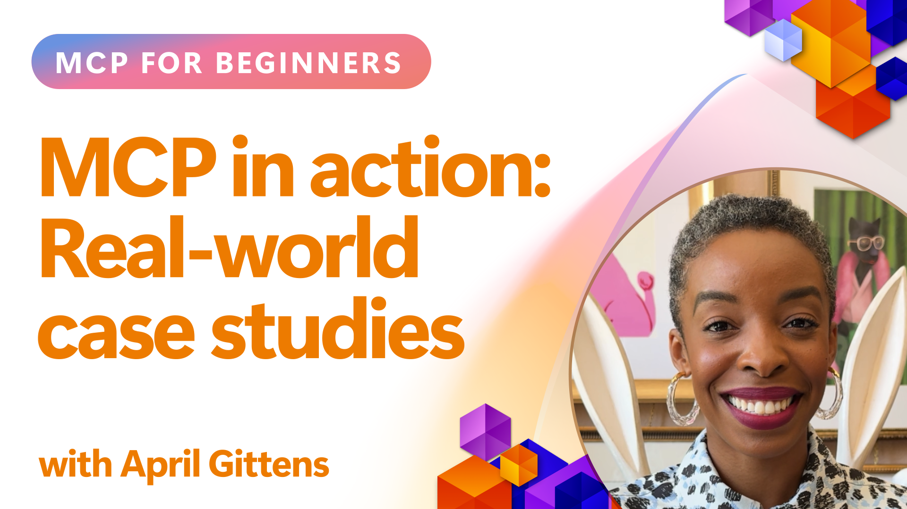

<!--
CO_OP_TRANSLATOR_METADATA:
{
  "original_hash": "1611dc5f6a2a35a789fc4c95fc5bfbe8",
  "translation_date": "2025-09-26T19:25:45+00:00",
  "source_file": "09-CaseStudy/README.md",
  "language_code": "lt"
}
-->
# MCP veiksme: realių atvejų analizė

_(Spustelėkite paveikslėlį aukščiau, kad peržiūrėtumėte šios pamokos vaizdo įrašą)_

Model Context Protocol (MCP) keičia būdą, kaip AI programos sąveikauja su duomenimis, įrankiais ir paslaugomis. Šiame skyriuje pateikiami realūs atvejų tyrimai, kurie parodo praktinį MCP taikymą įvairiose verslo situacijose.

## Apžvalga

Šiame skyriuje pateikiami konkretūs MCP įgyvendinimo pavyzdžiai, pabrėžiant, kaip organizacijos naudoja šį protokolą sudėtingoms verslo problemoms spręsti. Analizuodami šiuos atvejus, sužinosite apie MCP universalumą, mastelį ir praktinę naudą realiame pasaulyje.

## Pagrindiniai mokymosi tikslai

Analizuodami šiuos atvejų tyrimus, jūs:

- Suprasite, kaip MCP gali būti taikomas konkrečioms verslo problemoms spręsti
- Sužinosite apie skirtingus integracijos modelius ir architektūrinius metodus
- Atpažinsite geriausias MCP įgyvendinimo praktikas verslo aplinkoje
- Įgysite įžvalgų apie iššūkius ir sprendimus, susijusius su realiais įgyvendinimais
- Identifikuosite galimybes taikyti panašius modelius savo projektuose

## Pateikti atvejų tyrimai

### 1. [Azure AI kelionių agentai – pavyzdinė įgyvendinimo schema](./travelagentsample.md)

Šiame atvejų tyrime nagrinėjamas „Microsoft“ išsamus pavyzdinis sprendimas, kuris parodo, kaip sukurti daugiaveiksnį, AI pagrįstą kelionių planavimo programą naudojant MCP, Azure OpenAI ir Azure AI Search. Projektas demonstruoja:

- Daugiaveiksnę koordinaciją per MCP
- Verslo duomenų integraciją su Azure AI Search
- Saugią, mastelio keičiamą architektūrą naudojant Azure paslaugas
- Išplečiamus įrankius su pakartotinai naudojamais MCP komponentais
- Pokalbių vartotojo patirtį, pagrįstą Azure OpenAI

Architektūros ir įgyvendinimo detalės suteikia vertingų įžvalgų, kaip kurti sudėtingas daugiaveiksnes sistemas, kur MCP veikia kaip koordinavimo sluoksnis.

### 2. [Azure DevOps elementų atnaujinimas iš YouTube duomenų](./UpdateADOItemsFromYT.md)

Šiame atvejų tyrime demonstruojamas praktinis MCP taikymas darbo procesų automatizavimui. Jame parodoma, kaip MCP įrankiai gali būti naudojami:

- Duomenų iš internetinių platformų (YouTube) išgavimui
- Darbo elementų atnaujinimui Azure DevOps sistemose
- Kartotinių automatizavimo darbo procesų kūrimui
- Duomenų integracijai tarp skirtingų sistemų

Šis pavyzdys parodo, kaip net palyginti paprasti MCP įgyvendinimai gali suteikti reikšmingą efektyvumo padidėjimą, automatizuojant rutinines užduotis ir gerinant duomenų nuoseklumą tarp sistemų.

### 3. [Realaus laiko dokumentacijos gavimas su MCP](./docs-mcp/README.md)

Šiame atvejų tyrime pateikiama, kaip prijungti Python konsolės klientą prie Model Context Protocol (MCP) serverio, kad būtų galima gauti ir registruoti realaus laiko, kontekstui pritaikytą „Microsoft“ dokumentaciją. Sužinosite, kaip:

- Prisijungti prie MCP serverio naudojant Python klientą ir oficialų MCP SDK
- Naudoti srautinio HTTP klientus efektyviam, realaus laiko duomenų gavimui
- Kviesti dokumentacijos įrankius serveryje ir registruoti atsakymus tiesiai į konsolę
- Integruoti naujausią „Microsoft“ dokumentaciją į savo darbo procesą neišeinant iš terminalo

Skyriuje pateikiama praktinė užduotis, minimalus veikiančio kodo pavyzdys ir nuorodos į papildomus išteklius gilesniam mokymuisi. Peržiūrėkite visą vadovą ir kodą susietame skyriuje, kad suprastumėte, kaip MCP gali pakeisti dokumentacijos prieigą ir kūrėjų produktyvumą konsolės aplinkoje.

### 4. [Interaktyvus mokymosi plano generatorius su MCP](./docs-mcp/README.md)

Šiame atvejų tyrime demonstruojama, kaip sukurti interaktyvią interneto programą naudojant Chainlit ir Model Context Protocol (MCP), kad būtų galima generuoti asmeninius mokymosi planus bet kuria tema. Vartotojai gali nurodyti temą (pvz., „AI-900 sertifikatas“) ir mokymosi trukmę (pvz., 8 savaites), o programa pateiks savaitės rekomendacijas. Chainlit suteikia pokalbių sąsają, kuri daro patirtį įtraukiančią ir pritaikomą.

- Pokalbių interneto programa, pagrįsta Chainlit
- Vartotojo nurodomi raginimai temai ir trukmei
- Savaitės turinio rekomendacijos naudojant MCP
- Realaus laiko, pritaikomi atsakymai pokalbių sąsajoje

Projektas parodo, kaip pokalbių AI ir MCP gali būti sujungti, kad būtų sukurti dinamiški, vartotojo valdomi mokymosi įrankiai šiuolaikinėje interneto aplinkoje.

### 5. [Dokumentacija redaktoriuje su MCP serveriu VS Code](./docs-mcp/README.md)

Šiame atvejų tyrime demonstruojama, kaip „Microsoft Learn Docs“ galima tiesiogiai integruoti į VS Code aplinką naudojant MCP serverį – nebereikia perjungti naršyklės skirtukų! Sužinosite, kaip:

- Akimirksniu ieškoti ir skaityti dokumentus VS Code naudojant MCP panelę ar komandų paletę
- Nurodyti dokumentaciją ir įterpti nuorodas tiesiai į README ar kursų markdown failus
- Naudoti GitHub Copilot ir MCP kartu, kad būtų užtikrintas sklandus, AI pagrįstas dokumentacijos ir kodo darbo procesas
- Tikrinti ir tobulinti dokumentaciją su realaus laiko atsiliepimais ir „Microsoft“ tikslumu
- Integruoti MCP su GitHub darbo procesais nuolatiniam dokumentacijos tikrinimui

Įgyvendinimas apima:

- Pavyzdinę `.vscode/mcp.json` konfigūraciją lengvam nustatymui
- Vaizdinius vadovus apie redaktoriaus patirtį
- Patarimus, kaip maksimaliai padidinti produktyvumą derinant Copilot ir MCP

Šis scenarijus idealiai tinka kursų autoriams, dokumentacijos rašytojams ir kūrėjams, kurie nori išlikti susikoncentravę redaktoriuje, dirbdami su dokumentais, Copilot ir tikrinimo įrankiais – visa tai valdoma MCP.

### 6. [APIM MCP serverio kūrimas](./apimsample.md)

Šiame atvejų tyrime pateikiamas žingsnis po žingsnio vadovas, kaip sukurti MCP serverį naudojant Azure API Management (APIM). Jame aptariama:

- MCP serverio nustatymas Azure API Management
- API operacijų eksponavimas kaip MCP įrankiai
- Politikų konfigūravimas ribojimui ir saugumui
- MCP serverio testavimas naudojant Visual Studio Code ir GitHub Copilot

Šis pavyzdys parodo, kaip pasinaudoti Azure galimybėmis kuriant patikimą MCP serverį, kuris gali būti naudojamas įvairiose programose, gerinant AI sistemų integraciją su verslo API.

### 7. [GitHub MCP registras – agentinės integracijos spartinimas](https://github.com/mcp)

Šiame atvejų tyrime nagrinėjama, kaip GitHub MCP registras, paleistas 2025 m. rugsėjį, sprendžia svarbią problemą AI ekosistemoje: išsklaidytą MCP serverių atradimą ir diegimą.

#### Apžvalga
**MCP registras** sprendžia augančią problemą, susijusią su išsklaidytų MCP serverių atradimu skirtinguose saugyklose ir registruose, kurie anksčiau lėtino integraciją ir kėlė klaidų riziką. Šie serveriai leidžia AI agentams sąveikauti su išorinėmis sistemomis, tokiomis kaip API, duomenų bazės ir dokumentacijos šaltiniai.

#### Problemos aprašymas
Kūrėjai, kuriantys agentinius darbo procesus, susidūrė su keliomis problemomis:
- **Prasta atradimo galimybė** MCP serverių skirtingose platformose
- **Pasikartojantys nustatymo klausimai** išsklaidyti forumuose ir dokumentacijoje
- **Saugumo rizika** dėl nepatikrintų ir nepatikimų šaltinių
- **Standartizacijos trūkumas** serverių kokybės ir suderinamumo srityje

#### Sprendimo architektūra
GitHub MCP registras centralizuoja patikimus MCP serverius su pagrindinėmis funkcijomis:
- **Vieno paspaudimo diegimas** integracija per VS Code, kad būtų supaprastintas nustatymas
- **Signalas virš triukšmo** rūšiavimas pagal žvaigždes, aktyvumą ir bendruomenės patvirtinimą
- **Tiesioginė integracija** su GitHub Copilot ir kitais MCP suderinamais įrankiais
- **Atvira indėlio modelis** leidžiantis tiek bendruomenei, tiek verslo partneriams prisidėti

#### Verslo poveikis
Registras suteikė matomus patobulinimus:
- **Greitesnis įsitraukimas** kūrėjams, naudojantiems įrankius, tokius kaip „Microsoft Learn MCP Server“, kuris tiesiogiai transliuoja oficialią dokumentaciją į agentus
- **Padidintas produktyvumas** per specializuotus serverius, tokius kaip `github-mcp-server`, leidžiant natūralios kalbos GitHub automatizavimą (PR kūrimas, CI paleidimas iš naujo, kodo nuskaitymas)
- **Stipresnis ekosistemos pasitikėjimas** per kuruotus sąrašus ir skaidrius konfigūracijos standartus

#### Strateginė vertė
Praktikams, specializuojantiems agentų gyvavimo ciklo valdyme ir atkuriamuose darbo procesuose, MCP registras suteikia:
- **Modulinio agento diegimo** galimybes su standartizuotais komponentais
- **Registru pagrįstas vertinimo pipelines** nuosekliam testavimui ir tikrinimui
- **Tarpįrankinį suderinamumą** leidžiant sklandžią integraciją tarp skirtingų AI platformų

Šis atvejų tyrimas parodo, kad MCP registras yra ne tik katalogas – tai pagrindinė platforma mastelio keičiamam, realaus pasaulio modelių integravimui ir agentinių sistemų diegimui.

## Išvada

Šie septyni išsamūs atvejų tyrimai parodo nepaprastą Model Context Protocol universalumą ir praktinį taikymą įvairiose realaus pasaulio situacijose. Nuo sudėtingų daugiaveiksnių kelionių planavimo sistemų ir verslo API valdymo iki supaprastintų dokumentacijos darbo procesų ir revoliucinio GitHub MCP registro – šie pavyzdžiai parodo, kaip MCP suteikia standartizuotą, mastelio keičiamą būdą sujungti AI sistemas su įrankiais, duomenimis ir paslaugomis, kurių jiems reikia, kad sukurtų išskirtinę vertę.

Atvejų tyrimai apima kelias MCP įgyvendinimo dimensijas:
- **Verslo integracija**: Azure API Management ir Azure DevOps automatizavimas
- **Daugiaveiksnė koordinacija**: Kelionių planavimas su koordinuotais AI agentais
- **Kūrėjų produktyvumas**: VS Code integracija ir realaus laiko dokumentacijos prieiga
- **Ekosistemos plėtra**: GitHub MCP registras kaip pagrindinė platforma
- **Švietimo taikymas**: Interaktyvūs mokymosi plano generatoriai ir pokalbių sąsajos

Analizuodami šiuos įgyvendinimus, įgysite svarbių įžvalgų apie:
- **Architektūrinius modelius** skirtingiems masteliams ir naudojimo atvejams
- **Įgyvendinimo strategijas**, kurios subalansuoja funkcionalumą ir palaikomumą
- **Saugumo ir mastelio keitimo** aspektus gamybos diegimams
- **Geriausias praktikas** MCP serverių kūrimui ir klientų integracijai
- **Ekosistemos mąstymą** kuriant tarpusavyje susijusius AI pagrįstus sprendimus

Šie pavyzdžiai kolektyviai parodo, kad MCP nėra tik teorinis pagrindas, bet brandus, gamybai paruoštas protokolas, leidžiantis praktiškai spręsti sudėtingas verslo problemas. Nesvarbu, ar kuriate paprastus automatizavimo įrankius, ar sudėtingas daugiaveiksnes sistemas, čia pateikti modeliai ir metodai suteikia tvirtą pagrindą jūsų MCP projektams.

## Papildomi ištekliai

- [Azure AI kelionių agentų GitHub saugykla](https://github.com/Azure-Samples/azure-ai-travel-agents)
- [Azure DevOps MCP įrankis](https://github.com/microsoft/azure-devops-mcp)
- [Playwright MCP įrankis](https://github.com/microsoft/playwright-mcp)
- [Microsoft Docs MCP serveris](https://github.com/MicrosoftDocs/mcp)
- [GitHub MCP registras – agentinės integracijos spartinimas](https://github.com/mcp)
- [MCP bendruomenės pavyzdžiai](https://github.com/microsoft/mcp)

Toliau: Praktinis laboratorinis darbas [AI darbo procesų supaprastinimas: MCP serverio kūrimas su AI įrankių rinkiniu](../10-StreamliningAIWorkflowsBuildingAnMCPServerWithAIToolkit/README.md)

---

