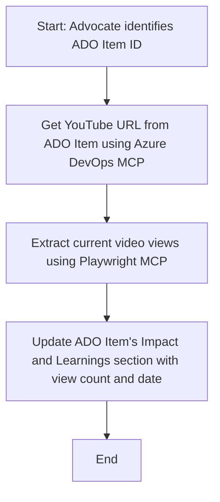

<!--
CO_OP_TRANSLATOR_METADATA:
{
  "original_hash": "14a2dfbea55ef735660a06bd6bdfe5f3",
  "translation_date": "2025-08-26T18:35:40+00:00",
  "source_file": "09-CaseStudy/UpdateADOItemsFromYT.md",
  "language_code": "lt"
}
-->
# Atvejo analizė: Azure DevOps elementų atnaujinimas naudojant YouTube duomenis ir MCP

> **Atsakomybės apribojimas:** Yra esamų internetinių įrankių ir ataskaitų, kurios gali automatizuoti Azure DevOps elementų atnaujinimą naudojant duomenis iš tokių platformų kaip YouTube. Toliau pateiktas scenarijus yra tik pavyzdys, skirtas iliustruoti, kaip MCP įrankiai gali būti pritaikyti automatizavimo ir integracijos užduotims.

## Apžvalga

Ši atvejo analizė parodo vieną pavyzdį, kaip Model Context Protocol (MCP) ir jo įrankiai gali būti naudojami automatizuoti Azure DevOps (ADO) darbo elementų atnaujinimo procesą, naudojant informaciją iš internetinių platformų, tokių kaip YouTube. Aprašytas scenarijus yra tik vienas iš daugelio šių įrankių galimybių pavyzdžių, kurie gali būti pritaikyti panašiems automatizavimo poreikiams.

Šiame pavyzdyje Advokatas stebi internetines sesijas naudodamas ADO elementus, kuriuose kiekvienas elementas turi YouTube vaizdo įrašo URL. Pasitelkęs MCP įrankius, Advokatas gali nuolat ir automatiškai atnaujinti ADO elementus su naujausiais vaizdo įrašo rodiklių duomenimis, pvz., peržiūrų skaičiumi. Šis metodas gali būti pritaikytas ir kitoms situacijoms, kai reikia integruoti informaciją iš internetinių šaltinių į ADO ar kitas sistemas.

## Scenarijus

Advokatas yra atsakingas už internetinių sesijų ir bendruomenės įsitraukimo poveikio stebėjimą. Kiekviena sesija yra užregistruota kaip ADO darbo elementas „DevRel“ projekte, o darbo elemente yra laukas, skirtas YouTube vaizdo įrašo URL. Kad galėtų tiksliai pateikti sesijos pasiekiamumo ataskaitą, Advokatas turi atnaujinti ADO elementą su dabartiniu vaizdo įrašo peržiūrų skaičiumi ir data, kada ši informacija buvo gauta.

## Naudoti įrankiai

- [Azure DevOps MCP](https://github.com/microsoft/azure-devops-mcp): Leidžia programiškai pasiekti ir atnaujinti ADO darbo elementus naudojant MCP.
- [Playwright MCP](https://github.com/microsoft/playwright-mcp): Automatizuoja naršyklės veiksmus, kad būtų galima gauti tiesioginius duomenis iš interneto puslapių, pvz., YouTube vaizdo įrašo statistiką.

## Žingsnis po žingsnio darbo eiga

1. **Identifikuoti ADO elementą**: Pradėkite nuo ADO darbo elemento ID (pvz., 1234) „DevRel“ projekte.
2. **Gauti YouTube URL**: Naudokite Azure DevOps MCP įrankį, kad gautumėte YouTube URL iš darbo elemento.
3. **Išgauti vaizdo įrašo peržiūras**: Naudokite Playwright MCP įrankį, kad naršytumėte į YouTube URL ir išgautumėte dabartinį peržiūrų skaičių.
4. **Atnaujinti ADO elementą**: Įrašykite naujausią peržiūrų skaičių ir gavimo datą į „Poveikio ir mokymosi“ sekciją ADO darbo elemente, naudodami Azure DevOps MCP įrankį.

## Pavyzdinis užklausos tekstas

```bash
- Work with the ADO Item ID: 1234
- The project is '2025-Awesome'
- Get the YouTube URL for the ADO item
- Use Playwright to get the current views from the YouTube video
- Update the ADO item with the current video views and the updated date of the information
```

## Mermaid diagrama



## Techninė įgyvendinimo dalis

- **MCP koordinavimas**: Darbo eiga yra koordinuojama MCP serverio, kuris suderina Azure DevOps MCP ir Playwright MCP įrankių naudojimą.
- **Automatizavimas**: Procesas gali būti paleidžiamas rankiniu būdu arba suplanuotas vykdyti reguliariais intervalais, kad ADO elementai būtų nuolat atnaujinami.
- **Išplečiamumas**: Tas pats modelis gali būti pritaikytas ADO elementų atnaujinimui su kitais internetiniais rodikliais (pvz., „patinka“, komentarais) arba iš kitų platformų.

## Rezultatai ir poveikis

- **Efektyvumas**: Sumažina rankinio darbo poreikį Advokatams, automatizuojant vaizdo įrašo rodiklių gavimą ir atnaujinimą.
- **Tikslumas**: Užtikrina, kad ADO elementai atspindėtų naujausius duomenis, gautus iš internetinių šaltinių.
- **Pakartojamumas**: Suteikia pakartotinai naudojamą darbo eigą panašiems scenarijams, susijusiems su kitais duomenų šaltiniais ar rodikliais.

## Nuorodos

- [Azure DevOps MCP](https://github.com/microsoft/azure-devops-mcp)
- [Playwright MCP](https://github.com/microsoft/playwright-mcp)
- [Model Context Protocol (MCP)](https://modelcontextprotocol.io/)

---

**Atsakomybės apribojimas**:  
Šis dokumentas buvo išverstas naudojant AI vertimo paslaugą [Co-op Translator](https://github.com/Azure/co-op-translator). Nors siekiame tikslumo, prašome atkreipti dėmesį, kad automatiniai vertimai gali turėti klaidų ar netikslumų. Originalus dokumentas jo gimtąja kalba turėtų būti laikomas autoritetingu šaltiniu. Kritinei informacijai rekomenduojama naudoti profesionalų žmogaus vertimą. Mes neprisiimame atsakomybės už nesusipratimus ar klaidingus aiškinimus, atsiradusius dėl šio vertimo naudojimo.