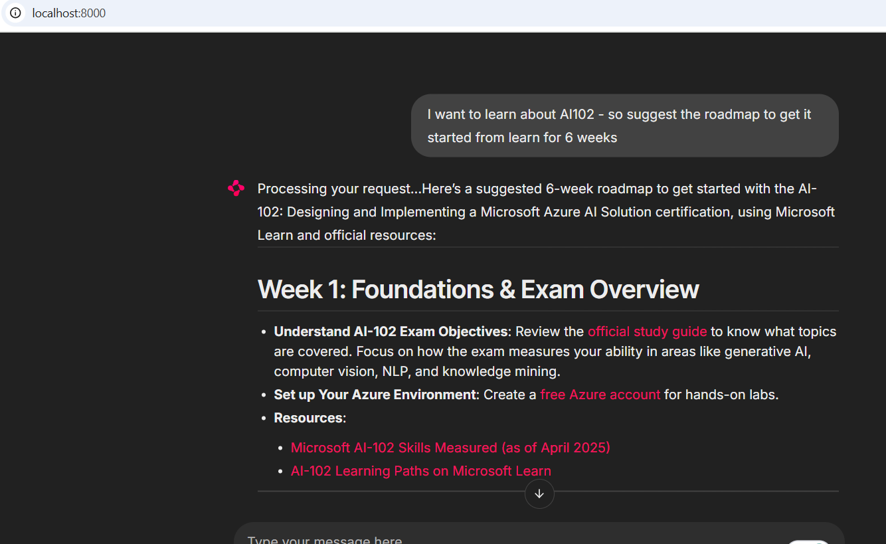
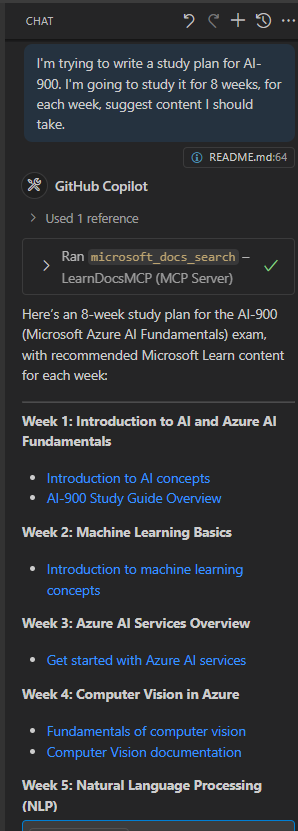

<!--
CO_OP_TRANSLATOR_METADATA:
{
  "original_hash": "4319d291c9d124ecafea52b3d04bfa0e",
  "translation_date": "2025-08-26T18:35:55+00:00",
  "source_file": "09-CaseStudy/docs-mcp/README.md",
  "language_code": "lt"
}
-->
# Atvejo analizė: Prisijungimas prie Microsoft Learn Docs MCP serverio iš kliento

Ar kada nors teko blaškytis tarp dokumentacijos svetainių, „Stack Overflow“ ir nesibaigiančių paieškos variklių skirtukų, bandant išspręsti problemą savo kode? Galbūt turite antrą monitorių, skirtą tik dokumentacijai, arba nuolat perjungiate langus tarp IDE ir naršyklės. Ar nebūtų geriau, jei dokumentacija būtų integruota tiesiai į jūsų darbo eigą—į jūsų programas, IDE ar net jūsų pačių sukurtus įrankius? Šioje atvejo analizėje aptarsime, kaip tai padaryti, prisijungiant tiesiogiai prie Microsoft Learn Docs MCP serverio iš savo kliento programos.

## Apžvalga

Šiuolaikinis programavimas yra ne tik kodavimas—tai ir tinkamos informacijos radimas tinkamu metu. Dokumentacija yra visur, tačiau retai ten, kur jos labiausiai reikia: jūsų įrankiuose ir darbo eigoje. Integruodami dokumentacijos paiešką tiesiai į savo programas, galite sutaupyti laiko, sumažinti konteksto perjungimą ir padidinti produktyvumą. Šiame skyriuje parodysime, kaip prisijungti prie Microsoft Learn Docs MCP serverio, kad galėtumėte pasiekti realaus laiko, konteksto pagrindu veikiančią dokumentaciją neišeidami iš savo programos.

Mes aptarsime, kaip užmegzti ryšį, siųsti užklausą ir efektyviai apdoroti srautinį atsakymą. Šis požiūris ne tik supaprastina jūsų darbo eigą, bet ir suteikia galimybę kurti išmanesnius, naudingesnius įrankius programuotojams.

## Mokymosi tikslai

Kodėl tai darome? Nes geriausia programuotojo patirtis yra ta, kuri pašalina trukdžius. Įsivaizduokite pasaulį, kuriame jūsų kodo redaktorius, pokalbių robotas ar internetinė programa gali akimirksniu atsakyti į jūsų dokumentacijos klausimus, naudodamiesi naujausiu Microsoft Learn turiniu. Šio skyriaus pabaigoje jūs sužinosite, kaip:

- Suprasti MCP serverio ir kliento komunikacijos pagrindus dokumentacijai
- Įgyvendinti konsolės ar internetinę programą, kuri prisijungia prie Microsoft Learn Docs MCP serverio
- Naudoti srautinį HTTP klientą realaus laiko dokumentacijos paieškai
- Registruoti ir interpretuoti dokumentacijos atsakymus savo programoje

Jūs pamatysite, kaip šie įgūdžiai gali padėti kurti įrankius, kurie yra ne tik reaguojantys, bet ir interaktyvūs bei konteksto pagrindu veikiantys.

## Scenarijus 1 - Realiojo laiko dokumentacijos paieška su MCP

Šiame scenarijuje parodysime, kaip prisijungti prie Microsoft Learn Docs MCP serverio, kad galėtumėte pasiekti realaus laiko, konteksto pagrindu veikiančią dokumentaciją neišeidami iš savo programos.

### Kodėl šis požiūris?
Nes tai yra pagrindas kuriant pažangesnes integracijas—nesvarbu, ar norite sukurti pokalbių robotą, IDE plėtinį ar internetinį valdymo skydelį.

Jūs rasite kodą ir instrukcijas šio scenarijaus [`solution`](./solution/README.md) aplanke. Žingsniai padės jums nustatyti ryšį:
- Naudokite oficialų MCP SDK ir srautinį HTTP klientą ryšiui
- Iškvieskite `microsoft_docs_search` įrankį su užklausos parametru dokumentacijai gauti
- Įgyvendinkite tinkamą registravimą ir klaidų tvarkymą
- Sukurkite interaktyvią konsolės sąsają, leidžiančią vartotojams įvesti kelias paieškos užklausas

Šis scenarijus parodo, kaip:
- Prisijungti prie Docs MCP serverio
- Siųsti užklausą
- Analizuoti ir atspausdinti rezultatus

Štai kaip gali atrodyti sprendimo vykdymas:

```
Prompt> What is Azure Key Vault?
Answer> Azure Key Vault is a cloud service for securely storing and accessing secrets. ...
```

Žemiau pateikiamas minimalus sprendimo pavyzdys. Pilnas kodas ir detalės yra prieinami sprendimo aplanke.

<details>
<summary>Python</summary>

```python
import asyncio
from mcp.client.streamable_http import streamablehttp_client
from mcp import ClientSession

async def main():
    async with streamablehttp_client("https://learn.microsoft.com/api/mcp") as (read_stream, write_stream, _):
        async with ClientSession(read_stream, write_stream) as session:
            await session.initialize()
            result = await session.call_tool("microsoft_docs_search", {"query": "Azure Functions best practices"})
            print(result.content)

if __name__ == "__main__":
    asyncio.run(main())
```

- Pilną įgyvendinimą ir registravimą rasite [`scenario1.py`](../../../../09-CaseStudy/docs-mcp/solution/python/scenario1.py).
- Diegimo ir naudojimo instrukcijas rasite [`README.md`](./solution/python/README.md) faile tame pačiame aplanke.
</details>

## Scenarijus 2 - Interaktyvus mokymosi plano generatorius internetinėje programoje su MCP

Šiame scenarijuje sužinosite, kaip integruoti Docs MCP į internetinės programos kūrimo projektą. Tikslas yra leisti vartotojams ieškoti Microsoft Learn dokumentacijos tiesiai iš internetinės sąsajos, kad dokumentacija būtų akimirksniu pasiekiama jūsų programoje ar svetainėje.

Jūs pamatysite, kaip:
- Nustatyti internetinę programą
- Prisijungti prie Docs MCP serverio
- Tvarkyti vartotojo įvestį ir rodyti rezultatus

Štai kaip gali atrodyti sprendimo vykdymas:

```
User> I want to learn about AI102 - so suggest the roadmap to get it started from learn for 6 weeks

Assistant> Here’s a detailed 6-week roadmap to start your preparation for the AI-102: Designing and Implementing a Microsoft Azure AI Solution certification, using official Microsoft resources and focusing on exam skills areas:

---
## Week 1: Introduction & Fundamentals
- **Understand the Exam**: Review the [AI-102 exam skills outline](https://learn.microsoft.com/en-us/credentials/certifications/exams/ai-102/).
- **Set up Azure**: Sign up for a free Azure account if you don't have one.
- **Learning Path**: [Introduction to Azure AI services](https://learn.microsoft.com/en-us/training/modules/intro-to-azure-ai/)
- **Focus**: Get familiar with Azure portal, AI capabilities, and necessary tools.

....more weeks of the roadmap...

Let me know if you want module-specific recommendations or need more customized weekly tasks!
```

Žemiau pateikiamas minimalus sprendimo pavyzdys. Pilnas kodas ir detalės yra prieinami sprendimo aplanke.



<details>
<summary>Python (Chainlit)</summary>

Chainlit yra sistema, skirta kurti pokalbių AI internetines programas. Ji leidžia lengvai kurti interaktyvius pokalbių robotus ir asistentus, kurie gali iškviesti MCP įrankius ir realiu laiku rodyti rezultatus. Tai idealu greitam prototipų kūrimui ir vartotojui patogioms sąsajoms.

```python
import chainlit as cl
import requests

MCP_URL = "https://learn.microsoft.com/api/mcp"

@cl.on_message
def handle_message(message):
    query = {"question": message}
    response = requests.post(MCP_URL, json=query)
    if response.ok:
        result = response.json()
        cl.Message(content=result.get("answer", "No answer found.")).send()
    else:
        cl.Message(content="Error: " + response.text).send()
```

- Pilną įgyvendinimą rasite [`scenario2.py`](../../../../09-CaseStudy/docs-mcp/solution/python/scenario2.py).
- Nustatymo ir vykdymo instrukcijas rasite [`README.md`](./solution/python/README.md).
</details>

## Scenarijus 3: Dokumentacija redaktoriuje su MCP serveriu VS Code

Jei norite gauti Microsoft Learn dokumentaciją tiesiai savo VS Code (užuot perjungę naršyklės skirtukus), galite naudoti MCP serverį savo redaktoriuje. Tai leidžia:
- Ieškoti ir skaityti dokumentaciją VS Code neišeinant iš kodavimo aplinkos.
- Nurodyti dokumentaciją ir įterpti nuorodas tiesiai į savo README ar kursų failus.
- Naudoti GitHub Copilot ir MCP kartu, kad sukurtumėte sklandžią, AI pagrindu veikiančią dokumentacijos darbo eigą.

**Jūs sužinosite, kaip:**
- Pridėti galiojantį `.vscode/mcp.json` failą į savo darbo aplanko šaknį (žr. pavyzdį žemiau).
- Atidaryti MCP panelę arba naudoti komandų paletę VS Code dokumentacijai ieškoti ir įterpti.
- Nurodyti dokumentaciją tiesiai savo markdown failuose dirbant.
- Derinti šią darbo eigą su GitHub Copilot dar didesniam produktyvumui.

Štai pavyzdys, kaip nustatyti MCP serverį VS Code:

```json
{
  "servers": {
    "LearnDocsMCP": {
      "url": "https://learn.microsoft.com/api/mcp"
    }
  }
}
```

</details>

> Išsamų vadovą su ekrano nuotraukomis ir žingsnis po žingsnio instrukcijas rasite [`README.md`](./solution/scenario3/README.md).



Šis požiūris yra idealus visiems, kurie kuria techninius kursus, rašo dokumentaciją ar kuria kodą, dažnai remdamiesi nuorodomis.

## Pagrindinės išvados

Dokumentacijos integravimas tiesiai į jūsų įrankius nėra tik patogumas—tai produktyvumo revoliucija. Prisijungdami prie Microsoft Learn Docs MCP serverio iš savo kliento, galite:

- Pašalinti konteksto perjungimą tarp kodo ir dokumentacijos
- Gauti naujausią, konteksto pagrindu veikiančią dokumentaciją realiu laiku
- Kurti išmanesnius, interaktyvesnius programuotojų įrankius

Šie įgūdžiai padės jums kurti sprendimus, kurie yra ne tik efektyvūs, bet ir malonūs naudoti.

## Papildomi ištekliai

Norėdami gilinti savo žinias, peržiūrėkite šiuos oficialius išteklius:

- [Microsoft Learn Docs MCP Server (GitHub)](https://github.com/MicrosoftDocs/mcp)
- [Pradėkite naudotis Azure MCP Server (mcp-python)](https://learn.microsoft.com/en-us/azure/developer/azure-mcp-server/get-started#create-the-python-app)
- [Kas yra Azure MCP Server?](https://learn.microsoft.com/en-us/azure/developer/azure-mcp-server/)
- [Model Context Protocol (MCP) Įvadas](https://modelcontextprotocol.io/introduction)
- [Pridėti MCP serverio įskiepius (Python)](https://learn.microsoft.com/en-us/semantic-kernel/concepts/plugins/adding-mcp-plugins)

---

**Atsakomybės atsisakymas**:  
Šis dokumentas buvo išverstas naudojant AI vertimo paslaugą [Co-op Translator](https://github.com/Azure/co-op-translator). Nors siekiame tikslumo, prašome atkreipti dėmesį, kad automatiniai vertimai gali turėti klaidų ar netikslumų. Originalus dokumentas jo gimtąja kalba turėtų būti laikomas autoritetingu šaltiniu. Kritinei informacijai rekomenduojama naudoti profesionalų žmogaus vertimą. Mes neprisiimame atsakomybės už nesusipratimus ar klaidingus interpretavimus, atsiradusius dėl šio vertimo naudojimo.