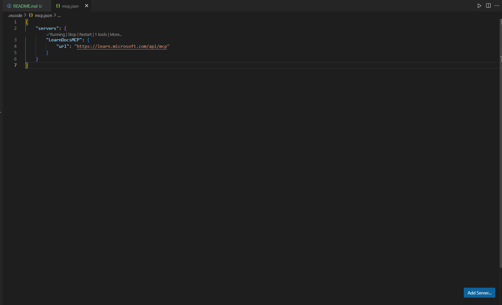
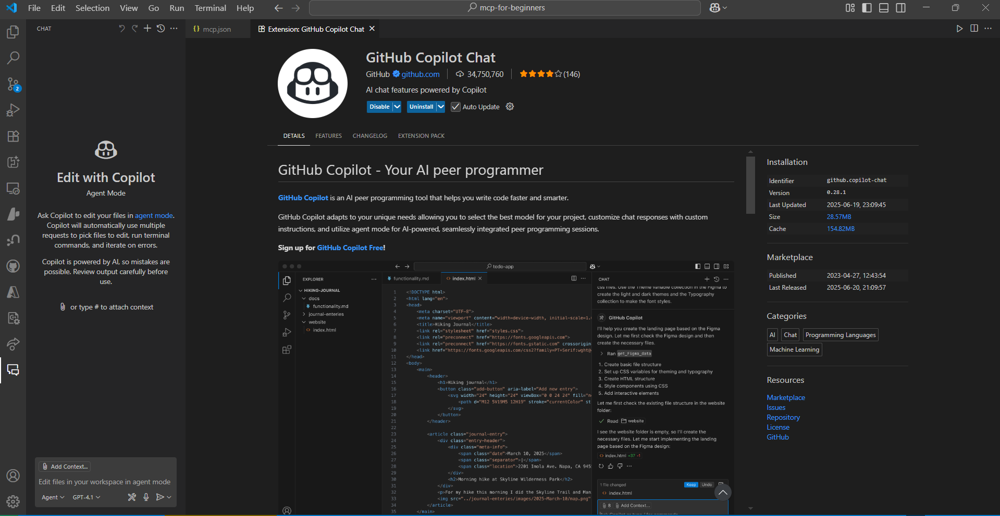
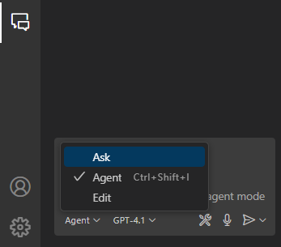
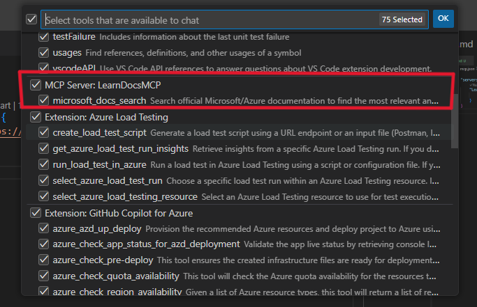
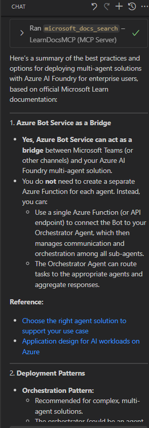

<!--
CO_OP_TRANSLATOR_METADATA:
{
  "original_hash": "db532b1ec386c9ce38c791653dc3c881",
  "translation_date": "2025-08-26T18:36:25+00:00",
  "source_file": "09-CaseStudy/docs-mcp/solution/scenario3/README.md",
  "language_code": "lt"
}
-->
# Scenarijus 3: Dokumentacija redaktoriuje su MCP serveriu VS Code

## Apžvalga

Šiame scenarijuje sužinosite, kaip integruoti Microsoft Learn dokumentaciją tiesiai į savo Visual Studio Code aplinką naudojant MCP serverį. Vietoj nuolatinio naršyklės skirtukų keitimo ieškant dokumentacijos, galėsite pasiekti, ieškoti ir naudoti oficialią dokumentaciją tiesiai redaktoriuje. Šis metodas supaprastina darbo eigą, leidžia išlaikyti dėmesį ir sklandžiai integruoti įrankius, tokius kaip GitHub Copilot.

- Ieškokite ir skaitykite dokumentaciją VS Code neišeidami iš kodavimo aplinkos.
- Naudokite dokumentaciją ir įterpkite nuorodas tiesiai į README ar kursų failus.
- Naudokite GitHub Copilot ir MCP kartu, kad sukurtumėte sklandžią, dirbtiniu intelektu paremtą dokumentacijos darbo eigą.

## Mokymosi tikslai

Šio skyriaus pabaigoje suprasite, kaip nustatyti ir naudoti MCP serverį VS Code, kad pagerintumėte savo dokumentacijos ir kūrimo darbo eigą. Jūs galėsite:

- Suprasti, kaip sukonfigūruoti savo darbo aplinką MCP serverio naudojimui dokumentacijos paieškai.
- Ieškoti ir įterpti dokumentaciją tiesiai iš VS Code.
- Derinti GitHub Copilot ir MCP galimybes, kad darbo eiga būtų produktyvesnė ir paremta dirbtiniu intelektu.

Šie įgūdžiai padės išlaikyti dėmesį, pagerinti dokumentacijos kokybę ir padidinti produktyvumą kaip kūrėjui ar techniniam rašytojui.

## Sprendimas

Norėdami pasiekti dokumentaciją redaktoriuje, atliksite kelis veiksmus, kurie integruos MCP serverį su VS Code ir GitHub Copilot. Šis sprendimas puikiai tinka kursų autoriams, dokumentacijos rašytojams ir kūrėjams, kurie nori išlaikyti dėmesį redaktoriuje dirbdami su dokumentacija ir Copilot.

- Greitai pridėkite nuorodas į README rašydami kursų ar projekto dokumentaciją.
- Naudokite Copilot kodui generuoti ir MCP, kad greitai rastumėte ir cituotumėte atitinkamą dokumentaciją.
- Išlaikykite dėmesį redaktoriuje ir padidinkite produktyvumą.

### Žingsnis po žingsnio vadovas

Norėdami pradėti, atlikite šiuos veiksmus. Kiekvienam žingsniui galite pridėti ekrano kopiją iš assets aplanko, kad vizualiai iliustruotumėte procesą.

1. **Pridėkite MCP konfigūraciją:**
   Savo projekto šakniniame kataloge sukurkite `.vscode/mcp.json` failą ir pridėkite šią konfigūraciją:
   ```json
   {
     "servers": {
       "LearnDocsMCP": {
         "url": "https://learn.microsoft.com/api/mcp"
       }
     }
   }
   ```
   Ši konfigūracija nurodo VS Code, kaip prisijungti prie [`Microsoft Learn Docs MCP serverio`](https://github.com/MicrosoftDocs/mcp).
   
   
    
2. **Atidarykite GitHub Copilot pokalbių skydelį:**
   Jei dar neturite įdiegto GitHub Copilot plėtinio, eikite į VS Code plėtinių peržiūrą ir įdiekite jį. Galite jį atsisiųsti tiesiai iš [Visual Studio Code Marketplace](https://marketplace.visualstudio.com/items?itemName=GitHub.copilot-chat). Tada atidarykite Copilot pokalbių skydelį iš šoninės juostos.

   

3. **Įjunkite agento režimą ir patikrinkite įrankius:**
   Copilot pokalbių skydelyje įjunkite agento režimą.

   

   Įjungę agento režimą, patikrinkite, ar MCP serveris yra vienas iš galimų įrankių. Tai užtikrina, kad Copilot agentas gali pasiekti dokumentacijos serverį ir gauti atitinkamą informaciją.
   
   

4. **Pradėkite naują pokalbį ir pateikite užklausą agentui:**
   Atidarykite naują pokalbį Copilot pokalbių skydelyje. Dabar galite pateikti agentui savo dokumentacijos užklausas. Agentas naudos MCP serverį, kad gautų ir parodytų atitinkamą Microsoft Learn dokumentaciją tiesiai jūsų redaktoriuje.

   - *"Bandau sudaryti mokymosi planą temai X. Planuoju mokytis 8 savaites, kiekvienai savaitei pasiūlykite turinį, kurį turėčiau peržiūrėti."*

   

5. **Tiesioginė užklausa:**

   > Paimkime tiesioginę užklausą iš [#get-help](https://discord.gg/D6cRhjHWSC) skyriaus Azure AI Foundry Discord ([peržiūrėti originalią žinutę](https://discord.com/channels/1113626258182504448/1385498306720829572)):
   
   *"Ieškau atsakymų, kaip diegti kelių agentų sprendimą su AI agentais, sukurtais Azure AI Foundry. Nematau tiesioginio diegimo metodo, pvz., Copilot Studio kanalų. Taigi, kokie yra skirtingi būdai tai įgyvendinti, kad įmonės vartotojai galėtų sąveikauti ir atlikti darbą? Yra daugybė straipsnių/tinklaraščių, kurie teigia, kad tam galima naudoti Azure Bot paslaugą, kuri gali veikti kaip tiltas tarp MS Teams ir Azure AI Foundry agentų. Ar tai veiks, jei nustatysiu Azure botą, kuris jungiasi prie Orchestrator Agent Azure AI Foundry per Azure funkciją, kad atliktų orkestravimą, ar man reikia sukurti Azure funkciją kiekvienam AI agentui, kuris yra kelių agentų sprendimo dalis, kad atliktų orkestravimą Bot Framework? Bet kokie kiti pasiūlymai yra labai laukiami."*

   

   Agentas atsakys su atitinkamomis dokumentacijos nuorodomis ir santraukomis, kurias galėsite tiesiogiai įterpti į savo markdown failus arba naudoti kaip nuorodas savo kode.
   
### Pavyzdinės užklausos

Štai keletas pavyzdinių užklausų, kurias galite išbandyti. Šios užklausos parodys, kaip MCP serveris ir Copilot gali dirbti kartu, kad pateiktų momentinę, kontekstinę dokumentaciją ir nuorodas neišeinant iš VS Code:

- "Parodykite, kaip naudoti Azure Functions trigerius."
- "Įterpkite nuorodą į oficialią Azure Key Vault dokumentaciją."
- "Kokios yra geriausios praktikos Azure resursų apsaugai?"
- "Raskite greitą pradžią Azure AI paslaugoms."

Šios užklausos parodys, kaip MCP serveris ir Copilot gali dirbti kartu, kad pateiktų momentinę, kontekstinę dokumentaciją ir nuorodas neišeinant iš VS Code.

---

---

**Atsakomybės apribojimas**:  
Šis dokumentas buvo išverstas naudojant AI vertimo paslaugą [Co-op Translator](https://github.com/Azure/co-op-translator). Nors siekiame tikslumo, prašome atkreipti dėmesį, kad automatiniai vertimai gali turėti klaidų ar netikslumų. Originalus dokumentas jo gimtąja kalba turėtų būti laikomas autoritetingu šaltiniu. Kritinei informacijai rekomenduojama naudoti profesionalų žmogaus vertimą. Mes neprisiimame atsakomybės už nesusipratimus ar klaidingus interpretavimus, atsiradusius dėl šio vertimo naudojimo.