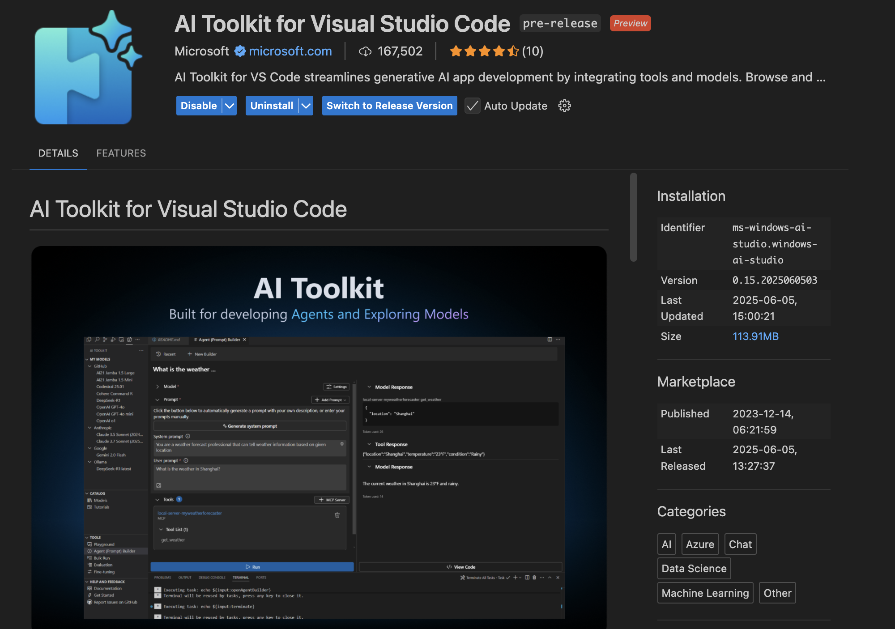
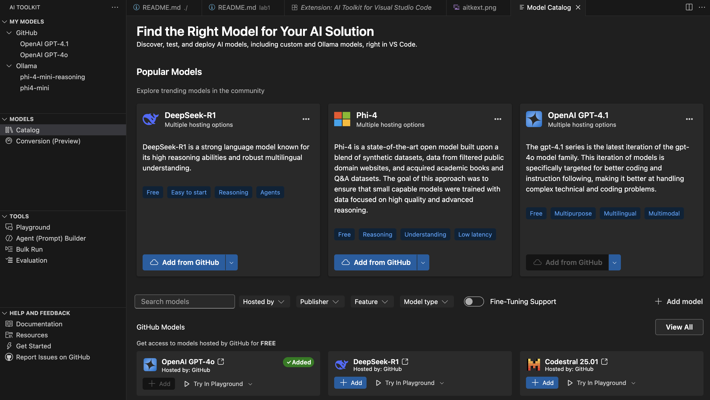
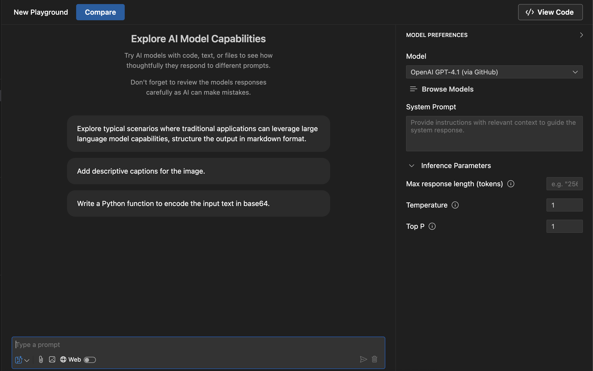
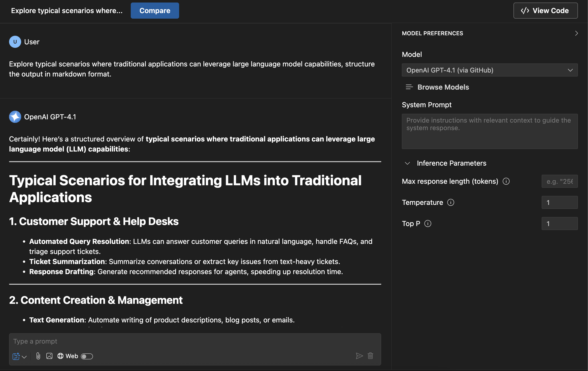
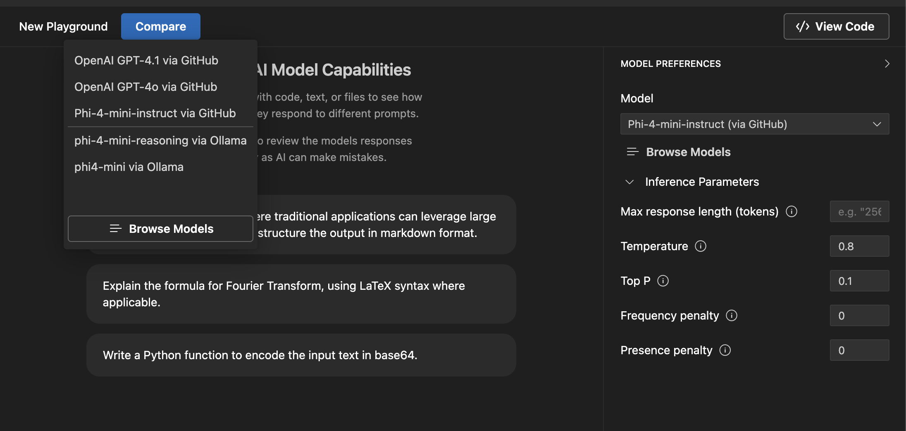
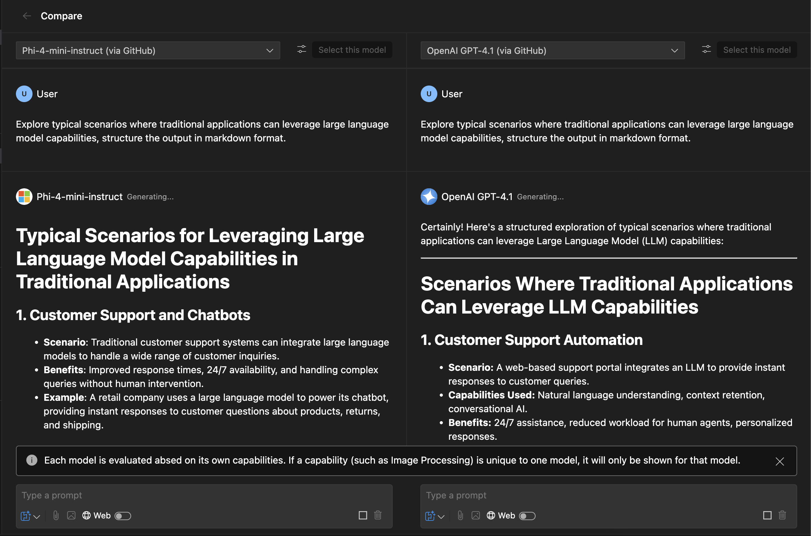
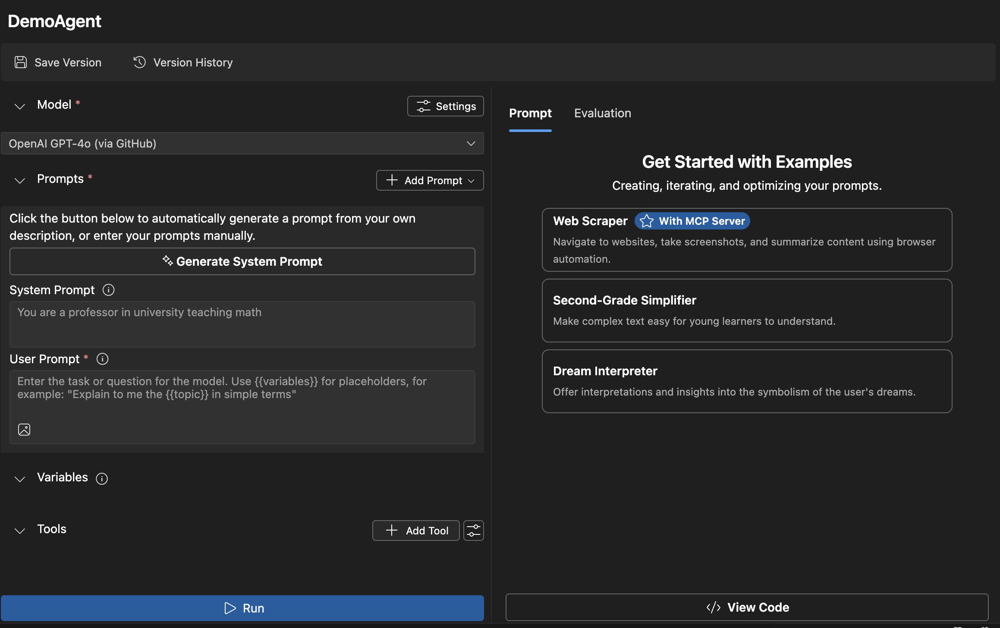
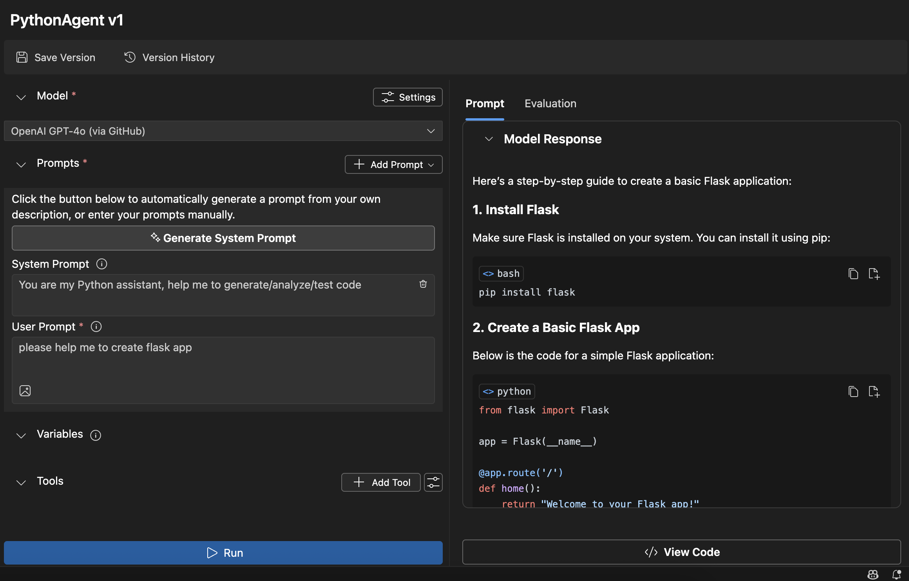

<!--
CO_OP_TRANSLATOR_METADATA:
{
  "original_hash": "2aa9dbc165e104764fa57e8a0d3f1c73",
  "translation_date": "2025-08-26T20:49:52+00:00",
  "source_file": "10-StreamliningAIWorkflowsBuildingAnMCPServerWithAIToolkit/lab1/README.md",
  "language_code": "lt"
}
-->
# 🚀 Modulis 1: AI Toolkit Pagrindai

[]()
[]()
[]()

## 📋 Mokymosi Tikslai

Baigę šį modulį, galėsite:
- ✅ Įdiegti ir sukonfigūruoti AI Toolkit Visual Studio Code aplinkoje
- ✅ Naršyti Modelių Katalogą ir suprasti skirtingus modelių šaltinius
- ✅ Naudoti Playground modelių testavimui ir eksperimentavimui
- ✅ Kurti individualius AI agentus naudodami Agent Builder
- ✅ Palyginti modelių našumą tarp skirtingų tiekėjų
- ✅ Taikyti geriausias praktikas kuriant užklausas (prompt engineering)

## 🧠 Įvadas į AI Toolkit (AITK)

**AI Toolkit for Visual Studio Code** yra pagrindinis „Microsoft“ plėtinys, kuris paverčia VS Code visapusiška AI kūrimo aplinka. Jis sujungia AI tyrimus su praktiniu taikymu, padarydamas generatyvųjį AI prieinamą visų lygių kūrėjams.

### 🌟 Pagrindinės Galimybės

| Funkcija | Aprašymas | Pritaikymas |
|----------|-----------|-------------|
| **🗂️ Modelių Katalogas** | Prieiga prie daugiau nei 100 modelių iš GitHub, ONNX, OpenAI, Anthropic, Google | Modelių atranka ir pasirinkimas |
| **🔌 BYOM Palaikymas** | Integruokite savo modelius (vietinius/nuotolinius) | Individualių modelių diegimas |
| **🎮 Interaktyvus Playground** | Realaus laiko modelių testavimas su pokalbių sąsaja | Greitas prototipų kūrimas ir testavimas |
| **📎 Multi-Modal Palaikymas** | Darbas su tekstu, vaizdais ir priedais | Sudėtingos AI programos |
| **⚡ Grupinis Apdorojimas** | Vienu metu vykdykite kelias užklausas | Efektyvūs testavimo procesai |
| **📊 Modelių Vertinimas** | Integruoti metrikos rodikliai (F1, aktualumas, panašumas, nuoseklumas) | Našumo vertinimas |

### 🎯 Kodėl AI Toolkit Yra Svarbus

- **🚀 Spartesnis Kūrimas**: Nuo idėjos iki prototipo per kelias minutes
- **🔄 Vieninga Darbo Aplinka**: Viena sąsaja keliems AI tiekėjams
- **🧪 Lengvas Eksperimentavimas**: Modelių palyginimas be sudėtingų nustatymų
- **📈 Paruošta Gamybai**: Sklandus perėjimas nuo prototipo prie diegimo

## 🛠️ Reikalavimai ir Nustatymas

### 📦 AI Toolkit Plėtinio Įdiegimas

**1 žingsnis: Prieiga prie Plėtinių Parduotuvės**
1. Atidarykite Visual Studio Code
2. Eikite į Plėtinių peržiūrą (`Ctrl+Shift+X` arba `Cmd+Shift+X`)
3. Ieškokite „AI Toolkit“

**2 žingsnis: Pasirinkite Versiją**
- **🟢 Stabilus Leidimas**: Rekomenduojama naudoti gamyboje
- **🔶 Išankstinis Leidimas**: Ankstyva prieiga prie naujausių funkcijų

**3 žingsnis: Įdiekite ir Aktyvuokite**



### ✅ Patikros Sąrašas
- [ ] AI Toolkit piktograma matoma VS Code šoninėje juostoje
- [ ] Plėtinys įjungtas ir aktyvuotas
- [ ] Nėra diegimo klaidų išvesties skydelyje

## 🧪 Praktinė Užduotis 1: GitHub Modelių Tyrinėjimas

**🎯 Tikslas**: Įvaldyti Modelių Katalogą ir išbandyti pirmąjį AI modelį

### 📊 1 žingsnis: Naršykite Modelių Katalogą

Modelių Katalogas yra jūsų vartai į AI ekosistemą. Jis apjungia modelius iš įvairių tiekėjų, leidžiant lengvai atrasti ir palyginti pasirinkimus.

**🔍 Naršymo Gidas:**

Paspauskite **MODELS - Catalog** AI Toolkit šoninėje juostoje



**💡 Patarimas**: Ieškokite modelių su specifinėmis galimybėmis, atitinkančiomis jūsų poreikius (pvz., kodo generavimas, kūrybinis rašymas, analizė).

**⚠️ Pastaba**: GitHub talpinami modeliai (t. y. GitHub Models) yra nemokami naudoti, tačiau jiems taikomi užklausų ir žetonų apribojimai. Jei norite pasiekti ne GitHub modelius (pvz., modelius, talpinamus per Azure AI ar kitus galinius taškus), turėsite pateikti tinkamą API raktą arba autentifikaciją.

### 🚀 2 žingsnis: Pridėkite ir Sujunkite Pirmąjį Modelį

**Modelio Pasirinkimo Strategija:**
- **GPT-4.1**: Geriausias sudėtingam mąstymui ir analizei
- **Phi-4-mini**: Lengvas, greitas atsakas paprastoms užduotims

**🔧 Konfigūravimo Procesas:**
1. Pasirinkite **OpenAI GPT-4.1** iš katalogo
2. Spustelėkite **Add to My Models** – tai užregistruos modelį naudojimui
3. Pasirinkite **Try in Playground**, kad paleistumėte testavimo aplinką
4. Palaukite, kol modelis bus inicializuotas (pirmą kartą tai gali užtrukti)



**⚙️ Modelio Parametrų Supratimas:**
- **Temperature**: Valdo kūrybiškumą (0 = deterministinis, 1 = kūrybiškas)
- **Max Tokens**: Maksimalus atsakymo ilgis
- **Top-p**: Nucleus atranka atsakymo įvairovei

### 🎯 3 žingsnis: Įvaldykite Playground Sąsają

Playground yra jūsų AI eksperimentų laboratorija. Štai kaip maksimaliai išnaudoti jos galimybes:

**🎨 Užklausų Kūrimo Geriausios Praktikos:**
1. **Būkite Konkretūs**: Aiškios, detalios instrukcijos duoda geresnius rezultatus
2. **Pateikite Kontekstą**: Įtraukite svarbią foninę informaciją
3. **Naudokite Pavyzdžius**: Parodykite modeliui, ko norite, naudodami pavyzdžius
4. **Iteruokite**: Tobulinkite užklausas pagal pradinius rezultatus

**🧪 Testavimo Scenarijai:**
```markdown
# Example 1: Code Generation
"Write a Python function that calculates the factorial of a number using recursion. Include error handling and docstrings."

# Example 2: Creative Writing
"Write a professional email to a client explaining a project delay, maintaining a positive tone while being transparent about challenges."

# Example 3: Data Analysis
"Analyze this sales data and provide insights: [paste your data]. Focus on trends, anomalies, and actionable recommendations."
```



### 🏆 Iššūkio Užduotis: Modelių Našumo Palyginimas

**🎯 Tikslas**: Palyginti skirtingus modelius naudojant identiškas užklausas, kad suprastumėte jų stipriąsias puses

**📋 Instrukcijos:**
1. Pridėkite **Phi-4-mini** į savo darbo aplinką
2. Naudokite tą pačią užklausą tiek GPT-4.1, tiek Phi-4-mini



3. Palyginkite atsakymų kokybę, greitį ir tikslumą
4. Dokumentuokite savo išvadas rezultatų skyriuje



**💡 Pagrindinės Įžvalgos:**
- Kada naudoti LLM prieš SLM
- Kainos ir našumo kompromisai
- Skirtingų modelių specializuotos galimybės

## 🤖 Praktinė Užduotis 2: Individualių Agentų Kūrimas su Agent Builder

**🎯 Tikslas**: Kurti specializuotus AI agentus, pritaikytus specifinėms užduotims ir darbo eigoms

### 🏗️ 1 žingsnis: Suprasti Agent Builder

Agent Builder yra vieta, kur AI Toolkit tikrai išsiskiria. Jis leidžia kurti tikslinius AI asistentus, kurie sujungia didelių kalbos modelių galią su individualiomis instrukcijomis, specifiniais parametrais ir specializuotomis žiniomis.

**🧠 Agentų Architektūros Komponentai:**
- **Pagrindinis Modelis**: LLM pagrindas (GPT-4, Groks, Phi ir kt.)
- **Sistemos Užklausa**: Apibrėžia agento asmenybę ir elgesį
- **Parametrai**: Optimizuoti nustatymai geriausiam našumui
- **Įrankių Integracija**: Prisijungimas prie išorinių API ir MCP paslaugų
- **Atmintis**: Pokalbio kontekstas ir sesijos išsaugojimas



### ⚙️ 2 žingsnis: Agentų Konfigūravimo Gylis

**🎨 Efektyvių Sistemos Užklausų Kūrimas:**
```markdown
# Template Structure:
## Role Definition
You are a [specific role] with expertise in [domain].

## Capabilities
- List specific abilities
- Define scope of knowledge
- Clarify limitations

## Behavior Guidelines
- Response style (formal, casual, technical)
- Output format preferences
- Error handling approach

## Examples
Provide 2-3 examples of ideal interactions
```

*Žinoma, galite naudoti Generate System Prompt, kad AI padėtų jums generuoti ir optimizuoti užklausas*

**🔧 Parametrų Optimizavimas:**
| Parametras | Rekomenduojamas Diapazonas | Pritaikymas |
|------------|----------------------------|-------------|
| **Temperature** | 0.1-0.3 | Techniniai/faktiniai atsakymai |
| **Temperature** | 0.7-0.9 | Kūrybinės/smegenų šturmo užduotys |
| **Max Tokens** | 500-1000 | Trumpi atsakymai |
| **Max Tokens** | 2000-4000 | Išsamūs paaiškinimai |

### 🐍 3 žingsnis: Praktinė Užduotis – Python Programavimo Agentas

**🎯 Misija**: Sukurti specializuotą Python programavimo asistentą

**📋 Konfigūravimo Žingsniai:**

1. **Modelio Pasirinkimas**: Pasirinkite **Claude 3.5 Sonnet** (puikiai tinka kodui)

2. **Sistemos Užklausos Dizainas**:
```markdown
# Python Programming Expert Agent

## Role
You are a senior Python developer with 10+ years of experience. You excel at writing clean, efficient, and well-documented Python code.

## Capabilities
- Write production-ready Python code
- Debug complex issues
- Explain code concepts clearly
- Suggest best practices and optimizations
- Provide complete working examples

## Response Format
- Always include docstrings
- Add inline comments for complex logic
- Suggest testing approaches
- Mention relevant libraries when applicable

## Code Quality Standards
- Follow PEP 8 style guidelines
- Use type hints where appropriate
- Handle exceptions gracefully
- Write readable, maintainable code
```

3. **Parametrų Konfigūravimas**:
   - Temperature: 0.2 (nuosekliam, patikimam kodui)
   - Max Tokens: 2000 (išsamūs paaiškinimai)
   - Top-p: 0.9 (subalansuotas kūrybiškumas)



### 🧪 4 žingsnis: Testuokite Savo Python Agentą

**Testavimo Scenarijai:**
1. **Paprasta Funkcija**: „Sukurkite funkciją pirminių skaičių radimui“
2. **Sudėtingas Algoritmas**: „Įgyvendinkite dvejetainį paieškos medį su įterpimo, ištrynimo ir paieškos metodais“
3. **Reali Problema**: „Sukurkite tinklalapio duomenų rinkiklį, kuris tvarko užklausų ribojimą ir pakartotinius bandymus“
4. **Derinimas**: „Pataisykite šį kodą [įklijuokite klaidingą kodą]“

**🏆 Sėkmės Kriterijai:**
- ✅ Kodas veikia be klaidų
- ✅ Yra tinkama dokumentacija
- ✅ Laikosi Python geriausių praktikų
- ✅ Pateikia aiškius paaiškinimus
- ✅ Siūlo patobulinimus

## 🎓 Modulio 1 Apibendrinimas ir Kiti Žingsniai

### 📊 Žinių Patikrinimas

Patikrinkite savo supratimą:
- [ ] Ar galite paaiškinti skirtumą tarp modelių kataloge?
- [ ] Ar sėkmingai sukūrėte ir išbandėte individualų agentą?
- [ ] Ar suprantate, kaip optimizuoti parametrus skirtingiems atvejams?
- [ ] Ar galite sukurti efektyvias sistemos užklausas?

### 📚 Papildomi Ištekliai

- **AI Toolkit Dokumentacija**: [Oficialūs Microsoft Dokumentai](https://github.com/microsoft/vscode-ai-toolkit)
- **Užklausų Kūrimo Gidas**: [Geriausios Praktikos](https://platform.openai.com/docs/guides/prompt-engineering)
- **Modeliai AI Toolkit**: [Modeliai Kūrime](https://github.com/microsoft/vscode-ai-toolkit/blob/main/doc/models.md)

**🎉 Sveikiname!** Jūs įvaldėte AI Toolkit pagrindus ir esate pasiruošę kurti sudėtingesnes AI programas!

### 🔜 Tęskite į Kitą Modulį

Pasiruošę pažengusioms galimybėms? Tęskite **[Modulis 2: MCP su AI Toolkit Pagrindai](../lab2/README.md)**, kur išmoksite:
- Prijungti savo agentus prie išorinių įrankių naudojant Model Context Protocol (MCP)
- Kurti naršyklės automatizavimo agentus su Playwright
- Integruoti MCP serverius su savo AI Toolkit agentais
- Sustiprinti savo agentus išoriniais duomenimis ir galimybėmis

---

**Atsakomybės apribojimas**:  
Šis dokumentas buvo išverstas naudojant AI vertimo paslaugą [Co-op Translator](https://github.com/Azure/co-op-translator). Nors siekiame tikslumo, prašome atkreipti dėmesį, kad automatiniai vertimai gali turėti klaidų ar netikslumų. Originalus dokumentas jo gimtąja kalba turėtų būti laikomas autoritetingu šaltiniu. Dėl svarbios informacijos rekomenduojama profesionali žmogaus vertimo paslauga. Mes neprisiimame atsakomybės už nesusipratimus ar klaidingus aiškinimus, kilusius dėl šio vertimo naudojimo.