<!--
CO_OP_TRANSLATOR_METADATA:
{
  "original_hash": "a22b7dd11cd7690f99f9195877cafdc3",
  "translation_date": "2025-08-26T20:51:02+00:00",
  "source_file": "10-StreamliningAIWorkflowsBuildingAnMCPServerWithAIToolkit/lab2/README.md",
  "language_code": "lt"
}
-->
# 🌐 Modulis 2: MCP ir AI įrankių pagrindai

[]()
[]()
[]()

## 📋 Mokymosi tikslai

Šio modulio pabaigoje galėsite:
- ✅ Suprasti Model Context Protocol (MCP) architektūrą ir privalumus
- ✅ Susipažinti su Microsoft MCP serverių ekosistema
- ✅ Integruoti MCP serverius su AI Toolkit Agent Builder
- ✅ Sukurti funkcionalų naršyklės automatizavimo agentą naudojant Playwright MCP
- ✅ Konfigūruoti ir testuoti MCP įrankius savo agentuose
- ✅ Eksportuoti ir diegti MCP pagrindu veikiančius agentus gamybos aplinkoje

## 🎯 Tęsiame nuo 1 modulio

1 modulyje išmokome AI Toolkit pagrindus ir sukūrėme pirmąjį Python agentą. Dabar mes **patobulinsime** jūsų agentus, prijungdami juos prie išorinių įrankių ir paslaugų per revoliucinį **Model Context Protocol (MCP)**.

Įsivaizduokite, kad pereinate nuo paprasto skaičiuotuvo prie pilno kompiuterio – jūsų AI agentai įgis galimybę:
- 🌐 Naršyti ir sąveikauti su svetainėmis
- 📁 Pasiekti ir manipuliuoti failais
- 🔧 Integruotis su įmonių sistemomis
- 📊 Apdoroti realaus laiko duomenis iš API

## 🧠 Model Context Protocol (MCP) supratimas

### 🔍 Kas yra MCP?

Model Context Protocol (MCP) yra **„USB-C AI programoms“** – revoliucinis atviras standartas, jungiantis didelius kalbos modelius (LLM) su išoriniais įrankiais, duomenų šaltiniais ir paslaugomis. Kaip USB-C pašalino kabelių chaosą, suteikdamas vieną universalų jungtį, MCP pašalina AI integracijos sudėtingumą su vienu standartizuotu protokolu.

### 🎯 Problema, kurią sprendžia MCP

**Prieš MCP:**
- 🔧 Individualios integracijos kiekvienam įrankiui
- 🔄 Priklausomybė nuo tiekėjų su patentuotais sprendimais  
- 🔒 Saugumo spragos dėl ad hoc jungčių
- ⏱️ Mėnesiai vystymo paprastoms integracijoms

**Su MCP:**
- ⚡ Įrankių integracija „plug-and-play“ principu
- 🔄 Architektūra nepriklausoma nuo tiekėjų
- 🛡️ Integruotos saugumo geriausios praktikos
- 🚀 Naujos galimybės per kelias minutes

### 🏗️ MCP architektūros analizė

MCP naudoja **kliento-serverio architektūrą**, kuri sukuria saugią ir mastelio keičiamą ekosistemą:

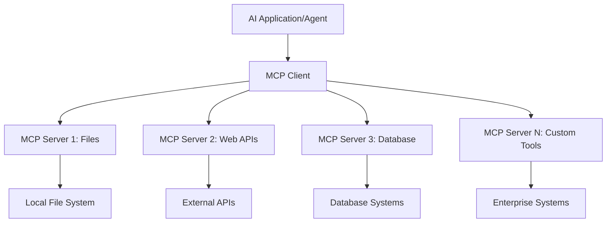

**🔧 Pagrindiniai komponentai:**

| Komponentas | Vaidmuo | Pavyzdžiai |
|-------------|---------|------------|
| **MCP Hostai** | Programos, kurios naudoja MCP paslaugas | Claude Desktop, VS Code, AI Toolkit |
| **MCP Klientai** | Protokolo tvarkytojai (1:1 su serveriais) | Integruoti į host programas |
| **MCP Serveriai** | Teikia galimybes per standartinį protokolą | Playwright, Files, Azure, GitHub |
| **Transporto sluoksnis** | Komunikacijos metodai | stdio, HTTP, WebSockets |

## 🏢 Microsoft MCP serverių ekosistema

Microsoft yra MCP ekosistemos lyderė, siūlanti išsamų verslo poreikius atitinkančių serverių rinkinį.

### 🌟 Pagrindiniai Microsoft MCP serveriai

#### 1. ☁️ Azure MCP serveris
**🔗 Saugykla**: [azure/azure-mcp](https://github.com/azure/azure-mcp)
**🎯 Tikslas**: Išsamus Azure resursų valdymas su AI integracija

**✨ Pagrindinės funkcijos:**
- Deklaratyvus infrastruktūros paruošimas
- Realiojo laiko resursų stebėjimas
- Išlaidų optimizavimo rekomendacijos
- Saugumo atitikties tikrinimas

**🚀 Naudojimo atvejai:**
- Infrastruktūra kaip kodas su AI pagalba
- Automatinis resursų mastelio keitimas
- Debesų išlaidų optimizavimas
- DevOps darbo eigos automatizavimas

#### 2. 📊 Microsoft Dataverse MCP
**📚 Dokumentacija**: [Microsoft Dataverse Integration](https://go.microsoft.com/fwlink/?linkid=2320176)
**🎯 Tikslas**: Natūralios kalbos sąsaja verslo duomenims

**✨ Pagrindinės funkcijos:**
- Natūralios kalbos duomenų bazės užklausos
- Verslo konteksto supratimas
- Individualūs užklausų šablonai
- Įmonės duomenų valdymas

**🚀 Naudojimo atvejai:**
- Verslo analitikos ataskaitos
- Klientų duomenų analizė
- Pardavimų proceso įžvalgos
- Atitikties duomenų užklausos

#### 3. 🌐 Playwright MCP serveris
**🔗 Saugykla**: [microsoft/playwright-mcp](https://github.com/microsoft/playwright-mcp)
**🎯 Tikslas**: Naršyklės automatizavimas ir sąveika su tinklalapiais

**✨ Pagrindinės funkcijos:**
- Automatizavimas įvairiose naršyklėse (Chrome, Firefox, Safari)
- Išmanus elementų aptikimas
- Ekrano nuotraukų ir PDF generavimas
- Tinklo srauto stebėjimas

**🚀 Naudojimo atvejai:**
- Automatizuoti testavimo procesai
- Tinklalapių duomenų išgavimas
- UI/UX stebėjimas
- Konkurencijos analizės automatizavimas

#### 4. 📁 Files MCP serveris
**🔗 Saugykla**: [microsoft/files-mcp-server](https://github.com/microsoft/files-mcp-server)
**🎯 Tikslas**: Išmanios failų sistemos operacijos

**✨ Pagrindinės funkcijos:**
- Deklaratyvus failų valdymas
- Turinio sinchronizavimas
- Versijų kontrolės integracija
- Metaduomenų išgavimas

**🚀 Naudojimo atvejai:**
- Dokumentų valdymas
- Kodo saugyklų organizavimas
- Turinio publikavimo darbo eigos
- Duomenų srautų failų tvarkymas

#### 5. 📝 MarkItDown MCP serveris
**🔗 Saugykla**: [microsoft/markitdown](https://github.com/microsoft/markitdown)
**🎯 Tikslas**: Pažangus Markdown apdorojimas ir manipuliavimas

**✨ Pagrindinės funkcijos:**
- Išsamus Markdown analizavimas
- Formatų konvertavimas (MD ↔ HTML ↔ PDF)
- Turinio struktūros analizė
- Šablonų apdorojimas

**🚀 Naudojimo atvejai:**
- Techninės dokumentacijos darbo eigos
- Turinio valdymo sistemos
- Ataskaitų generavimas
- Žinių bazės automatizavimas

#### 6. 📈 Clarity MCP serveris
**📦 Paketas**: [@microsoft/clarity-mcp-server](https://www.npmjs.com/package/@microsoft/clarity-mcp-server)
**🎯 Tikslas**: Tinklalapių analizė ir vartotojų elgsenos įžvalgos

**✨ Pagrindinės funkcijos:**
- Šilumos žemėlapių duomenų analizė
- Vartotojų sesijų įrašai
- Našumo metrikos
- Konversijos proceso analizė

**🚀 Naudojimo atvejai:**
- Tinklalapių optimizavimas
- Vartotojų patirties tyrimai
- A/B testavimo analizė
- Verslo analitikos ataskaitos

### 🌍 Bendruomenės ekosistema

Be Microsoft serverių, MCP ekosistema apima:
- **🐙 GitHub MCP**: Saugyklų valdymas ir kodo analizė
- **🗄️ Duomenų bazės MCP**: PostgreSQL, MySQL, MongoDB integracijos
- **☁️ Debesų tiekėjų MCP**: AWS, GCP, Digital Ocean įrankiai
- **📧 Komunikacijos MCP**: Slack, Teams, el. pašto integracijos

## 🛠️ Praktinis užsiėmimas: Naršyklės automatizavimo agento kūrimas

**🎯 Projekto tikslas**: Sukurti išmanų naršyklės automatizavimo agentą, naudojant Playwright MCP serverį, kuris galėtų naršyti svetainėse, išgauti informaciją ir atlikti sudėtingas sąveikas.

### 🚀 1 etapas: Agentų pagrindų nustatymas

#### 1 žingsnis: Sukurkite savo agentą
1. **Atidarykite AI Toolkit Agent Builder**
2. **Sukurkite naują agentą** su šiais nustatymais:
   - **Pavadinimas**: `BrowserAgent`
   - **Modelis**: Pasirinkite GPT-4o 


### 🔧 2 etapas: MCP integracijos darbo eiga

#### 3 žingsnis: Pridėkite MCP serverio integraciją
1. **Eikite į Tools skiltį** Agent Builder
2. **Spustelėkite „Add Tool“**, kad atidarytumėte integracijos meniu
3. **Pasirinkite „MCP Server“** iš galimų parinkčių

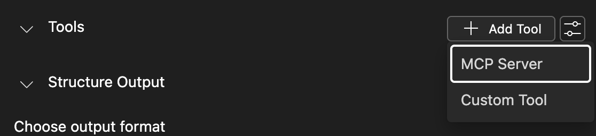

**🔍 Įrankių tipų supratimas:**
- **Built-in Tools**: Iš anksto sukonfigūruotos AI Toolkit funkcijos
- **MCP Serveriai**: Išorinių paslaugų integracijos
- **Custom APIs**: Jūsų pačių paslaugų galiniai taškai
- **Function Calling**: Tiesioginė modelio funkcijų prieiga

#### 4 žingsnis: MCP serverio pasirinkimas
1. **Pasirinkite „MCP Server“**, kad tęstumėte
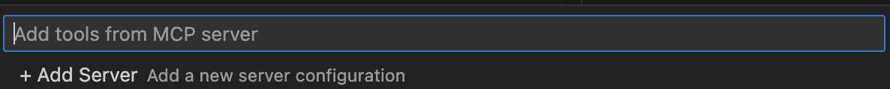

2. **Naršykite MCP katalogą**, kad atrastumėte galimas integracijas
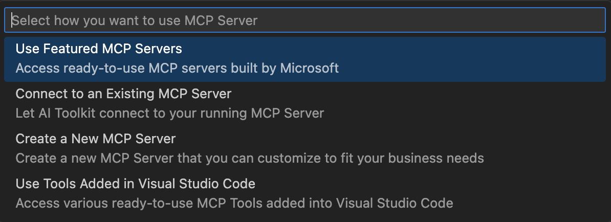

### 🎮 3 etapas: Playwright MCP konfigūracija

#### 5 žingsnis: Pasirinkite ir konfigūruokite Playwright
1. **Spustelėkite „Use Featured MCP Servers“**, kad pasiektumėte Microsoft patvirtintus serverius
2. **Pasirinkite „Playwright“** iš rekomenduojamų sąrašo
3. **Priimkite numatytą MCP ID** arba pritaikykite savo aplinkai

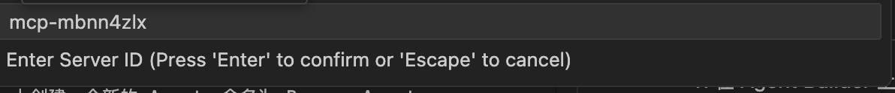

#### 6 žingsnis: Įgalinkite Playwright galimybes
**🔑 Kritinis žingsnis**: Pasirinkite **VISAS** galimas Playwright funkcijas, kad užtikrintumėte maksimalų funkcionalumą

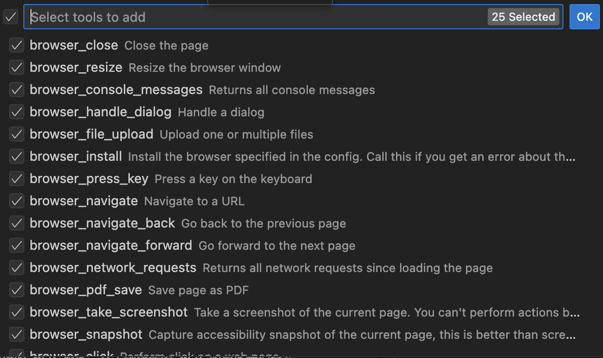

**🛠️ Esminiai Playwright įrankiai:**
- **Navigacija**: `goto`, `goBack`, `goForward`, `reload`
- **Sąveika**: `click`, `fill`, `press`, `hover`, `drag`
- **Išgavimas**: `textContent`, `innerHTML`, `getAttribute`
- **Validacija**: `isVisible`, `isEnabled`, `waitForSelector`
- **Fiksavimas**: `screenshot`, `pdf`, `video`
- **Tinklas**: `setExtraHTTPHeaders`, `route`, `waitForResponse`

#### 7 žingsnis: Patikrinkite integracijos sėkmę
**✅ Sėkmės indikatoriai:**
- Visi įrankiai rodomi Agent Builder sąsajoje
- Nėra klaidų pranešimų integracijos skydelyje
- Playwright serverio būsena rodo „Connected“

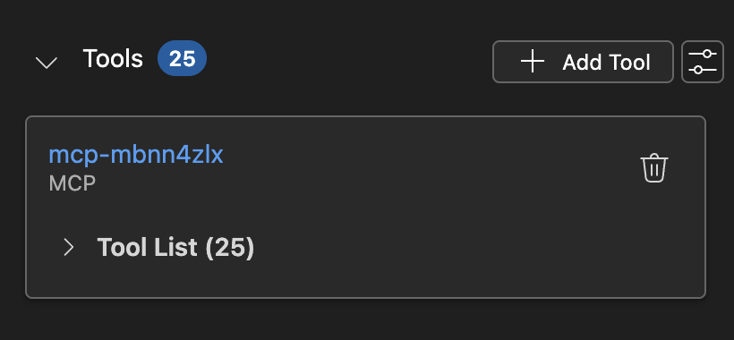

**🔧 Dažniausių problemų sprendimas:**
- **Nepavyko prisijungti**: Patikrinkite interneto ryšį ir ugniasienės nustatymus
- **Trūksta įrankių**: Įsitikinkite, kad visos galimybės buvo pasirinktos nustatymo metu
- **Leidimų klaidos**: Patikrinkite, ar VS Code turi reikiamus sistemos leidimus

### 🎯 4 etapas: Pažangus užklausų kūrimas

#### 8 žingsnis: Sukurkite išmanias sistemos užklausas
Sukurkite sudėtingas užklausas, kurios išnaudoja visas Playwright galimybes:

```markdown
# Web Automation Expert System Prompt

## Core Identity
You are an advanced web automation specialist with deep expertise in browser automation, web scraping, and user experience analysis. You have access to Playwright tools for comprehensive browser control.

## Capabilities & Approach
### Navigation Strategy
- Always start with screenshots to understand page layout
- Use semantic selectors (text content, labels) when possible
- Implement wait strategies for dynamic content
- Handle single-page applications (SPAs) effectively

### Error Handling
- Retry failed operations with exponential backoff
- Provide clear error descriptions and solutions
- Suggest alternative approaches when primary methods fail
- Always capture diagnostic screenshots on errors

### Data Extraction
- Extract structured data in JSON format when possible
- Provide confidence scores for extracted information
- Validate data completeness and accuracy
- Handle pagination and infinite scroll scenarios

### Reporting
- Include step-by-step execution logs
- Provide before/after screenshots for verification
- Suggest optimizations and alternative approaches
- Document any limitations or edge cases encountered

## Ethical Guidelines
- Respect robots.txt and rate limiting
- Avoid overloading target servers
- Only extract publicly available information
- Follow website terms of service
```

#### 9 žingsnis: Sukurkite dinamiškas vartotojo užklausas
Sukurkite užklausas, kurios demonstruoja įvairias galimybes:

**🌐 Tinklalapių analizės pavyzdys:**
```markdown
Navigate to github.com/kinfey and provide a comprehensive analysis including:
1. Repository structure and organization
2. Recent activity and contribution patterns  
3. Documentation quality assessment
4. Technology stack identification
5. Community engagement metrics
6. Notable projects and their purposes

Include screenshots at key steps and provide actionable insights.
```

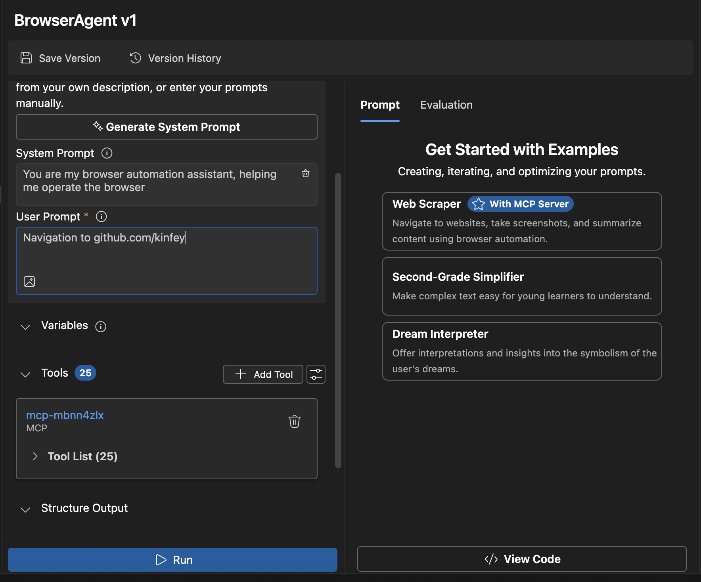

### 🚀 5 etapas: Vykdymas ir testavimas

#### 10 žingsnis: Paleiskite pirmąją automatizaciją
1. **Spustelėkite „Run“**, kad paleistumėte automatizacijos seką
2. **Stebėkite realaus laiko vykdymą**:
   - Chrome naršyklė paleidžiama automatiškai
   - Agentas naršo tikslinėje svetainėje
   - Ekrano nuotraukos fiksuoja kiekvieną svarbų žingsnį
   - Analizės rezultatai transliuojami realiu laiku

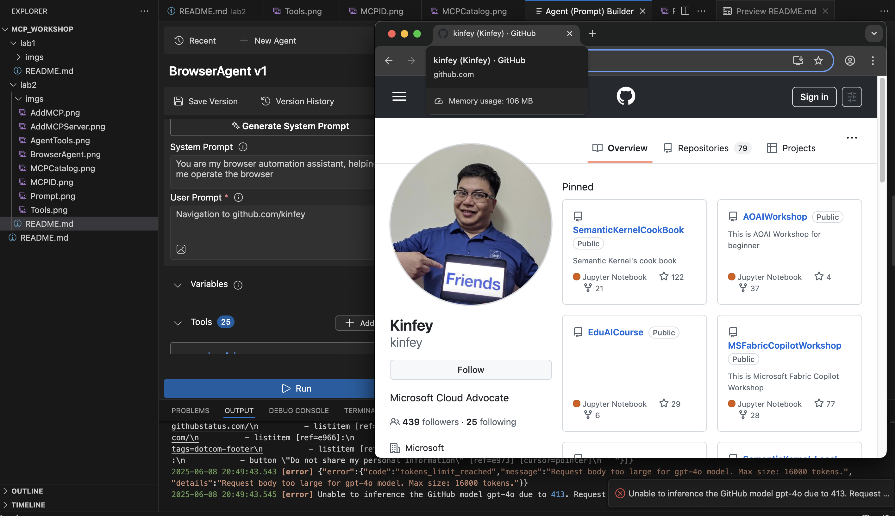

#### 11 žingsnis: Analizuokite rezultatus ir įžvalgas
Peržiūrėkite išsamią analizę Agent Builder sąsajoje:

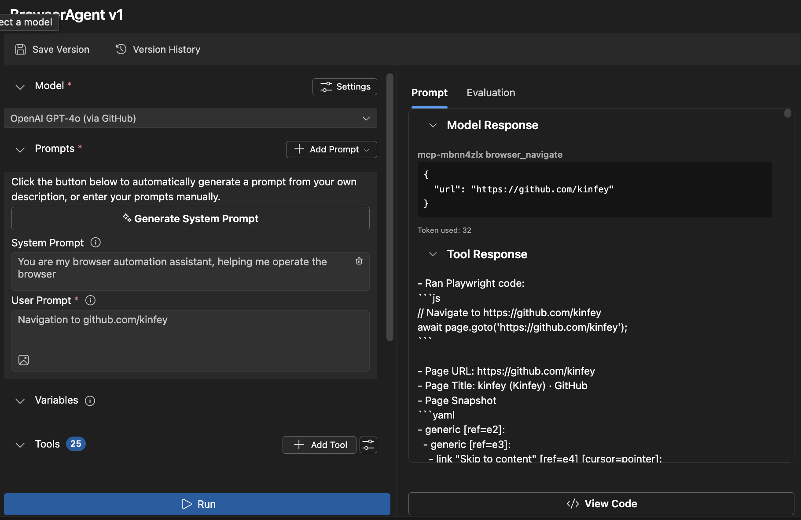

### 🌟 6 etapas: Pažangios galimybės ir diegimas

#### 12 žingsnis: Eksportas ir diegimas gamybos aplinkoje
Agent Builder palaiko kelias diegimo parinktis:

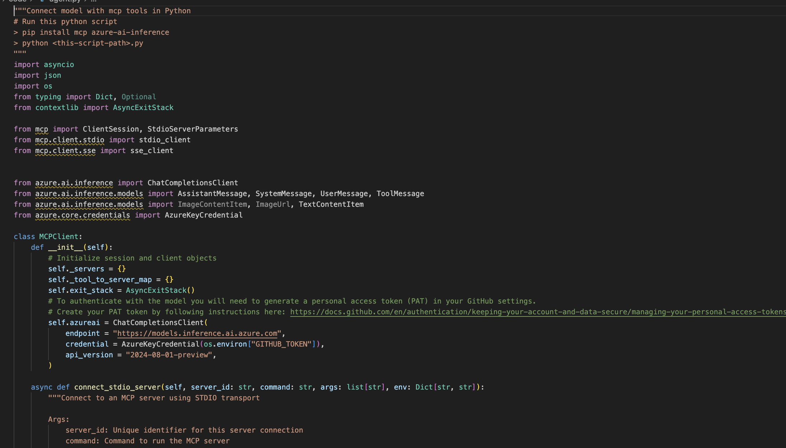

## 🎓 Modulio 2 santrauka ir tolesni žingsniai

### 🏆 Pasiekimas: MCP integracijos meistras

**✅ Įgyti įgūdžiai:**
- [ ] MCP architektūros ir privalumų supratimas
- [ ] Microsoft MCP serverių ekosistemos naršymas
- [ ] Playwright MCP integracija su AI Toolkit
- [ ] Pažangių naršyklės automatizavimo agentų kūrimas
- [ ] Pažangus užklausų kūrimas tinklalapių automatizavimui

### 📚 Papildomi ištekliai

- **🔗 MCP specifikacija**: [Oficiali protokolo dokumentacija](https://modelcontextprotocol.io/)
- **🛠️ Playwright API**: [Pilnas metodų sąrašas](https://playwright.dev/docs/api/class-playwright)
- **🏢 Microsoft MCP serveriai**: [Verslo integracijos vadovas](https://github.com/microsoft/mcp-servers)
- **🌍 Bendruomenės pavyzdžiai**: [MCP serverių galerija](https://github.com/modelcontextprotocol/servers)

**🎉 Sveikiname!** Jūs sėkmingai įvaldėte MCP integraciją ir dabar galite kurti gamybai paruoštus AI agentus su išorinių įrankių galimybėmis!

### 🔜 Tęskite į kitą modulį

Pasiruošę tobulinti savo MCP įgūdžius? Pereikite į **[Modulį 3: Pažangus MCP kūrimas su AI Toolkit](../lab3/README
- Sukurkite orų MCP serverį nuo nulio

---

**Atsakomybės apribojimas**:  
Šis dokumentas buvo išverstas naudojant AI vertimo paslaugą [Co-op Translator](https://github.com/Azure/co-op-translator). Nors siekiame tikslumo, prašome atkreipti dėmesį, kad automatiniai vertimai gali turėti klaidų ar netikslumų. Originalus dokumentas jo gimtąja kalba turėtų būti laikomas autoritetingu šaltiniu. Kritinei informacijai rekomenduojama profesionali žmogaus vertimo paslauga. Mes neprisiimame atsakomybės už nesusipratimus ar klaidingus interpretavimus, atsiradusius naudojant šį vertimą.