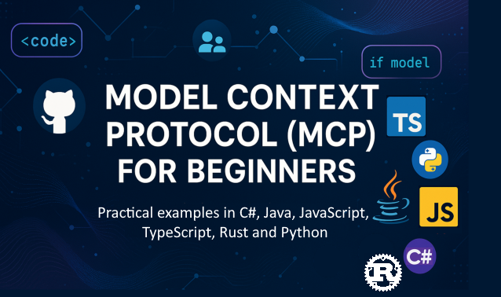

<!--
CO_OP_TRANSLATOR_METADATA:
{
  "original_hash": "866c8877136cb03e1efb9ad633a2f0a6",
  "translation_date": "2025-08-26T18:30:40+00:00",
  "source_file": "README.md",
  "language_code": "lt"
}
-->
 

Sekite šiuos žingsnius, kad pradėtumėte naudotis šiais ištekliais:
1. **Fork Repozitoriją**: Spustelėkite 
2. **Klonuokite Repozitoriją**:   `git clone https://github.com/microsoft/mcp-for-beginners.git`
3. [**Prisijunkite prie Azure AI Foundry Discord ir susipažinkite su ekspertais bei kitais kūrėjais**](https://discord.com/invite/ByRwuEEgH4)

### 🌐 Daugiakalbė Palaikymas

#### Palaikoma per GitHub Action (Automatizuota ir visada atnaujinta)

 [Arabų](../ar/README.md) | [Bengalų](../bn/README.md) | [Bulgarų](../bg/README.md) | [Birmos (Mianmaras)](../my/README.md) | [Kinų (Supaprastinta)](../zh/README.md) | [Kinų (Tradicinė, Honkongas)](../hk/README.md) | [Kinų (Tradicinė, Makao)](../mo/README.md) | [Kinų (Tradicinė, Taivanas)](../tw/README.md) | [Kroatų](../hr/README.md) | [Čekų](../cs/README.md) | [Danų](../da/README.md) | [Olandų](../nl/README.md) | [Suomių](../fi/README.md) | [Prancūzų](../fr/README.md) | [Vokiečių](../de/README.md) | [Graikų](../el/README.md) | [Hebrajų](../he/README.md) | [Hindi](../hi/README.md) | [Vengrų](../hu/README.md) | [Indoneziečių](../id/README.md) | [Italų](../it/README.md) | [Japonų](../ja/README.md) | [Korėjiečių](../ko/README.md) | [Malajų](../ms/README.md) | [Maratų](../mr/README.md) | [Nepalų](../ne/README.md) | [Norvegų](../no/README.md) | [Persų (Farsi)](../fa/README.md) | [Lenkų](../pl/README.md) | [Portugalų (Brazilija)](../br/README.md) | [Portugalų (Portugalija)](../pt/README.md) | [Pundžabi (Gurmukhi)](../pa/README.md) | [Rumunų](../ro/README.md) | [Rusų](../ru/README.md) | [Serbų (Kirilica)](../sr/README.md) | [Slovakų](../sk/README.md) | [Slovėnų](../sl/README.md) | [Ispanų](../es/README.md) | [Svahilių](../sw/README.md) | [Švedų](../sv/README.md) | [Tagalogų (Filipinų)](../tl/README.md) | [Tajų](../th/README.md) | [Turkų](../tr/README.md) | [Ukrainiečių](../uk/README.md) | [Urdu](../ur/README.md) | [Vietnamiečių](../vi/README.md)

# 🚀 Modelio Konteksto Protokolo (MCP) Mokymo Programa Pradedantiesiems

## **Išmokite MCP su praktiniais kodavimo pavyzdžiais C#, Java, JavaScript, Rust, Python ir TypeScript**

## 🧠 Modelio Konteksto Protokolo Mokymo Programos Apžvalga

**Modelio Konteksto Protokolas (MCP)** yra pažangus pagrindas, skirtas standartizuoti sąveiką tarp AI modelių ir klientų programų. Ši atvirojo kodo mokymo programa siūlo struktūrizuotą mokymosi kelią, papildytą praktiniais kodavimo pavyzdžiais ir realaus pasaulio naudojimo atvejais, naudojant populiarias programavimo kalbas, tokias kaip C#, Java, JavaScript, TypeScript ir Python.

Nesvarbu, ar esate AI kūrėjas, sistemų architektas, ar programinės įrangos inžinierius, šis vadovas yra išsamus šaltinis, padėsiantis įvaldyti MCP pagrindus ir įgyvendinimo strategijas.

## 🔗 Oficialūs MCP Ištekliai

- 📘 [MCP Dokumentacija](https://modelcontextprotocol.io/) – Išsamūs mokymai ir vartotojo vadovai  
- 📜 [MCP Specifikacija](https://modelcontextprotocol.io/docs/) – Protokolo architektūra ir techninės nuorodos  
- 📜 [Originali MCP Specifikacija](https://spec.modelcontextprotocol.io/) – Senesnės techninės nuorodos (gali turėti papildomos informacijos)  
- 🧑‍💻 [MCP GitHub Repozitorija](https://github.com/modelcontextprotocol) – Atvirojo kodo SDK, įrankiai ir kodų pavyzdžiai
- 🌐 [MCP Bendruomenė](https://github.com/orgs/modelcontextprotocol/discussions) – Prisijunkite prie diskusijų ir prisidėkite prie bendruomenės

## 🧭 MCP Mokymo Programos Apžvalga

### 📚 Pilna Mokymo Programos Struktūra

| Modulis | Tema | Aprašymas | Nuoroda |
|--------|-------|-------------|------|
| **Modulis 1-3: Pagrindai** | | | |
| 00 | MCP Įvadas | Modelio Konteksto Protokolo apžvalga ir jo svarba AI procesuose | [Skaityti daugiau](./00-Introduction/README.md) |
| 01 | Pagrindinės Sąvokos | Išsamus MCP pagrindinių sąvokų tyrimas | [Skaityti daugiau](./01-CoreConcepts/README.md) |
| 02 | MCP Saugumas | Grėsmės saugumui ir geriausios praktikos | [Skaityti daugiau](./02-Security/README.md) |
| 03 | Pradžia su MCP | Aplinkos paruošimas, pagrindiniai serveriai/klientai, integracija | [Skaityti daugiau](./03-GettingStarted/README.md) |
| **Modulis 3: Pirmojo Serverio ir Kliento Kūrimas** | | | |
| 3.1 | Pirmasis Serveris | Sukurkite savo pirmąjį MCP serverį | [Vadovas](./03-GettingStarted/01-first-server/README.md) |
| 3.2 | Pirmasis Klientas | Sukurkite pagrindinį MCP klientą | [Vadovas](./03-GettingStarted/02-client/README.md) |
| 3.3 | Klientas su LLM | Integruokite didelius kalbos modelius | [Vadovas](./03-GettingStarted/03-llm-client/README.md) |
| 3.4 | VS Code Integracija | Naudokite MCP serverius VS Code | [Vadovas](./03-GettingStarted/04-vscode/README.md) |
| 3.5 | stdio Serveris | Sukurkite serverius naudodami stdio transportą | [Vadovas](./03-GettingStarted/05-stdio-server/README.md) |
| 3.6 | HTTP Transliacija | Įgyvendinkite HTTP transliaciją MCP | [Vadovas](./03-GettingStarted/06-http-streaming/README.md) |
| 3.7 | AI Įrankių Rinkinys | Naudokite AI Įrankių Rinkinį su MCP | [Vadovas](./03-GettingStarted/07-aitk/README.md) |
| 3.8 | Testavimas | Testuokite savo MCP serverio įgyvendinimą | [Vadovas](./03-GettingStarted/08-testing/README.md) |
| 3.9 | Diegimas | Diekite MCP serverius į produkciją | [Vadovas](./03-GettingStarted/09-deployment/README.md) |
| **Modulis 4-5: Praktiniai ir Pažangūs** | | | |
| 04 | Praktinis Įgyvendinimas | SDK, derinimas, testavimas, pakartotinai naudojami šablonai | [Skaityti daugiau](./04-PracticalImplementation/README.md) |
| 05 | Pažangios MCP Temos | Daugiamodalinis AI, mastelio keitimas, įmonių naudojimas | [Skaityti daugiau](./05-AdvancedTopics/README.md) |
| 5.1 | Azure Integracija | MCP integracija su Azure | [Vadovas](./05-AdvancedTopics/mcp-integration/README.md) |
| 5.2 | Daugiamodalumas | Darbas su keliais modalumais | [Vadovas](./05-AdvancedTopics/mcp-multi-modality/README.md) |
| 5.3 | OAuth2 Demonstracija | Įgyvendinkite OAuth2 autentifikaciją | [Vadovas](./05-AdvancedTopics/mcp-oauth2-demo/README.md) |
| 5.4 | Pagrindiniai Kontekstai | Supraskite ir įgyvendinkite pagrindinius kontekstus | [Vadovas](./05-AdvancedTopics/mcp-root-contexts/README.md) |
| 5.5 | Maršrutizavimas | MCP maršrutizavimo strategijos | [Vadovas](./05-AdvancedTopics/mcp-routing/README.md) |
| 5.6 | Imties Rinkimas | Imties rinkimo technikos MCP | [Vadovas](./05-AdvancedTopics/mcp-sampling/README.md) |
| 5.7 | Mastelio Keitimas | MCP įgyvendinimų mastelio keitimas | [Vadovas](./05-AdvancedTopics/mcp-scaling/README.md) |
| 5.8 | Saugumas | Pažangūs saugumo aspektai | [Vadovas](./05-AdvancedTopics/mcp-security/README.md) |
| 5.9 | Interneto Paieška | Įgyvendinkite interneto paieškos galimybes | [Vadovas](./05-AdvancedTopics/web-search-mcp/README.md) |
| 5.10 | Realaus Laiko Transliacija | Sukurkite realaus laiko transliacijos funkcionalumą | [Vadovas](./05-AdvancedTopics/mcp-realtimestreaming/README.md) |
| 5.11 | Realaus Laiko Paieška | Įgyvendinkite realaus laiko paiešką | [Vadovas](./05-AdvancedTopics/mcp-realtimesearch/README.md) |
| 5.12 | Entra ID Autentifikacija | Autentifikacija su Microsoft Entra ID | [Vadovas](./05-AdvancedTopics/mcp-security-entra/README.md) |
| 5.13 | Foundry Integracija | Integracija su Azure AI Foundry | [Vadovas](./05-AdvancedTopics/mcp-foundry-agent-integration/README.md) |
| 5.14 | Konteksto Inžinerija | Efektyvios konteksto inžinerijos technikos | [Vadovas](./05-AdvancedTopics/mcp-contextengineering/README.md) |
| **Modulis 6-10: Bendruomenė ir Geriausios Praktikos** | | | |
| 06 | Bendruomenės Indėlis | Kaip prisidėti prie MCP ekosistemos | [Vadovas](./06-CommunityContributions/README.md) |
| 07 | Ankstyvojo Naudojimo Pamokos | Realūs įgyvendinimo pavyzdžiai | [Vadovas](./07-LessonsFromEarlyAdoption/README.md) |
| 08 | Geriausios MCP Praktikos | Našumas, gedimų tolerancija, atsparumas | [Vadovas](./08-BestPractices/README.md) |
| 09 | MCP Atvejų Analizės | Praktiniai įgyvendinimo pavyzdžiai | [Vadovas](./09-CaseStudy/README.md) |
| 10 | Praktinis Seminaras | MCP Serverio kūrimas su AI Įrankių Rinkiniu | [Laboratorija](./10-StreamliningAIWorkflowsBuildingAnMCPServerWithAIToolkit/README.md) |

### 💻 Kodų Pavyzdžių Projektai

#### Pagrindiniai MCP Skaičiuotuvo Pavyzdžiai

| Kalba | Aprašymas | Nuoroda |
|----------|-------------|------|
| C# | MCP Serverio Pavyzdys | [Peržiūrėti Kodą](./03-GettingStarted/samples/csharp/README.md) |
| Java | MCP Skaičiuotuvas | [Peržiūrėti Kodą](./03-GettingStarted/samples/java/calculator/README.md) |
| JavaScript | MCP Demonstracija | [Peržiūrėti Kodą](./03-GettingStarted/samples/javascript/README.md) |
| Python | MCP Serveris | [Peržiūrėti Kodą](../../03-GettingStarted/samples/python/mcp_calculator_server.py) |
| TypeScript | MCP Pavyzdys | [Peržiūrėti Kodą](./03-GettingStarted/samples/typescript/README.md) |
| Rust | MCP Pavyzdys | [Peržiūrėti Kodą](./03-GettingStarted/samples/rust/README.md) |

#### Pažangūs MCP Įgyvendinimai

| Kalba | Aprašymas | Nuoroda |
|----------|-------------|------|
| C# | Pažangus pavyzdys | [View Code](./04-PracticalImplementation/samples/csharp/README.md) |
| Java su Spring | Konteinerinės programos pavyzdys | [View Code](./04-PracticalImplementation/samples/java/containerapp/README.md) |
| JavaScript | Pažangus pavyzdys | [View Code](./04-PracticalImplementation/samples/javascript/README.md) |
| Python | Sudėtinga įgyvendinimo versija | [View Code](../../04-PracticalImplementation/samples/python/READMEmd) |
| TypeScript | Konteinerio pavyzdys | [View Code](./04-PracticalImplementation/samples/typescript/README.md) |

## 🎯 MCP mokymosi reikalavimai

Norint maksimaliai pasinaudoti šia mokymo programa, jums reikėtų:

- Pagrindinių programavimo žinių bent viena iš šių kalbų: C#, Java, JavaScript, Python arba TypeScript
- Kliento-serverio modelio ir API supratimo
- Susipažinimo su REST ir HTTP koncepcijomis
- (Pasirinktinai) AI/ML koncepcijų pagrindų

- Prisijungimo prie mūsų bendruomenės diskusijų pagalbai

## 📚 Mokymosi vadovas ir ištekliai

Ši saugykla apima keletą išteklių, kurie padės jums efektyviai mokytis:

### Mokymosi vadovas

Išsamus [Mokymosi vadovas](./study_guide.md) padės jums efektyviai naršyti šią saugyklą. Vadove rasite:

- Vizualinį mokymo programos žemėlapį, kuriame pateikiamos visos aptariamos temos
- Detalų kiekvienos saugyklos dalies suskirstymą
- Gaires, kaip naudoti pavyzdinius projektus
- Rekomenduojamus mokymosi kelius skirtingiems įgūdžių lygiams
- Papildomus išteklius, kurie papildys jūsų mokymosi kelionę

### Pakeitimų žurnalas

Mes palaikome išsamų [Pakeitimų žurnalą](./changelog.md), kuriame sekami visi reikšmingi mokymo medžiagos atnaujinimai, įskaitant:

- Naujo turinio papildymus
- Struktūrinius pakeitimus
- Funkcijų patobulinimus
- Dokumentacijos atnaujinimus

## 🛠️ Kaip efektyviai naudotis šia mokymo programa

Kiekviena pamoka šiame vadove apima:

1. Aiškius MCP koncepcijų paaiškinimus  
2. Gyvus kodo pavyzdžius keliomis kalbomis  
3. Pratimus, skirtus realių MCP programų kūrimui  
4. Papildomus išteklius pažengusiems mokiniams

## Renginiai 

### [MCP Dev Days 2025 m. liepa](https://developer.microsoft.com/en-us/reactor/series/S-1563/)
#### [➡️Žiūrėti pagal poreikį - MCP Dev Days](https://developer.microsoft.com/en-us/reactor/series/S-1563/)
Pasiruoškite dviem dienoms gilių techninių įžvalgų, bendruomenės ryšių ir praktinio mokymosi MCP Dev Days renginyje – virtualiame renginyje, skirtame Model Context Protocol (MCP), naujam standartui, jungiančiam AI modelius ir įrankius, kuriais jie remiasi.
MCP Dev Days galite žiūrėti užsiregistravę mūsų renginio puslapyje: https://aka.ms/mcpdevdays. 

#### [1 diena: MCP produktyvumas, kūrimo įrankiai ir bendruomenė:](https://developer.microsoft.com/en-us/reactor/series/S-1563/)

Skirta kūrėjams, norintiems naudoti MCP savo darbo eigoje ir švęsti nuostabią MCP bendruomenę. Prisijungsime prie bendruomenės narių ir partnerių, tokių kaip Arcade, Block, Okta ir Neon, kad pamatytume, kaip jie bendradarbiauja su Microsoft, kurdami atvirą, išplečiamą MCP ekosistemą. 

- Realūs demonstraciniai pavyzdžiai su VS Code, Visual Studio, GitHub Copilot ir populiariais bendruomenės įrankiais
- Praktinės, kontekstu pagrįstos kūrimo darbo eigos
- Bendruomenės vedamos sesijos ir įžvalgos

Nesvarbu, ar tik pradedate dirbti su MCP, ar jau kuriate su juo, 1 diena suteiks įkvėpimo ir praktinių patarimų.

#### [2 diena: Pasitikėjimas kuriant MCP serverius](https://developer.microsoft.com/en-us/reactor/series/S-1563/)

Skirta MCP kūrėjams. Gilinsimės į įgyvendinimo strategijas ir geriausią praktiką kuriant MCP serverius ir integruojant MCP į AI darbo eigas.

#### Temos apima:

- MCP serverių kūrimą ir jų integravimą į agentų patirtis
- Kūrimą, pagrįstą užklausomis
- Geriausią saugumo praktiką
- Naudojimą tokių komponentų kaip Functions, ACA ir API Management
- Registrų suderinimą ir įrankius (1P + 3P)

Jei esate kūrėjas, įrankių kūrėjas ar AI produktų strategas, ši diena suteiks jums įžvalgų, reikalingų kurti mastelius, saugius ir ateičiai pasiruošusius MCP sprendimus.

### MCP Boot Camp 2025 m. rugpjūtis
Intensyvių vaizdo sesijų metu išmokite kurti MCP serverius, integruoti su VS Code ir profesionaliai diegti Azure platformoje, remiantis MCP pradedančiųjų mokymo programa. Įgykite praktinių įgūdžių technologijoje, kurią jau naudoja didelės įmonės.

#### [➡️Žiūrėti pagal poreikį MCP Bootcamp | Anglų kalba](https://developer.microsoft.com/en-us/reactor/series/s-1568/)
#### [➡️Žiūrėti pagal poreikį MCP Bootcamp | Brazilų kalba](https://developer.microsoft.com/en-us/reactor/series/S-1566/)
#### [➡️Žiūrėti pagal poreikį MCP Bootcamp | Ispanų kalba](https://developer.microsoft.com/en-us/reactor/series/S-1567/)

## 🌟 Bendruomenės padėka

Dėkojame Microsoft Valued Professional [Shivam Goyal](https://www.linkedin.com/in/shivam2003/) už svarbių kodo pavyzdžių indėlį. 

## 📜 Licencijos informacija

Šis turinys licencijuotas pagal **MIT licenciją**. Sąlygas ir nuostatas rasite [LICENSE](../../LICENSE).

## 🤝 Indėlio gairės

Šis projektas priima indėlius ir pasiūlymus. Dauguma indėlių reikalauja, kad sutiktumėte su
Contributor License Agreement (CLA), patvirtinančiu, kad turite teisę ir iš tikrųjų suteikiate mums
teisę naudoti jūsų indėlį. Daugiau informacijos rasite 
<https://cla.opensource.microsoft.com>.

Kai pateikiate „pull request“, CLA bot automatiškai nustatys, ar jums reikia pateikti
CLA ir pažymės PR atitinkamai (pvz., būsenos patikrinimas, komentaras). Tiesiog vykdykite
bot pateiktas instrukcijas. Tai reikės padaryti tik vieną kartą visose saugyklose, naudojančiose mūsų CLA.

Šis projektas priėmė [Microsoft Open Source Code of Conduct](https://opensource.microsoft.com/codeofconduct/).
Daugiau informacijos rasite [Code of Conduct FAQ](https://opensource.microsoft.com/codeofconduct/faq/) arba
kreipkitės į [opencode@microsoft.com](mailto:opencode@microsoft.com) su papildomais klausimais ar komentarais.

## 📂 Saugyklos struktūra

Saugykla organizuota taip:

- **Pagrindinė mokymo programa (00-10)**: Pagrindinis turinys, suskirstytas į dešimt nuoseklių modulių
- **images/**: Diagramos ir iliustracijos, naudojamos visoje mokymo programoje
- **translations/**: Daugiakalbė parama su automatizuotais vertimais
- **translated_images/**: Lokalizuotos diagramų ir iliustracijų versijos
- **study_guide.md**: Išsamus vadovas, kaip naršyti saugyklą
- **changelog.md**: Visų reikšmingų mokymo medžiagos pakeitimų įrašas
- **mcp.json**: MCP specifikacijos konfigūracijos failas
- **CODE_OF_CONDUCT.md, LICENSE, SECURITY.md, SUPPORT.md**: Projekto valdymo dokumentai

## 🎒 Kiti kursai
Mūsų komanda kuria kitus kursus! Peržiūrėkite:

- [AI agentai pradedantiesiems](https://github.com/microsoft/ai-agents-for-beginners?WT.mc_id=academic-105485-koreyst)
- [Generatyvinis AI pradedantiesiems naudojant .NET](https://github.com/microsoft/Generative-AI-for-beginners-dotnet?WT.mc_id=academic-105485-koreyst)
- [Generatyvinis AI pradedantiesiems naudojant JavaScript](https://github.com/microsoft/generative-ai-with-javascript?WT.mc_id=academic-105485-koreyst)
- [Generatyvinis AI pradedantiesiems](https://github.com/microsoft/generative-ai-for-beginners?WT.mc_id=academic-105485-koreyst)
- [Generatyvinis AI pradedantiesiems naudojant Java](https://github.com/microsoft/generative-ai-for-beginners-java?WT.mc_id=academic-105485-koreyst)
- [ML pradedantiesiems](https://aka.ms/ml-beginners?WT.mc_id=academic-105485-koreyst)
- [Duomenų mokslas pradedantiesiems](https://aka.ms/datascience-beginners?WT.mc_id=academic-105485-koreyst)
- [AI pradedantiesiems](https://aka.ms/ai-beginners?WT.mc_id=academic-105485-koreyst)
- [Kibernetinis saugumas pradedantiesiems](https://github.com/microsoft/Security-101?WT.mc_id=academic-96948-sayoung)
- [Web kūrimas pradedantiesiems](https://aka.ms/webdev-beginners?WT.mc_id=academic-105485-koreyst)
- [IoT pradedantiesiems](https://aka.ms/iot-beginners?WT.mc_id=academic-105485-koreyst)
- [XR kūrimas pradedantiesiems](https://github.com/microsoft/xr-development-for-beginners?WT.mc_id=academic-105485-koreyst)
- [GitHub Copilot valdymas AI poriniam programavimui](https://aka.ms/GitHubCopilotAI?WT.mc_id=academic-105485-koreyst)
- [GitHub Copilot valdymas C#/.NET kūrėjams](https://github.com/microsoft/mastering-github-copilot-for-dotnet-csharp-developers?WT.mc_id=academic-105485-koreyst)
- [Pasirinkite savo Copilot nuotykį](https://github.com/microsoft/CopilotAdventures?WT.mc_id=academic-105485-koreyst)

## ™️ Prekės ženklų pranešimas

Šiame projekte gali būti prekių ženklų ar logotipų, susijusių su projektais, produktais ar paslaugomis. Leidžiamas Microsoft
prekių ženklų ar logotipų naudojimas turi atitikti ir laikytis
[Microsoft prekių ženklų ir prekės ženklo gairių](https://www.microsoft.com/legal/intellectualproperty/trademarks/usage/general).
Microsoft prekių ženklų ar logotipų naudojimas modifikuotose šio projekto versijose neturi sukelti painiavos ar nurodyti Microsoft rėmimo.
Bet koks trečiųjų šalių prekių ženklų ar logotipų naudojimas turi atitikti tų trečiųjų šalių politiką.

---

**Atsakomybės apribojimas**:  
Šis dokumentas buvo išverstas naudojant AI vertimo paslaugą [Co-op Translator](https://github.com/Azure/co-op-translator). Nors siekiame tikslumo, prašome atkreipti dėmesį, kad automatiniai vertimai gali turėti klaidų ar netikslumų. Originalus dokumentas jo gimtąja kalba turėtų būti laikomas autoritetingu šaltiniu. Kritinei informacijai rekomenduojama naudoti profesionalų žmogaus vertimą. Mes neprisiimame atsakomybės už nesusipratimus ar klaidingus interpretavimus, atsiradusius dėl šio vertimo naudojimo.