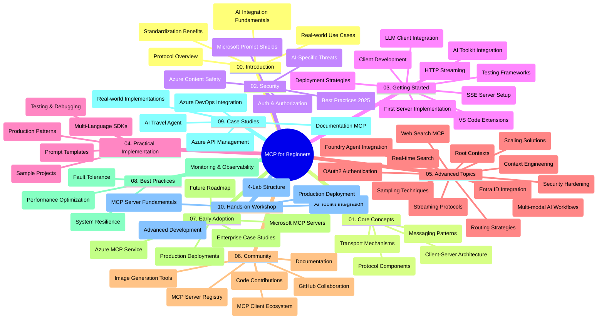

<!--
CO_OP_TRANSLATOR_METADATA:
{
  "original_hash": "e2c6ed897fa98fa08e0146101776c7ff",
  "translation_date": "2025-08-26T18:33:06+00:00",
  "source_file": "study_guide.md",
  "language_code": "lt"
}
-->
# Modelio Konteksto Protokolas (MCP) pradedantiesiems – Mokymosi vadovas

Šis mokymosi vadovas pateikia apžvalgą apie saugyklos struktūrą ir turinį, skirtą „Modelio Konteksto Protokolas (MCP) pradedantiesiems“ mokymo programai. Naudokite šį vadovą, kad efektyviai naršytumėte saugykloje ir maksimaliai išnaudotumėte turimus išteklius.

## Saugyklos apžvalga

Modelio Konteksto Protokolas (MCP) yra standartizuota sistema, skirta sąveikai tarp dirbtinio intelekto modelių ir klientų programų. Iš pradžių sukurtas „Anthropic“, MCP dabar prižiūri platesnė MCP bendruomenė per oficialią „GitHub“ organizaciją. Šioje saugykloje pateikiama išsami mokymo programa su praktiniais kodo pavyzdžiais C#, Java, JavaScript, Python ir TypeScript kalbomis, skirta DI kūrėjams, sistemų architektams ir programinės įrangos inžinieriams.

## Vizualus mokymo programos žemėlapis

## Saugyklos struktūra

Saugykla suskirstyta į dešimt pagrindinių skyrių, kuriuose nagrinėjami skirtingi MCP aspektai:

1. **Įvadas (00-Introduction/)**
   - Modelio Konteksto Protokolo apžvalga
   - Kodėl standartizacija svarbi DI procesuose
   - Praktiniai naudojimo atvejai ir nauda

2. **Pagrindinės sąvokos (01-CoreConcepts/)**
   - Kliento-serverio architektūra
   - Pagrindiniai protokolo komponentai
   - MCP žinučių perdavimo modeliai

3. **Saugumas (02-Security/)**
   - Saugumo grėsmės MCP pagrindu veikiančiose sistemose
   - Geriausios praktikos saugumui užtikrinti
   - Autentifikavimo ir autorizacijos strategijos
   - **Išsami saugumo dokumentacija**:
     - MCP saugumo geriausios praktikos 2025
     - Azure turinio saugumo įgyvendinimo vadovas
     - MCP saugumo kontrolės ir technikos
     - MCP greitosios nuorodos į geriausias praktikas
   - **Pagrindinės saugumo temos**:
     - Įterptinių komandų ir įrankių užnuodijimo atakos
     - Sesijų užgrobimas ir „suklaidinto pavaduotojo“ problemos
     - Žetonų perdavimo pažeidžiamumai
     - Pernelyg dideli leidimai ir prieigos kontrolė
     - Tiekimo grandinės saugumas DI komponentams
     - Microsoft Prompt Shields integracija

4. **Darbo pradžia (03-GettingStarted/)**
   - Aplinkos nustatymas ir konfigūravimas
   - Pagrindinių MCP serverių ir klientų kūrimas
   - Integracija su esamomis programomis
   - Apima skyrius apie:
     - Pirmojo serverio įgyvendinimą
     - Kliento kūrimą
     - LLM kliento integraciją
     - VS Code integraciją
     - Serverio siunčiamų įvykių (SSE) serverį
     - HTTP srautą
     - DI įrankių rinkinio integraciją
     - Testavimo strategijas
     - Diegimo gaires

5. **Praktinis įgyvendinimas (04-PracticalImplementation/)**
   - SDK naudojimas skirtingose programavimo kalbose
   - Derinimo, testavimo ir validavimo technikos
   - Pakartotinai naudojamų komandų šablonų ir darbo eigų kūrimas
   - Pavyzdiniai projektai su įgyvendinimo pavyzdžiais

6. **Pažangios temos (05-AdvancedTopics/)**
   - Konteksto inžinerijos technikos
   - Foundry agento integracija
   - Daugiarūšiai DI darbo srautai
   - OAuth2 autentifikavimo demonstracijos
   - Realaus laiko paieškos galimybės
   - Realaus laiko srautiniai duomenys
   - Pagrindinių kontekstų įgyvendinimas
   - Maršrutizavimo strategijos
   - Mėginių ėmimo technikos
   - Skalavimo metodai
   - Saugumo aspektai
   - Entra ID saugumo integracija
   - Žiniatinklio paieškos integracija

7. **Bendruomenės indėlis (06-CommunityContributions/)**
   - Kaip prisidėti prie kodo ir dokumentacijos
   - Bendradarbiavimas per „GitHub“
   - Bendruomenės inicijuoti patobulinimai ir atsiliepimai
   - Darbas su įvairiais MCP klientais (Claude Desktop, Cline, VSCode)
   - Darbas su populiariais MCP serveriais, įskaitant vaizdų generavimą

8. **Pamokos iš ankstyvojo pritaikymo (07-LessonsfromEarlyAdoption/)**
   - Realūs įgyvendinimai ir sėkmės istorijos
   - MCP pagrindu veikiančių sprendimų kūrimas ir diegimas
   - Tendencijos ir ateities planai
   - **Microsoft MCP serverių vadovas**: Išsamus vadovas apie 10 gamybai paruoštų Microsoft MCP serverių, įskaitant:
     - Microsoft Learn Docs MCP serverį
     - Azure MCP serverį (15+ specializuotų jungčių)
     - GitHub MCP serverį
     - Azure DevOps MCP serverį
     - MarkItDown MCP serverį
     - SQL Server MCP serverį
     - Playwright MCP serverį
     - Dev Box MCP serverį
     - Azure AI Foundry MCP serverį
     - Microsoft 365 Agents Toolkit MCP serverį

9. **Geriausios praktikos (08-BestPractices/)**
   - Našumo optimizavimas
   - Atsparių MCP sistemų kūrimas
   - Testavimo ir atsparumo strategijos

10. **Atvejų analizės (09-CaseStudy/)**
    - Azure API valdymo integracijos pavyzdys
    - Kelionių agento įgyvendinimo pavyzdys
    - Azure DevOps integracija su „YouTube“ atnaujinimais
    - Dokumentacijos MCP įgyvendinimo pavyzdžiai
    - Įgyvendinimo pavyzdžiai su išsamia dokumentacija

11. **Praktinis seminaras (10-StreamliningAIWorkflowsBuildingAnMCPServerWithAIToolkit/)**
    - Išsamus praktinis seminaras, jungiantis MCP su DI įrankių rinkiniu
    - Išmaniųjų programų kūrimas, jungiant DI modelius su realaus pasaulio įrankiais
    - Praktiniai moduliai, apimantys pagrindus, individualių serverių kūrimą ir diegimo strategijas
    - **Laboratorijų struktūra**:
      - Laboratorija 1: MCP serverio pagrindai
      - Laboratorija 2: Pažangus MCP serverio kūrimas
      - Laboratorija 3: DI įrankių rinkinio integracija
      - Laboratorija 4: Diegimas ir skalavimas gamyboje
    - Mokymasis laboratorijose su žingsnis po žingsnio instrukcijomis

## Papildomi ištekliai

Saugykloje pateikiami papildomi ištekliai:

- **Vaizdų aplankas**: Sudėtyje yra diagramos ir iliustracijos, naudojamos visoje mokymo programoje
- **Vertimai**: Daugiakalbė parama su automatizuotais dokumentacijos vertimais
- **Oficialūs MCP ištekliai**:
  - [MCP dokumentacija](https://modelcontextprotocol.io/)
  - [MCP specifikacija](https://spec.modelcontextprotocol.io/)
  - [MCP GitHub saugykla](https://github.com/modelcontextprotocol)

## Kaip naudotis šia saugykla

1. **Nuoseklus mokymasis**: Sekite skyrius iš eilės (nuo 00 iki 10), kad gautumėte struktūruotą mokymosi patirtį.
2. **Kalbai skirtas dėmesys**: Jei jus domina konkreti programavimo kalba, tyrinėkite pavyzdžių katalogus, skirtus jūsų pasirinktai kalbai.
3. **Praktinis įgyvendinimas**: Pradėkite nuo „Darbo pradžia“ skyriaus, kad nustatytumėte aplinką ir sukurtumėte pirmąjį MCP serverį bei klientą.
4. **Pažangus tyrinėjimas**: Kai įvaldysite pagrindus, gilinkitės į pažangias temas, kad praplėstumėte savo žinias.
5. **Bendruomenės įsitraukimas**: Prisijunkite prie MCP bendruomenės per „GitHub“ diskusijas ir „Discord“ kanalus, kad susisiektumėte su ekspertais ir kitais kūrėjais.

## MCP klientai ir įrankiai

Mokymo programa apima įvairius MCP klientus ir įrankius:

1. **Oficialūs klientai**:
   - Visual Studio Code
   - MCP Visual Studio Code aplinkoje
   - Claude Desktop
   - Claude Visual Studio Code aplinkoje
   - Claude API

2. **Bendruomenės klientai**:
   - Cline (terminalo pagrindu)
   - Cursor (kodo redaktorius)
   - ChatMCP
   - Windsurf

3. **MCP valdymo įrankiai**:
   - MCP CLI
   - MCP Manager
   - MCP Linker
   - MCP Router

## Populiarūs MCP serveriai

Saugykloje pristatomi įvairūs MCP serveriai, įskaitant:

1. **Oficialūs Microsoft MCP serveriai**:
   - Microsoft Learn Docs MCP serveris
   - Azure MCP serveris (15+ specializuotų jungčių)
   - GitHub MCP serveris
   - Azure DevOps MCP serveris
   - MarkItDown MCP serveris
   - SQL Server MCP serveris
   - Playwright MCP serveris
   - Dev Box MCP serveris
   - Azure AI Foundry MCP serveris
   - Microsoft 365 Agents Toolkit MCP serveris

2. **Oficialūs pavyzdiniai serveriai**:
   - Failų sistema
   - Fetch
   - Atmintis
   - Sekvencinis mąstymas

3. **Vaizdų generavimas**:
   - Azure OpenAI DALL-E 3
   - Stable Diffusion WebUI
   - Replicate

4. **Kūrimo įrankiai**:
   - Git MCP
   - Terminalo valdymas
   - Kodo asistentas

5. **Specializuoti serveriai**:
   - Salesforce
   - Microsoft Teams
   - Jira & Confluence

## Prisidėjimas

Ši saugykla kviečia bendruomenės narius prisidėti. Žr. skyrių „Bendruomenės indėlis“, kad sužinotumėte, kaip efektyviai prisidėti prie MCP ekosistemos.

## Pakeitimų žurnalas

| Data | Pakeitimai |
|------|-----------|
| 2025 m. liepos 18 d. | - Atnaujinta saugyklos struktūra, įtraukiant Microsoft MCP serverių vadovą - Pridėtas išsamus 10 gamybai paruoštų Microsoft MCP serverių sąrašas - Patobulintas Populiarių MCP serverių skyrius su oficialiais Microsoft MCP serveriais - Atnaujintas Atvejų analizės skyrius su faktiniais failų pavyzdžiais - Pridėta laboratorijų struktūros detalės praktiniam seminarui |
| 2025 m. liepos 16 d. | - Atnaujinta saugyklos struktūra, atspindinti dabartinį turinį - Pridėtas MCP klientų ir įrankių skyrius - Pridėtas Populiarių MCP serverių skyrius - Atnaujintas Vizualus mokymo programos žemėlapis su visomis dabartinėmis temomis - Patobulintas Pažangių temų skyrius su visomis specializuotomis sritimis - Atnaujintos Atvejų analizės su faktiniais pavyzdžiais - Paaiškinta MCP kilmė kaip sukurta „Anthropic“ |
| 2025 m. birželio 11 d. | - Sukurtas pradinis mokymosi vadovas - Pridėtas Vizualus mokymo programos žemėlapis - Apibrėžta saugyklos struktūra - Įtraukti pavyzdiniai projektai ir papildomi ištekliai |

---

*Šis mokymosi vadovas buvo atnaujintas 2025 m. liepos 18 d. ir pateikia saugyklos apžvalgą pagal tą datą. Saugyklos turinys gali būti atnaujintas po šios datos.*

---

**Atsakomybės apribojimas**:  
Šis dokumentas buvo išverstas naudojant AI vertimo paslaugą [Co-op Translator](https://github.com/Azure/co-op-translator). Nors siekiame tikslumo, prašome atkreipti dėmesį, kad automatiniai vertimai gali turėti klaidų ar netikslumų. Originalus dokumentas jo gimtąja kalba turėtų būti laikomas autoritetingu šaltiniu. Kritinei informacijai rekomenduojama profesionali žmogaus vertimo paslauga. Mes neprisiimame atsakomybės už nesusipratimus ar klaidingus interpretavimus, atsiradusius naudojant šį vertimą.