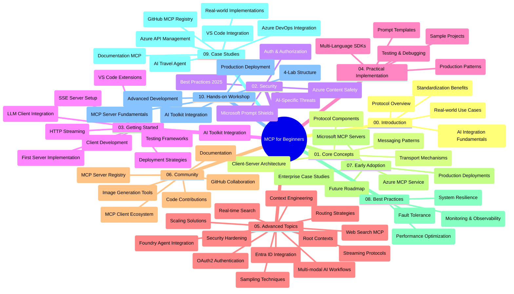

<!--
CO_OP_TRANSLATOR_METADATA:
{
  "original_hash": "719117a0a5f34ade7b5dfb61ee06fb13",
  "translation_date": "2025-09-26T19:25:12+00:00",
  "source_file": "study_guide.md",
  "language_code": "lt"
}
-->
# Modelio Konteksto Protokolas (MCP) pradedantiesiems - Mokymosi vadovas

Šis mokymosi vadovas pateikia apžvalgą apie saugyklos struktūrą ir turinį, skirtą „Modelio Konteksto Protokolas (MCP) pradedantiesiems“ mokymo programai. Naudokite šį vadovą, kad efektyviai naršytumėte saugyklą ir maksimaliai išnaudotumėte turimus išteklius.

## Saugyklos apžvalga

Modelio Konteksto Protokolas (MCP) yra standartizuota sistema, skirta sąveikai tarp AI modelių ir klientų programų. Iš pradžių sukurtas „Anthropic“, MCP dabar prižiūrimas platesnės MCP bendruomenės per oficialią GitHub organizaciją. Ši saugykla siūlo išsamią mokymo programą su praktiniais kodų pavyzdžiais C#, Java, JavaScript, Python ir TypeScript kalbomis, skirtą AI kūrėjams, sistemų architektams ir programinės įrangos inžinieriams.

## Vizualinis mokymo programos žemėlapis

## Saugyklos struktūra

Saugykla suskirstyta į dešimt pagrindinių skyrių, kiekvienas iš jų apima skirtingus MCP aspektus:

1. **Įvadas (00-Introduction/)**
   - Modelio Konteksto Protokolo apžvalga
   - Kodėl standartizacija yra svarbi AI procesuose
   - Praktiniai naudojimo atvejai ir nauda

2. **Pagrindinės sąvokos (01-CoreConcepts/)**
   - Kliento-serverio architektūra
   - Pagrindiniai protokolo komponentai
   - MCP žinučių perdavimo modeliai

3. **Saugumas (02-Security/)**
   - Saugumo grėsmės MCP pagrįstose sistemose
   - Geriausios praktikos saugiam įgyvendinimui
   - Autentifikavimo ir autorizacijos strategijos
   - **Išsamūs saugumo dokumentai**:
     - MCP saugumo geriausios praktikos 2025
     - Azure turinio saugumo įgyvendinimo vadovas
     - MCP saugumo kontrolės ir technikos
     - MCP greitosios nuorodos geriausios praktikos
   - **Pagrindinės saugumo temos**:
     - Prompt injekcijos ir įrankių užnuodijimo atakos
     - Sesijos užgrobimas ir klaidingo atstovo problemos
     - Tokenų perdavimo pažeidžiamumai
     - Pernelyg dideli leidimai ir prieigos kontrolė
     - Tiekimo grandinės saugumas AI komponentams
     - Microsoft Prompt Shields integracija

4. **Pradžia (03-GettingStarted/)**
   - Aplinkos nustatymas ir konfigūracija
   - Pagrindinių MCP serverių ir klientų kūrimas
   - Integracija su esamomis programomis
   - Įtraukiami skyriai:
     - Pirmojo serverio įgyvendinimas
     - Kliento kūrimas
     - LLM kliento integracija
     - VS Code integracija
     - Server-Sent Events (SSE) serveris
     - HTTP srautinė perdava
     - AI įrankių rinkinio integracija
     - Testavimo strategijos
     - Diegimo gairės

5. **Praktinis įgyvendinimas (04-PracticalImplementation/)**
   - SDK naudojimas skirtingose programavimo kalbose
   - Derinimo, testavimo ir validavimo technikos
   - Daugkartinio naudojimo prompt šablonų ir darbo eigų kūrimas
   - Pavyzdiniai projektai su įgyvendinimo pavyzdžiais

6. **Pažangios temos (05-AdvancedTopics/)**
   - Konteksto inžinerijos technikos
   - Foundry agento integracija
   - Daugiarūšės AI darbo eigos
   - OAuth2 autentifikavimo demonstracijos
   - Realaus laiko paieškos galimybės
   - Realaus laiko srautinė perdava
   - Pagrindinių kontekstų įgyvendinimas
   - Maršrutizavimo strategijos
   - Mėginių ėmimo technikos
   - Skalavimo metodai
   - Saugumo aspektai
   - Entra ID saugumo integracija
   - Interneto paieškos integracija

7. **Bendruomenės indėlis (06-CommunityContributions/)**
   - Kaip prisidėti prie kodo ir dokumentacijos
   - Bendradarbiavimas per GitHub
   - Bendruomenės inicijuoti patobulinimai ir atsiliepimai
   - Naudojimasis įvairiais MCP klientais (Claude Desktop, Cline, VSCode)
   - Darbas su populiariais MCP serveriais, įskaitant vaizdų generavimą

8. **Pamokos iš ankstyvojo pritaikymo (07-LessonsfromEarlyAdoption/)**
   - Realūs įgyvendinimai ir sėkmės istorijos
   - MCP pagrįstų sprendimų kūrimas ir diegimas
   - Tendencijos ir ateities planai
   - **Microsoft MCP serverių vadovas**: Išsamus vadovas apie 10 gamybai paruoštų Microsoft MCP serverių, įskaitant:
     - Microsoft Learn Docs MCP serveris
     - Azure MCP serveris (15+ specializuotų jungčių)
     - GitHub MCP serveris
     - Azure DevOps MCP serveris
     - MarkItDown MCP serveris
     - SQL Server MCP serveris
     - Playwright MCP serveris
     - Dev Box MCP serveris
     - Azure AI Foundry MCP serveris
     - Microsoft 365 Agents Toolkit MCP serveris

9. **Geriausios praktikos (08-BestPractices/)**
   - Našumo optimizavimas
   - Gedimams atsparių MCP sistemų projektavimas
   - Testavimo ir atsparumo strategijos

10. **Atvejų analizės (09-CaseStudy/)**
    - **Septynios išsamios atvejų analizės**, demonstruojančios MCP universalumą įvairiose situacijose:
    - **Azure AI kelionių agentai**: Daugiagentinė orkestracija su Azure OpenAI ir AI paieška
    - **Azure DevOps integracija**: Darbo procesų automatizavimas naudojant YouTube duomenų atnaujinimus
    - **Realaus laiko dokumentų paieška**: Python konsolės klientas su HTTP srautinė perdava
    - **Interaktyvus mokymosi plano generatorius**: Chainlit internetinė programa su pokalbių AI
    - **Dokumentacija redaktoriuje**: VS Code integracija su GitHub Copilot darbo eigomis
    - **Azure API valdymas**: Įmonės API integracija su MCP serverio kūrimu
    - **GitHub MCP registras**: Ekosistemos plėtra ir agentinė integracijos platforma
    - Įgyvendinimo pavyzdžiai, apimantys įmonės integraciją, kūrėjų produktyvumą ir ekosistemos plėtrą

11. **Praktinis seminaras (10-StreamliningAIWorkflowsBuildingAnMCPServerWithAIToolkit/)**
    - Išsamus praktinis seminaras, derinantis MCP su AI įrankių rinkiniu
    - Intelektualių programų kūrimas, jungiant AI modelius su realaus pasaulio įrankiais
    - Praktiniai moduliai, apimantys pagrindus, individualų serverio kūrimą ir gamybos diegimo strategijas
    - **Laboratorijos struktūra**:
      - Laboratorija 1: MCP serverio pagrindai
      - Laboratorija 2: Pažangus MCP serverio kūrimas
      - Laboratorija 3: AI įrankių rinkinio integracija
      - Laboratorija 4: Gamybos diegimas ir skalavimas
    - Mokymasis laboratorijose su žingsnis po žingsnio instrukcijomis

## Papildomi ištekliai

Saugykla apima papildomus išteklius:

- **Vaizdų aplankas**: Diagramos ir iliustracijos, naudojamos visoje mokymo programoje
- **Vertimai**: Daugiakalbė dokumentacijos palaikymas su automatizuotais vertimais
- **Oficialūs MCP ištekliai**:
  - [MCP dokumentacija](https://modelcontextprotocol.io/)
  - [MCP specifikacija](https://spec.modelcontextprotocol.io/)
  - [MCP GitHub saugykla](https://github.com/modelcontextprotocol)

## Kaip naudotis šia saugykla

1. **Nuoseklus mokymasis**: Sekite skyrius iš eilės (00–10), kad mokymasis būtų struktūruotas.
2. **Kalbai specifinis dėmesys**: Jei jus domina tam tikra programavimo kalba, peržiūrėkite pavyzdžių aplankus, kad rastumėte įgyvendinimus jūsų pasirinkta kalba.
3. **Praktinis įgyvendinimas**: Pradėkite nuo skyriaus „Pradžia“, kad nustatytumėte aplinką ir sukurtumėte pirmąjį MCP serverį bei klientą.
4. **Pažangus tyrinėjimas**: Kai įsisavinsite pagrindus, gilinkitės į pažangias temas, kad praplėstumėte žinias.
5. **Bendruomenės įsitraukimas**: Prisijunkite prie MCP bendruomenės per GitHub diskusijas ir Discord kanalus, kad susisiektumėte su ekspertais ir kitais kūrėjais.

## MCP klientai ir įrankiai

Mokymo programa apima įvairius MCP klientus ir įrankius:

1. **Oficialūs klientai**:
   - Visual Studio Code 
   - MCP Visual Studio Code aplinkoje
   - Claude Desktop
   - Claude VSCode aplinkoje 
   - Claude API

2. **Bendruomenės klientai**:
   - Cline (terminalo pagrindu)
   - Cursor (kodo redaktorius)
   - ChatMCP
   - Windsurf

3. **MCP valdymo įrankiai**:
   - MCP CLI
   - MCP Manager
   - MCP Linker
   - MCP Router

## Populiarūs MCP serveriai

Saugykla pristato įvairius MCP serverius, įskaitant:

1. **Oficialūs Microsoft MCP serveriai**:
   - Microsoft Learn Docs MCP serveris
   - Azure MCP serveris (15+ specializuotų jungčių)
   - GitHub MCP serveris
   - Azure DevOps MCP serveris
   - MarkItDown MCP serveris
   - SQL Server MCP serveris
   - Playwright MCP serveris
   - Dev Box MCP serveris
   - Azure AI Foundry MCP serveris
   - Microsoft 365 Agents Toolkit MCP serveris

2. **Oficialūs referenciniai serveriai**:
   - Failų sistema
   - Fetch
   - Atmintis
   - Nuoseklus mąstymas

3. **Vaizdų generavimas**:
   - Azure OpenAI DALL-E 3
   - Stable Diffusion WebUI
   - Replicate

4. **Kūrimo įrankiai**:
   - Git MCP
   - Terminalo valdymas
   - Kodo asistentas

5. **Specializuoti serveriai**:
   - Salesforce
   - Microsoft Teams
   - Jira & Confluence

## Prisidėjimas

Ši saugykla kviečia bendruomenės indėlį. Žr. skyrių „Bendruomenės indėlis“, kad sužinotumėte, kaip efektyviai prisidėti prie MCP ekosistemos.

## Pakeitimų istorija

| Data | Pakeitimai |
|------|-----------|
| 2025 m. rugsėjo 26 d. | - Pridėta GitHub MCP registras atvejų analizės skyriuje 09-CaseStudy - Atnaujintos atvejų analizės, kad atspindėtų septynias išsamias analizės - Patobulinti atvejų analizės aprašymai su konkrečiais įgyvendinimo duomenimis - Atnaujintas vizualinis mokymo programos žemėlapis, įtraukiant GitHub MCP registrą - Peržiūrėta mokymosi vadovo struktūra, kad atspindėtų ekosistemos plėtros dėmesį |
| 2025 m. liepos 18 d. | - Atnaujinta saugyklos struktūra, įtraukiant Microsoft MCP serverių vadovą - Pridėtas išsamus 10 gamybai paruoštų Microsoft MCP serverių sąrašas - Patobulintas populiarių MCP serverių skyrius su oficialiais Microsoft MCP serveriais - Atnaujintas atvejų analizės skyrius su faktiniais failų pavyzdžiais - Pridėta laboratorijos struktūros detalės praktiniam seminarui |
| 2025 m. liepos 16 d. | - Atnaujinta saugyklos struktūra, kad atspindėtų dabartinį turinį - Pridėtas MCP klientų ir įrankių skyrius - Pridėtas populiarių MCP serverių skyrius - Atnaujintas vizualinis mokymo programos žemėlapis su visomis dabartinėmis temomis - Patobulintas pažangių temų skyrius su visomis specializuotomis sritimis - Atnaujintos atvejų analizės, kad atspindėtų faktinius pavyzdžius - Paaiškinta MCP kilmė kaip sukurta „Anthropic“ |
| 2025 m. birželio 11 d. | - Pradinis mokymosi vadovo sukūrimas - Pridėtas vizualinis mokymo programos žemėlapis - Apibrėžta saugyklos struktūra - Įtraukti pavyzdiniai projektai ir papildomi ištekliai |

---

*Šis mokymosi vadovas buvo atnaujintas 2025 m. rugsėjo 26 d. ir pateikia saugyklos apžvalgą iki tos datos. Saugyklos turinys gali būti atnaujintas po šios datos.*

---

