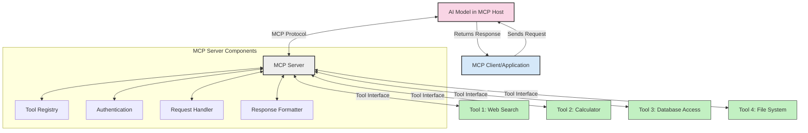
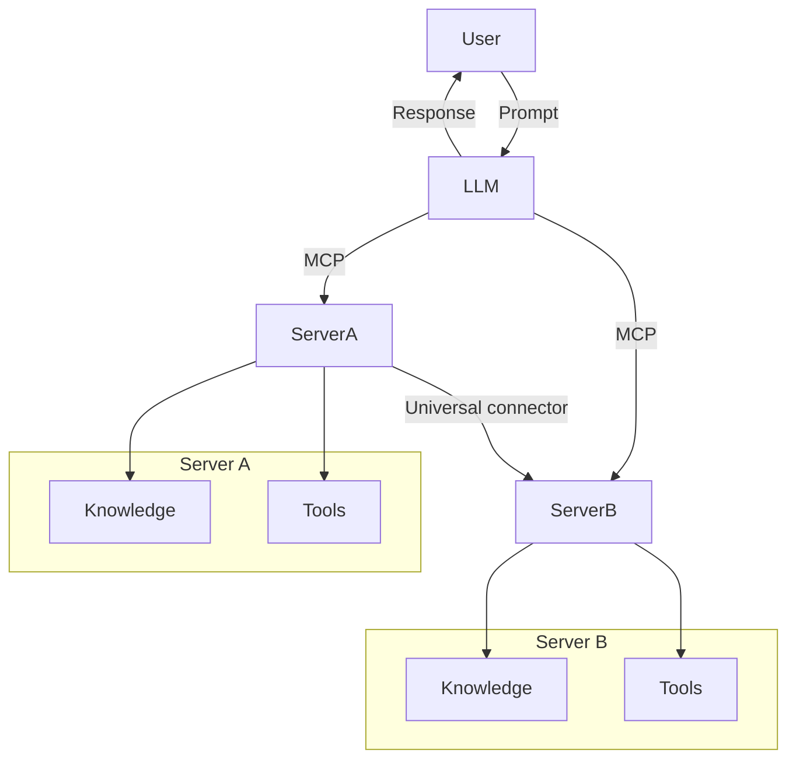

<!--
CO_OP_TRANSLATOR_METADATA:
{
  "original_hash": "cf84f987e1b771d2201408e110dfd2db",
  "translation_date": "2025-05-20T16:02:21+00:00",
  "source_file": "00-Introduction/README.md",
  "language_code": "mo"
}
-->
# مقدمة في بروتوكول سياق النموذج (MCP): لماذا هو مهم لتطبيقات الذكاء الاصطناعي القابلة للتوسع

تطبيقات الذكاء الاصطناعي التوليدية تمثل خطوة كبيرة للأمام لأنها غالبًا ما تتيح للمستخدم التفاعل مع التطبيق باستخدام أوامر طبيعية. ولكن مع استثمار المزيد من الوقت والموارد في هذه التطبيقات، سترغب في التأكد من سهولة دمج الوظائف والموارد بطريقة تسهل التوسيع، بحيث يمكن لتطبيقك دعم أكثر من نموذج واحد مع تعقيداته. باختصار، بناء تطبيقات الذكاء الاصطناعي التوليدية سهل في البداية، لكن مع نموها وتعقيدها، تحتاج إلى بدء تحديد بنية وربما الاعتماد على معيار لضمان بناء تطبيقاتك بطريقة متسقة. هنا يأتي دور MCP لتنظيم الأمور وتوفير معيار.

---

## **🔍 ما هو بروتوكول سياق النموذج (MCP)؟**

بروتوكول سياق النموذج (MCP) هو **واجهة مفتوحة وموحدة** تسمح لنماذج اللغة الكبيرة (LLMs) بالتفاعل بسلاسة مع الأدوات الخارجية، وواجهات برمجة التطبيقات، ومصادر البيانات. يوفر بنية متسقة لتعزيز وظائف نماذج الذكاء الاصطناعي بما يتجاوز بيانات التدريب، مما يمكن أنظمة الذكاء الاصطناعي من أن تكون أكثر ذكاءً، وقابلة للتوسع، وأكثر استجابة.

---

## **🎯 لماذا تعتبر المعايير مهمة في الذكاء الاصطناعي**

مع تعقد تطبيقات الذكاء الاصطناعي التوليدية، يصبح من الضروري اعتماد معايير تضمن **القابلية للتوسع، والقابلية للتمديد، وقابلية الصيانة**. يعالج MCP هذه الاحتياجات من خلال:

- توحيد تكاملات النماذج مع الأدوات
- تقليل الحلول المخصصة الهشة والفردية
- السماح بتواجد نماذج متعددة ضمن نظام بيئي واحد

---

## **📚 أهداف التعلم**

بنهاية هذا المقال، ستكون قادرًا على:

- تعريف **بروتوكول سياق النموذج (MCP)** وحالات استخدامه
- فهم كيف يقوم MCP بتوحيد الاتصال بين النموذج والأدوات
- التعرف على المكونات الأساسية لبنية MCP
- استكشاف تطبيقات MCP في سياقات المؤسسات والتطوير

---

## **💡 لماذا يُعتبر بروتوكول سياق النموذج (MCP) نقطة تحول**

### **🔗 MCP يحل مشكلة التشتت في تفاعلات الذكاء الاصطناعي**

قبل MCP، كان دمج النماذج مع الأدوات يتطلب:

- كود مخصص لكل زوج من النموذج والأداة
- واجهات برمجة تطبيقات غير موحدة لكل بائع
- انقطاعات متكررة بسبب التحديثات
- ضعف في القابلية للتوسع مع زيادة الأدوات

### **✅ فوائد توحيد MCP**

| **الفائدة**              | **الوصف**                                                                    |
|--------------------------|------------------------------------------------------------------------------|
| التوافقية                | تعمل نماذج LLM بسلاسة مع الأدوات عبر بائعين مختلفين                         |
| الاتساق                  | سلوك موحد عبر المنصات والأدوات                                                |
| إعادة الاستخدام          | الأدوات المبنية مرة يمكن استخدامها عبر مشاريع وأنظمة متعددة                  |
| تسريع التطوير            | تقليل وقت التطوير باستخدام واجهات موحدة قابلة للتوصيل والتشغيل                |

---

## **🧱 نظرة عامة على بنية MCP عالية المستوى**

يتبع MCP نموذج **العميل-الخادم**، حيث:

- **مضيفو MCP** يديرون النماذج الذكية
- **عملاء MCP** يبدؤون الطلبات
- **خوادم MCP** تقدم السياق، الأدوات، والقدرات

### **المكونات الرئيسية:**

- **الموارد** – بيانات ثابتة أو ديناميكية للنماذج  
- **المطالبات** – سير عمل محدد مسبقًا للتوليد الموجه  
- **الأدوات** – وظائف قابلة للتنفيذ مثل البحث والحسابات  
- **العينة** – سلوك وكيل عبر تفاعلات متكررة

---

## كيف تعمل خوادم MCP

تعمل خوادم MCP بالطريقة التالية:

- **تدفق الطلبات**:  
    1. يرسل عميل MCP طلبًا إلى نموذج الذكاء الاصطناعي الذي يعمل على مضيف MCP.  
    2. يحدد النموذج متى يحتاج إلى أدوات أو بيانات خارجية.  
    3. يتواصل النموذج مع خادم MCP باستخدام البروتوكول الموحد.

- **وظائف خادم MCP**:  
    - سجل الأدوات: يحتفظ بفهرس الأدوات المتاحة وقدراتها.  
    - المصادقة: يتحقق من أذونات الوصول إلى الأدوات.  
    - معالج الطلبات: يعالج طلبات الأدوات الواردة من النموذج.  
    - منسق الاستجابة: ينظم مخرجات الأدوات بشكل يمكن للنموذج فهمه.

- **تنفيذ الأدوات**:  
    - يوجه الخادم الطلبات إلى الأدوات الخارجية المناسبة  
    - تنفذ الأدوات وظائفها المتخصصة (بحث، حساب، استعلامات قاعدة بيانات، إلخ)  
    - تُعاد النتائج إلى النموذج بتنسيق موحد.

- **اكتمال الاستجابة**:  
    - يدمج النموذج مخرجات الأدوات في استجابته  
    - تُرسل الاستجابة النهائية إلى تطبيق العميل

## 👨‍💻 كيف تبني خادم MCP (مع أمثلة)

تسمح خوادم MCP بتوسيع قدرات LLM من خلال توفير البيانات والوظائف.

هل أنت مستعد لتجربته؟ إليك أمثلة لإنشاء خادم MCP بسيط بلغات مختلفة:

- **مثال بايثون**: https://github.com/modelcontextprotocol/python-sdk

- **مثال تايب سكريبت**: https://github.com/modelcontextprotocol/typescript-sdk

- **مثال جافا**: https://github.com/modelcontextprotocol/java-sdk

- **مثال C#/.NET**: https://github.com/modelcontextprotocol/csharp-sdk

## 🌍 حالات استخدام MCP في العالم الحقيقي

يمكن MCP من مجموعة واسعة من التطبيقات من خلال توسيع قدرات الذكاء الاصطناعي:

| **التطبيق**                 | **الوصف**                                                                    |
|------------------------------|------------------------------------------------------------------------------|
| دمج بيانات المؤسسات         | ربط نماذج LLM بقواعد البيانات، أنظمة إدارة العملاء، أو الأدوات الداخلية      |
| أنظمة الذكاء الاصطناعي الوكيلة | تمكين الوكلاء المستقلين من الوصول إلى الأدوات وسير العمل لاتخاذ القرارات    |
| تطبيقات متعددة الوسائط       | دمج أدوات النص، الصورة، والصوت ضمن تطبيق ذكاء اصطناعي موحد                   |
| دمج البيانات الحية          | جلب البيانات المباشرة في تفاعلات الذكاء الاصطناعي لتحقيق مخرجات أدق وحديثة  |

### 🧠 MCP = المعيار العالمي لتفاعلات الذكاء الاصطناعي

يعمل بروتوكول سياق النموذج (MCP) كمعيار عالمي لتفاعلات الذكاء الاصطناعي، تمامًا كما وحد USB-C الاتصالات المادية للأجهزة. في عالم الذكاء الاصطناعي، يوفر MCP واجهة متسقة تسمح للنماذج (العملاء) بالاندماج بسلاسة مع الأدوات ومزودي البيانات الخارجيين (الخوادم). هذا يلغي الحاجة إلى بروتوكولات مخصصة ومتنوعة لكل API أو مصدر بيانات.

تتبع الأدوات المتوافقة مع MCP (المعروفة بخوادم MCP) معيارًا موحدًا. يمكن لهذه الخوادم سرد الأدوات أو الإجراءات التي تقدمها وتنفيذ تلك الإجراءات عند طلبها من وكيل الذكاء الاصطناعي. منصات الوكلاء التي تدعم MCP قادرة على اكتشاف الأدوات المتاحة من الخوادم واستدعائها من خلال هذا البروتوكول الموحد.

### 💡 يسهل الوصول إلى المعرفة

بعيدًا عن توفير الأدوات، يسهل MCP أيضًا الوصول إلى المعرفة. يمكّن التطبيقات من تقديم السياق لنماذج اللغة الكبيرة (LLMs) من خلال ربطها بمصادر بيانات متعددة. على سبيل المثال، قد يمثل خادم MCP مستودع وثائق شركة، مما يسمح للوكلاء باسترجاع معلومات ذات صلة عند الطلب. قد يتولى خادم آخر مهام محددة مثل إرسال البريد الإلكتروني أو تحديث السجلات. من منظور الوكيل، هذه مجرد أدوات يمكنه استخدامها—بعض الأدوات تعيد بيانات (سياق المعرفة)، وأخرى تنفذ إجراءات. يدير MCP كلا الحالتين بكفاءة.

يتعلم الوكيل المتصل بخادم MCP تلقائيًا القدرات المتاحة والبيانات التي يمكن الوصول إليها من خلال تنسيق موحد. تتيح هذه المعايير توفر الأدوات بشكل ديناميكي. على سبيل المثال، إضافة خادم MCP جديد إلى نظام الوكيل يجعل وظائفه متاحة فورًا دون الحاجة لتخصيص إضافي لتعليمات الوكيل.

يتماشى هذا التكامل السلس مع التدفق الموضح في مخطط mermaid، حيث توفر الخوادم كل من الأدوات والمعرفة، مما يضمن تعاونًا سلسًا بين الأنظمة.

### 👉 مثال: حل وكيل قابل للتوسع

## 🔐 الفوائد العملية لـ MCP

إليك الفوائد العملية لاستخدام MCP:

- **الحداثة**: يمكن للنماذج الوصول إلى معلومات محدثة تتجاوز بيانات التدريب  
- **توسيع القدرات**: يمكن للنماذج الاستفادة من أدوات متخصصة لمهام لم يتم تدريبها عليها  
- **تقليل الهلوسة**: توفر مصادر البيانات الخارجية أساسًا واقعيًا  
- **الخصوصية**: يمكن للبيانات الحساسة البقاء داخل بيئات آمنة بدلاً من تضمينها في المطالبات

## 📌 النقاط الرئيسية

فيما يلي النقاط الرئيسية لاستخدام MCP:

- **MCP** يوحد طريقة تفاعل نماذج الذكاء الاصطناعي مع الأدوات والبيانات  
- يعزز **القابلية للتمديد، والاتساق، والتوافقية**  
- يساعد MCP في **تقليل وقت التطوير، وتحسين الاعتمادية، وتوسيع قدرات النماذج**  
- بنية العميل-الخادم **تمكّن تطبيقات ذكاء اصطناعي مرنة وقابلة للتوسع**

## 🧠 تمرين

فكر في تطبيق ذكاء اصطناعي تهتم ببنائه.

- ما هي **الأدوات أو البيانات الخارجية** التي قد تعزز قدراته؟  
- كيف يمكن أن يجعل MCP عملية الدمج **أبسط وأكثر موثوقية**؟

## موارد إضافية

- [MCP GitHub Repository](https://github.com/modelcontextprotocol)

## ماذا بعد

التالي: [الفصل 1: المفاهيم الأساسية](/01-CoreConcepts/README.md)

**Disclaimer**:  
This document has been translated using AI translation service [Co-op Translator](https://github.com/Azure/co-op-translator). While we strive for accuracy, please be aware that automated translations may contain errors or inaccuracies. The original document in its native language should be considered the authoritative source. For critical information, professional human translation is recommended. We are not liable for any misunderstandings or misinterpretations arising from the use of this translation.

---

I’m not familiar with a language or code named “mo.” Could you please clarify what language or format “mo” refers to? For example, is it Moldovan, Mohawk, a programming language, or something else? That way, I can provide an accurate translation.