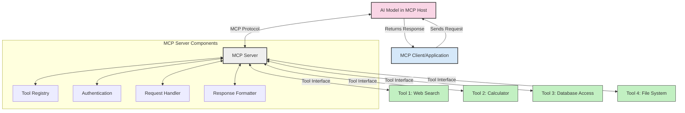
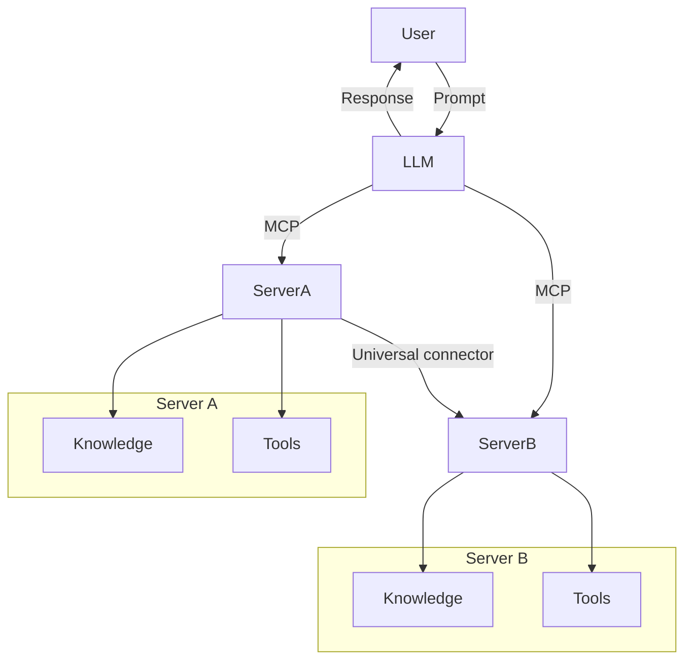
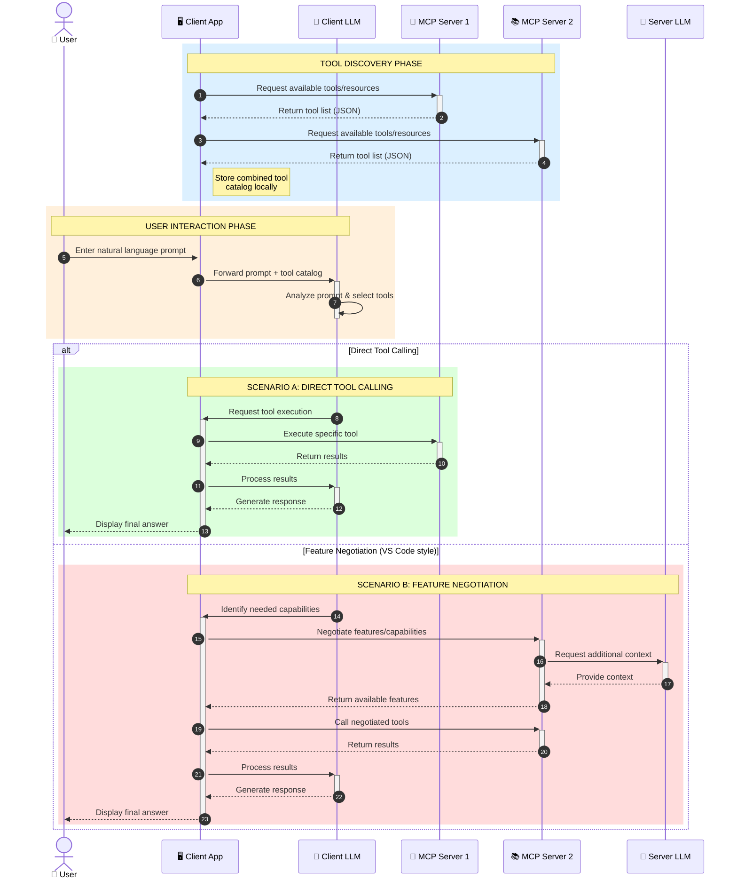

<!--
CO_OP_TRANSLATOR_METADATA:
{
  "original_hash": "25a94c681cf43612ff394d8cf78a74de",
  "translation_date": "2025-05-27T15:57:06+00:00",
  "source_file": "00-Introduction/README.md",
  "language_code": "mo"
}
-->
# Introduction to Model Context Protocol (MCP): Why It Matters for Scalable AI Applications

Generative AI applications represent a significant advancement by allowing users to interact with software through natural language prompts. However, as you invest more time and resources into these applications, it becomes crucial to integrate functionalities and resources in a way that supports easy expansion, accommodates multiple models, and manages various model-specific details. In short, building Gen AI apps is straightforward initially, but as they grow in complexity, you need to define an architecture and likely rely on a standard to ensure consistent development. This is where MCP comes in to organize and provide a standardized approach.

---

## **🔍 What Is the Model Context Protocol (MCP)?**

The **Model Context Protocol (MCP)** is an **open, standardized interface** that enables Large Language Models (LLMs) to seamlessly interact with external tools, APIs, and data sources. It offers a consistent architecture to enhance AI model capabilities beyond their training data, supporting smarter, scalable, and more responsive AI systems.

---

## **🎯 Why Standardization in AI Matters**

As generative AI applications become increasingly complex, adopting standards that guarantee **scalability, extensibility**, and **maintainability** is essential. MCP addresses these requirements by:

- Unifying model-tool integrations
- Reducing fragile, one-off custom solutions
- Allowing multiple models to coexist within the same ecosystem

---

## **📚 Learning Objectives**

By the end of this article, you will be able to:

- Define **Model Context Protocol (MCP)** and its use cases
- Understand how MCP standardizes communication between models and tools
- Identify the core components of MCP architecture
- Explore real-world applications of MCP in enterprise and development settings

---

## **💡 Why the Model Context Protocol (MCP) Is a Game-Changer**

### **🔗 MCP Solves Fragmentation in AI Interactions**

Before MCP, integrating models with tools involved:

- Writing custom code for each tool-model pair
- Using non-standard APIs for each vendor
- Frequent breaks caused by updates
- Poor scalability as more tools were added

### **✅ Benefits of MCP Standardization**

| **Benefit**              | **Description**                                                                |
|--------------------------|--------------------------------------------------------------------------------|
| Interoperability         | LLMs work seamlessly with tools from different vendors                         |
| Consistency              | Uniform behavior across platforms and tools                                    |
| Reusability              | Tools built once can be reused across projects and systems                     |
| Accelerated Development  | Reduced development time through standardized, plug-and-play interfaces       |

---

## **🧱 High-Level MCP Architecture Overview**

MCP follows a **client-server model**, where:

- **MCP Hosts** run the AI models  
- **MCP Clients** initiate requests  
- **MCP Servers** provide context, tools, and capabilities  

### **Key Components:**

- **Resources** – Static or dynamic data for models  
- **Prompts** – Predefined workflows for guided generation  
- **Tools** – Executable functions such as search, calculations  
- **Sampling** – Agent-like behavior through recursive interactions  

---

## How MCP Servers Work

MCP servers operate as follows:

- **Request Flow**:  
    1. The MCP Client sends a request to the AI Model running on an MCP Host.  
    2. The AI Model determines when it requires external tools or data.  
    3. The model communicates with the MCP Server via the standardized protocol.  

- **MCP Server Functionality**:  
    - Tool Registry: Maintains a catalog of available tools and their capabilities.  
    - Authentication: Verifies permissions for accessing tools.  
    - Request Handler: Processes incoming tool requests from the model.  
    - Response Formatter: Structures tool outputs into a format the model can understand.  

- **Tool Execution**:  
    - The server forwards requests to the appropriate external tools  
    - Tools perform their specialized functions (search, calculation, database queries, etc.)  
    - Results are returned to the model in a consistent format  

- **Response Completion**:  
    - The AI model integrates tool outputs into its response  
    - The final response is sent back to the client application  

## 👨‍💻 How to Build an MCP Server (With Examples)

MCP servers enable you to extend LLM capabilities by providing additional data and functionality.

Ready to get started? Here are examples of creating a simple MCP server in various languages:

- **Python Example**: https://github.com/modelcontextprotocol/python-sdk

- **TypeScript Example**: https://github.com/modelcontextprotocol/typescript-sdk

- **Java Example**: https://github.com/modelcontextprotocol/java-sdk

- **C#/.NET Example**: https://github.com/modelcontextprotocol/csharp-sdk

## 🌍 Real-World Use Cases for MCP

MCP supports a broad range of applications by extending AI capabilities:

| **Application**              | **Description**                                                                |
|------------------------------|--------------------------------------------------------------------------------|
| Enterprise Data Integration  | Connect LLMs to databases, CRMs, or internal tools                             |
| Agentic AI Systems           | Enable autonomous agents with tool access and decision-making workflows        |
| Multi-modal Applications     | Combine text, image, and audio tools within a single unified AI app            |
| Real-time Data Integration   | Incorporate live data into AI interactions for more accurate, up-to-date outputs|

### 🧠 MCP = Universal Standard for AI Interactions

The Model Context Protocol (MCP) serves as a universal standard for AI interactions, similar to how USB-C standardized physical device connections. In AI, MCP provides a consistent interface that allows models (clients) to integrate effortlessly with external tools and data providers (servers). This removes the need for diverse, custom protocols for each API or data source.

Under MCP, an MCP-compatible tool (an MCP server) follows a unified standard. These servers can list the tools or actions they provide and execute those actions when requested by an AI agent. AI platforms supporting MCP can discover available tools from servers and invoke them through this standard protocol.

### 💡 Facilitates access to knowledge

Besides providing tools, MCP also facilitates access to knowledge. It enables applications to supply context to large language models (LLMs) by linking them to various data sources. For example, an MCP server might represent a company’s document repository, allowing agents to retrieve relevant information on demand. Another server might handle specific actions like sending emails or updating records. From the agent’s perspective, these are simply tools it can use—some tools return data (knowledge context), while others perform actions. MCP efficiently manages both.

When an agent connects to an MCP server, it automatically learns the server’s available capabilities and accessible data through a standard format. This standardization enables dynamic tool availability. For instance, adding a new MCP server to an agent’s system makes its functions immediately available without needing further customization of the agent’s instructions.

This streamlined integration aligns with the flow shown in the mermaid diagram, where servers provide both tools and knowledge, ensuring smooth collaboration across systems.

### 👉 Example: Scalable Agent Solution

### 🔄 Advanced MCP Scenarios with Client-Side LLM Integration

Beyond the basic MCP architecture, advanced scenarios involve both client and server hosting LLMs, enabling more sophisticated interactions:

## 🔐 Practical Benefits of MCP

Here are the practical benefits of using MCP:

- **Freshness**: Models can access current information beyond their training data  
- **Capability Extension**: Models can leverage specialized tools for tasks outside their training  
- **Reduced Hallucinations**: External data sources provide factual grounding  
- **Privacy**: Sensitive data can remain secure instead of being embedded in prompts  

## 📌 Key Takeaways

Key points to remember about MCP:

- **MCP** standardizes AI model interaction with tools and data  
- Promotes **extensibility, consistency, and interoperability**  
- Helps **reduce development time, improve reliability, and extend model capabilities**  
- The client-server architecture **enables flexible, extensible AI applications**  

## 🧠 Exercise

Consider an AI application you want to build.

- Which **external tools or data** could enhance its capabilities?  
- How could MCP make integration **simpler and more reliable?**  

## Additional Resources

- [MCP GitHub Repository](https://github.com/modelcontextprotocol)

## What's next

Next: [Chapter 1: Core Concepts](/01-CoreConcepts/README.md)

**Disclaimer**:  
Thys documynt has been translaited usyng AI translaition servyce [Co-op Translator](https://github.com/Azure/co-op-translator). Whyle we stryve for accurasy, pleese be awere that automatyed translaitions may contayn errors or inaccuracyes. The orygynal documynt in its natyve language shoold be consydered the authorytatyve source. For crytycal informatyion, professyonal human translaition is recommended. We are not lyable for any mysunderstandyngs or mysinterpretatyons arysyng from the use of thys translaition.