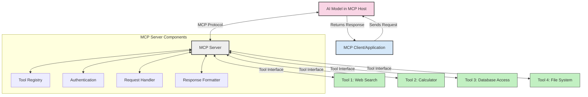
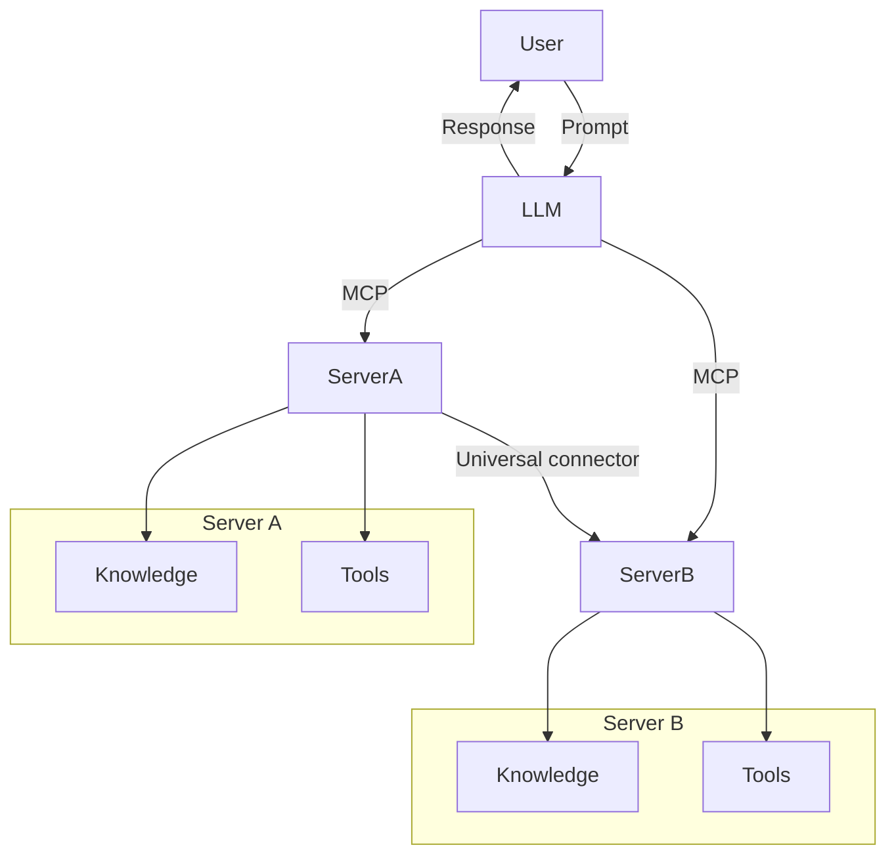

<!--
CO_OP_TRANSLATOR_METADATA:
{
  "original_hash": "1d88dee994dcbb3fa52c271d0c0817b5",
  "translation_date": "2025-05-20T20:35:15+00:00",
  "source_file": "00-Introduction/README.md",
  "language_code": "mo"
}
-->
# Introduction to Model Context Protocol (MCP): Why It Matters for Scalable AI Applications

Generative AI applications represent a significant advancement as they often allow users to interact with the app through natural language prompts. However, as more time and resources are invested in these apps, it becomes important to ensure easy integration of functionalities and resources in a way that supports extensibility, allows multiple models to be used, and manages various model complexities. In short, building Gen AI apps is straightforward initially, but as they scale and grow more complex, defining an architecture and relying on a standard becomes necessary to ensure consistent app development. This is where MCP comes in to organize and provide a standard.

---

## **🔍 What Is the Model Context Protocol (MCP)?**

The **Model Context Protocol (MCP)** is an **open, standardized interface** that enables Large Language Models (LLMs) to interact smoothly with external tools, APIs, and data sources. It offers a consistent architecture to extend AI model capabilities beyond their training data, allowing for smarter, scalable, and more responsive AI systems.

---

## **🎯 Why Standardization in AI Matters**

As generative AI applications become more sophisticated, adopting standards that ensure **scalability, extensibility**, and **maintainability** is crucial. MCP addresses these needs by:

- Unifying model-tool integrations  
- Reducing fragile, one-off custom solutions  
- Enabling multiple models to coexist within a single ecosystem  

---

## **📚 Learning Objectives**

By the end of this article, you will be able to:

- Define **Model Context Protocol (MCP)** and its use cases  
- Understand how MCP standardizes communication between models and tools  
- Identify the core components of MCP architecture  
- Explore practical applications of MCP in enterprise and development settings  

---

## **💡 Why the Model Context Protocol (MCP) Is a Game-Changer**

### **🔗 MCP Solves Fragmentation in AI Interactions**

Before MCP, integrating models with tools involved:

- Writing custom code for each tool-model pair  
- Using non-standard APIs for each vendor  
- Frequent disruptions caused by updates  
- Poor scalability as the number of tools increased  

### **✅ Benefits of MCP Standardization**

| **Benefit**              | **Description**                                                                |
|--------------------------|--------------------------------------------------------------------------------|
| Interoperability         | LLMs work seamlessly with tools from various vendors                          |
| Consistency              | Uniform behavior across different platforms and tools                         |
| Reusability              | Tools built once can be reused across projects and systems                    |
| Accelerated Development  | Development time is reduced by using standardized, plug-and-play interfaces   |

---

## **🧱 High-Level MCP Architecture Overview**

MCP follows a **client-server model**, where:

- **MCP Hosts** run the AI models  
- **MCP Clients** initiate requests  
- **MCP Servers** provide context, tools, and capabilities  

### **Key Components:**

- **Resources** – Static or dynamic data available to models  
- **Prompts** – Predefined workflows to guide generation  
- **Tools** – Executable functions like search or calculations  
- **Sampling** – Agentic behavior through recursive interactions  

---

## How MCP Servers Work

MCP servers function as follows:

- **Request Flow**:  
    1. The MCP Client sends a request to the AI Model hosted on an MCP Host.  
    2. The AI Model determines when it requires external tools or data.  
    3. The model communicates with the MCP Server via the standardized protocol.

- **MCP Server Functionality**:  
    - Tool Registry: Maintains a catalog of available tools and their capabilities.  
    - Authentication: Verifies permissions for tool access.  
    - Request Handler: Processes tool requests coming from the model.  
    - Response Formatter: Structures tool outputs into a format the model can understand.

- **Tool Execution**:  
    - The server routes requests to the appropriate external tools.  
    - Tools perform their specialized functions (search, calculation, database queries, etc.).  
    - Results are returned to the model in a consistent format.

- **Response Completion**:  
    - The AI model integrates tool outputs into its response.  
    - The final response is sent back to the client application.

## 👨‍💻 How to Build an MCP Server (With Examples)

MCP servers let you extend LLM capabilities by providing additional data and functionality.

Ready to get started? Here are examples of creating a simple MCP server in various programming languages:

- **Python Example**: https://github.com/modelcontextprotocol/python-sdk

- **TypeScript Example**: https://github.com/modelcontextprotocol/typescript-sdk

- **Java Example**: https://github.com/modelcontextprotocol/java-sdk

- **C#/.NET Example**: https://github.com/modelcontextprotocol/csharp-sdk

## 🌍 Real-World Use Cases for MCP

MCP supports a wide variety of applications by extending AI capabilities:

| **Application**              | **Description**                                                                |
|------------------------------|--------------------------------------------------------------------------------|
| Enterprise Data Integration  | Connect LLMs to databases, CRMs, or internal tools                             |
| Agentic AI Systems           | Enable autonomous agents with access to tools and decision-making workflows    |
| Multi-modal Applications     | Combine text, image, and audio tools within a single unified AI app            |
| Real-time Data Integration   | Incorporate live data into AI interactions for more accurate, current outputs  |

### 🧠 MCP = Universal Standard for AI Interactions

The Model Context Protocol (MCP) serves as a universal standard for AI interactions, similar to how USB-C standardized physical connections for devices. In AI, MCP provides a consistent interface that allows models (clients) to integrate seamlessly with external tools and data providers (servers). This removes the need for multiple, custom protocols for every API or data source.

Under MCP, an MCP-compatible tool (called an MCP server) follows a unified standard. These servers can list the tools or actions they provide and execute those actions when requested by an AI agent. AI agent platforms supporting MCP can discover available tools from servers and invoke them through this standardized protocol.

### 💡 Facilitates access to knowledge

Beyond providing tools, MCP also facilitates access to knowledge. It enables applications to supply context to large language models (LLMs) by connecting them to diverse data sources. For example, an MCP server might represent a company’s document repository, allowing agents to retrieve relevant information on demand. Another server might handle specific tasks like sending emails or updating records. From the agent’s perspective, these are simply tools it can use—some tools return data (knowledge context), while others perform actions. MCP manages both efficiently.

An agent connecting to an MCP server automatically learns about the server's available capabilities and accessible data through a standard format. This standardization enables dynamic tool availability. For instance, adding a new MCP server to an agent’s system immediately makes its functions usable without needing to modify the agent's instructions.

This streamlined integration follows the flow shown in the mermaid diagram, where servers provide both tools and knowledge, ensuring smooth collaboration across systems.

### 👉 Example: Scalable Agent Solution

## 🔐 Practical Benefits of MCP

Here are the practical advantages of using MCP:

- **Freshness**: Models can access up-to-date information beyond their training data  
- **Capability Extension**: Models can use specialized tools for tasks outside their original training  
- **Reduced Hallucinations**: External data sources provide factual grounding  
- **Privacy**: Sensitive data remains within secure environments instead of being embedded in prompts  

## 📌 Key Takeaways

The main points to remember about MCP:

- **MCP** standardizes how AI models interact with tools and data  
- Promotes **extensibility, consistency, and interoperability**  
- Helps **reduce development time, improve reliability, and expand model capabilities**  
- The client-server architecture **enables flexible, extensible AI applications**  

## 🧠 Exercise

Consider an AI application you want to build.

- Which **external tools or data** could enhance its capabilities?  
- How could MCP make integration **simpler and more reliable?**  

## Additional Resources

- [MCP GitHub Repository](https://github.com/modelcontextprotocol)

## What's next

Next: [Chapter 1: Core Concepts](/01-CoreConcepts/README.md)

**Disclaimer**:  
Thiz dokyument haz been translayted yusing AI translaytion servyce [Co-op Translator](https://github.com/Azure/co-op-translator). Whyle we stryve for akkuracy, pleese be awere that automayted translaytions may kontain errurz or inakkuraseez. The orygynal dokyument in itz naytiv langwage shood be konsydered the authoritativ sorce. For krytikal informayshun, profeshynal hyuman translaytion is rekomended. We ar not lyable for any myzunderstandings or myzinterpretayshuns aryzing from the yuse of this translaytion.