<!--
CO_OP_TRANSLATOR_METADATA:
{
  "original_hash": "1446979020432f512c883848d7eca144",
  "translation_date": "2025-05-29T21:42:41+00:00",
  "source_file": "00-Introduction/README.md",
  "language_code": "mo"
}
-->
# Introduction to Model Context Protocol (MCP): Why It Matters for Scalable AI Applications

Generative AI applications represent a significant advancement by allowing users to interact through natural language prompts. However, as these applications grow and require more resources, it's important to ensure easy integration of functionalities and resources in a way that supports extensibility, multi-model support, and handles various model complexities. In short, building Gen AI apps is simple at first, but as they scale and become more complex, defining a clear architecture and relying on a standard becomes necessary. This is where MCP steps in to organize and standardize the process.

---

## **🔍 What Is the Model Context Protocol (MCP)?**

The **Model Context Protocol (MCP)** is an **open, standardized interface** that enables Large Language Models (LLMs) to seamlessly interact with external tools, APIs, and data sources. It provides a consistent framework to extend AI model capabilities beyond their training data, allowing for smarter, scalable, and more responsive AI systems.

---

## **🎯 Why Standardization in AI Matters**

As generative AI applications become more complex, adopting standards that ensure **scalability, extensibility**, and **maintainability** is crucial. MCP addresses these needs by:

- Unifying model-tool integrations
- Reducing fragile, one-off custom solutions
- Supporting multiple models within a single ecosystem

---

## **📚 Learning Objectives**

By the end of this article, you will be able to:

- Define **Model Context Protocol (MCP)** and its applications
- Understand how MCP standardizes communication between models and tools
- Identify the main components of MCP architecture
- Explore real-world uses of MCP in enterprise and development settings

---

## **💡 Why the Model Context Protocol (MCP) Is a Game-Changer**

### **🔗 MCP Solves Fragmentation in AI Interactions**

Before MCP, integrating models with tools involved:

- Writing custom code for each tool-model pair
- Using non-standard APIs for different vendors
- Frequent disruptions due to updates
- Poor scalability as more tools were added

### **✅ Benefits of MCP Standardization**

| **Benefit**              | **Description**                                                                |
|--------------------------|--------------------------------------------------------------------------------|
| Interoperability         | LLMs work smoothly with tools from various vendors                            |
| Consistency              | Uniform behavior across platforms and tools                                   |
| Reusability              | Tools built once can be reused across multiple projects and systems           |
| Accelerated Development  | Shorten development time with standardized, plug-and-play interfaces          |

---

## **🧱 High-Level MCP Architecture Overview**

MCP uses a **client-server model**, where:

- **MCP Hosts** run the AI models
- **MCP Clients** initiate requests
- **MCP Servers** provide context, tools, and capabilities

### **Key Components:**

- **Resources** – Static or dynamic data available to models  
- **Prompts** – Predefined workflows to guide generation  
- **Tools** – Executable functions such as search or calculations  
- **Sampling** – Agent-like behavior through recursive interactions

---

## How MCP Servers Work

MCP servers function as follows:

- **Request Flow**: 
    1. The MCP Client sends a request to the AI Model hosted in an MCP Host.
    2. The AI Model determines when it needs external tools or data.
    3. The model communicates with the MCP Server via the standardized protocol.

- **MCP Server Functionality**:
    - Tool Registry: Keeps a catalog of available tools and their capabilities.
    - Authentication: Confirms permissions for tool access.
    - Request Handler: Manages incoming tool requests from the model.
    - Response Formatter: Organizes tool outputs into a format the model understands.

- **Tool Execution**: 
    - The server forwards requests to the appropriate external tools.
    - Tools perform their specialized functions (search, calculations, database queries, etc.).
    - Results are returned to the model in a consistent format.

- **Response Completion**: 
    - The AI model integrates tool outputs into its response.
    - The final response is sent back to the client application.

## 👨‍💻 How to Build an MCP Server (With Examples)

MCP servers enable you to expand LLM capabilities by supplying data and functionality.

Ready to get started? Here are examples of creating a simple MCP server in different programming languages:

- **Python Example**: https://github.com/modelcontextprotocol/python-sdk

- **TypeScript Example**: https://github.com/modelcontextprotocol/typescript-sdk

- **Java Example**: https://github.com/modelcontextprotocol/java-sdk

- **C#/.NET Example**: https://github.com/modelcontextprotocol/csharp-sdk

## 🌍 Real-World Use Cases for MCP

MCP powers a broad range of applications by enhancing AI capabilities:

| **Application**              | **Description**                                                                |
|------------------------------|--------------------------------------------------------------------------------|
| Enterprise Data Integration  | Connect LLMs to databases, CRMs, or internal tools                             |
| Agentic AI Systems           | Enable autonomous agents with tool access and decision-making workflows        |
| Multi-modal Applications     | Combine text, image, and audio tools within a single unified AI app            |
| Real-time Data Integration   | Integrate live data into AI interactions for more accurate, up-to-date outputs |

### 🧠 MCP = Universal Standard for AI Interactions

The Model Context Protocol (MCP) serves as a universal standard for AI interactions, similar to how USB-C standardized device connections. In AI, MCP provides a consistent interface that lets models (clients) integrate effortlessly with external tools and data providers (servers). This removes the need for multiple custom protocols for each API or data source.

With MCP, an MCP-compatible tool (an MCP server) adheres to a unified standard. These servers can list the tools or actions they offer and execute them when requested by an AI agent. AI platforms supporting MCP can discover available tools from servers and invoke them through this standard protocol.

### 💡 Facilitates access to knowledge

Beyond tools, MCP also enables access to knowledge. It allows applications to provide context to large language models (LLMs) by connecting them to various data sources. For example, an MCP server might represent a company’s document repository, letting agents fetch relevant information on demand. Another server might handle specific actions like sending emails or updating records. From the agent’s perspective, these are just tools—some return data (knowledge context), others perform actions. MCP manages both efficiently.

When an agent connects to an MCP server, it automatically learns about the server's available capabilities and accessible data via a standard format. This standardization allows dynamic tool availability. For instance, adding a new MCP server to an agent’s system immediately makes its functions available without needing to customize the agent’s instructions further.

This streamlined integration matches the flow shown in the mermaid diagram, where servers supply both tools and knowledge, enabling seamless collaboration across systems.

### 👉 Example: Scalable Agent Solution

### 🔄 Advanced MCP Scenarios with Client-Side LLM Integration

Beyond the basic MCP architecture, advanced scenarios exist where both client and server include LLMs, allowing for more complex interactions:

```mermaid
---
title: Advanced MCP Scenarios with Client-Server LLM Integration
description: A sequence diagram showing the detailed interaction flow between user, client application, client LLM, multiple MCP servers, and server LLM, illustrating tool discovery, user interaction, direct tool calling, and feature negotiation phases
---
sequenceDiagram
    autonumber
    actor User as 👤 User
    participant ClientApp as 🖥️ Client App
    participant ClientLLM as 🧠 Client LLM
    participant Server1 as 🔧 MCP Server 1
    participant Server2 as 📚 MCP Server 2
    participant ServerLLM as 🤖 Server LLM
    
    %% Discovery Phase
    rect rgb(220, 240, 255)
        Note over ClientApp, Server2: TOOL DISCOVERY PHASE
        ClientApp->>+Server1: Request available tools/resources
        Server1-->>-ClientApp: Return tool list (JSON)
        ClientApp->>+Server2: Request available tools/resources
        Server2-->>-ClientApp: Return tool list (JSON)
        Note right of ClientApp: Store combined tool<br/>catalog locally
    end
    
    %% User Interaction
    rect rgb(255, 240, 220)
        Note over User, ClientLLM: USER INTERACTION PHASE
        User->>+ClientApp: Enter natural language prompt
        ClientApp->>+ClientLLM: Forward prompt + tool catalog
        ClientLLM->>-ClientLLM: Analyze prompt & select tools
    end
    
    %% Scenario A: Direct Tool Calling
    alt Direct Tool Calling
        rect rgb(220, 255, 220)
            Note over ClientApp, Server1: SCENARIO A: DIRECT TOOL CALLING
            ClientLLM->>+ClientApp: Request tool execution
            ClientApp->>+Server1: Execute specific tool
            Server1-->>-ClientApp: Return results
            ClientApp->>+ClientLLM: Process results
            ClientLLM-->>-ClientApp: Generate response
            ClientApp-->>-User: Display final answer
        end
    
    %% Scenario B: Feature Negotiation (VS Code style)
    else Feature Negotiation (VS Code style)
        rect rgb(255, 220, 220)
            Note over ClientApp, ServerLLM: SCENARIO B: FEATURE NEGOTIATION
            ClientLLM->>+ClientApp: Identify needed capabilities
            ClientApp->>+Server2: Negotiate features/capabilities
            Server2->>+ServerLLM: Request additional context
            ServerLLM-->>-Server2: Provide context
            Server2-->>-ClientApp: Return available features
            ClientApp->>+Server2: Call negotiated tools
            Server2-->>-ClientApp: Return results
            ClientApp->>+ClientLLM: Process results
            ClientLLM-->>-ClientApp: Generate response
            ClientApp-->>-User: Display final answer
        end
    end
```

## 🔐 Practical Benefits of MCP

Here are the practical advantages of using MCP:

- **Freshness**: Models can access current information beyond their training data
- **Capability Extension**: Models can use specialized tools for tasks outside their training
- **Reduced Hallucinations**: External data sources provide factual grounding
- **Privacy**: Sensitive data remains secure instead of being embedded in prompts

## 📌 Key Takeaways

Key points to remember about MCP:

- **MCP** standardizes AI model interactions with tools and data
- Encourages **extensibility, consistency, and interoperability**
- Helps **reduce development time, improve reliability, and expand model capabilities**
- The client-server design supports flexible, extensible AI applications

## 🧠 Exercise

Consider an AI application you want to build.

- What **external tools or data** could enhance its capabilities?
- How might MCP make integration **simpler and more reliable?**

## Additional Resources

- [MCP GitHub Repository](https://github.com/modelcontextprotocol)

## What's next

Next: [Chapter 1: Core Concepts](/01-CoreConcepts/README.md)

**Disclaimer**:  
Dis document ha bin transleit yuseng AI transleit servis [Co-op Translator](https://github.com/Azure/co-op-translator). While wi try fi mek it accurate, memba seh automated transleits can get errors or wrong parts. Di original document inna di original language fi be di main source. Fi important info, it better fi use professional human transleit. Wi no responsible fi any mix-up or wrong understandin weh come from dis transleit.