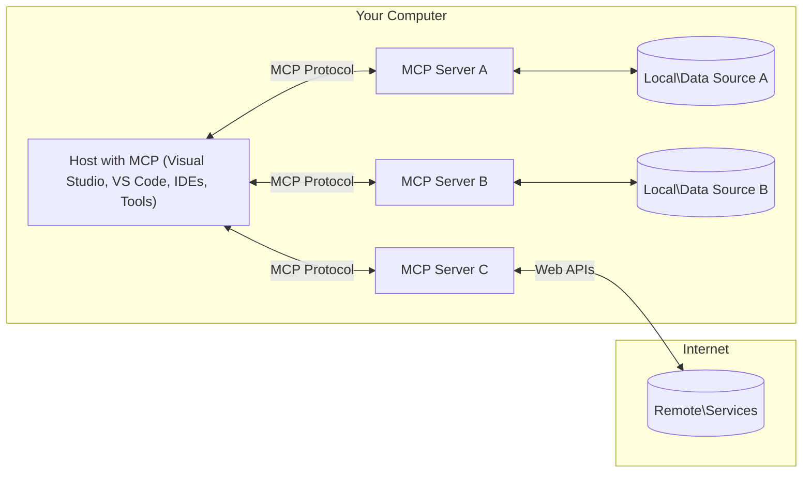

<!--
CO_OP_TRANSLATOR_METADATA:
{
  "original_hash": "0a6a7bcb289c024a91289e0444cb370b",
  "translation_date": "2025-08-18T14:28:56+00:00",
  "source_file": "01-CoreConcepts/README.md",
  "language_code": "mo"
}
-->
# MCP 核心概念：掌握 AI 整合的模型上下文協議

[](https://youtu.be/earDzWGtE84)

_（點擊上方圖片觀看本課程影片）_

[模型上下文協議 (MCP)](https://gi- **用戶明確同意**：所有數據訪問和操作都需要用戶明確批准後才能執行。用戶必須清楚了解將訪問哪些數據以及將執行哪些操作，並能對權限和授權進行細緻控制。

- **數據隱私保護**：用戶數據僅在獲得明確同意後才會暴露，並且在整個交互過程中必須受到嚴格的訪問控制保護。實現過程中必須防止未經授權的數據傳輸，並保持嚴格的隱私邊界。

- **工具執行安全性**：每次工具調用都需要用戶明確同意，並清楚了解工具的功能、參數及可能的影響。必須設置強大的安全邊界以防止意外、不安全或惡意的工具執行。

- **傳輸層安全性**：所有通信通道應使用適當的加密和身份驗證機制。遠程連接應實現安全的傳輸協議並妥善管理憑據。

#### 實施指南：

- **權限管理**：實現細粒度的權限系統，允許用戶控制哪些服務器、工具和資源可被訪問
- **身份驗證與授權**：使用安全的身份驗證方法（如 OAuth、API 金鑰），並妥善管理令牌和設置過期時間  
- **輸入驗證**：根據定義的模式驗證所有參數和數據輸入，以防止注入攻擊
- **審計日誌**：維護全面的操作日誌以進行安全監控和合規性檢查

[模型上下文協議 (MCP)](https://modelcontextprotocol.io/specification/2025-06-18/) 是一個強大且標準化的框架，旨在優化大型語言模型（LLMs）與外部工具、應用程序和數據源之間的通信。本指南將帶您深入了解 MCP 的核心概念，確保您掌握其客戶端-服務器架構、基本組件、通信機制以及最佳實踐。

## 概述

本課程將探討構成模型上下文協議 (MCP) 生態系統的基本架構和組件。您將學習 MCP 的客戶端-服務器架構、關鍵組件以及驅動 MCP 交互的通信機制。

## 核心學習目標

完成本課程後，您將能夠：

- 理解 MCP 的客戶端-服務器架構。
- 確定 Hosts、Clients 和 Servers 的角色與職責。
- 分析使 MCP 成為靈活整合層的核心特性。
- 學習 MCP 生態系統中的信息流動方式。
- 通過 .NET、Java、Python 和 JavaScript 的代碼示例獲得實用見解。

## MCP 架構：深入解析

MCP 生態系統基於客戶端-服務器模型構建。這種模塊化結構使 AI 應用程序能夠高效地與工具、數據庫、API 和上下文資源交互。讓我們將這一架構分解為其核心組件。

MCP 的核心是遵循客戶端-服務器架構，其中主機應用程序可以連接到多個服務器：



- **MCP Hosts**：如 VSCode、Claude Desktop、IDE 或希望通過 MCP 訪問數據的 AI 工具
- **MCP Clients**：維持與服務器 1:1 連接的協議客戶端
- **MCP Servers**：通過標準化的模型上下文協議暴露特定功能的輕量級程序
- **本地數據源**：MCP 服務器可安全訪問的計算機文件、數據庫和服務
- **遠程服務**：MCP 服務器可通過 API 連接的互聯網外部系統

MCP 協議是一個使用基於日期的版本控制（YYYY-MM-DD 格式）的不斷演進的標準。目前的協議版本是 **2025-06-18**。您可以查看 [協議規範的最新更新](https://modelcontextprotocol.io/specification/2025-06-18/)

### 1. Hosts

在模型上下文協議 (MCP) 中，**Hosts** 是作為用戶與協議交互主要界面的 AI 應用程序。Hosts 通過為每個服務器連接創建專用的 MCP 客戶端來協調和管理與多個 MCP 服務器的連接。Hosts 的示例包括：

- **AI 應用程序**：Claude Desktop、Visual Studio Code、Claude Code
- **開發環境**：集成 MCP 的 IDE 和代碼編輯器  
- **自定義應用程序**：專門構建的 AI 代理和工具

**Hosts** 是協調 AI 模型交互的應用程序。它們：

- **協調 AI 模型**：執行或與 LLM 交互以生成響應並協調 AI 工作流
- **管理客戶端連接**：為每個 MCP 服務器連接創建並維護一個 MCP 客戶端
- **控制用戶界面**：處理對話流程、用戶交互和響應展示  
- **執行安全性**：控制權限、安全約束和身份驗證
- **處理用戶同意**：管理用戶對數據共享和工具執行的批准

### 2. Clients

**Clients** 是維持 Hosts 與 MCP 服務器之間專用一對一連接的關鍵組件。每個 MCP 客戶端由 Host 實例化以連接到特定的 MCP 服務器，確保通信通道的有序和安全。多個客戶端使 Hosts 能夠同時連接到多個服務器。

**Clients** 是主機應用程序內的連接器組件。它們：

- **協議通信**：使用 JSON-RPC 2.0 向服務器發送帶有提示和指令的請求
- **功能協商**：在初始化期間與服務器協商支持的功能和協議版本
- **工具執行**：管理來自模型的工具執行請求並處理響應
- **實時更新**：處理來自服務器的通知和實時更新
- **響應處理**：處理並格式化服務器響應以展示給用戶

### 3. Servers

**Servers** 是為 MCP 客戶端提供上下文、工具和功能的程序。它們可以在本地（與 Host 位於同一台機器上）或遠程（在外部平台上）執行，負責處理客戶端請求並提供結構化響應。Servers 通過標準化的模型上下文協議暴露特定功能。

**Servers** 是提供上下文和功能的服務。它們：

- **功能註冊**：註冊並向客戶端暴露可用的基本功能（資源、提示、工具）
- **請求處理**：接收並執行來自客戶端的工具調用、資源請求和提示請求
- **上下文提供**：提供上下文信息和數據以增強模型響應
- **狀態管理**：在需要時維護會話狀態並處理有狀態交互
- **實時通知**：向連接的客戶端發送有關功能變更和更新的通知

Servers 可以由任何人開發，用於通過專門的功能擴展模型能力，並支持本地和遠程部署場景。

### 4. Server Primitives

MCP 中的 Servers 提供三個核心 **基本功能（primitives）**，這些功能定義了客戶端、Hosts 和語言模型之間豐富交互的基本構建塊。這些基本功能指定了協議中可用的上下文信息和操作類型。

MCP Servers 可以暴露以下三種核心基本功能的任意組合：

#### 資源 (Resources)

**資源** 是為 AI 應用程序提供上下文信息的數據源。它們代表靜態或動態內容，可增強模型的理解和決策能力：

- **上下文數據**：為 AI 模型消費的結構化信息和上下文
- **知識庫**：文檔庫、文章、手冊和研究論文
- **本地數據源**：文件、數據庫和本地系統信息  
- **外部數據**：API 響應、網絡服務和遠程系統數據
- **動態內容**：根據外部條件更新的實時數據

資源通過 URI 標識，並支持通過 `resources/list` 發現和通過 `resources/read` 檢索：

```text
file://documents/project-spec.md
database://production/users/schema
api://weather/current
```

#### 提示 (Prompts)

**提示** 是幫助結構化與語言模型交互的可重用模板。它們提供標準化的交互模式和模板化工作流：

- **基於模板的交互**：預結構化的消息和對話開場白
- **工作流模板**：常見任務和交互的標準化序列
- **少樣本示例**：基於示例的模型指令模板
- **系統提示**：定義模型行為和上下文的基礎提示
- **動態模板**：適應特定上下文的參數化提示

提示支持變量替換，並可通過 `prompts/list` 發現，通過 `prompts/get` 檢索：

```markdown
Generate a {{task_type}} for {{product}} targeting {{audience}} with the following requirements: {{requirements}}
```

#### 工具 (Tools)

**工具** 是 AI 模型可以調用以執行特定操作的可執行功能。它們代表 MCP 生態系統的“動詞”，使模型能夠與外部系統交互：

- **可執行功能**：模型可以使用特定參數調用的離散操作
- **外部系統集成**：API 調用、數據庫查詢、文件操作、計算
- **唯一標識**：每個工具都有一個獨特的名稱、描述和參數模式
- **結構化輸入/輸出**：工具接受經驗證的參數並返回結構化、類型化的響應
- **操作能力**：使模型能夠執行現實世界的操作並檢索實時數據

工具使用 JSON Schema 定義參數驗證，並可通過 `tools/list` 發現，通過 `tools/call` 執行：

```typescript
server.tool(
  "search_products", 
  {
    query: z.string().describe("Search query for products"),
    category: z.string().optional().describe("Product category filter"),
    max_results: z.number().default(10).describe("Maximum results to return")
  }, 
  async (params) => {
    // Execute search and return structured results
    return await productService.search(params);
  }
);
```

## 客戶端基本功能

在模型上下文協議 (MCP) 中，**客戶端** 可以暴露基本功能，使服務器能夠向主機應用程序請求額外的功能。這些客戶端基本功能允許服務器實現更豐富、更具交互性的功能，並能訪問 AI 模型能力和用戶交互。

### 取樣 (Sampling)

**取樣** 允許服務器向客戶端的 AI 應用程序請求語言模型補全。這一基本功能使服務器能夠訪問 LLM 功能，而無需嵌入自己的模型依賴：

- **模型無關訪問**：服務器可以請求補全，而無需包含 LLM SDK 或管理模型訪問
- **服務器發起的 AI**：使服務器能夠自主生成內容，使用客戶端的 AI 模型
- **遞歸 LLM 交互**：支持服務器需要 AI 協助進行處理的複雜場景
- **動態內容生成**：允許服務器使用主機的模型創建上下文響應

取樣通過 `sampling/complete` 方法發起，服務器向客戶端發送補全請求。

### 問詢 (Elicitation)

**問詢** 使服務器能夠通過客戶端界面向用戶請求額外信息或確認：

- **用戶輸入請求**：服務器在執行工具時需要時可以請求額外信息
- **確認對話框**：請求用戶批准敏感或影響重大的操作
- **交互式工作流**：使服務器能夠創建逐步的用戶交互
- **動態參數收集**：在工具執行期間收集缺失或可選參數

問詢請求通過 `elicitation/request` 方法發送，用於通過客戶端界面收集用戶輸入。

### 日誌記錄 (Logging)

**日誌記錄** 允許服務器向客戶端發送結構化日誌消息，用於調試、監控和操作可見性：

- **調試支持**：使服務器能夠提供詳細的執行日誌以進行故障排除
- **操作監控**：向客戶端發送狀態更新和性能指標
- **錯誤報告**：提供詳細的錯誤上下文和診斷信息
- **審計跟蹤**：創建服務器操作和決策的全面日誌

日誌消息發送到客戶端，以提供服務器操作的透明性並促進調試。

## MCP 中的信息流

模型上下文協議 (MCP) 定義了 Hosts、Clients、Servers 和模型之間結構化的信息流。理解這一流程有助於澄清用戶請求如何處理，以及外部工具和數據如何整合到模型響應中。

- **主機啟動連接**  
  主機應用程序（如 IDE 或聊天界面）通過 STDIO、WebSocket 或其他支持的傳輸方式與 MCP 服務器建立連接。

- **功能協商**  
  嵌入在主機中的客戶端和服務器交換有關其支持的功能、工具、資源和協議版本的信息。這確保雙方了解會話中可用的功能。

- **用戶請求**  
  用戶與主機交互（例如輸入提示或命令）。主機收集此輸入並將其傳遞給客戶端進行處理。

- **資源或工具使用**  
  - 客戶端可能會向服務器請求額外的上下文或資源（如文件、數據庫條目或知識庫文章），以豐富模型的理解。
  - 如果模型確定需要工具（例如獲取數據、執行計算或調用 API），客戶端會向服務器發送工具調用請求，指定工具名稱和參數。

- **服務器執行**  
  服務器接收資源或工具請求，執行必要的操作（如運行功能、查詢數據庫或檢索文件），並以結構化格式將結果返回給客戶端。

- **響應生成**  
  客戶端將服務器的響應（資源數據、工具輸出等）整合到正在進行的模型交互中。模型使用這些信息生成全面且具有上下文相關性的響應。

- **結果展示**  
  主機從客戶端接收最終輸出並展示給用戶，通常包括模型生成的文本以及工具執行或資源查找的結果。

這一流程使 MCP 能夠通過無縫連接模型與外部工具和數據源，支持先進的、交互式的、具有上下文感知的 AI 應用程序。

## 協議架構與層次

MCP 包含兩個獨立的架構層，這兩層共同協作以提供完整的通信框架：

### 數據層

**數據層** 使用 **JSON-RPC 2.0** 作為基礎實現核心 MCP 協議。該層定義了消息結構、語義和交互模式：

#### 核心組件：

- **JSON-RPC 2.0 協議**：所有通信使用標準化的 JSON-RPC 2.0 消息格式進行方法調用、響應和通知
- **生命週期管理**：負責處理客戶端與伺服器之間的連線初始化、功能協商以及會話終止  
- **伺服器基元**：使伺服器能透過工具、資源和提示提供核心功能  
- **客戶端基元**：使伺服器能請求從大型語言模型（LLM）進行取樣、引導用戶輸入以及發送日誌訊息  
- **即時通知**：支援非同步通知，實現動態更新而無需輪詢  

#### 主要功能：

- **協議版本協商**：使用基於日期的版本控制（YYYY-MM-DD）以確保相容性  
- **功能發現**：客戶端與伺服器在初始化期間交換支援的功能資訊  
- **有狀態會話**：在多次互動中維持連線狀態，確保上下文連續性  

### 傳輸層

**傳輸層**負責管理MCP參與者之間的通訊管道、訊息框架以及身份驗證：

#### 支援的傳輸機制：

1. **STDIO 傳輸**：  
   - 使用標準輸入/輸出流進行直接的進程通訊  
   - 適合於同一台機器上的本地進程，無網路負擔  
   - 常用於本地MCP伺服器實現  

2. **可流式HTTP傳輸**：  
   - 使用HTTP POST進行客戶端到伺服器的訊息傳遞  
   - 可選的伺服器發送事件（SSE）用於伺服器到客戶端的流式傳輸  
   - 支援跨網路的遠端伺服器通訊  
   - 支援標準HTTP身份驗證（Bearer Token、API金鑰、自定義標頭）  
   - MCP建議使用OAuth進行安全的基於Token的身份驗證  

#### 傳輸抽象化：

傳輸層將通訊細節從資料層中抽象出來，確保所有傳輸機制均使用相同的JSON-RPC 2.0訊息格式。這種抽象化允許應用程式在本地與遠端伺服器之間無縫切換。

### 安全性考量

MCP實現必須遵循多項關鍵安全原則，以確保所有協議操作的安全性、可信性和可靠性：

- **用戶同意與控制**：在訪問任何資料或執行操作之前，必須獲得用戶的明確同意。用戶應能清楚地控制共享的資料以及授權的操作，並透過直觀的用戶介面審查和批准活動。  

- **資料隱私**：僅在獲得明確同意的情況下暴露用戶資料，並必須通過適當的訪問控制進行保護。MCP實現需防止未經授權的資料傳輸，並確保在所有互動中維持隱私。  

- **工具安全性**：在調用任何工具之前，需獲得用戶的明確同意。用戶應清楚了解每個工具的功能，並強制執行穩健的安全邊界，以防止意外或不安全的工具執行。  

透過遵循這些安全原則，MCP確保在提供強大AI整合的同時，維持用戶的信任、隱私和安全。

## 程式碼範例：關鍵組件

以下是幾個流行程式語言的程式碼範例，展示如何實現MCP伺服器的關鍵組件與工具。

### .NET 範例：建立簡單的MCP伺服器與工具

以下是一個實用的 .NET 程式碼範例，展示如何實現一個簡單的MCP伺服器，並定義和註冊工具、處理請求以及透過Model Context Protocol連接伺服器。

```csharp
using System;
using System.Threading.Tasks;
using ModelContextProtocol.Server;
using ModelContextProtocol.Server.Transport;
using ModelContextProtocol.Server.Tools;

public class WeatherServer
{
    public static async Task Main(string[] args)
    {
        // Create an MCP server
        var server = new McpServer(
            name: "Weather MCP Server",
            version: "1.0.0"
        );
        
        // Register our custom weather tool
        server.AddTool<string, WeatherData>("weatherTool", 
            description: "Gets current weather for a location",
            execute: async (location) => {
                // Call weather API (simplified)
                var weatherData = await GetWeatherDataAsync(location);
                return weatherData;
            });
        
        // Connect the server using stdio transport
        var transport = new StdioServerTransport();
        await server.ConnectAsync(transport);
        
        Console.WriteLine("Weather MCP Server started");
        
        // Keep the server running until process is terminated
        await Task.Delay(-1);
    }
    
    private static async Task<WeatherData> GetWeatherDataAsync(string location)
    {
        // This would normally call a weather API
        // Simplified for demonstration
        await Task.Delay(100); // Simulate API call
        return new WeatherData { 
            Temperature = 72.5,
            Conditions = "Sunny",
            Location = location
        };
    }
}

public class WeatherData
{
    public double Temperature { get; set; }
    public string Conditions { get; set; }
    public string Location { get; set; }
}
```

### Java 範例：MCP伺服器組件

此範例展示了與上述 .NET 範例相同的MCP伺服器與工具註冊，但使用Java實現。

```java
import io.modelcontextprotocol.server.McpServer;
import io.modelcontextprotocol.server.McpToolDefinition;
import io.modelcontextprotocol.server.transport.StdioServerTransport;
import io.modelcontextprotocol.server.tool.ToolExecutionContext;
import io.modelcontextprotocol.server.tool.ToolResponse;

public class WeatherMcpServer {
    public static void main(String[] args) throws Exception {
        // Create an MCP server
        McpServer server = McpServer.builder()
            .name("Weather MCP Server")
            .version("1.0.0")
            .build();
            
        // Register a weather tool
        server.registerTool(McpToolDefinition.builder("weatherTool")
            .description("Gets current weather for a location")
            .parameter("location", String.class)
            .execute((ToolExecutionContext ctx) -> {
                String location = ctx.getParameter("location", String.class);
                
                // Get weather data (simplified)
                WeatherData data = getWeatherData(location);
                
                // Return formatted response
                return ToolResponse.content(
                    String.format("Temperature: %.1f°F, Conditions: %s, Location: %s", 
                    data.getTemperature(), 
                    data.getConditions(), 
                    data.getLocation())
                );
            })
            .build());
        
        // Connect the server using stdio transport
        try (StdioServerTransport transport = new StdioServerTransport()) {
            server.connect(transport);
            System.out.println("Weather MCP Server started");
            // Keep server running until process is terminated
            Thread.currentThread().join();
        }
    }
    
    private static WeatherData getWeatherData(String location) {
        // Implementation would call a weather API
        // Simplified for example purposes
        return new WeatherData(72.5, "Sunny", location);
    }
}

class WeatherData {
    private double temperature;
    private String conditions;
    private String location;
    
    public WeatherData(double temperature, String conditions, String location) {
        this.temperature = temperature;
        this.conditions = conditions;
        this.location = location;
    }
    
    public double getTemperature() {
        return temperature;
    }
    
    public String getConditions() {
        return conditions;
    }
    
    public String getLocation() {
        return location;
    }
}
```

### Python 範例：構建MCP伺服器

此範例展示如何使用Python構建MCP伺服器，並展示兩種不同方式來創建工具。

```python
#!/usr/bin/env python3
import asyncio
from mcp.server.fastmcp import FastMCP
from mcp.server.transports.stdio import serve_stdio

# Create a FastMCP server
mcp = FastMCP(
    name="Weather MCP Server",
    version="1.0.0"
)

@mcp.tool()
def get_weather(location: str) -> dict:
    """Gets current weather for a location."""
    # This would normally call a weather API
    # Simplified for demonstration
    return {
        "temperature": 72.5,
        "conditions": "Sunny",
        "location": location
    }

# Alternative approach using a class
class WeatherTools:
    @mcp.tool()
    def forecast(self, location: str, days: int = 1) -> dict:
        """Gets weather forecast for a location for the specified number of days."""
        # This would normally call a weather API forecast endpoint
        # Simplified for demonstration
        return {
            "location": location,
            "forecast": [
                {"day": i+1, "temperature": 70 + i, "conditions": "Partly Cloudy"}
                for i in range(days)
            ]
        }

# Instantiate the class to register its tools
weather_tools = WeatherTools()

# Start the server using stdio transport
if __name__ == "__main__":
    asyncio.run(serve_stdio(mcp))
```

### JavaScript 範例：建立MCP伺服器

此範例展示如何使用JavaScript建立MCP伺服器，並註冊兩個與天氣相關的工具。

```javascript
// Using the official Model Context Protocol SDK
import { McpServer } from "@modelcontextprotocol/sdk/server/mcp.js";
import { StdioServerTransport } from "@modelcontextprotocol/sdk/server/stdio.js";
import { z } from "zod"; // For parameter validation

// Create an MCP server
const server = new McpServer({
  name: "Weather MCP Server",
  version: "1.0.0"
});

// Define a weather tool
server.tool(
  "weatherTool",
  {
    location: z.string().describe("The location to get weather for")
  },
  async ({ location }) => {
    // This would normally call a weather API
    // Simplified for demonstration
    const weatherData = await getWeatherData(location);
    
    return {
      content: [
        { 
          type: "text", 
          text: `Temperature: ${weatherData.temperature}°F, Conditions: ${weatherData.conditions}, Location: ${weatherData.location}` 
        }
      ]
    };
  }
);

// Define a forecast tool
server.tool(
  "forecastTool",
  {
    location: z.string(),
    days: z.number().default(3).describe("Number of days for forecast")
  },
  async ({ location, days }) => {
    // This would normally call a weather API
    // Simplified for demonstration
    const forecast = await getForecastData(location, days);
    
    return {
      content: [
        { 
          type: "text", 
          text: `${days}-day forecast for ${location}: ${JSON.stringify(forecast)}` 
        }
      ]
    };
  }
);

// Helper functions
async function getWeatherData(location) {
  // Simulate API call
  return {
    temperature: 72.5,
    conditions: "Sunny",
    location: location
  };
}

async function getForecastData(location, days) {
  // Simulate API call
  return Array.from({ length: days }, (_, i) => ({
    day: i + 1,
    temperature: 70 + Math.floor(Math.random() * 10),
    conditions: i % 2 === 0 ? "Sunny" : "Partly Cloudy"
  }));
}

// Connect the server using stdio transport
const transport = new StdioServerTransport();
server.connect(transport).catch(console.error);

console.log("Weather MCP Server started");
```

此JavaScript範例展示如何創建一個MCP客戶端，連接到伺服器、發送提示，並處理包括工具調用在內的回應。

## 安全性與授權

MCP包含多種內建概念與機制，用於管理協議中的安全性與授權：

1. **工具權限控制**：  
   客戶端可以指定模型在會話期間允許使用的工具。這確保只有明確授權的工具可用，降低意外或不安全操作的風險。權限可根據用戶偏好、組織政策或互動上下文動態配置。  

2. **身份驗證**：  
   伺服器可要求在授予工具、資源或敏感操作的訪問權限之前進行身份驗證。這可能涉及API金鑰、OAuth Token或其他身份驗證方案。適當的身份驗證確保只有受信任的客戶端與用戶能調用伺服器端功能。  

3. **驗證**：  
   所有工具調用均需執行參數驗證。每個工具定義其參數的預期類型、格式和約束，伺服器會相應地驗證傳入請求。這可防止格式錯誤或惡意輸入到達工具實現，並有助於維持操作的完整性。  

4. **速率限制**：  
   為防止濫用並確保伺服器資源的公平使用，MCP伺服器可對工具調用與資源訪問實施速率限制。速率限制可按用戶、會話或全域應用，有助於防範拒絕服務攻擊或過度資源消耗。  

透過結合這些機制，MCP為將語言模型與外部工具和資料源整合提供了安全的基礎，同時賦予用戶與開發者對訪問與使用的細緻控制。

## 協議訊息與通訊流程

MCP通訊使用結構化的**JSON-RPC 2.0**訊息，促進主機、客戶端與伺服器之間清晰且可靠的互動。協議為不同類型的操作定義了特定的訊息模式：

### 核心訊息類型：

#### **初始化訊息**
- **`initialize` 請求**：建立連線並協商協議版本與功能  
- **`initialize` 回應**：確認支援的功能與伺服器資訊  
- **`notifications/initialized`**：表示初始化完成，會話已準備就緒  

#### **發現訊息**
- **`tools/list` 請求**：發現伺服器可用的工具  
- **`resources/list` 請求**：列出可用的資源（資料來源）  
- **`prompts/list` 請求**：檢索可用的提示模板  

#### **執行訊息**  
- **`tools/call` 請求**：執行具有提供參數的特定工具  
- **`resources/read` 請求**：檢索特定資源的內容  
- **`prompts/get` 請求**：獲取帶有可選參數的提示模板  

#### **客戶端訊息**
- **`sampling/complete` 請求**：伺服器請求客戶端進行LLM補全  
- **`elicitation/request`**：伺服器請求透過客戶端介面獲取用戶輸入  
- **日誌訊息**：伺服器向客戶端發送結構化日誌訊息  

#### **通知訊息**
- **`notifications/tools/list_changed`**：伺服器通知客戶端工具變更  
- **`notifications/resources/list_changed`**：伺服器通知客戶端資源變更  
- **`notifications/prompts/list_changed`**：伺服器通知客戶端提示變更  

### 訊息結構：

所有MCP訊息均遵循JSON-RPC 2.0格式，包括：  
- **請求訊息**：包含 `id`、`method` 和可選的 `params`  
- **回應訊息**：包含 `id` 和 `result` 或 `error`  
- **通知訊息**：包含 `method` 和可選的 `params`（無 `id` 或回應）  

這種結構化通訊確保了可靠、可追蹤且可擴展的互動，支援即時更新、工具鏈接以及穩健的錯誤處理。

## 關鍵要點

- **架構**：MCP採用客戶端-伺服器架構，主機管理多個客戶端與伺服器的連線  
- **參與者**：生態系統包括主機（AI應用程式）、客戶端（協議連接器）與伺服器（功能提供者）  
- **傳輸機制**：通訊支援STDIO（本地）與可流式HTTP（遠端，含可選SSE）  
- **核心基元**：伺服器暴露工具（可執行函數）、資源（資料來源）與提示（模板）  
- **客戶端基元**：伺服器可請求取樣（LLM補全）、引導（用戶輸入）與日誌記錄  
- **協議基礎**：基於JSON-RPC 2.0，使用日期版本控制（當前版本：2025-06-18）  
- **即時功能**：支援通知以實現動態更新與即時同步  
- **安全至上**：明確的用戶同意、資料隱私保護與安全傳輸是核心要求  

## 練習

設計一個在您的領域中有用的簡單MCP工具，定義：  
1. 工具的名稱  
2. 接受的參數  
3. 返回的輸出  
4. 模型如何使用此工具解決用戶問題  

---

## 下一步

下一章：[第2章：安全性](../02-Security/README.md)  

**免責聲明**：  
本文件使用 AI 翻譯服務 [Co-op Translator](https://github.com/Azure/co-op-translator) 進行翻譯。我們致力於提供準確的翻譯，但請注意，自動翻譯可能包含錯誤或不準確之處。應以原始語言的文件作為權威來源。對於關鍵資訊，建議尋求專業人工翻譯。我們對因使用此翻譯而引起的任何誤解或錯誤解讀概不負責。