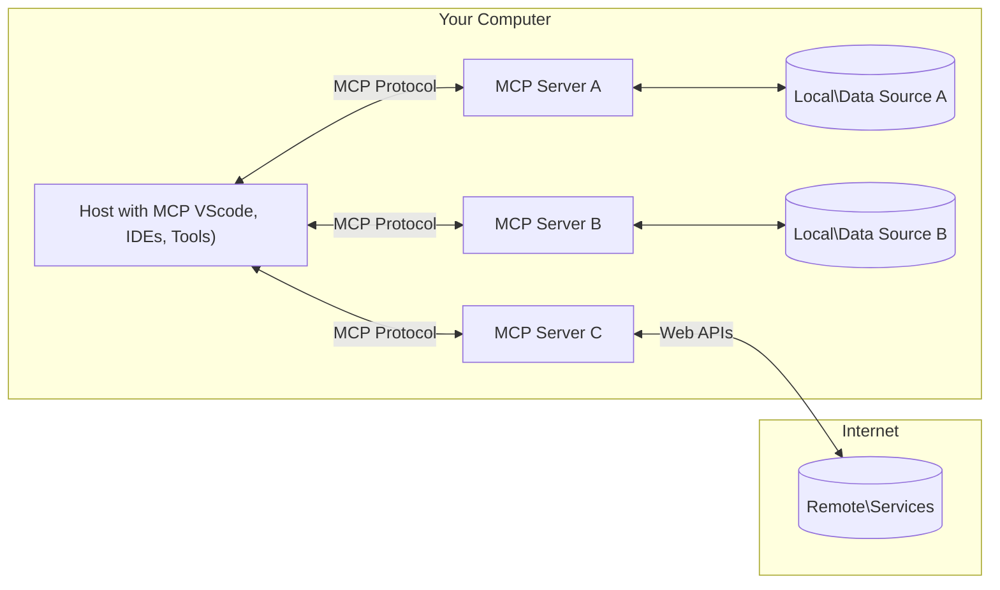

<!--
CO_OP_TRANSLATOR_METADATA:
{
  "original_hash": "b3b4a6ad10c3c0edbf7fa7cfa0ec496b",
  "translation_date": "2025-07-02T06:58:47+00:00",
  "source_file": "01-CoreConcepts/README.md",
  "language_code": "mo"
}
-->
# 📖 MCP 核心概念：掌握用於 AI 整合的模型上下文協議

[Model Context Protocol (MCP)](https://github.com/modelcontextprotocol) 是一個強大且標準化的框架，優化大型語言模型（LLM）與外部工具、應用程式及資料來源之間的溝通。這份經過 SEO 優化的指南將帶你深入了解 MCP 的核心概念，確保你掌握其客戶端-伺服器架構、重要組件、通信機制以及實作最佳實踐。

## 概述

本課程將探討構成模型上下文協議（MCP）生態系統的基本架構與組件。你將學習 MCP 的客戶端-伺服器架構、關鍵組件及推動 MCP 互動的通信機制。

## 👩‍🎓 主要學習目標

完成本課程後，你將能夠：

- 理解 MCP 的客戶端-伺服器架構。
- 辨識 Hosts、Clients 與 Servers 的角色與職責。
- 分析 MCP 作為靈活整合層的核心特性。
- 了解 MCP 生態系統中的資訊流動方式。
- 透過 .NET、Java、Python 和 JavaScript 的程式碼範例獲得實務見解。

## 🔎 MCP 架構：深入解析

MCP 生態系統基於客戶端-伺服器模型構建。這種模組化結構讓 AI 應用程式能有效與工具、資料庫、API 及上下文資源互動。讓我們將此架構拆解為核心組件。

MCP 核心遵循客戶端-伺服器架構，Host 應用程式可連接多個伺服器：



- **MCP Hosts**：像 VSCode、Claude Desktop、整合開發環境（IDE）或想透過 MCP 存取資料的 AI 工具等程式
- **MCP Clients**：與伺服器維持一對一連線的協議客戶端
- **MCP Servers**：透過標準化模型上下文協議暴露特定功能的輕量級程式
- **本地資料來源**：MCP 伺服器可安全存取的電腦檔案、資料庫與服務
- **遠端服務**：MCP 伺服器能透過 API 連接的網路上外部系統

MCP 協議是一項持續演進的標準，你可在[協議規範](https://modelcontextprotocol.io/specification/2025-06-18/)查看最新更新。

### 1. Hosts

在模型上下文協議（MCP）中，Hosts 扮演主要介面角色，讓使用者透過它與協議互動。Hosts 是啟動與 MCP 伺服器連線以存取資料、工具與提示的應用程式或環境。Hosts 範例包括整合開發環境（IDE）如 Visual Studio Code、AI 工具如 Claude Desktop，或為特定任務設計的自訂代理程式。

**Hosts** 是啟動連線的 LLM 應用程式，它們會：

- 執行或與 AI 模型互動以生成回應。
- 啟動與 MCP 伺服器的連線。
- 管理對話流程與使用者介面。
- 控制權限與安全限制。
- 處理使用者對資料分享與工具執行的同意。

### 2. Clients

Clients 是促進 Hosts 與 MCP 伺服器互動的重要組件。Clients 作為中介，讓 Hosts 能存取並利用 MCP 伺服器提供的功能。它們在確保 MCP 架構內溝通順暢與資料交換效率方面扮演關鍵角色。

**Clients** 是 Host 應用程式中的連接器，它們會：

- 向伺服器發送包含提示或指令的請求。
- 與伺服器協商功能。
- 管理模型發出的工具執行請求。
- 處理並向使用者展示回應。

### 3. Servers

Servers 負責處理 MCP clients 的請求並提供適當回應。它們管理資料擷取、工具執行及提示生成等多種操作。Servers 確保 Clients 與 Hosts 之間的溝通高效且可靠，維護互動過程的完整性。

**Servers** 是提供上下文與功能的服務，它們會：

- 註冊可用功能（資源、提示、工具）
- 接收並執行來自 Client 的工具調用
- 提供上下文資訊以強化模型回應
- 將輸出返回給 Client
- 必要時維持多次互動間的狀態

任何人都可以開發 Servers，藉此擴展模型功能並加入專門化功能。

### 4. Server Features

模型上下文協議（MCP）中的 Servers 提供基本構件，促進 Clients、Hosts 與語言模型間的豐富互動。這些功能旨在透過結構化的上下文、工具與提示，提升 MCP 的能力。

MCP 伺服器可提供以下任一功能：

#### 📑 資源

MCP 中的資源涵蓋各種可被使用者或 AI 模型利用的上下文與資料，包括：

- **上下文資料**：使用者或 AI 模型可用於決策與任務執行的資訊與背景。
- **知識庫與文件庫**：包含文章、手冊、研究報告等結構化與非結構化資料的集合，提供寶貴見解。
- **本地檔案與資料庫**：存放於裝置或資料庫中、可供處理與分析的資料。
- **API 與網路服務**：提供額外資料與功能的外部介面，支援與各種線上資源及工具整合。

資源範例可為資料庫結構或可透過以下方式存取的檔案：

```text
file://log.txt
database://schema
```

### 🤖 提示
MCP 中的提示包含各種預先定義的範本與互動模式，旨在簡化使用者工作流程並增進溝通，包括：

- **範本訊息與工作流程**：預先結構化的訊息與流程，引導使用者完成特定任務與互動。
- **預設互動模式**：標準化的動作與回應序列，促進一致且高效的溝通。
- **專門化對話範本**：針對特定對話類型客製化的範本，確保相關且符合上下文的互動。

提示範本示例如下：

```markdown
Generate a product slogan based on the following {{product}} with the following {{keywords}}
```

#### ⛏️ 工具

MCP 中的工具是 AI 模型可執行以完成特定任務的功能。這些工具旨在透過提供結構化且可靠的操作，增強 AI 模型的能力。主要特點包括：

- **AI 模型可執行的函式**：工具是可被 AI 模型調用以執行各種任務的函式。
- **獨特名稱與描述**：每個工具都有明確名稱及詳細說明其目的與功能。
- **參數與輸出**：工具接受特定參數並回傳結構化輸出，確保結果一致且可預測。
- **離散功能**：工具執行獨立功能，如網路搜尋、計算與資料庫查詢。

工具範例如下：

```typescript
server.tool(
  "GetProducts",
  {
    pageSize: z.string().optional(),
    pageCount: z.string().optional()
  }, () => {
    // return results from API
  }
)
```

## Client 功能
在 MCP 中，Clients 向 Servers 提供多項關鍵功能，提升協議整體互動與功能性。其中一項重要功能是抽樣（Sampling）。

### 👉 抽樣（Sampling）

- **伺服器主導的代理行為**：Clients 允許伺服器自主啟動特定行動或行為，增強系統的動態能力。
- **遞迴式 LLM 互動**：此功能支援與大型語言模型（LLM）的遞迴互動，使任務處理更複雜且反覆。
- **請求額外模型完成**：伺服器可向模型請求額外完成，確保回應完整且符合上下文。

## MCP 中的資訊流

模型上下文協議（MCP）定義了 Hosts、Clients、Servers 與模型間的結構化資訊流。理解此流程有助釐清使用者請求如何被處理，以及外部工具與資料如何整合進模型回應。

- **Host 啟動連線**  
  Host 應用程式（如 IDE 或聊天介面）透過 STDIO、WebSocket 或其他支援的傳輸方式與 MCP 伺服器建立連線。

- **功能協商**  
  Client（內嵌於 Host）與 Server 交換關於支援的功能、工具、資源及協議版本的資訊，確保雙方了解本次會話可用功能。

- **使用者請求**  
  使用者與 Host 互動（例如輸入提示或指令）。Host 收集輸入並傳給 Client 處理。

- **資源或工具使用**  
  - Client 可能向 Server 請求額外上下文或資源（如檔案、資料庫條目或知識庫文章）以豐富模型理解。
  - 若模型判定需要工具（例如擷取資料、執行計算或呼叫 API），Client 將發送工具調用請求給 Server，指定工具名稱與參數。

- **伺服器執行**  
  Server 收到資源或工具請求後，執行必要操作（如執行函式、查詢資料庫或擷取檔案），並以結構化格式將結果返回 Client。

- **回應生成**  
  Client 將 Server 回應（資源資料、工具輸出等）整合進持續的模型互動中。模型利用這些資訊產生完整且符合上下文的回應。

- **結果呈現**  
  Host 從 Client 收到最終輸出並呈現給使用者，通常包含模型生成的文字及任何工具執行或資源查詢的結果。

此流程讓 MCP 能無縫連接模型與外部工具及資料來源，支援進階、互動且具上下文感知的 AI 應用。

## 協議細節

MCP（模型上下文協議）建立於[JSON-RPC 2.0](https://www.jsonrpc.org/)之上，提供標準化、語言無關的訊息格式，促進 Hosts、Clients 與 Servers 間的溝通。此基礎確保跨多平台與程式語言的可靠、結構化且可擴充的互動。

### 主要協議功能

MCP 擴充 JSON-RPC 2.0，加入工具調用、資源存取與提示管理的額外約定。支援多種傳輸層（STDIO、WebSocket、SSE），並實現元件間安全、可擴充且語言無關的通信。

#### 🧢 基本協議

- **JSON-RPC 訊息格式**：所有請求與回應皆遵循 JSON-RPC 2.0 規範，確保方法呼叫、參數、結果與錯誤處理結構一致。
- **有狀態連線**：MCP 會話可跨多次請求維持狀態，支援持續對話、上下文累積與資源管理。
- **功能協商**：連線建立時，Clients 與 Servers 交換支援功能、協議版本、可用工具與資源資訊，確保雙方了解彼此能力並能適當調整。

#### ➕ 額外工具

以下為 MCP 提供的部分額外工具與協議擴充，提升開發者體驗並支援進階場景：

- **設定選項**：MCP 允許動態設定會話參數，如工具權限、資源存取與模型設定，依互動需求調整。
- **進度追蹤**：長時間執行操作可回報進度更新，提升使用者介面回應性與使用體驗。
- **請求取消**：Clients 可取消進行中的請求，讓使用者中斷不再需要或執行過久的操作。
- **錯誤回報**：標準化錯誤訊息與代碼協助診斷問題、優雅處理失敗，並提供使用者與開發者可行的反饋。
- **日誌紀錄**：Clients 與 Servers 均可產生結構化日誌，用於審計、除錯與監控協議互動。

藉由這些協議功能，MCP 確保語言模型與外部工具或資料來源間的通信穩健、安全且靈活。

### 🔐 安全考量

MCP 實作應遵守多項關鍵安全原則，確保互動安全可信：

- **使用者同意與控制**：使用者必須明確同意後，資料才能被存取或操作執行。應提供直覺介面，讓使用者清楚掌控資料分享範圍及授權行為。
- **資料隱私**：使用者資料僅在明確同意下曝光，且必須透過適當存取控制保護。MCP 實作需防止未授權資料傳輸，並確保隱私在整個互動過程中維持。
- **工具安全**：調用任何工具前，需取得使用者明確同意。使用者應充分了解每個工具的功能，並強制執行嚴格安全界限，避免非預期或不安全的工具執行。

遵循這些原則，MCP 確保使用者信任、隱私與安全在所有協議互動中獲得維護。

## 程式碼範例：關鍵組件

以下為多種熱門程式語言的程式碼範例，展示如何實作 MCP 伺服器關鍵組件與工具。

### .NET 範例：建立簡單的 MCP 伺服器與工具

此實用 .NET 範例展示如何實作簡單 MCP 伺服器並註冊自訂工具。範例涵蓋工具定義、註冊、請求處理及透過模型上下文協議連接伺服器。

```csharp
using System;
using System.Threading.Tasks;
using ModelContextProtocol.Server;
using ModelContextProtocol.Server.Transport;
using ModelContextProtocol.Server.Tools;

public class WeatherServer
{
    public static async Task Main(string[] args)
    {
        // Create an MCP server
        var server = new McpServer(
            name: "Weather MCP Server",
            version: "1.0.0"
        );
        
        // Register our custom weather tool
        server.AddTool<string, WeatherData>("weatherTool", 
            description: "Gets current weather for a location",
            execute: async (location) => {
                // Call weather API (simplified)
                var weatherData = await GetWeatherDataAsync(location);
                return weatherData;
            });
        
        // Connect the server using stdio transport
        var transport = new StdioServerTransport();
        await server.ConnectAsync(transport);
        
        Console.WriteLine("Weather MCP Server started");
        
        // Keep the server running until process is terminated
        await Task.Delay(-1);
    }
    
    private static async Task<WeatherData> GetWeatherDataAsync(string location)
    {
        // This would normally call a weather API
        // Simplified for demonstration
        await Task.Delay(100); // Simulate API call
        return new WeatherData { 
            Temperature = 72.5,
            Conditions = "Sunny",
            Location = location
        };
    }
}

public class WeatherData
{
    public double Temperature { get; set; }
    public string Conditions { get; set; }
    public string Location { get; set; }
}
```

### Java 範例：MCP 伺服器組件

本範例展示與上述 .NET 範例相同的 MCP 伺服器與工具註冊，但以 Java 實作。

```java
import io.modelcontextprotocol.server.McpServer;
import io.modelcontextprotocol.server.McpToolDefinition;
import io.modelcontextprotocol.server.transport.StdioServerTransport;
import io.modelcontextprotocol.server.tool.ToolExecutionContext;
import io.modelcontextprotocol.server.tool.ToolResponse;

public class WeatherMcpServer {
    public static void main(String[] args) throws Exception {
        // Create an MCP server
        McpServer server = McpServer.builder()
            .name("Weather MCP Server")
            .version("1.0.0")
            .build();
            
        // Register a weather tool
        server.registerTool(McpToolDefinition.builder("weatherTool")
            .description("Gets current weather for a location")
            .parameter("location", String.class)
            .execute((ToolExecutionContext ctx) -> {
                String location = ctx.getParameter("location", String.class);
                
                // Get weather data (simplified)
                WeatherData data = getWeatherData(location);
                
                // Return formatted response
                return ToolResponse.content(
                    String.format("Temperature: %.1f°F, Conditions: %s, Location: %s", 
                    data.getTemperature(), 
                    data.getConditions(), 
                    data.getLocation())
                );
            })
            .build());
        
        // Connect the server using stdio transport
        try (StdioServerTransport transport = new StdioServerTransport()) {
            server.connect(transport);
            System.out.println("Weather MCP Server started");
            // Keep server running until process is terminated
            Thread.currentThread().join();
        }
    }
    
    private static WeatherData getWeatherData(String location) {
        // Implementation would call a weather API
        // Simplified for example purposes
        return new WeatherData(72.5, "Sunny", location);
    }
}

class WeatherData {
    private double temperature;
    private String conditions;
    private String location;
    
    public WeatherData(double temperature, String conditions, String location) {
        this.temperature = temperature;
        this.conditions = conditions;
        this.location = location;
    }
    
    public double getTemperature() {
        return temperature;
    }
    
    public String getConditions() {
        return conditions;
    }
    
    public String getLocation() {
        return location;
    }
}
```

### Python 範例：建立 MCP 伺服器

本範例示範如何用 Python 建立 MCP 伺服器，並展示兩種不同方式創建工具。

```python
#!/usr/bin/env python3
import asyncio
from mcp.server.fastmcp import FastMCP
from mcp.server.transports.stdio import serve_stdio

# Create a FastMCP server
mcp = FastMCP(
    name="Weather MCP Server",
    version="1.0.0"
)

@mcp.tool()
def get_weather(location: str) -> dict:
    """Gets current weather for a location."""
    # This would normally call a weather API
    # Simplified for demonstration
    return {
        "temperature": 72.5,
        "conditions": "Sunny",
        "location": location
    }

# Alternative approach using a class
class WeatherTools:
    @mcp.tool()
    def forecast(self, location: str, days: int = 1) -> dict:
        """Gets weather forecast for a location for the specified number of days."""
        # This would normally call a weather API forecast endpoint
        # Simplified for demonstration
        return {
            "location": location,
            "forecast": [
                {"day": i+1, "temperature": 70 + i, "conditions": "Partly Cloudy"}
                for i in range(days)
            ]
        }

# Instantiate the class to register its tools
weather_tools = WeatherTools()

# Start the server using stdio transport
if __name__ == "__main__":
    asyncio.run(serve_stdio(mcp))
```

### JavaScript 範例：建立 MCP 伺服器

此範例展示如何用 JavaScript 建立 MCP 伺服器，並註冊兩個與天氣相關的工具。

```javascript
// Using the official Model Context Protocol SDK
import { McpServer } from "@modelcontextprotocol/sdk/server/mcp.js";
import { StdioServerTransport } from "@modelcontextprotocol/sdk/server/stdio.js";
import { z } from "zod"; // For parameter validation

// Create an MCP server
const server = new McpServer({
  name: "Weather MCP Server",
  version: "1.0.0"
});

// Define a weather tool
server.tool(
  "weatherTool",
  {
    location: z.string().describe("The location to get weather for")
  },
  async ({ location }) => {
    // This would normally call a weather API
    // Simplified for demonstration
    const weatherData = await getWeatherData(location);
    
    return {
      content: [
        { 
          type: "text", 
          text: `Temperature: ${weatherData.temperature}°F, Conditions: ${weatherData.conditions}, Location: ${weatherData.location}` 
        }
      ]
    };
  }
);

// Define a forecast tool
server.tool(
  "forecastTool",
  {
    location: z.string(),
    days: z.number().default(3).describe("Number of days for forecast")
  },
  async ({ location, days }) => {
    // This would normally call a weather API
    // Simplified for demonstration
    const forecast = await getForecastData(location, days);
    
    return {
      content: [
        { 
          type: "text", 
          text: `${days}-day forecast for ${location}: ${JSON.stringify(forecast)}` 
        }
      ]
    };
  }
);

// Helper functions
async function getWeatherData(location) {
  // Simulate API call
  return {
    temperature: 72.5,
    conditions: "Sunny",
    location: location
  };
}

async function getForecastData(location, days) {
  // Simulate API call
  return Array.from({ length: days }, (_, i) => ({
    day: i + 1,
    temperature: 70 + Math.floor(Math.random() * 10),
    conditions: i % 2 === 0 ? "Sunny" : "Partly Cloudy"
  }));
}

// Connect the server using stdio transport
const transport = new StdioServerTransport();
server.connect(transport).catch(console.error);

console.log("Weather MCP Server started");
```

此 JavaScript 範例示範如何建立 MCP client，連接伺服器、發送提示，並處理包含工具調用的回應。

## 安全與授權

MCP 包含多項內建概念與機制，管理協議中的安全與授權：

1. **工具權限控制**：  
   Clients 可指定模型在會話期間可使用哪些工具，確保僅授權工具可被存取，降低非預期或不安全操作風險。權限可依使用者偏好、組織政策或互動上下文動態設定。

2. **認證**：  
   Servers 可要求認證，方可存取工具、資源或敏感操作。認證方式可能包括 API 金鑰、OAuth 令牌或其他機制。適當認證確保僅受信任的 Clients 與使用者能調用伺服器功能。

3. **驗證**：  
   所有工具調用均強制參數驗證。每個工具定義參數的類型、格式與限制，伺服器依此驗證請求，防止格式錯誤或惡意輸入進入工具實作，維護操作完整性。

4. **速率限制**：  
   為防止濫用並確保伺服器資源公平使用，MCP 伺服器可對工具調用與資源存取實施速率限制。限制可按使用者、會話或全域設定，有助防範拒絕服務攻擊或過度資源消耗。

結合這些機制，MCP 提供安全基礎，整合語言模型與外部工具及資料來源，同時賦予使用者與開發者細緻的存取與使用控制。

## 協議訊息

MCP 通信使用結構化 JSON 訊息，促進 Clients、Servers 與模型間清晰且可靠的互動。主要訊息類型包括：

- **Client 請求**  
  由 Client 發送至 Server，通常包含：
 

**免責聲明**：  
本文件係使用 AI 翻譯服務 [Co-op Translator](https://github.com/Azure/co-op-translator) 進行翻譯。雖然我們致力於翻譯的準確性，但請注意，自動翻譯可能包含錯誤或不準確之處。原始文件之母語版本應視為權威來源。對於重要資訊，建議採用專業人工翻譯。我們不對因使用本翻譯而產生的任何誤解或誤釋負責。